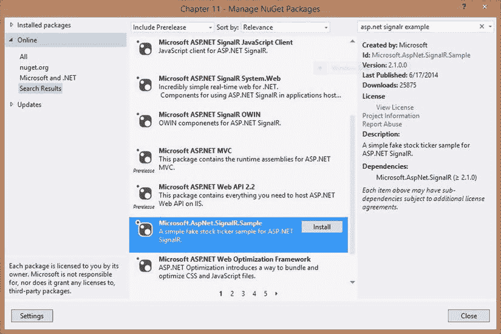
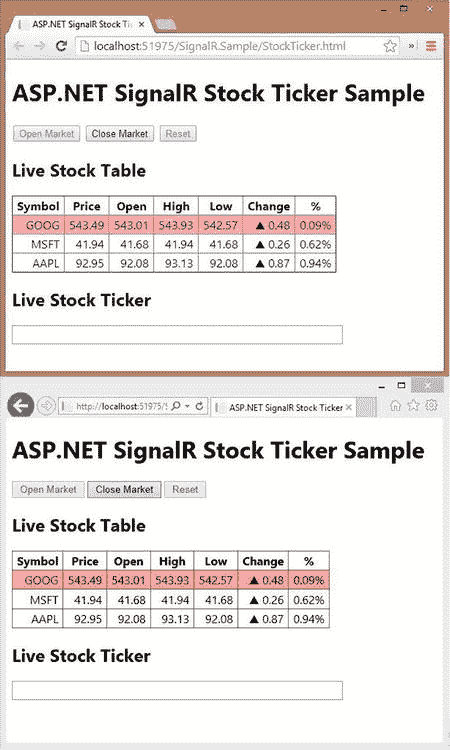

# 9.案例研究 1:股票行情自动收录器

恭喜你完成了这本书的这一部分。到目前为止，您已经阅读了专门介绍 ASP.NET SignalR 不同方面的章节，对这项强大的技术有了全面的了解。尽管我们试图通过基本示例独立地关注所有的概念、原则和技术，但是您必须在实践中一起应用它们。在我们为您提供一些真实世界的例子来应用所有这些原则并把所有的点连接起来之前，我们的工作还没有完成。

在本章和[第 11 章](http://dx.doi.org/10.1007/978-1-4302-6320-3_11)中，我们将讨论两个真实案例研究示例，以展示和应用您在前面章节中学到的许多概念。完成这两章后，您将对 ASP.NET SignalR 有一个非常好的实践知识，可以应用到您的日常开发任务中。

本章提供了一个实时股票更新的案例研究。本案例研究的目的是让用户能够实时了解他们股票的最新变化。它应用 ASP.NET 信号将最近的股票更新推给客户，使他们能够在这些信息可用时立即获得。

这个例子是用 hub 构建的(尽管用持久连接也是可行的)。以下是本章涵盖的主题的简要列表:

*   该应用编写方式概述
*   使该应用工作所需的主要组件
*   此示例的服务器端实现，包括中心、中心更新程序和域对象
*   这个例子的客户端实现，包括 HTML 和 JavaScript 代码

## 项目概述

微软 ASP.NET SignalR 团队在记录这项技术方面做了大量工作，其中很大一部分是提供的示例集。实际使用 ASP.NET SignalR 的一个最好的例子是一个简单的模拟股票报价器应用(通常称为 stock ticker ),它随 ASP.NET SignalR 的每次更新一起发布，并由微软根据 Apache 许可证授权。

这个例子的目的是让开发人员开始使用 ASP.NET 信号，并以实用的方式了解它的概念。我们提供了这个样本的讨论，因为我们相信这是一个伟大的展示 ASP.NET 信号。

这个例子可以在 NuGet 上获得，你可以从那里把它添加到你的项目中，就像我们在本章中所做的那样(见图 [9-1](#Fig1) )。

图 9-1。

Adding the sample code from NuGet to the project

将这个包添加到您的项目中后，您会在 web 项目中获得一个名为`SignalR.Sample`的新文件夹，以及这个示例所需的其他必要的库(例如，ASP.NET 信号库)。

在运行这个示例并看到输出之前，您还需要执行一个步骤:将 StockTicker 的启动类添加到您的 OWIN 启动中。清单 9-1 显示了这一点；您只需向其中添加一行代码(以粗体显示)。

清单 9-1。将 StockTicker 启动添加到项目中

`using Microsoft.Owin;`

`using Owin;`

`[assembly: OwinStartupAttribute(typeof(Chapter_11.Startup))]`

`namespace Chapter_11`

`{`

`public partial class Startup`

`{`

`public void Configuration(IAppBuilder app)`

`{`

`Microsoft.AspNet.SignalR.StockTicker.Startup.ConfigureSignalR(app);`

`ConfigureAuth(app);`

`}`

`}`

`}`

现在，在了解使其工作的不同组件之前，您可以测试这个示例。要测试这个应用，在两个不同的浏览器中导航到`∼/SignalR.Sample/StockTicker.html`,然后点击 Open Market 按钮。浏览器(Chrome 和 Internet Explorer)的输出如图 [9-2](#Fig2) 所示。

图 9-2。

StockTicker output shown in Chrome and Internet Explorer

现在应用正在运行，我们将在本章的剩余部分讨论这个示例的不同部分。StockTicker 是在 hubs 生态系统和其他几个助手类之上编写的。

## StockTicker 服务器端

首先，我们讨论 StockTicker 的服务器端实现，它由一个简单的 startup 类、一个 hub 类、一个后端 hub updater 类和一个表示股票的 domain 类组成。

### 启动

StockTicker 自带简单的 OWIN 启动类，我们已经从 web 项目的 OWIN 启动中调用了该类来运行示例。(参见[第 8 章](08.html)。)这个启动的代码如清单 9-2 所示。

清单 9-2。斯托克 OWIN 创业公司

`using Owin;`

`namespace Microsoft.AspNet.SignalR.StockTicker`

`{`

`public static class Startup`

`{`

`public static void ConfigureSignalR(IAppBuilder app)`

`{`

`// For more information on how to configure your application using OWIN startup, visit`[`http://go.microsoft.com/fwlink/?LinkID=316888`T3】](http://go.microsoft.com/fwlink/?LinkID=316888)

`app.MapSignalR();`

`}`

`}`

`}`

### 股票领域类别

我们需要在应用中表示股票，最好的方法是定义一个新的类(见清单 9-3)。

清单 9-3。股票领域类别

`using System;`

`namespace Microsoft.AspNet.SignalR.StockTicker`

`{`

`public class Stock`

`{`

`private decimal _price;`

`public string Symbol { get; set; }`

`public decimal DayOpen { get; private set; }`

`public decimal DayLow { get; private set; }`

`public decimal DayHigh { get; private set; }`

`public decimal LastChange { get; private set; }`

`public decimal Change`

`{`

`get`

`{`

`return Price - DayOpen;`

`}`

`}`

`public double PercentChange`

`{`

`get`

`{`

`return (double)Math.Round(Change / Price, 4);`

`}`

`}`

`public decimal Price`

`{`

`get`

`{`

`return _price;`

`}`

`set`

`{`

`if (_price == value)`

`{`

`return;`

`}`

`LastChange = value - _price;`

`_price = value;`

`if (DayOpen == 0)`

`{`

`DayOpen = _price;`

`}`

`if (_price < DayLow || DayLow == 0)`

`{`

`DayLow = _price;`

`}`

`if (_price > DayHigh)`

`{`

`DayHigh = _price;`

`}`

`}`

`}`

`}`

`}`

股票的属性在这里声明；有些属性，如`Change`、`PercentChange`和`Price`，是基于该类中的其他属性计算的。

### 斯托克勒克中心

StockTicker 服务器端实现的下一个重要过程是它的 hub 实现(见清单 9-4)。

清单 9-4。StockTicker Hub 实施

`using System;`

`using System.Collections.Generic;`

`using System.Linq;`

`using Microsoft.AspNet.SignalR.Hubs;`

`namespace Microsoft.AspNet.SignalR.StockTicker`

`{`

`[HubName("stockTicker")]`

`public class StockTickerHub : Hub`

`{`

`private readonly StockTicker _stockTicker;`

`public StockTickerHub() :`

`this(StockTicker.Instance)`

`{`

`}`

`public StockTickerHub(StockTicker stockTicker)`

`{`

`_stockTicker = stockTicker;`

`}`

`public IEnumerable<Stock> GetAllStocks()`

`{`

`return _stockTicker.GetAllStocks();`

`}`

`public string GetMarketState()`

`{`

`return _stockTicker.MarketState.ToString();`

`}`

`public void OpenMarket()`

`{`

`_stockTicker.OpenMarket();`

`}`

`public void CloseMarket()`

`{`

`_stockTicker.CloseMarket();`

`}`

`public void Reset()`

`{`

`_stockTicker.Reset();`

`}`

`}`

`}`

这个 hub 非常简单，它应用了一个`StockTicker`类作为后端业务逻辑和数据提供者(参见[第三章](03.html))。它有方法获得所有的股票，获得市场的状态(`Open`或`Closed`)，打开市场，关闭市场，或重置一切。这些方法的内部实现在接下来讨论的`StockTicker`类中完成。这是一个非常简单明了的集线器实现。

### StockTicker 后端提供程序

StockTicker 的主要业务逻辑和数据提供者是一个名为`StockTicker`的类(这并不奇怪)。这个稍微长一点的类的实现如清单 9-5 所示。我们将在接下来的小节中讨论这个实现部分。

清单 9-5。StockTicker 业务逻辑和数据提供者

`using System;`

`using System.Collections.Concurrent;`

`using System.Collections.Generic;`

`using System.Threading;`

`using Microsoft.AspNet.SignalR.Hubs;`

`namespace Microsoft.AspNet.SignalR.StockTicker`

`{`

`public class StockTicker`

`{`

`// Singleton instance`

`private readonly static Lazy<StockTicker> _instance = new Lazy<StockTicker>(`

`() => new StockTicker(GlobalHost.ConnectionManager.GetHubContext<StockTickerHub>().Clients));`

`private readonly object _marketStateLock = new object();`

`private readonly object _updateStockPricesLock = new object();`

`private readonly ConcurrentDictionary<string, Stock> _stocks = new ConcurrentDictionary<string, Stock>();`

`// Stock can go up or down by a percentage of this factor on each change`

`private readonly double _rangePercent = 0.002;`

`private readonly TimeSpan _updateInterval = TimeSpan.FromMilliseconds(250);`

`private readonly Random _updateOrNotRandom = new Random();`

`private Timer _timer;`

`private volatile bool _updatingStockPrices;`

`private volatile MarketState _marketState;`

`private StockTicker(IHubConnectionContext<dynamic> clients)`

`{`

`Clients = clients;`

`LoadDefaultStocks();`

`}`

`public static StockTicker Instance`

`{`

`get`

`{`

`return _instance.Value;`

`}`

`}`

`private IHubConnectionContext<dynamic> Clients`

`{`

`get;`

`set;`

`}`

`public MarketState MarketState`

`{`

`get { return _marketState; }`

`private set { _marketState = value; }`

`}`

`public IEnumerable<Stock> GetAllStocks()`

`{`

`return _stocks.Values;`

`}`

`public void OpenMarket()`

`{`

`lock (_marketStateLock)`

`{`

`if (MarketState != MarketState.Open)`

`{`

`_timer = new Timer(UpdateStockPrices, null, _updateInterval, _updateInterval);`

`MarketState = MarketState.Open;`

`BroadcastMarketStateCh` `ange(MarketState.Open);`

`}`

`}`

`}`

`public void CloseMarket()`

`{`

`lock (_marketStateLock)`

`{`

`if (MarketState == MarketState.Open)`

`{`

`if (_timer != null)`

`{`

`_timer.Dispose();`

`}`

`MarketState = MarketState.Closed;`

`BroadcastMarketStateChange(MarketState.Closed);`

`}`

`}`

`}`

`public void Reset()`

`{`

`lock (_marketStateLock)`

`{`

`if (MarketState != MarketState.Closed)`

`{`

`throw new InvalidOperationException("Market must be closed before it can be reset.");`

`}`

`LoadDefaultStocks();`

`BroadcastMarketReset();`

`}`

`}`

`private void LoadDefaultStocks()`

`{`

`_stocks.Clear();`

`var stocks = new List<Stock>`

`{`

`new Stock { Symbol = "MSFT", Price = 41.68m },`

`new Stock { Symbol = "AAPL", Price = 92.08m },`

`new Stock { Symbol = "GOOG", Price = 543.01m }`

`};`

`stocks.ForEach(stock => _stocks.TryAdd(stock.Symbol, stock));`

`}`

`private void``UpdateStockP`T2】

`{`

`// This function must be re-entrant as it's running as a timer interval handler`

`lock (_updateStockPricesLock)`

`{`

`if (!_updatingStockPrices)`

`{`

`_updatingStockPrices = true;`

`foreach (var stock in _stocks.Values)`

`{`

`if (TryUpdateStockPrice(stock))`

`{`

`BroadcastStockPrice(stock);`

`}`

`}`

`_updatingStockPrices = false;`

`}`

`}`

`}`

`private bool TryUpdateStockPrice(Stock stock)`

`{`

`// Randomly choose whether to udpate this stock or not`

`var r = _updateOrNotRandom.NextDouble();`

`if (r > 0.1)`

`{`

`return false;`

`}`

`// Update the stock price by a random factor of the range percent`

`var random = new Random((int)Math.Floor(stock.Price));`

`var percentChange = random.NextDouble() * _rangePercent;`

`var pos = random.NextDouble() > 0.51;`

`var change = Math.Round(stock.Price * (decimal)percentChange, 2);`

`change = pos ? change : -change;`

`stock.Price += change;`

`return true;`

`}`

`private void``BroadcastMarketStateChang`T2】

`{`

`switch (marketState)`

`{`

`case MarketState.Open:`

`Clients.All.marketOpened();`

`break;`

`case MarketState.Closed:`

`Clients.All.marketClosed();`

`break;`

`default:`

`break;`

`}`

`}`

`private void BroadcastMarketReset()`

`{`

`Clients.All.marketReset();`

`}`

`private void BroadcastStockPrice(Stock stock)`

`{`

`Clients.All.updateStockPrice(stock);`

`}`

`}`

`public enum MarketState`

`{`

`Closed,`

`Open`

`}`

`}`

让我们从这门课想要完成的目标的概述开始。为了简化实现，我们不依赖真实的数据提供者来提供股票数据。我们所做的是随机增加或减少股票价格一个特定的因素。我们还希望建立开放和关闭市场的机制，并重置整个过程，重新开始。这个类完成这项工作，并通过创建一个`StockTickerHub`类的实例并调用它的方法，将任何数据更改下推到所有客户机。

`StockTicker`类使用单例模式，所以类的消费者只使用一个特定的实例来访问方法和属性。它还应用了一个构造函数，将`StockTickerHub`上的客户端列表加载到一个属性中，以便在整个实现过程中使用。还有两个锁对象，`_marketStateLock`和`_updateStockPricesLock`，用于锁定对市场状态和股票价格的访问，以防止来自多个客户端的并发调用出现竞争情况。

private `LoadDefaultStocks()`方法加载一个默认股票列表，并用初始价格初始化这个包含微软、苹果和谷歌股票的列表。这些股票被添加到一个名为`_stocks`的并发字典中，该字典保存股票，股票名称作为键，股票数据作为值。

这个类的其余部分由一些试图完成前面提到的目标的方法组成；我们在这里概述他们的目的。

`OpenMarket()`方法在市场状态对象上使用一个锁来应用一个`Timer`对象，用随机数据定期更新股票价格，然后通过`BroadcastMarketStateChange()`方法向所有客户端广播市场的状态变化。另一方面，`CloseMarket()`方法遵循相同的方法来关闭一个市场，并将这一变化传播给所有客户端(除了它简单地处置了`Timer`对象)。

如果市场处于`Closed`状态，则`Reset()`方法试图重置一切，并通过`BroadcastMarketReset()`方法将其广播给所有客户。

最后，`UpdateStockPrices()`方法锁定股票价格，并使用`TryUpdateStockPrice()`方法以确定的因子随机增加或减少给定股票的价格。它以`BroadcastStockPrice()`方式向所有客户端广播。

## StockTicker 客户端

本节讨论 StockTicker 的客户端实现，它由一个 HTML 文件、一个 CSS 文件和一些 JavaScript 代码组成。我们不需要担心 CSS 部分，因为它只处理应用的修饰；我们只讨论 HTML 和 JavaScript 方面。

### 超文本标记语言

清单 9-6 显示了 StockTicker 的 HTML 代码。

清单 9-6。StockTicker HTML

`<!DOCTYPE html>`

`<html xmlns="`[`http://www.w3.org/1999/xhtml`](http://www.w3.org/1999/xhtml)T2】

`<head>`

`<title>ASP.NET SignalR Stock Ticker</title>`

`<link href="StockTicker.css" rel="stylesheet" />`

`</head>`

`<body>`

`<h1>ASP.NET SignalR Stock Ticker Sample</h1>`

`<input type="button" id="open" value="Open Market" />`

`<input type="button" id="close" value="Close Market" disabled="disabled" />`

`<input type="button" id="reset" value="Reset" />`

`<h2>Live Stock Table</h2>`

`
`

`<table border="1">`

`<thead>`

`<tr><th>Symbol</th><th>Price</th><th>Open</th><th>High</th><th>Low</th><th>Change</th><th>%</th></tr>`

`</thead>`

`<tbody>`

`<tr class="loading"><td colspan="7">loading...</td></tr>`

`</tbody>`

`</table>`

`
`

`<h2>Live Stock Ticker</h2>`

`
`

`
`

`<ul>`

`<li class="loading">loading...</li>`

`</ul>`

`
`

`
`

``

``

``

``

``

`</body>`

`</html>`

这个 HTML 很简单，它引用了 jQuery、ASP.NET SignalR、动态集线器代理和 StockTicker JavaScript 文件。它还定义了三个按钮来打开、关闭和重置市场；并定义了保存股票信息的表。JavaScript 代码实时更新这个表的内容。

### Java Script 语言

这个应用的最后一部分是 JavaScript 代码，它将 HTML 元素连接到 ASP.NET SignalR 上的动态中心代理，如清单 9-7 所示。

清单 9-7。StockTicker JavaScript

`/// <reference path="../Scripts/jquery-1.10.2.js" />`

`/// <reference path="../Scripts/jquery.signalR-2.1.0.js" />`

`/*!`

`ASP.NET SignalR Stock Ticker Sample`

`*/`

`// Crockford's supplant method (poor man's templating)`

`if (!String.prototype.supplant) {`

`String.prototype.supplant = function (o) {`

`return this.replace(/{([^{}]*)}/g,`

`function (a, b) {`

`var r = o[b];`

`return typeof r === 'string' || typeof r === 'number' ? r : a;`

`}`

`);`

`};`

`}`

`// A simple background color flash effect that uses jQuery Color plugin`

`jQuery.fn.flash = function (color, duration) {`

`var current = this.css('backgroundColor');`

`this.animate({ backgroundColor: 'rgb(' + color + ')' }, duration / 2)`

`.animate({ backgroundColor: current }, duration / 2);`

`};`

`$(function () {`

`var ticker = $.connection.``stockTicker`T2】

`up = '▲',`

`down = '▼',`

`$stockTable = $('#stockTable'),`

`$stockTableBody = $stockTable.find('tbody'),`

`rowTemplate = '<tr data-symbol="{Symbol}"><td>{Symbol}</td><td>{Price}</td><td>{DayOpen}</td><td>{DayHigh}</td><td>{DayLow}</td><td>{Direction} {Change}</td><td>{PercentChange}</td></tr>',`

`$stockTicker = $('#stockTicker'),`

`$stockTickerUl = $stockTicker.find('ul'),`

`liTemplate = '<li data-symbol="{Symbol}">{Symbol} {Price} {Direction} {Change} ({PercentChange})</li>';`

`function formatStock(stock) {`

`return $.extend(stock, {`

`Price: stock.Price.toFixed(2),`

`PercentChange: (stock.PercentChange * 100).toFixed(2) + '%',`

`Direction: stock.Change === 0 ? '' : stock.Change >=0 ? up : down,`

`DirectionClass:``stock`T2】

`});`

`}`

`function scrollTicker() {`

`var w = $stockTickerUl.width();`

`$stockTickerUl.css({ marginLeft: w });`

`$stockTickerUl.animate({ marginLeft: -w }, 15000, 'linear', scrollTicker);`

`}`

`function stopTicker() {`

`$stockTickerUl.stop();`

`}`

`function init() {`

`return ticker.server.getAllStocks().done(function (stocks) {`

`$stockTableBody.empty();`

`$stockTickerUl.empty();`

`$.each(stocks, function () {`

`var stock = formatStock(this);`

`$stockTableBody.append(rowTemplate.supplant(stock));`

`$stockTickerUl.append(liTemplate.supplant(stock));`

`});`

`});`

`}`

`// Add client-side hub methods that the server will call`

`$.extend(ticker.client, {`

`updateStockPrice: function (stock) {`

`var displayStock = formatStock(stock),`

`$row = $(rowTemplate.supplant(displayStock)),`

`$li = $(liTemplate.supplant(displayStock)),`

`bg = stock.LastChange < 0`

`? '255,148,148' // red`

`: '154,240,117'; // green`

`$stockTableBody.find('tr[data-symbol=' + stock.Symbol + ']')`

`.replaceWith($row);`

`$stockTickerUl.find('li[data-symbol=' + stock.Symbol + ']')`

`.replaceWith($li);`

`$row.flash(bg, 1000);`

`$li.flash(bg, 1000);`

`},`

`marketOpened: function () {`

`$("#open").prop("disabled", true);`

`$("#close").prop("disabled", false);`

`$("#reset").prop("disabled", true);`

`scrollTicker();`

`},`

`marketClosed: function () {`

`$("#open").prop("disabled", false);`

`$("#close").prop("disabled", true);`

`$("#reset").prop("``disabled`T2】

`stopTicker();`

`},`

`marketReset: function () {`

`return init();`

`}`

`});`

`// Start the connection`

`$.connection.hub.start()`

`.then(init)`

`.then(function () {`

`return ticker.server.getMarketState();`

`})`

`.done(function (state) {`

`if (state === 'Open') {`

`ticker.client.marketOpened();`

`} else {`

`ticker.client.marketClosed();`

`}`

`// Wire up the buttons`

`$("#open").click(function () {`

`ticker.server.openMarket();`

`});`

`$("#close").click(function () {`

`ticker.server.closeMarket();`

`});`

`$("#reset").click(function () {`

`ticker.server.reset();`

`});`

`})` `;`

`});`

这段代码的第一部分是一些装饰效果的简单 JavaScript 代码。`formatStock()`方法简单地格式化股票的属性，以便更好地表示。`scrollTicker()`方法围绕股票数据的滚动创建一个动画，`stopTicker`在用户界面(UI)上停止数据动画。`init()`方法执行一个常见的任务:连接客户端和 ASP.NET SignalR hubs 代理之间的点以获取股票，并遍历它们以在客户端上显示每只股票。

这段 JavaScript 代码的其余部分很容易理解:它只需启动中枢，获取市场状态，并在市场开盘或收盘时应用必要的更改。

## 摘要

本章展示了 StockTicker，这是微软为 ASP.NET 信号公司提供的一个例子。StockTicker 是一个实时股票价格系统，实时显示股票价格的变化。

我们将这个应用分为两个部分，服务器和客户端，并分别讨论了每个部分的不同组件，以描述这个应用是如何工作的。