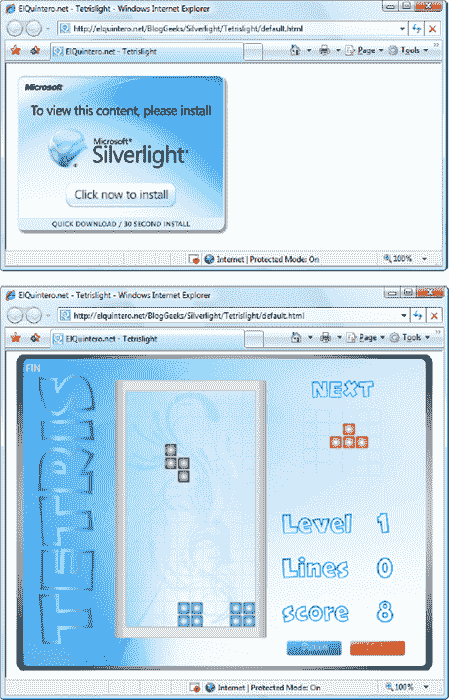

## 简介

Silverlight 是一个框架，用于构建运行在各种操作系统上的丰富的、浏览器托管的应用。Silverlight 通过一个浏览器插件发挥其魔力。当您浏览包含 Silverlight 内容的网页时，该浏览器插件会运行，执行代码，并在页面的特定指定区域呈现该内容。重要的是，Silverlight 插件提供了一个比传统的 HTML 和 JavaScript 混合环境更丰富的环境。谨慎而巧妙地使用，您可以创建播放视频、具有硬件加速 3D 图形和使用矢量动画的 Silverlight 页面。

### 了解 Silverlight

Silverlight 使用一种熟悉的技术来超越标准 web 页面的功能:一种轻量级浏览器插件。

插件模式的优势在于，用户只需安装一个组件，就可以看到由不同的人和公司创建的内容。安装插件需要下载少量内容，并强制用户在至少一个安全对话框中确认操作。这需要很短但确定的时间，这是一个明显的不便。然而，一旦安装了插件，浏览器就可以无缝地处理任何使用该插件的内容，而不会有进一步的提示。

[图 1](#fig_int_1) 显示了包含 Silverlight 内容的页面的两个视图。如果你*没有*安装 Silverlight 插件，你可以在顶部看到这个页面。此时，您可以单击“获取 Microsoft Silverlight 图片”以转到 Microsoft 的网站，在那里会提示您安装插件，然后返回到原始页面。底部是安装 Silverlight 插件后您将看到的页面。

***图 1。**安装 Silverlight 插件*

 **注意**在撰写本文时，Silverlight 4 安装在大约 75%的联网计算机上(包括桌面和移动设备)。如果只考虑 Windows 操作系统或 Interent Explorer 浏览器，这一份额会更高。虽然这令人印象深刻，但与 Flash 相比就相形见绌了，Flash 的版本 10 或更高版本安装在 96%的网络设备上。(要获取最新统计数据，请参考[www.riastats.com。](http://www.riastats.com)

#### Silverlight 系统要求

对于任何以网络为中心的技术，兼容尽可能多的计算机和设备都是非常重要的。尽管 Silverlight 不是完全跨平台的，但是它的兼容性在大多数桌面计算机上都很好。

目前，Silverlight 支持:

> *Windows 电脑:* Silverlight 可以在装有 Windows 7、Windows Vista 和 Windows XP 的电脑上运行。Silverlight 支持的最低浏览器版本是 Internet Explorer 6、Firefox 1.5 和 Google Chrome 4.0。Silverlight 也可以在 Windows 2000 中工作，但只能在 Internet Explorer 6 中使用。目前不支持其他浏览器，如 Opera 和 Safari(Windows 版)。
> 
> *Mac 电脑:* Silverlight 可以在装有 OS X 10.4.8 或更高版本的 Mac 电脑上运行，前提是这些电脑安装了英特尔硬件(相对于较旧的 PowerPC 硬件)。Silverlight 支持的最低浏览器版本是 Firefox 2 和 Safari 3。Silverlight 不能在移动苹果设备上运行，包括 iPhone、iPod Touch 和 iPad。
> 
> *Linux 计算机:*虽然 Silverlight 5 不能在 Linux 上运行，但 Mono 团队已经创建了一个开源的 Linux 实现，名为 Moonlight。上一个正式发布的版本支持 Silverlight 2 应用，尽管也有一个支持 Silverlight 4 的发布的预览版。进展缓慢，不确定何时(以及是否)会有支持 Silverlight 5 的月光。
> 
> Windows Phone: Silverlight 也是 Windows Phone 7 的两个开发框架之一(另一个是专注于游戏的微软 XNA)。然而，为 Windows Phone 开发会引起一些独特的考虑，并且有一些微妙的功能差异。想了解更多关于 WP7 开发的知识，可以参考专门的书，像 *Pro Windows Phone 7 开发*。

安装 Silverlight 需要一个易于下载的小型安装程序(大约 6MB)。这使它能够提供非常重要的“无摩擦”设置体验，就像 Flash 一样。

#### Silverlight 与 Flash

最成功的浏览器插件是 Adobe Flash，它安装在世界上 90%以上的网络浏览器上。Flash 有着十多年的悠久历史，最初是添加动画图形的简单工具，后来逐渐发展成为开发交互式内容的平台。

这完全合理。NET 开发人员创建使用 Flash 内容的网站。但是，这样做需要单独的设计工具，以及完全不同的编程语言(ActionScript)和编程环境(Flex)。此外，没有直接的方法将 Flash 内容与服务器端集成。NET 代码。例如，创建调用。NET components 充其量是笨拙的。使用服务器端。NET 代码来呈现 Flash 内容(例如，一个自定义的 ASP.NET 控件，吐出一个 Flash 内容区域)要困难得多。

这就是 Silverlight 适合的情况。Silverlight 旨在将 Flash 的原始功能和跨平台支持与包含. NET 基本概念的一流编程平台相结合。因此，开发人员可以使用与服务器端代码相同的语言(如 C#和 VB)为 Silverlight 编写客户端代码，并使用许多相同的抽象(包括流、控件、集合、泛型和 LINQ)。总之，对于。对于富 Internet 应用来说，Silverlight 是一个更方便、更强大的选择。

#### Silverlight 与 HTML5

当 Silverlight 最初被创建时，它是作为构建丰富网页的通用方法，是 Adobe Flash 的竞争对手。然而，在此后的几个 Silverlight 版本中，世界已经发生了变化。尽管 Adobe Flash 仍然受到几乎所有台式电脑的支持，但它已经被 iPhone 和 iPad 等流行的苹果产品拒之门外。因此，移动世界正在转向不同的解决方案，包括原生应用(仅限于一种操作系统)或 HTML5。

一个广泛的共识是 HTML5 将来会成为网络的未来。然而，HTML5 承诺的功能(当它被完全采用时)仍然远远低于今天 Flash 和 Silverlight 中可用的功能。对于某些应用，这些缺点无关紧要。而且，毫无疑问，HTML5 的功能在未来将会增强。但与此同时，开发人员现在被迫在功能(如果他们需要的话)和对所有计算机和移动设备尽可能广泛的兼容性(如果他们需要的话)之间做出选择。这种困境也被描述为*富裕*对*到达*。Silverlight 是这个等式的另一边——它为应用提供了最强大和最成熟的特性集。HTML5 是可及的，因为它包含了所有现代桌面浏览器。

由于这种剧变，许多 Silverlight 开发人员不确定他们最喜欢的技术在 web 开发世界中的确切位置。虽然未来还远未确定，但有几点要记住:

> HTML5 还没有到来: HTML5 在 Internet Explorer 中的支持滞后。尚未发布的 IE 10 承诺了许多 HTML5 功能，一些功能在相对较新的 IE 9 中可用，但 IE 8 没有 HTML5 智能。这是一个问题，因为 IE 8 是可以在仍然广泛使用的 Windows XP 平台上运行的最好的 IE 版本。出于所有这些原因，HTML5 目前仍然比 Silverlight 少得到*和*的支持，这种情况可能需要几年才能改变。
> 
> Silverlight 拥有 HTML5 无法比拟的特性:即使在提供最好的 HTML5 支持的浏览器中，在几个关键领域仍落后于 Silverlight。它们无法提供相同的视频流功能、相同的硬件加速显卡或相同的深度网络支持。它们也不支持文件访问、浏览器外应用或调用 Windows 系统组件的能力。很难想象 HTML5 *会*复制 Silverlight 的一些更专业的功能，比如将数据过滤、流体动画和图像缩放融合在一个易于使用的包中的 PivotViewer 控件([第 21 章](21.html#ch21))。
> 
> Silverlight 有一个更高级的编程 API: 像数据绑定、样式和模板这样的特性对于构建一个应用来说可能不是必不可少的，但是对于快速高效地构建一个应用来说却是非常重要的。HTML5 中的许多可能实现的事情对于除了最有纪律的人之外的所有人来说都是可管理性的噩梦。众所周知，JavaScript 语言对语法错误的处理非常宽松，所有的动画程序都必须手工编写，多线程支持也很笨拙。
> 
> Silverlight 拥有顶级开发工具:有了 Visual Studio，您可以像构建桌面程序一样轻松地构建 Silverlight 应用。将 Expression Blend 添加到图片中，您还可以定义和定制丰富的图形效果，如动画。
> 
> Silverlight 提供 ASP.NET 集成:特别是，Silverlight 使得通过 web 服务查询服务器端数据库变得很容易。这种情况导致一些开发人员推测，即使 HTML5 最终征服了世界，Silverlight 仍将是封闭公司网络内业务线开发的首选。

没人能确定 Silverlight 的未来。它可能继续作为的首选平台。NET 开发人员创建商业应用，或者它可能会逐渐过渡到一个更专业的工具，用于尖端游戏和视频播放器。然而，有一件事是确定的——Silverlight 永远不会取代 HTML 成为创建传统公共网站的主要语言——也不打算这么做。

#### Silverlight 与 Metro(和 Windows 8)的对比

当微软宣布 Windows 8，并为富客户端应用提供了另一种编程模型时，Silverlight 开发人员犹豫了。一些人想知道这项名为 Metro 的技术是否会最终取代 Silverlight。

答案显然是否定的。Metro 旨在促进一种完全不同的应用:一种轻量级、以触摸为中心的数据消耗型应用，可以在下一代 Windows 8 平板电脑上运行。实际上，Metro 是 iPad 上本地应用的竞争对手，也是微软另一个丰富的桌面编程框架 WPF 的潜在继任者(见下一节)。然而，Metro 应用无法在非微软平台上运行，也无法在除 Windows 8 之外的任何其他版本的 Windows 上运行。因此，Silverlight 开发人员对它们没什么兴趣。

在未来，Silverlight 应用的范围可能会缩小，挤在逐渐变得更加复杂的跨平台 HTML5 应用和移动设备的原生 Metro 或 iPad 应用之间。然而，今天 Silverlight 仍然占据着这些其他技术之间非常重要的空间。

#### Silverlight 和 WPF

Silverlight 最有趣的方面之一是，它借用了 WPF 用于丰富的客户端用户界面的模型。

WPF 是一个构建丰富的 Windows 应用的工具包。WPF 是值得注意的，因为它不仅通过一组强大的高级功能简化了开发，还通过 DirectX 管道渲染一切来提高性能。要了解 WPF，可以参考 C# 2010 (Apress)中的 *Pro WPF。*

Silverlight 显然无法复制 WPF 的功能，因为其中许多功能都非常依赖于操作系统的功能，包括 Windows 特定的显示驱动程序和 DirectX 技术。然而，Silverlight 没有为客户端开发发明一套全新的控件和类，而是使用了 WPF 模型的一个子集。如果你对 WPF 有过任何体验，你会惊讶地发现 Silverlight 和它的老大哥如此相似。以下是一些常见的细节:

> 要定义 Silverlight 用户界面(组成 Silverlight 内容区域的元素集合)，可以使用 XAML 标记，就像使用 WPF 一样。您甚至可以使用相同的数据绑定语法将数据映射到显示器。
> 
> Silverlight 从 WPF 借用了许多相同的基本控件，以及相同的样式系统(用于标准化和重用格式)，和类似的模板机制(用于更改标准控件的外观)。
> 
> 要在 Silverlight 中绘制 2D 图形，需要使用形状、路径、变换、几何图形和画笔，所有这些都与 WPF 图形非常相似。
> 
> Silverlight 提供了一个基于故事板的声明式动画模型，其工作方式与 WPF 的动画系统相同。
> 
> 要显示视频或播放音频文件，可以使用 MediaElement 类，就像在 WPF 一样。

 **注** WPF 并没有完全与网络这个容易部署的世界隔绝。WPF 允许开发者创建名为 XBAPs (XAML 浏览器应用)的浏览器托管应用。这些应用可以无缝下载，本地缓存，并直接在浏览器窗口中运行，所有这些都没有安全提示。然而，尽管 XBAPs 可以在 Internet Explorer 和 Firefox 中运行，但与 Silverlight 不同，它们仍然是一种仅限于 Windows 的技术。

#### Silverlight 的演变

Silverlight 1 是一项相对温和的技术。它包括 2D 绘图功能和媒体播放支持。然而，它不包括 CLR 引擎或对。NET 语言，所以开发人员被迫用 JavaScript 编码。

Silverlight 2 是一个巨大的变化。它添加了 CLR。NET 框架类和一个基于 WPF 的用户界面模型。因此，Silverlight 2 是微软历史上最受期待的版本之一。

自那以后，Silverlight 的版本就没有这么雄心勃勃了。Silverligh 5 保持了 silverligh 2 中建立的相同开发模型，但是添加了一组精心挑选的特性和性能增强。它们的亮点包括:

> *性能提升:* Silverlight 5 启动速度更快，支持 64 位浏览器，并提供更干净、更清晰的小尺寸文本渲染。
> 
> *矢量打印:* Silverlight 改进了其打印模型，尽可能使用矢量打印(即，如果打印驱动程序支持 PostScript)。结果是打印速度更快，内存开销更少([第 9 章](09.html#ch9))。
> 
> *硬件加速的 3D 图形:* Silverlight 在微软 XNA 框架的一部分上移植，用于构建 Xbox 游戏。随之而来的是一个用于渲染 3D 场景的强大但非常低级的界面。最棒的是，显卡完成了所有的工作，确保了出色的性能([第 13 章](13.html#ch13))。
> 
> *低延迟声音:*微软 XNA 的另一个好处是 Silverlight 新增了对低延迟声音播放的支持。这对于不能承受丝毫延迟的游戏来说尤其有用(《T2》第 12 章)。
> 
> *特技播放:*一种新的褶边可以让你更快或更慢地播放视频，而不改变音频的音高。这允许用户以他们喜欢的速度获取他们的内容(例如，观看演讲的视频)([第 12 章](12.html#ch12))。
> 
> *双击和三击:*一个小的增强解决了长期困扰 Silverlight 的烦恼。现在，您可以轻松区分单击和代表双击的连续两次单击。Silverlight 甚至允许你寻找三次点击([第四章](04.html#ch4))。
> 
> *远程媒体控制支持:*现在可以对来自遥控器或带媒体控制按钮的增强型键盘的播放命令做出反应，前提是你的应用运行在全屏模式下([第 12 章](12.html#ch12))。
> 
> *Pivot viewer:* 这个一体化的控件为您提供了一种独特的新方式来呈现大量数据。它结合了可缩放的图片、数据过滤和流畅的动画来创建无缝的观看体验。最棒的是，你几乎不需要添加一行自己的代码([第 21 章](21.html#ch21))。
> 
> *XAML 调试:*你现在可以通过在你的数据绑定表达式中放置一个断点来排除数据绑定错误([第 20 章](20.html#ch20))。
> 
> 子窗口:浏览器外的应用现在可以显示二级窗口，就像真正的 windows 应用一样。他们甚至不需要高层的信任([第十八章](18.html#ch18))。
> 
> *完全文件访问和 P/Invoke:* 以提升的信任运行的应用现在可以轻松访问用户可以访问的硬盘上的任何文件(需要管理员权限的文件除外)。他们还可以在 Windows 计算机上使用 P/Invoke 来调用遗留的 C 函数或 Windows API ( [第 18 章](18.html#ch18))。
> 
> *提升信任度的浏览器内应用:*这种新的应用结合了提升信任度的优势和普通 Silverlight 应用的简化免安装部署。但是有一个重要的问题——这个选项只在受控的环境中可行(比如说，在公司网络中),在那里你可以在你所有的客户机上配置证书([第 18 章](18.html#ch18))。

 **注**这本书包含了你掌握 Silverlight 5 所需的一切。你不需要任何 Silverlight 以前版本的经验。然而，如果你*已经用 Silverlight 4 开发了*,你会喜欢每一章介绍后面的“新功能”提示框。他们指出了 Silverlight 5 的新特性，因此您可以关注它的变化和增强。

**SILVERLIGHT 5 中的向后兼容性**

此时，您可能想知道旧的 Silverlight 应用是否可以在只安装了最新版本的 Silverlight 插件(版本 5)的计算机上运行。这是一个合理的问题，因为 Silverlight 5 引入了一些微妙的变化和错误修复，可以影响应用的工作方式，甚至改变其行为。

然而，Silverlight 5 通过使用其*怪癖模式*特性来防止这些差异导致问题。当 Silverlight 5 插件加载为早期版本的 Silverlight 编译的应用时，它会自动切换到 quirks 模式，尝试模拟适当的 Silverlight 运行时环境的行为。

关于 Silverlight 5 和 Silverlight 4 之间的突破性变化的更多详细信息，可以参考[http://tinyurl.com/6hkgtmp](http://tinyurl.com/6hkgtmp)。

### 关于这本书

这本书是针对专业开发人员对 Silverlight 的深入探索。您不需要任何 WPF 或 Silverlight 以前版本的经验，但是您需要知道。NET 平台、C#语言和 Visual Studio 开发环境。

#### 使用这本书需要什么

为了*运行* Silverlight 应用，你只需要 Silverlight 浏览器插件，它可以在 http://silverlight.net 的[获得。为了*创建* Silverlight 应用(并打开本书包含的示例项目)，您需要 Visual Studio 2010 和 Silverlight 5 工具。虽然在撰写本文时它们还处于测试阶段，但你可以通过在微软下载中心搜索“Silverlight 5 tools”](http://silverlight.net)[www.microsoft.com/download](http://www.microsoft.com/download)下载最新版本。

或者，您可以使用 Expression Blend(一种面向图形的设计工具)来创建、构建和测试 Silverlight 应用。总的来说，Expression Blend 是为那些花时间创造严肃的视觉效果的图形设计人员设计的，而 Visual Studio 是代码繁重的应用程序员的理想选择。本书假设您使用的是 Visual Studio。如果你想了解更多关于 Expression Blend 的知识，你可以查阅相关的书籍。

#### Silverlight 工具包

为了了解 Silverlight 的最新发展，您还应该下载微软令人印象深刻的 Silverlight 工具包，它提供了一组扩展 Silverlight 功能的控件和组件。只需添加一个程序集引用，就可以在 Silverlight 应用中使用它们。

Silverlight 工具包不仅仅是一个有用的工具包。这也是一个逐渐将新控件引入 Silverlight 平台的开发过程。许多新控件首先出现在 Silverlight Toolkit 中，逐渐完善，然后迁移到核心平台。从 Silverlight 工具包跳到核心 Silverlight 插件的控件示例包括 AutoCompleteBox、TreeView 和 Viewbox。

为了理解这个过程是如何工作的，你需要了解更多关于 Silverlight Toolkit 的*质量带*——特定进化阶段的控件组。Silverlight 工具包将其功能分为四个质量等级:

> *成熟:*成熟带具有不太可能改变的控制。通常，这些控件已经包含在核心 Silverlight 插件中。然而，Silverlight Toolkit 允许您访问它们的完整源代码，这为定制提供了可能性。
> 
> 稳定:稳定带包括几乎可以包含在任何应用中的控件——然而，未来可能会有进一步的调整和修复，微妙地改变行为。这本书描述了许多稳定的控件，包括 DockPanel、WrapPanel 和 Expander。
> 
> 预览:预览区包括对大多数应用来说足够可靠的控件，但可能会根据开发人员的评论进行更改，因此您希望在使用新版本之前更改您的代码。
> 
> *Experimental:*Experimental band 包括新的控件，旨在征求开发人员的反馈。你可以随意使用它们，但是将它们包含在应用中的风险由你自己承担。

要了解更多关于不同质量波段的信息，请通过现场演示试用控件，或者下载 Silverlight 工具包，前往[http://silverlight.codeplex.com](http://silverlight.codeplex.com)。在撰写本文时，Silverlight 工具包的当前版本被称为“Silverlight 4 工具包”，但它在 Silverlight 5 上也能很好地工作。

#### 代码示例

查看 Apress 网站或[www.apress.com](http://www.apress.com)下载最新的代码样本是个好主意。您需要这样做来测试本书中描述的大多数更复杂的代码示例，因为不太重要的细节通常会被忽略。这本书集中在最重要的部分，所以你不需要费力地通过不必要的额外页面来理解一个概念。

#### 反馈

这本书的宏伟目标是成为 Silverlight 编程的最佳教程和参考。为此，您的意见和建议非常有帮助。你可以直接向 apress@prosetech.com 发送抱怨、奉承和其他信息。我不能解决你的 Silverlight 问题或者评论你的代码，但是我会从这本书的对错之处(或者它以一种完全混乱的方式做了什么)的信息中受益。

### 最后一句话

如你所见，Silverlight 5 是微软的最新版本。基于. NET 的、插件驱动的 web 编程环境。Silverlight 作为 Flash 的竞争对手开始了它的生命。今天，它仍然是构建需要高性能图形、动画和视频的丰富应用的平台。对某些人来说，它是。NET，您可以在没有安装问题的情况下部署使用它。对于其他人来说，这是一种让硬件加速的 3D 游戏在浏览器中运行的方式。对于另外一些人来说，它是最成熟、最高效的跨平台业务应用框架——前提是你不需要支持移动设备。无论未来几年网络走向何方，Silverlight 将继续为一些最令人印象深刻的富互联网应用提供动力。