## C H A P T E R 1

## Silverlight 简介

在简介中，您了解了支撑 Silverlight 的设计理念。现在，您已经准备好动手创建您的第一个 Silverlight 应用了。

编写 Silverlight 应用的最佳起点是 Visual Studio，它是微软的首要开发工具。在本章中，您将看到如何使用 Visual Studio 创建、编译和部署 Silverlight 应用。在此过程中，您将快速了解 Silverlight 控件如何响应事件，您将看到 Silverlight 应用是如何针对 Web 进行编译和打包的，并且您将考虑承载 Silverlight 内容的两种选择:要么在普通的 HTML 网页中，要么在 ASP.NET WebForm中。

### Silverlight 设计工具

尽管手动创建 Silverlight 应用所需的文件在技术上是可行的，但专业开发人员总是使用开发工具。如果你是一个图形设计师，这个工具可能是 Microsoft Expression Blend，它提供了设计视觉丰富的用户界面的完整功能。如果你是一名开发人员，你可能会使用 Visual Studio，它包括用于编码、测试和调试的全面的工具。

因为这两种工具对 Silverlight 应用模型都很熟悉，所以您可以轻松地创建一个包含这两种工具的工作流。例如，开发人员可以用 Visual Studio 创建一个基本的用户界面，然后将它交给一个优秀的设计团队，他们会用 Expression Blend 中的自定义图形对它进行润色。翻新完成后，设计人员将项目交付给开发人员，开发人员继续在 Visual Studio 中编写和改进代码。

许多开发人员走得更远:他们在自己的计算机上安装两个应用，同时加载它们，并在运行时在它们之间切换。他们使用 Visual Studio 执行核心编程任务，如代码编写和调试，并切换到 Expression Blend 来增强用户界面，例如，编辑控件模板、选择颜色、优化动画和绘制简单的矢量艺术(这种来回的过程很有效，因为一旦您在一个程序中保存了更改，其他程序就会注意到。当您切换回来时，它会提示您执行快速刷新以加载新版本。唯一的诀窍是你需要记得在转换前保存。)是否使用这种方法取决于您自己，但是即使您使用了，Visual Studio 也将是您开发的起点和中心。

最后，值得注意的是，微软正在努力设计另一个使用 Silverlight 的开发工具，名为 Visual Studio LightSwitch。对于 LightSwitch，重点是使用模板和代码生成来快速构建复杂的应用。理想的 LightSwitch 用户是希望使用 Silverlight 前端快速创建数据驱动应用的业务开发人员。然而，LightSwitch 也可以作为构建更复杂的项目的起点，这些项目将在 Visual Studio 中进一步完善和定制。LightSwitch 不在本书中，但是你可以从`[www.microsoft.com/visualstudio/lightswitch](http://www.microsoft.com/visualstudio/lightswitch)`了解更多关于它的信息(并下载一个测试版)。或者，查看使用 Silverlight 5 的*专业商务应用(Apress，2011)，其中有一章专门讨论这个主题。*

#### Visual Studio 与 Expression Blend

如果您仍然试图理解 Visual Studio 和 Expression Blend 是如何融合的，这里有一个快速概述:

> *   *Visual Studio* : It has everything needed to develop Silverlight applications, and has a visual designer for Silverlight pages. With this designer, you can drag and drop and draw your user interface (which is not always the best idea), and you can get a real-time preview of what it will look like (which is very useful).
> *   *Expression blend* : It provides rich support for creating Silverlight user interface, and has visualization tools beyond Visual Studio. This is a great help for some types of heavy user interface work (for example, creating a beautiful gradient fill). Expression Blend also supports an interesting application prototype tool SketchFlow, and includes a decent coding editor designed to look like Visual Studio. However, it lacks many advanced and important development tools, such as debugging, code refactoring and project source control.

 **注意** Visual Studio 2010 包括对创建 Silverlight 3 项目的完全支持。但是要创建 Silverlight 5 项目，您需要用于 Visual Studio 2010 的 Silverlight 5 工具。如果你计划在 Silverlight 5 中使用 Expression Blend，你(目前)需要使用一个名为 Expression Blend Preview for Silverlight 5 的测试版。你可以从微软下载中心下载这两个工具(在`[www.microsoft.com/download](http://www.microsoft.com/download)`搜索 *Silverlight 5* )。

本书假设您主要使用 Visual Studio。您将偶尔获得 Expression Blend(以及其他与 Silverlight 配合使用的 Expression 产品，包括 Expression Design 绘图工具和 Expression Encoder 视频编码工具)的提示。但如果你真的想掌握 Expression Blend，你应该考虑一本关于该主题的专门书籍，花一个下午做实验，或者看看微软在`[http://expression.microsoft.com/cc136535.aspx](http://expression.microsoft.com/cc136535.aspx)`的 Expression Blend 培训视频。

#### 了解 Silverlight 网站

您可以在 Visual Studio 或 Expression Blend 中创建两种类型的 Silverlight 网站:

> *   *An ordinary website with HTML pages* : In this case, the entry point of Silverlight application is a basic HTML file containing Silverlight content area.
> *   *ASP.NET website* : In this case, Visual Studio creates two projects-one containing Silverlight application files and the other containing the server-side ASP.NET website to be deployed with Silverlight files. The entry point of Silverlight application can be an ordinary HTML file or a ASP.NET Web page containing server-generated content.

那么，哪种方法最好呢？无论您选择哪个选项，您的 Silverlight 应用都将以相同的方式运行——客户端浏览器将接收一个 HTML 文档，其中将包含一个 Silverlight 内容区域，Silverlight 代码将在本地计算机上运行，*而不是*web 服务器。然而，ASP.NET 的 web 方式使得混合 ASP.NET 和 Silverlight 内容变得更加容易。在下列情况下，这通常是更好的方法:

> *   You want to create a website with ASP.NET pages and Silverlight enhanced pages.
> *   You want to create a Silverlight application that calls a web service, and you want to design the web service (and deploy it to the same web server). You want to indirectly generate Silverlight content using a dedicated ASP.NET Web control.

另一方面，如果你不需要编写任何服务器端代码，那么创建一个成熟的 ASP.NET 网站就没有什么意义了。您将在本书中看到的许多 Silverlight 应用都使用基本的纯 HTML 网站。这些例子只包括需要特定服务器端功能的 ASP.NET 网站。例如，第 20 章中的例子使用了一个包含 web 服务的 ASP.NET 网站。这个 web 服务允许 Silverlight 应用从 web 服务器上的数据库中检索数据，如果没有服务器端代码，这是不可能的。你将在[第 19 章](19.html#ch19)中学习如何为 Silverlight 设计 ASP.NET web 服务。

**向现有网站添加 SILVERLIGHT 内容**

在考虑 Silverlight 开发模型时要记住的一个关键点是，在许多情况下，您将使用 Silverlight 来*扩充*您网站的现有内容，其中仍然包括大量的 HTML、CSS 和 JavaScript。例如，您可以添加一个 Silverlight 内容区域，该区域显示广告或允许对网站的一部分进行增强体验(如玩游戏、完成调查、与产品交互或进行虚拟旅行)。您可以使用 Silverlight 增强页面以更吸引人的方式呈现网站中已有的内容，或者为拥有 Silverlight 插件的用户提供增值功能。

当然，也可以创建一个仅支持 Silverlight 的网站，这是一种更大胆的方法。主要缺点是 Silverlight 没有像 Flash 等其他 web 技术那样广泛安装，并且不支持传统客户端，如运行 Windows ME 或 Windows 2000 操作系统的客户端。因此，Silverlight 的覆盖范围远不如普通 HTML。许多采用 Silverlight 的企业正在用它来区别于其他拥有尖端内容的在线竞争对手，但他们并没有放弃他们的传统网站。

### 创建独立的 Silverlight 项目

开始使用 Silverlight 最简单的方法是创建一个普通的网站，包含 HTML 页面，没有服务器端代码。以下是如何:

> 在 Visual Studio 中选择
> 
> 1.  File  Create a new  project, select the project type of Visual C #  Silverlight group, and then select Silverlight application template. As usual, before clicking OK to create the project, you need to select a project name and a location on the hard disk.
> 2.  此时，Visual Studio 将提示您选择是否要创建一个完整的 ASP.NET 网站，该网站可以与您的 Silverlight 项目一起运行服务器端代码(参见[图 1-1](#fig_1_1) )。取消选中“在一个新的网站中托管 Silverlight 应用”选项以保持简单。在下面，选择你想要创建的 Silverlight 应用的版本。如果您没有使用 Silverlight 5 中的任何新功能，那么 Silverlight 4 的覆盖范围会稍微大一点(在撰写本文时，它仍然安装在更多的计算机上)。如果您尚未安装 Silverlight 5 Tools for Visual Studio 2010，您将无法选择创建 Silverlight 5 应用。
>     
>      **提示**你可以在创建开发版本后随时更改它。为此,只需双击解决方案资源管理器中的属性节点,并更改目标开发版本列表中的选择点击 OK 继续并创建项目。

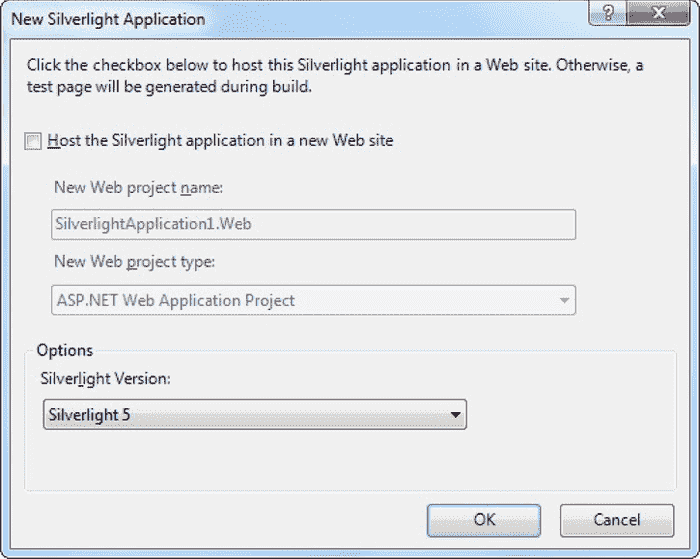

***图 1-1。**选择不包含 ASP.NET 网站*

每个 Silverlight 项目都从一小组基本文件开始，如图 1-2 所示。所有以扩展名结尾的文件。xaml 使用一种叫做 XAML 的灵活的标记标准，你将在下一章详细讨论它。所有以扩展名结尾的文件。cs 保存着驱动你的应用的 C#源代码。

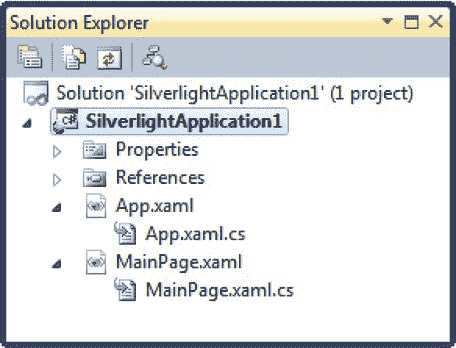

***图 1-2。**一个 Silverlight 项目*

以下是[图 1-2](#fig_1_2) 中显示的文件概要:

> *   *app.xaml and app.xaml.cs* : These files configure your Silverlight application. They allow you to define the resources available for all pages in the application (see chapter 2 of [), and they allow you to respond to application events, such as startup, shutdown and error situations (see chapter 6 of](02.html#ch2) ). In the newly generated project, the startup code in the App.xaml.cs file specifies that your application should start by displaying MainPage.xaml
> *   *mainpage.xaml* : This file defines the user interface (collection of controls, images and text) that will be displayed for your first page. Technically, Silverlight page is a *UserControl* -a custom class derived from usercontrol. Silverlight applications can contain as many pages as you want—to Add more pages, just select Project  Add New Item, select Silverlight user control template, select a file name, and then click Add.
> *   *mainpage.xaml.cs* : This file contains the code that supports your first page, including event handlers that respond to user actions.

 **注意**在本书的前几章，你将创建只有一个页面的应用。在第 6 章中，你将仔细看看设置初始页面的应用逻辑。在第 7 章的[中，你将完全摆脱这种约束，学习合并页面和从一个页面导航到另一个页面所需的技术。](07.html#ch7)

除了这四个基本文件之外，如果你仔细研究，你会发现更多的成分。在解决方案资源管理器的“属性”节点下，您将找到一个名为 AppManifest.xml 的文件，该文件列出了您的应用使用的程序集。您还会发现一个名为 AssemblyInfo.cs 的文件，它包含有关您的项目的信息(如项目的名称、版本和发布者),这些信息是在编译 Silverlight 程序集时嵌入到其中的。这两个文件都不应该手动编辑，而是在添加引用或设置项目属性时由 Visual Studio 进行修改。

最后，Silverlight 应用的网关是一个自动生成但隐藏的 HTML 测试页面，名为*project name*TestPage.html。所以如果你的项目是 SilverlightApplication1，那么这个页面被命名为 SilverlightApplication1TestPage.html(见[图 1-3](#fig_1_3) )。若要查看该文件，请确保您至少编译过一次应用。然后，单击解决方案资源管理器顶部的“显示所有文件”按钮，并展开 Bin\Debug 文件夹(应用就是在该文件夹中编译的)。测试页面文件包含一个创建 Silverlight 内容区域的<对象>元素。在这一章的后面你会更仔细地看它。

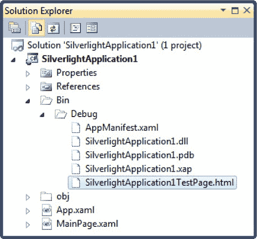

***图 1-3。**HTML 测试页面*

### 创建一个简单的 Silverlight 页面

正如您已经了解到的，每个 Silverlight 页面都包括一个定义视觉外观的标记部分(XAML 文件)和一个包含事件处理程序的源代码文件。要定制您的第一个 Silverlight 应用，您只需打开 MainPage.xaml 文件并开始添加标记。

Visual Studio 为您提供了两种查看每个 XAML 文件的方式——作为可视预览(称为*设计图面*)或底层标记(称为 *XAML 视图*)。默认情况下，Visual Studio 显示两部分，一部分堆叠在另一部分上。[图 1-4](#fig_1_4) 显示了这个视图，并指出你可以用来改变你的有利位置的按钮。

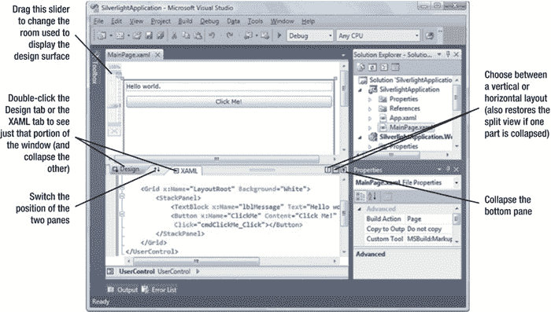

***图 1-4。**查看 XAML 页面*

通过在工具箱中选择一个控件，然后将其“绘制”到设计图面上，可以开始设计 XAML 页。然而，这种便利不会让你免于学习 XAML 的全部错综复杂。要将元素组织到正确的布局容器中，更改它们的属性，连接事件处理程序，并使用 Silverlight 功能，如动画、样式、模板和数据绑定，您需要手动编辑 XAML 标记。事实上，在许多情况下，您会发现当您拖放页面时 Visual Studio 生成的标记可能不是您真正想要的。

 **注意**在 Silverlight 术语中，满足这些标准的每个图形小部件(出现在窗口中，由. NET 类表示)被称为*元素*。术语*控件*通常用于接收焦点并允许用户交互的元素。例如，TextBox 是一个控件，但 TextBlock 不是。

首先，您可以尝试创建如下示例所示的页面，该页面定义了一个文本块和一个按钮。粗体部分已经添加到 Visual Studio 在您创建项目时生成的基本页面模板中。

`<UserControl x:Class="SilverlightApplication1.MainPage"

  xmlns:x="http://schemas.microsoft.com/winfx/2006/xaml"
  xmlns:d="http://schemas.microsoft.com/expression/blend/2008"
  xmlns:mc="http://schemas.openxmlformats.org/markup-compatibility/2006"
  mc:Ignorable="d" d:DesignWidth="300" d:DesignHeight="400">` `    <Grid x:Name="LayoutRoot" Background="White">
        **<StackPanel>**
            **<TextBlock x:Name="lblMessage" Text="Hello world."**
             **Margin="5"></TextBlock>**
            **<Button x:Name="cmdClickMe" Content="Click Me!" Margin="5"></Button>**
        **</StackPanel>**
    </Grid>
</UserControl>`

这将创建一个由两个元素堆叠排列的页面。顶部是一段简单的信息文本。下面是一个按钮。

#### 添加事件处理代码

您使用属性将事件处理程序附加到页面中的元素，这与开发人员在 ASP.NET WPF 和 JavaScript 中采用的方法相同。例如，Button 元素公开了一个名为 Click 的事件，该事件在用鼠标或键盘触发按钮时触发。要对此事件作出反应，需要将 Click 属性添加到 Button 元素中，并将其设置为代码中某个方法的名称:

`<Button x:Name="cmdClickMe"  **Click**="cmdClickMe_Click" Content="Click Me!"
 Margin="5"></Button>`

 **提示**虽然这不是必需的，但是以 *ElementName_EventName* 的形式命名事件处理方法是一个常见的约定。如果元素没有定义的名称(大概是因为您不需要在代码中的任何其他地方与它交互)，考虑使用它*会有的名称*。

此示例假设您已经创建了一个名为 cmdClickMe_Click 的事件处理方法。下面是它在 MainPage.xaml.cs 文件中的样子:

`private void cmdClickMe_Click(object sender, RoutedEventArgs e)
{
    lblMessage.Text = "Goodbye, cruel world.";
}`

通过双击设计图面上的元素，或者单击“属性”窗口中的“事件”按钮，然后双击适当的事件，可以添加事件处理程序。

如果您已经编写了所需的事件处理程序，则可以使用 IntelliSense 快速将其附加到正确的事件。首先输入属性名，然后输入等号。此时，Visual Studio 将弹出一个菜单，列出所有具有正确语法来处理该事件且当前存在于您的代码隐藏类中的方法，如图[图 1-5](#fig_1_5) 所示。只需选择正确的事件处理方法。

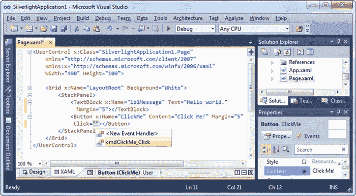

***图 1-5。**附加一个事件处理器*

通过添加一个事件属性并选择菜单中的<new event="" handler="">选项，可以使用 Visual Studio(任一版本)一步创建并分配一个事件处理程序。</new>

 **提示**要从 XAML 快速跳转到事件处理代码，请在标记中右键单击适当的事件属性，然后选择“导航到事件处理程序”。

也可以用代码连接事件。这样做的地方是页面的构造函数，在调用 InitializeComponent()之后，初始化所有的控件。下面是前面显示的 XAML 标记的等效代码:

`public MainPage()
{
    InitializeComponent();
**    cmdClickMe.Click += cmdClickMe_Click;**
}`

如果您需要动态创建一个控件，并在窗口生存期的某个时间点附加一个事件处理程序，则代码方法非常有用。相比之下，当窗口对象第一次被实例化时，你在 XAML 挂接的事件总是被附加的。代码方法也允许你保持你的 XAML 更简单和更流畅，如果你计划与非程序员，比如一个设计艺术家分享它，这是完美的。缺点是大量的样板代码会使您的代码文件变得混乱。

如果你想分离一个事件处理程序，代码是你唯一的选择。您可以使用`-=`运算符，如下所示:

`cmdClickMe.Click -= cmdClickMe_Click;`

从技术上讲，将同一个事件处理程序多次连接到同一个事件是可能的，但这几乎总是编码错误的结果。(在这种情况下，事件处理程序将被多次触发。)如果您试图删除一个已经连接了两次的事件处理程序，该事件仍然会触发该事件处理程序，但只是一次。

**SILVERLIGHT 类库**

要编写实用的代码，您需要对您要使用的类有相当多的了解。这意味着获得 Silverlight 附带的核心类库的全面知识。

的 Silverlight 版本。NET 框架在两个方面得到了简化。首先，它没有提供您将在全文中找到的类型的绝对数量。NET 框架。其次，它包含的类通常不提供构造函数、方法、属性和事件的完整补充。相反，Silverlight 只保留最重要的类中最实用的成员，这使得它有足够的功能来创建令人惊讶的代码。

您会发现许多 Silverlight 类都有公共接口，类似于它们在。NET 框架。然而，这些类的实际管道非常不同。所有的 Silverlight 类都被从头开始重写，尽可能的精简和高效。

#### 测试 Silverlight 应用

现在，您已经有足够的东西来测试您的 Silverlight 项目了。当您运行 Silverlight 应用时，Visual Studio 会启动您的默认 web 浏览器并导航到隐藏的浏览器测试页面，名为*project name*TestPage.html。测试页创建一个新的 Silverlight 控件，并使用 MainPage.xaml 中的标记对其进行初始化。

 **注意** Visual Studio 将测试页面设置为项目的起始页。因此，当您启动项目时，该页面将被加载到浏览器中。通过在解决方案资源管理器中右击另一个 HTML 文件并选择“设为起始页”,可以选择不同的起始页。

[图 1-6](#fig_1_6) 显示了前面工作中的例子。当您单击该按钮时，事件处理代码运行，文本发生变化。这个过程完全发生在客户端——不需要像 ASP.NET 这样的服务器端编程框架那样联系服务器或回发页面。所有 Silverlight 代码都是在客户端由缩小版的。NET 嵌入在 Silverlight 插件中。

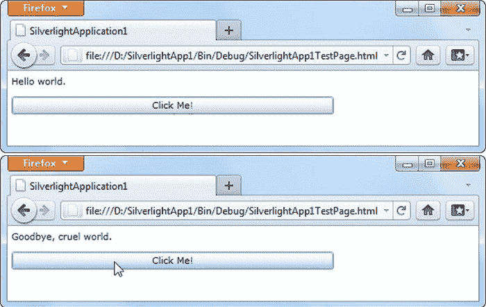

***图 1-6。**运行 Silverlight 应用(在 Firefox 中)*

如果你在一个普通的网站上托管你的主机 Silverlight 内容(没有服务器端 ASP。在测试过程中，Visual Studio 不会使用其集成的 web 服务器。相反，它只是直接从文件系统中打开 HTML 测试页面。(你可以在[图 1-6](#fig_1_6) 的地址栏看到这个。)

在某些情况下，这种行为可能会导致测试环境和部署环境之间的差异，部署环境将使用成熟的 web 服务器通过 HTTP 提供页面服务。最明显的区别是安全上下文—换句话说，您可以配置您的 web 浏览器以允许本地网页执行远程 web 内容不能执行的操作。在实践中，这通常不是问题，因为 Silverlight 总是在一个精简的安全上下文中执行，并且不包含任何针对可信位置的额外功能。这简化了 Silverlight 开发模型，并确保特性不会在某些环境下工作，而在其他环境下会中断。然而，在生产测试 Silverlight 应用时，创建一个 ASP.NET 测试网站(如下一节所述)或者更好地将 Silverlight 应用部署到测试 web 服务器是一个好主意。

### 创建一个 ASP。NET 承载的 Silverlight 项目

尽管 Silverlight 本身做得非常好，但是您也可以开发、测试和部署 Silverlight 应用，作为 ASP.NET 网站的一部分。如果您希望 Silverlight 应用与基于服务器的功能(如 web 服务、文件上传、TCP 通信等)进行交互，您需要采用这种方法。您还需要使用这种方法来测试某些特性，比如自定义启动页面和浏览器外应用的设置过程。

 **注意**本书包含的例子通常使用独立的 Silverlight 应用。这些解决方案仅在需要时包含 ASP.NET 网站(例如，提供服务器端功能或允许测试需要它的特定功能)。

以下是如何创建一个 Silverlight 项目和一个在同一解决方案中使用它的 ASP.NET 网站:

> 5.在 Visual Studio 中选择 File  New  Project，选择项目类型的 Visual c#·Silverlight 组，然后选择 Silverlight 应用模板。使用“为解决方案创建目录”选项是个好主意，这样您就可以将 Visual Studio 将创建的两个项目组合在一起，一个用于 Silverlight 程序集，一个用于 ASP.NET 网站。
> 
> 6.通常，Visual Studio 假定您希望使用最新、最好的。NET 用于您创建的任何 web 应用的服务器端部分。如果这不是您想要的，您可以选择不同版本的。NET 从“新建项目”窗口顶部的下拉列表中选择。例如，如果你选择。NET Framework 3.5，您的 ASP.NET 网站将被配置为使用这个稍旧的. NET 版本
> 
> 7.一旦您选择了解决方案名称和项目名称，单击 OK 创建它。
> 
> 8.确保选中“在新网站中托管 Silverlight 应用”选项。
> 
> 9.为 ASP.NET 网站提供一个项目名称。默认情况下，它是添加了文本的项目名称。末端腹板，如图[图 1-7](#fig_1_7) 所示。
> 
> 10.在下面的下拉列表中，选择希望 Visual Studio 管理项目的方式—作为 ASP.NET web 应用项目、ASP.NET 网站或 ASP.NET MVC 项目。这个选择对 Silverlight 的工作方式没有影响，但是本书中的例子使用了 ASP.NET 网站。

**ASP.NET 网络项目对 ASP.NET 网站**

当您使用 ASP.NET 应用创建 Silverlight 项目时，Visual Studio 允许您在三个不同的项目选项之间进行选择。您的选择不会影响您的 Silverlight 编码，但可能会改变您使用网站 ASP.NET 部分的方式。

如果选择 ASP.NET Web 应用项目，Visual Studio 将使用项目文件来跟踪 Web 应用的内容。在运行站点之前，它还会将网页中的所有 ASP.NET 代码编译成一个程序集。

如果您选择 ASP.NET 网站，Visual Studio 会简单地假设应用文件夹中的所有内容都是您的 Web 应用的一部分。您的网页代码将在用户第一次请求页面时编译(或者当您使用预编译工具 aspnet_compiler.exe 时)。

如果您选择 ASP.NET MVC Web 项目，您将得到与 ASP.NET Web 应用项目相同的编译模型。但是，您的站点将被配置为使用简化的 ASP.NET MVC 开发模式，而不是经典的(也是更流行的)WebForm模型。

更多关于 web 项目和无项目网站的区别，以及 ASP.NET MVC 的信息，请参考 C# 2010 中的*Pro ASP.NET 4。*

> 11.在 Silverlight 版本列表中选择是否要创建 Silverlight 5 或 Silverlight 4 应用。
> 
> 12.您还可以选择启用 WCF RIA 服务，这是一组 web 服务，帮助您在 Silverlight 的客户端世界和 ASP.NET 的服务器端世界之间架起一座桥梁。对于基本 Silverlight 网站，请不要选中此选项。

 **注意** WCF RIA 服务需要单独下载(`[www.silverlight.net/getstarted/riaservices](http://www.silverlight.net/getstarted/riaservices)`)，不在本书讨论之列。然而，在[第 19 章](19.html#ch19)中，你会得到关于 web 服务的介绍，它们的基础技术。有关更多信息，请访问下载网站或阅读使用 Silverlight 5 的专业商务应用。

> 13.最后，单击 OK 创建解决方案。

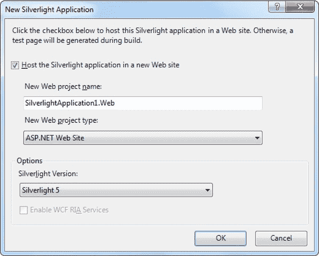

***图 1-7。**创建一个 ASP.NET 网站来托管 Silverlight 内容*

 **注意**如果你创建一个普通的纯 HTML 网站，你可以在任何网络服务器上托管它。在这种情况下，web 服务器有一项简单的工作——当浏览器请求 HTML 文件时，它只需发送这些文件。如果您决定创建一个 ASP.NET 网站，您的应用的要求会发生变化。尽管您的应用的 Silverlight 部分仍将在客户端上运行，但您包含的任何 ASP.NET 内容都将在 web 服务器上运行，该服务器必须安装了 ASP.NET 引擎。

有两种方法可以将 Silverlight 内容集成到 ASP.NET 应用中:

> *   *Create HTML files with Silverlight content* : You put these files in the folder of your ASP.NET website, just like you do any other ordinary HTML files. The only limitation of this method is that your HTML file obviously can't contain ASP.NET control, because it won't be processed on the server.
> *   *Put Silverlight content in ASP.NET webpage* : In this case, the < object > element loaded with Silverlight plug-in is inserted into a dynamic. Aspx page. You can add other ASP.NET controls to different areas of this page. The only disadvantage of this method is that pages are always processed on the server. If you don't actually use any server-side ASP.NET content, there will be a little extra overhead, which is not needed when the page is first requested.

当然，你也可以混合使用这两种方法，在同一站点的专用 HTML 页面和 ASP.NET 网页中使用 Silverlight 内容。当您在 Visual Studio 中创建一个带有 ASP.NET 网站的 Silverlight 项目时，您将同时启动这两个项目。例如，如果您的 Silverlight 项目名为 SilverlightApplication1，则可以使用 SilverlightApplication1TestPage.html 或 silverlightapplication 1 test page . aspx

图 1-8 显示了 Silverlight 和 ASP.NET 解决方案是如何开始的。除了这两个测试页面，ASP.NET 网站还包括一个 Default.aspx 页面(可用作 ASP.NET 网站的入口点)、一个 web.config 文件(允许您配置各种网站设置)和一个 Silverlight.js 文件(具有用于创建和初始化 Silverlight 内容区域的 JavaScript helper 函数)。

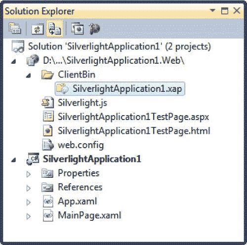

***图 1-8。**创建一个 ASP.NET 网站来托管 Silverlight 内容*

Silverlight 和 ASP.NET 选项提供了与纯 Silverlight 解决方案基本相同的调试体验。运行该解决方案时，Visual Studio 会编译这两个项目，并将 Silverlight 程序集复制到 ASP.NET 网站的 ClientBin 文件夹中。(这类似于程序集引用—如果 ASP.NET 网站引用私有 DLL，Visual Studio 会自动将该 DLL 复制到 Bin 文件夹中。)

两个项目编译完成后，Visual Studio 会查看启动项目(ASP.NET 网站)并查找当前选定的页面。然后，它启动默认浏览器并导航到该页面。不同之处在于，它不直接从文件系统请求起始页。相反，它与其内置的测试 web 服务器进行通信。该 web 服务器自动加载到随机选择的端口。它的作用类似于缩小版的 IIS，但只接受来自本地计算机的请求。这使您无需配置 IIS 虚拟目录即可轻松调试。图 1-9 显示了你之前考虑过的 Silverlight 应用，但是由 ASP.NET 托管。

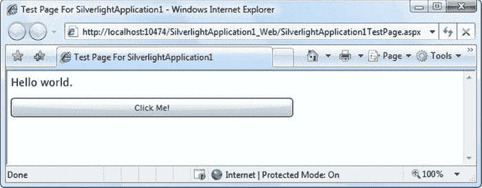

***图 1-9。**包含 Silverlight 内容的 ASP.NET 页面*

要从 ASP.NET 项目导航到不同的页面，您可以在浏览器的地址栏中键入内容。

 **注意**记住，在构建 Silverlight 和 ASP.NET 解决方案时，您要将所有 Silverlight 文件和代码添加到 Silverlight 项目中。ASP.NET 网站使用最终编译的 Silverlight 程序集，并通过其一个或多个网页提供该程序集。

#### 呈现 Silverlight 内容的 ASP.NET 控件

在过去，想要整合 Silverlight 内容的 ASP.NET 开发人员通常依赖于一个专门设计的名为 Silverlight 的 ASP.NET web 控件。

像所有 ASP.NET 控件一样，Silverlight 控件是在服务器上处理的。当 ASP.NET 引擎将页面呈现为 HTML 时，Silverlight 控件发出定义 Silverlight 内容区域的<object>元素。最终结果是，客户端获得的内容与普通的非 ASP。NET 承载的 Silverlight 应用。但是，服务器端编程模型有点不同。</object>

使用 web 控件生成 Silverlight 内容区域的优点是，它为服务器端交互提供了可能性。例如，服务器端代码可以动态设置 Silverlight 控件的 Source 属性以指向不同的应用。然而，ASP.NET Silverlight 控件很少提供与服务器代码进行真正交互的机会。最终，它很少比<object>元素多了一个包装器。如果您确实想在新项目中使用 Silverlight 和 MediaPlayer 控件，您可以从`[http://code.msdn.microsoft.com/aspnetprojects](http://code.msdn.microsoft.com/aspnetprojects)`下载它们的源代码。</object>

#### 混合 ASP.NET 控件和 Silverlight 内容

本书中几乎所有的例子都使用了 HTML 测试页面。然而，更多雄心勃勃的 ASP.NET 开发者可能会使用 Silverlight 为现有的 ASP.NET 页面添加新的功能(或者只是粉饰一下)。示例包括 Silverlight 支持的广告内容、菜单系统和嵌入式小程序(如计算器或游戏)。当创建这样的页面时，需要考虑一些因素。

如你所知，所有 ASP.NET 代码都运行在网络服务器上。为了运行服务器端代码，ASP.NET 控件使用回发机制将当前页发送回服务器。例如，当您单击 ASP.NET 按钮时，就会发生这种情况。问题是当页面回发时，当前的 Silverlight 应用结束。web 服务器代码运行，页面的新版本被发送到浏览器，浏览器加载这个新页面，此时 Silverlight 应用重新启动。这不仅会将用户送回起点，而且还会花费额外的时间，因为 Silverlight 环境必须重新初始化。

如果您想避免这种中断，您可以使用 ASP.NET AJAX 技术。一个特别有用的工具是 UpdatePanel。基本技术是将通常会触发回发的控件以及它们修改的任何其他控件包装到一个或多个 UpdatePanel 控件中。然后，当用户单击按钮时，异步请求被发送到 web 服务器，而不是完全回发。当浏览器收到回复时，它会更新页面的相应部分，而不会破坏 Silverlight 内容。

 **提示**关于 UpdatePanel 控件更详细的探索，请参考 C# 2010 中的*Pro ASP.NET 4。*

### Silverlight 编译和部署

现在，您已经看到了如何创建一个基本的 Silverlight 项目，添加一个包含元素和代码的页面，并运行您的应用，是时候深入了解一下了。在本节中，您将看到如何将 Silverlight 从 XAML 文件和源代码的集合转换成基于浏览器的丰富应用。

#### 编译 Silverlight 应用

当您编译 Silverlight 项目时，Visual Studio 使用您用于完全成熟的 csc.exe 编译器。NET 应用。然而，它引用了一组不同的程序集，并传入了命令行参数 *nostdlib* ，这阻止了 C#编译器使用标准库(的核心部分)。在 mscorlib.dll 中定义的。换句话说，Silverlight 应用可以像普通程序一样编译。NET 应用编写的标准 C#，只是有一个更有限的类库集合可以利用。Silverlight 编译模型有很多优点，包括易于部署和与普通 JavaScript 相比性能大大提高。

您编译的 Silverlight 程序集包含应用中每个页面的编译代码*和*XAML 文档，它们作为资源嵌入到程序集中。这确保了您的事件处理代码不会与其所需的用户界面标记分离。顺便提一下，XAML 没有以任何方式编译(不像 WPF，它将它转换成一种更优化的格式，称为 BAML)。

您的 Silverlight 项目被编译成一个以您的项目命名的 DLL 文件。例如，如果您有一个名为 SilverlightApplication1 的项目，csc.exe 编译器将创建文件 SilverlightApplication1.dll。项目程序集被转储到项目目录中的 Bin\Debug 文件夹中，还有一些其他重要文件:

> *   *A PDB file* : This file contains the information needed for debugging Visual Studio. It is named after your project assembly (for example, SilverlightApplication1.pdb).
> *   *Appmanifest.xaml* : This file lists the assembly dependencies.
> *   *Dependent assemblies* : T2】 :Bin \ Debug folder contains assemblies used by Silverlight projects, provided that the Copy Local property of these assemblies is set to True. Assemblies that are the core of Silverlight set Copy Local to False because they don't need to be deployed with your application (you can change the Copy Local setting by expanding the References node in Solution Explorer, selecting the assembly and using the Properties window).
> *   *Test page:* This is the entrance page for users to request to start Silverlight application.
> *   *An XAP file* : This is a Silverlight package that contains everything needed to deploy Silverlight applications, including application manifest, project assembly and any other assemblies used by the application. If you are developing an ASP. NET, Visual Studio will also copy the XAP file to the ClientBin folder in the test website.

当然，您可以使用 Visual Studio 项目属性更改程序集名称、默认命名空间(在添加新代码文件时使用)和 XAP 文件名(图 1-10)。只需双击解决方案资源管理器中的属性节点。

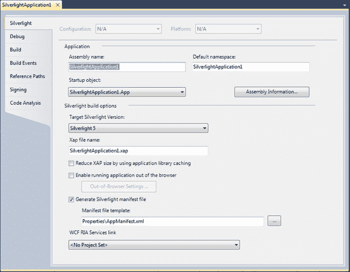

***图 1-10。** Silverlight 项目属性*

#### 部署 Silverlight 应用

一旦您理解了 Silverlight 编译模型，这是理解部署模型的一小步。XAP 的档案是关键部分。它将应用的单元(应用清单和程序集)包装到一个简洁的容器中。

从技术上讲，XAP 的文件是一个压缩档案。要验证这一点，请将 SilverlightApplication1.xap 这样的 XAP 文件重命名为 silverlightapplication 1 . xap . zip。然后，您可以打开归档文件并查看其中的文件。[图 1-11](#fig_1_11) 显示了本章前面显示的简单例子的 XAP 文件的内容。目前，它包括应用清单和应用程序集。如果您的应用使用附加程序集，如 System.Windows.Controls.dll，您也可以在 XAP 文件中找到它们。

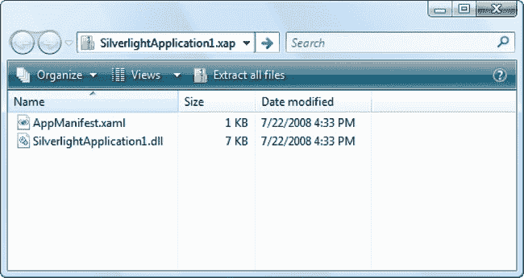

***图 1-11。**XAP 文件的内容*

XAP 文件系统有两个明显的好处:

> *   *It compresses your content* : Because the content will not be decompressed before reaching the client, it reduces the time required to download your application. This is especially important if your application contains a lot of static resources (see Chapter 6 of [), such as images or text blocks.](06.html#ch6)
> *   *It simplifies deployment* : When you are ready to enable Silverlight application, you only need to copy the XAP file to the web server, as well as the test page or similar HTML file (or ASP.NET webpage) containing Silverlight content area. You don't have to worry about tracking assemblies and resources.

多亏了 XAP 模型，在部署简单的 Silverlight 应用时不需要考虑太多。托管 Silverlight 应用只需要提供适当的 XAP 文件，这样客户端就可以通过浏览器下载并在本地机器上运行它。

**SILVERLIGHT 反编译**

既然您已经理解了支撑 Silverlight 项目的基础设施，那么就很容易看到如何对任何现有的应用进行反编译，以了解它是如何工作的。以下是如何:

> 1.  Browse to the HTML test page.
> 2.  Check the source code of the webpage and look for the < param > element that points to the XAP file.
> 3.  Enter a request for the XAP file in the address bar of the browser. (Keep the same domain, but replace the page name with a partial path to the XAP file. )
> 4.  Select save as to save the XAP file locally.
> 5.  The renamed XAP file. Zip extension. Then, open it and extract the project assembly. The assembly is normal to you. NET application. Like ordinary. NET assembly, which contains intermediate language (IL) code.
> 6.  Open the portfolio in tools such as reflector (`[www.redgate.com/products/reflector](http://www.redgate.com/products/reflector)`) to view IL and embedded resources. With the right plug-in, you can even decompile IL into C# syntax.

当然，许多 Silverlight 开发人员并不宽恕这种行为(很多。NET 开发人员不鼓励最终用户反编译他们的富客户端应用)。然而，这是 Silverlight 编译模型不可避免的副作用。

因为 IL 代码很容易被反编译或逆向工程，所以它不是存储秘密(如加密密钥、专有算法等)的合适地方。如果您需要执行使用敏感代码的任务，请考虑从 Silverlight 应用调用 web 服务。如果您只是想防止其他高手阅读您的代码和复制您的风格，您可能会对使用*模糊处理*工具提高门槛感兴趣，该工具使用许多技巧来扰乱您编译的代码中的结构和名称，而不改变其行为。Visual Studio 附带了一个名为 Dotfuscator 的按比例缩小的模糊处理工具，市场上还有许多其他工具。

#### Silverlight 核心组件

Silverlight 包括完整。NET 框架。虽然不可能填满整个。毕竟，这是一个 5MB 的下载，需要支持各种浏览器和操作系统，Silverlight 包含了大量的功能。

每个 Silverlight 项目都从引用以下程序集开始。所有这些程序集都是 Silverlight 运行时的一部分，因此它们不需要与您的应用一起部署。

> *   *mscorlib.dll* : This assembly is the Silverlight equivalent of the mscorlib.dll assembly, which contains NET framework. Silverlight version includes core data types, exceptions and interfaces in the System namespace. And general collections; File management class; And support for globalization, reflection, resources, debugging and multithreading.
> *   *System.dll* : This assembly contains additional generic collections, classes dealing with URIs and classes dealing with regular expressions.
> *   *System.Core.dll* : This assembly contains support for LINQ. The name of the assembly is the same as the full. NET framework.
> *   *System.Net.dll* : This assembly contains classes that support network, allowing you to download web pages and create socket-based connections.
> *   *System.Windows.dll* : This assembly contains many classes for building Silverlight user interface, including basic elements, shapes and brushes, classes that support animation and data binding, and a version of OpenFileDialog that supports independent storage. System.Windows.Browser.dll: This component contains classes that interact with HTML elements.
> *   *System.Xml.dll* : This assembly contains the most basic classes needed for XML processing: XmlReader and XmlWriter.

 **注意**Silverlight 集合中的某些成员仅对可用。并且不能从您的代码中调用。这些成员用 SecurityCritical 属性标记。但是，该属性不会出现在对象浏览器中，因此在您尝试使用某个特定功能之前，您将无法确定该功能在 Silverlight 应用中是否可用。(如果试图使用具有 SecurityCritical 属性的成员，将会出现 SecurityException。)例如，Silverlight 应用只能通过独立存储 API 或 OpenFileDialog 类来访问文件系统。因此，FileStream 类的构造函数由 SecurityCritical 属性修饰。

#### Silverlight 附加组件

Silverlight 的设计者已经着手保持核心框架尽可能的小。这种设计使得最初的 Silverlight 插件下载量小，安装速度快——对于各地的网络冲浪者来说，这是一个明显的卖点。

为了实现这个精简的目标，Silverlight 设计者从核心 Silverlight 运行时中移除了一些功能，并将其放在单独的附加程序集中。这些程序集仍然被认为是 Silverlight 平台的一部分，但是如果您想要使用它们，您需要将它们与您的应用打包在一起。这是一个明显的权衡，因为这会增加应用的下载量。(Silverlight 的内置压缩减轻了这种影响，您将在本章后面了解到这一点。)

在本书中，你将了解 Silverlight 的附加组件。最常用的方法如下:

> *   【系统。【windows . controls . dll】T0】:这个程序集包含了许多有价值但更专门化的控件,包括一个树形视图，一个 TabControl，两个日期控件(日期选择器和日历)和 GridSplitter .系统。Windows.Controls.Data.dll
> *   *: This component has DataGrid built from scratch by Silverlight, which is an ideal tool for displaying dense data grids, and DataPager, which enables it to divide the results into individually visible groups called *page* .*
> *   *System.Windows.Controls.Data.Input.dll* : This assembly contains some useful controls when building data-bound forms, including labels, description viewers and validation summaries.
> *   *System.Windows.Controls.Input.dll* : This assembly contains autocomplete box-a text box that drops down the suggestion list when the user types.
> *   *System.Windows.Controls.Navigation.dll* : This assembly contains frames and page controls, which are the foundation of Silverlight navigation system.

所有这些程序集都向 Silverlight 工具包添加了新的控件。微软还通过 Silverlight 工具包提供了更多的插件控件，你可以在`[www.codeplex.com/Silverlight](http://www.codeplex.com/Silverlight)`下载。

当您将控件从加载项程序集中添加到 Silverlight 页面上时，Visual Studio 会自动添加您需要的程序集引用。如果您选择该引用并查看“属性”窗口，您会看到“复制本地”属性被设置为 True，这与组成核心 Silverlight 运行时的其他程序集不同。因此，当您编译应用时，程序集将被嵌入到最终的包中。Visual Studio 足够智能，可以识别不属于核心 Silverlight 运行时的程序集，即使您手动添加它们，它也会自动将 Copy Local 设置为 True。

#### 汇编缓存

*程序集缓存*是一种部署技术，它允许你将依赖程序集从 XAP 文件中去掉。相反，您部署依赖程序集*和*您的 XAP 文件，将它们放在同一个文件夹中不同的 ZIP 文件中。目标是通过让客户端保留经常使用的程序集的缓存副本来减少应用的启动时间。

默认情况下，您在 Visual Studio 中创建的 Silverlight 应用未配置为使用程序集缓存。若要打开此功能，请双击解决方案资源管理器中的“属性”节点。然后，在图 1-10 的[所示的项目属性窗口中，打开设置“通过使用应用库缓存减少 XAP 大小”若要查看结果，请重新编译应用，单击解决方案资源管理器顶部的“显示所有文件”按钮，然后展开 Bin\Debug 文件夹。您将看到每个可缓存程序集的 ZIP 文件。例如，如果您的应用使用 System.Windows.Controls.dll，您将看到一个名为 System 的文件。XAP 文件旁边的 Windows.Controls.zip。该文件包含 System.Windows.Controls.dll 程序集的压缩副本。在启用程序集缓存之前持有此程序集的 XAP 不再拥有它的副本。](#fig_1_10)

如果您使用的是 ASP.NET 测试网站，Visual Studio 会将 XAP 文件和所有可缓存的程序集复制到网站的 ClientBin 文件夹中。[图 1-12](#fig_1_12) 显示了编译一个使用 System.Windows.Controls.dll 和 System.Windows.Controls.Navigation.dll 组件的应用后的结果。

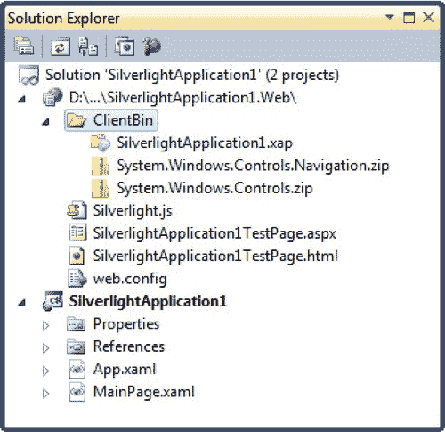

***图 1-12。**支持程序集缓存的依赖程序集*

程序集缓存减小了 XAP 文件的大小。较小的文件可以更快地下载，因此缩小 XAP 文件可以缩短应用的启动时间。但是最初，程序集缓存不会产生任何性能改进。这是因为客户端第一次运行 Silverlight 应用时，需要下载精简后的 XAP 和包含相关程序集的单独 ZIP 文件。下载的数据总量是相同的。

但是，当用户再次返回运行应用时，好处就会显现。浏览器将再次下载应用 XAP 文件。但是，因为依赖程序集仍然在浏览器缓存中，所以客户端不需要下载它们。

以下是一些有助于充分利用程序集缓存的注意事项:

> *   The downloaded assembly only lasts for the time of browser cache. If the user explicitly clears the cache, all cached assemblies will be removed.
> *   Every time the client runs the application, the application checks the new version of the cached assembly. If it finds a new version, it will download and replace the previously cached version.
> *   If an application downloads an assembly and puts it in the browser cache, another application that uses the assembly cache can use it. For large, infrequently changing assemblies, the benefits of assembly caching are greatest. Many assemblies are not that big, and the cost of downloading them every time the application starts is not significant. In this case, using the assembly cache will only complicate the deployment of the application.
> *   With a little effort, you can use the assembly cache for your class library assembly. Similarly, if your assemblies are large and you don't change them often, this is most meaningful. You will learn how to create assemblies that support assembly caching in Chapter 6.

### HTML 测试页面

部署画面中的最后一个要素是 HTML 测试页面。该页面是 Silverlight 内容的入口点，也就是用户在 web 浏览器中请求的页面。Visual Studio 将该文件命名为与您的项目名称相匹配的名称(如 silverlightapplication 1 test page . html)，但您可能希望将其重命名为更合适的名称。

HTML 测试页面实际上不包含 Silverlight 标记或代码。相反，它只是使用少量 JavaScript 为 Silverlight 插件设置内容区域。(因此，禁用了 JavaScript 的浏览器将无法看到 Silverlight 内容。)下面是 HTML 测试页面的一个略微缩短的版本，保留了关键细节:

`<html >
<!-- saved from url=(0014)about:internet -->
<head>
    <title>SilverlightApplication1</title>

    

    
</head>

<body>
    <form id="form1" runat="server" style="height:100%">

    <!-- Silverlight content will be displayed here. -->
**    
**
        <object data="data:application/x-silverlight-2,"
         type="application/x-silverlight-2" width="100%" height="100%">
            <param name="source" value="SilverlightApplication1.xap" />
            <param name="onError" value="onSilverlightError" />
            <param name="background" value="white" />
            <param name="minRuntimeVersion" value="5.0.61118.0" />
            <param name="autoUpgrade" value="true" />

            <a href="http://go.microsoft.com/fwlink/?LinkID=149156&v=5.0.61118.0"
             style="text-decoration:none">
                
            </a>
         </object>
        <iframe id="_sl_historyFrame"
         style="visibility:hidden;height:0px;width:0px;border:0px"></iframe>
   **
**
</body>
</html>`

关键细节是表示 Silverlight 内容区域的

元素。它包含一个加载 Silverlight 插件的<object>元素。<object>元素包括四个关键属性。您不会更改数据和类型属性——它们表明<object>元素表示使用版本 2 或更高版本的 Silverlight 内容区域。但是，您可能希望修改确定 Silverlight 内容区域尺寸的 height 和 width 属性，如下所述。</object></object></object>

 **注意**在改变 HTML 测试页面中看似琐碎的细节时要小心。为了确保与某些浏览器的兼容性，需要做一些小的改动。例如，<对象>元素中数据属性末尾的逗号确保了对 Firefox 的支持。Silverlight < div >底部不可见的< iframe >允许导航与 Safari 一起工作。一般来说，您应该更改的唯一测试页面内容是宽度和高度设置、参数列表和替代内容。

**改变测试页面**

如果您使用的是 ASP.NET 网站，测试页面会在首次创建 ASP.NET 网站时生成一次。因此，您可以修改 HTML 页面，而不必担心您的更改会被覆盖。

如果您使用的是没有 ASP.NET 网站的独立项目，Visual Studio 会在您每次运行该项目时生成测试页。因此，您对它所做的任何更改都将被放弃。如果您想要定制测试页面，最简单的解决方案是为您的项目创建一个新的测试页面。以下是如何:

至少运行一次项目以创建测试页。

> 1.  Click the show all files icon at the top of solution explorer.
> 2.  Expand the Bin\Debug folder in the solution browser.
> 3.  Find the test page file, right-click, and select Copy. Then right-click the Bin\Debug folder and select Paste. This copy will be your customized test page. Right-click the new file and choose Rename to give it a better name.
> 4.  To make the custom test page part of the project, right-click it and select Include in Project.
> 5.  To have Visual Studio navigate to your test page when you run the project, right-click your test page and select Set as Start Page.

#### 调整 Silverlight 内容区域的大小

默认情况下，Silverlight 内容区域的宽度和高度为 100%，因此 Silverlight 内容会占用浏览器窗口中的所有可用空间。您可以通过对高度和宽度的像素大小进行硬编码来约束 Silverlight 内容区域的大小(这是有限制的，通常应该避免)。或者，您可以将保存 Silverlight 内容区域的

元素放在页面上更具限制性的位置——例如，放在表格的单元格中，放在另一个固定大小的元素中，或者放在多列布局中的其他元素之间。

即使默认测试页面调整 Silverlight 内容区域的大小以适合浏览器窗口中的可用空间，您的 XAML 页面也可能包含硬编码的维度。您可以通过向根 UserControl 元素添加 Height 和 Width 属性并以像素为单位指定大小来设置这些属性。如果浏览器窗口大于硬编码的页面大小，多余的空间将不会被使用。如果浏览器窗口小于硬编码的页面大小，部分页面可能会超出窗口的可见区域。

当您有一个带有绝对定位和很少灵活性的图形丰富的布局时，硬编码的大小是有意义的。如果不这样做，您可能更愿意从<usercontrol>开始标记中删除宽度和高度属性。这样，页面的大小将匹配 Silverlight 内容区域，而 Silverlight 内容区域的大小将适合浏览器窗口，并且您的 Silverlight 内容将始终适合当前的可用空间。</usercontrol>

为了更好地理解 Silverlight 内容区域的实际尺寸，您可以通过向

添加一个简单的样式规则来添加一个边框，如下所示:`
`

在第 3 章中，你将创建可调整大小和可伸缩的 Silverlight 页面，当你更详细地探索布局的时候。

#### Silverlight 参数

<object>元素包含一系列<param>元素，这些元素指定了 Silverlight 插件的附加选项。</object>

[表 1-1](#tab_1_1) 列出了一些你可以使用的基本参数。随着对 HTML 访问、闪屏、透明度和动画等特性的深入研究，您将在本书的示例中了解到许多其他专门的参数。

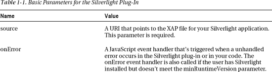

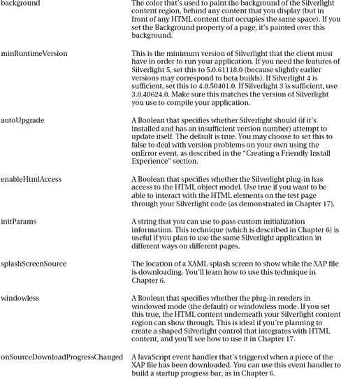

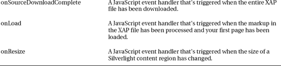

#### 备选内容

如果不理解<object>标签或者插件不可用，元素也有一些 HTML 标记。在标准测试页面中，该标记由一个 Get Silverlight 图片组成，该图片包含在一个超链接中，单击该超链接会将用户带到 Silverlight 下载页面。</object>

`<a href="http://go.microsoft.com/fwlink/?LinkID=149156&v=5.0.61118.0"
 style="text-decoration:none">
  
</a>`

#### 创造友好的安装体验

到达您的测试页面的一些用户没有安装 Silverlight，或者他们没有正确的版本。Silverlight 测试页的标准行为是检测问题并通知用户。然而，这可能不足以让用户采取正确的行动。

例如，假设一个用户第一次访问您的网站，看到一个要求他们安装 Silverlight 的小图形。用户可能不愿意安装一个不熟悉的程序，不知道为什么需要它，并被安装术语所吓倒。即使他们点击安装 Silverlight，他们仍然会面临更多的提示，要求他们下载 Silverlight 安装包，然后运行可执行文件。在任何时候，他们可能会改变主意，去别的地方冲浪。

 **提示**研究表明，如果网上冲浪者被引导去完成作为*应用*的一部分的安装过程，而不是被提示作为*技术*去安装，他们更有可能完成这个过程。

为了给你的用户一个更友好的安装体验，从定制替代内容开始。正如您在上一节中所了解到的，如果用户没有安装任何版本的 Silverlight，浏览器会显示 Silverlight 徽章——本质上是一个带有徽标和“获取 Silverlight”按钮的小横幅。这个指标对开发者来说是显而易见的，但对最终用户来说意义不大。为了使它更相关，添加一个定制的图形，清楚地显示你的应用的名称和徽标，在下面包含一些文本，解释 Silverlight 插件是驱动你的应用所必需的，然后*和*包含下载按钮。

第二个要解决的领域是版本问题。如果用户拥有 Silverlight，但它不满足最低版本要求，则不会显示替代内容。相反，Silverlight 插件使用参数触发 onError 事件。错误代码设置为 8001(需要升级)或 8002(需要重新启动)，然后显示一个对话框，提示用户获取更新版本。更好、更清晰的方法是自己处理这个问题。

首先，通过将 autoUpgrade 参数设置为 false 来禁用自动升级过程:

`<param name="autoUpgrade" value="false" />`

然后，在测试页面的 onSilverlightError 函数中检查版本错误代码。如果您检测到版本问题，那么您可以使用 JavaScript 来修改保存 Silverlight 插件的

元素的内容。换成一个更有意义的图形，清楚地宣传你的应用，以及 Silverlight 正确版本的下载链接。`function onSilverlightError(sender, args) {
    if (args.ErrorCode == 8001)
    {
        // Find the Silverlight content region.
        var hostContainer = document.getElementById("silverlightControlHost");

        // Change the content. You can supply any HTML here.
        hostContainer.innerHTML = "...";
    }
    // (Deal with other types of errors here.)
}`

要测试您的代码，只需将 minRuntimeVersion 参数设置得过高:

`<param name="minRuntimeVersion" value="6" />`

**将最小运行时间与目标版本匹配**

如前所述，您可以随时更改应用所针对的 Silverlight 版本(只需双击解决方案资源管理器中的属性节点，然后在目标 Silverlight 版本列表中选择一个新版本)。然而，理解当您做出更改时测试页面会发生什么是很重要的。

如果您使用带有自动生成的测试页的独立 Silverlight 应用，Visual Studio 会在下次生成 HTML 测试页时设置 minRuntimeVersion 属性以匹配目标版本。这种行为是你想要的。

如果你用的是 ASP。NET 承载的 Silverlight 应用或自定义 HTML 测试页，Visual Studio 不会对 minRuntimeVersion 属性进行任何更改。这是一个问题，因为它可能导致这样一种情况，即您的应用是用比 minRuntimeVersion 属性所指示的版本更高的 Silverlight 版本编译的。在这种情况下，用户可能满足 minRuntimeVersion 要求，而不需要运行应用实际需要的 Silverlight 版本。在这种情况下，用户将看不到带有安装站点链接的替代内容。相反，当浏览器插件试图启动 Silverlight 应用时，用户将在消息框中收到一个不太有用的错误。

因此，如果您更改 Silverlight 应用的目标版本，最好确保 minRuntimeVersion 属性匹配。

#### 网络的印记

HTML 测试页面中最奇怪的细节之一是下面的注释，它出现在第二行:

`<!-- saved from url=(0014)about:internet -->`

虽然这个注释看起来只不过是浏览器忽略的自动生成的标记，但它实际上会影响您调试应用的方式。这个评论被称为 Web 的*标记，这是一个特殊的标志，它迫使 Internet Explorer 在比它通常使用的更严格的安全区域中运行页面。*

通常，Web 的标记表示本地存储的页面最初是从哪个网站下载的。但是在这种情况下，Visual Studio 无法知道您的 Silverlight 应用最终将部署在哪里。它依赖于 URL `about:internet`，这简单地表明该页面来自公共互联网上的某个任意位置。数字(14)只是表示这个 URL 中的字符数。有关网站标志及其标准用途的更详细描述，请参见`[http://tinyurl.com/2ctnsj9](http://tinyurl.com/2ctnsj9)`。

所有这些都提出了一个明显的问题——即，为什么 Visual Studio 要添加一个通常为下载页面保留的标记？原因是，如果没有 Web 的标记，Internet Explorer 将使用本地计算机区域的宽松安全设置来加载您的页面。这不会造成问题，除了 Internet Explorer 还包括一个在这种情况下禁用脚本和 ActiveX 控件的安全措施。因此，如果您运行存储在本地硬盘上的测试页面，并且该测试页面没有 Web 标记，您将会看到如图[图 1-13](#fig_1_13) 所示的恼人的警告消息，并且您需要明确允许被阻止的内容。最糟糕的是，每次打开页面时，您都需要重复这个过程。

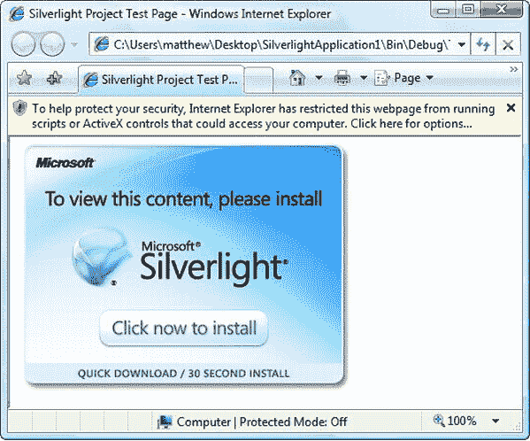

***图 1-13。**禁用 Silverlight 内容的页面*

当你将网页部署到一个真实的网站时，这个问题会消失，但在测试时，这是一个很大的不便。为了避免这样的麻烦，如果你设计了自己的定制测试页面，一定要在 Web 注释中添加一个类似的标记。

### 最后一句话

在本章中，您第一次看到了 Silverlight 应用模型。您了解了如何在 Visual Studio 中创建一个 Silverlight 项目，添加一个简单的事件处理程序，并对其进行测试。您还深入了解了 Silverlight 应用是如何编译和部署的。

在接下来的章节中，您将了解更多关于 Silverlight 平台的全部功能。有时，您可能需要提醒自己，您正在一个轻量级的浏览器托管框架内编码，因为 Silverlight 的大部分编码感觉像是完整的。尽管它仅仅建立在几兆字节的压缩代码上。在 Silverlight 的众多特性中，它将一个微型现代编程框架打包到一个小型下载包中的能力无疑是最令人印象深刻的。