## C H A P T E R 3

## 布局

用户界面设计的一半战斗是以一种吸引人的、实用的和灵活的方式组织内容。在浏览器托管的应用中，这是一项特别棘手的任务，因为您的应用可能会在各种不同的计算机和设备上使用(所有计算机和设备都具有不同的显示硬件)，并且您无法控制放置 Silverlight 内容的浏览器窗口的大小。

幸运的是，Silverlight 继承了 WPF 极其灵活的布局模型中最重要的部分。使用布局模型，您可以在一组不同的布局容器中组织内容。每个容器都有自己的布局逻辑——一个堆叠元素，另一个将元素排列在不可见单元格的网格中，还有一个使用硬编码的坐标系。如果你有野心，你甚至可以用定制的布局逻辑创建你自己的容器。

在本章中，您将学习如何使用布局容器来创建 Silverlight 页面的可视框架。您将花大部分时间探索 Silverlight 的核心布局容器，包括 StackPanel、Grid 和 Canvas。一旦掌握了这些基础知识，您将看到如何通过创建具有自定义布局逻辑的新布局容器来扩展您的可能性。您还将看到如何创建一个跳出浏览器窗口并使用全屏幕的应用。

### 布局容器

Silverlight 窗口只能容纳一个元素。为了适应多个元素并创建更实用的用户界面，您需要在页面中放置一个容器，然后向该容器中添加其他元素。您的布局由您使用的容器决定。

所有 Silverlight 布局容器都是从抽象系统派生的面板。Windows.Controls.Panel 类(见[图 3-1](#fig_3_1) )。

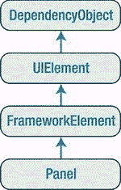

***图 3-1。**面板类的层级*

Panel 类增加了两个公共属性:背景和子元素。背景是用来绘制面板背景的画笔。Children 是存储在面板中的项目集合。(这是第一级元素——换句话说，这些元素本身可能包含更多的元素。)Panel 类也有一些内部管道，你可以用它来创建你自己的布局容器，这一点你会在本章后面学到。

就其本身而言，基本 Panel 类只不过是其他更专门化的类的起点。Silverlight 提供了三个从 Panel 派生的类，您可以使用它们来安排布局，Silverlight Toolkit 还添加了两个。所有这些都在[表 3-1](#tab_3_1) 中列出，按照您在本章中遇到它们的顺序排列。与所有 Silverlight 控件和大多数可视元素一样，这些类都可以在系统中找到。Windows.Controls 命名空间。

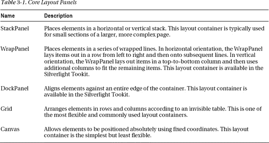

布局容器可以嵌套。典型的用户界面从 Grid 开始，它是 Silverlight 功能最强的容器，还包含其他布局容器，这些容器排列更小的元素组，如标题文本框、列表中的项目、工具栏上的图标、一列按钮等等。

 **注意**有一个专门的布局面板没有出现在[表 3-1](#tab_3_1) 中:虚拟化堆栈面板。它以与 StackPanel 相同的方式排列项目，但是它使用了一种叫做*虚拟化*的内存优化技术。VirtualizingStackPanel 允许列表控件(如 ListBox)容纳数万个项目，而不会显著降低速度，因为 VirtualizingStackPanel 只为当前可见的项目创建对象。但是尽管你可能使用 VirtualizingStackPanel 来构建定制的模板和控件(见[第 15 章](15.html#ch15))，你不会用它来排列页面中的元素，所以这不在本章讨论之列。

#### 面板背景

所有面板元素都通过添加背景属性引入了背景的概念。很自然地，背景属性会使用某种颜色对象。然而，Background 属性实际上使用了更加通用的东西:一个 Brush 对象。这种设计使您可以灵活地用纯色(通过使用 SolidColorBrush)或更奇特的颜色(例如，渐变或位图，通过使用 LinearGradientBrush 或 ImageBrush)填充背景和前景内容。在这一节中，你将只考虑 SolidColorBrush 提供的简单纯色填充，但是你将在第 9 章中尝试更复杂的绘画。

 **注意**Silverlight 的所有笔刷类都在系统里找到了。Windows.Media 命名空间

例如，如果你想给整个页面一个浅蓝色的背景，你可以调整根面板的背景。下面是实现这一功能的代码:

`layoutRoot.Background = new SolidColorBrush(Colors.AliceBlue);`

从技术上讲，每个颜色对象都是系统中颜色结构的一个实例。Windows.Media 命名空间您可以从 colors 类中获得各种现成的颜色，该类为每种颜色提供了一个静态属性。(属性名称基于 web 浏览器支持的颜色名称。)此处显示的代码使用其中一种颜色来创建一个新的 SolidColorBrush。然后，它将画笔设置为根面板的背景画笔，这将导致其背景被绘制成浅蓝色。

 **提示** Silverlight 还包括一个 SystemColors 类，它提供与当前系统首选项匹配的颜色对象。例如 SystemColors。获取用于填充前景窗口边框的颜色。在某些情况下，你可能会选择确保你的应用更好地融入当前的配色方案，特别是如果你正在构建一个浏览器外的应用，如第 18 章中的[所述。](18.html#ch18)

Colors 和 SystemColors 类提供了方便的快捷方式，但它们不是设置颜色的唯一方式。您还可以通过提供红色、绿色和蓝色(RGB)值以及指示透明度的 alpha 值来创建颜色对象。这些值中的每一个都是从 0 到 255 的数字:

`int red = 0; int green = 255; int blue = 0;
layoutRoot.Background = new SolidColorBrush(Color.FromArgb(255, red, green, blue));`

您也可以通过在调用颜色时提供 alpha 值来使颜色部分透明。FromArgb()方法。255 的 alpha 值是完全不透明的，而 0 是完全透明的。

通常，您会在 XAML 中设置颜色，而不是在代码中。在这里，您可以使用一个有用的快捷方式。您可以提供颜色名称或颜色值，而不是定义画笔对象。背景属性的类型转换器将使用您指定的颜色自动创建 SolidColorBrush 对象。下面是一个使用颜色名称的示例:

`<Grid x:Name="layoutRoot" **Background**="Red">`

它相当于这个更冗长的语法:

`<Grid x:Name="layoutRoot">
  <Grid.Background>
    <SolidColorBrush Color="Red"></SolidColorBrush>
  </Grid.Background>
</Grid>`

如果你想创建一个不同类型的笔刷，比如 LinearGradientBrush，你需要使用较长的形式来绘制背景。

如果您想使用颜色代码，您需要使用稍微不太方便的语法，将 R、G 和 B 值用十六进制表示。您可以使用两种格式中的一种，要么是#rrggbb，要么是#aarrggbb(区别在于后者包括 alpha 值)。您只需要两位数字来提供 A、R、G 和 B 值，因为它们都是十六进制的。下面是一个示例，它使用# aarrggbb 符号创建了与前面的代码片段相同的颜色:

`<Grid x:Name="layoutRoot" **Background="#FFFF0000"**>`

这里 alpha 值是 FF (255)，红色值是 FF (255)，绿色和蓝色值是 0。

默认情况下，布局面板的背景设置为空引用，相当于:

`<Grid x:Name="layoutRoot" **Background="{x:Null}"**>`

当你的面板有一个空的背景时，下面的任何内容都会显示出来(类似于你设置一个完全透明的背景颜色)。然而，有一个重要的区别——布局容器不能接收鼠标事件。

 **注意**画笔支持自动更改通知。换句话说，如果将画笔附加到控件并更改画笔，控件会相应地更新自身。

#### 边框

布局容器允许您绘制背景，但不能绘制边框轮廓。然而，有一个元素填补了这个空白——边框。

Border 类是纯粹的简单。它采用单一的嵌套内容(通常是布局面板)并在其周围添加背景或边框。要掌握边界，你只需要[表 3-2](#tab_3_2) 中列出的属性。

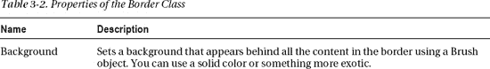

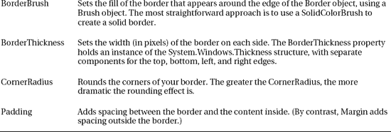

基本按钮周围有一个简单、略圆的边框:

`<Border Margin="25"  Background="LightYellow"
 BorderBrush="SteelBlue" BorderThickness="8" CornerRadius="15">
  <Button Margin="10 Content="Click  Me"></Button>
</Border>`

这个示例在边框和按钮周围添加了一点点空白，这是您将在下一节了解的一个特性。[图 3-2](#fig_3_2) 显示了结果。

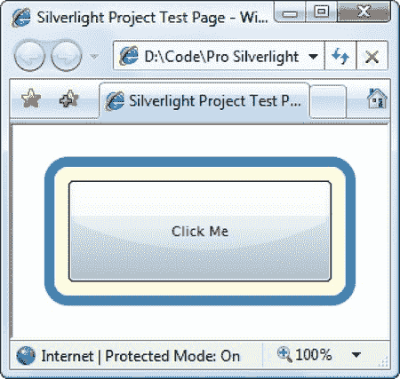

***图 3-2。**一个基本边界*

### 用 StackPanel 进行简单布局

StackPanel 是最简单的布局容器之一。它只是将它的子元素放在一行或一列中。这些元素是根据它们的顺序排列的。

例如，考虑这个页面，它包含一个带有一个 TextBlock 和四个按钮的堆栈:

`<UserControl x:Class="Layout.SimpleStack"

 xmlns:x="http://schemas.microsoft.com/winfx/2006/xaml">
  <StackPanel Background="White">
    <TextBlock Text="A Button Stack"></TextBlock>
    <Button Content="Button 1"></Button>
    <Button Content="Button 2"></Button>
    <Button Content="Button 3"></Button>
    <Button Content="Button 4"></Button>
  </StackPanel>
</UserControl>`

[图 3-3](#fig_3_3) 显示了结果。

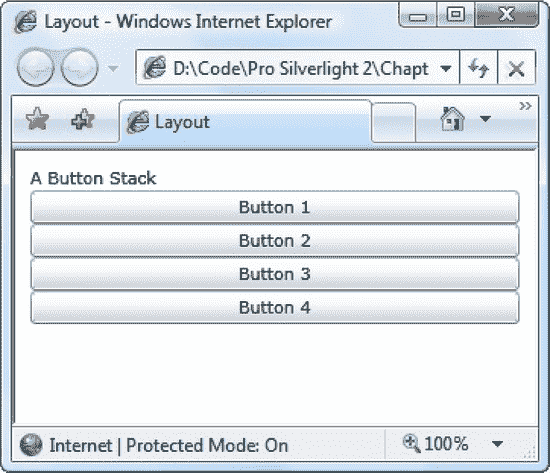

***图 3-3。**行动中的堆栈面板*

默认情况下，StackPanel 从上到下排列元素，使每个元素的高度与显示其内容所需的高度一样。在本例中，这意味着 TextBlock 和 buttons 的大小刚好足以容纳其中的文本。所有的元素都被拉伸到 StackPanel 的宽度，也就是页面的宽度。

在此示例中，没有设置页面的高度和宽度属性。因此，页面会增长到适合整个 Silverlight 内容区域(在本例中，是整个浏览器窗口)。本章中的大多数例子都使用这种方法，因为这使得试验不同布局的容器变得更加容易。然后，只需调整浏览器窗口的大小，您就可以看到布局容器如何调整自身大小以适应不同的页面大小。

 **注意**一旦你检查了所有的布局容器，你将更仔细地观察页面大小的问题，并且你将了解你的不同选项来处理不适合浏览器窗口的内容。

通过设置 Orientation 属性，StackPanel 还可以用于水平排列元素:

`<StackPanel **Orientation="Horizontal"** Background="White">`

现在元素被赋予了它们的最小宽度(宽度足以容纳它们的文本)，并被拉伸到包含面板的整个高度(见[图 3-4](#fig_3_4) )。

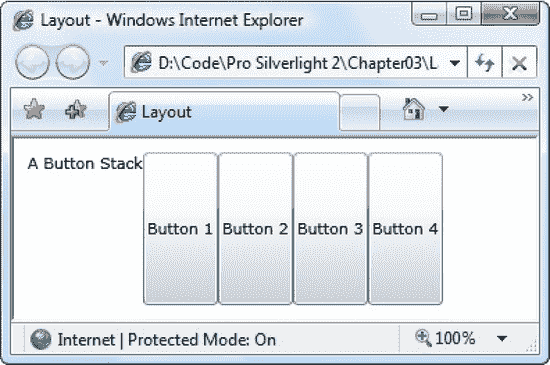

***图 3-4。**水平放置的堆栈面板*

显然，这并没有提供真正的应用所需要的灵活性。幸运的是，您可以使用布局属性微调 StackPanel 和其他布局容器的工作方式，如下所述。

#### 布局属性

尽管布局是由容器决定的，但是子元素仍然有发言权。事实上，布局面板通过尊重一小部分布局属性与其子面板协同工作，如[表 3-3](#tab_3_3) 中所列。

T2】

所有这些属性都是从 FrameworkElement 基类继承的，因此可以在 Silverlight 页面中使用的所有图形小部件都支持这些属性。

 **注**正如你在[第二章](02.html#ch2)中了解到的，不同布局的容器可以为其子容器提供附加属性。例如，Grid 对象的所有子对象都获得行和列属性，这些属性允许它们选择放置它们的单元格。附加属性允许您设置特定于特定布局容器的信息。然而，[表 3-3](#tab_3_3) 中的布局属性足够通用，它们适用于许多布局面板。因此，这些属性被定义为 FrameworkElement 基类的一部分。

#### 对齐

为了理解这些属性是如何工作的，再看一下图 3-3 中显示的简单 StackPanel。在本例中——一个垂直方向的 stack panel——vertical alignment 属性不起作用，因为每个元素都被赋予了它所需要的高度，不能再高了。然而，水平对齐*很重要。它决定了每个元素在其行中的位置。*

通常，标签的默认水平对齐方式是左对齐，按钮的默认水平对齐方式是拉伸。这就是为什么每个按钮都占据整个列宽。但是，您可以更改这些详细信息:

`<StackPanel Background="White">
  <TextBlock **HorizontalAlignment="Center"** Text="A Button Stack"></TextBlock>
  <Button **HorizontalAlignment="Left"** Content="Button 1"></Button>
  <Button **HorizontalAlignment="Right"** Content="Button 2"></Button>
  <Button Content="Button 3"></Button>
  <Button Content="Button 4"></Button>
</StackPanel>`

[图 3-5](#fig_3_5) 显示了结果。前两个按钮被指定为最小尺寸并相应地对齐，而底部的两个按钮被拉伸到整个 StackPanel。如果你调整页面大小，你会看到标签仍然在中间，前两个按钮粘在两边。

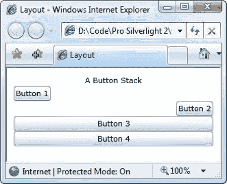

***图 3-5。**按钮对齐的堆栈面板*

 **注意**stack panel 也有自己的水平对齐和垂直对齐属性。默认情况下，这两者都设置为 Stretch，因此 StackPanel 完全填充了它的容器。在这个例子中，这意味着 StackPanel 填充了页面。如果您为 VerticalAlignment 使用不同的值，StackPanel 将会足够大以适合最宽的控件。

#### 页边距

当前形式的 StackPanel 示例有一个明显的问题。一个设计良好的页面不仅仅包含元素，还包括元素之间的额外空间。为了引入这个额外的空间并使 StackPanel 示例不那么拥挤，您可以设置控件边距。

设置边距时，您可以为所有边设置单一宽度，如下所示:

`<Button **Margin="5"** Content="Button 3"></Button>`

或者，您可以按照*左、上、右、下*的顺序为控件的每一侧设置不同的边距:

`<Button **Margin="5,10,5,10"** Content="Button 3"></Button>`

在代码中，可以使用 Thickness 结构设置边距:

`cmd.Margin = new Thickness(5);`

获得正确的控件边距是一门艺术，因为您需要考虑相邻控件的边距设置如何相互影响。例如，如果有两个按钮堆叠在一起，最上面的按钮的下边距为 5，最下面的按钮的上边距为 5，那么这两个按钮之间总共有 10 个像素的空间。

理想情况下，您将能够保持不同的边距设置尽可能一致，并避免为不同的边距设置不同的值。例如，在 StackPanel 示例中，在按钮和面板上使用相同的边距是有意义的，如下所示:

`<StackPanel Margin="3" Background="White">
  <TextBlock Margin="3" HorizontalAlignment="Center"
   Text="A Button Stack"></TextBlock>
  <Button **Margin="3"** HorizontalAlignment="Left" Content="Button 1"></Button>
  <Button **Margin="3"** HorizontalAlignment="Right" Content="Button 2"></Button>
  <Button **Margin="3"** Content="Button 3"></Button>
  <Button **Margin="3"** Content="Button 4"></Button>
</StackPanel>`

这样，两个按钮之间的总间距(两个按钮边距之和)与页面边缘的按钮之间的总间距(按钮边距和 StackPanel 边距之和)相同。[图 3-6](#fig_3_6) 显示了这个更体面的页面，[图 3-7](#fig_3_7) 显示了边距设置是如何分解的。

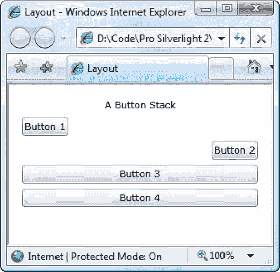

***图 3-6。**在元素之间添加边距*

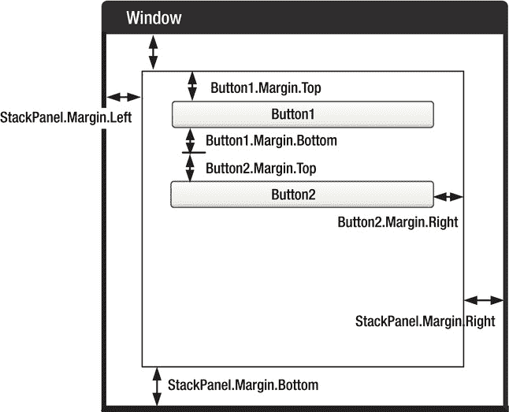

***图 3-7。**页边距是如何合并的*

#### 最小、最大和显式尺寸

最后，每个元素都包含高度和宽度属性，允许您给它一个明确的大小。然而，仅仅因为你可以设置明确的尺寸并不意味着你*应该*。在大多数情况下，最好让元素增长以适应它们的内容。例如，当您添加更多文本时，按钮会展开。如有必要，可以通过设置最大和最小尺寸将元素锁定在可接受的尺寸范围内。如果你添加了尺寸信息，你可能会创建一个更加脆弱的布局，不能适应变化，并且(最坏的情况)会截断不适合的内容。

例如，您可能决定 StackPanel 中的按钮应该拉伸以适合 StackPanel，但宽度不能大于 200 像素，也不能小于 100 像素。(默认情况下，按钮的最小宽度为 75 像素。)下面是您需要的标记:

`<StackPanel Margin="3">
  <TextBlock Margin="3" HorizontalAlignment="Center"
   Text="A Button Stack"></TextBlock>
  <Button Margin="3" MaxWidth="300" MinWidth="200" Content="Button 1"></Button>
  <Button Margin="3" MaxWidth="300" MinWidth="200" Content="Button 2"></Button>
  <Button Margin="3" MaxWidth="300" MinWidth="200" Content="Button 3"></Button>
  <Button Margin="3" MaxWidth="300" MinWidth="200" Content="Button 4"></Button>
</StackPanel>`

 **提示**此时，您可能想知道是否有更简单的方法来设置跨多个元素的标准化属性，例如本例中的按钮边距。答案是*样式*——一个允许你重用属性设置的特性。你将在第 14 章中了解风格。

当 StackPanel 调整一个没有硬编码大小的按钮时，它会考虑几条信息:

> *   Minimum size: Each button will always be at least as large as the minimum size.
> *   Maximum size: Each button is always smaller than the maximum size (unless you set the maximum size to be smaller than the minimum size by mistake).
> *   Content: StackPanel will try to enlarge the button if the content inside the button needs more width.
> *   Size of container: If the minimum width is greater than the width of StackPanel, part of the button will be cut off. However, if the minimum width is not set (or less than the width of StackPanel), the button will not be allowed to be wider than StackPanel, even if it cannot accommodate all the text on the button surface.
> *   Horizontal alignment: Because the button uses Stretch's horizontal alignment (default), StackPanel will try to enlarge the button to fill the entire width of StackPanel.

理解这一过程的诀窍是认识到最小和最大尺寸设定了绝对界限。在这些界限内，StackPanel 试图考虑按钮的期望大小(以适合其内容)及其对齐设置。

图 3-8 展示了堆栈面板的工作原理。左边是最小尺寸的页面。每个按钮都是 200 像素，页面不能调整得更窄。如果从这一点开始缩小页面，每个按钮的右侧都会被剪掉。(您可以使用滚动来处理这种情况，这将在本章后面讨论。)

当您放大页面时，按钮会随之增大，直到达到 300 像素的最大值。从这一点开始，如果你让页面变得更大，额外的空间会被添加到按钮的任何一边(如[图 3-8](#fig_3_8) 中右边所示)。

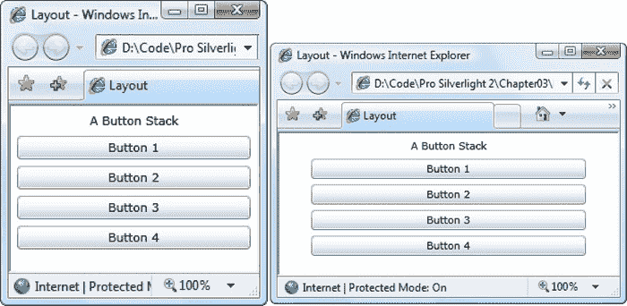

***图 3-8。**受约束的按钮尺寸*

 **注意**在某些情况下，你可能想要使用代码来检查一个页面中的元素有多大。高度和宽度属性没有帮助，因为它们指示您所需的大小设置，这可能与实际的渲染大小不一致。在理想的情况下，您将让元素的大小适合它们的内容，而高度和宽度属性根本不用设置。但是，您可以通过读取 ActualHeight 和 ActualWidth 属性来找出用于呈现元素的实际大小。但是请记住，这些值可能会随着页面大小的调整或内容的改变而改变。

### wrap panel 和 DockPanel

显然，单靠 StackPanel 不能帮助你创建一个真实的用户界面。为了完成这个画面，StackPanel 需要与其他更强大的布局容器一起工作。只有这样你才能组装一个完整的窗户。

最复杂的布局容器是网格，我们将在本章的后面讨论它。但是首先，值得看一下 WrapPanel 和 DockPanel，这是两个简单的布局容器，作为 Silverlight 工具包的一部分提供。两者都通过提供不同的布局行为来补充 StackPanel。

要使用 WrapPanel 或 DockPanel，需要在定义它们的地方添加对 System.Windows.Controls.Toolkit.dll 程序集的引用。要获得这个程序集，您必须安装 Silverlight 工具包，它可以在`[http://silverlight.codeplex.com](http://silverlight.codeplex.com)`获得。

一旦添加了程序集引用，就需要映射命名空间，以便它在您的标记中可用，如下所示:

`<UserControl x:Class="Layout.WrapAndDock" ...
 xmlns:toolkit=
 "clr-namespace:System.Windows.Controls;assembly=System.Windows.Controls.Toolkit">`

现在可以使用名称空间前缀 *toolkit* 来定义 WrapPanel 和 DockPanel:

`<toolkit:WrapPanel ...></toolkit:WrapPanel>`

通过从工具箱中添加 WrapPanel，可以跳过一些步骤。然后，Visual Studio 将添加适当的程序集引用，映射命名空间，并插入控件的 XML 标记。

#### 包装面板

WrapPanel 在可用空间中布置控件，一次一行或一列。默认情况下，WrapPanel。Orientation 属性设置为 Horizontal 控件从左到右排列，然后排列在后续行上。但是，您可以使用 Vertical 将元素放置在多列中。

 **提示**像 StackPanel 一样，WrapPanel 实际上是为了控制用户界面中的小规模细节，而不是完整的窗口布局。例如，您可以使用 WrapPanel 将类似工具栏的控件中的按钮放在一起。

下面的示例定义了一系列具有不同对齐方式的按钮，并将它们放入 WrapPanel 中:

`<toolkit:WrapPanel Margin="3">
  <Button VerticalAlignment="Top" Content="Top Button"></Button>
  <Button MinHeight="60" Content="Tall Button"></Button>
  <Button VerticalAlignment="Bottom" Content="Bottom Button"></Button>
  <Button Content="Stretch Button"></Button>
  <Button VerticalAlignment="Center" Content="Centered Button"></Button>   
</toolkit:WrapPanel>`

[图 3-9](#fig_3_9) 显示了按钮如何被包装以适应 WrapPanel 的当前大小(这是由包含它的控件的大小决定的)。如本例所示，水平模式下的 WrapPanel 创建一系列虚拟行，每一行都被赋予所包含的最高元素的高度。其他控件可以根据 VerticalAlignment 属性拉伸以适合或对齐。在图 3-9 的[左侧的例子中，所有的按钮都放在一个高的行中，并被拉伸或对齐以适合。在右边的例子中，几个按钮被移到了第二行。因为第二行不包括非常高的按钮，所以行高保持在最小按钮高度。因此，这一行中的各个按钮使用什么样的 VerticalAlignment 设置并不重要。](#fig_3_9)

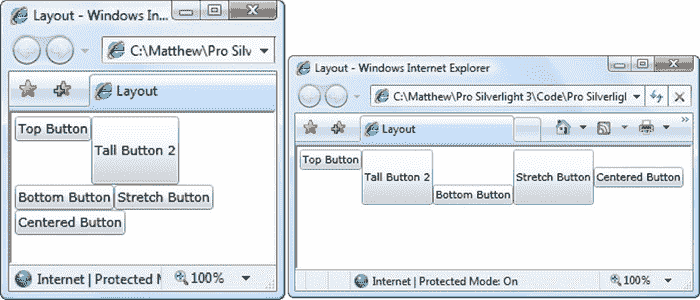

***图 3-9。**裹扣*

 **注意**wrap panel 是五个 Silverlight 布局容器中唯一一个不能通过巧妙使用网格来复制其效果的容器。

#### 停靠面板

Silverlight 工具包还包括一个名为 DockPanel 的布局容器。它将控件拉伸到它的一个外侧边缘。形象化这一点的最简单的方法是考虑位于许多 Windows 应用顶部的工具栏。这些工具栏停靠在窗口的顶部。与 StackPanel 一样，停靠的元素可以选择其布局的一个方面。例如，如果您将一个按钮停靠在 DockPanel 的顶部，它将伸展到 DockPanel 的整个宽度，但会给出它所需的高度(基于内容和 MinHeight 属性)。另一方面，如果您将一个按钮停靠在容器的左侧，它的高度会被拉伸以适应容器，但是它的宽度可以根据需要自由增长。

显而易见的问题是:子元素如何选择要停靠的一侧？答案是通过一个名为 Dock 的附加属性，该属性可以设置为 Left、Right、Top 或 Bottom。放置在 DockPanel 中的每个元素都会自动获得该属性。

下面是一个在 DockPanel 的每一侧放置一个按钮的示例:

`<toolkit:DockPanel LastChildFill="True">
  <Button toolkit:DockPanel.Dock="Top" Content="Top Button"></Button>
  <Button toolkit:DockPanel.Dock="Bottom" Content="Bottom Button"></Button>
  <Button toolkit:DockPanel.Dock="Left" Content="Left Button"></Button>
  <Button toolkit:DockPanel.Dock="Right" Content="Right Button"></Button>
  <Button Content="Remaining Space"></Button>
</toolkit:DockPanel>`

此示例还将 LastChildFill 设置为 true，这将告诉 DockPanel 将剩余空间留给最后一个元素。[图 3-10](#fig_3_10) 显示了结果。

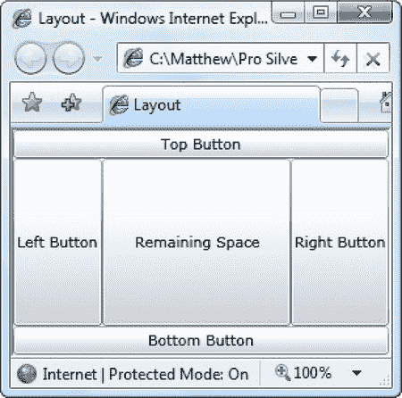

***图 3-10。**对接到每一边*

显然，当停靠控件时，顺序很重要。在本例中，顶部和底部按钮获得了 DockPanel 的完整边缘，因为它们首先停靠。当左按钮和右按钮接下来停靠时，它们将位于这两个按钮之间。如果你颠倒这个顺序，左边和右边的按钮会得到完整的边，而顶部和底部的按钮会变窄，因为它们会停靠在两边的按钮之间。

您可以将多个元素停靠在同一侧。在这种情况下，元素只是按照它们在标记中声明的顺序堆叠在一起。而且，如果您不喜欢间距或拉伸行为，您可以调整边距、水平对齐和垂直对齐属性，就像您对 StackPanel 所做的那样。下面是上一个示例的修改版本，演示了:

`<toolkit:DockPanel LastChildFill="True">
  <Button toolkit:DockPanel.Dock="Top" Content="A Stretched Top Button"></Button>
  <Button toolkit:DockPanel.Dock="Top" HorizontalAlignment="Center"
    Content="A Centered Top Button"></Button>
  <Button toolkit:DockPanel.Dock="Top" HorizontalAlignment="Left"
    Content="A Left-Aligned Top Button"></Button>` `  <Button toolkit:DockPanel.Dock="Bottom" Content="Bottom Button"></Button>
  <Button toolkit:DockPanel.Dock="Left" Content="Left Button"></Button>
  <Button toolkit:DockPanel.Dock="Right" Content="Right Button"></Button>
  <Button Content="Remaining Space"></Button>
</toolkit:DockPanel>`

停靠行为还是一样的。首先，停靠顶部按钮，然后停靠底部按钮，最后剩余的空间在侧边按钮和中间的最后一个按钮之间划分。[图 3-11](#fig_3_11) 显示了结果窗口。

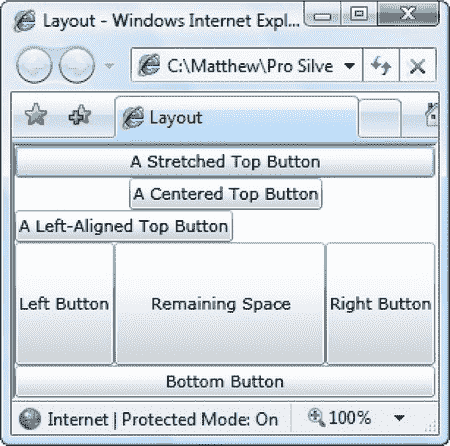

***图 3-11。**将多个元素停靠到顶部*

### 网格

网格是 Silverlight 中最强大的布局容器。事实上，网格非常有用，当您在 Visual Studio 中为页面添加新的 XAML 文档时，它会自动添加网格标记作为第一级容器，嵌套在根 UserControl 元素中。

网格将元素分成由行和列组成的不可见网格。尽管在一个单元格中可以放置多个元素(在这种情况下，它们会重叠)，但通常每个单元格只放置一个元素是有意义的。当然，该元素本身可能是另一个布局容器，它组织自己的一组包含的控件。

 **提示**虽然网格被设计成不可见的，但是你可以设置网格。将 ShowGridLines 属性设置为 true，以便更仔细地观察。这个特性并不是为了美化页面。相反，这是一种调试便利，旨在帮助您理解网格如何将自己细分为更小的区域。这个特性很重要，因为您可以精确控制网格选择列宽和行高的方式。

创建基于网格的布局分为两步。首先，选择所需的列数和行数。接下来，将适当的行和列分配给每个包含的元素，从而将其放置在正确的位置。

通过填充栅格来创建栅格和行。列定义和网格。带有对象的 RowDefinitions 集合。例如，如果您决定需要两行和三列，您可以添加以下标记:

`<Grid ShowGridLines="True" Background="White">
  <Grid.RowDefinitions>
    <RowDefinition></RowDefinition>
    <RowDefinition></RowDefinition>
  </Grid.RowDefinitions>
  <Grid.ColumnDefinitions>
    <ColumnDefinition></ColumnDefinition>
    <ColumnDefinition></ColumnDefinition>
    <ColumnDefinition></ColumnDefinition>
  </Grid.ColumnDefinitions>

  ...
</Grid>`

如本例所示，不需要在 RowDefinition 或 ColumnDefinition 元素中提供任何信息。如果将它们留空(如此处所示)，网格将在所有行和列之间平均分配空间。在本例中，根据包含页面的大小，每个单元格的大小完全相同。

要将单个元素放入单元格中，可以使用附加的行和列属性。这两个属性都采用从零开始的索引号。例如，下面是如何创建部分填充的按钮网格:

`<Grid ShowGridLines="True" Background="White">
  ...
  <Button **Grid.Row="0" Grid.Column="0"** Content="Top Left"></Button>
  <Button **Grid.Row="0" Grid.Column="1"** Content="Top Middle"></Button>
  <Button **Grid.Row="1" Grid.Column="2"** Content="Bottom Right"></Button>
  <Button **Grid.Row="1" Grid.Column="1"** Content="Bottom Middle"></Button>
</Grid>`

每个元素都必须显式地放入其单元格中。这允许您在一个单元格中放置多个元素(这很少有意义)，或者将某些单元格留空(这通常很有用)。这也意味着您可以无序地声明您的元素，就像本例中最后两个按钮一样。但是，如果逐行定义控件，并且在每一行中从左到右定义，标记会更清晰。

有一个例外。如果不指定网格。行属性，网格假定它为 0。同样的行为也适用于网格。列属性。因此，您将一个元素的两个属性都去掉，将其放在网格的第一个单元格中。

图 3-12 显示了这个简单的网格是如何以两种不同的尺寸出现的。请注意，ShowGridLines 属性设置为 true，这样您就可以看到每一列和每一行之间的分隔。

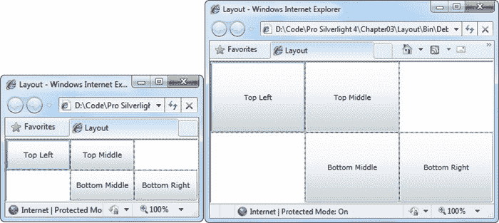

***图 3-12。**一个简单的网格*

如你所料，网格遵循[表 3-3](#tab_3_3) 中列出的布局属性的基本集合。这意味着您可以在单元格中的内容周围添加边距，可以更改大小调整模式以使元素不会增长到填满整个单元格，并且可以沿单元格的一个边缘对齐项目。如果您强制某个元素的大小超过单元格所能容纳的大小，则部分内容将被截断。

#### 微调行和列

正如您所看到的，网格使您能够创建成比例大小的行和列的集合，这通常非常有用。但是，要释放网格的全部潜力，您可以更改每行和每列的大小。

网格支持三种规模调整策略:

> *   Absolute size: Use pixels to select the exact size. This is the most useless strategy because it is not flexible enough to handle changing content sizes, changing container sizes or localization.
> *   Automatic resizing: Each row or column is accurately given the amount of space it needs, not more. This is one of the most useful scale estimation models.
> *   Scale: the division of space between a group of rows or columns. This is the standard setting for all rows and columns. For example, in [Figure 3-12](#fig_3_12) , you can see that all the cells increase proportionally with the expansion of the grid.

为了获得最大的灵活性，您可以混合搭配这些不同的调整模式。例如，创建几个自动调整大小的行，然后让剩下的一两行通过按比例调整大小来获得剩余空间，这通常很有用。

使用 ColumnDefinition 对象的 Width 属性或 RowDefinition 对象的 Height 属性将大小调整模式设置为一个数字。例如，下面是如何设置 100 像素的绝对宽度:

`<ColumnDefinition Width="100"></ColumnDefinition>`

要使用自动调整大小，请使用值 Auto:

`<ColumnDefinition Width="Auto"></ColumnDefinition>`

最后，要使用比例大小，您可以使用星号(*):

`<ColumnDefinition Width="*"></ColumnDefinition>`

这种语法源于网络世界，在那里它被用于 HTML 框架页面。如果混合使用按比例调整大小和其他调整大小模式，按比例调整大小的行或列将获得剩余的所有空间。

如果你想不平等地划分剩余的空间，你可以分配一个*权重*，必须放在星号之前。例如，如果您有两个成比例大小的行，并且您希望第一行的高度是第二行的一半，您可以像这样共享剩余的空间:

`<RowDefinition Height="*"></RowDefinition>
<RowDefinition Height="2*"></RowDefinition>`

这告诉网格第二行的高度应该是第一行的两倍。你可以用任何你喜欢的数字来分割多余的空间。

#### 嵌套布局容器

网格本身令人印象深刻，但是大多数真实的用户界面都结合了几个布局容器。他们可以使用多于一个网格的布局，也可以将网格和其他布局容器混合使用，比如 StackPanel。

下面的标记给出了这一原则的简单示例。它创建了一个基本的对话框，右下角有 OK 和 Cancel 按钮，还有一个大的内容区域，其大小适合它的内容(TextBlock 中的文本)。通过在网格上设置对齐属性，整个包在页面中间居中。

`<Grid ShowGridLines="True" Background="SteelBlue"
 HorizontalAlignment="Center" VerticalAlignment="Center">
  <Grid.RowDefinitions>
    <RowDefinition Height="*"></RowDefinition>
    <RowDefinition Height="Auto"></RowDefinition>
  </Grid.RowDefinitions>

  <TextBlock Margin="10" Grid.Row="0" Foreground="White"
   Text="This is simply a test of nested containers."></TextBlock>
  <StackPanel Grid.Row="1" HorizontalAlignment="Right" Orientation="Horizontal">
    <Button Margin="10,10,2,10" Padding="3" Content="OK"></Button>
    <Button Margin="2,10,10,10" Padding="3" Content="Cancel"></Button>
  </StackPanel>
</Grid>`

您会注意到这个网格没有声明任何列。如果您的网格仅使用一列，并且该列按比例调整大小(因此它填充了网格的整个宽度)，则可以使用这种快捷方式。图 3-13 显示了这个标记创建的相当普通的对话框。

 **注意**在这个例子中，Padding 属性在按钮边框和里面的内容之间增加了一些最小空间(单词 *OK* 或者 *Cancel* )。当你在第 5 章中考虑内容控件时，你会学到更多关于填充的知识。

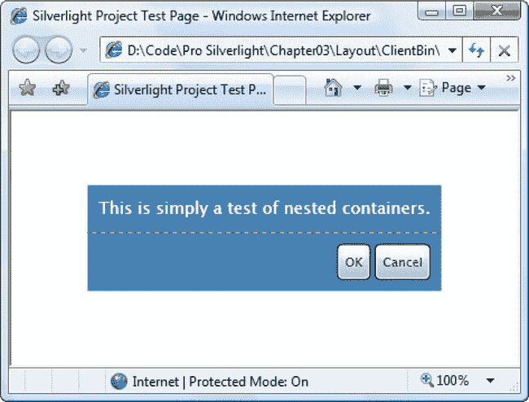

***图 3-13。**一个基本对话框*

乍一看，嵌套布局容器似乎比使用坐标将控件放置在精确的位置上要多做一些工作。在很多情况下，的确如此。但是，较长的设置时间可以通过您将来可以轻松更改用户界面来弥补。例如，如果您决定让“确定”和“取消”按钮在页面底部居中，您只需更改包含它们的 StackPanel 的对齐方式:

`<StackPanel Grid.Row="1" HorizontalAlignment="Center" ... >`

类似地，如果您需要更改第一行的内容量，整个网格将被放大以适应，并且按钮会主动移开。如果你给这个页面添加一些样式( [Chapter 14](14.html#ch14) )，你可以进一步改进它，删除其他无关的细节(比如边距设置)来创建更干净、更紧凑的标记。

 **提示**如果你有一个密集嵌套的元素树，很容易忽略整体结构。Visual Studio 提供了一个方便的特性，可以向您显示元素的树表示形式，并允许您通过单击找到想要查看(或修改)的元素。这个功能就是文档大纲窗口，你可以从菜单中选择查看其他窗口文档大纲来查看。

#### 跨越行和列

您已经看到了如何使用行和列附加属性在单元格中放置元素。您还可以使用另外两个附加属性来使一个元素扩展到多个单元格:RowSpan 和 ColumnSpan。这些属性接受元素应该占据的行数或列数。

例如，此按钮将占用第一行的第一个和第二个单元格中的所有可用空间:

`<Button Grid.Row="0" Grid.Column="0" **Grid.ColumnSpan="2"** Content="Span Button">
</Button>`

此按钮将跨越两列两行，总共跨越四个单元格:

`<Button Grid.Row="0" Grid.Column="0" Grid.RowSpan**="2"** Grid.ColumnSpan**="2"**
 Content="Span Button"></Button>`

行列跨越可以实现一些有趣的效果，当您需要将元素放入由分隔线或较长的内容部分分割的表格结构中时，这种方法尤其方便。

使用列跨越，你可以只使用一个网格重写图 3-13 中的简单对话框示例。此网格将页面分成三列，将文本框分布在所有三列上，并使用最后两列来对齐“确定”和“取消”按钮。

`<Grid ShowGridLines="True" Background="SteelBlue"
 HorizontalAlignment="Center" VerticalAlignment="Center">
  <Grid.RowDefinitions>
    <RowDefinition Height="*"></RowDefinition>
    <RowDefinition Height="Auto"></RowDefinition>
  </Grid.RowDefinitions>
  <Grid.ColumnDefinitions>
    <ColumnDefinition Width="*"></ColumnDefinition>
    <ColumnDefinition Width="Auto"></ColumnDefinition>
    <ColumnDefinition Width="Auto"></ColumnDefinition>
  </Grid.ColumnDefinitions>
  <TextBlock Margin="10" Grid.Row="0" Grid.Column="0" Grid.ColumnSpan="3"
   Foreground="White"
   Text="This is simply a test of nested containers."></TextBlock>

  <Button Margin="10,10,2,10" Padding="3"
    Grid.Row="1" Grid.Column="1" Content="OK"></Button>
  <Button Margin="2,10,10,10" Padding="3"
    Grid.Row="1" Grid.Column="2" Content="Cancel"></Button>
</Grid>`

大多数开发者都会同意这种布局不清晰或不合理。列宽由页面底部两个按钮的大小决定，这使得向现有的网格结构中添加新内容变得困难。如果您对该页面进行哪怕是很小的添加，您可能会被迫创建一组新的列。

如此所示，当您为页面选择布局容器时，您不仅仅是对获得正确的布局行为感兴趣——您还希望构建一个将来易于维护和增强的布局结构。一个好的经验法则是使用较小的布局容器，比如 StackPanel，用于一次性的布局任务，比如排列一组按钮。另一方面，如果您需要在页面的多个区域应用一致的结构，网格是标准化布局不可或缺的工具。

#### 网格分裂器

每个 Windows 用户都见过*分隔条*——将窗口的一部分与另一部分分隔开的可拖动分隔线。例如，当您使用 Windows 资源管理器时，您会看到一个文件夹列表(在左侧)和一个文件列表(在右侧)。您可以拖动中间的拆分条来确定每个窗格在窗口中所占的比例。

在 Silverlight 中，您可以创建一个类似的设计，并通过在网格中添加一个拆分条，使用户能够调整行或列的大小。图 3-14 显示了一个网格分割器位于两列之间的窗口。通过拖动拆分条，用户可以更改两列的相对宽度。

    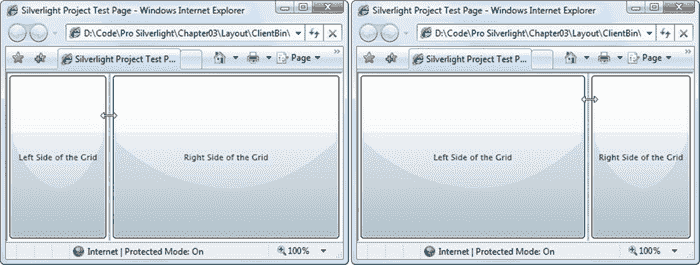

***图 3-14。**移动分割条*

 **注**grid splitter 是在 System.Windows.Controls.dll 汇编中定义的。如果您还没有使用这个程序集，那么在访问 GridSplitter 之前，您需要添加一个程序集引用和一个 XML 映射，就像使用 WrapPanel 和 DockPanel 一样。完成这两个步骤最简单的方法是从工具箱中添加 GridSplitter，Visual Studio 将为您完成这项工作。

为了有效地使用 GridSplitter，你需要对它的工作原理有更多的了解。尽管 GridSplitter 的用途很简单，但一开始可能会很笨拙。要获得您想要的结果，请遵循以下准则:

> *   Gridssplitter must be placed in a grid cell. You can place the GridSplitter in a cell that contains existing content. In this case, you need to adjust the margin settings so that it does not overlap. A better way is to reserve a dedicated column or row for GridSplitter, with the height or width value of Auto.
> *   Gridssplitter always resizes the whole row or column (not a single cell). In order to make the appearance of the GridSplitter consistent with this behavior, the GridSplitter should be extended to the whole row or column, instead of being limited to a single cell. To do this, you can use the RowSpan or ColumnSpan properties that you considered earlier. For example, [The row span of the GridSplitter in Figure 3-14](#fig_3_14) is 2\. Therefore, it will extend to the whole column. If you don't add this setting, it will only appear in the top row (where it is located), even if dragging the splitter bar will resize the whole column.
> *   At first, the GridSplitter was too small to be seen. In order to make it usable, you need to give it the smallest size. In the case of vertical split bar (like the one in Figure 3-14), you need to set vertical alignment to stretch (so it fills the entire height of the available area) and width to a fixed size (such as 10 pixels). For horizontal split bars, you need to set the HorizontalAlignment to stretch and the height to a fixed size.
> *   Grid splitter alignment also determines whether the splitter bar is horizontal (used to resize rows) or vertical (used to resize columns). In the case of horizontal split bars, you can set the VerticalAlignment to Center (which is the default value) to indicate that dragging the splitter will resize the upper and lower rows. In the case of vertical split bars (as shown in [in Figure 3-14), you can set the horizontal alignment to center to adjust the size of the columns on either side.](#fig_3_14)
> *   To really see the GridSplitter, you need to set the Background property. Otherwise, the GridSplitter will remain transparent until you click it (a light blue focus rectangle will appear at its edge). If you set the minimum and maximum sizes on the ColumnDefinition or RowDefinition object, GridSplitter will consider them. Users are not allowed to enlarge or reduce columns or rows outside the allowed size range.

为了强化这些规则，看一下图 3-14 中所示例子的实际标记会有所帮助。在下面的清单中，突出显示了 GridSplitter 的详细信息:

`<Grid Background="White">
  <Grid.ColumnDefinitions>
    <ColumnDefinition MinWidth="100"></ColumnDefinition>
**    <ColumnDefinition Width="Auto"></ColumnDefinition>**
    <ColumnDefinition MinWidth="50"></ColumnDefinition>
  </Grid.ColumnDefinitions>

  <Button Grid.Column="0" Margin="3" Content="Left Side of the Grid"></Button>
  **<controls:GridSplitter Grid.Column="1" Grid.RowSpan="2" Background="LightGray"**
**   Width="3" VerticalAlignment="Stretch" HorizontalAlignment="Center"**` `   **ShowsPreview="False"></controls:GridSplitter>**
  <Button Grid.Column="2" Margin="3" Content="Right Side of the Grid"></Button>
</Grid>`

 **提示**记住，如果一个网格只有一行或一列，你可以省略 RowDefinitions 部分。此外，没有显式设置行位置的元素被认为有网格。值为 0 的行和放在第一行。这同样适用于不提供网格的元素。列值。

这个标记包括一个额外的细节。当声明 GridSplitter 时，ShowsPreview 属性被设置为 false(这是默认值)。因此，当拆分条从一边拖到另一边时，列的大小会立即调整。但是，如果您将 ShowsPreview 设置为 true，当您拖动时，您将看到一个灰色阴影跟随您的鼠标指针，向您显示拆分的位置。在您松开鼠标按钮之前，不会调整列的大小。您还可以更改 GridSplitter 使用的填充，使它不仅仅是一个带阴影的灰色矩形。诀窍是设置背景属性。

一个网格通常只包含一个 GridSplitter。但是，您可以将一个网格嵌套在另一个网格中，如果这样做，每个网格可能都有自己的 GridSplitter。这允许您创建一个分成两个区域(例如，左窗格和右窗格)的页面，然后将其中一个区域(例如，右边的窗格)进一步细分为更多的部分(例如，可调整大小的顶部和底部)。[图 3-15](#fig_3_15) 显示了一个例子。

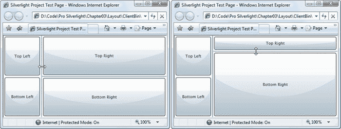

***图 3-15。**通过两次拆分调整窗口大小*

创建这个页面相当简单，尽管跟踪所涉及的三个网格容器很麻烦:整体网格、左边的嵌套网格和右边的嵌套网格。唯一的技巧是确保 GridSplitter 被放置在正确的单元格中，并被赋予正确的对齐方式。下面是完整的标记:

`<!-- This is the Grid for the entire page. -->
<Grid Background="White">
  <Grid.ColumnDefinitions>` `    <ColumnDefinition></ColumnDefinition>
    <ColumnDefinition Width="Auto"></ColumnDefinition>
    <ColumnDefinition></ColumnDefinition>
  </Grid.ColumnDefinitions>

  <!-- This is the nested Grid on the left.
       It isn't subdivided further with a splitter. -->
  <Grid Grid.Column="0" VerticalAlignment="Stretch">
    <Grid.RowDefinitions>
      <RowDefinition></RowDefinition>
      <RowDefinition></RowDefinition>
    </Grid.RowDefinitions>
    <Button Margin="3" Grid.Row="0" Content="Top Left"></Button>
    <Button Margin="3" Grid.Row="1" Content="Bottom Left"></Button>
  </Grid>

  <!-- This is the vertical splitter that sits between the two nested
       (left and right) grids. -->
  <controls:GridSplitter Grid.Column="1" Background="LightGray"
   Width="3" HorizontalAlignment="Center" VerticalAlignment="Stretch">
  </controls:GridSplitter>

  <!-- This is the nested Grid on the right. -->
  <Grid Grid.Column="2">
    <Grid.RowDefinitions>
      <RowDefinition></RowDefinition>
      <RowDefinition Height="Auto"></RowDefinition>
      <RowDefinition></RowDefinition>
    </Grid.RowDefinitions>

    <Button Grid.Row="0" Margin="3" Content="Top Right"></Button>
    <Button Grid.Row="2" Margin="3" Content="Bottom Right"></Button>

    <!-- This is the horizontal splitter that subdivides it into
         a top and bottom region.. -->
    <controls:GridSplitter Grid.Row="1" Background="LightGray"
     Height="3" VerticalAlignment="Center" HorizontalAlignment="Stretch"
     ShowsPreview="False"></controls:GridSplitter>
  </Grid>
</Grid>`

### 基于坐标的画布布局

您尚未考虑的唯一布局容器是画布。它允许您使用精确的坐标来放置元素，这对于设计丰富的数据驱动的表单和标准对话框来说是一个糟糕的选择，但是如果您需要构建一些稍微不同的东西(例如图表工具的绘图表面)，它是一个有价值的工具。画布也是最轻量级的布局容器。这是因为它不包含任何复杂的布局逻辑来协商其子节点的大小偏好。取而代之的是，它只是简单地将它们按照他们想要的精确尺寸排列在他们指定的位置。

要在画布上定位元素，需要设置附加的画布。向左拐。顶级属性。画布。Left 设置元素左边缘和画布左边缘之间的像素数。画布。顶部设置元素顶部和画布顶部之间的像素数。

或者，您可以使用元素的宽度和高度属性显式调整元素的大小。这在使用画布时比在其他面板中更常见，因为画布没有自己的布局逻辑。如果不设置 Width 和 Height 属性，元素将获得所需的大小，换句话说，它将增长到足以容纳其内容。如果您更改画布的大小，它不会影响内部的控制。

这是一个简单的画布，包括四个按钮:

`<Canvas Background="White">
  <Button Canvas.Left="10" Canvas.Top="10" Content="(10,10)"></Button>
  <Button Canvas.Left="120" Canvas.Top="30" Content="(120,30)"></Button>
  <Button Canvas.Left="60" Canvas.Top="80" Width="50" Height="50"
   Content="(60,80)"></Button>
  <Button Canvas.Left="70" Canvas.Top="120" Width="100" Height="50"
   Content="(70,120)"></Button>
</Canvas>`

[图 3-16](#fig_3_16) 显示了结果。

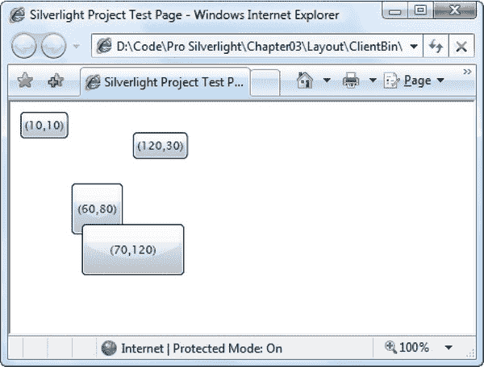

***图 3-16。**画布中明确定位的按钮*

像任何其他布局容器一样，画布可以嵌套在用户界面中。这意味着您可以使用画布在页面的一部分绘制一些详细的内容，而对其余的元素使用更标准的 Silverlight 面板。

#### 用 ZIndex 分层

如果有多个重叠元素，可以设置附加的画布。ZIndex 属性来控制它们的分层方式。

通常，您添加的所有元素都具有相同的 ZIndex—0。当元素具有相同的 ZIndex 时，它们在画布中的显示顺序相同。子集合，该集合基于它们在 XAML 标记中定义的顺序。在标记中较晚声明的元素(如 button (70，120))显示在较早声明的元素(如 button (60，80))之上。

但是，您可以通过增加 ZIndex 将任何元素提升到更高的级别。这是因为 ZIndex 较高的元素*总是*出现在 ZIndex 较低的元素之上。使用这种技术，您可以颠倒上一个示例中的分层:

`<Button Canvas.Left="60" Canvas.Top="80" Canvas.ZIndex="1" Width="50" Height="50"
 Content="(60,80)"></Button>
<Button Canvas.Left="70" Canvas.Top="120" Width="100" Height="50"
 Content="(70,120)"</Button>`

 **注意**你为画布使用的实际值。ZIndex 属性没有意义。重要的细节是一个元素的 ZIndex 值如何与另一个元素的 ZIndex 值进行比较。您可以使用任何正整数或负整数设置 ZIndex。

如果需要以编程方式更改元素的位置，ZIndex 属性特别有用。打电话给画布。SetZIndex()并传入要修改的元素和要应用的新 ZIndex。不幸的是，没有 BringToFront()或 SendToBack()方法——如果您想要实现这种行为，则由您来跟踪最高和最低的 ZIndex 值。

#### 剪裁

画布有一个方面是违反直觉的。在大多数布局容器中，内容受限于容器中的可用空间。例如，如果创建一个高度为 100 像素的 StackPanel，并在其中放置一列很高的按钮，那些不适合的按钮将从底部被砍掉。然而，画布并不遵循这个常识性的规则。相反，它会绘制它的所有子对象，即使它们超出了它的范围。这意味着您可以用一个 0 像素高和 0 像素宽的画布替换前面的例子，结果不会改变。

画布以这种方式工作是出于性能原因——很简单，对画布来说，更有效的方法是绘制它的所有子元素，然后检查每个子元素是否落在其边界内。然而，这并不总是你想要的行为。例如，[第 11 章](11.html#ch11)包括一个动画游戏，将炸弹从游戏区域的边缘飞出，游戏区域是一块画布。在这种情况下，炸弹必须只在画布内部可见——当它们离开时，它们应该消失在画布边框之下，而不是漂到其他元素之上。

幸运的是，画布支持*裁剪*，这可以确保不在指定区域内的元素(或元素的一部分)被剪切掉，就像扩展到 StackPanel 或 Grid 边缘之外的元素一样。唯一不方便的是，您需要使用画布手动设置裁剪区域的形状。剪辑属性。

从技术上讲，Clip 属性接受一个几何对象，这是一个有用的对象，当你在第 8 章中处理绘图时，你会更详细地考虑这个对象。Silverlight 为不同类型的形状提供了不同的几何派生类，包括正方形和矩形(RectangleGeometry)、圆形和椭圆形(EllipseGeometry)以及更复杂的形状(PathGeometry)。以下示例将剪辑区域设定为与画布边界匹配的矩形区域:

`<Canvas x:Name="canvasBackground" Width="200" Height="500" Background="AliceBlue">
  <Canvas.Clip>
    <RectangleGeometry Rect="0,0 200,500"></RectangleGeometry>
  </Canvas.Clip>
  ...
<Canvas>`

在此示例中，剪辑区域可以描述为一个矩形，其左上角位于点(0，0)，宽度为 200 像素，高度为 500 像素。左上角的坐标是相对于画布本身的，所以除非您想要忽略画布左上区域的一些内容，否则左上角必须始终为(0，0)。

在标记中设置剪辑区域并不总是最好的方法。如果您的画布是动态调整大小以适应可调整大小的容器或浏览器窗口，这尤其成问题。在这种情况下，以编程方式设置剪辑区域要有效得多。幸运的是，您所需要的只是一个简单的事件处理程序，当通过到达画布来调整画布大小时，它会改变剪辑区域。SizeChanged 事件。(此事件也在画布首次创建时触发，因此它也负责初始剪辑区域设置。)

`private void canvasBackground_SizeChanged(object sender, SizeChangedEventArgs e)
{
    RectangleGeometry rect = new RectangleGeometry();
    rect.Rect = new Rect(0, 0, canvasBackground.ActualWidth,
      canvasBackground.ActualHeight);
    canvasBackground.Clip = rect;
}`

您可以像这样附加事件处理程序:

`<Canvas x:Name="canvasBackground" SizeChanged="canvasBackground_SizeChanged"
 Background="AliceBlue">`

你会在第 11 章的[投掷炸弹游戏中看到这种技术。](11.html#ch11)

**选择正确的布局容器**

一般来说，Grid 和 StackPanel 最适合处理商业风格的应用(例如，显示数据输入表单或文档)。它们可以很好地处理不断变化的窗口大小和动态内容(例如，文本块可以根据手边的信息增长或收缩)。它们还使得修改、本地化和重定应用的外观变得更加容易，因为相邻的元素在改变大小时会相互碰撞。Grid 和 StackPanel 也最接近普通 HTML 页面的工作方式。

画布是完全不同的。因为它的所有子元素都是使用固定坐标排列的，所以您需要做更多的工作来定位它们(如果您想在稍后的中调整布局以响应新元素或新格式，甚至需要做更多的工作。)然而，画布在某些类型的图形丰富的应用中是有意义的，比如游戏。在这些应用中，您需要细粒度的控制，文本和图形经常重叠，并且您经常以编程方式更改坐标。在这里，重点不是灵活性，而是实现特定的视觉外观，画布更有意义。

### 自定义布局容器

尽管 Silverlight 有一个可靠的布局容器集合，但它不能提供所有的东西。Silverlight 的开发人员省略了许多更专业的布局容器，以使 Silverlight 下载尽可能精简。

然而，没有理由你不能创建一些你自己的布局容器。您只需要从 Panel 派生一个定制类，并提供适当的布局逻辑。如果你有野心，你可以把面板的布局逻辑和其他 Silverlight 特性结合起来。例如，您可以创建一个处理鼠标悬停事件的面板，为其中的元素提供自动拖动支持(如第 4 章中的拖动示例所示)，或者您可以创建一个以动画效果显示其子元素的面板。

在接下来的几节中，您将了解布局过程是如何工作的，然后您将看到如何构建一个定制的布局容器。您将考虑的示例是 uniform grid——一个精简的网格控件，它将元素平铺到一个具有相同大小单元格的表格中。

#### 两步布局流程

每个面板都使用相同的管道:这是一个负责调整和安排子面板的两步过程。第一个阶段是*测量*过程，在这一点上，面板决定它的孩子想要多大。第二阶段是*布局*阶段，在这一点上，每个控件都被赋予了它的边界。需要两个步骤，因为在决定如何划分可用空间之前，面板可能需要考虑所有子节点的需求。

通过重写奇怪命名的 MeasureOverride()和 ArrangeOverride()方法来添加这两个步骤的逻辑，这两个方法在 FrameworkElement 类中定义为 Silverlight 布局系统的一部分。奇数名称表示 MeasureOverride()和 ArrangeOverride()方法替换了 UIElement 类中定义的 MeasureCore()和 ArrangeCore()方法中定义的逻辑。这些方法*不是*可重写的。

##### 测量覆盖()

第一步是使用 MeasureOverride()方法确定每个孩子想要多少空间。然而，即使在 MeasureOverride()方法中，也不能给孩子无限的空间。最起码，孩子们被限制在面板可用的空间内。或者，您可能希望更严格地限制它们。例如，具有两个成比例大小的行的网格将给予孩子一半的可用高度。StackPanel 将为第一个元素提供所有可用的空间，然后为第二个元素提供剩余的空间，以此类推。

每个 MeasureOverride()实现负责遍历子集合，并调用每个子集合的 Measure()方法。当您调用 Measure()方法时，您提供了边界框—一个确定子控件最大可用空间的大小对象。在 MeasureOverride()方法结束时，面板返回显示其所有子元素及其所需大小所需的空间。

下面是 MeasureOverride()方法的基本结构，没有具体的大小调整细节:

`protected override Size MeasureOverride(Size panelSpace)
{
    // Examine all the children.
    foreach (UIElement element in this.Children)
    {
        // Ask each child how much space it would like, given the
        // availableElementSize constraint.
        Size availableElementSize = new Size(...);
        element.Measure(availableElementSize);
        // (You can now read element.DesiredSize to get the requested size.)
    }

    // Indicate how much space this panel requires.
    // This will be used to set the DesiredSize property of the panel.
    return new Size(...);
}`

Measure()方法不返回值。在子级上调用 Measure()后，该子级的 DesiredSize 属性提供请求的大小。您可以在计算未来子面板时使用此信息(并确定面板所需的总空间)。

您*必须*对每个孩子调用 Measure()，即使您不想约束孩子的大小或使用 DesiredSize 属性。在您调用 Measure()之前，许多元素不会呈现自己。如果你想给孩子自由的空间，传递一个值为 Double 的 Size 对象。两个维度都是肯定的。(ScrollViewer 是使用这种策略的一个元素，因为它可以处理任意数量的内容。)然后，孩子将返回其所有内容所需的空间。否则，孩子通常会返回其内容所需的空间或可用空间，以较小者为准。

在测量过程结束时，布局容器必须返回其所需的大小。在一个简单的面板中，您可以通过组合每个子面板的期望大小来计算面板的期望大小。

 **注意**你不能简单地返回传递给 MeasureOverride()方法的约束来获得你想要的面板大小。尽管这似乎是获取所有可用大小的好方法，但如果容器用 Double 传入一个 size 对象，就会遇到麻烦。一个或两个维度的 PositiveInfinity(这意味着“占用您想要的所有空间”)。尽管无限大小允许作为调整约束，但不允许作为调整结果，因为 Silverlight 无法计算出元素应该有多大。此外，你真的不应该占用过多的空间。这样做可能会导致额外的空白，并迫使布局面板之后出现的元素被移到窗口的更下方。

如果您是一个细心的读者，您可能已经注意到在每个子元素上调用的 Measure()方法和定义面板布局逻辑的第一步的 MeasureOverride()方法之间有一个非常相似的地方。事实上，Measure()方法触发了 MeasureOverride()方法。因此，如果您将一个布局容器放在另一个容器中，当您调用 Measure()时，您将获得布局容器及其所有子容器所需的总大小。

度量过程经历两步(触发 MeasureOverride()方法的 Measure()方法)的一个原因是处理边距。当您调用 Measure()时，您传递了总的可用空间。当 Silverlight 调用 MeasureOverride()方法时，它会自动减少可用空间以考虑边距空间(除非您已经传入了无限大小)。

##### 排列覆盖()

一旦每个元素都测量完毕，就该把它们放在可用的空间里了。布局系统调用面板的 ArrangeOverride()方法，面板调用每个子面板的 Arrange()方法来告诉它已经分配了多少空间。(您可能已经猜到，Arrange()方法触发 ArrangeOverride()方法，就像 Measure()方法触发 MeasureOverride()方法一样。)

当使用 Measure()方法测量项目时，需要传入一个 Size 对象来定义可用空间的边界。当使用 Arrange()方法放置一个项目时，需要传入一个系统。定义项目大小*和*位置的 Windows.Rect 对象。此时，好像每个元素都放置了画布样式的 X 和 Y 坐标，这些坐标决定了布局容器左上角和元素之间的距离。

下面是 ArrangeOverride()方法的基本结构，没有具体的大小调整细节:

`protected override Size ArrangeOverride(Size panelSize)
{
    // Examine all the children.
    foreach (UIElement element in this.Children)
    {
        // Assign the child its bounds.
        Rect elementBounds = new Rect(...);
        element.Arrange(elementBounds);
        // (You can now read element.ActualHeight and element.ActualWidth
        //  to find out the size it used.)
    }

    // Indicate how much space this panel occupies.
    // This will be used to set the ActualHeight and ActualWidth properties
    // of the panel.
    return arrangeSize;
}`

排列元素时，不能传递无限大小。但是，您可以通过从元素的 desired size 属性传入值来为元素指定所需的大小。你也可以给一个元素比它需要的更多的空间。事实上，这种情况经常发生。例如，一个垂直的 StackPanel 给一个孩子所要求的高度，但是给它面板本身的全部宽度。类似地，网格可能使用固定的或按比例调整大小的行，这些行比内部元素所需的大小要大。即使您已经将一个元素放在了一个根据内容调整大小的容器中，如果使用 Height 和 Width 属性设置了明确的大小，该元素仍然可以被放大。

当一个元素变得比预期大时，HorizontalAlignment 和 VerticalAlignment 属性开始起作用。元素内容被放在给定边界内的某个地方。

因为 ArrangeOverride()方法总是接收一个定义的大小(不是无限大小)，所以可以返回传入的 size 对象来设置面板的最终大小。事实上，许多布局容器采取这一步骤来占据所有给定的空间。您不会有占用另一个控件可能需要的空间的危险，因为布局系统的度量步骤确保您不会得到超过您需要的空间，除非该空间可用。

#### 均匀网格

既然您已经相当详细地研究了布局系统，那么就有必要创建自己的布局容器，添加一些基本的 Silverlight 面板所没有的东西。在这一节中，您将看到一个直接来自 WPF 世界的示例:一个 UniformGrid，它将其子网格排列成自动生成的大小相等的单元格。

 **注意**uniform Grid 作为常规网格的轻量级替代方案非常有用，因为它不需要显式定义行和列，也不会强迫您手动将每个子元素放在正确的单元格中。当显示一组平铺的图像时，这尤其有意义。事实上，WPF 包含了这个控件的一个更有野心的版本，作为。NET 框架。

像所有自定义面板一样，UniformGrid 从一个简单的类声明开始，该声明继承自基本面板控件:

`public class UniformGrid : System.Windows.Controls.Panel
{ ... }`

 **注意**你可以在任何 Silverlight 应用中直接构建 UniformGrid。但是如果您想在多个应用中重用您的自定义布局容器，最好将其放在一个新的 Silverlight 类库中。当您想在应用中使用自定义布局容器时，只需添加对已编译类库的引用。

从概念上讲，UniformGrid 非常简单。它检查可用空间，计算需要多少单元格(以及每个单元格有多大)，然后一个接一个地布置其子单元格。UniformGrid 允许您使用两个属性(行和列)自定义其行为，这两个属性可以单独设置或一起设置:

`public int Columns { get; set; }
public int Rows { get; set; }`

以下是行和列属性如何影响布局逻辑:

> *   If both row and column properties are set, then the UniformGrid will know how big the grid is. It only needs to divide the available space in proportion to find the size of each unit. If there are more elements than cells, no extra elements will be displayed.
> *   If only one of the attributes is set, UniformGrid will calculate the other, assuming that you want to display all the elements in it. For example, if the number of columns is set to 3 and 8 elements are placed in it, UniformGrid will divide the available space into three rows.
> *   If these two attributes are not set, UniformGrid will calculate these two attributes, assuming that you want to display all elements and you want the same number of rows and columns. (However, UniformGrid does not create completely blank rows or columns. On the contrary, if it can't exactly match the number of rows and columns, UniformGrid will add an extra column. )

为了实现这个系统，UniformGrid 跟踪实际的行数和列数。如果设置了 Columns 和 Rows 属性，它将保存这些属性中的值。如果没有，网格将使用一个名为 CalculateColumns()的自定义方法来计算子元素的数量并确定网格的维度。然后，可以在布局的第一阶段调用此方法。

`private int realColumns;
private int realRows;

private void CalculateColumns()
{
    // Count the elements, and don't do anything
    // if the panel is empty.
    double elementCount = this.Children.Count;
    if (elementCount == 0) return;

    realRows = Rows;
    realColumns = Columns;

    // If the Rows and Columns properties were set, use them.
    if ((realRows != 0) && (realColumns != 0))
        return;

    // If neither property was set, start by calculating the columns.
    if ((realColumns == 0) && realRows == 0)
        realColumns = (int)Math.Ceiling(Math.Sqrt(elementCount));

    // If only Rows is set, calculate Columns.
    if (realColumns == 0)
        realColumns = (int)Math.Ceiling(elementCount / realRows);

    // If only Columns is set, calculate Rows.
    if (realRows == 0)
        realRows = (int)Math.Ceiling(elementCount / realColumns);
}`

Silverlight 布局系统通过调用 UniformGrid 中的 MeasureOverride()方法来启动布局过程。它需要调用列计算方法(确保设置了行数和列数)，然后将可用空间划分为大小相等的单元格。

`protected override Size MeasureOverride(Size constraint)
{
    CalculateColumns();

    // Share out the available space equally.
    Size childConstraint = new Size(
      constraint.Width / realColumns, constraint.Height / realRows);
    ...`

现在需要测量 UniformGrid 中的元素。但是，有一个技巧—当调用元素的 Measure()方法时，它可能返回一个更大的值，表明它的最小大小大于分配的空间。UniformGrid 跟踪请求的最大宽度和高度值。最后，当整个测量过程完成时，UniformGrid 会计算使每个单元格足够大以容纳最大宽度和高度所需的大小。然后，它将该信息作为其请求的大小返回。

`    ...
    // Keep track of the largest requested dimensions for any element.
    Size largestCell = new Size();

    // Examine all the elements in this panel.
    foreach (UIElement child in this.Children)
    {
        // Get the desired size of the child.
        child.Measure(childConstraint);

        // Record the largest requested dimensions.
        largestCell.Height = Math.Max(largestCell.Height, child.DesiredSize.Height);
        largestCell.Width = Math.Max(largestCell.Width, child.DesiredSize.Width);
    }

    // Take the largest requested element width and height, and use
    // those to calculate the maximum size of the grid.
    return new Size(largestCell.Width * realColumns, largestCell.Height * realRows);
}`

ArrangeOverride()代码有类似的任务。然而，它不再测量孩子。相反，它记录最终的空间度量，计算单元大小，并将每个子单元放置在适当的边界内。如果它到达了网格的末尾，但仍然有额外的元素(只有当控件使用者设置了列和行的限制值时才会出现这种情况)，则这些额外的项会被赋予一个 0×0 布局框，从而隐藏它们。

`protected override Size ArrangeOverride(Size arrangeSize)
{
    // Calculate the size of each cell.
    double cellWidth = arrangeSize.Width / realColumns;
    double cellHeight = arrangeSize.Height / realRows;

    // Determine the placement for each child.
    Rect childBounds = new Rect(0, 0, cellWidth, cellHeight);

    // Examine all the elements in this panel.
    foreach (UIElement child in this.Children)
    {
        // Position the child.
        child.Arrange(childBounds);

        // Move the bounds to the next position.                
        childBounds.X += cellWidth;
        if (childBounds.X >= cellWidth * realColumns)
        {
            // Move to the next row.` `            childBounds.Y += cellHeight;
            childBounds.X = 0;

            // If there are more elements than cells,
            // hide extra elements.
            if (childBounds.Y >= cellHeight * realRows)
                childBounds = new Rect(0, 0, 0, 0);
        }
    }

    // Return the size this panel actually occupies.                        
    return arrangeSize;
}`

使用 UniformGrid 很容易。您只需在 XAML 标记中映射名称空间，然后像定义任何其他布局容器一样定义 UniformGrid。下面是一个将 UniformGrid 放在带有一些文本内容的 StackPanel 中的例子。这使您可以验证 UniformGrid 的大小是否计算正确，并确保它后面的内容不会被挡住:

`<UserControl x:Class="Layout.UniformGridTest"

 xmlns:x="http://schemas.microsoft.com/winfx/2006/xaml"
 **xmlns:local="clr-namespace:Layout"** >
  <StackPanel Background="White">
    <TextBlock Margin="5" Text="Content above the WrapPanel."></TextBlock>

    **<local:UniformGrid Margin="5" Background="LawnGreen">**
      <Button Height="20" Content="Short Button"></Button>
      <Button Width="150" Content="Wide Button"></Button>
      <Button Width="80" Height="40" Content="Fixed Button"></Button>
      <TextBlock Margin="5" Text="Text in the UniformGrid cell goes here"
        TextWrapping="Wrap" Width="100"></TextBlock>
      <Button Width="80" Height="20" Content="Short Button"></Button>
      <TextBlock Margin="5" Text="More text goes in here"
        VerticalAlignment="Center"></TextBlock>
      <Button Content="Unsized Button"></Button>
      <Button Content="Unsized Button"></Button>
    **</local:UniformGrid>**
    <TextBlock Margin="5" Text="Content below the WrapPanel."></TextBlock>
  </StackPanel>
</UserControl>`

[图 3-17](#fig_3_17) 显示了该标记是如何显示的。通过检查 UniformGrid 中子元素的不同大小特征，您可以设置其布局在实践中的工作方式。例如，第一个按钮(名为 Short Button)有一个硬编码的 Height 属性。因此，它的高度是有限的，但它会自动占据单元格的整个宽度。第二个按钮(宽按钮)有一个硬编码的宽度属性。但是，它是 UniformGrid 中最宽的元素，这意味着它的宽度决定了整个表格的单元格宽度。因此，它的尺寸与未调整大小的按钮完全匹配，两者都填充了所有可用的单元格空间。同样，TextBlock 中的三行换行文本需要最大的垂直净空，因此决定了网格中所有单元格的高度。

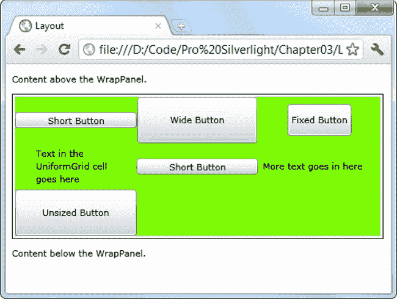

***图 3-17。**统一网格*

### 调整页面大小

到目前为止，您已经广泛了解了 Silverlight 提供的不同布局容器，以及如何使用它们来排列元素组。然而，这个等式中有一个重要的部分你还没有考虑到——包含整个用户界面的顶层页面。

正如您已经看到的，每个 Silverlight 页面的顶级容器是一个从 UserControl 派生的自定义类。UserControl 类将一个名为 Content 的属性添加到 Silverlight 的基本元素基础结构中。Content 属性接受单个元素，该元素成为该用户控件的内容。

用户控件不包含任何特殊的功能，它们只是一种将相关元素组合在一起的便捷方式。但是，调整用户控件大小的方式会影响整个用户界面的外观，因此值得仔细研究一下。

您已经看到了如何使用具有各种布局属性的不同布局容器来控制元素的大小是否适合其内容、可用空间或硬编码的尺寸。在调整页面大小时，许多相同的选项都可用，包括:

> *   Fixed size: set the width and height attributes of the user control to give your page an accurate size. If the controls in the page exceed these sizes, they will be truncated. When using a fixed-size window, the HorizontalAlignment and VerticalAlignment properties of the user control are usually changed to Center, so it will float in the center of the browser window instead of being locked in the upper left corner.
> *   Browser size: If the width and height attributes of the user control are not used, the application will occupy all the space allocated to it in the Silverlight content area. (By default, the HTML portal page created by Visual Studio resizes the Silverlight content area to 100% of the browser window. ) If you use this method, you can still create elements beyond the boundaries of the display area, but users can now observe the problem and resize the browser window to see the missing content. If you want to leave some blank space between the page and the browser window when using this method, you can set the Margin property of the user control.
> *   Constraint size: Instead of width and height attributes, use maximum width, maximum height, minimum width and minimum height attributes. Now, the user control will adjust its size within a reasonable range to adapt to the browser window. When the window reaches a very large or very small size, it will stop resizing to ensure that it will never be confused and unrecognizable. Infinite size: In some cases, it makes sense for your Silverlight content area to occupy more space than the entire browser window. In this case, the browser will add scroll bars, just as it handles long HTML pages. To achieve this effect, you need to delete the Width and Height attributes and edit the entrance page (TestPage.html). In the entry page, delete the attributes `width="100%"` and `height="100%"` in the element. In this way, the Silverlight content area will be allowed to grow to fit the size of the user control.

 **注意**记住，Visual Studio 和 Expression Blend 等设计工具会将 DesignWidth 和 DesignHeight 属性添加到用户控件中。这些属性仅在设计时影响页面的呈现(在设计时，它们的作用类似于 Width 和 Height 属性)。在运行时，它们会被忽略。它们的主要目的是允许您创建遵循浏览器大小模型的用户界面，同时在设计时为您提供应用的真实预览。

所有这些方法都是合理的选择。它仅仅依赖于你正在构建的用户界面的类型。当您使用非固定大小的页面时，您的应用可以通过重排其布局来利用浏览器窗口中的额外空间。缺点是过大或过小的窗口可能会使你的内容更难阅读或使用。您可以针对这些问题进行设计，但这需要更多的工作。另一方面，硬编码大小的缺点是，无论浏览器窗口看起来如何，你的应用将永远被锁定在一个特定的窗口大小。这会导致大量的空白空间(如果你硬编码的尺寸小于浏览器窗口)或者使应用不可用(如果你硬编码的尺寸大于浏览器窗口)。

一般来说，可调整大小的页面更灵活，在可能的情况下更受欢迎。它们通常是商业应用和具有不需要太多图形的传统用户界面的应用的最佳选择。另一方面，图形丰富的应用和游戏通常需要更精确地控制页面中发生的事情，并且更有可能使用固定的页面大小。

 **提示**如果你在测试不同的方法，这有助于使页面的界限更加明显。一种简单的方法是对顶级内容元素应用非白色背景(例如，将网格的 background 属性设置为黄色)。您不能在用户控件本身上设置 Background 属性，因为 user control 类不提供该属性。另一种选择是使用 Border 元素作为顶级元素，这允许您勾画页面区域的轮廓。

还有一些更专业的调整选项，您将在下面的章节中了解:可滚动界面、可伸缩界面和全屏界面。

#### 使用滚动条查看器滚动

你见过的容器都没有提供对*滚动*的支持，这是在有限的空间内容纳大量内容的一个关键特性。在 Silverlight 中，滚动支持很容易获得，但是它需要另一个组件 ScrollViewer 内容控件。

要获得滚动支持，您需要将想要滚动的内容包装在 ScrollViewer 中。虽然 ScrollViewer 可以容纳任何东西，但通常会用它来包装布局容器。例如，这里有一个可滚动的两列文本框和按钮网格。页面大小适合整个浏览器区域，但它增加了一个边距，以帮助区分滚动条和它周围的浏览器窗口。下面的清单显示了该示例的基本结构，以及创建第一行元素的标记:

`<UserControl x:Class="Layout.Scrolling"

 xmlns:x="http://schemas.microsoft.com/winfx/2006/xaml"
 Margin="20">
  <ScrollViewer Background="AliceBlue">
    <Grid Margin="3,3,10,3">
      <Grid.RowDefinitions>
        <RowDefinition Height="Auto"></RowDefinition>
        ...
      </Grid.RowDefinitions>
      <Grid.ColumnDefinitions>
        <ColumnDefinition Width="*"></ColumnDefinition>
        <ColumnDefinition Width="Auto"></ColumnDefinition>
      </Grid.ColumnDefinitions>

      <TextBox Grid.Row="0" Grid.Column="0" Margin="3"
       Height="Auto" VerticalAlignment="Center"></TextBox>
      <Button Grid.Row="0" Grid.Column="1" Margin="3" Padding="2"
       Content="Browse"></Button>` `      ...
    </Grid>
  </ScrollViewer>
</UserControl>`

[图 3-18](#fig_3_18) 显示了结果。

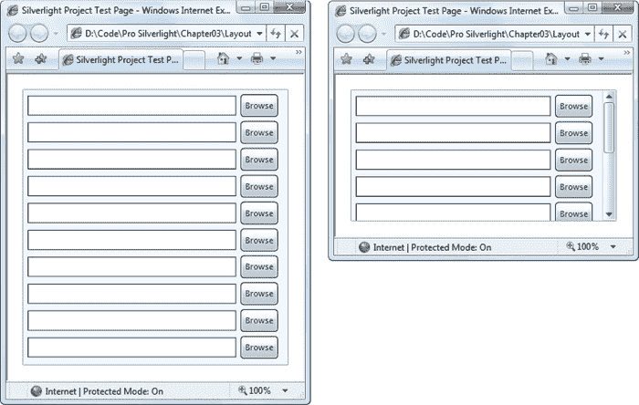

***图 3-18。**一个可滚动的页面*

如果在本例中调整页面大小，使其足以容纳所有内容，滚动条将被禁用。但是，滚动条仍然可见。您可以通过设置 VerticalScrollBarVisibility 属性来控制此行为，该属性采用 ScrollBarVisibility 枚举中的值。Visible 的默认值确保垂直滚动条始终存在。如果您希望滚动条在需要时出现，在不需要时消失，请使用自动。或者，如果您根本不希望滚动条出现，请使用禁用。

 **注意**你也可以使用 Hidden，类似于 Disabled 但又有微妙的不同。首先，带有隐藏滚动条的内容仍然是可滚动的。(例如，您可以使用箭头键滚动浏览内容。)其次，ScrollViewer 中的内容布局不同。当你使用 Disabled 时，你告诉 ScrollViewer 中的内容它只有和 ScrollViewer 本身一样多的空间。另一方面，如果你使用 Hidden，你告诉内容它有无限的空间。这意味着它可以溢出并延伸到可滚动区域。

ScrollViewer 还支持水平滚动。但是，默认情况下，HorizontalScrollBarVisibility 属性是隐藏的。要使用水平滚动，您需要将该值更改为 Visible 或 Auto。

#### 用视图框缩放

在本章的前面，您看到了网格如何使用比例大小来确保您的元素占据所有可用空间。因此，网格是构建可调整大小的界面的一个很好的工具，该界面可以根据浏览器窗口的大小进行缩放。

尽管这种调整大小的行为通常是您想要的，但它并不总是合适的。更改控件的尺寸会改变它们可以容纳的内容量，并且可能会产生微妙的布局偏移效果。在图形丰富的应用中，您可能需要更精确的控制来保持元素完美对齐。然而，这并不意味着您需要使用固定大小的页面。相反，你可以使用另一个技巧，叫做*缩放*。

本质上，缩放会调整控件的整个视觉外观，而不仅仅是其外部边界。无论比例如何，控件都可以保存相同的内容，只是看起来不同而已。从概念上讲，这就像改变缩放级别。

[图 3-19](#fig_3_19) 对比区别。左边是一个正常大小的窗口。中间是放大的窗口，使用传统的大小调整。右边是使用缩放的同一个扩展窗口。

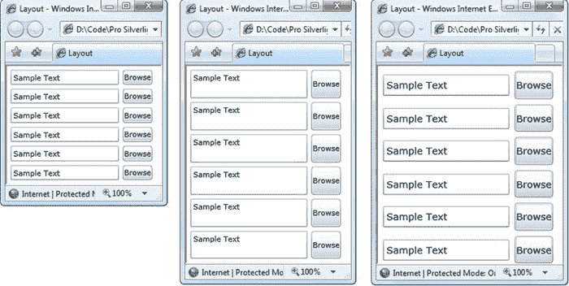

***图 3-19。**比较原始(左)、调整大小(中)和重新调整比例(右)的页面*

要使用缩放，您需要使用一个*变换*。正如你将在[第八章](08.html#ch8)中发现的，变换是 Silverlight 灵活的二维绘制框架的关键部分。它们允许您重新缩放、倾斜、旋转以及以其他方式更改任何元素的外观。在本例中，您需要 ScaleTransform 的帮助来更改页面的比例。

您可以通过两种方式使用 ScaleTransform。第一种选择是自己动手。您响应用户控件。SizeChanged 事件，检查页面的当前大小，执行适当的计算，并手动创建 ScaleTransform。尽管这种方法可行，但还有一种痛苦小得多的替代方法。您可以使用 Viewbox 控件，它执行完全相同的任务，但不需要一行代码。

在编写所需的重新调整代码之前，需要确保标记配置正确。以下是您必须满足的要求:

> 你的用户控件不能被明确地调整大小——相反，它需要能够增长以充满浏览器窗口。*   To resize a window to the right size, you need to know its ideal size, that is, the size that just fits all its contents. Although these dimensions will not be set in your markup, they will be used for scaling calculation in the code.

只要这些细节到位，创建一个可伸缩的页面是相当容易的。下面的标记使用了一个理想尺寸为 200×225 像素的网格，并包含如图 3-19 所示的文本框和按钮的堆栈:

`<UserControl x:Class="Layout.Page"

 xmlns:x="http://schemas.microsoft.com/winfx/2006/xaml"` `  <!-- This container is required for rescaling. -->
  **<Viewbox>**
    <!-- This container is the layout root of your ordinary user interface.          Note that it uses a hard-coded size. -->
    <Grid Background="White" **Width="200" Height="225"** Margin="3,3,10,3">
      <Grid.RowDefinitions>
        ...
      </Grid.RowDefinitions>
      <Grid.ColumnDefinitions>
        <ColumnDefinition Width="*"></ColumnDefinition>
        <ColumnDefinition Width="Auto"></ColumnDefinition>
      </Grid.ColumnDefinitions>

      <TextBox Grid.Row="0" Grid.Column="0" Margin="3"
       Height="Auto" VerticalAlignment="Center" Text="Sample Text"></TextBox>
      <Button Grid.Row="0" Grid.Column="1" Margin="3" Padding="2"
       Content="Browse"></Button>
      ...

    </Grid>
**</Viewbox>**
</UserControl>`

在此示例中，视图框保留了调整大小后的内容的纵横比。换句话说，它调整内容的大小以适应最小的维度(高度或宽度)，而不是按比例拉伸内容以填充所有可用空间。如果您想使用一个不考虑比例而拉伸其内容的视图框，只需将 stretch 属性设置为 Fill。这对于页面缩放不是很有用，但是如果您将视图框用于另一个目的，比如调整按钮中矢量图形的大小，这可能是有意义的。

最后，值得注意的是，您可以通过在 ScrollViewer 中放置一个 Viewbox 来创建一些有趣的效果。例如，您可以手动将 Viewbox 的大小设置为大于可用空间(使用其高度和宽度属性)，然后在放大的内容内滚动。您可以使用这种技术来创建一个可缩放的用户界面，当用户拖动滑块或转动鼠标滚轮时，该界面会增加缩放比例。你会在第 4 章的[中看到一个使用鼠标滚轮的例子。](04.html#ch4)

**SILVERLIGHT 支持浏览器缩放**

当在一些浏览器和操作系统中访问时——目前是 Firefox 和 Internet Explorer 的最新版本——Silverlight 应用支持一个名为 *autozoom* 的功能。这意味着用户可以更改缩放百分比来缩小或放大 Silverlight 应用。(在 Internet Explorer 中，这可以使用浏览器状态栏的视图缩放菜单来完成。)例如，如果用户选择 110%的缩放百分比，整个 Silverlight 应用(包括其文本、图像和控件)将放大 10%。

在很大程度上，这种行为是有意义的——这正是你想要的。但是，如果您计划创建一个自己提供缩放功能的应用，浏览器的自动缩放功能可能不合适。在这种情况下，只需将 enableAutoZoom 参数添加到 HTML 条目页面并将其设置为 false，即可禁用自动缩放，如下所示:

`

  <object data="data:application/x-silverlight-2,"
   type="application/x-silverlight-2" width="100%" height="100%">
    <param name="enableAutoZoom" value="false" />
    ...
  </object>
  <iframe style='visibility:hidden;height:0;width:0;border:0px'></iframe>

`

#### 全屏模式

Silverlight 应用也能够进入全屏模式，这允许它们一起跳出浏览器窗口。在全屏模式下，Silverlight 插件填充整个显示区域，并显示在包括浏览器在内的所有其他应用的上方。

全屏模式有一些严重的限制:

> *   You can only switch to full-screen mode in response to user input events: in other words, you can switch to full-screen mode when the user clicks a button or presses a key. However, you cannot switch to full-screen mode immediately after the application is loaded. (If you try to do this, your code will be ignored. ) This restriction is designed to prevent Silverlight application from deceiving users into thinking that it is actually another local application or system window.
> *   In full screen mode, keyboard access is restricted: your code will still respond to the following keys: Tab, Enter, Home, End, Page Up, Page Down, space bar and arrow keys. All other keys are ignored. This means that you can build a simple full-screen arcade game, but you can't use text boxes or other input controls. This restriction is designed to prevent password spoofing, for example, by imitating the Windows dialog box to trick users into entering passwords. The only exception is that if you are creating an application to enhance trust (see [Chapter 18](18.html#ch18) ), it will not face this restriction.

 **注意**全屏模式主要是为在大窗口中显示视频内容而设计的。有些键是允许的——只够构建简单的图形应用(例如，照片浏览器)和游戏。要处理输入控件之外的按键，只需处理标准的 KeyPress 事件。(例如，您可以添加一个按键事件处理程序到您的根布局容器中，以捕获发生的每一次按键，如第 4 章中的[所述。)](04.html#ch4)

下面是一个事件处理程序，它通过切换到全屏模式来响应按钮的按下:

`private void Button_Click(object sender, RoutedEventArgs e)
{
    Application.Current.Host.Content.IsFullScreen = true;
}`

当你的应用进入全屏模式时，它会显示一条如图 3-20 所示的信息。此消息包括应用所在的 web 域。如果你使用的是 ASP.NET 网站和内置的 Visual Studio web 服务器，你会看到域名 [http://localhost](http://localhost) 。如果您使用存储在硬盘上的 HTML 测试页面托管您的应用，您将看到域文件://。该消息还通知用户可以通过按 Esc 键退出全屏模式。或者，可以将 IsFullScreen 属性设置为 false 以退出全屏模式。

***图 3-20。**全屏模式消息*

为了让您的应用利用全屏模式，您的顶级用户控件不应具有固定的高度或宽度。这样，它可以增长以适应可用的空间。当进入全屏模式时，您还可以使用上一节中描述的缩放技术，通过呈现转换将应用中的元素缩放到更大的尺寸。

在 Silverlight 应用中，还有一种方法可以摆脱全屏模式:切换到另一个应用。通常，这种行为非常合理。但如果你有一个多显示器的设置，它可能不是你想要的。它防止您在一台监视器上运行全屏 Silverlight 应用，而在另一台监视器上使用另一个应用。

如果您想防止这种行为，您可以使用下面的代码行来“固定”全屏应用，这样即使当应用失去焦点时，它也会保持全屏模式:

`Application.Current.Host.Content.FullScreenOptions =
  FullScreenOptions.StaysFullScreenWhenUnfocused;`

在切换到全屏模式之前，您必须使用此选项*。然后，当你设置 IsFullScreen 属性时，用户将被提示给你的应用保持锁定的许可([图 3-21](#fig_3_21) )。确认对话框还包括一个记住用户选择的选项，在这种情况下，下次应用切换到全屏模式时，该消息将不会显示。*

如果用户接受，窗口将保持全屏显示，直到用户按下 Esc 键或者您的代码将 IsFullScreen 属性设置为 false。如果用户不接受，应用将以正常行为切换到全屏模式，这意味着当应用失去焦点时，它将失去全屏状态。

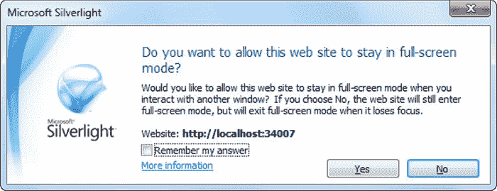

***图 3-21。**切换到带有固定窗口的全屏模式*

### 最后一个字

在本章中，您详细浏览了新的 Silverlight 布局模型，并学习了如何在堆栈、网格和其他排列中放置元素。您使用布局容器的嵌套组合构建了更复杂的布局，并将 GridSplitter 融入其中，以制作可调整大小的拆分页面。您甚至考虑如何构建自己的布局容器来获得自定义效果。最后，您看到了如何通过调整布局大小、重新缩放布局并使其充满整个屏幕来控制承载整个布局的顶级用户控件。