## T1】C H A P T E R 4

## 依赖属性和路由事件

此时，您可能渴望深入 Silverlight 编码的一个现实的、实用的例子。但是在开始之前，您需要了解更多的基础知识。在这一章中，您将快速浏览两个重要的 Silverlight 概念:*依赖属性*和*路由事件*。

这两个概念首先出现在 Silverlight 的老大哥技术 WPF 中。对于大多数开发者来说，这是一个相当大的惊喜——毕竟，很少有人会想到一种用户界面技术能够重组的核心部分。NET 的对象抽象。然而，WPF 的改变并不是为了改善。而是为了支持关键的 WPF 特性。新的属性模型允许 WPF 元素插入到数据绑定、动画和样式等服务中。新的事件模型允许 WPF 采用分层的内容模型(如下一章所述),而不会使响应用户动作(如鼠标点击和按键)的任务变得非常复杂。

Silverlight 借用了这两个概念，尽管是以精简的形式。在这一章中，你将看到它们是如何工作的。

 **新功能** Silverlight 5 为点击事件增加了一个微小但有用的改进。正如您将在本章中看到的，一个新的 ClickCount 属性允许您检测双击和三击，这在以前需要笨拙的解决方法(如计时器)。有关详细信息，请参见“双击和三击”一节。

### 依赖属性

本质上，依赖属性是可以直接设置(例如，通过您的代码)或通过 Silverlight 的服务之一(例如数据绑定、样式或动画)设置的属性。这个系统的关键特征是这些不同的属性提供者被优先化的方式。例如，动画在运行时将优先于所有其他服务。这些重叠的因素造就了一个非常灵活的系统。它们也给依赖属性命名——本质上，一个依赖属性*依赖于多个属性提供者*，每个属性提供者都有自己的优先级。

Silverlight 元素公开的大多数属性都是依赖项属性。例如，TextBlock 的 Text 属性、按钮的 Content 属性和网格的 Background 属性——所有这些都是依赖属性。这暗示了 Silverlight 依赖属性的一个重要原则——它们被设计成以与普通属性相同的方式使用。这是因为 Silverlight 库中的依赖属性总是由普通的属性定义包装。

尽管依赖特性可以像普通属性一样在代码中读取和设置，但它们在后台的实现方式却完全不同。原因很简单，就是性能。如果 Silverlight 的设计者只是在。NET 属性系统，他们需要创建一个复杂的，庞大的层，让您的代码通过。如果没有这种额外的开销，普通属性不可能支持依赖属性的所有特性。

 **提示**一般来说，你不需要知道一个属性是依赖属性才能使用它。但是，某些 Silverlight 功能仅限于依赖属性。此外，您需要理解依赖属性，以便在您自己的类中定义它们。

#### 定义和注册依赖属性

使用依赖属性比创建它们花费的时间要多得多。然而，仍然有许多原因需要您创建自己的依赖属性。显然，如果你正在设计一个定制的 Silverlight 元素，它们是一个关键的组成部分。在某些情况下，如果您想要将数据绑定、动画或另一个 Silverlight 特性添加到本来不支持它的代码部分，那么它们也是必需的。

创建依赖属性并不困难，但是语法需要一点时间来适应。这和创造一个普通的。净资产。

第一步是定义一个对象，*代表*你的属性。这是 DependencyProperty 类(在系统中找到)的实例。Windows 命名空间)。您的物业信息需要随时可用。因此，必须将 DependencyProperty 对象定义为关联类中的静态字段。

例如，考虑所有 Silverlight 元素都从其继承的 FrameworkElement 类。FrameworkElement 定义了所有元素共享的边距依赖属性。它是这样定义的:

`public class FrameworkElement: UIElement
{
**    public static readonly DependencyProperty MarginProperty;**

    ...
}`

按照惯例，定义依赖属性的字段具有普通属性的名称，并在末尾加上单词 *Property* 。这样，您可以将依赖项属性定义与实际属性的名称分开。该字段是用 readonly 关键字定义的，这意味着它只能在 FrameworkElement 的静态构造函数中设置。

注意 Silverlight 不支持 WPF 的属性共享系统——换句话说，在一个类中定义一个依赖属性并在另一个类中重用它。然而，依赖属性遵循继承的常规规则，这意味着依赖属性(如 FrameworkElement 类中定义的 Margin)适用于所有 Silverlight 元素，因为所有 Silverlight 元素都是从 FrameworkElement 派生的。

定义 DependencyProperty 对象只是第一步。为了使它变得可用，您需要向 Silverlight 注册您的依赖属性。此步骤需要在任何代码使用属性之前完成，因此必须在关联类的静态构造函数中执行。

Silverlight 确保 DependencyProperty 对象不能被直接实例化，因为 DependencyProperty 类没有公共构造函数。相反，只能使用静态 DependencyProperty 创建 DependencyProperty 实例。Register()方法。Silverlight 还确保 DependencyProperty 对象在创建后不能被更改，因为所有 DependencyProperty 成员都是只读的。相反，它们的值必须作为 Register()方法的参数提供。

下面的代码显示了如何创建 DependencyProperty 的示例。这里，FrameworkElement 类使用静态构造函数来初始化 MarginProperty:

`static FrameworkElement()
{
    MarginProperty = DependencyProperty.Register("Margin",
      typeof(Thickness), typeof(FrameworkElement), null);
    ...
}`

依赖属性。Register()方法接受以下参数:

*   属性名(本例中为 Margin)。
*   属性使用的数据类型(本例中为厚度结构)。
*   拥有该属性的类型(本例中为 FrameworkElement 类)。
*   提供附加信息的 PropertyMetadata 对象。目前，Silverlight 使用 PropertyMetadata 来存储可选的信息:属性的默认值和属性更改时将触发的回调。如果您不需要使用这两个特性，请提供一个空值(Nothing)，如下例所示。

 **注意**要查看使用 PropertyMetadata 对象设置默认值的依赖属性，请参考本章后面的 WrapBreakPanel 示例。

有了这些细节，您就能够注册一个新的依赖属性，以便可以使用它。但是，典型的属性过程检索或设置私有字段的值，而 Silverlight 属性的属性过程使用在基本 DependencyObject 类中定义的 GetValue()和 SetValue()方法。这里有一个例子:

`Public Thickness Margin
{
    get
    {
        return (Thickness)GetValue(MarginProperty);
    }
    set
    {
        SetValue(MarginProperty, value);
    }
}`

创建属性包装时，只应包括对 SetValue()的调用和对 GetValue()的调用，如前面的示例所示。您应该*而不是*添加任何额外的代码来验证值、引发事件等等。这是因为 Silverlight 中的其他功能可能会绕过属性包装器，直接调用 SetValue()和 GetValue()。一个例子是当 Silverlight 解析器读取您的 XAML 标记并使用它来初始化您的用户界面。

现在，您拥有了一个全功能的依赖属性，您可以像设置其他属性一样设置它。使用属性包装的. NET 属性:

`myElement.Margin = new Thickness(5);`

还有一个额外的细节。依赖项属性遵循严格的优先级规则来确定它们的当前值。即使您没有直接设置依赖属性，它也可能已经有了一个值——可能是由绑定或样式应用的值，或者是通过元素树继承的值。(您将在下一节了解更多关于这些优先规则的内容。)但是，一旦直接设置了值，它就会覆盖这些其他影响。

在以后的某个时刻，您可能希望删除本地值设置，并让属性值被确定，就像您从未设置它一样。显然，你不能通过设置一个新值来完成这个任务。相反，您需要使用从 DependencyObject 继承的另一个方法:ClearValue()方法。以下是它的工作原理:

`myElement.ClearValue(FrameworkElement.MarginProperty);`

该方法告诉 Silverlight 将该值视为从未设置过，从而将其返回到以前的值。通常，这将是为属性设置的默认值，但也可以是通过属性继承或样式设置的值，如下一节所述。

#### 动态值分辨率

正如您已经了解到的，依赖属性依赖于多个不同的服务，称为*属性提供者*。要确定属性的当前值，Silverlight 必须决定哪个值优先。这个过程被称为*动态值解析*。

评估属性时，Silverlight 会考虑以下因素，按优先级从高到低排列:

1.  **动画。**如果动画当前正在运行，并且该动画正在更改属性值，Silverlight 将使用动画值。
2.  **本地值。**如果您已经在 XAML 或代码中显式设置了一个值，Silverlight 将使用本地值。请记住，您可以使用 SetValue()方法或属性包装来设置值。如果你使用资源([第 2 章](02.html#ch2))或者数据绑定([第 16 章](16.html#ch16))来设置一个属性，它被认为是一个本地设置的值。
3.  **款式。** Silverlight 样式([第 12 章](12.html#ch12))允许你用一个规则配置多个控件。如果您已经设置了适用于此控件的样式，它现在就开始起作用。
4.  **Property value inheritance.** Silverlight uses *property value inheritance* with a small set of control properties, including Foreground, FontFamily, FontSize, FontStretch, FontStyle, and FontWeight. That means if you set these properties in a higher-level container (such as a Button or a ContentControl), they cascade down to the contained content elements (like the TextBlock that actually holds the text inside).

     **注意**属性值继承的限制是容器必须提供你想要使用的属性。例如，您可能希望通过在根网格上设置 FontFamily 属性来为整个页面指定标准字体。然而，这是行不通的，因为网格不是从 Control 派生的，所以它不提供 FontFamily 属性。一种解决方案是将元素包装在 ContentControl 中，content control 包括所有使用属性值继承的属性，但没有内置的可视外观。

5.  **默认值。**如果没有其他属性设置器在工作，则 dependency 属性将获得其默认值。默认值是在第一次创建依赖属性时用 PropertyMetadata 对象设置的，如前一节所述。

这个系统的优点之一是非常经济。例如，如果属性的值没有在本地设置，Silverlight 将从模板或样式中检索它的值。在这种情况下，不需要额外的内存来存储该值。另一个优点是不同的属性提供者可能会覆盖另一个，但是它们不会互相覆盖。例如，如果设置一个局部值，然后触发动画，则动画会暂时取得控制权。但是，您的本地值会被保留，当动画结束时，它会重新生效。

#### 附加属性

第 2 章介绍了一种特殊类型的从属财产，称为*附属财产*。附加属性是一个成熟的依赖属性，像所有的依赖属性一样，它由 Silverlight 属性系统管理。区别在于附加属性应用于定义它的类之外的类。

附加属性最常见的例子是你在第 3 章中看到的布局容器。例如，Grid 类定义了附加的属性 Row 和 Column，您可以在所包含的元素上设置这些属性，以指示它们应该放置的位置。类似地，画布定义了附加的属性 Left 和 Top，允许您使用绝对坐标放置元素。

若要定义附加属性，请使用 DependencyProperty。RegisterAttached()方法，而不是 Register()。下面是注册附加网格的 Grid 类的代码。行属性:

`RowProperty = DependencyProperty.RegisterAttached(
  "Row", typeof(int), typeof(Grid), null);`

RegisterAttached()方法的参数与 Register()方法的参数完全相同。

创建附加属性时，不需要定义。NET 属性包装。这是因为附加属性可以在任何依赖对象的*上设置。例如，网格。Row 属性可以在 Grid 对象(如果一个网格嵌套在另一个网格中)或其他元素上设置。事实上，网格。即使元素不在网格中，即使元素树中没有一个网格对象，也可以在元素上设置 Row 属性。*

附加的属性需要一对共享的静态方法来设置和获取属性值，而不是使用. NET 属性包装。这些方法使用熟悉的 SetValue()和 GetValue()方法(从 DependencyObject 类继承)。共享的静态方法应该命名为 Set *PropertyName* ()和 Get *PropertyName* ()。

SetPropertyName()方法有两个参数:要设置属性的元素和属性值。因为电网。行属性定义为整数，则 SetRow()方法的第二个参数必须是整数:

`public static void SetRow(UIElement element, int value)
{
    element.SetValue(Grid.RowProperty, value);
}`

GetPropertyName()方法获取设置了属性的元素并返回属性值。因为电网。行属性定义为整数，GetRow()方法必须返回一个整数:

`public static int GetRow(UIElement element)
{
    return (int)element.GetValue(Grid.RowProperty);
}`

下面是一个使用代码将元素定位在网格第一行的示例:

`Grid.SetRow(txtElement, 0);`

这将设置网格。属性设置为 0，这是一个文本框。因为网格。Row 是一个附加属性，Silverlight 允许您将其应用于任何其他元素。

#### WrapBreakPanel 示例

现在您已经理解了依赖属性背后的理论，是时候将您的知识建立在一个现实的例子上了。

在第 3 章中，你学习了如何创建使用不同布局逻辑的定制面板来获得你想要的效果。例如，您看到了一个自定义的 UniformGrid 面板，它将元素组织到一个由相同大小的单元格组成的不可见网格中。下面的示例考虑一个不同的自定义布局面板的一部分，该面板称为 WrapBreakPanel。下面是它的类声明:

`public class WrapBreakPanel : System.Windows.Controls.Panel
{ ... }`

通常，WrapBreakPanel 的行为类似于 WrapPanel(尽管它不直接从 WrapPanel 继承，并且它的布局逻辑是从头开始编写的)。与 WrapPanel 一样，WrapBreakPanel 一个接一个地布置其子级，一旦当前行的宽度用完，就移动到下一行。然而，WrapBreakPanel 添加了一个 WrapPanel 没有提供的新功能——它允许您只需使用一个附加属性，就可以在任何需要的地方强制立即换行。

 **注意**WrapBreakPanel 的完整代码可以从本章的可下载示例中获得。这里考虑的唯一细节是自定义其工作方式的属性。

因为 WrapBreakPanel 是一个 Silverlight 元素，所以它的属性应该几乎总是依赖属性，这样您就可以灵活地将它们与其他 Silverlight 功能(如数据绑定和动画)一起使用。例如，给 WrapBreakPanel 一个类似于它的相对属性(基本 WrapPanel)的方向属性是有意义的。这样，您就可以支持需要将元素流动到多列中的显示。下面是您需要添加到 WrapBreakPanel 类中的代码，以定义使用数据类型 System 的 Orientation 属性。Windows.Controls.Orientation:

`public static readonly DependencyProperty OrientationProperty =
  DependencyProperty.Register("Orientation", typeof(Orientation),
  typeof(WrapBreakPanel), new PropertyMetadata(Orientation.Horizontal));`

这段代码使用了很少的时间。这个定义负责定义和注册(编译后的代码不会改变)，而不是定义 DependencyProperty 并在共享的静态构造函数中用代码注册它。它还将默认值设置为 Orientation.Horizontal。

接下来，您需要添加属性包装器，这非常简单:

`public Orientation Orientation
{
    get
    {
        return (Orientation)GetValue(OrientationProperty);
    }
    set
    {
        SetValue(OrientationProperty, value);
    }
}`

在 Silverlight 页面中使用 WrapBreakPanel 时，可以像设置任何其他属性一样设置 Orientation 属性:

`<local:WrapBreakPanel Margin="5" **Orientation="Vertical">**
  ...
</local:WrapBreakPanel>`

一个更有趣的实验是创建一个使用附加属性的 WrapBreakPanel 版本。正如您已经了解到的，附加属性在布局容器中特别有用，因为它们允许子元素传递额外的布局信息(如网格中的行定位或坐标以及画布中的分层)。

WrapBreakPanel 包含一个附加属性，该属性允许任何子元素强制换行。通过使用此附加属性，可以确保特定元素从新行开始，而不管 WrapBreakPanel 的当前宽度是多少。附加的属性名为 LineBreakBefore，WrapBreakPanel 是这样定义的:

`public static DependencyProperty LineBreakBeforeProperty =
  DependencyProperty.RegisterAttached("LineBreakBefore", typeof(bool),
  typeof(WrapBreakPanel), null);`

要实现 LineBreakBefore 属性，您需要创建共享的静态 get 和 set 方法，这些方法调用元素上的 GetValue()和 SetValue():

`public static bool GetLineBreakBefore(UIElement element)
{
    return (bool)element.GetValue(LineBreakBeforeProperty);
}

public static void SetLineBreakBefore(UIElement element, bool value)
{
    element.SetValue(LineBreakBeforeProperty, value);
}`

然后，您可以修改 MeasureOverride()和 ArrangeOverride()方法来检查强制中断，如下所示:

`// Check if the element fits in the line, or if a line break was requested.
if ((currentLineSize.Width + desiredSize.Width > constraint.Width) ||
**  (WrapBreakPanel.GetLineBreakBefore(element)))**
{ ... }`

要使用此功能，只需将 LineBreakBefore 属性添加到元素中，如下所示:

`<local:WrapBreakPanel Margin="5" Background="LawnGreen">
  <Button Width="50" Content="Button"></Button>
  <Button Width="150" Content="Wide Button"></Button>
  <Button Width="50" Content="Button"></Button>
  <Button Width="150" Content="Button with a Break"
   **local:WrapBreakPanel.LineBreakBefore="True"** FontWeight="Bold"></Button>
  <Button Width="150" Content="Wide Button"></Button>
  <Button Width="50" Content="Button"></Button>
</local:WrapBreakPanel>`

[图 4-1](#fig_4_1) 显示了结果。

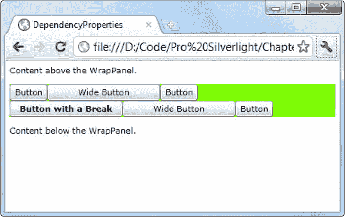

***图 4-1。**支持强制换行的 WrapBreakPanel】*

### 路由事件

每一个。NET developer 熟悉*事件*的概念，即由对象(如 Silverlight 元素)发送的消息，用于在发生重大事件时通知您的代码。WPF 增强了。NET 事件模型中引入了*事件路由*的新概念，它允许一个事件在一个元素中发起，但被另一个元素引发。例如，事件路由允许从一个形状开始的单击上升到该形状的容器，然后在代码处理它之前到达包含它的页面。

Silverlight 借用了一些 WPF 的路由事件模型，但是形式大大简化了。虽然 WPF 支持几种类型的路由事件，但是 Silverlight 只允许一种:*冒泡事件*，这种事件从深度嵌套的元素到它们的容器沿着容器层次结构上升。此外，Silverlight 的事件冒泡与一些键盘和鼠标输入事件(如 MouseMove 和 KeyDown)相关联，并且仅由一些低级元素支持。正如您将看到的，Silverlight 不为更高级别的控件事件(如 Click)使用事件冒泡，并且您不能对您自己的自定义控件中的事件使用事件路由。

#### 核心元素事件

元素从两个核心类继承它们的基本事件集:UIElement 和 FrameworkElement。如图 4-2 所示，所有的 Silverlight 元素都是从这些元素中派生出来的。

***图 4-2。**Silverlight 元素的层次结构*

UIElement 类定义了用于处理用户输入的最重要的事件和唯一使用事件冒泡的事件。表 4-1 列出了所有 UIElement 事件。在本章的其余部分，您将看到如何使用这些事件。

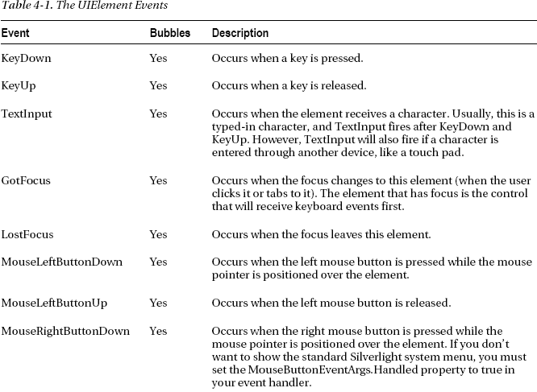

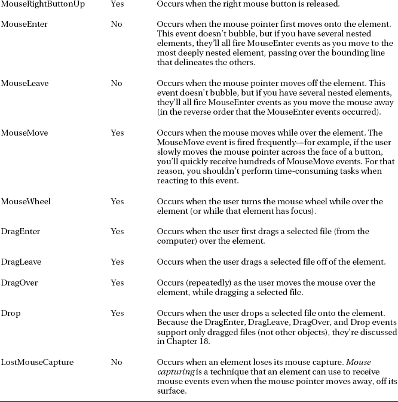

在某些情况下，更高级别的事件可能会有效地替换一些 UIElement 事件。例如，Button 类提供了一个 Click 事件，当用户按下并释放鼠标按钮时，或者当按钮具有焦点并且用户按下空格键时，就会触发该事件。因此，当处理按钮点击时，您应该总是响应 Click 事件，而不是 MouseLeftButtonDown 或 MouseLeftButtonUp(它抑制了这两个事件)。同样，除了基本的 KeyDown 和 KeyUp 事件之外，TextBox 还提供了一个 TextChanged 事件，当文本被任何机制更改时都会触发该事件。

FrameworkElement 类只是给这个模型增加了一些事件，详见[表 4-2](#tab_4_2) 。这些事件都没有使用事件冒泡。

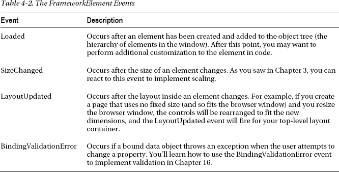

#### 事件冒泡

冒泡事件是在容器层次结构中向上传播的事件。例如，MouseLeftButtonDown 是一个冒泡事件。它首先由被单击的元素引发。接下来，它由那个元素的父元素引发，然后由那个元素的父元素*引发，依此类推，直到 Silverlight 到达元素树的顶端。*

事件冒泡旨在支持组合，换句话说，就是让您用更简单的成分构建更复杂的控件。Silverlight 的*内容控件*就是一个例子，这些控件能够将单个嵌套元素保存为内容。这些控件通常通过它们提供一个名为 Content 的属性来识别。例如，按钮是一个内容控件。您可以用包含一整组元素的 StackPanel 填充它，而不是显示一行文本，如下所示:

`<Button BorderBrush="Black" BorderThickness="1" Click="cmd_Click">
  <StackPanel>
    <TextBlock Margin="3" Text="Image and text label"></TextBlock>
    <Image Source="happyface.jpg" Stretch="None"></Image>
    <TextBlock Margin="3" Text="Courtesy of the StackPanel"></TextBlock>
  </StackPanel>
</Button>`

这里，content 元素是一个 StackPanel，它保存两段文本和一个图像。图 4-3 显示了这个标记创建的漂亮按钮。

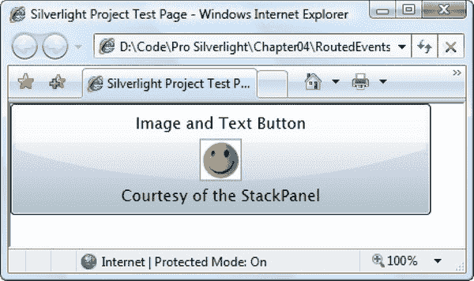

***图 4-3。**包含元素的按钮*

在这种情况下，按钮对其包含的元素的鼠标事件做出反应是很重要的。换句话说，按钮。当用户单击按钮边框内的图像、部分文本或部分空白区域时，应触发 Click 事件。在任何情况下，您都希望用相同的代码来响应。

当然，您可以将同一个事件处理程序绑定到按钮中每个元素的 MouseLeftButtonDown 或 MouseLeftButtonUp 事件，但是这会导致大量的混乱，并且会使您的标记更难维护。事件冒泡提供了一个更好的解决方案。

当单击笑脸时，MouseLeftButtonDown 事件首先为图像触发，然后为 StackPanel 触发，最后为包含它的按钮触发。然后，按钮通过触发自己的 Click 事件对 MouseLeftButtonDown 作出反应，您的代码对此作出响应(使用其 cmd_Click 事件处理程序)。

 **注意**按钮。Click 事件不使用事件冒泡。这与 WPF 有着巨大的不同。在 Silverlight 的世界中，只有一小部分基础设施事件支持事件冒泡。更高级别的控件事件不能使用事件冒泡。然而，按钮*使用*MouseLeftButtonDown 事件的冒泡性质来确保它捕获对任何包含元素的点击。

#### 处理(抑制)的事件

当[图 4-3](#fig_4_3) 中的按钮接收到 MouseLeftButtonDown 事件时，它额外执行一步，将事件标记为*已处理*。这可以防止事件在控件层次结构中进一步向上冒泡。大多数 Silverlight 控件使用这种处理技术来抑制 MouseLeftButtonDown 和 MouseLeftButtonUp，以便用更有用的高级事件(如 Click)来替换它们。

但是，有几个元素不处理 MouseLeftButtonDown 和 MouseLeftButtonUp:

*   用来显示位图的图像类
*   用于显示文本的 TextBlock 类
*   用于显示视频的 MediaElement 类
*   用于二维绘图的形状类(直线、矩形、椭圆、多边形、折线、路径)
*   用于排列元素(Canvas、StackPanel 和 Grid)和 Border 类的布局容器

这些例外允许您在内容控件(如按钮控件)中使用这些元素，而没有任何限制。例如，如果您将 TextBlock 放在一个按钮中，当您单击 TextBlock 时，MouseLeftButtonUp 事件将冒泡到该按钮，然后该按钮将触发其 click 事件。但是，如果您将一个不在前面列表中的控件放在按钮中，比如列表框、复选框或另一个按钮，您会得到不同的行为。当您单击该嵌套元素时，MouseLeftButtonUp 事件不会冒泡到包含它的按钮，并且该按钮不会注册一次单击。

 **注意** MouseLeftButtonDown 和 MouseLeftButtonUp 是唯一控制抑制的事件。冒泡键事件(KeyUp、KeyDown、LostFocus 和 GotFocus)不受任何控件的抑制。

#### 一个事件冒泡的例子

为了理解事件冒泡和处理的事件，创建一个简单的例子是有帮助的，如图 4-4 所示。在这里，正如您在前面看到的示例一样，MouseLeftButtonDown 事件从 TextBlock 或 Image 开始，并遍历元素层次结构。

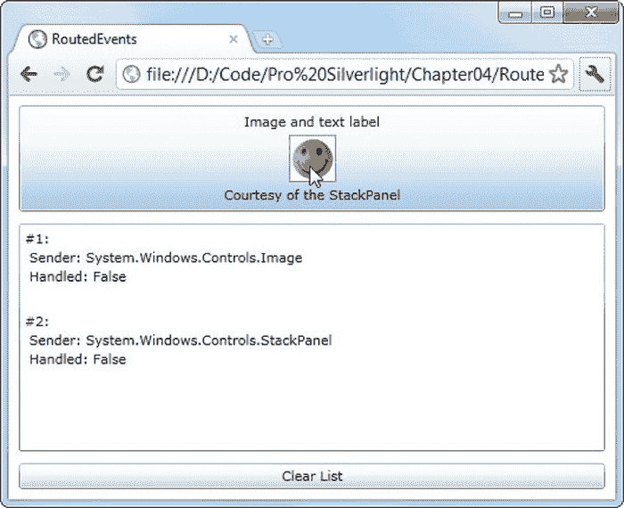

***图 4-4。**一个冒泡的图像点击*

在此示例中，您可以通过将事件处理程序附加到多个元素来观察 MouseLeftButtonDown 事件气泡。由于事件在不同级别被拦截，事件序列显示在列表框中。[图 4-4](#fig_4_4) 显示了点击按钮中的笑脸图像后立即显示的画面。如您所见，MouseLeftButtownDown 事件在图像中触发，然后在包含它的 StackPanel 中触发，最后被处理它的按钮截获。该按钮不会触发 MouseLeftButtonDown 事件，因此 MouseLeftButtonDown 事件不会冒泡到包含该按钮的网格。

为了创建这个测试页面，图像和元素层次结构中它上面的每个元素都连接到同一个事件处理程序——一个名为 SomethingClicked()的方法。这是 XAML 的做法:

`<UserControl x:Class="RoutedEvents.EventBubbling"

 xmlns:x="http://schemas.microsoft.com/winfx/2006/xaml">

  <Grid Margin="3" **MouseLeftButtonDown="SomethingClicked">**
    <Grid.RowDefinitions>
      <RowDefinition Height="Auto"></RowDefinition>
      <RowDefinition Height="*"></RowDefinition>
      <RowDefinition Height="Auto"></RowDefinition>
      <RowDefinition Height="Auto"></RowDefinition>
    </Grid.RowDefinitions>

    <Button Margin="5" Grid.Row="0" **MouseLeftButtonDown="SomethingClicked">**
      <StackPanel **MouseLeftButtonDown="SomethingClicked">**
        <TextBlock Margin="3" **MouseLeftButtonDown="SomethingClicked"**
         HorizontalAlignment="Center" Text="Image and text label"></TextBlock>
        <Image Source="happyface.jpg" Stretch="None"
         **MouseLeftButtonDown="SomethingClicked"></**Image>
        <TextBlock Margin="3" HorizontalAlignment="Center"
         **MouseLeftButtonDown="SomethingClicked"**
         Text="Courtesy of the StackPanel"></TextBlock>
      </StackPanel>
    </Button>

    <ListBox Grid.Row="1" Margin="5" x:Name="lstMessages"></ListBox>

    <Button Grid.Row="3" Margin="5" Padding="3" x:Name="cmdClear"
     Click="cmdClear_Click" Content="Clear List"></Button>
  </Grid>
</UserControl>`

SomethingClicked()方法只是检查 RoutedEventArgs 对象的属性，并向列表框添加一条消息:

`protected int eventCounter = 0;

private void SomethingClicked(object sender, MouseButtonEventArgs e)
{
    eventCounter++;
    string message = "#" + eventCounter.ToString() + >":\r\n" +
      " Sender: " + sender.ToString() + "\r\n";
    lstMessages.Items.Add(message);
}

private void cmdClear_Click(object sender, RoutedEventArgs e)
{
    lstMessages.Items.Clear();
}`

当处理像 MouseLeftButtonDown 这样的冒泡事件时，传递给事件处理程序的 sender 参数总是提供对链中最后一个链接的引用。例如，如果一个事件在您处理它之前从图像中冒泡到 StackPanel，sender 参数将引用 StackPanel 对象。

在某些情况下，您会想要确定事件最初发生的位置。冒泡事件的 event arguments 对象提供了一个 Source 属性，告诉您最初引发事件的特定元素。对于键盘事件，这是在事件发生时具有焦点的控件(例如，当按键被按下时)。对于鼠标事件，这是事件发生时(例如，当单击鼠标按钮时)鼠标指针下最顶端的元素。但是，Source 属性可能比您想要的要详细一些，例如，如果您单击形成按钮背景的空白区域，Source 属性将提供对 Shape 或 Path 对象的引用，该对象实际上绘制了您单击的背景部分。

除了 Source，冒泡事件的 event arguments 对象还提供了一个名为 Handled 的布尔属性，允许您抑制事件。例如，如果在 StackPanel 中处理 MouseLeftButtonDown 事件并将 Handled 设置为 True true，则 StackPanel 不会触发 MouseLeftButtonDown 事件。因此，当您单击 StackPanel(或其中的一个元素)时，MouseLeftButtonDown 事件不会到达按钮，并且 click 事件永远不会触发。您可以在构建自定义控件时使用这种技术(例如，如果您已经处理了像按钮单击这样的用户操作，并且您不希望涉及更高级别的元素)。

 **注意** WPF 提供了一个后门，允许代码接收标记为已处理(通常会被忽略)的事件。Silverlight 不提供此功能。

### 鼠标操作

您不太可能看到不使用 MouseLeftButtonDown 事件的 Silverlight 应用程序。然而，关于鼠标事件的处理，还有很多东西需要学习。在下面几节中，您将考虑如何对右键单击、鼠标移动和鼠标滚轮做出反应。您还将学习如何捕获鼠标——这样即使在它离开时您也可以继续处理它的事件——如何模拟拖放以及如何改变鼠标光标。

#### 右击鼠标

默认情况下，当您右键单击 Silverlight 应用程序中的任意位置时，会出现一个弹出式 Silverlight 菜单。此菜单包含一个名为 Silverlight 的命令，该命令会打开一个选项卡式窗口，您可以在其中更改 Silverlight 设置。此外，如果你已经创建了一个支持浏览器外安装的应用程序(见[第 21 章](21.html#ch21))，这个菜单还有第二个安装应用程序的命令。

您可以决定在某些元素(甚至是整个窗口)上处理右键单击，以提供更专业的功能。例如，当用户右键单击特定元素时，您可能希望显示一个自定义的上下文菜单，其中包含该元素的命令。尽管 Silverlight 不包含上下文菜单控件，但是您可以很容易地从 Silverlight 工具包(`[http://silverlight.codeplex.com](http://silverlight.codeplex.com)`)中获得一个。然后，您可以使用它将右击菜单附加到任何控件。

然而，有一个问题。即使您显示自己的上下文菜单，MouseRightButtonDown 事件也会冒泡到应用程序的顶层，导致 Silverlight 显示其标准的系统菜单。若要隐藏此菜单，以便只显示您的菜单，必须处理 MouseRightButton 事件并设置 MouseButtonEventArgs。已将属性处理为 True。这将取消右键单击事件和系统菜单。

#### 双击和三击

在某些方面，Silverlight 遵循了 web 用户界面的惯例。例如，Silverlight 应用程序关注鼠标点击，但很少寻找由 Windows 首创的双击鼠标技术。事实上，在 Silverlight 5 之前，根本没有对检测双击的直接支持。

如果您决定要包含双击支持，最好将它们用于非必要的任务。例如，双击可以为高级用户提供便捷的快捷方式，而经验较少的用户仍然可以通过单击菜单或另一组控件来获得相同的结果。

每次单击元素时都会触发 Click 事件，包括快速连续单击几次的情况。要检测双击，需要检查 MouseButtonEventArgs 的 ClickCount 属性。如果 ClickCount 为 1，这是正常的单击。如果 ClickCount 为 2，则这是双击操作中的第二次单击。(通常，这意味着第一次点击之后的点击时间少于 500 毫秒，尽管具体细节可能取决于操作系统的偏好。)

这里有一个例子:

`private void SomethingClicked(object sender, MouseButtonEventArgs e)
{
    if (e.ClickCount == 1)
    {
        // One click was detected.
        // This could be a single click or the start of a double-click.
        lblClickCount.Text = "Clicks: 1";
    }
    else (e.ClickCount == 2)
    {
        // This is the second click of a double-click.
        lblClickCount.Text = "Clicks: 2";
    }
}`

虽然不太为人所知，但三次点击是另一种潜在的快捷方式。文字处理器和网络浏览器经常让用户通过三次点击来选择大块的文本。(例如，双击可以突出显示一个单词，而双击可以突出显示整个段落。)要执行三次点击，用户只需快速连续点击三次。您的应用程序使用相同的 ClickCount 属性来捕捉三次点击。

当您捕获不同级别的点击时(例如，当捕获单击和双击时，或者当捕获双击和三击时)，可能会出现令人头痛的问题。根据您编写代码的方式，您最终可能会执行一个或多个额外的操作。例如，当用户三次单击时，您可能会在检测到 ClickCount 为 2 时执行一个操作，而在检测到 ClickCount 为 3 时执行另一个操作，即使这两个事件都是同一三次单击的一部分。

为了避免问题，请确保重叠的操作不会冲突。关于设计良好的点击行为的一个很好的例子，考虑当你使用三次点击来选择文本时会发生什么。在这种情况下，第二次点击被计为双击(此时单词被选中)，下一次点击被计为三次点击动作(此时选择被扩展到段落)。这工作得很好，因为三次点击动作增强了双击动作。但是如果双击动作做了完全不同的事情(比如启动另一个程序，删除被点击的元素等等)，那么添加三次点击支持只会造成混乱。

#### 鼠标移动

除了明显的鼠标单击事件(MouseLeftButtonDown、MouseLeftButtonUp、MouseRightButtonDown 和 MouseRightButtonUp)，Silverlight 还提供了在鼠标指针移动时触发的鼠标事件。这些事件包括 MouseEnter(当鼠标指针移过元素时触发)、MouseLeave(当鼠标指针移开时触发)和 MouseMove(在两者之间的每一点触发)。

所有这些事件都为您的代码提供了相同的信息:一个 MouseEventArgs 对象。MouseEventArgs 对象包括一个重要的组成部分:一个 GetPosition()方法，它告诉您鼠标相对于所选元素的坐标。下面是一个显示鼠标指针位置的示例:

`private void MouseMoved(object sender, MouseEventArgs e)
{
    Point pt = e.GetPosition(this);
    lblInfo.Text =
      String.Format("You are at ({0},{1}) in page coordinates",
      pt.X, pt.Y);
}`

在这种情况下，坐标从页面区域的左上角(浏览器标题栏的正下方)开始测量。

 **提示**要在布局容器中接收鼠标事件，背景属性必须设置为非空值—例如，纯白填充。

#### 鼠标滚轮

如今，大部分计算机用户都有带滚轮的鼠标。您可以利用这一点，在用户转动鼠标滚轮时做出适当的响应。唯一的经验法则是确保鼠标滚轮支持是一个有用的额外功能，而不是应用程序行为的必要部分。毕竟还是有很大比例的用户没有鼠标滚轮(比如笔记本电脑用户)或者不觉得用。

MouseWheel 事件使用 MouseWheelEventArgs 传递自上次 MouseWheel 事件以来滚轮转动量的一些基本信息。德尔塔财产。通常，鼠标滚轮中的每个凹口的值都是 120，所以鼠标滚轮的一次轻推会将 120 的增量值传递到您的应用程序。如果鼠标滚轮远离用户旋转，则增量值为正，如果朝向用户旋转，则增量值为负。

为了更好地理解这种情况，考虑图 4-5 中所示的界面示例。在这里，用户只需转动鼠标滚轮就可以放大或缩小内容网格。

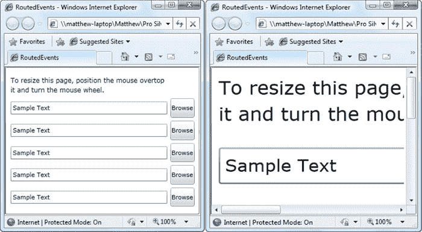

***图 4-5。**用鼠标滚轮缩放*

为了创建这个例子，你需要两个你在第 3 章中第一次考虑的控件 ScrollViewer 和 Viewbox。视图框支持放大，而 ScrollViewer 只允许用户在视图框太大而不适合浏览器窗口时滚动视图框的整个表面。

`<UserControl x:Class="RoutedEvents.MouseWheelZoom"

 xmlns:x="http://schemas.microsoft.com/winfx/2006/xaml"
MouseWheel="Page_MouseWheel">

  <ScrollViewer VerticalScrollBarVisibility="Auto"
   HorizontalScrollBarVisibility="Auto">

    <Viewbox x:Name="viewbox" Height="250" Width="350">
      <Grid Background="White" Height="250" Width="350">
        ...
      </Grid>
    </Viewbox>

  </ScrollViewer>
</UserControl>`

请注意，最初视图框被赋予了与内部网格完全相同的硬编码大小。这确保了视图框不需要执行任何初始缩放，相反，当应用程序首次启动时，网格处于其自然大小。

当用户转动鼠标滚轮时，鼠标滚轮事件处理程序检查差值，并简单地按比例调整视图框的宽度和高度属性。这将扩展或缩小视图框，并重新调整内部的所有内容:

`private void Page_MouseWheel(object sender, MouseWheelEventArgs e)
{
    // The Delta is in units of 120, so dividing by 120 gives
    // a scale factor of 1.09 (120/110). In other words, one
    // mouse wheel notch expands or shrinks the Viewbox by about 9%.
    double scalingFactor = (double)e.Delta / 110;

    // Check which way the wheel was turned.
    if (scalingFactor > 0)
    {
        // Expand the viewbox.
        viewbox.Width *= scalingFactor;
        viewbox.Height *= scalingFactor;
    }
    else
    {
        // Shrink the viewbox.
        viewbox.Width /= -scalingFactor;
        viewbox.Height /= -scalingFactor;
    }
}`

一些控件已经包含了处理 MouseWheel 事件，为它们提供了对鼠标滚轮的内置支持(尽管 Viewbox 不在其中)。例如，当用户转动鼠标滚轮时，TextBox、ComboBox、ListBox、DataGrid 和 ScrollViewer 会滚动。日历一个月一个月地移动。

#### 捕捉老鼠

通常，每当一个元素接收到一个鼠标按钮按下事件时，它将很快接收到一个相应的鼠标按钮按下事件。然而，情况并非总是如此。例如，如果您单击一个元素，按住鼠标，然后将鼠标指针从该元素上移开，则该元素不会收到鼠标抬起事件。

在某些情况下，您可能希望有一个鼠标抬起事件的通知，即使它们发生在鼠标离开您的元素之后。为此，您需要通过调用适当元素的 MouseCapture()方法来*捕获*鼠标(MouseCapture()是由基本 UIElement 类定义的，因此所有 Silverlight 元素都支持它)。从那时起，您的元素将接收 MouseLeftButtonDown 和 MouseLeftButtonUp 事件，直到它丢失鼠标捕获。有两种方法可以丢失鼠标捕获。首先，你可以通过调用 Mouse 来心甘情愿地放弃它。再次捕获()，并传入一个空引用(Nothing)。第二，用户可以在应用程序之外点击——在另一个程序上，在浏览器菜单上，在同一网页上的 HTML 内容上。当元素失去鼠标捕获时，它会触发 LostMouseCapture 事件。

当鼠标被一个元素捕获时，其他元素不会接收鼠标事件。这意味着用户将不能点击页面中其他地方的按钮，也不能点击文本框内的按钮，等等。鼠标捕获有时用于实现可拖动和可调整大小的元素。

#### 一个鼠标事件例子

通过查看一个简单的示例，您可以将所有这些鼠标输入概念放在一起(并了解一些关于动态控件创建的知识)。

图 4-6 显示了一个 Silverlight 应用程序，它允许你在画布上画小圆圈并移动它们。每次点按画布时，都会出现一个红色圆圈。要移动一个圆，只需点击并将其拖动到新的位置。当你点击一个圆时，它的颜色会从红色变成绿色。最后，当你放开你的圆圈，它会变成橙色。您可以添加多少个圆，或者在绘图表面上移动多少次，都没有限制。

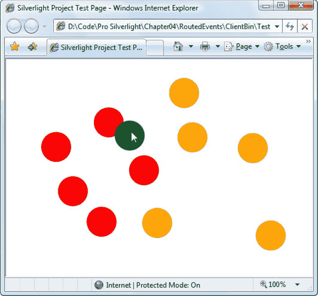

***图 4-6。**拖动形状*

 **注意**这个例子演示了“模拟的”拖放，这是一个您自己实现的拖放功能，在您的应用程序中有自定义代码。相比之下，“真正的”拖放功能依赖于操作系统内置的功能。Silverlight 确实包含一个真正的拖放功能，但它只在非常有限的情况下工作——当将文件从计算机拖到 Silverlight 窗口时。第 18 章演示了基于文件的拖放功能。

每个圆都是椭圆元素的一个实例，椭圆元素只是一个彩色的形状，是二维绘图的基本元素。显然，您不能在 XAML 标记中定义所有需要的省略号。相反，您需要一种在用户每次单击画布时动态生成椭圆对象的方法。

创建一个椭圆对象并不十分困难——毕竟，您可以像实例化其他对象一样实例化它。NET 对象，设置其属性，并附加事件处理程序。您甚至可以使用 SetValue()方法来设置附加属性，以将其放置在画布中的正确位置。然而，还有一个细节需要注意——您需要一种在画布中放置椭圆的方法。这很简单，因为 Canvas 类公开了一个包含所有子元素的 Children 集合。一旦您将元素添加到此集合，它将出现在画布中。

本例中的 XAML 页面为画布使用了一个事件处理程序。MouseLeftButtonDown 事件。画布。还设置了 Background 属性，因为具有默认透明背景的画布不能捕捉鼠标事件。没有定义其他元素。

`<Canvas x:Name="parentCanvas" MouseLeftButtonDown="canvas_Click" Background="White">
</Canvas>`

在代码隐藏类中，需要两个成员变量来跟踪椭圆拖动操作当前是否正在进行:

`// Keep track of when an ellipse is being dragged.
private bool isDragging = false;

// When an ellipse is clicked, record the exact position
// where the click is made.
private Point mouseOffset;`

下面是当画布被单击时创建椭圆的事件处理代码:

`private void canvas_Click(object sender, MouseButtonEventArgs e)
{
    // Create an ellipse (unless the user is in the process
    // of dragging another one).
    if (!isDragging)
    {
        // Give the ellipse a 50-pixel diameter and a red fill.
        Ellipse ellipse = new Ellipse();
        ellipse.Fill = new SolidColorBrush(Colors.Red);
        ellipse.Width = 50;
        ellipse.Height = 50;

        // Use the current mouse position for the center of
        // the ellipse.
        Point point = e.GetPosition(this);
        ellipse.SetValue(Canvas.TopProperty, point.Y - ellipse.Height/2);
        ellipse.SetValue(Canvas.LeftProperty, point.X - ellipse.Width/2);

        // Watch for left-button clicks.
        ellipse.MouseLeftButtonDown += ellipse_MouseDown;

        // Add the ellipse to the Canvas.
        parentCanvas.Children.Add(ellipse);
    }
}`

这段代码不仅创建了椭圆，还连接了一个事件处理程序，当椭圆被点击时，它会做出响应。此事件处理程序更改椭圆颜色并启动椭圆拖动操作:

`private void ellipse_MouseDown(object sender, MouseButtonEventArgs e)
{
    // Dragging mode begins.
    isDragging = true;
    Ellipse ellipse = (Ellipse)sender;

    // Get the position of the click relative to the ellipse
    // so the top-left corner of the ellipse is (0,0).
    mouseOffset = e.GetPosition(ellipse);

    // Change the ellipse color.
    ellipse.Fill = new SolidColorBrush(Colors.Green);

    // Watch this ellipse for more mouse events.
    ellipse.MouseMove += ellipse_MouseMove;
    ellipse.MouseLeftButtonUp += ellipse_MouseUp;

    // Capture the mouse. This way you'll keep receiving
    // the MouseMove event even if the user jerks the mouse
    // off the ellipse.
    ellipse.CaptureMouse();
}`

直到 MouseMove 事件发生，椭圆才真正移动。此时，画布。向左拐。在椭圆上设置顶部附着属性，以将其移动到新位置。基于鼠标的当前位置设置坐标，同时考虑用户最初单击的点。然后这个椭圆会随着鼠标无缝移动，直到鼠标左键被释放。

`private void ellipse_MouseMove(object sender, MouseEventArgs e)
{
    if (isDragging)
    {
        Ellipse ellipse = (Ellipse)sender;

        // Get the position of the ellipse relative to the Canvas.
        Point point = e.GetPosition(parentCanvas);

        // Move the ellipse.
        ellipse.SetValue(Canvas.TopProperty, point.Y - mouseOffset.Y);
        ellipse.SetValue(Canvas.LeftProperty, point.X - mouseOffset.X);
    }
}`

当释放鼠标左键时，代码更改椭圆的颜色，释放鼠标捕获，并停止侦听 MouseMove 和 MouseUp 事件。用户可以再次单击椭圆来重新开始整个过程。

`private void ellipse_MouseUp(object sender, MouseButtonEventArgs e)
{
    if (isDragging)
    {
        Ellipse ellipse = (Ellipse)sender;

        // Change the ellipse color.
        ellipse.Fill = new SolidColorBrush(Colors.Orange);

        // Don't watch the mouse events any longer.
        ellipse.MouseMove -= ellipse_MouseMove;
        ellipse.MouseLeftButtonUp -= ellipse_MouseUp;
        ellipse.ReleaseMouseCapture();

        isDragging = false;
    }
}`

#### 鼠标光标

任何应用程序中的一个常见任务是调整鼠标光标，以显示应用程序何时繁忙，或者指示不同的控件如何工作。可以使用从 FrameworkElement 类继承的 Cursor 属性为任何元素设置鼠标指针。

每个游标都由一个系统表示。Windows.Input.Cursor 对象。获取 Cursor 对象最简单的方法是使用 Cursors 类的共享静态属性(从系统。Windows.Input 命名空间)。它们包括所有标准的窗口光标，如沙漏、手形、调整大小箭头等等。下面是一个为当前页面设置沙漏的示例:

`this.Cursor = Cursors.Wait;`

现在，当您在当前页面上移动鼠标时，鼠标指针会变成熟悉的沙漏图标(在 Windows XP 中)或漩涡图标(在 Windows Vista 中)。

 **注意**光标类的属性绘制在计算机上定义的光标上。如果用户自定义了标准光标集，您创建的应用程序将使用这些自定义的光标。

如果您在 XAML 设置光标，您不需要直接使用 Cursors 类。这是因为 Cursor 属性的类型转换器能够识别属性名并从 Cursors 类中检索相应的 Cursor 对象。这意味着您可以编写这样的标记，当鼠标放在按钮上时显示“帮助”光标(箭头和问号的组合):

`<Button **Cursor="Help"** Content="Help Me"></Button>`

可能会有重叠的光标设置。在这种情况下，最具体的光标胜出。例如，您可以在按钮和包含该按钮的页面上设置不同的光标。当您将鼠标移动到按钮上时，按钮的光标将会显示出来，页面的光标将用于页面中的其他区域。

 **提示**与 WPF 不同，Silverlight 不支持自定义鼠标光标。但是，您可以隐藏鼠标光标(将其设置为光标)。None ),然后使用类似上一节中所示的代码使一个小图像跟随鼠标指针。

### 键盘操作

虽然鼠标为用户提供了与 Silverlight 应用程序交互的最明显的方式，但是您不能忽视另一个重要的输入设备——键盘。大多数时候，你会依赖于文本框这样的控件，它收集输入的文本，而不会强迫你注意文本是如何输入的。但是，如果您需要更细粒度的控制——例如，如果您希望在用户键入时执行验证或提供通知——您需要注意每一次单独的按键。

在接下来的部分中，您将学习如何处理按键和解释按键事件信息。您还将考虑 Silverlight 如何管理控件焦点，这决定了获取键盘输入的控件。

#### 按键

正如您在[表 4-1](#tab_4_1) 中看到的，Silverlight 元素使用 KeyDown 和 KeyUp 事件来通知您何时按下了某个键。这些事件使用冒泡，因此它们从当前具有焦点的元素向上传播到包含它们的元素。

当您对按键事件做出反应时，您会收到一个 keyEventArgs 对象，该对象提供两条附加信息:Key 和 PlatformKeyCode。Key 表示作为系统值按下的键。Windows.Input.Key 枚举(例如，Key。S 是 S 键)。PlatformKeyCode 是一个整数值，必须根据客户端计算机上使用的硬件和操作系统进行解释。例如，Silverlight 无法识别的非标准键将返回一个键。Key 属性的值未知，但将提供 PlatformKeyCode，由您来解释。特定于平台的键的一个例子是 Microsoft Windows 计算机上的滚动锁。

 **注意**一般来说，最好避免任何特定于平台的编码。但是如果你真的需要计算一个非标准键，你可以使用系统中的 BrowserInformation 类。Windows.Browser 命名空间获取有关运行应用程序的客户端计算机的更多信息。

理解关键事件的最好方法是使用一个示例程序，如本章稍后的[图 4-7](#fig_4_7) 所示。它使用以下标记监视文本框中的三个事件:KeyDown、KeyUp 和更高级别的 TextChanged 事件(由 text box 控件引发):

`<TextBox KeyDown="txt_KeyDown" KeyUp="txt_KeyUp"
TextChanged="txt_TextChanged"></TextBox>`

这里，TextBox 显式处理 KeyDown、KeyUp 和 TextChanged 事件。但是，KeyDown 和 KeyUp 事件会冒泡，这意味着您可以在更高的级别处理它们。例如，您可以在根网格上附加 KeyDown 和 KeyUp 事件处理程序，以接收页面中任何地方的按键。

以下是对这些事件做出反应的事件处理程序:

`private void txt_KeyUp(object sender, KeyEventArgs e)
{
    string message =
      "KeyUp " +
      " Key: " + e.Key;
    lstMessages.Items.Add(message);
}

private void txt_KeyDown(object sender, KeyEventArgs e)
{
    string message =
      "KeyDown " +
      " Key: " + e.Key;
    lstMessages.Items.Add(message);
}

private void txt_TextChanged(object sender, TextChangedEventArgs e)
{
    string message = "TextChanged";
    lstMessages.Items.Add(message);
}`

[图 4-7](#fig_4_7) 显示了在文本框中输入小写 *S* 的结果。

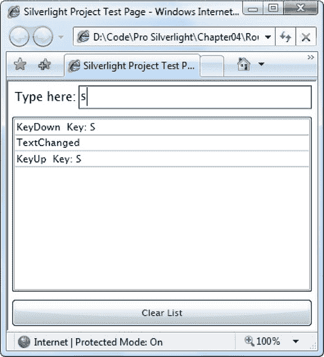

***图 4-7。**看着键盘*

键入单个字符可能涉及多次按键。例如，如果你想键入一个*大写*字母 *S* ，你必须先按下 Shift 键，然后按下 *S* 键。在大多数计算机上，按下按键超过一小段时间就会开始产生重复按键。出于这个原因，如果你键入一个大写的 *S* ，你很可能会看到 Shift 键的一系列 KeyDown 事件，如图[图 4-8](#fig_4_8) 所示。然而，您将只为两个 KeyUp 事件(对于 *S* 和对于 Shift 键)和一个 TextChanged 事件设置关键帧。

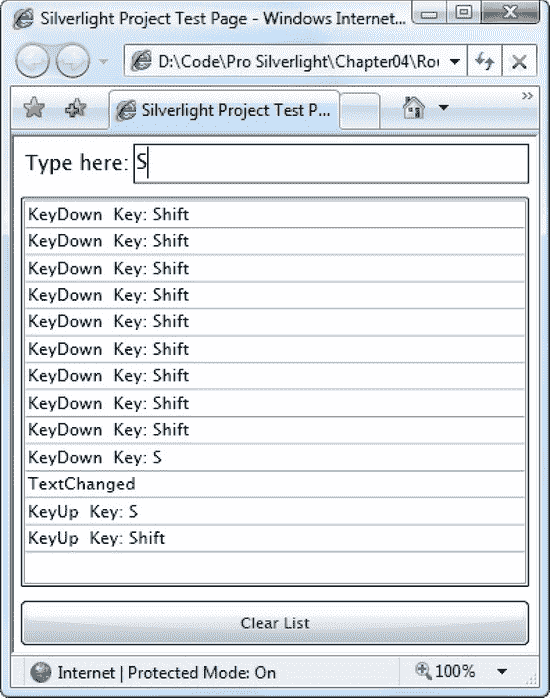

***图 4-8。**重复按键*

 **注意**像文本框这样的控件不是为低级键盘操作设计的。在处理文本输入控件时，您应该只对它的高级键盘事件(如 TextChanged)做出反应。

#### 关键修饰词

当按键发生时，您通常需要知道的不仅仅是按下了什么键。找出同时被按住的其他键也很重要。这意味着您可能想要调查其他键的状态，尤其是 Shift 和 Ctrl 这样的修饰符，所有平台都支持这两种键。虽然您可以分别处理这些键的事件并以这种方式跟踪它们，但是使用 Keyboard 类的 shared static Modifiers 属性要容易得多。

测试键盘。修饰符，则使用按位逻辑。例如，下面的代码检查当前是否按下了 Ctrl 键:

`if ((Keyboard.Modifiers & ModifierKeys.Control) == ModifierKeys.Control)
{
    message += "You are holding the Control key.";
}`

 **注意**浏览器可以自由拦截击键。例如，在 Internet Explorer 中，您不会看到 Alt 键的 KeyDown 事件，因为浏览器会拦截它。Alt 键打开 Internet Explorer 菜单(单独使用时)或触发快捷方式(与另一个键一起使用时)。

#### 聚焦

在 Silverlight 世界中，用户一次只能使用一个控件。当前接收用户按键的控件是具有*焦点*的控件。有时，该控件的绘制略有不同。例如，Silverlight 按钮使用蓝色底纹来表示它具有焦点。

要将焦点从一个元素移动到另一个元素，用户可以单击鼠标或使用 Tab 和箭头键。在以前的开发框架中，程序员不得不非常小心地确保 Tab 键以逻辑方式移动焦点(通常是从左到右，然后沿着窗口向下)，并且当窗口第一次出现时，右边的控件具有焦点。在 Silverlight 中，这种额外的工作很少是必要的，因为 Silverlight 使用元素的分层布局来实现跳转序列。实质上，当您按下 Tab 键时，您将移动到当前元素中的第一个子元素，或者，如果当前元素没有子元素，则移动到同一级别的下一个子元素。例如，如果您在一个有两个 StackPanel 容器的窗口中切换，您将在第一个 StackPanel 中的所有控件中移动，然后在第二个容器中的所有控件中移动。

如果要控制 tab 键序列，可以设置每个控件的 TabIndex 属性，使其按数字顺序排列。TabIndex 为 0 的控件首先获得焦点，然后是下一个最高的 TabIndex 值(例如，1、2、3 等等)。如果多个元素具有相同的 TabIndex 值，Silverlight 将使用自动 tab 序列，这意味着它将跳转到最近的后续元素。

 **提示**默认情况下，所有控件的 TabIndex 属性都设置为 1。这意味着您可以通过将特定控件的 TabIndex 设置为 0 来将该控件指定为窗口的起点，但依赖于自动导航来根据定义元素的顺序从该起点引导用户完成窗口的其余部分。

TabIndex 属性是在 Control 类中定义的，还有一个 IsTabStop 属性。可以将 IsTabStop 设置为 False false，以防止控件包含在 tab 键序列中。将 IsTabStop 设置为 False false 的控件仍然可以通过另一种方式获得焦点，即通过编程方式(当您的代码调用其 focus()方法时)或通过鼠标单击。

无论 TabIndex 和 IsTabStop 设置如何，不可见或禁用的控件在 tab 键顺序中被跳过，并且不会被激活。若要隐藏或禁用控件，请分别设置 Visibility 和 IsEnabled 属性。

### 指挥模式

在一个设计良好的 Silverlight 应用程序中，应用程序逻辑不在事件处理程序中，而是在更高级的方法中编码。这些方法中的每一个都代表一个应用程序“任务”反过来，每个任务可能依赖于其他库(例如封装数据访问、web 服务调用或其他类型的业务逻辑的单独编译的组件)。[图 4-9](#fig_4_9) 显示了这种关系。

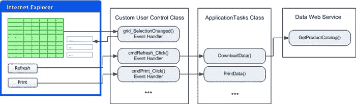

***图 4-9。**将事件处理程序映射到任务*

使用这种设计最明显的方法是在需要的地方添加事件处理程序，并使用每个事件处理程序调用适当的应用程序方法。本质上，您的 Silverlight 页面(从 UserControl 派生的自定义类)成为一个精简的切换面板，它响应输入并将请求转发到应用程序的核心。

尽管这种设计非常合理，但仍然需要相当多的用户界面代码。您需要响应各种事件来调用您的应用程序方法，有时相同的应用程序任务可以通过不同的方式触发(例如，通过按钮、右击菜单命令等等)。当您需要管理用户界面的状态时，生活变得更加复杂——例如，当控件触发的任务不相关时，禁用不应该访问的控件。即使您坚持良好的设计实践，您的交换机代码也会变得密集和混乱。

Silverlight 还没有为这个问题提供成熟的解决方案。然而，许多 Silverlight 开发人员已经开始转向一种叫做 MVVM 的设计模式(代表模型-视图-视图模型)。MVVM 架构背后的基本思想是你的应用程序被分成不同的层。*模型*是您的应用程序管理的内容或数据。*视图*是图形化前端，包含按钮、图形和所有 Silverlight 元素。中间是允许他们交流的*视图模型*。例如，如果用户单击视图中的按钮，它可以触发视图模型中的命令，然后修改模型中的数据。

真正的 MVVM 设计既有狂热的追随者，也有更谨慎的批评家。它需要一个单独的库的帮助，比如 MVVM 光(`[www.galasoft.ch/mvvm](http://www.galasoft.ch/mvvm)`)或者棱镜(`[http://compositewpf.codeplex.com](http://compositewpf.codeplex.com)`)。这也超出了本书的范围。然而，Silverlight 已经开始添加一些特性，使得这些更高级的工具包更加实用。最明显的特性是命令，这将在下面描述。

 **提示**要使用 Silverlight 将 MVVM 付诸实践，请参考*使用 Silverlight 的专业业务应用 5 * (Apress，2011)，其中介绍了 Prism。

Silverlight 的命令特性是一个适度的、精简的可扩展性点，没有 WPF 丰富的命令模型的任何特性。相反，Silverlight 命令为开发人员提供了足够的功能来开始构建他们自己的 MVVM 架构。

以下是关于 Silverlight 命令支持的重要细节:

*   只有两个元素类支持命令:Hyperlink 和 ButtonBase(尽管一些类似按钮的控件是从 ButtonBase 派生的)。
*   无论您使用的是超链接还是按钮，当 Click 事件触发时都会触发其命令。不直接支持将命令连接到其他控件和其他事件(如列表框中的选择更改或文本框中的按键)。为此，你需要一个更强大的 MVVM 图书馆的帮助。
*   命令通过添加到 Hyperlink 和 button 基类的两个属性工作:Command 和 CommandParameter。命令是按钮单击发生时触发的动作，CommandParameter 是传递给命令的单个对象，带有附加信息。
*   您必须创建您需要的命令。Silverlight 包括 ICommand 接口，所有命令都必须实现该接口。但是，它不包含任何自己的命令类。虽然您可以创建几十个或几百个不同的命令类，但是大多数开发人员更喜欢创建一个通用的命令类，可以重复用于不同的任务。

在下面几节中，您将看到一个简单的命令工作示例。

#### 建筑命令

Silverlight 命令模型的核心是系统。Windows.Input.ICommand 接口，它定义了命令的工作方式。该接口包括两个方法和一个事件:

`public interface ICommand
{
    void Execute(object parameter);
    bool CanExecute(object parameter);

    event EventHandler CanExecuteChanged;
}`

在一个简单的实现中，Execute()方法将包含应用程序任务逻辑(例如，打印文档)。CanExecute()方法返回命令的状态:如果启用则为 True，如果禁用则为 False。Execute()和 CanExecute()都接受一个额外的参数对象，您可以用它来传递您需要的任何额外信息。

最后，当状态改变时，引发 CanExecuteChanged 事件。这是给任何使用命令的控件的一个信号，它们应该调用 CanExecute()方法来检查命令的状态。这是粘合的一部分，它允许命令源(如按钮)在命令可用时自动启用自己，在命令不可用时自动禁用自己。

例如，当触发以下 PrintTextCommand 命令并调用 Execute()方法时，该命令将打印单个字符串。(事实上，该命令在一个消息框中显示字符串，但是您可以使用您将在第 8 章中学到的技能来添加真正的打印逻辑。)CanExecute()方法只是检查字符串，如果字符串丢失或为空，则不允许打印。在这两种情况下，命令都将字符串作为命令参数接收。

下面是完整的代码:

`public class PrintTextCommand : ICommand
{
    public event EventHandler CanExecuteChanged;

    private bool canExecute;
    public bool CanExecute(object parameter)
    {
        // Check if the command can execute.
        // In order to be executable, it must have non-blank text in the
        // command parameter.
        bool canExecuteNow = (parameter != null) && (parameter.ToString() !=
"");

        // Determine if the CanExecuteChanged event should be raised.
        if (canExecute != canExecuteNow)
        {
            canExecute = canExecuteNow;
            if (CanExecuteChanged != null)
            {
                CanExecuteChanged(this, new EventArgs());
            }
        }
        return canExecute;
    }        

    public void Execute(object parameter)
    {
        MessageBox.Show("Printing: " + parameter);
    }
}`

#### 连接命令

要使用此命令，您需要设置按钮的 command 和 CommandParameter 属性。虽然您可以在代码中做到这一点，但这违背了命令模型的真正目的，即帮助您从用户控件类中移除事件处理代码。相反，理想的命令实现连接了您在 XAML 需要的一切。

首先，您需要将项目名称空间映射到一个 XML 前缀，这样您创建的自定义命令类就可以在您的标记中使用。以下是一个名为 RoutedEvents 的应用程序中名为 Commands 的页面示例:

`<UserControl x:Class="RoutedEvents.Commands"
    **xmlns:local="clr-namespace:RoutedEvents" ... >**`

现在您可以将命令添加为资源:

`<UserControl.Resources>
  <local:PrintTextCommand x:Key="printCommand"></local:PrintTextCommand>
</UserControl.Resources>`

最后一步是找到按钮控件并设置其 Command 属性(使用资源)和 CommandParameter 属性(使用数据绑定)。在本例中，CommandParameter 从附近的文本框中提取文本。

`<Button Margin="5" Content="Print Command"
** Command="{StaticResource printCommand}"**
 **CommandParameter="{Binding ElementName=txt, Path=Text}"></**Button>
<TextBox x:Name="txt" Grid.Row="1" Margin="5"></TextBox>`

[图 4-10](#fig_4_10) 显示了按钮的两种状态。当文本框中没有文本时，命令无法执行，按钮会自动禁用。当文本框中有文本时，按钮变为启用状态。如果它被点击，print text 命令。Execute()方法运行。

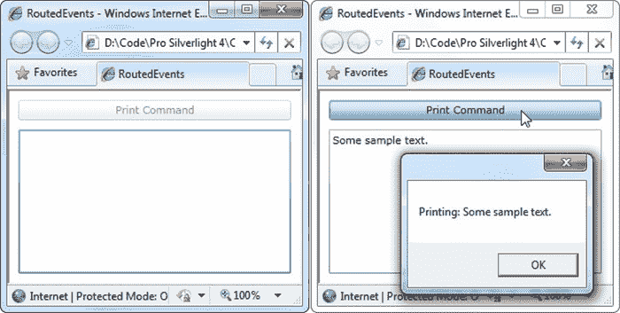

***图 4-10。**发出禁用(左)和启用(右)命令*

这种自动状态管理很好，但是它仅限于控件的启用和禁用。不难想象您希望以其他方式管理状态的情况——例如，当其他条件为真时，选中复选框或隐藏列表项。不幸的是，这在 Silverlight 命令的当前实现中是不可能的。

命令模型的真正承诺是能够在不编写繁琐的事件处理代码的情况下完成工作。事实上，这个示例在派生的用户控件类中没有任何代码。这是 MVVM 设计的正确心态，但是一个更正式的模型会引入一个不同的视图模型。然后，该命令将成为视图模型的一部分，并通过属性公开，以及您需要用于该页面的任何其他命令。有关使用这种设计的 Silverlight 应用程序的完整示例，请参见`[http://tinyurl.com/3x9e3t8](http://tinyurl.com/3x9e3t8)`。

但是不要太兴奋——如果你需要构建除了最简单的 MVVM 应用之外的任何东西，你将需要额外的基础设施。你可以自己构建它，或者去前面提到的 MVVM 图书馆。有关 MVVM 的更多设计建议，请参考【Silverlight 5 专业商务应用(2011 年出版)。

### 最后一句话

在本章中，您深入了解了 Silverlight 依赖属性和路由事件。首先，您看到了依赖属性是如何定义和注册的，以及它们如何插入到其他 Silverlight 服务中。您研究了事件冒泡，并看到了它如何允许事件在元素层次结构中向上传播。接下来，您考虑了所有元素提供的鼠标和键盘事件的基本集合。最后，您看到了 Silverlight 事件处理新方向的开端，即命令模型。

 **提示**了解 Silverlight 内部的最好方法之一是浏览基本 Silverlight 元素的代码，比如 Button、UIElement 和 FrameworkElement。执行这种浏览的最佳工具之一是 Reflector，可在`[www.red-gate.com/products/reflector](http://www.red-gate.com/products/reflector)`获得。使用 Reflector，您可以查看依赖属性和路由事件的定义，浏览初始化它们的共享静态构造函数代码，甚至探索如何在类代码中使用属性和事件。