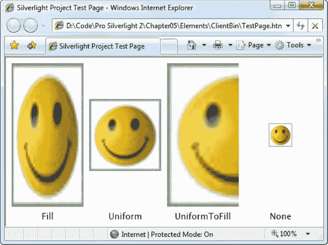
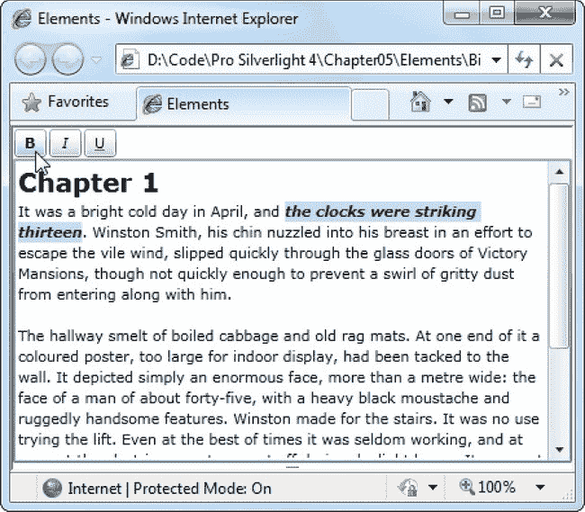
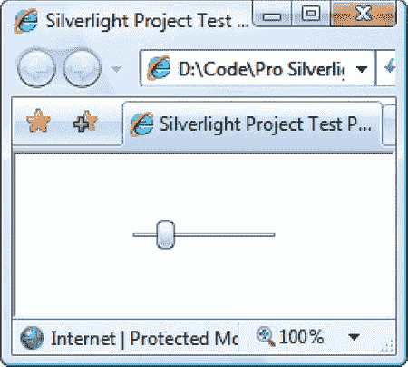

## T1】C H A P T E R 5

## 元素

现在你已经学习了 XAML、布局、鼠标和键盘操作的基础，你可以考虑构建简单和复杂用户界面的元素了。

在这一章中，您将对 Silverlight 的核心元素有一个概述，并且您将探索许多您还没有研究过的元素。首先，您将学习如何使用 TextBlock 显示换行的格式化文本，以及如何使用 Image 元素显示图像。接下来，您将考虑*内容控件*，包括 Silverlight 的许多不同风格的按钮和工具提示控件。最后，您将看到几个更加专门化的元素，比如 Silverlight 的列表、文本输入、范围和日期控件。当您完成本章时，您将对构成 Silverlight 页面的基本要素有一个全面的了解。

 **新功能** Silverlight 5 增加了两个基于 RichTextBox 的专用控件，分别叫做 RichTextBlock 和 RichTextBlockOverflow。使用这些控制，只需一点点工作，您就可以将文本放在多列中，并将文本环绕图像。您将在名为“RichTextBlock”的一节中了解这一增强。

### 银光元素

你已经见过相当多 Silverlight 的核心元素，比如第三章中的布局容器。一些更专业的元素，比如用于绘制二维图形、显示深度缩放图像和播放视频的元素，直到本书的后面部分才会涉及。但是这一章讨论了所有的基础——按钮、文本框、列表和复选框等基本的小部件。

[表 5-1](#tab_5_1) 提供了 Silverlight 包含的关键元素的概览，并指出本书中描述它们的章节。该列表按字母顺序排序，以匹配 Visual Studio 工具箱中元素的顺序。

T2】

在第 1 章中，您了解到 Silverlight 包含一些非核心控件，如果使用的话，这些控件会自动添加到编译后的 XAP 文件中，以便可以与您的应用一起部署。正如你在[表 5-1](#tab_5_1) 的最后一栏中所看到的，这并不适用于大多数 Silverlight 控件，甚至一些高度专业化的控件如 MultiScaleImage 也是标准 Silverlight 包的一部分。

在接下来的几节中，你将仔细查看[表 5-1](#tab_5_1) 中的许多控件，并学习如何在你自己的应用中定制它们。

 **提示**如果你仍然渴望更多的控件，你可以在 Silverlight Toolkit 中找到许多专门的(和完全巧妙的)产品，这是一个可以免费下载和分发的插件，可以在微软的 CodePlex 网站上找到。亮点包括丰富的呈现精美的图表控件，几乎包括 Excel 中的所有内容，从饼图到散点图。一旦安装了 Silverlight Toolkit，您会发现工具箱的 Silverlight 选项卡中打包了新的控件。

### 静态文本

虽然 Silverlight 包含一个标签控件，但它是为数据绑定场景设计的，在第 21 章中讨论过。如果您只想以最佳方式显示格式化文本块，那么使用轻量级、灵活的 TextBlock 元素会好得多，在过去四章的许多示例中，您已经看到了这种元素的作用。

TextBlock 元素非常简单。它提供了一个文本属性，该属性接受一个包含要显示的文本的字符串。

`<TextBlock Text="This is the content."></TextBlock>`

或者，您可以将文本作为嵌套内容提供:

`<TextBlock>This is the content.</TextBlock>`

这种方法的主要优点是，您可以添加换行符和制表符，使代码中的大部分文本更具可读性。Silverlight 遵循 XML 的标准规则，这意味着它*折叠*空白。因此，使用单个空格字符呈现一系列空格、制表符和硬回车。

如果您真的想在一个明确的位置将文本拆分成多行，您有三种选择。首先，可以使用单独的 TextBlock 元素。其次，可以在 TextBlock 元素中使用换行符，如下所示:

`<TextBlock>
    This is line 1.<LineBreak/>
    This is line 2.
</TextBlock>`

第三，您可以将`xml:space="preserve"`属性添加到 TextBlock 元素中，它告诉 XAML 解析器遵守开始的`>`字符(结束开始标记)和结束的`<`(开始结束标记)之间的每个空格、制表符和硬回车。这里有一个例子:

`<TextBlock xml:space="preserve"
>This is line 1.
    This is an indented line 2.</TextBlock>`

这种方法为您提供了最有效的方式来微观管理文本块的格式。然而，它的严格性对于真实世界的应用来说通常太有限了。

 **注意**在使用内联文本时，不能使用<和>字符，因为这些字符有特定的 XML 含义。相反，你需要用字符实体&lt；(小于符号)和&gt；(对于大于号)，将渲染为<和>。

不出所料，默认情况下文本是黑色的。您可以使用 Foreground 属性更改文本的颜色。在 XAML，您可以使用颜色名称进行设置:

`<TextBlock x:Name="txt" Text="Hello World" **Foreground****="Red"**></TextBlock>`

原产地代码

`txt.Foreground = new SolidColorBrush(Colors.Red);`

您可以使用 RGB 值来代替颜色名称。您也可以使用部分透明的颜色来显示背景。在讨论如何绘制面板背景时，这两个主题都包含在第 3 章中。

 **提示**通常情况下，你会用纯色笔刷来填充文本。(默认明显是黑刷。)然而，你可以使用[第 9 章](09.html#ch9)中讨论的花式画笔，用渐变和平铺的图案填充你的文本，创造出更多奇异的效果。

TextBlock 还提供了一个 TextAlignment 属性(允许您居中或右对齐文本)、一个 Padding 属性(设置文本和 TextBlock 外部边缘之间的间距)以及一些用于控制字体、内联格式、文本换行和文本修剪的属性。您将在下面几节中考虑这些属性。

#### 字体属性

TextBlock 类定义字体属性，这些属性确定文本在控件中的显示方式。这些特性在[表 5-2](#tab_5_2) 中进行了概述。

显然，这些属性中最重要的是 FontFamily。*字体系列*是相关字体的集合，例如，Arial Regular、Arial Bold、Arial Italic 和 Arial Bold Italic 都是 Arial 字体系列的一部分。尽管每种变体的印刷规则和字符是单独定义的，但操作系统意识到它们是相关的。因此，您可以将元素配置为使用 Arial Regular，将 FontWeight 属性设置为 Bold，并确信 Silverlight 将切换到 Arial Bold 字样。

选择字体时，您必须提供完整的系列名称，如下所示:

`<TextBlock x:Name="txt" FontFamily="Times New Roman" FontSize="18">
 Some Text</TextBlock>`

这在代码中非常相似:

`txt.FontFamily = "Times New Roman";
txt.FontSize = "18";`

当识别字体系列时，缩短的字符串是不够的。这意味着你不能用 Times 或 Times New 代替全称 Times New Roman。

或者，您可以使用字体的全名来变成斜体或粗体，如下所示:

`<TextBlock FontFamily="Times New Roman Bold">Some Text</TextBlock >`

但是，只使用姓并设置其他属性(如 FontStyle 和 FontWeight)来获得想要的变体会更清晰、更灵活。例如，以下标记将 FontFamily 设置为 Times New Roman，并将 FontWeight 设置为 FontWeights。粗体:

`<TextBlock FontFamily="Times New Roman" FontWeight="Bold">Some Text</TextBlock >`

##### 标准字体

Silverlight supports nine core fonts, which are guaranteed to render correctly on any browser and operating system that supports Silverlight. They're shown in [Figure 5-1](#fig_5_1). 

***图 5-1。** Silverlight 的内置字体*

就 Lucida 而言，有两个名称略有不同的变体。Lucida Sans Unicode 包含在 Windows 中，而 Lucida Grande 是包含在 Mac OS X 中的几乎相同的字体。为了使该系统能够工作，FontFamily 属性支持字体回退，换句话说，您可以提供一个逗号分隔的字体名称列表，Silverlight 将使用第一个支持的字体。默认的 TextBlock 字体等效于将 FontFamily 属性设置为字符串“Lucida Sans Unicode，Lucida Grande”

您可能会认为可以使用更专业的字体，这些字体可能会也可能不会出现在客户的计算机上。但是，Silverlight 不允许这样做。如果您指定的字体不是九种内置字体中的一种，并且它不包含在您的应用集合中(下一节将详细介绍)，您的字体设置将被忽略。无论客户端是否安装了具有适当名称的字体，都会发生这种情况。这是有道理的——毕竟，使用仅在某些系统上受支持的字体可能会导致应用在其他系统上被破坏或完全无法读取，这是一个容易犯的错误。

##### 字体嵌入

如果希望在应用中使用非标准字体，可以将它们嵌入到应用程序集中。这样，您的应用永远不会有问题找到您想要使用的字体。

嵌入过程很简单。首先，添加字体文件(通常是扩展名为。ttf)添加到您的应用中，并将生成操作设置为资源。在 Visual Studio 中，通过在解决方案资源管理器中选择字体文件并在属性页中更改其生成操作设置，可以做到这一点。

接下来，当您设置 FontFamily 属性时，需要使用以下格式:

`*FontFileName#FontName*`

例如，如果您有一个名为 BayernFont.ttf 的字体文件，其中包含一个名为 Bayern 的字体，您可以使用如下标记:

`<TextBlock FontFamily="BayernFont.ttf#Bayern">This is an embedded font</TextBlock>`

[图 5-2](#fig_5_2) 显示了结果。

***图 5-2。**使用嵌入式字体*

或者，您可以使用包含字体文件的流来设置字体。在这种情况下，您需要设置 TextBlock。FontSource 属性，然后设置 TextBlock。具有字体名称的 FontFamily 属性。例如，如果您将 BayernFont.ttf 文件作为资源添加到名为 FontTest 的项目中，则可以使用以下代码以编程方式检索它:

`StreamResourceInfo sri = Application.GetResourceStream(
  new Uri("FontTest;component/BayernFont.ttf", UriKind.Relative));

lbl.FontSource = new FontSource(sri.Stream);
lbl.FontFamily = new FontFamily("Bayern");`

为了从当前程序集中提取资源，此代码使用了应用。GetResourceStream()方法和始终采用以下形式的专用 URI 语法:

`*AssemblyName;component/FontResourceName*`

无论您使用哪种方法，使用自定义字体的过程都相当简单。然而，字体嵌入引起了明显的许可问题。大多数字体供应商允许他们的字体嵌入到文档(如 PDF 文件)中，但不允许嵌入到应用(如 Silverlight 程序集)中。问题是显而易见的——用户可以手动下载 XAP 文件，将其解压缩，检索字体资源，然后在他们的本地计算机上访问它。Silverlight 没有试图强制字体许可，但是在你重新发布字体之前，你应该确保你有坚实的法律基础。

您可以使用微软的免费字体属性扩展工具来检查字体的嵌入权限，该工具可从`[www.microsoft.com/typography/TrueTypeProperty21.mspx](http://www.microsoft.com/typography/TrueTypeProperty21.mspx)`获得。安装此实用程序后，右键单击任何字体文件，然后选择“属性”来查看有关它的更多详细信息。特别要注意的是，请查看“嵌入”选项卡，了解有关该字体允许嵌入的信息。标记为允许已安装嵌入的字体适用于 Silverlight 应用，而允许可编辑嵌入的字体可能不适用。有关特定字体的许可信息，请咨询字体供应商。

 **注意**如果所有方法都失败了，你可以通过将字体改为图形来解决许可问题。这适用于小块图形文本(例如标题)，但不适用于大块文本。您可以在您最喜欢的绘图程序中将图形文本保存为位图，或者您可以使用 Silverlight 的 Path 元素将文本转换为一系列形状(这将在第 8 章的[中讨论)。您可以使用 Expression Designer 或 Expression Blend 将图形文本转换为路径(只需选择文本块并选择对象路径转换为路径)。有趣的是，Silverlight 还允许您通过代码执行相同的技巧。浏览到](08.html#ch8)`[http://tinyurl.com/69f74v](http://tinyurl.com/69f74v)`查看一个例子，其中 Silverlight 应用调用一个 web 服务，为非西方文本动态生成一个路径。web 服务将路径数据返回给 Silverlight 应用，后者无缝地显示这些数据。

#### 下划线

通过将 TextDecorations 属性设置为下划线，可以为任何字体添加下划线:

`<TextBlock TextDecorations="Underline">Underlined text</TextBlock>`

在 WPF，有几种类型的文本装饰，包括上划线和删除线。然而，目前 Silverlight 只包含下划线。

如果你想给文本块中的单个单词加下划线，你需要使用行内元素，如下一节所述。

#### 运行

在许多情况下，您会想要格式化单个文本位，但是将它们一起保存在 TextBlock 中的单个段落中。为此，需要在 TextBlock 元素中使用 Run 对象。以下是几个单词格式不同的例子(见[图 5-3](#fig_5_3) ):

`<TextBlock FontFamily="Georgia" FontSize="20" >
  This <Run FontStyle="Italic" Foreground="YellowGreen">is</Run> a
  <Run FontFamily="Comic Sans MS" Foreground="Red" FontSize="40">test.</Run>
</TextBlock>` 

***图 5-3。**用游程格式化文本*

游程支持与 TextBlock 相同的关键格式属性，包括前景、文本装饰和五种字体属性(FontFamily、FontSize、FontStyle、FontWeight 和 FontStretch)。

从技术上讲，运行对象不是真正的元素。相反，它是一个*内联。Silverlight 提供了两种类型的内联——您之前看到的 LineBreak 类和 Run 类。您可以通过 TextBlock 与 TextBlock 中的跑步进行交互。内联集合。事实上，TextBlock 实际上有两个重叠的内容模型。您可以通过简单文本属性设置文本，也可以通过 Inlines 集合提供文本。但是，您在其中一个中所做的更改会影响另一个，所以如果您设置了 Text 属性，您将清除当前的内联集合。*

 **注意**inline Run 和 LineBreak 类是文本元素模型的一部分，它由本章后面讨论的 RichTextBox 控件支持(以一种更全面的方式)。

#### 环绕文字

若要将文本换行到多行，可以使用 TextWrapping 属性。通常，TextWrapping 设置为 TextWrapping。如果内容超出了包含元素的右边缘，内容将被截断。如果使用文本换行。Wrap，当 TextBlock 元素的宽度以某种方式受到约束时，您的内容将换行。(例如，将它放入成比例大小或固定宽度的网格单元中。)换行时，TextBlock 在最近的空格处拆分行。如果有一个单词的长度超过了可用的行宽，TextBlock 将尽可能地拆分该单词以使其适合。

当文本换行时，LineHeight 和 LineStackingStrategy 属性变得很重要。LineHeight 属性可以设置将用于每一行的固定高度(以像素为单位)。然而， LineHeight 只能用于增加行高——如果您指定的高度小于显示文本所需的高度，您的设置将被忽略。

LineStackingStrategy 决定了在处理使用不同字体的多行内容时 TextBlock 将执行的操作。您可以选择使用标准行为 MaxHeight，该行为使每行的高度与它所包含的最高文本相适应，或者您可以使用 BlockLineHeight，该行为将各行设置为一个固定高度，即由 LineHeight 属性设置的高度。较短的文本将有额外的空间，而较高的文本将与其他行重叠。[图 5-4](#fig_5_4) 比较了不同的选项。

***图 5-4。**计算行高的两种不同方法*

TextBlock 在整齐的矩形区域中换行。文本不能环绕曲线或附近形状的轮廓。但是，您可以使用 RichTextBox 的溢出功能来模拟这种效果，如本章后面所述。

#### 修剪文本

正如您在上一节中了解到的，不适合其容器宽度的文本有两种选择:换行或被截断。例如，如果您有一个类似“Silverlight 是一个非常棒的平台”的句子，它可能会被这样截断:

`Silverlight is a fant`

TextTrimming 属性为您提供了一种更好的方式来处理这种情况。如果将 TextTrimming 属性设置为 WordEllipsis(除默认选项之外的唯一选项)，Silverlight 会在截断文本的末尾添加一个省略号。所以，前面的例子可能是这样的:

`Silverlight is a …`

这给用户一个视觉提示，即没有显示全文。

#### 字符间距

如果您的文字看起来有点拥挤，您可以使用 LineHeight 属性在行间添加垂直间距(正如您已经看到的那样)，并且可以使用 CharacterSpacing 属性在同一行的字母之间添加水平间距。这里有一个例子:

`<TextBlock FontSize="20" CharacterSpacing="100">
  These letters are spaced out.
</TextBlock>`

CharacterSpacing 属性采用以当前字体大小的 1/1000 ths 度量的值。因此，如果你将字符间距设置为 100，字体大小为 20 像素，你将在每个字母之间获得 2 像素的额外空间(因为 *100/1000 × 20 = 2* )。

字符间距的默认值是 0，这不会给您带来额外的空间。如果您想要将一条线的字母画得更靠近(甚至可能重叠)，您可以简单地将字符间距设置为负值。

### 图片

在 Silverlight 中，显示图像是最简单的任务之一。您只需要添加一个图像元素并设置它的 Source 属性。但是，您需要了解一些限制。

最明显的限制是图像元素只支持两种图像格式。它完全支持 JPEG，并相当广泛地支持 PNG(尽管它不支持使用 64 位颜色或灰度的 PNG 文件)。图像元素不支持 GIF 文件。这种省略有两个原因——它允许 Silverlight 下载保持更精简，并且它避免了 Silverlight 动画模型和 Web 上使用的更基本(和不支持的)的动画 GIF 功能之间的潜在混淆。

同样重要的是要认识到。源属性是用相对或绝对 URI 设置的。通常，您将使用相对 URI 来显示作为资源添加到项目中的图像。例如，如果向项目中添加一个名为 grandpiano.jpg 的新图像，Visual Studio 会自动将其配置为资源，并将该资源作为二进制数据块嵌入到已编译的程序集中。在运行时，您可以使用其资源名称(即它在解决方案资源管理器中的文件名)来检索该图像。以下是如何:

`<Image Source="grandpiano.jpg"></Image>`

或者，假设图像位于名为 Images 的项目子文件夹中，您可以像这样检索它:

`<Image Source="img/grandpiano.jpg"></Image>`

或者，您可以用代码构造 URI 并设置图像。源属性以编程方式:

`img.Source = new BitmapImage(new Uri("grandpiano.jpg", UriKind.Relative));`

您还可以使用图像 URIs 来指向没有嵌入到您的应用中的图像。您可以显示与 Silverlight 应用位于同一网站上的图像，也可以显示位于不同网站上的图像。

`<Image Source="[http://www.mysite.cimg/grandpiano.jpg](http://www.mysite.cimg/grandpiano.jpg)"></Image>`

然而，有一个问题。当测试基于文件的网站(不使用 ASP.NET 网站和 Visual Studio 测试 web 服务器的网站)时，您将无法使用绝对 URL。这种限制是一种安全限制，是由于运行应用的方式(从文件系统)和检索图像的方式(从 Web，通过 HTTP)不匹配造成的。如果您试图在通过 HTTP 访问 Silverlight 页面时通过 HTTPS 访问图像，也会受到同样的限制(反之亦然)。

欲了解更多信息，并查看演示您使用 URIs 和管理资源的不同选项的几个示例，请参阅第 6 章。

有趣的是，Silverlight 使用位图缓存来减少它发出的 URI 请求的数量。这意味着您可以多次链接到网站上的图像文件，但您的应用将只下载一次。

#### 图像尺寸

有两种方法可以调整图像的大小。首先，您可以使用 Height 和 Width 属性为图像设置一个明确的大小。其次，您可以将图像元素放在一个使用调整大小的容器中，例如网格中按比例调整大小的单元格。如果这两个因素都不起作用，换句话说，您没有设置高度和宽度属性，而是将图像放在一个简单的布局容器(如画布)中，那么您的图像将使用图像文件中定义的原始大小显示。

若要控制这种行为，可以使用 Stretch 属性。Stretch 属性确定当图像元素的尺寸与图像文件的原始尺寸不匹配时，如何调整图像的大小。[表 5-3](#tab_5_3) 列出了可用于拉伸属性的值，[图 5-5](#fig_5_5) 对它们进行了比较。

***图 5-5。**调整图像大小的四种不同方法*

#### 图像错误

有几个因素会导致图像不显示，例如对不存在的文件使用 URI，或者试图以不支持的格式显示图像。在这些情况下，Image 元素会引发 ImageFailed 事件。您可以对此事件做出反应，以确定问题并采取替代措施。例如，如果 Web 上没有大图像，您可以用嵌入到应用程序集中的小占位符来代替。

图像错误不是致命的，即使不能显示图像，应用也会继续运行。在这种情况下，图像元素将保持空白。如果图像数据需要大量时间下载，您的图像也将是空白的。Silverlight 将异步执行图像请求，并在等待时在页面中呈现布局的其余部分。

### 内容控件

*内容控件*是一种特殊类型的控件，用于保存(和显示)一段内容。从技术上讲，内容控件是一个可以包含一个*单个*嵌套元素的控件。一个子控件的限制是内容控件与布局容器的区别，布局容器可以容纳任意多的嵌套元素。

正如您在第 3 章中了解到的，所有 Silverlight 布局容器都是从 Panel 类派生的，它支持保存多个元素。同样，所有内容控件都是从 ContentControl 类派生的。[图 5-6](#fig_5_6) 显示了阶级阶层。

***图 5-6。**内容控制层级*

如图 5-6 所示，一些常见的控件实际上是内容控件，包括标签、工具提示、按钮、单选按钮和复选框。还有一些更专业的内容控件，比如 ScrollViewer(你在《T2》第三章中使用它来创建一个可滚动的面板)，以及一些被设计用于另一个特定控件的控件。例如，ListBox 控件保存 ListBoxItem 内容控件；日历需要日按钮和月按钮；DataGrid 使用 DataGridCell、DataGridRowHeader 和 DataColumnHeader。

#### 内容属性

Panel 类添加 Children 集合来保存嵌套元素，而 ContentControl 类添加 Content 属性，该属性接受单个对象。内容属性支持任何类型的对象。它为您提供了三种显示内容的方式:

*   *Elements* :如果你使用一个从 UIElement 派生的对象作为内容控件的内容，那么这个元素将被呈现。
*   *其他对象*:如果将一个非元素对象放入一个内容控件中，该控件将简单地调用 ToString()来获取该控件的文本表示。对于某些类型的对象，ToString()产生合理的文本表示。对于其他的，它只是返回对象的完全限定类名，这是默认的实现。
*   *其他对象，带有数据模板*:如果你将一个非元素对象放入一个内容控件中，并用一个数据模板设置 ContentTemplate 属性，那么内容控件将呈现数据模板，并使用它包含的表达式从你的对象的属性中提取信息。这种方法在处理数据对象集合时特别有用，你将在[第 20 章](20.html#ch20)中看到它是如何工作的。

为了理解这是如何工作的，考虑一下这个不起眼的按钮。一个普通的按钮可能只使用一个简单的字符串对象来生成它的内容:

`<Button Margin="3" Content="Text content"></Button>`

该字符串被设置为按钮内容并显示在按钮表面上。

 **提示**当用无格式文本填充一个按钮时，你可能想使用按钮类从控件继承的字体相关属性，这些属性复制了[表 5-2](#tab_5_2) 中列出的 TextBlock 属性。

但是，您可以通过在按钮内部放置其他元素来实现更大的目标。例如，您可以使用 image 类在内部放置图像:

`<Button Margin="3">
  <Image Source="happyface.jpg"></Image>
</Button>`

或者你可以将文本和图像打包在一个布局容器中，就像 StackPanel 一样，就像你在第三章看到的那样:

`<Button Margin="3">
  <StackPanel>
    <TextBlock Margin="3" Text="Image and text button"></TextBlock>
    <Image Source="happyface.jpg" />
    <TextBlock Margin="3" Text="Courtesy of the StackPanel"></TextBlock>
  </StackPanel>
</Button>`

如果你想创建一个真正奇特的按钮，你甚至可以在里面放置其他内容控件，比如文本框和按钮(并在里面嵌套静态元素)。这样的界面是否有意义值得怀疑，但这是可能的。

此时，您可能想知道 Silverlight 内容模型是否真的值得这么麻烦。毕竟，您可能会选择将图像放在按钮内，但不太可能嵌入其他控件和整个布局面板。然而，内容模型有几个重要的优点。

例如，前面的标记将位图放入按钮中。然而，这种方法不如从 Silverlight 形状中创建矢量图形灵活。使用矢量绘图，您可以创建可缩放的按钮图像，并且可以通过编程方式进行更改(例如，使用不同的颜色、变换或动画)。使用基于向量的按钮可以创建一个动态界面来响应状态变化和用户动作。

在第 8 章中，你将考虑如何在 Silverlight 中构建矢量图像。然而，您现在应该理解的关键事实是，矢量绘图模型与内容控件无缝集成，因为它们能够容纳任何元素。例如，这个标记创建了一个包含两个菱形的简单图形按钮(如图[图 5-7](#fig_5_7) 所示):

`<Button Margin="3" Height="70" Width="215">
  <Grid Margin="5">
    <Polygon Points="100,25 125,0 200,25 125,50"
     Fill="LightSteelBlue" />
    <Polygon Points="100,25 75,0 0,25 75,50"
     Fill="LightGray"/>
  </Grid>
</Button>` 

***图 5-7。**一个有形状内容的按钮*

显然，在这种情况下，嵌套内容模型比向 Button 类添加额外的属性来支持不同类型的内容更简单。嵌套内容模型不仅更加灵活，它还允许 Button 类公开一个更简单的接口。因为所有内容控件都以相同的方式支持内容嵌套，所以没有必要向多个类添加不同的内容属性。

本质上，嵌套内容模型是一种交易。它简化了元素的类模型，因为不需要使用额外的继承层来为不同类型的内容添加属性。然而，您需要使用稍微复杂一点的*对象*模型——可以从其他嵌套元素中构建的元素。

 **注意**你不能总是通过改变一个控件的内容来得到你想要的效果。例如，尽管您可以在按钮中放置任何内容，但一些细节永远不会改变，例如按钮的阴影背景、圆形边框以及当您将鼠标指针移动到按钮上时会发光的鼠标悬停效果。然而，还有另一种方法可以改变这些内置的细节——通过应用一个新的控件模板。第 15 章展示了如何使用一个控件模板来改变控件的外观和感觉。

#### 对齐内容

在第 3 章中，你学习了如何使用 HorizontalAlignment 和 VerticalAlignment 属性来对齐容器中的不同控件，这两个属性是在基本的 FrameworkElement 类中定义的。然而，一旦控件包含了内容，就需要考虑另一个层次的组织。您需要决定内容控件中的内容如何与其边框对齐。这是使用 HorizontalContentAlignment 和 VerticalContentAlignment 属性完成的。

HorizontalContentAlignment 和 VerticalContentAlignment 支持与 HorizontalAlignment 和 VerticalAlignment 相同的值。这意味着您可以在任何边缘(顶部、底部、左侧或右侧)的内部排列内容，可以将内容居中(居中)，或者可以拉伸内容以填充可用空间(拉伸)。这些设置直接应用于嵌套的内容元素，但是您可以使用多层嵌套来创建复杂的布局。例如，如果将 StackPanel 嵌套在 Button 元素中，则按钮。HorizontalContentAlignment 决定了 StackPanel 的放置位置，但是 StackPanel 及其子级的对齐和大小调整选项将决定布局的其余部分。

在第 3 章中，您还学习了 Margin 属性，它允许您在相邻元素之间添加空白。内容控件使用一个名为 Padding 的补充属性，该属性在控件边缘和内容边缘之间插入空格。要查看区别，请比较以下两个按钮:

`<Button Content="Absolutely No Padding"></Button>
<Button Padding="3" Content="Well Padded"></Button>`

没有填充的按钮(默认)的文本会紧靠按钮边缘。每边有 3 个像素填充的按钮获得了更多的喘息空间。

 **注意**HorizontalContentAlignment、VerticalContentAlignment 和 Padding 属性都被定义为 Control 类的一部分，而不是更具体的 ContentControl 类。这是因为可能有些控件不是内容控件，但仍然有某种内容。一个例子是 textBox，它包含的文本(存储在 Text 属性中)使用您应用的对齐和填充设置进行调整。

### 按钮

Silverlight 识别三种类型的按钮控件:熟悉的按钮、复选框和单选按钮。所有这些控件都是从 ButtonBase 派生的内容控件。

ButtonBase 类只包含几个成员。它定义了非常重要的 Click 事件，并添加了 IsFocused、IsMouseOver 和 IsPressed 只读属性。最后，ButtonBase 类添加一个 ClickMode 属性，该属性确定按钮何时触发其 Click 事件以响应鼠标操作。默认值为 ClickMode。释放，这意味着当单击并释放鼠标时触发 Click 事件。但是，您也可以选择在第一次按下鼠标按钮时触发 Click 事件鼠标(ClickMode。或者，奇怪的是，每当鼠标移动到按钮上并停留在那里时(ClickMode。悬停)。

您已经看到了如何使用普通按钮。在接下来的几节中，您将快速了解 Silverlight 提供的更专业的替代方案。

#### 超链接按钮

普通的按钮控件非常简单——单击它，它会触发一个单击事件，您可以用代码来处理该事件。但是 Silverlight 提供的其他变体呢？

其中之一是超链接按钮。HyperlinkButton 不绘制标准按钮背景。相反，它只是呈现您提供的内容。如果在 HyperlinkButton 中使用文本，默认情况下它会显示为蓝色，但没有下划线。(如果需要该效果，请使用 TextDecorations 属性。)当用户将鼠标移动到超链接按钮上时，鼠标光标会变成指针。您可以通过设置 Cursor 属性来覆盖这种效果。

基本上有三种使用超链接按钮的方法:

*   *将浏览器发送到外部网站*:为此，用指向目标网页的绝对 URL 设置 NavigateUri 属性。或者，使用要打开链接的浏览器框架的名称设置 TargetName 属性。请记住，如果您离开当前页面，您将有效地结束当前的 Silverlight 应用。因此，这种技术的用途相对有限。
*   *将框架发送到另一个 Silverlight 页面*:为此，请确保您的页面上有一个框架控件，并使用指向项目中另一个 XAML 文件的相对 Uri 来设置 NavigateUri。你将在[第 7 章](07.html#ch7)中学习如何使用这个能力，以及 Silverlight 的其余导航功能。
*   *在代码*中执行一些任意操作:为此，不要设置 NavigateUri 属性。相反，只需处理 Click 事件来执行适当的操作。

 **提示**HTML 入口页面可以专门阻止导航到外部网站。为此，只需将 enableNavigation 属性添加到测试页面中的<对象>元素，并将其设置为 false。你仍将被允许使用超链接按钮进行内部框架导航(见[第 7 章](07.html#ch7))或者用点击事件触发一个动作。

#### 切换按钮和重复按钮

除了 Button 和 HyperlinkButton，ButtonBase 还派生了另外两个类:

*   *RepeatButton* :只要按钮被按住，这个控件就会连续触发 Click 事件。普通按钮在每次用户点击时触发一次点击事件。
*   ToggleButton :这个控件代表一个有两种状态(点击或未点击)的按钮。当您单击 ToggleButton 时，它将保持按下状态，直到您再次单击它以释放它。这有时被描述为*粘性点击*行为。

RepeatButton 和 ToggleButton 都在系统中定义。Windows.Controls.Primitives 命名空间，这表明它们不经常单独使用。相反，它们用于通过组合构建更复杂的控件，或者通过继承扩展特性。例如，RepeatButton 是用于构建高级 ScrollBar 控件的组件之一(最终，它是更高级 ScrollViewer 的一部分)。RepeatButton 为滚动条末端的箭头按钮提供了它们的商标行为——只要您按住它，滚动就会继续。类似地，ToggleButton 用于派生下面描述的更有用的 CheckBox 和 RadioButton 类。但是，RepeatButton 和 ToggleButton 都不是抽象类，因此您可以在用户界面中直接使用它们，或者在需要时构建自定义控件。

#### 复选框

CheckBox 和 RadioButton 是不同种类的按钮。它们源自 ToggleButton，这意味着它们可以由用户打开或关闭，这就是它们切换行为的原因。在复选框的情况下，打开控件意味着在其中放置一个复选标记。

CheckBox 类不添加任何成员，所以基本的 CheckBox 接口在 ToggleButton 类中定义。最重要的是，ToggleButton 添加了一个 IsChecked 属性。IsChecked 是一个可空的布尔值，这意味着它可以设置为 true、false 或空值。很明显，true 代表复选框，false 代表空框。null 值有点复杂，它代表一种不确定的状态，显示为一个阴影框。不确定状态通常用于表示尚未设置的值或存在差异的区域。例如，如果您有一个允许您在文本应用中应用加粗格式的复选框，并且当前选择包括加粗和常规文本，您可以将该复选框设置为 null 以显示不确定的状态。

要在 Silverlight 标记中分配空值，您需要使用空标记扩展，如下所示:

`<CheckBox IsChecked="{x:Null}" Content="A check box in indeterminate state">
</CheckBox>`

除了 IsChecked 属性，ToggleButton 类还添加了一个名为 IsThreeState 的属性，该属性确定用户是否能够将复选框置于不确定状态。如果 IsThreeState 为 false(缺省值)，单击复选框会使其状态在选中和未选中之间切换，将其置于不确定状态的唯一方法是通过代码。如果 IsThreeState 为 true，单击复选框将在所有三种可能的状态之间循环。

ToggleButton 类还定义了当复选框进入特定状态时触发的三个事件:选中、未选中和不确定。在大多数情况下，通过处理从 ButtonBase 继承的 Click 事件，可以更容易地将这个逻辑合并到一个事件处理程序中。每当按钮改变状态时，就会触发 Click 事件。

#### 单选按钮

RadioButton 也派生自 ToggleButton，并使用相同的 IsChecked 属性和相同的 Checked、Unchecked 和 Indeterminate 事件。除此之外，RadioButton 还添加了一个名为 GroupName 的属性，该属性允许您控制如何将单选按钮放入组中。

通常，单选按钮按其容器分组。这意味着，如果您将三个 RadioButton 控件放在一个 StackPanel 中，它们将组成一个组，您可以从中选择一个。另一方面，如果您将单选按钮的组合放在两个独立的 StackPanel 控件中，您就有了两个独立的组。

GroupName 属性允许您覆盖此行为。您可以使用它在同一容器中创建多个组，或者创建跨多个容器的单个组。无论哪种方式，诀窍都很简单——只需给所有属于同一组的单选按钮一个相同的组名。

考虑这个例子:

`<StackPanel>
  <Border Margin="5" Padding="5" BorderBrush="Yellow" BorderThickness="1"
   CornerRadius="5">
    <StackPanel>
      <RadioButton Content="Group 1"></RadioButton>
      <RadioButton Content="Group 1"></RadioButton>
      <RadioButton Content="Group 1"></RadioButton>
      <RadioButton **GroupName="Group3"** Content="Group 3"></RadioButton>
    </StackPanel>
  </Border>
  <Border Margin="5" Padding="5" BorderBrush="Yellow" BorderThickness="1"
   CornerRadius="5">
    <StackPanel>
      <RadioButton Content="Group 2"></RadioButton>
      <RadioButton Content="Group 2"></RadioButton>
      <RadioButton Content="Group 2"></RadioButton>
      <RadioButton **GroupName** **="Group3"** Content="Group 3"></RadioButton>
    </StackPanel>
  </Border>
</StackPanel>`

这里，有两个容纳单选按钮的容器，但有三组(见[图 5-8](#fig_5_8) )。每个组框底部的最后一个单选按钮是第三个组的一部分。在这个例子中，它导致了一个令人困惑的设计，但是在某些情况下，您可能希望以一种微妙的方式将特定的单选按钮从包中分离出来，而不会导致它失去其组成员资格。

***图 5-8。**分组单选按钮*

### 工具提示和弹出窗口

Silverlight 为*工具提示*提供了一个灵活的模型(那些臭名昭著的黄色框，当你将鼠标悬停在有趣的东西上时就会弹出)。因为 Silverlight 中的工具提示是内容控件，所以几乎可以在工具提示中放置任何内容。

工具提示由工具提示内容控件表示。但是，您不能将 ToolTip 元素直接添加到标记中。相反，您可以使用 ToolTipService 通过设置附加属性来配置现有元素的工具提示。Silverlight 将自动创建工具提示，并在需要时显示它。

最简单的例子是纯文本的工具提示。您可以通过设置 ToolTipService 来创建纯文本工具提示。另一个元素上的工具提示属性，如下所示:

`<Button ToolTipService.ToolTip="This is my tooltip"
 Content="I have a tooltip"></Button>`

当您将鼠标悬停在该按钮上时，文本“这是我的工具提示”会出现在一个灰色弹出框中。

#### 自定义工具提示

如果您想提供更多的工具提示内容，比如嵌套元素的组合，您需要中断 ToolTipService。属性放入单独的元素中。下面是一个使用更复杂的嵌套内容设置按钮的 ToolTip 属性的示例:

`<Button Content="I have a fancy tooltip">
  <ToolTipService.ToolTip>
    <StackPanel>
      <TextBlock Margin="3" Text="Image and text"></TextBlock>
      <Image Source="happyface.jpg"></Image>
      <TextBlock Margin="3" Text="Image and text"></TextBlock>
    </StackPanel>
  </ToolTipService.ToolTip>
</Button>`

和前面的例子一样，Silverlight 隐式创建了一个 ToolTip 元素。不同之处在于，在这种情况下，ToolTip 对象包含一个 StackPanel，而不是一个简单的字符串。[图 5-9](#fig_5_9) 显示了结果。

***图 5-9。**一个花哨的工具提示*

 **注意**不要把用户交互控件放在工具提示中，因为工具提示页面不能接受焦点。例如，如果您在工具提示中放置一个按钮，该按钮将会出现，但它是不可点击的。(如果你试图点击它，你的鼠标点击只会传递到下面的页面。)如果您想要一个类似工具提示的页面来容纳其他控件，可以考虑使用 Popup 控件，这将在“Popup”一节中讨论

此时，您可能想知道是否可以定制工具提示外观的其他方面，比如标准的灰色背景。通过在设置 ToolTipService 时显式定义 ToolTip 元素，可以获得更多的控制。工具提示属性。因为工具提示是一个内容控件，所以它提供了许多有用的属性。您可以调整大小和对齐属性(如宽度、高度、最大宽度、HoriztontalContentAlignment、填充等)、字体(FontFamily、FontSize、FontStyle 等)和颜色(背景和前景)。您也可以使用 HorizontalOffset 和 VerticalOffset 属性，用负值或正值将工具提示从鼠标指针上移开，移到您想要的位置。

下面的标记使用工具提示属性创建了一个工具提示，该工具提示使用红色背景，默认情况下内部文本为白色:

`<Button Content="I have a fancy tooltip">
  <ToolTipService.ToolTip>
    **<ToolTip Background="DarkRed" Foreground="White">**
      <StackPanel>
        <TextBlock Margin="3" Text="Image and text"></TextBlock>
        <Image Source="happyface.jpg"></Image>
        <TextBlock Margin="3" Text="Image and text"></TextBlock>
      </StackPanel>
    **</ToolTip>**
  </ToolTipService.ToolTip>
</Button>`

如果您为工具提示指定一个名称，您也可以通过编程方式与它进行交互。例如，您可以使用 IsEnabled 属性临时禁用工具提示，并使用 IsOpen 以编程方式显示或隐藏工具提示(或者只是检查工具提示是否打开)。您还可以处理它的 Opened 和 Closed 事件，如果您希望在工具提示打开时动态生成它的内容，这将非常有用。

 **提示**如果你还想对工具提示的外观进行更多的控制——例如，你想去掉黑色边框或者改变它的形状——你只需要用你喜欢的视觉效果替换一个新的控件模板。[第十五章](15.html#ch15)有细节。

#### 弹出

Popup 控件和 ToolTip 控件有很多共同之处，尽管它们都不是从对方派生出来的。

与工具提示一样，弹出窗口可以包含一条内容，其中可以包含任何 Silverlight 元素。(该内容存储在弹出菜单中。子属性，而不是工具提示。内容属性。)此外，与工具提示一样，弹出窗口中的内容可以超出页面的边界。最后，可以使用相同的放置属性放置弹出窗口，并使用相同的 IsOpen 属性显示或隐藏弹出窗口。

弹出窗口和工具提示之间的区别更重要。它们包括以下内容:

*   *弹出窗口从不自动显示*:您必须设置 IsOpen 属性才能显示。在您将它的 IsOpen 属性显式设置为 false 之前，弹出窗口不会消失。
*   弹出窗口可以接受焦点:因此，你可以在其中放置用户交互控件，比如一个按钮。这个功能是使用弹出菜单而不是工具提示的主要原因之一。

因为弹出窗口必须手动显示，所以您可以选择完全用代码创建它。然而，您可以在 XAML 标记中轻松地定义它——只要确保包含 Name 属性，这样您就可以在代码中操作它。标记中弹出窗口的位置并不重要，因为它的左上角将始终与 Silverlight 内容区域的左上角对齐。

`<StackPanel Margin="20">
  <TextBlock TextWrapping="Wrap" MouseLeftButtonDown="txt_MouseLeftButtonDown"
   Text="Click here to open the PopUp."></TextBlock>

  <Popup x:Name="popUp" MaxWidth="200">
    <Border Background="Lime" MouseLeftButtonDown="popUp_MouseLeftButtonDown">
      <TextBlock Margin="10" Text="This is the PopUp."></TextBlock>
    </Border>
  </Popup>
</StackPanel>`

唯一剩下的细节是相对简单的代码，当用户点击时显示弹出窗口，当用户点击时隐藏弹出窗口:

`private void txt_MouseLeftButtonDown(object sender, MouseButtonEventArgs e)
{
    popUp.IsOpen = true;
}

private void popUp_MouseLeftButtonDown(object sender, MouseButtonEventArgs e)
{
    popUp.IsOpen = false;
}`

[图 5-10](#fig_5_10) 显示了弹出菜单的运行情况。

***图 5-10。**弹出一个类似工具提示的效果*

 **提示**如果你计划创建一个非常详细的弹出窗口，你可能要考虑为弹出窗口内容创建一个自定义用户控件。然后，您可以在弹出窗口中放置该自定义用户控件的一个实例。最终结果是一样的，但是这种技术极大地简化了您的标记。如果你想让你的弹出窗口具有自包含对话框的特性，你应该考虑子窗口控件，这在[第 7 章](07.html#ch7)中有描述。

### 物品控制

包装项集合的控件通常派生自 ItemsControl 类。Silverlight 提供了四个基于列表的控件。在这一节中，您将看到 ListBox、ComboBox 和 TabControl。你将在第 21 章中探索树形视图。

ItemsControl 类填充所有基于列表的控件使用的基本管道。值得注意的是，它为您提供了两种方式来填充项目列表。最直接的方法是使用代码或 XAML 将它们直接添加到 Items 集合中。这是你将在本章看到的方法。但是，如果您需要显示一个动态列表，更常见的是使用数据绑定。在这种情况下，将 ItemsSource 属性设置为包含要显示的数据项集合的对象。该过程在第 20 章中有所介绍。

#### 列表框

要向 ListBox 添加项目，可以在 ListBox 元素中嵌套 ListBoxItem 元素。例如，下面是一个包含颜色列表的列表框:

`<ListBox >
  <ListBoxItem Content="Green"></ListBoxItem>
  <ListBoxItem Content="Blue"></ListBoxItem>
  <ListBoxItem Content="Yellow"></ListBoxItem>
  <ListBoxItem Content="Red"></ListBoxItem>
</ListBox>`

正如你在第 2 章中回忆的那样，不同的控件以不同的方式处理它们的嵌套内容。ListBox 将每个嵌套对象存储在其 Items 集合中。

 **注意**如果将 SelectionMode 属性设置为 multiple 或 Extended，ListBox 类也允许多重选择。在多模式下，您可以通过单击来选择或取消选择任何项目。在扩展模式下，您需要按住 Ctrl 键来选择其他项目，或者按住 Shift 键来选择一系列项目。在任一类型的多选列表中，都使用 SelectedItems 集合而不是 SelectedItem 属性来获取所有选定的项目。

列表框是一个非常灵活的控件。它不局限于 ListBoxItem 对象，可以保存任何任意元素。这是因为 ListBoxItem 类是从 ContentControl 派生的，这使它能够保存一段嵌套内容。如果这段内容是 UIElement 派生类，它将呈现在 ListBox 中。如果是其他类型的对象，ListBoxItem 将调用 ToString()并显示结果文本。

例如，如果您决定创建一个包含图像的列表，您可以创建如下标记:

`<ListBox>
  <ListBoxItem>
    <Image Source="happyface.jpg"></Image>
  </ListBoxItem>
  <ListBoxItem>
    <Image Source="happyface.jpg"></Image>
  </ListBoxItem>
</ListBox>`

ListBox 实际上足够智能，可以创建它隐式需要的 ListBoxItem 对象。这意味着您可以将对象直接放在 ListBox 元素中。下面是一个更大胆的例子，它使用嵌套的 StackPanel 对象来组合文本和图像内容:

`<ListBox>
  <StackPanel Orientation="Horizontal">
    <Image Source="happyface.jpg"  Width="30" Height="30"></Image>
    <TextBlock VerticalAlignment="Center" Text="A happy face"></TextBlock>
  </StackPanel>
  <StackPanel Orientation="Horizontal">
    <Image Source="redx.jpg" Width="30" Height="30"></Image>
    <TextBlock VerticalAlignment="Center" Text="A warning sign"></TextBlock>
  </StackPanel>
  <StackPanel Orientation="Horizontal">
    <Image Source="happyface.jpg"  Width="30" Height="30"></Image>
    <TextBlock VerticalAlignment="Center" Text="A happy face"></TextBlock>
  </StackPanel>
</ListBox>`

在本例中，StackPanel 成为由 ListBoxItem 包装的项目。该标记创建了如图 5-11 所示的列表。

***图 5-11。**图片列表*

这种在列表框项目中嵌套任意元素的能力允许你创建各种基于列表的控件，而不需要使用专门的类。例如，通过将 check box 元素嵌套在 ListBox 中，可以在每个项目旁边显示一个复选框。

当你使用一个包含不同元素的列表时，需要注意一点。当您读取 SelectedItem 值(以及 SelectedItems 和 Items 集合)时，您不会看到 ListBoxItem 对象，而是会看到您放入列表中的任何对象。在前面的示例中，这意味着 SelectedItem 提供了一个 StackPanel 对象。

当手动将项目放入列表中时，您可以决定是将项目直接放入，还是将每个项目显式包装在 ListBoxItem 对象中。第二种方法通常更干净，尽管更繁琐。最重要的考虑是保持一致。例如，如果将 StackPanel 对象放在列表中，列表框。SelectedItem 对象将是一个 StackPanel。如果放置由 ListBoxItem 对象包装的 StackPanel 对象，则 ListBox。SelectedItem 对象将是一个 ListBoxItem，因此相应地编写代码。还有第三种选择——您可以将数据对象放在列表框中，并使用数据模板来显示您想要的属性。第 20 章有更多关于这种技术的内容。

ListBoxItem 比直接嵌套的对象提供了更多的功能。也就是说，它定义了一个可以读取(或设置)的 IsSelected 属性，以及一个选择和未选择的事件，该事件告诉您该项何时被突出显示。但是，您可以使用 ListBox 类的成员获得类似的功能，例如 SelectedItem 和 SelectedIndex 属性以及 SelectionChanged 事件。

 **注意**列表框支持*虚拟化*，这要感谢它使用 VirtualizingStackPanel 来布局项目的方式。这意味着 ListBox 只为当前视图中的项目创建 ListBoxItem 对象，这使它可以显示数万个项目的大规模列表，而不会消耗大量内存或降低性能。当用户滚动时，现有的 ListBoxItem 对象集将与不同的数据一起重用，以显示适当的项目。不支持虚拟化的列表控件(包括除 ListBox 和 DataGrid 之外的所有控件)在装满项目时加载和滚动*要慢得多*。

#### 组合框

组合框类似于列表框控件。它包含 ComboBoxItem 对象的集合，这些对象是隐式或显式创建的。与 ListBoxItem 一样，ComboBoxItem 是一个可以包含任何嵌套元素的内容控件。与 Windows 世界中的组合框不同，您不能在 Silverlight ComboBox 控件中键入内容来选择项目或编辑选定的值。相反，您必须使用箭头键或鼠标从列表中选择。

ComboBox 和 ListBox 类之间的主要区别在于它们在窗口中呈现的方式。ComboBox 控件使用下拉列表，这意味着一次只能选择一项。

ComboBox 的一个奇怪之处是当您使用自动调整大小时它自己调整大小的方式。ComboBox 会自动变宽以适应其内容，这意味着当您从一个项目移到下一个项目时，它会改变大小。不幸的是，没有简单的方法来告诉 ComboBox 获取它所包含的最大项目的大小。相反，您可能需要为 Width 属性提供一个硬编码的值，这并不理想。

Silverlight 5 对 ComboBox 控件进行了细微的改进，支持提前键入功能。使用提前键入，您可以通过键入项目名称的前几个字母来跳转到该项目。这在组合框打开或关闭时都有效，尽管打开时最简单(你可以看到完整的项目列表)。例如，想象一个包含两个以字母 *E* 开头的条目的列表——大象和电梯。如果用户输入字母 **E** ，Silverlight 会自动选择第一个项目(大象)。然而，如果用户键入 **Elev** ，选择将跳转到下一项(电梯)。

 **注意**ComboBox 的预输入功能是一个非常基本的快捷方式，让用户使用键盘快速选择一个项目。如果您想要一个更强大的 autocomplete 功能，允许您控制如何进行匹配，甚至提供一个从 web 服务中挑选出来的动态建议列表，您需要用本章后面描述的 AutoCompleteBox 控件替换 ComboBox。

#### tab control

毫无疑问，您对 TabControl 很熟悉，这是一个方便的容器，它将大量用户界面压缩到一组选项卡式页面中。在 Silverlight 中，TabControl 是一个包含一个或多个 TabItem 元素的 items 控件。

像 Silverlight 的几个更专门化的控件一样，TabControl 是在一个单独的程序集中定义的。当您将它添加到页面时，Visual Studio 将添加对 System.Windows.Controls.dll 程序集的引用，并映射一个新的 XML 命名空间，如下所示:

`<UserControl xmlns:controls=
 "clr-namespace:System.Windows.Controls;assembly=System.Windows.Controls"
 ... >`

若要使用 TabControl，必须用一个或多个 TabItem 元素填充它。每个 TabItem 代表一个单独的页面。因为 TabItem 是一个内容控件，所以它可以保存另一个 Silverlight 元素(类似于布局容器)。

下面是一个包含两个选项卡的 TabControl 示例。第一个选项卡包含一个 StackPanel，其中有三个复选框:

`<controls:TabControl>
  <controls:TabItem Header="Tab One">
    <StackPanel Margin="3">
      <CheckBox Margin="3" Content="Setting 1"></CheckBox>
      <CheckBox Margin="3" Content="Setting 2"></CheckBox>
      <CheckBox Margin="3" Content="Setting 3"></CheckBox>
    </StackPanel>
  </controls:TabItem>
  <controls:TabItem  Header="Tab Two">
    ...
  </controls:TabItem>
</controls:TabControl>`

TabItem 将其内容(在本例中是一个 StackPanel)保存在 TabItem 中。内容属性。有趣的是，TabItem 还有另一个可以保存任意内容的属性——标题。在前面的示例中，标头包含一个简单的文本字符串。但是，您也可以用图形内容或包含大量元素的布局容器来填充它，如下所示:

`<controls:TabControl>` `  <controls:TabItem>
    **<controls:TabItem.Header>**
      **<StackPanel>**
        **<TextBlock Margin="3">Image and Text Tab Title</TextBlock>**
        **<Image Source="happyface.jpg" Stretch="None" />**
      **</StackPanel>**
    **</controls:TabItem.Header>**

    <StackPanel Margin="3">
      <CheckBox Margin="3" Content="Setting 1"></CheckBox>
      <CheckBox Margin="3" Content="Setting 2"></CheckBox>
      <CheckBox Margin="3" Content="Setting 3"></CheckBox>
    </StackPanel>
  </controls:TabItem>
  <controls:TabItem  Header="Tab Two">
    ...
  </controls:TabItem>
</controls:TabControl>`

图 5-12 显示了有点花哨的结果。

***图 5-12。**一个异国情调的标签标题*

与 ListBox 一样，TabControl 也包含一个 SelectionChanged 事件，当可见选项卡改变时，该事件将被触发。它还具有 SelectedIndex 属性和 SelectedItem 属性，这两个属性允许您确定或设置当前选项卡。TabControl 添加了一个 TabStripPlacement 属性，该属性允许您将选项卡显示在选项卡控件的侧面或底部，而不是通常的顶部位置。

### 文本控件

Silverlight 包括一个标准的 TextBox 控件和几个从 TextBox 派生的更专用的控件，包括 PasswordBox(用于输入应该隐藏的文本)、AutoCompleteBox(在用户键入时显示建议的下拉列表)和 RichTextBox(允许格式丰富的文本、链接和图片)。您将在接下来的章节中了解所有这些变体。

#### 文本框

基本的 TextBox 存储一个由 Text 属性提供的字符串。您可以使用 TextAlignment 属性更改该文本的对齐方式，并且可以使用[表 5-2](#tab_5_2) 中列出的所有属性来控制文本框内文本的字体。TextBox 还支持它在 Windows 世界中的许多对应功能，包括滚动、文本换行、剪贴板剪切和粘贴以及选择。

通常，TextBox 控件存储单行文本。(您可以通过设置 MaxLength 属性来限制允许的字符数。)但是，您可以通过两种方式允许文本跨多行。首先，可以使用 TextWrapping 属性启用换行。其次，通过将 AcceptsReturn 属性设置为 true，可以允许用户使用 Enter 键插入换行符。

有时，您会纯粹为了显示文本而创建一个文本框。在这种情况下，请将 IsReadOnly 属性设置为 true 以防止编辑。这优于通过将 IsEnabled 设置为 false 来禁用文本框，因为禁用的文本框显示灰色文本(更难阅读)并且不支持选择(或复制到剪贴板)。

正如您已经知道的，您可以通过单击并拖动鼠标或者按住 Shift 键并用箭头键在文本中移动来选择任何文本框中的文本。TextBox 类还使您能够使用 SelectionStart、SelectionLength 和 selected text 属性，以编程方式确定或更改当前选定的文本。

SelectionStart 标识选择开始的从零开始的位置。例如，如果将该属性设置为 10，则第一个选定的字符是文本框中的第 11 个字符。选择长度表示所选字符的总数。(值为 0 表示没有选定的字符。)最后，SelectedText 属性允许您快速检查或更改文本框中的选定文本。

通过处理 SelectionChanged 事件，可以对更改的选择做出反应。下面是一个响应此事件并显示当前选择信息的示例:

`private void txt_SelectionChanged(object sender, RoutedEventArgs e)
{
    if (txtSelection == null) return;

    txtSelection.Text = String.Format(
      "Selection from {0} to {1} is \"{2}\"",
      txt.SelectionStart, txt.SelectionLength, txt.SelectedText);
}`

[图 5-13](#fig_5_13) 显示了结果。

***图 5-13。**选择文本*

**使用剪贴板编程**

Silverlight 在系统中包含一个剪贴板类。Windows 命名空间。它提供了三种静态方法，您可以在代码中调用这些方法来使用 Windows 剪贴板:

*   *GetText()* :这个方法获取当前剪贴板上的任何 Unicode 文本(作为一个字符串)。Silverlight 应用无法使用剪贴板上的其他类型的数据，如图像和文件。
*   *SetText()* :这个方法将你指定的文本放到剪贴板上。
*   *ContainsText()* :如果剪贴板包含 Unicode 文本内容，此方法返回 true。

您只能在用户发起的操作(如鼠标单击或按键)的事件处理程序中访问剪贴板。您的代码第一次尝试通过 GetText()或 SetText()方法使用剪贴板时，会出现一个对话框，要求访问剪贴板。如果用户单击“是”，此消息将不会在剩余的会话中出现(但它会在您下次运行此 Silverlight 应用或另一个 Silverlight 应用并再次尝试使用剪贴板时再次出现)。如果用户单击 No，GetText()或 SetText()方法将抛出一个 SecurityException，您必须在代码中捕捉它。

#### 密码箱

Silverlight 包括一个名为 PasswordBox 的独立控件来处理密码输入。PasswordBox 看起来像一个文本框，但它显示一串圆形符号来掩盖里面的字符。您可以通过设置 PasswordChar 属性来选择不同的掩码字符，并且可以通过 Password 属性来设置(或检索)其中的文本。PasswordBox 不提供文本属性。

此外，PasswordBox 不支持剪贴板。这意味着用户不能使用快捷键复制它包含的文本，您的代码也不能使用 SelectedText 这样的属性。

 **注意**WPF 密码箱使用内存加密来确保密码在某些类型的攻击(如内存转储)中无法被找回。Silverlight 密码框不包含此功能。它以与普通文本框相同的方式存储其内容。

#### 自动完成框

AutoCompleteBox 将文本条目与建议的下拉列表结合在一起。这项功能是网络上的一项常见技术，从谷歌主页上的搜索框到 Internet Explorer 地址栏，无所不包。

Silverlight 实现是一个非常强大的控件，它提供了几种方法来决定哪些项目应该出现在下拉列表中。最简单的方法是从普通的 AutoCompleteBox 开始:

`<input:AutoCompleteBox x:Name="txtMonth"></input:AutoCompleteBox>`

从工具箱添加 AutoCompleteBox 时，Visual Studio 会创建一个名为 input 的 XML 别名:

`<UserControl xmlns:input=
"clr-namespace:System.Windows.Controls;assembly=System.Windows.Controls.Input" ... >`

添加自动完成框后，创建一个数组或列表来保存可能的建议集合(没有特定的顺序)，并将该集合应用于自动完成框。ItemsSource 属性。通常，当页面第一次加载时，通过将代码添加到页面构造函数或处理 UserControl 来执行此步骤。已加载的事件。

下面是一个使用 12 个日历月的示例:

`string[] monthList = {"January", "February", "March", "April",
                      "May", "June", "July", "August", "September",
                      "October", "November", "December"};
txtMonth.ItemsSource = monthList;`

这足以获得默认行为。当用户在运行时在框中键入一个字母时，将出现一个潜在匹配的下拉列表，按字母顺序排列([图 5-14](#fig_5_14) )。要选择一个项目(避免手动键入整个文本)，您可以用鼠标单击它，或者用箭头键将光标向下移动到它上面。

 **注意**autocomplete box 提供建议，但不强加规则。没有简单的方法来约束用户，使他们不能偏离建议列表。

AutoCompleteBox 还有另一种行为方式。如果将 IsTextCompletionEnabled 设置为 true，则 AutoCompleteBox 会在用户键入时自动填充文本框。例如，如果用户在月份示例中键入 **J** ，自动完成框会找到第一个匹配的月份，并填写*a 年。*新填充的文本被突出显示，这意味着如果用户继续键入，它将被覆盖(或者如果用户按下 Delete 或 Backspace 键，它将被删除)。[图 5-14](#fig_5_14) 比较了两者的区别。

 **阅读自动完成框时注意**。属性，您将确切地获得当前显示在 AutoCompleteBox 中的文本。如果您已经将 IsTextCompletionEnabled 设置为 true，您还将获得作为匹配的一部分自动插入的任何文本。

***图 5-14。**以 J 开头的月份*

##### 过滤模式

通常，AutoCompleteBox 通过将每个项目的开头与到目前为止键入的文本进行比较来筛选出绑定项目的列表。但是，您可以通过设置 FilterMode 属性来更改此行为。它从 AutoCompleteFilterMode 枚举中获取一个值。最有用的在[表 5-4](#tab_5_4) 中描述。

T2】

##### 自定义过滤

若要执行任何类型的自定义筛选，必须设置 TextFilter 或 ItemFilter 属性。如果 ItemsSource 是一个集合或字符串，请使用 TextFilter 如果 ItemsSource 是一个包含其他某种对象的集合，请使用 ItemFilter。无论哪种方式，TextFilter 或 ItemFilter 属性都接受一个委托，该委托指向执行自定义筛选的方法。这个方法有两个参数:用户到目前为止输入的文本和当前正在进行匹配测试的条目。

`public bool ItemFilter(string text, object item)
{ ... }`

filtering 方法中的代码应该执行您需要的任何比较逻辑，如果该项应该作为基于当前文本的下拉建议包含，则返回 true，如果应该省略，则返回 false。

如果您要将文本与复杂对象列表进行比较，自定过滤尤其有用。这是因为它允许您整合存储在不同属性中的信息。

例如，假设您有这样一个简单的产品类:

`public class Product
{
    public string ProductName { get; set; }
    public string ProductCode { get; set; }

    public Product(string productName, string productCode)
    {` `        ProductName = productName;
        ProductCode = productCode;
    }

    public override string ToString()
    {
        return ProductName;
    }
}`

然后，您决定构建一个 AutoCompleteBox，尝试将用户的文本与产品对象进行匹配。在准备这一步时，您需要填写“自动完成”框。包含产品对象的 ItemsSource 集合:

`Product[] products = new []{
  new Product("Peanut Butter Applicator", "C_PBA-01"),
  new Product("Pelvic Strengthener", "C_PVS-309"), ...};

acbProduct.ItemsSource = products;`

如果您不采取进一步的步骤，自动完成框将使用其标准行为。当用户输入时，它将在每个产品对象上调用 ToString()。然后，它将使用该文本来执行建议过滤。因为 Product 类覆盖 ToString()方法来返回产品名称，所以 AutoCompleteBox 将尝试将用户的文本与产品名称进行匹配，这是完全合理的。

但是，如果您执行自定义过滤，您可以变得更复杂一些。例如，您可以检查用户的文本是否匹配 ProductName 属性*或*Product code 属性，并认为产品对象无论如何都是匹配的。下面是实现这一功能的自定义过滤逻辑的示例:

`public bool ProductItemFilter(string text, object item)
{
    Product product = (Product)item;

    // Call it a match if the typed-in text appears in the product code
    // or at the beginning of the product name.
    return ((product.ProductName.StartsWith(text)) ||
            (product.ProductCode.Contains(text)));
}`

您只需在 AutoComplexBox 首次初始化时将此方法连接到它:

`acbProduct.ItemFilter = ProductItemFilter;`

现在，如果用户键入文本 **PBA** ，它匹配产品代码 C_PBA-01，并在建议列表中显示匹配的项目花生酱涂抹器，如图[图 5-15](#fig_5_15) 所示。

***图 5-15。**匹配产品代码的自定义搜索*

##### 动态项目列表

到目前为止，您已经使用 ItemsSource 属性用建议集合填充了 AutoCompleteBox。要做到这一点，你必须有一个完整的列表，并且它必须是一个可管理的大小。如果您需要从其他地方获取信息，或者列表太大，一次加载全部信息不切实际，那么您需要采用不同的方法来填充自动完成框。您需要在用户键入时实时设置 ItemsSource 属性，而不是在第一次创建页面时设置它。

为此，请将 FilterMode 属性设置为 None，并处理填充事件。每当 AutoCompleteBox 准备好搜索结果时，就会触发 Populating 事件。默认情况下，每当用户按下某个键并更改当前文本输入时，都会发生这种情况。您可以使用本节末尾讨论的 MinimumPrefixLength 和 MinimumPopupDelay 属性使 AutoCompleteBox 变得更加宽松。

`<input:AutoCompleteBox x:Name="acbProducts" FilterMode="None"
 Populating="acbProducts_Populating" ></input:AutoCompleteBox>`

当 Populating 事件触发时，您有两种选择:立即设置 ItemsSource 属性或启动异步进程来完成此操作。如果手头有建议列表或者可以快速生成建议列表，则立即设置 ItemsSource 属性很有意义。建议列表会立即出现在下拉列表中。

但是在许多情况下，您可能需要一个耗时的步骤来获得建议列表，例如执行一系列计算或查询 web 服务。在这种情况下，您需要启动一个异步流程。尽管你可以用第 16 章中描述的多线程支持来完成这个任务，但你不一定需要这么做。一些 Silverlight 特性有内置的异步支持。Silverlight 的 web 服务实现就是这种情况，它被硬连线为专门使用异步调用。

当使用异步操作时，需要通过设置 PopulatingEventArgs 来显式取消填充事件处理程序中的正常处理。取消为真。然后，您可以启动异步操作。以下示例从 web 服务异步获取建议列表。(在第 19 章中，你会学到更多关于编码和消费 web 服务的知识。现在，您可以通过本章来回顾示例代码和可下载的项目。)

`private void acbProducts_Populating(object sender, PopulatingEventArgs e)
{
    // Signal that the task is being performed asynchronously.
    e.Cancel = **true**;

    // Create the web service object.
    ProductAutoCompleteClient service = new ProductAutoCompleteClient ();

    // Attach an event handler to the completion event.
    service.GetProductMatchesCompleted += GetProductMatchesCompleted;

    // Call the web service (asynchronously).
    service.GetProductMatchesAsync(e.Parameter);
}`

在 web 服务器上，GetProductMathes() web 方法中的代码运行并检索匹配项:

`public string[] GetProductMatches(string inputText)
{
    // Get the products (for example, from a server-side database).
    Product[] products = GetProducts();

    // Create a collection of matches.
    List<string> productMatches = new List<string>();
    foreach (Product product in products)
    {
        // See if this is a match.
        if ((product.ProductName.StartsWith(inputText)) ||
            (product.ProductCode.Contains(inputText)))
        {
            productMatches.Add(product.ProductName);
        }
    }

    // Return the list of matches.
    return productMatches.ToArray();
}`

当异步操作完成并且您在 Silverlight 应用中收到结果时，您用建议列表填充 ItemsSource 属性。然后，您必须调用 PopulateComplete()方法来通知 AutoCompleteBox 新数据已经到达。下面是在当前示例中完成这项工作的回调处理程序:

`private void GetProductMatchesCompleted(object sender,
  GetProductMatchesCompletedEventArgs e)
{
    // Check for a web service error.
    if (e.Error != null)
    {
        lblStatus.Text = e.Error.Message;
        return;
    }` 
`    // Set the suggestions.
    **acbProducts.ItemsSource = e.Result;**

    // Notify the control that the data has arrived.
    **acbProducts.PopulateComplete();**
}`

当用耗时的或异步的步骤填充 AutoCompleteBox 时，可能需要调整两个属性:MinimumPrefixLength 和 MinimumPopupDelay。MinimumPrefixLength 确定在 AutoCompleteBox 给出建议之前必须键入多少文本。通常，自动完成框会在输入第一个字母后提供建议。如果您希望它等待三个字母(Web 上许多 Ajax 支持的自动完成文本框使用的标准)，请将 MinimumPrefixLength 设置为 3。同样，您可以使用 MinimumPopulateDelay 属性强制 AutoCompleteBox 保持不动，直到用户最后一次击键后过了一定的时间间隔。这样，您就不会浪费时间对缓慢的 web 服务进行一系列重叠的调用。当然，这并不一定决定建议多长时间*出现*——这取决于启动查询之前的等待，以及联系 web 服务器和接收响应所需的时间。

#### RichTextBox

如果你以前使用 WPF 编程，你可能熟悉它的流文档模型——一个显示丰富格式的只读内容的灵活系统。与普通文本显示(例如，使用 TextBlock 元素)相比，流文档支持多种高级功能，如平衡分栏、浮动数字周围的文本换行以及字母间距、单词换行和断字的智能算法。Silverlight 不包含流文档特性，但它借用了同一模型的一部分来支持其最令人印象深刻的控件之一:RichTextBox。

RichTextBox 是一个支持丰富格式的可编辑文本框控件。与普通的 TextBox 控件不同，RichTextBox 允许用不同的字体和颜色格式化单个部分(比如，一个单词或整个段落)。RichTextBox 还支持图像、链接和内嵌元素(如下拉列表和按钮)。最重要的是，RichTextBox 易于在任何应用中使用。

##### 文本元素

在理解 RichTextBox 之前，您需要了解一下它使用的模型。普通的文本框 shows 保存一个文本字符串，而 RichTextBox 保存一个完整的文档，它由一组*文本元素*表示(有时称为*流元素*，因为它们用于创建*流文档*)。

文本元素与您到目前为止看到的元素有一个重要的区别。它们不从熟悉的 UIElement 和 FrameworkElement 类继承。相反，它们形成了一个完全独立的类分支，这些类首先从 DependencyObject 派生，然后从 TextElement 派生。如您所料，它们也简单得多，不支持任何事件，只提供一小组主要与格式相关的属性。[图 5-16](#fig_5_16) 显示了文本元素的继承层次。

***图 5-16。**文本元素*

文本元素有两个主要分支:

*   *block elements* :有两个 Block element 类:Paragraph 和 Section。段落可以包含文本和行内元素的组合。节可以包含一组段落(或一组节)，但它们必须通过编程方式创建，因为它们在 XAML 不可用。
*   *行内元素*:这些元素嵌套在一个块元素(或另一个行内元素)中。它们包括用于格式化文本(粗体、斜体、下划线、运行)、制作硬换行符(换行符)、添加超链接(超链接)和嵌入其他控件(InlineUIContainer)的元素。最后，Span 容器使您能够将多个内联元素组合在一个容器中。

这个文本元素模型允许多层嵌套。例如，您可以将粗体元素放在下划线元素中，以创建同时带有粗体和下划线的文本。类似地，您可以创建一个将多个段落元素包装在一起的 Section 元素，每个段落元素都包含各种具有实际文本内容的行内元素。所有这些元素都在系统中定义。Windows.Documents 命名空间

 **注意**你可能还记得本章前面讨论的文本块中的内联元素。事实上，TextBlock 共享了一个简化的文本元素模型——本质上，它是一个容器，保存一个完全由内联对象组成的小型只读文档片段。

以下示例显示了一个 RichTextBox，其中已经填充了一些硬编码的文档内容:

`<RichTextBox Margin="5" x:Name="richText">
  <Paragraph Foreground="DarkRed" FontFamily="Trebuchet MS" FontSize="22"
   FontWeight="Bold" TextAlignment="Center">Chapter I</Paragraph>
  <Paragraph>
    <Bold><Italic><Run FontSize="12">The Period</Run></Italic></Bold>
  </Paragraph>
  <Paragraph>
    It was the best of times, it was the worst of times, it was the age of ...
    <LineBreak></LineBreak>
  </Paragraph>
  <Paragraph>
    There were a king with a large jaw and a queen with a plain face, on the ...
  </Paragraph>
</RichTextBox>`

图 5-17 显示了这个标记是如何呈现的。

***图 5-17。**一份简单的文件*

这个例子足以说明文本元素模型的关键细节。首先，每个 RichTextBox 保存一个 block 元素集合。在本例中，RichTextBox 包含四个段落对象，这些对象还包含更多嵌套在其中的对象，如应用格式的 Bold、Italic 和 Run，以及在段落之间添加一些空白空间的 LineBreak。(通常没有。)

##### 格式化文本元素

您可以使用两种广泛的方法来应用格式。第一种是使用适当的 text element 类的属性，其中大部分是从基类 TextElement 继承的。前面的示例使用这种方法设置第一段中章节标题的格式，并将格式应用于第二段中的运行。[表 5-5](#tab_5_5) 列出了您可以设置的所有属性。

第二种方法是使用自动应用格式的嵌套元素，如粗体、斜体或下划线。前面的例子使用这种方法对第二段中的标题应用粗体和斜体格式。

实际上，第二种方法(使用格式化元素)是第一种方法(使用格式化属性)的子集。这是因为使用格式化元素只是使用具有相同格式的运行或跨度的一种便捷方式。例如，使用 Bold 元素等同于将 FontWeight 属性设置为 Bold，使用 Italic 元素等同于将 FontStyles 属性设置为 Italic，使用 Underline 元素等同于将 TextDecorations 属性设置为 Underline。

与 WPF 流文档相比，Silverlight 文本元素缺少几个功能。例如，无法在段落上方或下方添加额外的间距，不支持高级文本对齐和字母间距算法，并且无法浮动内容或在图形两侧环绕文本。

##### 操作代码中的文本元素

文档也可以被浏览，甚至以编程方式创建。RichTextBox 中内容的入口点是 Blocks 属性，它包含 block 元素的集合。它类似于 TextBlock 的 Inlines 属性，该属性保存内联元素的集合。

以编程方式创建文档是相当乏味的，因为需要创建大量不同的元素。与所有 XAML 元素一样，您必须创建每个元素，然后设置其所有属性，因为没有构造函数来帮助您。您还需要创建一个 Run 对象来包装每一段文本，然后将 Run 对象添加到一个合适的容器中(如段落对象)。当您创建带有标记的文档时，不需要这一步，因为 Silverlight 会自动创建一个 Run 对象来包装您放在每个段落对象中的文本。

下面是一段代码，它创建了一个只有一个段落和一些粗体文本的文档:

`// Create the first part of the sentence.
Run runFirst = new Run();
runFirst.Text = "Hello world of ";

// Create bolded text.
Bold bold = new Bold();
Run runBold = new Run();
runBold.Text = "dynamically generated";
bold.Inlines.Add(runBold);` 
`// Create last part of sentence.
Run runLast = new Run();
runLast.Text = " documents";

// Add three parts of sentence to a paragraph, in order.
Paragraph paragraph = new Paragraph();
paragraph.Inlines.Add(runFirst);
paragraph.Inlines.Add(bold);
paragraph.Inlines.Add(runLast);

// Add this paragraph to the RichTextBox.
richText.Blocks.Clear();
richText.Blocks.Add(paragraph);`

结果就是句子“Hello world of **动态生成的**文档。”

大多数时候，您不会以编程方式创建流文档。但是，您可能希望创建一个应用来浏览流文档的各个部分，并动态地修改它们。您可以通过与任何其他 WPF 元素进行交互的相同方式来实现这一点:通过响应元素事件并为您想要更改的元素附加一个名称。但是，因为流文档使用具有自由流动结构的深度嵌套内容，所以您可能需要挖掘几个层来找到您想要修改的实际内容。(记住，这些内容总是存储在 run 对象中，即使 Run 没有被显式声明。)

 **提示**前面的例子演示了用代码生成文档的最简单的方法。然而，更复杂的情况也是可能的——例如，如果您想要浏览用户提供的内容，查找单个单词，并调整它们的格式。使用较低级别的 TextPointer 类可以更好地完成这类任务，它允许您在 RichTextBox 内容中查找逻辑插入点。关于这种更先进但不常见的技术的演示，见`[http://tinyurl.com/26352z2](http://tinyurl.com/26352z2)`。

#### 创建文本编辑器

虽然您可以用手写 XAML 创建文档，或者用代码构建和操作它们，但是 RichTextBox 的真正目标是提供一个用户可以编辑丰富内容的地方。

RichTextBox 本身的工作方式就像 TextBox 控件一样。用户可以在其中键入文本、编辑文本、剪切和粘贴选择内容等等。然而，没有内置的方式让用户应用格式。为此，您需要添加适当的控件，比如切换粗体格式的按钮或更改字体的列表。[图 5-18](#fig_5_18) 显示了一个例子。

***图 5-18。**一个带有编辑控件的 RichTextBox】*

在这个例子中，用户选择文本的某个部分(可能跨越多个行内元素和多个段落),然后使用按钮来切换粗体、斜体和下划线格式。代码其实很简单。第一步是获取对 TextSelection 对象的引用，该对象表示 RichTextBox 中的选择。选择属性:

`TextSelection selection = richTextBox.Selection;`

TextSelection 对象提供有关选择的起点和终点(通过 start 和 end 属性)以及所选内容(通过 Text 和 Xaml 属性)的信息。如果没有选择任何内容，RichTextBox。Selection 属性仍将返回有效的 TextSelection 对象，但其文本将为空字符串。

TextSelection 对象还提供了管理格式所需的两种方法:GetPropertyValue()，它针对给定的格式特征测试选择；和 ApplyPropertyValue()，后者设置所需的新格式。例如，如果您想将所选文本加粗，只需使用 ApplyPropertyValue()操作 FontWeightProperty:

`selection.ApplyPropertyValue(Run.FontWeightProperty, FontWeights.Bold);`

同样，您可以使用 GetPropertyValue()来检查当前选定的文本是否为粗体:

`FontWeight currentBoldState;
currentBoldState = (FontWeight)selection.GetPropertyValue(Run.FontWeightProperty);`

这种方法有一个问题。如果所选文本混合了粗体和普通文本，则 GetPropertyValue()方法返回 DependencyProperty。取消设置 Value 而不是 FontWeight。如何处理这种情况取决于您自己——通常，您要么加粗整个选择(如本例所示),要么什么都不做。

以下代码显示了支持粗体按钮的完整代码(在[图 5-18](#fig_5_18) 中用粗体字母 **B** 表示的按钮)。根据所做的选择，此代码会应用或移除粗体格式。

`private void cmdBold_Click(object sender, RoutedEventArgs e)
{
    TextSelection selection = richTextBox.Selection;

    // If no text is selected, treat it as a selection of normal text.
    FontWeight currentState = FontWeights.Normal;

    // Try to get the bold state of the selected text.
    if (selection.GetPropertyValue(Run.FontWeightProperty) !=
      DependencyProperty.UnsetValue)
    {
        currentState =
          (FontWeight)selection.GetPropertyValue(Run.FontWeightProperty);
    }

    if (currentState == FontWeights.Normal)
    {
        selection.ApplyPropertyValue(Run.FontWeightProperty, FontWeights.Bold);
    }
    else
    {
        selection.ApplyPropertyValue(Run.FontWeightProperty, FontWeights.Normal);
    }

    // A nice detail is to bring the focus back to the text box, so the user
    // can resume typing.
    richTextBox.Focus();
}`

 **注意**你会注意到这段代码不检查空选择。如果当前没有选定文本，单击粗体按钮会将粗体格式应用于插入点，这样当用户开始键入时，新文本将会是粗体。另一种可能的方法是仅当文本被选中时才启用粗体按钮。您可以通过响应 RichTextBox 来管理粗体按钮的状态。SelectionChanged 事件。

斜体和下划线按钮的代码实际上是相同的。唯一的区别是它使用的属性——这些代码例程分别使用 FontStyle 和 TextDecorations 属性，而不是检查和设置 FontWeight。

##### 保存和打开富文本文件

如果您的应用允许用户编辑富文本内容，那么您很可能需要一种方法来存储最终结果。幸运的是，RichTextBox 使这变得很容易。尽管 Silverlight 对常见的富文本格式没有任何内置支持。rtf，。医生或者。docx，它允许您使用 RichTextBox 将完全格式化的内容作为 XAML 文档进行检索。Xaml 属性。

下面是一个将 XAML 标记复制到普通文本框的示例，这样您就可以研究它了:

`txtFlowDocumentMarkup.Text = richTextBox.Xaml;`

[图 5-19](#fig_5_19) 显示了结果。

***图 5-19。**RichTextBox 的 XAML 标记*

RichTextBox 曝光的 XAML 文档。Xaml 属性由您之前了解的文本元素(如 Section、Paragraph 和 Run)组成，并具有指定为属性的完整格式信息。因为您可以将这些 XAML 内容存储在一个简单的字符串中，所以很容易使用您需要的任何其他技术来存储它，例如将它提交给一个包装了后端数据库的 web 服务([第 19 章](19.html#ch19))或将其保存在一个简单的文本文件中([第 22 章](22.html#ch22))。但是如果你迫不及待地想看到细节，看看本章的可下载示例，它允许你将 RichTextBox 的内容保存到硬盘上的一个文件中，以后再打开它。(诀窍是简单的 SaveFileDialog 和 OpenFileDialog 类，你会在《T4》第 22 章中考虑到。)

 **提示**要清除 RichTextBox 中的内容，调用 RichTextBox。Blocks.Clear()。

#### 在 RichTextBox 中使用交互式元素

RichTextBox 将其功能扩展到显示和编辑富文本内容之外。它还支持交互式元素，如超链接。

超链接是一个内嵌元素，呈现为蓝色下划线文本。它的工作方式与本章前面讨论的 HyperlinkButton 控件相同。与 HyperlinkButton 一样，超链接可以启动 web 浏览器以显示外部页面(如果将 NavigateUrl 属性设置为绝对 Url)或将应用中的框架发送到新的 XAML 页面(如果将 NavigateUrl 设置为相对 URL)。或者，如果您将事件处理程序附加到 Click 事件，它可以触发代码例程来执行您想要的任何操作。这里有一个例子:

`<RichTextBox Margin="5" x:Name="richText" IsReadOnly="True">
  <Paragraph>
    <Hyperlink Click="cmdDoSomething_Click">Click this link.</Hyperlink>
  </Paragraph>
</RichTextBox>`

有一个条件。只有设置了 RichTextBox，文档中的超链接才是活动的。IsReadOnly 属性设置为 true。否则，超链接看起来是一样的，但它不能被点击(虽然它的文本可以编辑)。

 **提示**超链接和其他类型的嵌入控件在可编辑的文档中没有多大意义。但是，如果您在 RichTextBox 中显示某种类型的只读内容，如产品文档或公司信息，它们就非常有意义。

超链接将您带到文本元素的 RichTextBox 模型的最边缘。然而，RichTextBox 有一个方便的后门，允许您在富文本内容旁边嵌入任何 Silverlight 元素。这个后门是 InlineUIContainer，它承载一个成熟的 Silverlight 元素。例如，您可以使用 InlineUIContainer 向 RichTextBox 添加按钮、复选框、图像甚至数据网格。这里有一个例子:

`<RichTextBox Margin="5" x:Name="richText" IsReadOnly="True">
  <Paragraph Foreground="DarkRed" FontFamily="Trebuchet MS" FontSize="22"
   FontWeight="Bold">
    <InlineUIContainer>
      <Image Source="bookcover.jpg" Stretch="None"></Image>
    </InlineUIContainer>
    Chapter I
  </Paragraph>
  ...
</RichTextBox>`

[图 5-20](#fig_5_20) 显示了结果。请注意，行内元素放置在当前文本行的行内，就像它们是普通字符一样。换句话说，不可能让几行文本像图像一样环绕一个大元素。

***图 5-20。**在 RichTextBox 中嵌入图像元素*

InlineUIContainer 有两个重要的限制。首先，如果您希望嵌入的元素是交互式的，以便它可以接受焦点和输入事件，您必须设置 RichTextBox。IsReadOnly 属性设置为 true。如果不这样做，用户仍然可以看到该元素，并且仍然可以编辑 RichTextBox 内容，例如，用户可以删除 InlineUIContainer 元素或者在它周围添加文本。然而，用户将不能点击它，键入它，或以其他方式与它互动。这对于像图片这样的元素来说非常好，但是对于像按钮这样的元素来说显然不太合适。

第二个限制是 InlineUIContainer 不在 RichTextBox.Xaml 返回的文档中表示。这是一个很大的缺点，因为这意味着您将无法加载包含 InlineUIContainer 对象的现成的 Xaml 文档。相反，您将被迫以编程方式添加它们。

#### 法官席

Silverlight 包含一个名为 RichTextBlock 的 RichTextBox 控件的专用只读版本。RichTextBlock 的内部架构和显示功能与 RichTextBox 非常相似。区别在于 RichTextBlock 控件设计为与 RichTextBlockOverflow 控件协同工作，以帮助您创建更复杂的布局。

基本思想很简单——通过将 RichTextBlock 与一个或多个链接的 RichTextBlockOverflow 控件结合使用，可以将一个长文档拆分成几个部分。然后，您可以在页面中任意位置排列这些片段。使用这种技术，您可以快速构建多列文本显示。或者，稍加努力，您可以构建一个类似报纸的布局，在图形和其他显示元素周围运行文本。

为了理解溢出系统是如何工作的，假设您有这样一个 RichTextBlock:

`<RichTextBlock x:Name="richText"></RichTextBlock>`

现在，如果您的内容超过了 RichTextBlock 的显示区域，RichTextBlock 会删除不适合的文本。但是，请考虑一下，如果向页面添加 RichTextBlockOverflow 控件，会发生什么情况:

`<RichTextBlock x:Name="richText"></RichTextBlock>
...
<RichTextBlockOverflow x:Name="overflow1"></RichTextBlockOverflow>`

然后使用 OverflowContentTarget 属性和一个元素绑定表达式将 RichTextBlock 链接到 RichTextBlockOverflow(就像您在第 2 章中看到的那样):

`<RichTextBlock x:Name="richText"
 **OverflowContentTarget****="{Binding ElementName=overflow1}"**></RichTextBlock>
...
<RichTextBlockOverflow x:Name="overflow1"></RichTextBlockOverflow>`

现在，如果 RichTextBlock 的大小受到限制，并且它的内容超过了它所能容纳的范围，那么多余的内容将会泄漏到链接的 RichTextBlockOverflow 中。RichTextBlockOverflow 可以位于同一页面中的任何位置。如果你想创建一个复杂的布局，你可以使用多个 RichTextBlockOverflow 控件。您只需要在每个框中使用 OverflowContentProperty 来链接到序列中的下一个框:

`<RichTextBlockOverflow x:Name="overflow1"
 OverflowContentTarget="{Binding ElementName=overflow2}"></RichTextBlockOverflow>`

要查看这种行为，您可以构建一个简单的示例。下面的标记创建一个三列网格。最左边的列保存 RichTextBlock。第二列和第三列包含一个 RichTextBlockOverflow，用于捕获多余的内容:

`<Grid x:Name="LayoutRoot" Background="White" Margin="15">
  <Grid.ColumnDefinitions>
    <ColumnDefinition></ColumnDefinition>
    <ColumnDefinition></ColumnDefinition>
    <ColumnDefinition></ColumnDefinition>
  </Grid.ColumnDefinitions>

  <RichTextBlock x:Name="richText"
   OverflowContentTarget="{Binding ElementName=overflow1}"></RichTextBlock>
  <RichTextBlockOverflow x:Name="overflow1"Grid.Column="1"
   OverflowContentTarget="{Binding ElementName=overflow2}"></RichTextBlockOverflow>
  <RichTextBlockOverflow x:Name="overflow2" Grid.Column="2"></RichTextBlockOverflow>` `</Grid>`

[图 5-21](#fig_5_21) 显示了结果。如果页面足够宽，左栏可以容纳所有内容。但是当用户缩小浏览器窗口时，额外的内容首先被添加到第二列，然后被添加到第三列。

***图 5-21。**多列溢出文本*

如果最后一个 RichTextBlockOverflow 不能处理剩余的内容，它会切断文档的结尾。不幸的是，没有简单的方法来改善这种情况。您可以将 RichTextBlock 和 RichTextBlockOverflow 控件包装在 ScrollViewer 中，但这只会允许第一列中的 RichTextBlock 增长到足以容纳整个文档的高度，而将其他两列留空。这个问题真正需要的是 WPF 流文档模型的复杂性，而 Silverlight 不支持这一点。

当处理溢出文本时，主要的交互点(在 XAML 和代码中)是 RichTextBlock。您使用 RichTextBlock。块集合来设置和操作全部内容，并调整其格式。RichTextBlockOverflow 控件只是管理内容的显示位置。

`<RichTextBlock x:Name="richText"
 OverflowContentTarget="{Binding ElementName=overflow1}">
  <RichTextBlock.Blocks>
    <Paragraph FontSize="20" FontWeight="Bold" ...>
      <Run>Chapter 1</Run>
    </Paragraph>
    <Paragraph FontSize="11" ...>
      <Run>It was a bright cold day in April, and the clocks were striking thirteen.
      ...
      </Run>
    </Paragraph>
    ...
  </RichTextBlock.Blocks>
</RichTextBlock>`

一旦你创建了 RichTextBlockOverflow 控件链，你就可以发挥创造力了。例如，可以使用更复杂的网格将图像元素放在 RichTextBlockOverflow 控件之间。或者，如果你真的很有野心，你可以用不同的、明确设置的宽度来堆叠多个 RichTextBlockOverflow 控件，以创建一个 countoured edge。与 WPF 对流文档的支持相比，它还是有点不完整。例如，您需要大量的布局规则来创建真正无缝的专业文档显示体验(例如，将标题与后续文本保持在一起的方法，防止零线从段落中分离，管理断字，等等。但它确实给了开发人员另一个有用的工具。

### 基于范围的控制

Silverlight 包括三个使用*范围概念的控件。*这些控件采用介于特定最小值和最大值之间的数值。这些控件——scroll bar、Slider 和 progress bar——派生自 RangeBase 类(该类本身派生自 Control 类)。RangeBase 类添加了一个 ValueChanged 事件、一个工具提示属性和范围属性，如[表 5-6](#tab_5_6) 所示。

T2】

通常，不需要直接使用滚动条控件。包装了两个 ScrollBar 控件的高级 ScrollViewer 控件通常更有用。(ScrollViewer 已在第 3 章中介绍过。)然而，滑块和进度条本身更有用。

#### 滑块

滑块是一个特殊的控件，偶尔会有用。在数字本身不是特别重要的情况下，您可以使用它来设置数值。例如，通过左右拖动滑块来设置媒体播放器的音量是有意义的。拇指的大致位置指示相对响度(正常、安静、大声)，但是基本数字对用户没有意义。

下面是一个创建如图 5-22 所示的水平滑块的例子:

`<Slider Orientation="Horizontal" Minimum="0" Maximum="10" Width="100" />` 

***图 5-22。**一个基本滑块*

与 WPF 不同，Silverlight 滑块不提供任何用于添加刻度线的属性。然而，与任何控件一样，您可以使用第 15 章中描述的控件模板特性改变其外观，同时保持其功能不变。

#### 进度条

进度条指示长时间运行的任务的进度。与滑块不同，进度条不是用户交互的。相反，由您的代码定期递增 Value 属性。默认情况下，ProgressBar 的最小值为 0，最大值为 100，因此该值对应于已完成工作的百分比。你会在第 6 章中看到一个进度条的例子，有一个页面从网上下载一个文件并显示它的进度。

你可以用 ProgressBar 执行的一个巧妙的技巧是用它来显示一个长时间运行的状态指示器，即使你不知道这个任务需要多长时间。您可以通过将 is incidential 属性设置为 true 来实现这一点:

`<ProgressBar Height="18" Width="200" IsIndeterminate="True"></ProgressBar>`

当设置 is incidential 时，不再使用最小值、最大值和值属性。无论这些属性的值是什么，ProgressBar 都将显示一个从左到右连续移动的阴影图案。这种模式表明有工作在进行中，但是它没有提供任何关于到目前为止已经取得了多少进展的信息。

### 日期控件

Silverlight 添加了两个日期控件，这两个控件都不在 WPF 控件库中。两者都允许用户选择一个日期。

Calendar 控件显示的日历类似于您在 Windows 操作系统中看到的日历(例如，当您配置系统日期时)。它一次显示一个月，并允许您逐月浏览(通过单击箭头按钮)或跳转到特定月份(通过单击月份标题查看全年，然后单击该月份)。

日期选择器需要较少的空间。它模仿一个简单的文本框，以长日期或短日期格式保存日期字符串。然而，DatePicker 提供了一个下拉箭头，单击它，会弹出一个完整的日历视图，它与日历控件显示的视图完全相同。该弹出窗口显示在任何其他内容的上方，就像下拉组合框一样。

[图 5-23](#fig_5_23) 显示了日历支持的两种显示模式和日期选择器允许的两种日期格式。

***图 5-23。**日历和日期选择器*

Calendar 和 DatePicker 包含的属性允许您确定显示哪些日期以及哪些日期是可选的(前提是它们在连续的范围内)。[表 5-7](#tab_5_7) 列出了您可以使用的属性。

T2】

日期控件还提供了一些不同的事件。最有用的是 SelectedDateChanged(在日期选择器中)或非常相似的 SelectedDatesChanged(在日历中)，它增加了对多个日期选择的支持。您可以对这些事件做出反应，以拒绝特定的日期选择，如周末日期:

`private void Calendar_SelectedDatesChanged (object sender,
  CalendarDateChangedEventArgs e)
{
    // Check all the newly added items.
    foreach (DateTime selectedDate in e.AddedItems)
    {
        if ((selectedDate.DayOfWeek == DayOfWeek.Saturday) ||
          (selectedDate.DayOfWeek == DayOfWeek.Sunday))
        {
            lblError.Text = "Weekends are not allowed";

            // Remove the selected date.
            ((Calendar)sender).SelectedDates.Remove(selectedDate);
        }
    }
}`

您可以尝试使用支持单选或多选的日历。如果它支持多重选择，请尝试将鼠标拖过一整周的日期。除了不允许的周末日期之外，所有日期都将保持突出显示，周末日期将被自动取消选择。

该日历还添加了 DisplayDateChanged 事件(当用户浏览到新的月份时)。DatePicker 添加 CalendarOpened 和 CalendarClosed 事件(当显示和关闭日历下拉菜单时触发)和 DateValidationError 事件(当用户在文本输入部分键入无法解释为有效日期的值时触发)。通常，当用户打开日历视图时，无效值会被丢弃，但是这里有一个选项，它会填充一些文本来提醒用户这个问题:

`private void DatePicker_DateValidationError(object sender,
  DatePickerDateValidationErrorEventArgs e)
{
     lblError.Text = "'" + e.Text +
       "' is not a valid value because " + e.Exception.Message;
}`

### 最后一句话

在本章中，您看到了所有基本的 Silverlight 元素。您考虑了几个类别:

*   TextBlock，它允许您使用内置和自定义字体显示格式丰富的文本
*   图像，它允许您显示 JPEG 和 PNG 图像
*   可以包含嵌套元素的内容控件，包括各种类型的按钮和工具提示
*   包含项目集合的列表控件，如 ListBox、ComboBox 和 TabControl
*   文本控件，包括标准文本框、密码框和自动完成框
*   基于范围的控件，从某个范围中获取数值，如滑块
*   日期控件，允许用户从日历显示中选择一个或多个日期

虽然您还没有详尽地了解 XAML 标记的每个细节，但是您已经学到了足够多的知识来获得它的所有好处。现在，您的注意力可以转移到 Silverlight 技术本身，它拥有一些最有趣的惊喜。在下一章中，您将首先考虑 Silverlight 应用模型的核心:应用类。