# 六、应用模型

在过去的五章中，您已经详细了解了可以放入 Silverlight 页面的不同视觉元素。您已经学习了如何使用布局容器和公共控件，以及如何响应鼠标和键盘事件。现在，是时候仔细看看 Silverlight *应用模型*了——这个脚手架决定了 Silverlight 应用的部署、下载和托管方式。

您将从考虑 Silverlight 应用的生命周期开始。您将检查当您的应用被创建、卸载或遇到未处理的异常时触发的事件。接下来，您将学到一些实用的技术，帮助您将应用扩展到 Silverlight 的基本行为之外。您将了解如何传入初始化参数，显示自定义闪屏，以及如何突破浏览器的限制，在独立窗口中运行 Silverlight 应用——即使客户端计算机无法获得网络连接。

最后，您将探索 Silverlight 提供的许多选项，用于有效地检索名为*二进制资源*的大文件，无论它们是图像、视频还是您的应用需要的其他程序集。您将学习两种处理资源的策略:将它们包含在应用包中以便于部署，以及按需下载它们以提高性能。

### 应用类

在第 1 章中，你第一次看到了 App.xaml 文件。就像每个 XAML 页面都是一个从 System . exe 派生的自定义类的模板一样。Windows.UserControl，App.xaml 文件是从 System.Windows.Application 派生的自定义类(默认情况下命名为 App)的模板。您可以在 App.xaml.cs 文件中找到该类的定义:

`public partial class App : Application
{ ... }`

当 Silverlight 插件加载您的应用时，它首先创建 App 类的一个实例。从这一点开始，应用对象充当各种应用特定功能的入口点，包括应用事件、资源和服务。

#### 访问当前应用

使用静态 Application.Curreroperty，您可以在任何时间、任何代码点检索对 application 对象的引用。但是，此属性被类型化为 System。Windows.Application 对象若要使用已添加到派生应用类的任何自定义属性或方法，必须将引用转换为应用类型。例如，如果您在 App.xaml.cs 文件中添加了一个名为 DoSomething()的方法，则可以用如下代码调用它:

`((App)Application.Current).DoSomething();`

这种技术允许您将自定义应用类作为一种切换面板，用于影响整个应用的全局任务。例如，可以向应用类添加控制导航或注册的方法，还可以添加存储全局数据的属性。在本书的例子中，你会看到 App 类是这样使用的。

#### 应用属性

除了静态电流属性，应用类还提供了几个成员，如[表 6-1](#tab_6_1) 所述。

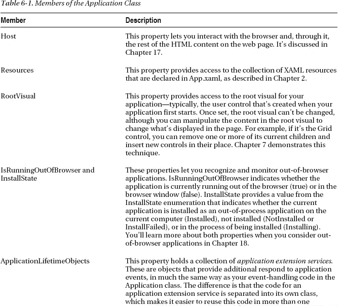

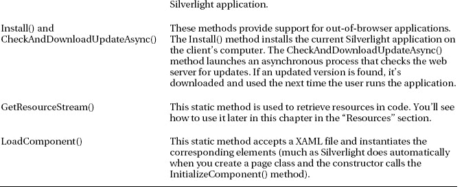

除了这些属性和方法，Application 对象还会在应用生命周期的不同阶段引发事件。接下来您将探索这些。

### 应用事件

在第 1 章中，您第一次看到了 Silverlight 应用的生命周期。这里有一个快速回顾:

1.  用户在浏览器中请求 HTML 输入页面。
2.  浏览器加载 Silverlight 插件。然后它会下载包含您的应用的 XAP 文件。
3.  Silverlight 插件从 XAP 读取 AppManifest.xml 文件，以找出应用使用的程序集。它创建 Silverlight 运行时环境，然后加载您的应用程序集(以及任何依赖的程序集)。
4.  Silverlight 插件创建自定义应用类的实例(在 App.xaml 和 App.xaml.cs 文件中定义)。
5.  application 类的默认构造函数引发 Startup 事件。
6.  您的应用处理启动事件，并为您的应用创建根可视对象。

从这一点开始，您的页面代码接管，直到遇到未处理的错误(UnhandledException)或最终结束(Exit)。这些事件——启动、UnhandledException 和退出——是应用类提供的核心事件。除了这些标准之外，Application 类还包括两个事件——InstallStateChanged 和 CheckAndDownloadUpdateCompleted——它们是为您将在第 18 章中探索的浏览器外应用而设计的。

如果你查看 App.xaml.cs 文件的内容，你会发现在 Visual Studio 中，应用构造函数包含一些预生成的代码。这段代码将一个事件处理程序附加到三个应用事件:

`public App()
{
    this.Startup += this.Application_Startup;
    this.Exit += this.Application_Exit;
    this.UnhandledException += this.Application_UnhandledException;

    InitializeComponent();
}`

与您在前面章节中考虑的页面和元素事件一样，有两种方法可以附加应用事件处理程序。您可以不使用代码，而是将事件属性添加到 XAML 标记中，如下所示:

`<Application ... x:Class="SilverlightApplication1.App"
 Startup="Application_Startup" >`

没有理由选择其中一种方法。默认情况下，Visual Studio 使用首先显示的代码方法。

在接下来的几节中，您将看到如何编写插入应用事件的代码。

#### 应用启动

默认情况下，Application_Startup 方法创建第一页并将其分配给应用。RootVisual 属性，确保它成为顶级应用元素，即应用的可视核心:

`private void Application_Startup(object sender, StartupEventArgs e)
{
    this.RootVisual = new MainPage();
}`

尽管可以通过添加或移除元素来更改根 visual，但不能在以后重新分配 root visual 属性。应用启动后，该属性基本上是只读的。

#### 初始化参数

Startup 事件传入一个 StartupEventArgs 对象，该对象包括一个额外的细节:初始化参数。该机制允许承载 Silverlight 控件的页面传入自定义信息。如果您在不同的页面上承载相同的 Silverlight 应用，或者希望 Silverlight 应用根据特定于用户或特定于会话的信息而有所不同，这将非常有用。例如，您可以根据用户是从客户页面还是从员工页面进入来定制应用的视图。或者，您可以选择根据用户当前查看的产品加载不同的信息。请记住，初始化参数来自 HTML 入口页面的标记，恶意用户可以修改它们。

 **注意**关于 HTML 和你的 Silverlight 应用之间更详细的交互——例如，在你的 Silverlight 应用运行时来回传递信息——参见[第 17 章](17.html#ch17)。

例如，假设您想要传递一个 ViewMode 参数，该参数有两个可能的值，Customer 或 Employee，如以下枚举所示:

`public enum ViewMode
{
    Customer, Employee
}`

您需要根据这些信息更改各种细节，因此将这些信息存储在整个应用中都可以访问的地方是有意义的。合理的选择是向您的自定义应用类添加一个属性，如下所示:

`private ViewMode viewMode = ViewMode.Customer;
public ViewMode ViewMode
{
    get { return viewMode; }
}`

该属性默认为 customer 视图，因此只有当 web 页面明确请求 employee 视图时才需要更改它。

要将参数传递到 Silverlight 应用中，需要在 Silverlight 内容区域的标记中添加一个<param>元素。此参数的名称必须为 initParams。它的值是一个逗号分隔的名称-值对列表，用于设置您的自定义参数。例如，要添加一个名为 viewMode 的参数，请将下面一行(以粗体显示)添加到标记中:

`

  <object data="data:application/x-silverlight,"
   type="application/x-silverlight-2" width="100%" height="100%">
    <param name="source" value="TransparentSilverlight.xap"/>
    <param name="onerror" value="onSilverlightError" />
    <param name="background" value="white" />
**    <param name="initParams" value="viewMode=Customer" />**
    ...
  </object>
  <iframe style="visibility:hidden;height:0;width:0;border:0px"></iframe>
 
`

然后，您可以从 StartupEventArgs 中检索它。InitParams 集合。但是，您必须首先检查它是否存在:

`private void Application_Startup(object sender, StartupEventArgs e)
{
    // Take the view mode setting, and store in an application property.
    if (e.InitParams.ContainsKey("viewMode"))
    {
        string view = e.InitParams["viewMode"];
        if (view == "Employee") this.viewMode = ViewMode.Employee;
    }` `    // Create the root page.
    this.RootVisual = new Page();
}`

如果有许多可能的值，可以使用下面的简单代码将字符串转换为相应的枚举值，假设文本完全匹配:

`string view = e.InitParams["viewMode"];
try
{
    this.viewMode = (ViewMode)Enum.Parse(typeof(ViewMode), view, true);
}
catch { }`

现在，不同的页面可以自由地传递不同的参数，并使用不同的视图设置启动您的应用。因为视图信息存储为自定义应用类(名为 App)中的属性，所以您可以在应用中的任何位置检索它:

`lblViewMode.Text = "Current view mode: " +
  ((App)Application.Current).ViewMode.ToString();`

[图 6-1](#fig_6_1) 显示了当您运行使用客户视图模式的测试页面时，您将会看到什么。

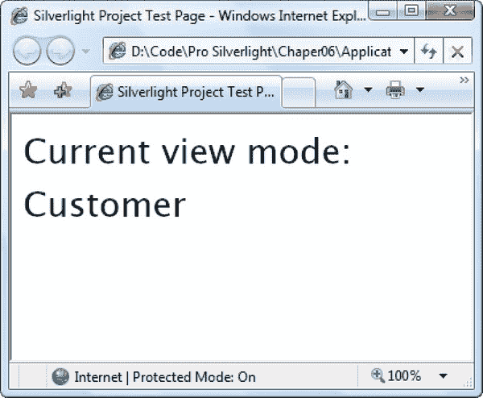

***图 6-1。**显示初始化参数*

如果有多个初始化参数，请用一个逗号分隔的字符串传递它们。初始化值应该由字母数字字符组成。目前不支持转义参数值中的特殊字符，如逗号:

`<param name="initParams" value="startPage=Page1,viewMode=Customer" />`

现在，Startup 事件的事件处理程序可以检索 StartPage 值，并使用它来选择应用的根页面。您可以使用区分可用选项的条件逻辑块来加载正确的页面，也可以编写一个更通用的解决方案，使用反射来尝试创建具有所请求名称的类，如下所示:

`UserControl startPage = null;
if (e.InitParams.ContainsKey("startPage"))
{
    string startPageName = e.InitParams["startPage"];
    try
    {
        // Create an instance of the page.
        Type type = this.GetType();
        Assembly assembly = type.Assembly;
        startPage = (UserControl)assembly.CreateInstance(
            type.Namespace + "." + startPageName);
    }
    catch
    {
        startPage = null;
    }
}
// If no parameter was supplied or the class couldn't be created, use a default.
if (startPage == null) startPage = new MenuPage();

this.RootVisual = startPage;`

#### 应用关闭

在某个时刻，你的 Silverlight 应用结束了。最常见的情况是，当用户在 web 浏览器中浏览另一个页面或关闭浏览器窗口时，会出现这种情况。如果用户刷新页面(实际上放弃应用的当前实例并启动一个新实例)，如果页面运行删除 Silverlight 内容区域或更改其源的 JavaScript 代码，或者如果未处理的异常使您的代码脱轨，也会发生这种情况。

就在应用从内存中释放之前，Silverlight 通过响应应用给你机会运行一些代码。退出事件。该事件通常用于将用户特定的信息存储在本地的独立存储中(参见[第 22 章](22.html#ch22))，以便用户下次运行应用时可以使用。

退出事件在其事件参数中不提供任何附加信息。

#### 未处理的异常

尽管在可能出现错误的情况下(例如，在读取文件、下载 web 内容或访问 web 服务时)，应该使用规范的异常处理代码，但并不总是能够预测到所有的错误来源。如果您的应用遇到未处理的错误，它将会结束，并且 Silverlight 内容区域将恢复为空白。如果您包含了对来自 Silverlight 插件的潜在错误做出反应的 JavaScript 代码，那么该代码将会运行。否则，您将不会收到任何关于刚刚发生的错误的指示。

应用。UnhandledException 事件在异常到达 Silverlight 插件并终止应用之前，为您提供了响应异常的最后机会。这段代码明显不同于您可能添加到页面中的 JavaScript 错误处理代码，因为它能够将异常标记为已处理。这样做可以有效地中和异常，防止它上升到插件并结束您的应用。

下面是一个检查异常类型并决定是否允许应用继续运行的示例:

`public void Application_UnhandledException(object sender,
  ApplicationUnhandledExceptionEventArgs e)
{
    if (e.ExceptionObject is FileNotFoundException)
    {
        // Suppress the exception and allow the application to continue.
        e.Handled = true;
    }
}`

理想情况下，像这样的异常应该在靠近它发生的地方处理，例如，在您的页面代码中，当您执行可能导致 FileNotFoundException 的任务时。应用级的错误处理并不理想，因为很难确定导致问题的原始进程，也很难通知用户哪里出错了。但是应用级的错误处理偶尔会提供一种更简单、更流畅的方式来处理某些场景——例如，当一种特定类型的异常在许多地方突然出现时。

消除错误后，通知用户是有意义的。一种选择是在根 visual 中调用自定义方法。例如，此代码调用 MainPage 类中的自定义 ReportError()方法，该类是此应用的根 visual:

`MainPage rootPage = (MainPage)this.RootVisual;
rootPage.ReportError(e.ExceptionObject);`

现在是主页。ReportError()方法可以检查异常对象，并在页面上的元素中显示适当的消息。

为了让您的应用更有弹性，Visual Studio 为每个新的 Silverlight 应用添加了一些样板错误处理代码。这段代码检查当前是否附加了调试器(这表明应用正在 Visual Studio 调试环境中运行)。如果没有调试器，代码会处理错误(使其无害)，并使用你将在第 17 章中学到的 HTML 互用性特性来引发一个 JavaScript 错误。下面是显示该过程如何工作的稍微简化的代码:

`public void Application_UnhandledException(object sender,
  ApplicationUnhandledExceptionEventArgs e)
{
    if (!System.Diagnostics.Debugger.IsAttached)
    {
        // Suppress the exception and allow the application to continue.
        e.Handled = true;

        try
        {
            // Build an error message.
            string errorMsg = e.ExceptionObject.Message +` `              e.ExceptionObject.StackTrace;
            errorMsg = errorMsg.Replace('"', '\'').Replace("\r\n", @"\n");

            // Use the Window.Eval() method to run a line of JavaScript code that
            // will raise an error with the error message.
            System.Windows.Browser.HtmlPage.Window.Eval(
              "throw new Error(\"Unhandled Error in Silverlight 2 Application " +
               errorMsg + "\");");
        }
        catch {}
    }
}`

本质上，这段代码将致命的 Silverlight 错误转换成相对无害的 JavaScript 错误。处理 JavaScript 错误的方式取决于浏览器。在 Internet Explorer 中，状态栏中会出现一个黄色警告图标。(双击警告图标可获得完整的错误详情，如图[图 6-2](#fig_6_2) 所示。)在 Firefox 中，会出现一条脚本错误消息。无论哪种方式，错误都不会阻止应用继续运行。

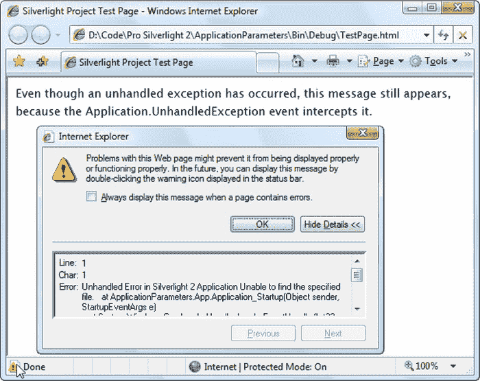

***图 6-2。**表示未处理的 Silverlight 异常的 JavaScript 错误*

当您开发完应用后，您需要调整自动生成的错误处理代码。这是因为不加选择地忽略所有的错误是不可接受的——这样做会让错误泛滥，并导致其他可用性问题或数据错误。相反，考虑选择性地忽略对应于已知错误条件的错误，并向用户发出问题信号。

 **注意**人们很容易忘记需要调整应用。UnhandledException 事件处理程序，因为它只有在没有调试器的情况下运行 Silverlight 应用时才会生效。当您在 Visual Studio 中测试应用时，您不会看到这种行为，相反，任何未处理的异常都会立即结束应用。

### 自定义闪屏

如果 Silverlight 应用很小，它会快速下载并出现在浏览器中。如果 Silverlight 应用很大，下载可能需要几秒钟。只要您的应用下载时间超过 500 毫秒，Silverlight 就会显示一个动画闪屏。

内置的闪屏并不太令人兴奋——它显示了一圈闪烁的圆圈和应用目前已下载的百分比(见[图 6-3](#fig_6_3) )。

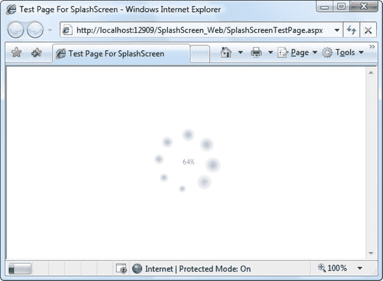

***图 6-3。**内置 Silverlight 闪屏*

如果你不喜欢股票启动画面，你可以很容易地创建自己的(见[图 6-4](#fig_6_4) )。本质上，自定义闪屏是一个 XAML 文件，其中包含您想要显示的图形内容和一些 JavaScript 代码，这些代码在应用被下载时更新闪屏。此时不能使用 C#代码，因为 Silverlight 编程环境还没有初始化。然而，这并不是一个大的挫折，因为你需要的代码相对简单。它存在于一个或两个事件处理函数中，分别在内容下载时和下载完成后被触发。因为 JavaScript 在语法上类似于 C#，所以在编写所需的代码时不会有太大的困难。

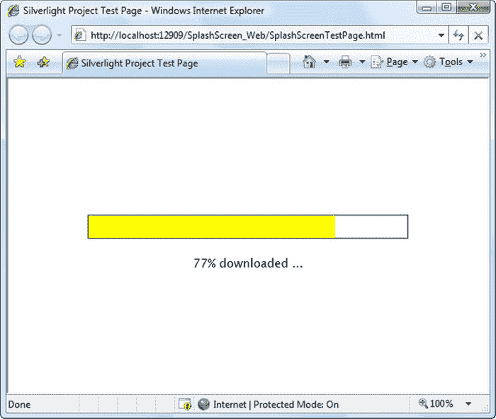

***图 6-4。**自定义闪屏*

闪屏的 XAML 文件不能是 Silverlight XAP 文件的一部分。这是因为在下载 XAP 文件的过程中需要显示启动画面。因此，闪屏 XAML 必须是一个单独的文件，与 XAP 文件放在同一个 web 位置。

 **注意**测试一个定制的闪屏需要一些工作。通常，在测试过程中你看不到闪屏，因为应用发送到浏览器的速度太快了。为了让你的应用减速到足以看到闪屏，你需要首先确保你使用的是一个 ASP.NET 测试网站，它确保你的 Silverlight 应用由 Visual Studio 测试 web 服务器托管(如[第 1 章](01.html#ch1)所述)。然后，您需要向您的 Silverlight 项目添加多个大型资源文件——比如说一些 MP3 文件——并将每个文件的构建动作设置为 resource，以便将其添加到 XAP 文件中。另一个技巧是临时删除 Application_Startup()方法中为应用设置根视图的代码行。这样，在你的应用被完全下载后，它不会显示任何东西。相反，闪屏将保持可见，显示 100%的进度百分比。

为了创建如图 6-4 所示的例子，首先创建一个新的 Silverlight 项目和一个 ASP.NET 测试网站，如[第一章](01.html#ch1)所述。然后，在你的 ASP.NET 网站上添加一个新的 XAML 文件(不是 Silverlight 项目)。为此，在解决方案浏览器中选择 ASP.NET 网站，并选择网站添加新项目。选择 Silverlight 组，然后选择 Silverlight JScript 页面模板。然后输入名称并点按“添加”。这个 XAML 文件将为你的闪屏保存标记。

添加新的 XAML 文件时，Visual Studio 会创建一个定义画布的基本 XAML 框架。这是因为 Visual Studio 假设您正在构建 Silverlight 1.0 应用，该应用支持的元素要少得多，并且不包含任何更高级的布局容器。但是您可以使用任何核心 Silverlight 元素，即内置程序集中的元素，不需要单独下载。不能使用在附加 System.Windows.Controls.dll 程序集中定义的元素，也不能使用需要在 XAP 中打包并由客户端下载的任何其他程序集中定义的元素。

 **提示**构建简单闪屏的最简单方法是在 Silverlight 项目中创建它，然后将标记复制到网站上的闪屏文件中。这样，您可以利用 Visual Studio 设计图面和 XAML 智能感知，如果您直接在您的 ASP.NET 网站中编写标记，则这些功能将不可用。

这是如图 6-4 所示的启动画面的 XAML。它包括一个带有 TextBlock 和两个 Rectangle 元素的网格。(矩形是一种形状绘制元素，你将在第 8 章中了解到。)第一个矩形绘制进度条的背景，第二个绘制前景。这两个矩形对象一起放置在一个单单元格网格中，这样一个矩形叠加在另一个矩形上:

`<Grid
 xmlns:x="http://schemas.microsoft.com/winfx/2006/xaml">
  <StackPanel VerticalAlignment="Center">
    <Grid>
      <Rectangle x:Name="progressBarBackground" Fill="White" Stroke="Black"
       StrokeThickness="1" Height="30" Width="200"></Rectangle>
      <Rectangle x:Name="progressBar" Fill="Yellow" Height="28" Width="0">
      </Rectangle>
    </Grid>
    <TextBlock x:Name="progressText" HorizontalAlignment="Center"
     Text="0% downloaded ..."></TextBlock>
  </StackPanel>
</Grid>`

接下来，您需要在 HTML 入口页面或 ASP.NET 测试页面中添加一个 JavaScript 函数。(如果您计划两者都使用，请将 JavaScript 函数放在一个单独的文件中，然后使用脚本块的 source 属性在两个文件中链接到它。)JavaScript 代码可以使用 sender.findName()方法在页面上查找命名元素，并操纵它们的属性。它还可以使用 eventArgs.progress 属性确定当前进度。在此示例中，事件处理代码根据当前进度百分比更新文本并加宽进度栏:

``

 **注意**包含在可下载代码中的闪屏示例使用了一种稍微高级一点的技术，它利用了一个转换，这个概念你将在[第 8 章](08.html#ch8)中探讨。这种方法允许您创建进度条效果，而无需硬编码最大宽度，因此进度条的大小适合当前浏览器窗口。

要使用这个闪屏，您需要添加 splashscreensource 参数来标识您的 XAML 闪屏，并添加 onsourcedownloadprogresschanged 参数来连接您的 JavaScript 事件处理程序。如果您想在下载完成时做出反应，可以使用 onsourcedownloadcomplete 参数连接一个不同的 JavaScript 事件处理程序:

`<object data="data:application/x-silverlight," type="application/x-silverlight-2"
 width="100%" height="100%">
  <param name="source" value="ClientBin/SplashScreen.xap"/>
  <param name="onerror" value="onSilverlightError" />
  <param name="background" value="white" />
  <**param** **name****="splashscreensource"** **value****="SplashScreen.xaml" />**
  <**param** **name****="onsourcedownloadprogresschanged"**
   **value****="onSourceDownloadProgressChanged" />**
  ...
</object>`

专业设计师可以精心制作闪屏。这一传统在 Flash 应用中由来已久。要体验什么是可能的，请访问`[www.smashingmagazine.com/2008/03/13/showcase-of-creative-flash-preloaders](http://www.smashingmagazine.com/2008/03/13/showcase-of-creative-flash-preloaders)`。你可以用一个普通的 Silverlight 闪屏复制这些效果，就像这里描述的。然而，有些是极其困难的。在你下载了你的应用之后，大部分会更容易实现*,比如代码繁重的动画。*

如果你想更灵活地创建一个引人注目的闪屏，你需要使用一种完全不同的技术。让你的应用尽可能小。将其功能移至类库程序集，并将大型资源(如图形和视频)放在单独的文件或单独的类库程序集中。既然你的应用已经被剥离成一个空壳，它可以被快速下载。下载完成后，您的应用可以展示其精美的预加载程序并开始真正的工作——以编程方式下载运行所需的资源和程序集。

以这种方式设计应用需要更多的工作，但是您将在下面几节中获得执行动态下载所需的所有信息。请特别注意本章后面的“按需下载程序集”一节。

### 二元资源

正如您在第 1 章中了解到的，Silverlight 应用实际上是一个使用 ZIP 压缩归档并存储为单个文件的文件包，扩展名为. xap。在一个简单的应用中，XAP 文件只不过是一个清单(列出您的项目使用的文件)和您的应用程序集。但是您可以在 XAP 文件中放置其他内容:*资源*。

XAP 资源是一个独特的文件，您希望它对已编译的应用可用。常见的例子包括图形资产，即您希望在用户界面中显示的图像、声音和视频文件。

使用资源可能会变得不必要的复杂，因为 Silverlight 为存储资源提供了大量不同的选项。以下是对你的选择的快速总结:

*   *在应用汇编*中:资源文件被嵌入到为你的项目编译的 DLL 文件中，比如 SilverlightApplication1.dll。这是默认方法。
*   *在应用包*中:资源文件放在 XAP 文件中，和你的应用集放在一起。它同样易于部署，但现在更易于管理，因为您通过编辑 XAP 文件来替换或修改您的资产，而无需编译您的应用。
*   *在源站点上*:资源文件被放在网站上你的 XAP 文件旁边。现在您有了更多的部署难题，因为您需要确保部署 XAP 文件和资源文件。但是，您获得了以其他方式使用资源的能力，例如，您可以在普通的 HTML 网页中使用图像，或者使视频易于下载。您可以减小初始 XAP 下载的大小，如果资源很大，这一点很重要。

这些不是你所有的选择。正如您将在本章后面的“类库程序集”一节中看到的，您也可以将资源放在应用使用的其他程序集中。(这种方法为您提供了更高级的选项来控制您在不同 Silverlight 应用之间共享内容的方式。)但是在讨论这个话题之前，有必要仔细看看前面概述的更常见的选项。在接下来的部分中，您将探索每种方法。

 **注意**二进制资源不要和你在[第二章](02.html#ch2)中探索的 XAML 资源混淆。XAML 资源是在标记中声明的对象。二进制资源是在编译项目时插入到程序集或 XAP 文件中的不可执行文件。

#### 将资源放置在应用集合中

这是标准的方法，类似于其他类型的。NET 应用(如 WPF 应用)。例如，如果您想在 Silverlight 的 image 元素中显示一个图像，首先将图像文件添加到项目中。默认情况下，Visual Studio 给予图像文件资源构建动作，如图[图 6-5](#fig_6_5) 所示。(若要更改现有文件的生成操作，请在解决方案资源管理器中选择该文件，并在“属性”窗格的“生成操作”框中进行新的选择。)

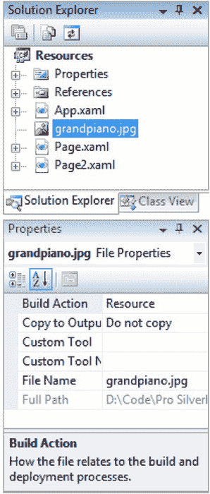

***图 6-5。**一个应用资源*

 **注意**不要混淆资源的构建动作和嵌入资源。尽管两者都做同样的事情(将资源作为二进制数据块嵌入程序集中)，但是 Silverlight 不支持嵌入式资源方法，并且您不能使用 URIs 引用以这种方式存储的文件。

现在，当你编译你的应用时，资源将被嵌入到项目集合中，并且项目集合将被放置在 XAP 文件中。

 **注意**尽管资源选项使得用户很难从你的应用中提取资源文件，但这仍然是可能的。要检索一个资源，用户需要下载 XAP 文件，解压缩它，并反编译 DLL 文件。像 Reflector ( `[http://reflector.red-gate.com](http://reflector.red-gate.com)`)这样的工具提供了可以从程序集中提取和保存嵌入资源的插件。

由于 Silverlight 使用 URIs 的方式，使用嵌入式资源很容易。如果对 Image(对于图形)或 MediaElement(对于声音和视频文件)使用相对 URI，Silverlight 会检查程序集是否有名称正确的资源。这意味着这就是你使用[图 6-5](#fig_6_5) 中所示资源所需的全部内容:

`<Image **Source**=**"grandpiano.jpg">**</Image>`

##### 使用子文件夹

可以使用文件夹对项目中的资源文件进行分组。这将改变资源的命名方式。例如，考虑图 6-6 中的[，它将 grandpiano.jpg 文件放在一个名为 Images 的子文件夹中。](#fig_6_6)

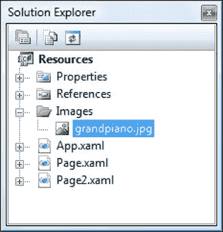

***图 6-6。**子文件夹中的资源*

现在，你需要使用这个 URI:

`<Image Source="img/grandpiano.jpg"></Image>`

##### 以编程方式检索资源

如果有一个支持 Silverlight URI 标准的元素，比如 Image 或 MediaElement，那么使用资源就很容易。但是，在某些情况下，在将资源交给元素之前，您需要在代码中操作资源，或者您可能根本不想使用元素。例如，您可能将一些静态数据存储在作为资源的文本或二进制文件中。在您的代码中，您希望检索该文件并处理其数据。

要执行这项任务，您需要应用的帮助。GetResourceStream()方法。它允许您检索特定资源的数据，您可以通过提供正确的 URI 来指定该资源。诀窍是你需要使用下面的 URI 格式:

`*AssemblyName*;component/*ResourceFileName*`

例如，如果在名为 SilverlightApplication1 的项目中有一个名为 ProductList.bin 的资源，您可以使用下面这行代码:

`StreamResourceInfo sri = Application.GetResourceStream(
  new Uri("SilverlightApplication1;component/ProductList.bin", UriKind.Relative));`

GetResourceStream()方法不检索流。相反，它得到了一个系统。windows . resources . streamresourceinfo 对象，它包装了一个流属性(带有基础流)和一个 ContentType 属性(带有 MIME 类型)。下面是为流创建 BinaryReader 对象的代码:

`BinaryReader reader = new BinaryReader(sri.Stream);`

现在，您可以使用二进制阅读器的方法从文件中取出每一段数据。相同的方法适用于 StreamReader(用于基于文本的数据)和 XmlReader(用于 XML 数据)。但是当涉及 XML 数据时，您有一个稍微简单的选择，因为 XmlReader。Create()方法接受指向资源的流或 URI 字符串。因此，如果您有一个名为 ProductList.xml 的资源，下面的代码会起作用:

`StreamResourceInfo sri = Application.GetResourceStream(
  new Uri("SilverlightApplication1;component/ProductList.xml", UriKind.Relative));
XmlReader reader = XmlReader.Create(sri.Stream, new XmlReaderSettings());`

这种更简化的方法也是如此:

`XmlReader reader = XmlReader.Create("ProductList.xml")`

#### 将资源放入应用包

资源存储的第二个选择是将其放在存储应用程序集的 XAP 文件中。为此，您需要将适当的文件添加到项目中，并将构建操作更改为内容。最重要的是，你可以使用几乎相同的网址。只需在它们前面加一个正斜杠，如下所示:

`<Image Source="/grandpiano.jpg"></Image>`

同样，XAP 的子文件夹中有一个资源:

`<Image Sourceimg/grandpiano.jpg"></Image>`

前导斜杠代表 XAP 文件的根。

如果加上扩展名。压缩到您的 XAP 文件，您可以打开它并验证资源文件是否存储在里面，如图[图 6-7](#fig_6_7) 所示。

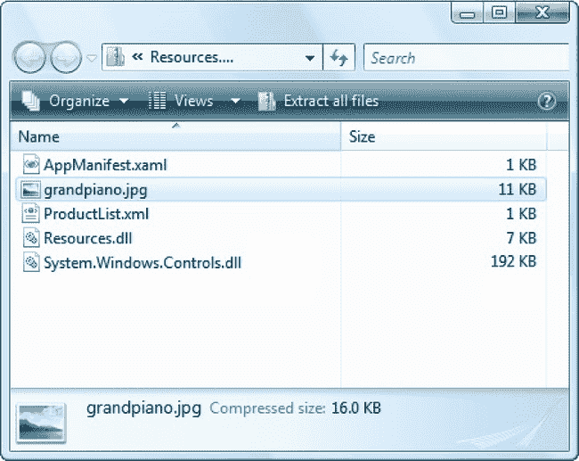

***图 6-7。**XAP 文件中的资源*

将资源放在 XAP 文件中与将它们嵌入程序集中一样容易部署。然而，它增加了一点灵活性。如果您愿意多做一点工作，可以在不重新编译应用的情况下操作 XAP 文件中的文件(例如，更新图形)。此外，如果在同一个 XAP 文件中有几个类库程序集，它们都可以使用 XAP 中相同的资源文件。(这种安排不太可能，但却是可能的。)总的来说，将资源放在应用包中类似于将它们嵌入程序集中。

#### 将资源放在网络上

第三种选择是从应用中移除资源文件，但让它们在 Web 上可用。这样，您的应用可以在需要时下载它们。由于 Silverlight 的 URI 支持，您通常可以使用这种场景，而无需编写任何额外的代码来处理下载过程。

在 web 上部署资源时，最简单的选择是将它们放在与 Silverlight 程序集相同的 Web 位置。如果您使用的是 ASP.NET 测试网站，您可以轻松地将资源文件添加到测试网站——只需将它放在 XAP 文件所在的 ClientBin 文件夹中。如果您使用 HTML 测试页，最简单的方法是告诉 Visual Studio 将您的资源文件复制到构建位置。为此，首先将资源文件添加到 Silverlight 项目中。然后，选择资源文件并为构建操作选择 None，这样它就不会被编译到 XAP 中。最后，将复制到输出目录设置设置为总是复制。

使用 web 资源时，您使用的 URIs 与在应用包中放置资源时相同。这些是相对的 URIs，前面有一个正斜杠。这里有一个例子:

`<Image Source="/grandpiano.jpg"></Image>`

Silverlight 首先检查 XAP 文件，然后检查 XAP 文件所在的文件夹。因此，在编译完应用后，您可以在 XAP 文件方法和网站方法之间自由切换——您只需要添加或删除 XAP 文件中的资源文件。

Web 部署的资源不需要与 XAP 文件位于同一个站点，尽管这是最常见的方法。如果使用绝对 URL，您可以从任何位置显示图像:

`<Image Source="http://www.mysite.cimg/grandpiano.jpg"></Image>`

 **注意**当你测试一个使用带有绝对 URL 的图片的应用时，一个小故障可能会悄悄出现。问题是 Image 元素不能执行跨方案访问，这意味着如果您使用简单的 HTML 测试页面直接从硬盘上运行 Silverlight，您就不能从 Web 上检索图像。要解决这个问题，请在您的项目中添加一个 ASP.NET 测试网站，如第 1 章中的[所述。](01.html#ch1)

在您的应用中，Web 部署的资源以非常不同的方式处理。因为它们不在 XAP 文件中(直接或间接地，作为程序集的一部分)，所以它们没有被压缩。如果您有一个大的、容易压缩的文件(比如 XML 数据)，这意味着 web 部署的选项会导致更长的下载时间，至少对某些用户来说是这样。更重要的是，当您的应用引用 web 部署的资源时，它们是按需下载的。因此，如果您有大量的大型资源，web 部署通常要好得多——它用启动时的长延迟来换取访问单个资源时的许多小延迟。

 **注意**所有这些资源存储方法的明显缺点是它们需要固定不变的数据。换句话说，应用无法修改资源文件，然后将修改后的版本保存在程序集、XAP 文件或网站中。(理论上，最后一种选择——网站上传——是可行的，但它会造成一个明显的安全漏洞。)当您需要更改数据时，最佳解决方案是使用独立存储(如果在本地存储更改的数据是一个足够好的解决方案)或 web 服务(如果您需要一种向服务器提交更改的方法)。这些方法分别在第 22 章的[和第 19 章](22.html#ch22)的[中讨论。](19.html#ch19)

##### 无法下载资源

当您使用 web 部署的资源时，您引入了这样的可能性:您的资源不在您期望的位置，并且您将无法成功下载它们。使用 URI 系统的元素通常会在下载无法完成时提供事件通知，例如 Image 的 ImageFailed 和 MediaElement 的 MediaFailed。

下载资源失败不被认为是严重错误。例如，如果图像元素找不到正确的图片，它只是保持空白。但是您可以对相应的失败事件做出反应来更新您的用户界面。

##### 使用网络客户端下载资源

你不能使用这个便利的应用访问网络部署的资源。GetResourceStream()方法。因此，如果您想要使用来自 web 部署的资源的数据，并且您没有使用 Silverlight URIs 的元素，您将需要做更多的工作。

在这种情况下，你需要使用系统。Net.WebClient 类来下载资源。WebClient 类提供了三个关键方法。OpenReadAsync()是最有用的——它以二进制数据的 blob 形式下载文件，然后以流的形式公开。相比之下，DownloadStringAsync()将内容下载到单个字符串中。最后，CancelAsync()停止任何当前正在进行的下载。

WebClient 异步完成它的工作。您可以在下载过程中响应 DownloadProgressChanged 事件，以了解到目前为止已经检索了多少字节。下载完成后，您可以响应 OpenReadCompleted 或 DownloadStringCompleted 事件，这取决于您使用的操作，然后检索您的内容。

WebClient 有以下重要限制:

*   *它不支持从文件系统下载*:要使用 WebClient 类，您必须通过 web 服务器运行您的应用。在 Visual Studio 中最简单的方法是让 Visual Studio 创建一个 ASP.NET 网站，然后由集成的 web 服务器托管(如[第 1 章](01.html#ch1)所述)。如果您直接从文件系统打开 Silverlight 页面，当您尝试在 WebClient 中使用下载方法时，会出现异常。
*   *它不支持相对 URIs* :为了获得正确的 URI，你可以确定当前页面的 URI，然后添加指向你的资源的相对 URI。
*   *它一次只允许一个下载*:如果你试图在第一个请求正在进行的时候开始第二个请求，你会收到一个 NotSupportedException。

 **注意**还有一个问题:Silverlight 的安全模型。如果您计划使用 WebClient 从另一个 web 服务器(不是承载您的应用的 web 服务器)下载文件，请确保 web 服务器明确允许跨域调用。[第 19 章](19.html#ch19)详细讨论了这个问题。

这里有一个把这些碎片放在一起的例子。它从 ProductList.bin 文件中读取二进制数据，正如您前面看到的那样。但是，在此示例中，ProductList.bin 托管在网站上，不是 XAP 文件或项目程序集的一部分。(当您使用 ASP.NET 网站测试此示例时，您需要将 ProductList.bin 文件添加到 ASP.NET 网站，而不是 Silverlight 项目。要查看正确的设置，请参考本章的可下载示例。)

当点击一个按钮时，下载过程开始。请注意，字符串处理是在 URI 中进行的。要获得正确的路径，需要使用入口页的当前地址创建一个完全限定的 URI，该地址可以从当前应用对象的 Host 属性中检索:

`private void cmdRetrieveResource_Click(object sender, RoutedEventArgs e)
{
    // Construct the fully qualified URI.
    // Assume the file is in the website root, one level above the ClientBin
    // folder. (In other words, the file has been added to the root level` `    // of the ASP.NET website.)
    string uri = Application.Current.Host.Source.AbsoluteUri;
    int index = uri.IndexOf("/ClientBin");
    uri = uri.Substring(0, index) + "/ProductList.bin";

    // Begin the download.
    WebClient webClient = new WebClient();
    webClient.OpenReadCompleted += webClient_OpenReadCompleted;
    webClient.OpenReadAsync(new Uri(uri));
}`

现在，您可以在文件完成时做出响应，并将下载的数据作为流进行操作:

`private void webClient_OpenReadCompleted (object sender,
  OpenReadCompletedEventArgs e)
{
    if (e.Error != null)
    {
        // (Add code to display error or degrade gracefully.)
    }
    else
    {
        Stream stream = e.Result;
        BinaryReader reader = new BinaryReader(stream);
        // (Now process the contents of the resource.)
        reader.Close();
    }
}`

为了简单起见，这段代码会在您每次单击按钮时检索资源。但是更有效的方法是将检索到的数据存储在内存中，这样就不需要下载多次。

OpenReadCompletedEventArgs 提供了几条信息以及 Result 属性。若要确定是否使用 CancelAsync()方法取消了操作，可以检查 canceled 属性，如果出现错误，可以从 error 属性获取 exception 对象。(在这种情况下，尝试读取 OpenReadCompletedEventArgs 对象的其他属性将导致 TargetInvocationException。)还可以使用 OpenReadAsync()方法的重载版本，该方法接受自定义对象，然后可以从 UserState 属性中检索该对象。然而，这是有限的用途，因为 WebClient 一次只允许一个下载。

当你下载一个大文件时，显示一个进度指示器来通知用户发生了什么通常是值得的。为此，请将事件处理程序附加到 DownloadProgressChanged 事件:

`webClient.DownloadProgressChanged += webClient_DownloadProgressChanged;`

下面是计算已下载百分比的代码，并使用它来设置进度条和文本标签的值:

`private void webClient_DownloadProgressChanged(object sender,
  DownloadProgressChangedEventArgs e)
{
    lblProgress.Text = e.ProgressPercentage.ToString() + " % downloaded.";` `    progressBar.Value = e.ProgressPercentage
}`

### 类库程序集

到目前为止，您在本书中看到的示例已经将它们的所有代码放在了一个程序集中。对于小型或中等规模的 Silverlight 应用，这种简单的设计很有意义。但是不难想象，您可能希望将某些功能提取出来，放在一个单独的类库程序集中。通常，您会采取这一步骤，因为您希望在多个 Silverlight 应用中重用该功能。或者，您可能希望将其分解，以便可以单独编码、编译、调试和修订，如果代码是由不同的开发团队创建的，这一点尤其重要。

创建 Silverlight 类库很容易。这与您在普通的。NET 应用。首先，使用 Silverlight 类库项目模板在 Visual Studio 中创建新项目。然后，在 Silverlight 应用中添加指向该项目或程序集的引用。生成应用时，依赖程序集将被复制到 XAP 包中。

#### 在程序集中使用资源

类库为您提供了一种在应用间共享资源的便捷方式。您可以将资源嵌入到类库中，然后在应用中检索它。这项技术很简单——唯一的技巧是构建正确的 URIs。要从库中提取资源，您需要使用包含应用的 URI，格式如下:

`/*ClassLibraryName*;component/*ResourceFileName*`

这与您之前在“以编程方式检索资源”一节中学到的格式相同，但是增加了一点:现在，URI 以前导斜杠开始，它代表 XAP 文件的根。此 URI 指向该文件中的依赖程序集，然后指示该程序集中的资源。

例如，考虑图 6-8 中[的 ResourceClassLibrary 程序集。它包含一个名为 happyface.jpg 的资源，该文件有一个 resource 的构建操作。](#fig_6_8)

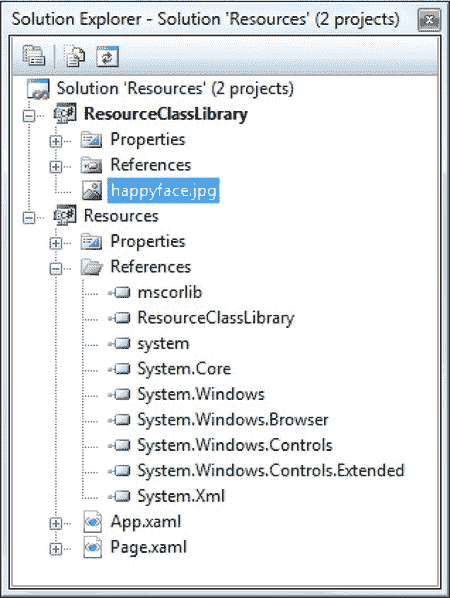

***图 6-8。**类库中的一个资源*

下面是一个使用类库资源的图像文件:

`<Image Source="/ResourceClassLibrary;component/happyface.jpg"></Image>`

#### 按需下载程序集

在某些情况下，对于某些用户来说，类库中的代码很少使用，或者根本不使用。如果类库包含大量的代码或者(更有可能)包含大量的嵌入式资源，比如图形，那么将它包含在应用中会增加 XAP 文件的大小，并且不必要地延长下载时间。在这种情况下，您可能希望创建一个单独的组件程序集，直到您需要它时才下载。这种情况类似于按需资源下载。您将单独的资源放在 XAP 文件之外但在同一网站上的单独文件中。

在使用程序集下载之前，需要确保依赖程序集没有放在 XAP 文件中。为此，请选择指向该程序集的项目引用。在“属性”窗口中，将 Copy Local 设置为 false。接下来，确保将程序集复制到与您的网站相同的位置。如果您使用的是 ASP.NET 测试网站，这意味着您必须将程序集添加到测试网站的 ClientBin 文件夹中。(您不能用简单的 HTML 测试页面来尝试这个示例，因为当您从文件系统运行 Silverlight 应用时，WebClient 不工作。)

要实现按需下载程序集，您需要结合使用前面看到的 WebClient 类和 AssemblyPart 类。WebClient 检索该程序集，并且 AssemblyPart 使其可供下载:

`string uri = Application.Current.Host.Source.AbsoluteUri;
int index = uri.IndexOf("/ClientBin");
// In this example, the URI includes the /ClientBin portion, because we've
// decided to place the DLL in the ClientBin folder.
uri = uri.Substring(0, index) + "/ClientBin/ResourceClassLibrary.dll";

// Begin the download.
WebClient webClient = new WebClient ();
webClient.OpenReadCompleted += webClient_OpenReadCompleted;
webClient.OpenReadAsync(new Uri(uri));`

当程序集被下载时，您使用 AssemblyPart。Load()方法将其加载到当前应用域中:

`private void webClient_OpenReadCompleted (object sender,
  OpenReadCompletedEventArgs e)
{
    if (e.Error != null)
    {
        // (Add code to display error or degrade gracefully.)
    }
    else
    {
        AssemblyPart assemblypart = new AssemblyPart();
        assemblypart.Load(e.Result);
    }
}`

执行完这一步后，可以从程序集中检索资源，并从中实例化类型。就好像你的程序集从一开始就是 XAP 文件的一部分。您可以尝试用本章的示例代码来演示这种技术。

再次强调，跟踪是否已经下载了一个程序集是很重要的，这样你就不会试图多次下载它。一些应用菊花链程序集:一个应用按需下载其他依赖程序集，这些程序集在*需要它们的时候*下载额外的程序集。

提示如果你试图使用一个没有下载的程序集，你会收到一个异常。但是该异常不会引发给试图使用该程序集的代码。相反，该代码将被中止，异常将传递给应用的事件处理程序。UnhandledException 事件。该异常是一个 FileNotFoundException 对象，并且该消息包含缺少的程序集的名称。

#### 支持汇编缓存

正如您在[第 1 章](01.html#ch1)中了解到的，程序集缓存是一个允许 Silverlight 下载类库程序集并将它们存储在浏览器缓存中的特性。这样，每次启动应用时就不需要下载这些程序集。

 **注意**一个常见的误解是，程序集缓存取代了上一节描述的按需程序集加载技术。然而，这两种方法具有不同的效果。程序集缓存减少了重复访问同一应用的启动时间(或者在运行共享某些相同功能的应用时)。按需程序集加载减少了每次访问的启动时间，不管浏览器缓存中有什么，也不管应用以前是否被使用过。对于您的应用肯定会使用的大型、频繁使用的程序集，程序集缓存特别有用。按需程序集加载对于大型的、不常使用的程序集特别有用，因为您的应用可能不需要下载*或*。

默认情况下，您生成的程序集不支持程序集缓存。但是，您可以通过满足两个要求来添加这种支持。首先，您的程序集必须有一个强名称。其次，您的程序集需要一个特殊类型的 XML 文件来描述它的内容，称为 *.extmap.xml* 文件。下面几节将带您了解这两个要求，您可以参考本章的可下载代码，了解如何使用自定义程序集进行程序集缓存。

##### 强密钥名

为了支持程序集缓存，您的类库程序集需要一个强名称，这将在浏览器缓存中唯一标识它并防止命名冲突。若要为程序集创建强密钥，请按照下列步骤操作:

1.  双击解决方案资源管理器中的属性项。
2.  单击签名选项卡。
3.  选择“对程序集签名”选项。
4.  在“选择强密钥名”列表中，选择<new...>以显示“创建强名称密钥”对话框。</new...>
5.  要完成密钥的创建，您需要提供一个文件名(如 MyKey.snk)和一个可选的密码。
6.  单击确定。Visual Studio 将创建新的密钥文件并将其添加到您的类库项目中。

这将创建一个强密钥文件，并将其用于您的程序集。从现在开始，每次编译项目时，Visual Studio 都使用强密钥对最终程序集进行签名。

在继续下一步之前，您需要知道用于对程序集签名的密钥对的公钥标记。不幸的是，Visual Studio 没有提供获取这些信息的简单方法(至少在没有某种插件的情况下是这样)。相反，你需要求助于 sn.exe命令行工具。首先，选择微软 Visual Studio 2010Visual Studio 工具 Visual Studio 命令提示符。加载 Visual Studio 命令提示符后，切换到保存密钥文件的目录。然后，运行以下两个命令(用您的密钥名称替换 MyKey.snk):

`sn –p MyKey.snk MyKey.bin
sn –t MyKey.bin`

当您完成第二个命令时，您将看到如下消息:

`Microsoft (R) .NET Framework Strong Name Utility  Version 3.5.30729.1
Copyright (c) Microsoft Corporation.  All rights reserved.

Public key token is **e6a351dca87c1032**`

粗体部分是下一步所需的信息:为您的程序集创建一个 *.extmap.xml* 文件。

##### . extmap.xml 文件

. extmap.xml 文件是一个保存 xml 内容的普通文本文件。它的命名是为了匹配您的程序集。例如，如果您有一个名为 CacheableAssembly.extmap.xml 的类库程序集，您需要创建一个名为 CacheableAssembly.extmap.xml 的文件。该文件的存在告诉 Silverlight 您的程序集支持程序集缓存。

为了方便起见，可以将. extmap.xml 文件添加到类库项目中。在解决方案资源管理器中选择它，并将“生成操作”设置为“无”，并将“复制到输出目录”设置为“总是复制”这确保了在编译该文件时，它将与程序集文件放在同一目录中。[图 6-9](#fig_6_9) 显示了带有适当. extmap.xml 文件的类库。

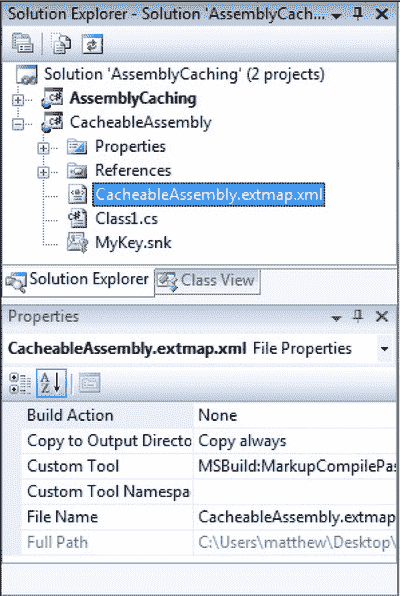

***图 6-9。**CacheableAssembly.dll*的. extmap.xml 文件

创建. extmap.xml 文件最简单的方法是获取一个样本(如下所示)，并针对您的程序集修改它。在下面的清单中，需要更改的细节以粗体显示:

`<?xml version="1.0"?>
<manifest xmlns:xsi="http://www.w3.org/2001/XMLSchema-instance"    
          xmlns:xsd="http://www.w3.org/2001/XMLSchema">
  <assembly>
    <name>**CacheableAssembly**</name>
    <version>**1.0.0.0**</version>
    <publickeytoken>**e6a351dca87c1032**</publickeytoken>
    <relpath>**CacheableAssembly.dll**</relpath>
    <extension downloadUri="**CacheableAssembly.zip**" />
  </assembly>
</manifest>`

名称和版本细节是显而易见的，它们应该与您的程序集相匹配。公钥标记是用于对程序集签名的强密钥的标识指纹，您在上一节中使用 sn.exe 工具收集了它。相对路径(relpath)是程序集的确切文件名。最后，downloadUri 属性提供了最重要的信息—它告诉应用在哪里可以找到打包的、可下载的程序集。

设置 downloadUri 有两个选项。最简单的方法是上一个例子中使用的方法——简单地提供一个文件名。当您在应用中打开程序集缓存时，Visual Studio 将获取您的类库程序集(在本例中为 CacheableAssembly.dll)，对其进行压缩，并将压缩文件(在本例中为 CacheableAssembly.zip)与编译后的 XAP 文件放在一起。正如你在第一章中看到的，这是 Silverlight 的附加组件使用的方法。

 **注意**虽然 Visual Studio 使用 zip 压缩来压缩您的程序集，但是没有必要使用以扩展名. ZIP 结尾的文件名。如果您的 web 服务器需要不同的扩展名，请随意将它用于 downloadUri。如果您对多个程序集使用相同的 downloadUri 文件名，Visual Studio 会将所有程序集压缩到一个 ZIP 文件中。

您的另一个选择是对 downloadUri 使用绝对 URI:

`<extension
 downloadUri="http://www.mysite.com/assemblies/v1.0/CacheableAssembly.zip" />`

在这种情况下，Visual Studio 不会在您编译应用时打包程序集。相反，它希望您已经将程序集放在了指定的 web 位置。这为您提供了一种在多个应用之间共享库的强大方法。但是，下载位置必须与 Silverlight 应用在同一个域中，或者它必须明确允许跨域访问，如第 19 章中所述。

有了前面显示的. extmap.xml 文件，您就可以使用程序集缓存了。要尝试它，请创建一个使用您的类库的应用。通过打开项目属性并选择“使用应用库缓存减小 XAP 大小”选项，为您的应用打开程序集缓存。最后，构建您的应用。如果你检查你的调试文件夹的内容，你会发现你的汇编的压缩文件(如图 6-10 所示)。

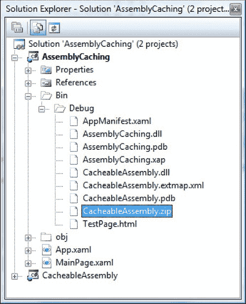

***图 6-10。**压缩后的程序集，准备缓存*

### 最后一句话

在本章中，您详细探索了 Silverlight 应用模型。您重新检查了应用对象及其触发的事件。您了解了如何从不同的 web 页面传递初始化参数，以及如何在下载应用时显示定制的闪屏。最后，您探索了 Silverlight 使用的资源系统，并考虑了部署资源和类库的许多选项，从将它们放在程序集旁边到仅在需要时下载它们。