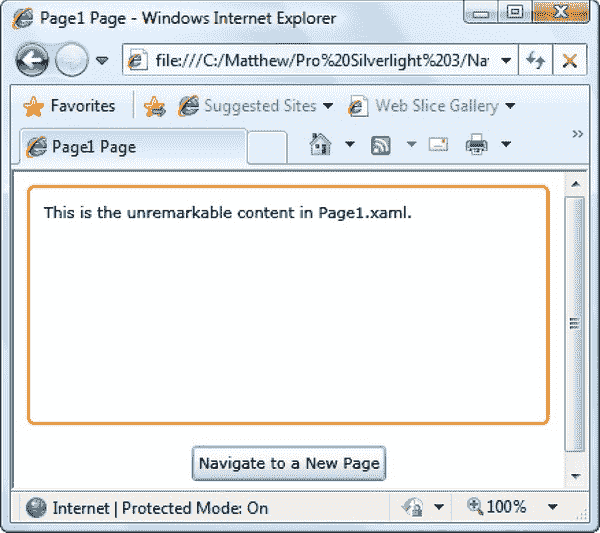

# 七、导航

有了到目前为止学到的知识，您就可以创建使用各种不同控件和布局的应用了。然而，仍然缺少一些东西:从一个页面转换到另一个页面的能力。毕竟，传统的富客户端应用通常是围绕封装不同任务的不同窗口构建的。要在 Silverlight 中创建这种应用，您需要一种超越目前所见的单页面显示的方法。

您可以使用两种基本策略在 Silverlight 应用中执行页面更改，每种策略都有其适当的位置。第一种选择是通过直接操作用户界面自己完成。例如，您可以使用代码访问根 visual，移除表示第一页的用户控件，并添加另一个表示不同页的用户控件。这种技术简单明了，需要的代码相对较少。它还让您能够微观管理细节，如状态管理和应用动画过渡效果。

第二个选择是使用 Silverlight 的导航系统，它围绕着两个新的控件:框架和页面。基本思想是一个单独的*框架*容器可以在多个*页面*之间切换。尽管这种导航方法并不比手动管理用户界面更容易，但它提供了许多增值功能，而自己实现这些功能会非常繁琐。其中包括有意义的 URIs、页面跟踪以及与浏览器历史列表的集成。

在本章中，你将从学习基本的自己动手导航方法开始。接下来，您将快速绕道考虑 ChildWindow 类，它为您提供了一种直接模拟*模态对话框*(临时阻塞当前页面但不替换它的窗口)的方法。最后，您将逐步了解框架和页面控件，并了解它们如何插入 Silverlight 的内置导航系统。

### 加载用户控件

自助导航的基本思想是以编程方式更改 Silverlight 页面中显示的内容，通常是通过操作布局容器或内容控件。当然，你不希望被迫在代码中创建和配置大量的控件——这个任务使用 XAML 更容易完成。相反，您需要一种方法来创建和加载不同的用户控件，每个用户控件代表一个页面，并且每个用户控件在设计时都准备为一个单独的 XAML 文件。

在接下来的小节中，您将看到这种技术的两种相关变体。首先，您将看到一个将用户控件加载到现有页面的示例。这种方法最适合需要在加载新内容时保留一些公共元素(例如，顶部的工具栏或侧面的信息面板)的用户界面。接下来，您将看到如何交换当前页面的全部内容。

#### 在页面中嵌入用户控件

许多 Silverlight 应用都基于一个中央页面，该页面充当整个应用的主窗口。您可以更改此页面的部分内容以加载新内容并模拟导航。

这种设计的一个例子是本书附带的大多数示例项目使用的菜单页面。该页面使用 Grid 控件将自己分成两个主要部分(由水平 GridSplitter 分隔)。顶部是您可以访问的所有页面的列表。当您从该列表中选择一个项目时，它被加载到下面更大的内容区域，如图[图 7-1](#fig_7_1) 所示。

***图 7-1。**动态加载用户控件的窗口*

动态加载用户控件很容易——您只需创建适当类的实例，然后将其添加到合适的容器中。好的选择包括边框、ScrollViewer、StackPanel 或网格控件。前面显示的示例使用了 Border 元素，它是一个内容控件，添加了使用 BorderBrush 和 BorderThickness 属性在其边缘绘制边框的功能。

下面是标记(不包括列表框中的项目列表):

`<UserControl x:Class="Navigation.MenuPage"

 xmlns:x="http://schemas.microsoft.com/winfx/2006/xaml"
 xmlns:basics=
 "clr-namespace:System.Windows.Controls;assembly=System.Windows.Controls">
  <Grid x:Name="LayoutRoot" Background="White" Margin="5">
    <Grid.RowDefinitions>` `      <RowDefinition Height="*"></RowDefinition>
      <RowDefinition Height="Auto"></RowDefinition>
      <RowDefinition Height="3*"></RowDefinition>
    </Grid.RowDefinitions>

    <ListBox Grid.Row="0" SelectionChanged="lstPages_SelectionChanged">
      ...
    </ListBox>

    <basics:GridSplitter Grid.Row="1" Margin="0 3" HorizontalAlignment="Stretch"
     Height="2"></basics:GridSplitter>

    <Border Grid.Row="2" BorderBrush="SlateGray" BorderThickness="1"
     x:Name="borderPlaceholder" Background="AliceBlue"></Border>
  </Grid>
</UserControl>`

在此示例中，边框名为 borderPlaceholder。下面是如何在 borderPlaceholder 区域中显示名为 Page2 的新自定义用户控件:

`Page2 newPage = new Page2();
borderPlaceholder.Child = newPage;`

如果使用不同的容器，可能需要设置不同的属性。例如，Silverlight 的布局面板可以容纳多个控件，因此提供一个 Children 集合而不是一个 Child 属性。您需要清除此集合，然后将新控件添加到其中。这里有一个重复前面代码的示例，假设您已经用单单元格网格替换了边框:

`Page2 newPage = new Page2();
gridPlaceholder.Children.Clear();
gridPlaceholder.Children.Add(newPage);`

如果创建网格时没有声明任何行或列，则该网格有一个按比例调整大小的单元格，可以容纳所有可用空间。因此，向该网格添加控件产生的结果与向边框添加控件产生的结果相同。

示例中使用的实际代码略有不同，因为它需要适用于不同类型的控件。为了确定要创建哪种类型的用户控件，代码会检查刚刚单击的 ListBoxItem 对象。然后，它使用反射创建相应的用户控件对象:

`private void lstPages_SelectionChanged(object sender, SelectionChangedEventArgs e)
{
    // Get the selected item.
    string newPageName = ((ListBoxItem)e.AddedItems[0]).Content.ToString();

    // Create an instance of the page named
    // by the current button.
    Type type = this.GetType();
    Assembly assembly = type.Assembly;
    UserControl newPage = (UserControl)assembly.CreateInstance(
      type.Namespace + "." + newPageName);

    // Show the page.
    borderPlaceholder.Child = newPage;
}`

尽管有反射代码，*显示*新创建的用户控件的过程——也就是设置边框。子属性—完全相同。

#### 隐藏元素

如果您决定创建一个像上一个示例中所示的动态页面，那么您并不局限于添加和删除内容。你也可以暂时*隐藏*它。诀窍是设置 Visibility 属性，该属性在 UIElement 基类中定义，并由所有元素继承:

`panel.Visibility = Visibility.Collapsed;`

Visibility 属性使用仅提供两个值的枚举:Visible 和 Collapsed。(WPF 包含了第三个值 Hidden，它隐藏了一个元素，但在它应该在的地方保留了一个空格。但是，Silverlight 不支持该值。)虽然您可以设置单个元素的 Visibility 属性，但通常您会同时显示和隐藏整个容器(例如，Border、StackPanel 或 Grid 对象)。

当一个元素被隐藏时，它不占用页面空间，也不接收任何输入事件。界面的其余部分会自动调整大小以填充可用空间，除非您已经使用布局容器(如画布)用固定坐标定位了其他元素。

 **提示**许多应用使用可折叠或滑出的面板。要创建这种效果，您可以将这段代码与少量 Silverlight 动画结合起来。动画会改变您想要隐藏的元素，例如，缩小、压缩或移动它。当动画结束时，可以设置可见性属性来永久隐藏元素。你会在第 10 章中看到如何使用这个技巧。

#### 管理根视觉

上一个示例中展示的页面更改技术很常见，但并不适合所有场景。它的主要缺点是将新内容插入到现有布局中。在前面的例子中，这意味着列表框在页面顶部保持固定。如果您需要确保工具栏或面板始终可访问，这是很方便的，但如果您想切换到一个全新的显示来完成不同的任务，这就不太方便了。

另一种方法是将整个页面从一个控件更改为另一个控件。基本的技巧是使用一个简单的布局容器作为应用的根视觉对象。然后，您可以在需要时将用户控件加载到根 visual 中，并在以后卸载它们。(应用启动后，根 visual 本身永远不能被替换。)

正如您在第 6 章中了解到的，Silverlight 应用的启动逻辑通常会创建一个用户控件的实例，如下所示:

`private void Application_Startup(object sender, StartupEventArgs e)
{
    this.RootVisual = new MainPage();
}`

诀窍是使用更灵活的东西——像边框这样的简单容器或像网格这样的布局面板。下面是后一种方法的一个例子:

`// This Grid will host your pages.
private Grid rootGrid = new Grid();

private void Application_Startup(object sender, StartupEventArgs e)
{
    // Load the first page.
    this.RootVisual = rootGrid;
    rootGrid.Children.Add(new MainPage());
}`

现在，您可以通过从网格中移除第一个页面并添加不同的页面来切换到另一个页面。为了使这个过程相对简单，您可以向 App 类添加一个静态方法，如下所示:

`public static void Navigate(UserControl newPage)
{
    // Get the current application object and cast it to
    // an instance of the custom (derived) App class.
    App currentApp = (App)Application.Current;

    // Change the currently displayed page.
    currentApp.rootGrid.Children.Clear();
    currentApp.rootGrid.Children.Add(newPage);
}`

您可以使用如下代码在任何位置导航:

`App.Navigate(new Page2());`

 **提示**你可以添加少量 Silverlight 动画和图形来创建页面之间更令人愉快的过渡，例如柔和的淡入淡出或擦除。你将在第 10 章中学习如何使用这个技巧。

#### 保留页面状态

如果您计划允许用户在复杂的页面之间频繁导航，那么创建每个页面一次并在内存中保存页面实例以备后用是有意义的。这种方法有时还有一个重要的副作用，即维护页面的当前状态，包括任何输入控件中的所有值。

要实现这种模式，首先需要一个系统来识别页面。您可以依靠字符串名称，但是枚举为您提供了更好的错误预防。这里有一个区分三个页面的枚举:

`public enum Pages
{
    MainWindow,
    ReviewPage,
    AboutPage
}`

然后，您可以将应用的页面存储在自定义应用类的私有字段中。这里有一个简单的字典可以解决这个问题:

`private static Dictionary<Pages, UserControl> pageCache =
  new Dictionary<Pages,UserControl>();`

在 Navigate()方法中，仅在需要创建页面时才创建页面，换句话说，相应的对象不存在于缓存页面的集合中:

`public static void Navigate(Pages newPage)
{
    // Get the current application object and cast it to
    // an instance of the custom (derived) App class.
    App currentApp = (App)Application.Current;

    // Check if the page has been created before.
    if (!pageCache.ContainsKey(newPage))
    {
        // Create the first instance of the page,
        // and cache it for future use.
        Type type = currentApp.GetType();
        Assembly assembly = type.Assembly;
        pageCache[newPage] = (UserControl)assembly.CreateInstance(
          type.Namespace + "." + newPage.ToString());
    }

    // Change the currently displayed page.
    currentApp.rootGrid.Children.Clear();
    currentApp.rootGrid.Children.Add(pageCache[newPage]);
}`

现在，您可以通过用 Pages 枚举指示您想要的页面来导航:

`App.Navigate(Pages.MainWindow);`

因为页面只有一个版本被创建，并且在应用的整个生命周期中它都保存在内存中，所以当你离开并再次返回时，页面的所有状态都保持不变(见[图 7-2](#fig_7_2) )。

***图 7-2。**从一页转到另一页*

#### 浏览器历史

本节描述的导航方法的唯一限制是浏览器不知道你已经从一个页面切换到另一个页面。如果你想让用户返回，那就由你来添加控件。浏览器的后退按钮只会将您带到上一个 HTML 页面(从而退出您的 Silverlight 应用)。

如果你想创建一个能更有效地与浏览器集成并支持后退按钮的应用，你需要使用本章后面讨论的 Frame 和 Page 类。

### 子窗口

在许多情况下，你不需要改变页面的方式——你只需要在允许用户返回主应用页面之前临时显示一些内容。一个明显的例子是确认对话框，但是 Windows 和 web 应用使用弹出窗口来收集信息，显示基本程序信息，并提供对配置设置的访问。

在 Silverlight 中，您可以使用一个方便的名为 ChildWindow 的内容控件来创建这种设计。本质上，ChildWindow 模仿了您在 Windows 平台上看到的模式对话框。当您显示子窗口时，应用信息的其余部分被禁用(并且在它上面显示一个灰色阴影覆盖作为用户提示)。然后，子窗口在页面顶部居中显示。用户完成子窗口中的任务后，您的代码会关闭它，应用的其余部分会再次响应。

[图 7-3](#fig_7_3) 显示了一个例子。这里，页面包含一个按钮，单击该按钮会弹出一个子窗口，请求更多信息。当用户点击一个按钮时(或者点击右上角的 *X* ，窗口消失。

***图 7-3。**显示子窗口*

子窗口以一种微妙但吸引人的扩展效果出现在视图中。它的行为也像一个真正的窗口，允许您单击它的标题栏并在页面上拖动它(但不超出浏览器显示区域)。

虽然 ChildWindow 控件提供了出现在应用顶部的独立弹出窗口的假象，但它实际上只是添加到现有页面的另一个元素。但是，ChildWindow 控件足够聪明，可以禁用应用根视图中的其余内容，并适当地定位自己，使其外观和行为像传统的弹出窗口。最后，值得注意的是，当你显示一个子窗口时，它下面的用户界面仍然是活动的，即使用户不能与之交互。例如，如果您正在运行一个动画或正在播放一个视频，当子窗口可见时，它会在后台继续运行(除非您明确地停止它)。

**辅助窗口的其他选项**

ChildWindow 类有两种替代方法，适用于特定的场景。

第一种选择是浮动窗口控件。它不是 Silverlight 主运行时的一部分，但是你可以从`[http://floatablewindow.codeplex.com](http://floatablewindow.codeplex.com)`下载它。与总是阻止主用户界面的 ChildWindow 控件不同，FloatableWindow 让主窗口保持响应。这意味着您可以使用 FloatableWindow 在您的 Silverlight 主页面上显示一个或多个弹出窗口，并在用户与应用的其余部分交互时保持这些窗口。您可以使用这种设计来实现通知窗口、独立的任务区域或浮动的工具面板，但是要小心谨慎。如果不小心处理，浮动窗口会让最终用户感到困惑。

第二种选择是*本地窗口*。这是一个由操作系统创建的独特的、真正独立的窗口。但是，本机窗口功能仅适用于以高信任级别运行的浏览器外应用。你将在[第 18 章](18.html#ch18)中学习如何创建原生窗口。

#### 设计子窗口

在显示子窗口之前，需要用 XAML 模板创建一个子窗口，就像设计用户控件一样。要在 Visual Studio 中添加一个基本启动程序，请在解决方案资源管理器中右键单击项目名称，然后选择 Add  New Item。然后，选择 Silverlight 子窗口模板，输入名称，并单击 Add。Visual Studio 创建新的 XAML 模板和代码隐藏文件，并添加对定义 ChildWindow 控件的 System.Windows.Controls.dll 程序集的引用。

 **注意** ChildWindow 是从 ContentControl 派生出来的一个控件。它添加了两个新属性(Title 和 DialogResult)、两个方法(Show 和 Close)和两个事件(Closing 和 Closed)。

添加子窗口后，可以像设计普通用户控件一样设计它。为了方便起见，Visual Studio 会在新的子窗口模板中自动创建一个两行网格，并将“确定”和“取消”按钮放在最下面一行，并用关闭窗口的事件处理程序完成。(当然，您可以删除或重新配置这些按钮，以适应您的应用设计。)

下面是图 7-3 中[所示子窗口的标记。它为用户信息提供了两个文本框，并在下面添加了标准的“确定”和“取消”按钮:](#fig_7_3)

`<controls:ChildWindow x:Class="Navigation.UserInformation"

  xmlns:x="http://schemas.microsoft.com/winfx/2006/xaml"
  xmlns:controls= "clr-namespace:System.Windows.Controls;assembly=System.Windows.Controls"
  Title="UserInformation">` `  <Grid x:Name="LayoutRoot" Margin="2">
    <Grid.RowDefinitions>
      <RowDefinition Height="Auto"></RowDefinition>
      <RowDefinition Height="Auto"></RowDefinition>
      <RowDefinition Height="Auto"></RowDefinition>
    </Grid.RowDefinitions>
    <Grid.ColumnDefinitions>
      <ColumnDefinition></ColumnDefinition>
      <ColumnDefinition></ColumnDefinition>
    </Grid.ColumnDefinitions>

    <TextBlock>First Name:</TextBlock>
    <TextBox x:Name="txtFirstName" Grid.Column="1" Margin="3" Width="150"></TextBox>
    <TextBlock Grid.Row="1">Last Name:</TextBlock>
    <TextBox x:Name="txtLastName" Grid.Row="1" Grid.Column="1" Margin="3"></TextBox>

    <Button Grid.Row="2" Margin="3" Width="75" Height="23"
     HorizontalAlignment="Right" Content="OK" Click="cmdOK_Click"></Button>
    <Button Grid.Row="2" Grid.Column="1" Margin="3" Width="75" Height="23"
     HorizontalAlignment="Left" Content="Cancel" Click="cmdCancel_Click"></Button>
    </Grid>
</controls:ChildWindow>`

这两个按钮的事件处理程序设置子窗口。对话框结果属性。此属性是一个可为空的布尔值，它指示用户是接受此窗口表示的操作(true)、取消它(false)还是两者都不接受(null)。

`private void cmdOK_Click(object sender, RoutedEventArgs e)
{
    this.DialogResult = true;
}

private void cmdCancel_Click(object sender, RoutedEventArgs e)
{
    this.DialogResult = false;
}`

设置 DialogResult 属性也会关闭窗口，将控制权返回给根 visual。在某些情况下，DialogResult 属性可能与您的应用无关(例如，如果您显示的“关于”窗口包含一个“关闭”按钮)。在这种情况下，您可以使用 ChildWindow 关闭窗口。Close()方法，而不是设置 DialogResult 属性。

#### 显示子窗口

显示子窗口很容易。您需要创建自定义 ChildWindow 类的一个实例，并调用 Show()方法:

`UserInformation childWindow = new UserInformation();
childWindow.Show();`

重要的是要认识到，尽管子窗口阻塞了主用户界面，但是 Show()方法不会阻塞代码的执行。因此，如果您在调用 Show()方法之后放置代码，该代码会立即运行。

如果你需要在用户关闭子窗口时做出反应，这就出现了一个问题，这是通常的情况。在图 7-3 所示的例子中，应用需要收集输入的用户名，并用它来更新主页面的显示。若要执行此任务，您的代码必须响应子窗口。关闭的事件。(ChildWindow 类还提供了一个在窗口开始关闭时触发的 Closing 事件，但这是为需要取消关闭操作的情况设计的，例如，如果没有输入必要的信息。)

请记住，在显示子窗口之前，将事件处理程序附加到 Closed 事件:

`UserInformation childWindow = new UserInformation();
childWindow.Closed += childWindow_Closed;
childWindow.Show();`

还有更多要考虑的。如果您的子窗口不仅仅是一个简单的确认框，您可能需要向应用的其余部分返回额外的信息。在当前示例中，该信息由用户的名和姓组成。理论上，您的应用代码可以获取 ChildWindow 对象，并直接从适当的控件中提取这些信息。然而，这种互动是脆弱的。它在主页和子窗口之间创建了紧密的依赖关系，而这些依赖关系并不总是显而易见的。如果您更改应用的设计，例如，将名和姓文本框换成不同的控件，代码就会中断。更好的方法是在子窗口中创建一个额外的公共属性和方法层。您的主应用页面可以调用这些成员来获取它需要的信息。因为这些方法存储在自定义的 ChildWindow 类中，所以如果您修改子窗口的用户界面，您将知道如何调整它们以便它们继续工作。

例如，在当前示例中，您可以将此属性添加到 UserInformation 类以公开全名信息:

`public string UserName
{
    get { return txtFirstName.Text + " " + txtLastName.Text; }
}`

现在，您可以在回应已关闭事件时访问以下详细信息:

`private void childWindow_Closed(object sender, EventArgs e)
{
    UserInformation childWindow = (UserInformation)sender;
    if (childWindow.DialogResult == true)
    {
        lblInfo.Text = "Welcome to this application, " + childWindow.UserName + ".";
    }
}`

最后一个改进是值得做的。目前，每次用户单击输入用户信息按钮时，都会创建一个子窗口。因此,“名字”和“姓氏”文本框始终保持为空，即使用户之前已经输入了姓名信息。要纠正这一点，您可以为 UserName 属性添加一个属性 setter，或者更好的是，您可以将轻量级 UserInformation 对象保存在内存中。在这个例子中，ChildWindow 对象被创建一次，作为主页的成员变量:

`private UserInformation childWindow = new UserInformation();`

您现在必须附加子窗口。页面构造函数中的 Closed 事件处理程序:

`public ShowChildWindow()
{` `    InitializeComponent();
    childWindow.Closed += childWindow_Closed;
}`

UserInformation 对象将保持其状态，这意味着每次您显示它时，先前输入的名称信息将保持不变。

 **提示**这里有一个使用 ChildWindow 的好方法:弹出丰富的错误消息，比基本的 MessageBox 更加精致。事实上，如果您使用 Silverlight 导航应用模板在 Visual Studio 中创建新项目，您会发现它使用了这种设计。导航模板包括名为 ErrorWindow 的自定义子窗口的标记和代码。当应用。UnhandledException 事件发生时，应用使用 ErrorWindow 礼貌地解释问题。

### 框架和页面

如果您的应用只有很少的页面(就像围绕着主屏幕和配置窗口的动画游戏)，手动更改用户界面是一个很好的方法。如果你需要完全控制导航过程，这也是有意义的(也许这样你可以实现页面转换效果，就像你将在第十章看到的那样)。但是如果你正在构建一个更传统的应用，并且你希望用户在一长串的页面中来回移动，Silverlight 的导航系统可以帮你节省一些重要的工作。

导航系统内置两个控件:框架和页面。在这两个控件中，框架控件更重要，因为它负责创建导航发生的容器。页面控件是一个可选的助手，它为您提供了一种在一个框架中显示不同内容单元的便捷方式。这两个类都有向您的代码公开导航功能的成员。

#### 帧

框架是一个内容控件，是从 content control 派生的控件，包含一个子元素。该子级通过 Content 属性公开。

其他内容控件包括 Button、ListBoxItem、ToolTip 和 ScrollViewer。然而，框架控件有一个显著的区别:如果使用正确，您几乎不会直接接触到内容属性。相反，您将使用更高级的 Navigate()方法来更改内容。Navigate()方法更改了 Content 属性，但它也触发了负责跟踪用户页面历史和更新浏览器 URI 的导航服务。

例如，考虑下面的页面标记。它定义了一个有两行的网格。最上面一行是容纳框架的边框。(尽管 Frame 类具有 BorderBrush 和 BorderThickness 属性，但它缺少 CornerRadius 属性，因此如果希望内容周围有圆形边框，则需要使用 Border 元素。)最下面一行是触发导航的按钮。[图 7-4](#fig_7_4) 显示页面。

`<UserControl x:Class="Navigation.MainPage"

  xmlns:x="http://schemas.microsoft.com/winfx/2006/xaml" **xmlns:navigation**=
**"clr-namespace:System.Windows.Controls;assembly=System.Windows.Controls.Navigation">**` `  <Grid>
    <Grid.RowDefinitions>
      <RowDefinition></RowDefinition>
      <RowDefinition Height="Auto"></RowDefinition>
    </Grid.RowDefinitions>

    <Border Margin="10" Padding="10" BorderBrush="DarkOrange" BorderThickness="2"
     CornerRadius="4">
      **<navigation:Frame x:Name="mainFrame"></navigation:Frame>**
    </Border>
    <Button Grid.Row="1" Margin="5" Padding="5" HorizontalAlignment="Center"
     Content="Navigate to a New Page" Click="cmdNavigate_Click"></Button>
  </Grid>
</UserControl>`

要使用 Frame 类，您必须映射系统。Windows.Controls 命名空间从 System.Windows.Controls.Navigation.dll 程序集到 XML 命名空间前缀。这个例子使用前缀*导航*。

***图 7-4。**一个空架子*

目前，该框架为空。但是如果用户单击按钮，就会运行一个事件处理程序并调用 Navigate()方法。Navigate()方法采用单个参数，即指向应用中已编译的 XAML 文件的 URI:

`private void cmdNavigate_Click(object sender, RoutedEventArgs e)
{
    mainFrame.Navigate(new Uri("/Page1.xaml", UriKind.Relative));
}`

这段代码之所以有效，是因为应用包含一个名为 Page1.xaml 的用户控件。注意，URI 总是以正斜杠开头，它代表应用根。

 **注意**您不能在 URIs 中使用 Navigate()方法，该方法指向其他类型的内容或应用之外的页面(例如，外部网站)。

以下是 Page1.xaml 用户控件的标记:

`<UserControl x:Class="Navigation.Page1"

 xmlns:x="http://schemas.microsoft.com/winfx/2006/xaml">
  <Grid x:Name="LayoutRoot" Background="White">
    <TextBlock TextWrapping="Wrap">This is the unremarkable content in Page1.xaml.</TextBlock>
    </Grid>
</UserControl>`

当您调用 Navigate()方法时，Silverlight 会创建 Page1 类的一个实例，并使用它来设置框架内容，如图[图 7-5](#fig_7_5) 所示。

***图 7-5。**通过导航填充内容框*

如果您手动执行导航，您可以用以下代码替换对 Navigate()的调用:

`// Create the user control.
Page1 newPage = new Page1();

// Show the user control, replacing whatever content is currently visible.
mainFrame.Content = newPage;`

然而，这段代码只改变了内容，而 Navigate()方法将这个动作视为一个更高级的导航事件，它与一些附加特性挂钩。当您调用 Navigate()时，您会注意到两个显著的区别—浏览器 URI 集成和历史支持—这将在下面的部分中进行描述。

 **提示**使用框架可以随时获取当前页面的 URI。源属性。您还可以设置 Source 属性作为调用 Navigate()的替代方法。

##### 浏览器 URI 集成

当您通过 Navigate()方法更改 Frame 控件的内容时，XAML 资源的名称会追加到当前 URI 的片段标记(#)之后。因此，如果您的应用位于 URI:

`localhost://Navigation/TestPage.html`

您可以使用如下代码执行导航:

`mainFrame.Navigate(new Uri("/Page1.xaml", UriKind.Relative));`

现在，您将在浏览器中看到这个 URI:

`localhost://Navigation/TestPage.html**#/Page1.xaml**`

这个系统有很多含义——一些好的，一些潜在的坏的(或者至少是复杂的)。本质上，当你使用 Silverlight 的基于框架的导航系统时，你加载到框架中的每个页面都有一个独特的 URI，这也意味着它是一个单独的历史项，也是你的应用的一个新的入口点。

例如，如果您关闭浏览器并在稍后重新打开它，您可以在新构建的导航 URI 中键入结尾带有 *#/Page1.xaml* 的内容来请求 TestPage.html，加载 Silverlight 应用，并将 Page1.xaml 中的内容插入到框架中，所有这些都在一个步骤中完成。类似地，用户可以用这个 URI 创建一个书签，让他们返回到框架中加载了正确页面的应用。这个特性有时被称为*深度链接*，因为它允许你使用链接，不仅链接到应用的入口点，还链接到应用内部的一些记录或状态*。*

 **提示**再多一点努力，就可以把深度链接作为*搜索引擎优化* (SEO)的起点。基本思想是创建多个 HTML 或 ASP.NET 页面，这些页面将引导您的 Silverlight 应用的不同部分。每个页面将指向同一个 XAP 文件，但是 URI 将链接到那个应用的内的不同页面*。Web 搜索引擎可以为您的应用添加多个索引条目，每个 HTML 或 ASP.NET 页面对应一个条目。*

URI 集成显然是一个方便的特性，但是它也带来了一些问题，这些问题将在下面的章节中概述。

###### 如果页面有多个框架会发生什么？

URI 片段指示应该出现在框架中的页面，但是它不包括框架名称。事实证明，这个系统只适用于只有一个框架的 Silverlight 应用。(包含两个或更多帧的应用被认为是相对罕见的情况。)

如果您有多个框架，它们将共享相同的导航路径。因此，当您的代码在一个框架中调用 Navigate()时，或者当用户输入包含页面名称作为片段的 URI 时，相同的内容将被加载到每个框架中。为了避免这个问题，您必须选择一个代表主要应用内容的框架。该框架将控制 URI 和浏览器历史列表。每隔一个框架将负责私下跟踪其导航，没有浏览器交互。要实现这种设计，请将每个附加框架的 JournalOwnership 属性设置为 OwnJournal。从那时起，在这些框架中执行导航的唯一方法是使用调用 Navigate()方法的代码。

###### 如果启动页面不包含框架控件会发生什么？

多框架网页并不是导航系统使用 URIs 的唯一潜在问题。另一个问题是，如果应用无法加载请求的内容，因为在应用的根视图中没有框架。如果您使用前面描述的动态用户界面技巧之一，例如，使用代码创建 Frame 对象或在包含框架的另一个页面中交换，就会出现这种情况。在这种情况下，应用正常启动；但是因为没有帧可用，URI 的片段部分被忽略。

要解决这个问题，您需要简化您的应用，使框架在启动时在根 visual 中可用，或者添加响应应用的代码。启动事件(参见[第 6 章](06.html#ch6))并检查 URI 的文档片段部分，使用如下代码:

`string fragment = System.Windows.Browser.HtmlPage.Document.DocumentUri.Fragment;`

如果您发现 URI 包含片段信息，那么您可以手动添加代码，将应用恢复到以前的状态。尽管这是一种相对罕见的设计，但请花时间确保它能够正常工作。毕竟，当一个片段 URI 出现在浏览器的地址栏时，用户自然会认为这是一个合适的书签点。如果您不想提供这项服务，可以考虑通过将 JournalOwnership 属性设置为 OwnJournal 来完全禁用 URI 系统。

###### 安全呢？

实际上，URI 系统就像是你的应用的一个巨大的后门。例如，用户可以输入一个 URI，它指向一个您不希望该用户访问的页面，甚至是一个您从未用 Navigate()方法加载过的页面。Silverlight 没有试图强加任何安全措施来限制这种情况。换句话说，向应用添加框架控件提供了访问应用中任何其他页面的潜在路径。

幸运的是，你可以使用几种技巧来压制这种能力。首先，如前所述，通过将 JournalOwnership 属性设置为 OwnJournal，可以将框架从 URI 系统中分离出来。然而，这放弃了对应用中的任何页面使用描述性 URIs 的能力，并且还移除了与浏览器历史列表的集成，这将在下一节中描述。更好的方法是通过处理帧来施加选择性限制。导航事件。此时，您可以检查 URI(通过 NavigatingCancelEventArgs 对象),也可以选择取消导航:

`private void mainFrame_Navigating(object sender, NavigatingCancelEventArgs e)
{
    if (e.Uri.ToString().ToLower().Contains("RestrictedPage.xaml"))
    {
        e.Cancel = true;
    }
}`

您会注意到，这段代码并不匹配整个 URI，而是简单地检查受限页面名称的存在。这是为了避免潜在的*规范化问题*——换句话说，通过不考虑相同的 URI 可以被编写的许多不同的方式来允许对受限页面的访问。下面是一个功能相当但写法不同的 URIs 的例子:

`localhost://Navigation/TestPage.html#/Page1.xaml
localhost://Navigation/TestPage.html#/FakeFolder/.../Page1.xaml`

此示例假定您从不希望对 RestrictedPage.xaml 执行导航。Navigating 事件不区分用户是否编辑了 URI，也不区分导航尝试是用户单击链接的结果还是您的代码调用 Navigate()方法的结果。据推测，应用将以其他方式使用 RestrictedPage.xaml，例如，使用手动实例化用户控件并将其加载到另一个容器中的代码。

最后，值得注意的是，还有另一种方法来处理受限页面。您可以创建一个自定义内容加载器(如本章末尾的“自定义内容加载器”一节所述)，它将根据允许的页面集合检查请求的 URI。这种方法类似于处理帧。导航事件，但它更通用(也更复杂)。如果您的设计正确，您可以在任何需要它的应用中使用它—您需要做的只是将自定义内容加载器添加到适当的框架中，并配置允许的页面集合。缺点是，要得到一个可行的解决方案，你需要编写更多的代码。

##### 历史支持

框架控件的导航功能也与浏览器集成在一起。每次调用 Navigate()方法，Silverlight 都会在历史列表中添加一个新条目(参见[图 7-6](#fig_7_6) )。应用的第一页首先出现在历史列表中，带有 HTML 入口页的标题。随后的每一页都出现在历史列表中的该页下，使用用户控制文件名作为显示文本(如 Page1.xaml)。在本章后面的“页面”一节中，您将学习如何使用自定义页面提供您自己的、更具描述性的标题文本。

***图 7-6。**框架的导航历史*

浏览器的历史列表完全按照你的预期工作。用户可以单击后退或前进按钮，或者在历史列表中选择一个条目，将上一页加载到框架中。最重要的是，这不会导致应用重启。只要 URI 的其余部分保持不变(除了片段之外的所有内容)，Silverlight 只需将适当的页面加载到框架中。另一方面，如果用户转到另一个网站，然后使用 Back 按钮返回，Silverlight 应用将被重新加载。启动事件触发，*然后* Silverlight 试图将请求的页面加载到框架中。

顺带一提，你可以叫框架。在不同的页面中连续多次使用 Navigate()方法。用户在最后一页结束，但是所有其他页面都被添加到中间的历史列表中。最后，如果页面已经加载，Navigate()方法什么也不做，它不会向历史列表添加重复的条目。

##### 导航失败

Silverlight 有一个怪癖，会影响它在使用导航时处理后退按钮的方式。如果您使用浏览器历史列表返回到不包含 URI 片段部分的页面，就会出现问题。例如，如果您启动应用，浏览到一个新页面，然后按浏览器的 Back 按钮返回到初始页面，您就会在前面的示例中遇到这个问题。当您这样做时，您将收到一个 ArgumentException，解释“无法加载 URI 的内容”换句话说，URI 没有指定框架的内容，Silverlight 也不知道在那里放什么。

有两种简单的方法来处理这个问题。第一种方法是处理框架。导航失败事件。然后，您可以检查异常对象(通过 NavigationFailedEventArgs 提供。Exception 属性)并设置 NavigationFailedEventArgs。Handled 属性设置为 true，以适当地忽略这个非问题并继续。

您的另一个选择是使用 UriMapper 来设置框架的初始内容。使用这种技术，您可以将普通的空 URI 映射到一个有效的页面，该页面将显示在框架中(尽管该页面可以是空白的)。您将在下一节看到如何使用这种技术。

#### URI 制图

正如您所看到的，片段 URI 系统将页面名称放在 URI 中。在某些情况下，你最好不要让这个细节太显眼。也许你不想暴露真实的页面名称，你不想增加潜在的混乱。xaml 扩展，或者您希望使用更容易记忆和手动输入的 URI。在所有这些情况下，您可以使用 URI 映射来定义不同的、更简单的 URIs，映射到您到目前为止看到的标准版本。

要使用 URI 映射，首先需要添加一个 UriMapper 对象作为 XAML 资源。通常，您将在主页的资源集合或 App.xaml 文件中定义 UriMapper，如下所示:

`<Application
 xmlns:x="http://schemas.microsoft.com/winfx/2006/xaml"
 x:Class="Navigation.App" xmlns:navigation=
"clr-namespace:System.Windows.Navigation;assembly=System.Windows.Controls.Navigation">
  <Application.Resources>
    **<navigation:UriMapper x:Key="PageMapper">**
    **</navigation:UriMapper>**
  </Application.Resources>
</Application>`

然后，您需要通过设置框架将您的 UriMapper 链接到您的框架。UriMapper 属性:

`<navigation:Frame x:Name="mainFrame" **UriMapper**="{**StaticResource** **PageMapper**}">
</navigation:Frame>`

现在，您可以在 UriMapper 中添加您的 URI 映射。这里有一个例子:

`<navigation:UriMapper x:Key="PageMapper">
  <navigation:UriMapping Uri="Home" MappedUri="/Views/HomePage.xaml" />
</navigation:UriMapper>`

如果您的应用位于此处

`localhost://Navigation/TestPage.html`

你可以用这个简化的 URI

`localhost://Navigation/TestPage.html#Home`

它被映射到这个 URI:

`localhost://Navigation/TestPage.html#/Views/HomePage.xaml`

唯一的问题是，在调用 Navigate()方法时，是否使用简化的 URI 取决于您，如下所示:

`mainFrame.Navigate(new Uri("Home", UriKind.Relative));`

请注意，您不需要在映射 URI 的开头包含正斜杠。

映射后，原始和新的 URI 都将工作，允许您到达同一页面。如果在调用 Navigate()方法时(或者在链接或书签中)使用原始的 URI 格式，这就是用户在浏览器地址栏中看到的内容。

您还可以使用 UriMapper 来设置框架中的初始内容。诀窍是映射一个只是空字符串的 Uri，如下所示:

`<navigation:UriMapper x:Key="PageMapper">
**  <navigation:UriMapping Uri="" MappedUri="/InitialPage.xaml" />**   <navigation:UriMapping Uri="Home" MappedUri="/Views/HomePage.xaml" />
</navigation:UriMapper>`

现在，当页面第一次出现时，框架将显示 InitialPage.xaml 中的内容。

 **注意**记住，如果你不使用 UriMapper 来设置初始页面，你必须处理框架。导航失败事件。否则，当用户使用浏览器的后退按钮返回到第一页时，可能会收到错误消息。

UriMapper 对象还支持采用查询字符串参数的 URIs。例如，考虑以下映射:

`<navigation:UriMapping Uri="Products/{*id*}"
 MappedUri="/Views/ProductPage.xaml?id={id}"></navigation:UriMapping>`

在本例中，花括号中的{ *id* }部分是一个占位符。您可以使用任何具有这种基本形式但为 id 提供任意值的 URI。例如，这个 URI

`localhost://Navigation/TestPage.html#Products/324`

将映射到此:

`localhost://Navigation/TestPage.html#/Views/ProductPage.xaml?id=324`

在 ProductPage.xaml 代码中检索 id 查询字符串参数的最简单方法是使用稍后在“Pages”一节中描述的 NavigationContext 对象。

#### 向前和向后导航

正如你所学的，你可以设置框架。JournalOwnership 属性来确定框架是使用浏览器的历史跟踪系统(默认)还是自己负责保存已访问页面的记录(称为*日志*)。如果您通过将 JournalOwnership 属性设置为 OwnJournal 来选择后者，您的框架将不会与浏览器历史记录集成或使用前面描述的 URI 系统。您需要为用户提供一种浏览页面历史的方式。添加这种支持的最常见方式是创建自己的前进和后退按钮。

如果你正在构建一个浏览器外的应用，定制的前进和后退按钮也是必要的，就像第 18 章中描述的那种。这是因为在独立窗口中运行的应用无法访问任何浏览器功能，也不包含任何浏览器用户界面(包括后退和前进按钮)。在这种情况下，即使没有更改 JournalOwnership 属性，也必须为编程导航提供自己的导航按钮。

如果您不确定您的应用是在浏览器中运行还是在独立窗口中运行，请检查该应用。IsRunningOutOfBrowser 属性。例如，当应用托管在独立窗口中时，下面的代码显示了一个带有导航按钮的面板。您可以在根 visual 的已加载事件处理程序中使用它。

`if (App.Current.IsRunningOutOfBrowser)
  pnlNavigationButtons.Visibility = Visibility.Visible;`

设计前进和后退按钮很容易。您可以使用任何您喜欢的元素—技巧是通过调用 Frame 类的 GoBack()和 GoForward()方法在页面历史中前进或后退。您还可以检查 CanGoBack 属性(如果向后历史中有页面，则为真)和 CanGoForward 属性(如果向前历史中有页面，则为真)，并使用该信息有选择地启用和禁用自定义导航按钮。通常，您会在响应框架时这样做。导航事件:

`private void mainFrame_Navigated(object sender, NavigationEventArgs e)
{
    if (mainFrame.CanGoBack)
        cmdBack.Visibility = Visibility.Visible;
    else
        cmdBack.Visibility = Visibility.Collapsed;

    if (mainFrame.CanGoForward)
        cmdForward.Visibility = Visibility.Visible;
    else
        cmdForwawrd.Visibility = Visibility.Collapsed;
}`

您可以选择禁用按钮并更改其视觉外观(例如，更改颜色、不透明度或图片，或者添加动画效果)，而不是隐藏按钮(如此处所示)。不幸的是，没有办法从日志中获得页面名称列表，这意味着您不能像在浏览器中那样显示历史列表。

#### 超链接

在前面的例子中，导航是通过一个普通的按钮执行的。然而，使用一组 HyperlinkButton 元素进行导航是一种常见的 Silverlight 设计。多亏了 URI 系统，使用超级链接按钮比普通按钮更容易。您只需将 NavigateUri 属性设置为适当的 Uri。您可以使用直接指向 XAML 页面的 URIs，也可以使用通过 UriMapper 映射的 URIs。

这是一个 StackPanel，它创建了一个由三个导航链接组成的条带:

`<StackPanel Margin="5" HorizontalAlignment="Center" Orientation="Horizontal">
  <HyperlinkButton NavigateUri="/Page1.xaml" Content="Page 1" Margin="3" />
  <HyperlinkButton NavigateUri="/Page2.xaml" Content="Page 2" Margin="3" />
  <HyperlinkButton NavigateUri="Home" Content="Home" Margin="3" />
</StackPanel>`

虽然这个概念没有改变，但是这种方法允许您在 XAML 标记中保留 URIs，并让您的代码简单且不受无关细节的影响。

#### 页

前面的例子都使用导航将用户控件加载到框架中。虽然这种设计是可行的，但更常见的是使用从 Page 派生的自定义类，而不是用户控件，因为 Page 类提供了导航系统和(可选的)自动状态管理的方便挂钩。

若要向 Visual Studio 项目添加页面，请在解决方案资源管理器中右击项目名称，然后选择“添加新项”。然后，选择 Silverlight 页面模板，输入页面名称，并单击添加。除了根元素之外，放置在页面中的标记与放置在用户控件中的标记相同。下面是一个经过修改的示例，通过修改根元素并设置 Title 属性，将 Page1.xaml 从用户控件更改为页面:

`<**navigation:Page** x:Class="Navigation.Page1"

 xmlns:x="http://schemas.microsoft.com/winfx/2006/xaml"
 **xmlns**:**navigation****="clr-namespace:System.Windows.Controls;assembly=System.Windows.Controls.Navigation"**
 **Title="Sample Page">**
  <Grid x:Name="LayoutRoot" Background="White">
    <TextBlock TextWrapping="Wrap">This is the unremarkable content in Page1.xaml.</TextBlock>
    </Grid>
</**navigation****:****Page**>`

 **提示**将页面放在与用户控件分开的项目文件夹中是一种常见的设计惯例。例如，你可以将所有的页面放在一个名为 Views 的文件夹中，并像`/Views/Page1.xaml`一样使用导航 URIs。

从技术上讲，Page 是一个从 UserControl 派生的类，并添加了一小组成员。其中包括一组可以重写以响应导航操作的方法和四个属性:Title、NavigationService、NavigationContext 和 NavigationCacheMode。Title 属性是最简单的。它设置用于浏览器历史列表的文本，如前面的示例所示。其他成员将在以下章节中介绍。

##### 导航属性

每个页面都提供了 NavigationService 属性，该属性提供了 Silverlight 导航系统的入口点。NavigationService 属性提供一个 NavigationService 对象，该对象提供与 Frame 类相同的导航方法，包括 Navigate()、GoBack()和 GoForward()以及诸如 CanGoBack、CanGoForward 和 CurrentSource 之类的属性。这意味着您可以通过添加如下代码从页面内部触发页面导航:

`this.NavigationService.Navigate(new Uri("/Page2.xaml", UriKind.Relative));`

Page 类还包括一个提供 NavigationContext 对象的 NavigationContext 属性。该对象公开了两个属性:Uri 获取当前 URI，用于到达当前页面；query string 获取一个集合，其中包含附加在 URI 末尾的任何查询字符串参数。这样，触发导航的代码可以将信息传递给目标页面。例如，考虑下面的代码，它将两个数字作为查询字符串参数嵌入到 URI 中:

`string uriText = String.Format("/Product.xaml?productID={0}&type={1}",` `  productID, productType);

mainFrame.Navigate(new Uri(uriText), UriKind.Relative);`

一个典型的完整的 URI 可能看起来像这样:

`/Product.xaml?productID=402&type=12`

您可以使用如下代码在目标页面中检索产品 ID 信息:

`int productID, type;

if (this.NavigationContext.QueryString.ContainsKey("productID"))
    productID = Int32.Parse(this.NavigationContext.QueryString["productID"]);
if (this.NavigationContext.QueryString.ContainsKey("type"))
    type = Int32.Parse(this.NavigationContext.QueryString["type"]);`

当然，还有其他方法可以在页面之间共享信息，比如将信息存储在 application 对象中。不同之处在于，查询字符串参数保留在 URI 中，因此为链接添加书签的用户可以在以后重新使用它来返回到应用中的某个确切位置(例如，查询字符串允许您创建指向数据目录中特定项目的链接)。不利的一面是，任何花时间查看 URI 的用户都可以看到查询字符串参数，并且它们可以被篡改。

##### 状态存储

通常，当用户使用前进和后退按钮或历史列表转到某个页面时，该页面会从头开始重新创建。当用户离开页面时，页面对象将从内存中被丢弃。这种设计的一个结果是，如果一个页面有用户输入控件(例如，一个文本框)，它们会在回访时被重置为默认值。类似地，page 类中的任何成员变量都被重置为初始值。

前面描述的自己动手的状态管理方法通过在内存中缓存整个页面对象来避免这个问题。Silverlight 允许自己的导航系统使用页面进行类似的操作。NavigationCacheMode 属性。

NavigationCacheMode 的默认值是 Disabled，这意味着不执行任何缓存。将它切换到 Required，当用户离开时，框架会将页面对象保存在内存中。如果用户返回，则使用已经实例化的对象，而不是新创建的实例。页面构造函数不会运行，但加载的事件仍会触发。

NavigationCacheMode 还有一个选项。将其设置为 Enabled，页面将被缓存—在一定程度上。关键的细节是框架。CacheSize 属性，该属性设置可以缓存的可选页面的最大数量。例如，当该值为 10(默认值)时，框架将缓存最近启用了 NavigationCacheMode 的十个页面。当第十一个页面被添加到缓存中时，第一个(最老的)页面对象将从缓存中被丢弃。NavigationCacheMode 设置为 Required 的页面不计入 CacheSize 总数。

通常，当您想要缓存页面以保持其当前状态时，您需要将 NavigationCacheMode 设置为 Required。如果您希望缓存页面的选项能够节省时间并提高性能，例如，如果您的页面包含执行详细计算或调用 web 服务的耗时初始化逻辑，则需要将 NavigationCacheMode 设置为 Enabled。在这种情况下，请确保将此逻辑放在构造函数中，而不是放在已加载事件的事件处理程序中(当从缓存中提供页面时仍会触发该事件)。

##### 导航方式

Page 类还包括一小组在不同导航操作期间触发的方法。它们包括以下内容:

*   *OnNavigatedTo()* :当框架导航到页面时(第一次或在历史中返回)调用该方法。
*   *OnNavigatingFrom()* :当用户即将离开页面时调用该方法；它允许您取消导航操作。
*   *OnNavigatedFrom()* :当用户离开页面时，在下一个页面出现之前调用这个方法。

您可以使用这些方法在离开或访问页面时执行各种操作，例如跟踪和初始化。例如，您可以使用它们来实现更具选择性的状态管理形式，只在内存中存储当前页面的一些细节，而不是缓存整个页面对象。只需在调用 OnNavigatedFrom()时存储页面状态，并在调用 OnNavigatedTo()时检索它。将状态存储在哪里由您决定，您可以将其存储在 App 类中，也可以在自定义页面类中使用静态成员，就像这里用单个字符串所做的那样:

`public partial class CustomCachedPage : Page
{
    ...

    public static string TextBoxState { get; set; }
}`

下面是使用此属性存储单个文本框中的数据并在用户稍后返回页面时检索这些数据的页面代码:

`protected override void OnNavigatedFrom(NavigationEventArgs e)
{
    // Store the text box data.
    CustomCachedPage.TextBoxState = txtCached.Text;
    base.OnNavigatedFrom(e);
}
protected override void OnNavigatedTo(NavigationEventArgs e)
{
    // Retrieve the text box data.
    if (CustomCachedPage.TextBoxState != null)
      txtCached.Text = CustomCachedPage.TextBoxState;
    base.OnNavigatedTo(e);
}`

#### 导航模板

现在，您已经了解了使用 Silverlight 的 Frame 和 Page 类创建可导航应用所需的一切。然而，简单地使用这些功能和让它们看起来更好，有一个光滑的，视觉上一致的显示之间有不小的差距。有两种方法可以弥补这个差距。一种选择是逐步建立你的设计技能，回顾别人的例子，进行实验，最终得到你想要的完美定制的用户界面。另一个选择是使用一个现成的*导航模板*作为起点。这些是您可以在 Visual Studio 中使用的初学者项目模板，它们为您提供了基本的项目结构和一些更好的样式。

[图 7-7](#fig_7_7) 显示了如果您使用 Silverlight 导航应用项目模板而不是通用 Silverlight 应用模板创建一个新项目，您将如何开始。

***图 7-7。**用导航模板创建的应用*

这个应用的基本结构非常简单——页面顶部有一个页眉，左侧有一组用于导航的链接按钮。下面是执行导航的框架。页面通过 UriMapper 进行映射，并放置在名为 Views 的项目子文件夹中。

Silverlight 只有一个导航模板，如图 7-7 所示。然而，Silverlight 团队在 Silverlight 3 发布时发布了几个替代模板，你可以在`[http://tinyurl.com/ktv4vu](http://tinyurl.com/ktv4vu)`获得它们。这些模板使用相同的基本结构，但是它们调整了链接按钮的视觉样式和位置。

### 定制内容加载器

如你所见，Silverlight 的导航系统功能强大，但并不过分灵活。它对处理 URIs 的方式做了一些假设。(本质上，每个 URI 提供了将被加载到框架中的 XAML 页面的名称。)这个系统对于使用直接导航的应用来说工作得很好，但它没有给你探索更有趣的扩展的机会，比如 URIs，它会提示你的应用联系远程服务或开始下载。它也不允许你在导航系统中插入额外的功能，比如用户认证和授权。

其中一些功能可能会出现在 Silverlight 的未来版本中。其中许多将由第三方开发者在单独的库中提供(有些免费，有些不免费)。但是现在，您可以开始自己扩展导航，使用一个叫做自定义内容加载器的特性。

定制内容加载器的想法很简单。创建一个实现 INavigationContentLoader 接口的类。该类接收一个 URI，然后适当地处理它(例如，通过提供页面内容或启动一个完全不同的任务)。然后，您可以将自定义内容加载器附加到任何应用中的框架。您甚至可以将内容加载器链接在一起，以便一个内容加载器可以将请求的 URI 传递给序列中的下一个内容加载器。

尽管内容加载器的想法相当简单，但是对它们进行编程却不简单。这里有两个问题。首先，INavigationContentLoader 是围绕异步模型设计的。这意味着您需要实现 BeginLoad()、EndLoad()和 CancelLoad()等方法，并使用 IAsyncResult 对象来协调内容加载代码和您的框架之间的交互。第二，有些微妙的问题会导致异常或取消。(如果你的导航时间超过几毫秒，这种情况尤其明显。如果用户没有得到即时响应，他们可能会连续几次点击一个链接，发出几个请求，所有这些请求随后都会被取消。)简而言之，构建一个定制的内容加载器并不难。但是建立一个像它应该的那样健壮和可靠的系统通常是困难的。

考虑到这些复杂性，您应该如何处理定制内容加载器呢？你有三个选择:

*   *将基础设施编程留给专家*:您仍然可以从定制内容加载器特性中获益，但不是通过构建自己的实现。相反，您将下载并使用由其他开发人员创建的定制内容加载器——那些编写低级代码的开发人员。
*   *创建简单的实现*:您可以通过构建一个定制的内容加载器来处理几个简单的场景，该加载器将大部分实际工作卸载到 PageResourceContentLoader 类。(PageResourceContentLoader 是内置的内容加载器，它将 XAML 文档加载到框架中。)这是你将在本章的例子中使用的方法。
*   *使用别人的高级类*:在低级的 INavigationContentLoader 接口之上创建一个简单的内容加载模型的竞赛正在进行。理想情况下，您只需要从一个简单的同步基类派生来创建您的自定义内容加载器。大卫·希尔在`[http://tinyurl.com/37rqc7x](http://tinyurl.com/37rqc7x)`迈出了坚实的第一步。

在接下来的小节中，您将看到如何构建一个简单的实现用户认证的内容加载器。

#### 认证和导航

如果您曾经编写过 ASP.NET 应用，那么您已经熟悉了认证、授权和导航的结合方式。

在传统的 web 应用中，有些页面是任何人都可以访问的，而有些页面是受保护的。*授权*规则描述了这些差异，将某些页面标记为公共页面，而将其他页面标记为受限页面(这意味着它们只对登录用户或特定用户或组可用)。如果一个匿名用户试图请求一个受限页面，该用户将被重定向到一个登录页面进行*认证*。通常，这一步包括输入有效的用户名和密码，然后用户被送回最初请求的页面。

使用定制的内容加载器，您可以创建这种类型的系统。您的定制内容加载器将拦截每个页面请求，检查用户是否经过认证，然后采取适当的措施。为此，应用需要区分公共页面和需要认证的页面。在本例中，需要认证的页面被放置在名为 SecurePages 的项目子文件夹中([图 7-8](#fig_7_8) )。

***图 7-8。**需要认证的页面*

[图 7-9](#fig_7_9) 显示了一个测试完成的认证系统的简单应用。框架中显示的第一页是 InitialPage.xaml ( [图 7-9](#fig_7_9) ，左)。用户可以通过单击按钮(触发 Navigate()方法)或链接转到另一个页面。但是，如果应用试图导航到 SecurePages 文件夹中的页面，自定义内容加载器会将用户重定向到登录页面([图 7-9](#fig_7_9) ，右侧)。

***图 7-9。**请求安全页面*

在登录页面，用户有几个选择。用户可以输入有效的用户名和密码组合，然后单击登录。然后登录页面会将用户重定向到最初请求的页面。或者，用户可以导航到一个不安全的页面(正常工作)或一个安全的页面(在这种情况下，用户立即返回登录页面)。

既然您已经理解了这个应用是如何工作的，那么是时候看看支撑它的代码了。

#### 创建自定义内容加载器

自定义内容加载器只是一个实现 INavigationContentLoader 的类。该接口要求您提供以下方法:BeginLoad()、CanLoad()、CancelLoad()和 EndLoad()。尽管正确实现这些方法很棘手，但您可以使用一种快捷方式。只需将 PageResourceContentLoader 的一个实例定义为一个成员字段，并在内容加载器经过它的各个阶段时调用它的方法。为了理解这个概念，考虑下面的定制内容加载器，它使用 PageResourceContentLoader 精确地复制标准导导航为*:*

*`public class CustomContentLoader : INavigationContentLoader
{
    **private PageResourceContentLoader loader = new PageResourceContentLoader();**

    public IAsyncResult BeginLoad(Uri targetUri, Uri currentUri,
      AsyncCallback userCallback, object asyncState)
    {
        return loader.BeginLoad(targetUri, currentUri, userCallback, asyncState);
    }

    public bool CanLoad(Uri targetUri, Uri currentUri)
    {
        return loader.CanLoad(targetUri, currentUri);
    }

    public void CancelLoad(IAsyncResult asyncResult)
    {
        loader.CancelLoad(asyncResult);
    }

    public LoadResult EndLoad(IAsyncResult asyncResult)
    {
        return loader.EndLoad(asyncResult);
    }
}`

这看起来很简单，但它提供了在[图 7-9](#fig_7_9) 中使用的 AuthenticatingContentLoader 的基本结构。但是现在您需要更多的细节，从两个新的属性开始，这两个属性允许用户指定登录页面和保存安全页面的文件夹:

`public class AuthenticatingContentLoader : INavigationContentLoader
{
    private PageResourceContentLoader loader = new PageResourceContentLoader();

**    public string LoginPage { get; set; }**
**    public string SecuredFolder { get; set; }**
    ...
}`

CanLoad()、CancelLoad()和 EndLoad()方法保持不变。但是 BeginLoad()需要一些微调。它需要确定用户当前是否登录。如果用户没有登录，并且请求的是安全文件夹中的页面，则用户会被重定向到登录页面。

`public IAsyncResult BeginLoad(Uri targetUri, Uri currentUri,
  AsyncCallback userCallback, object asyncState)
{
    if (!App.UserIsAuthenticated)
    {
        if ((System.IO.Path.GetDirectoryName(targetUri.ToString()).Trim('\\') ==
          SecuredFolder) && (targetUri.ToString() != LoginPage))
        {
            // Redirect the request to the login page.
            targetUri = new Uri(LoginPage, UriKind.Relative);
        }
    }
    return loader.BeginLoad(targetUri, currentUri, userCallback, asyncState);
}`

要跟踪用户是否登录，您需要向 App 类添加一个布尔标志，如下所示:

`public partial class App : Application
{
    public static bool UserIsAuthenticated  { get; set; }
    ...
}`

现在您已经完成了内容加载器，是时候让它在应用中工作了。

#### 使用自定义内容加载器

使用自定义内容加载器很可能会在您的 XAML 中使用任何其他自定义成分。第一步是为项目名称空间映射一个 XML 名称空间，以便内容加载器可用。在此示例中，项目名为 CustomContentLoader:

`<UserControl x:Class="CustomContentLoader.MainPage"
  xmlns:local="clr-namespace:CustomContentLoader" ... >`

接下来，你需要设置框架。ContentLoader 属性与自定义内容加载器的实例进行比较。您还可以同时设置自定义内容加载器的属性:

`<navigation:Frame x:Name="mainFrame" UriMapper="{StaticResource UriMapper}">
  <navigation:Frame.ContentLoader>
    <local:AuthenticatingContentLoader LoginPage="/Login.xaml"
     SecuredFolder="SecurePages"></local:AuthenticatingContentLoader>
  </navigation:Frame.ContentLoader>
</navigation:Frame>`

剩下的唯一一步是编写登录页面的代码。在这个例子中，登录页面只是检查硬编码的密码，但是更现实的方法是调用某种 web 服务(如第 19 章所述)来验证 web 服务器上的用户。重要的细节是，一旦用户通过认证，user is authenticated 标志必须设置为 true，并且应用必须调用 NavigationService。Refresh()方法，该方法重复整个导航序列。这一次，因为用户已经过认证，所以不会执行重定向，所以用户将返回最初请求的页面。

`private void cmdLogin_Click(object sender, RoutedEventArgs e)
{
    // Use a hard-coded password. A more realistic application would call a remote
    // authentication service that runs on an ASP.NET website.
    if (txtPassword.Text == "secret")
    {
        App.UserIsAuthenticated = true;
        navigationService.Refresh();
    }
}`

现在，内容加载器可以无缝地工作了。当然，您可以向这个基本示例添加更多内容。例如，可以将 AuthenticatingContentLoader 配置为接受一组授权规则，然后对这些规则进行评估，以确定特定用户是否可以访问特定页面。要深入研究像这样更复杂的认证，并查看更复杂的定制内容加载器的示例，请务必查看大卫·希尔的博客(`[www.davidpoll.com](http://www.davidpoll.com)`)。作为一名专攻导航的 Silverlight 项目经理，他提供了有用的见解和几个高级定制内容加载器示例。

### 最后一句话

在这一章中，您考虑了如何使用一系列技术从单页显示升级到真正的应用。首先，您考虑了简单的内容隐藏和交换技术，这给了您无限的灵活性，并允许您模拟导航。接下来，您考虑了 ChildWindow，它允许您创建一个弹出窗口，显示在应用的其余部分上。之后，您详细了解了 Frame 和 Page 类以及 Silverlight 的内置 Silverlight 导航系统，该系统支持历史跟踪和深度链接等功能。最后，您看到了如何使用定制内容加载器来扩展导航系统。*