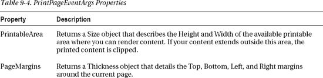

## C H A P T E R 9

## 画笔、位图和打印

在前一章中，您开始探索 Silverlight 的二维绘图模型。您考虑了如何使用矩形、椭圆、多边形、折线和路径等形状派生类来创建各种不同的绘图。然而，形状本身不足以满足您为图形丰富的应用创建详细的二维矢量艺术的需要。在这一章中，你将拾起丢失的部分。

首先，您将了解 Silverlight 画笔，它允许您创建任何形状的渐变、平铺图案和位图填充。接下来，您将看到如何使用 Silverlight 对透明度的轻松支持将多个图像和元素融合在一起。您还将探索像素着色器，它将复杂的视觉效果(如模糊和颜色调整)应用于任何元素。正如您将看到的，当您组合这些功能时，例如，将少量模糊与变换的扭曲效果结合在一起，您可以创建流行的效果，如反射、发光、阴影，甚至模拟的三维效果。如果这些预构建的工具不能提供您想要的所有控制，您可以采取下一步，使用 WriteableBitmap 类进行完全自定义的渲染，该类允许您修改位图图像的单个像素，即使它显示在 Silverlight 页面中。

最后，您将考虑另一个补充主题:打印。虽然在关于图形的一章中讨论打印看起来很奇怪，但是 Silverlight 使用与生成打印输出相同的管道来呈现图形。

 **新功能**最初，Silverlight 的打印模型仅限于基于位图的打印，这可能会很慢(特别是对于高分辨率的打印输出)。Silverlight 5 增加了使用基于矢量的打印的能力，而不改变底层的打印模型。但是，您的打印机(和打印机驱动程序)需要 PostScript 支持。您将在“位图和矢量打印”一节中了解所有细节。

### 画笔

如您所知，画笔填充一个区域，无论是元素的背景、前景或边框，还是形状的填充或描边。对于元素，使用具有前景、背景和边框画笔属性的画笔。对于形状，可以使用填充和描边属性。

你在本书中使用了笔刷，但是到目前为止，你已经用简单的 SolidColorBrush 完成了大部分工作。虽然 SolidColorBrush 毫无疑问是有用的，但其他几个类是从 System 继承的。Windows.Media.Brush 并给你更多奇异的效果。[表 9-1](#tab_9_1) 列出了全部。

T2】

在本章中，您将学习如何使用 LinearGradientBrush、RadialGradientBrush 和 ImageBrush。当你探索 Silverlight 的媒体支持时，VideoBrush 将在第 12 章中讨论。

#### LinearGradientBrush 类

LinearGradientBrush 允许您创建从一种颜色变化到另一种颜色的混合填充。

这是最简单的梯度。它从蓝色(左上角)到白色(右下角)对矩形进行对角着色:

`<Rectangle Width="150" Height="100">
  <Rectangle.Fill>
    <LinearGradientBrush>
      <GradientStop Color="Blue" Offset="0"/>
      <GradientStop Color="White" Offset="1" />
    </LinearGradientBrush>
  </Rectangle.Fill>
</Rectangle>`

图 9-1 中的顶部梯度显示了结果。

***图 9-1。**不同线性渐变的矩形*

要创建第一个渐变，需要为每种颜色添加一个 GradientStop。您还需要使用从 0 到 1 的偏移值在渐变中放置每种颜色。在此示例中，蓝色的 GradientStop 的偏移量为 0，这意味着它位于渐变的最开始。白色的 GradientStop 的偏移量为 1，将其放置在末尾。如果更改这些值，您可以调整渐变从一种颜色切换到另一种颜色的速度。例如，如果将白色的 GradientStop 设置为 0.5，渐变将从蓝色(左上角)过渡到中间的白色(两个角之间的点)。矩形的右边将完全是白色的。(图 9-1 中的第二个梯度显示了这个例子。)

前面的标记创建了一个带有从一个角延伸到另一个角的对角线填充的渐变。但是，您可能希望创建一个从上到下或从一边到另一边混合的渐变，或者使用不同的对角。您可以使用 LinearGradientBrush 的 StartPoint 和 EndPoint 属性来控制这些细节。这些属性允许您选择第一种颜色开始变化的点，以及颜色变化以最终颜色结束的点。(中间的区域逐渐混合。)但是有一个怪癖。您用于起点和终点的坐标不是真实坐标。相反，LinearGradientBrush 将点(0，0)指定给要填充的区域的左上角，将点(1，1)指定给该区域的右下角，而不管该区域实际上有多高多宽。

要创建从上到下的水平填充，可以使用左上角的起点(0，0)和表示左下角的终点(0，1)。要创建从一边到另一边的垂直填充(没有倾斜)，您可以使用右上角的起点(0，0)和终点(1，0)。[图 9-1](#fig_9_1) 显示的是水平渐变(第三个)。

你可以通过提供起点和终点来变得更加巧妙，这些起点和终点并不与你的渐变的角对齐。例如，您可以有一个从(0，0)到(0，0.5)的渐变拉伸，这是左边缘上的一个点，向下一半。这将创建一个压缩的线性渐变，一种颜色从顶部开始，混合到中间的第二种颜色。形状的下半部分用第二种颜色填充。但是等等，你可以使用 LinearGradientBrush 来改变这个行为。SpreadMethod 属性默认情况下，它是填充的(这意味着渐变之外的区域使用适当的颜色进行纯色填充)，但您也可以使用反射(反转渐变，从第二种颜色返回到第一种颜色)或重复(复制相同的颜色渐变)。[图 9-1](#fig_9_1) 显示了反射效果(第四个渐变)。

LinearGradientBrush 还允许您通过添加两个以上的 GradientStop 对象来创建具有两种以上颜色的渐变。例如，这里有一个渐变穿过彩虹的颜色:

`<Rectangle Width="150" Height="100">
  <Rectangle.Fill>
    <LinearGradientBrush StartPoint="0,0" EndPoint="1,1">
      <GradientStop Color="Yellow" Offset="0.0" />
      <GradientStop Color="Red" Offset="0.25" />
      <GradientStop Color="Blue" Offset="0.75" />
      <GradientStop Color="LimeGreen" Offset="1.0" />
    </LinearGradientBrush>
  </Rectangle.Fill>
</Rectangle>`

唯一的技巧是为每个渐变光圈设置适当的偏移。例如，如果要通过五种颜色进行过渡，可以将第一种颜色的偏移量设置为 0，第二种颜色的偏移量设置为 0.25，第三种颜色的偏移量设置为 0.5，第四种颜色的偏移量设置为 0.75，第五种颜色的偏移量设置为 1。或者，如果您希望颜色在开始时混合得更快，然后逐渐结束，您可以将偏移量设置为 0、0.1、0.5 和 1。

请记住，画笔不仅限于形状绘制。您可以在任何需要使用 SolidColorBrush 的时候替换 LinearGradientBrush，例如，填充元素的背景图面(使用 background 属性)、其文本的前景色(使用 foreground 属性)或填充边框(使用 BorderBrush 属性)。[图 9-2](#fig_9_2) 显示了一个渐变填充文本块的例子。

***图 9-2。**使用线性渐变笔刷设置文本块。前台房产*

#### RadialGradientBrush 类

RadialGradientBrush 的工作方式类似于 LinearGradientBrush。它还采用一系列具有不同偏移量的颜色。与 LinearGradientBrush 一样，您可以使用任意多种颜色。区别在于你如何放置渐变。

若要确定渐变中第一种颜色的起始点，可以使用 GradientOrigin 属性。默认情况下，它是(0.5，0.5)，表示填充区域的中间。

 **注意**和 LinearGradientBrush 一样，RadialGradientBrush 使用一个比例坐标系，就好像矩形填充区域的左上角是(0，0)，右下角是(1，1)。这意味着您可以从(0，0)到(1，1)之间选取任何坐标来放置渐变的起点。如果您想将起点定位在填充区域之外，甚至可以超出这些限制。

渐变以圆形方式从起点向外辐射。最终，你的渐变到达一个内部渐变圆的边缘，在那里结束。这个圆的中心可能与渐变原点对齐，也可能不对齐，这取决于您想要的效果。超出内部渐变圆边缘和填充区域最外边缘的区域使用 RadialGradientBrush 中定义的最后一种颜色进行纯色填充。GradientStops 集合，如图 9-3 所示。

***图 9-3。**如何填充径向渐变*

使用三个属性设置内部渐变圆的边缘:Center、RadiusX 和 RadiusY。默认情况下，Center 属性为(0.5，0.5)，它将限制圆的中心放在填充区域的中间，并且与渐变原点在同一位置。

半径 x 和半径 y 值决定了限制圆的大小，默认情况下，它们都设定为 0.5。这些值可能有点不直观——它们是相对于填充区域的*对角线*跨度(从填充区域的左上角延伸到右下角的假想线的长度)来测量的。这意味着半径为 0.5 的圆的半径是这条对角线长度的一半。如果你有一个正方形的填充区域，你可以用一点毕达哥拉斯来计算，这大约是你的区域的宽度(或高度)的 0.7 倍。因此，如果您使用默认设置填充正方形区域，渐变将从中心开始，并以大约 0.7 倍于正方形宽度的距离延伸到其最外面的边缘。

 **注意**如果你在你的填充区域追踪最大可能的椭圆，那就是渐变在你的第二种颜色结束的地方。

RadialGradientBrush 是填充圆形和创建灯光效果的特别好的选择。(大师级艺术家使用渐变的组合来创建具有发光效果的按钮。)一个常见的技巧是稍微偏移梯度原点，以在形状中创建深度错觉。这里有一个例子:

`<Ellipse Margin="5" Stroke="Black" StrokeThickness="1" Width="200" Height="200">
  <Ellipse.Fill>
    <RadialGradientBrush RadiusX="1" RadiusY="1" GradientOrigin="0.7,0.3">
      <GradientStop Color="White" Offset="0" />
      <GradientStop Color="Blue" Offset="1" />
    </RadialGradientBrush>
  </Ellipse.Fill>
</Ellipse>`

[图 9-4](#fig_9_4) 显示了这一梯度，以及具有标准 GradientOrigin 值(0.5，0.5)的普通径向梯度。

***图 9-4。**径向渐变*

#### 图像画笔

ImageBrush 允许您使用 Silverlight 支持的任何文件类型(BMP、PNG 和 JPEG 文件)用位图图像填充区域。您可以通过设置 ImageSource 属性来标识要使用的图像。例如，此画笔使用名为 logo.jpg 的图像绘制网格的背景，该图像作为资源包含在项目中(因此嵌入在应用的 XAP 文件中):

`<Grid>
  <Grid.Background>
    <ImageBrush ImageSource="logo.jpg"></ImageBrush>
  </Grid.Background>
</Grid>`

ImageBrush 的 ImageSource 属性的工作方式与 Image 元素的 Source 属性相同，这意味着您也可以使用指向项目中嵌入文件或 web 位置的 URI 来设置它。

 **注意** Silverlight 尊重它在图像中发现的任何透明信息。例如，Silverlight 支持 PNG 文件中的透明区域。

在此示例中，ImageBrush 用于绘制单元格的背景。因此，图像被拉伸以适合填充区域。如果网格比图像的原始尺寸大，您可能会在图像中看到调整大小的假象(例如一般的模糊)。如果网格的形状与图片的长宽比不匹配，图片会被扭曲以适应。您可以通过修改 ImageBrush 来控制此行为。拉伸属性，并指定[表 9-2](#tab_9_2) 中列出的值之一。

如果绘制的图像小于填充区域，则根据 AlignmentX 和 AlignmentY 属性对图像进行对齐。未填充的区域保持透明。如果您使用统一缩放，并且您填充的区域具有不同的形状(在这种情况下，您将在顶部或侧面获得空白条)，则会出现这种情况。如果使用“无”并且填充区域比图像大，也会出现这种情况。

### 透明度

到目前为止，在你考虑的例子中，形状是完全不透明的。但是，Silverlight 支持真正的透明。这意味着，如果你将几个元素层层叠加，并赋予它们不同的透明度，你会看到你所期望的效果。最简单地说，这个特性使您能够创建图形背景，以“显示”您放在顶部的元素。在最复杂的情况下，此功能允许您创建多层动画和其他效果。

有几种方法可以使元素部分透明:

*   *设置元素*的不透明度属性:不透明度是一个从 0 到 1 的分数值，其中 1 是完全实心(默认)，0 是完全透明。不透明度属性是在 UIElement 类中定义的，因此它适用于所有元素。
*   *设置笔刷*的不透明度属性:像元素一样，各种笔刷类包含一个不透明度属性，允许你使它们的填充部分透明。然后，您可以使用这些画笔来绘制元素的一部分。
*   *使用半透明颜色*:任何 alpha 值小于 255 的颜色都是半透明的。设置元素的前景、背景或边框时，可以使用半透明颜色。
*   *设置 OpacityMask 属性*:这让你可以使元素的特定区域透明或部分透明。例如，您可以使用它将形状逐渐淡化为透明。

图 9-5 显示了一个使用前两种方法创建透明元素的例子。

***图 9-5。**有几个半透明元素的页面*

在这个例子中，顶层布局容器是一个网格，它使用 ImageBrush 来设置背景图片。网格的不透明度降低到 70%，允许下面的纯色显示出来。(在这种情况下，它是白色背景，使图像变亮。)

`<Grid Margin="5" **Opacity****="0.7"**>
  <Grid.Background>
    <ImageBrush ImageSource="celestial.jpg" />
  </Grid.Background>
  ...
</Grid>`

网格中的第一个元素是一个按钮，它使用部分透明的红色背景色(通过 background 属性设置)。图像显示在按钮背景中，但文本是不透明的。(如果设置了 Opacity 属性，前景和背景都将变成半透明的。)

`<Button Foreground="Green" **Background="#60AA4030"** FontSize="16" Margin="10"
 Padding="20" Content="A Semi-Transparent Button"></Button>`

 **注意** Silverlight 支持 ARGB 颜色标准，使用四个值来描述每种颜色。这四个值(每个值的范围从 0 到 255)分别记录了 alpha、红色、绿色和蓝色分量。 *alpha* 分量是颜色透明程度的度量——0 表示完全透明，255 表示完全不透明。

下一个元素是 TextBlock。默认情况下，所有 TextBlock 元素都具有完全透明的背景色，因此下面的内容可以显示出来。这个例子没有改变细节，但是它使用了 Opacity 属性使文本部分透明。通过为前景属性设置一个具有非零 alpha 值的白色，也可以达到同样的效果。

`<TextBlock Grid.Row="1" Margin="10" TextWrapping="Wrap"
 Foreground="White" **Opacity="0.3"** FontSize="38" FontFamily="Arial Black"
 Text="SEMI-TRANSPARENT TEXT"></TextBlock>`

最后一个是嵌套网格，将两个元素放在同一个单元格中，一个在另一个之上。(您也可以使用画布来重叠两个元素，并更精确地控制它们的位置。)底部是部分透明的图像元素，显示一张笑脸。它还使用不透明度属性来允许另一个图像从下面显示出来。上面是一个带有部分透明文本的 TextBlock 元素。如果你仔细看，你可以看到两种背景都显示在一些字母下面:

`<Image Grid.Row="2" Margin="10" Source="happyface.jpg" **Opacity****="0.5"**></Image>`

您可以扩展分层，将多个图像或元素平铺在彼此之上，使每个图像或元素都部分透明。当然，如果您添加了足够多的透明层，性能将会受到影响，尤其是如果您的应用使用动态效果，如动画。此外，你不太可能察觉到超过两三层透明的区别。然而，Silverlight 对如何使用透明度没有限制。

#### 不透明蒙版

可以使用 OpacityMask 属性使元素的特定区域透明或部分透明。OpacityMask 属性允许您实现各种常见和奇特的效果。例如，您可以使用它将形状逐渐淡化为透明。

OpacityMask 属性接受任何画笔。笔刷的 alpha 通道决定了透明度出现的位置。例如，如果您将 SolidColorBrush 设定为不透明遮罩的透明颜色(alpha 值为 0 的颜色)，则整个元素会消失。如果您使用设置为使用不透明颜色的 SolidColorBrush，您的元素将保持完全可见。如果使用使用半透明颜色的 SolidColorBrush(例如，alpha 值为 100)，元素将部分可见。颜色的其他细节(红色、绿色和蓝色组件)并不重要，在设置 OpacityMask 属性时会被忽略。

将不透明蒙版与 SolidColorBrush 一起使用没有多大意义，因为使用 opacity 属性可以更容易地实现相同的效果。但是当你使用更奇特类型的笔刷，比如 LinearGradientBrush 或者 RadialGradientBrush 时，不透明遮罩会变得更有用。使用从纯色到透明色的渐变，您可以创建在元素表面淡入的透明效果，就像此按钮使用的效果:

`<Button FontSize="14" FontWeight="Bold" Content="A Partially Transparent Button">
  <Button.OpacityMask>
    <LinearGradientBrush StartPoint="0,0" EndPoint="1,0">
      <GradientStop Offset="0" Color="Transparent"></GradientStop>
      <GradientStop Offset="0.8" Color="Black"></GradientStop>
    </LinearGradientBrush>
  </Button.OpacityMask>
</Button>`

[图 9-6](#fig_9_6) 在显示一架大钢琴图片的页面上显示了这个按钮。

***图 9-6。**从透明(左)渐变为纯色(右)的按钮*

#### 使 Silverlight 控件透明

到目前为止，您已经看到了如何使 Silverlight 区域中的不同元素透明。但是你可以使用另一个透明技巧:让 Silverlight 内容区域*没有窗口*，这样它的背景允许 HTML 内容显示出来。

要配置 Silverlight 使用无窗口呈现，您需要遵循几个步骤。首先，您必须编辑您的 XAML，以确保您的标记没有设置不透明的背景。通常，当您使用 Visual Studio 创建新页面时，它会添加一个填充整个页面的网格容器。此网格是页面的布局根，Visual Studio 显式地为其提供了白色背景，如下所示:

`<Grid x:Name="LayoutRoot" **Background****="White"**>` 

要使页面透明，您需要删除 Background 属性设置，以便网格可以恢复到默认的透明背景。

接下来，您需要编辑您的 HTML 入口页面。找到保存 Silverlight 内容区域的

元素。现在，您需要做两处修改:将背景参数从白色改为透明，并添加一个值为 true 的无窗口参数。下面是修改后的 HTML 标记:`

  <object data="data:application/x-silverlight,"
   type="application/x-silverlight-2" width="100%" height="100%">
    <param name="source" value="TransparentSilverlight.xap"/>
    <param name="onerror" value="onSilverlightError" />
    **<param name="background" value="transparent" />
    <param name="windowless" value="true" />**
    ...
  </object>
  <iframe id="_sl_historyFrame"
   style="visibility:hidden;height:0;width:0;border:0px"></iframe>

`

图 9-7 和[图 9-8](#fig_9_8) 显示了一个将 Silverlight 内容区域放置在多列页面左列的例子。每一列都由一个具有不同样式设置的< div >元素表示。[图 9-7](#fig_9_7) 显示了 Silverlight 控件正常显示的样子，背景不透明。[图 9-8](#fig_9_8) 显示了同一个无窗口 Silverlight 内容区域的例子。因为 Silverlight 控件是透明的，平铺的列背景可以透过它显示出来。

***图 9-7。**正常 Silverlight 内容*

***图 9-8。**一个无窗口的 Silverlight 内容区域*

无窗口 Silverlight 内容区域有两个重要的区别。它不仅允许下面的 HTML 内容显示出来，还允许上面的 HTML 内容重叠。图 9-8 展示了这个事实，一小段浮动的 HTML 出现在 Silverlight 内容区域，并显示消息“这是 HTML 文本”

为了创建这种效果，您使用绝对坐标在页面左侧放置两个

元素，使用以下两个样式类:`.SilverlightLeftPanel
{
  background-image: url('tiles5x5.png');
  background-repeat:repeat;
  position: absolute;
  top: 70px;
  left: 10px;
  width: 142px;
  height: 400px;
  border-width: 1px;
  border-style: solid;
  border-color: black;
  padding: 8px;
}

.HtmlLeftPanel
{
  background-color: Transparent;
  position: absolute;
  top: 300px;
  left: 10px;
  width: 142px;
  font-weight: bold;
  border-width: 1px;
  border-style: solid;
  border-color: black;
  padding: 8px;
}`

第一个

元素保存 Silverlight 内容区域，第二个保存重叠的 HTML 内容，如下所示:`

  
...

  
This is HTML text.

`

要查看该页面的完整 HTML，请参考本章的可下载代码。

 **提示**使用无窗口 Silverlight 控件的最常见原因是因为您希望非矩形 Silverlight 内容与下方的网页背景无缝融合。但是，您也可以使用无窗口 Silverlight 控件将 HTML 元素和 Silverlight 元素并排放置。如果这些元素相互作用，这尤其有用(如第 17 章中[所述)。例如，要创建一个带有 HTML 回放按钮的 Silverlight 媒体播放器，您可能会使用一个无窗口的 Silverlight 控件。](17.html#ch17)

仅在需要时使用无窗口 Silverlight 内容区域。它需要额外的开销，这会降低需要频繁重绘或使用大量动画的应用的性能。当您不使用无窗口内容区域时，不要假设您的 Silverlight 控件会自动获得纯白背景。在 Mac 电脑上运行时，Silverlight 总是使用无窗口模式，不管您传递的参数是什么。这就是为什么默认的入口页面明确地将“背景”参数设置为白色。

### 像素着色器

Silverlight 中最令人印象深刻和最低调的功能之一是它对*像素着色器*的支持，这些对象通过在 Silverlight 内容区域中显示任何元素之前操纵其像素来转换元素的外观。(像素着色器在你在[第八章](08.html#ch8)中学到的变换和投影之后开始工作。)

巧妙的像素着色器与 Adobe Photoshop 等图形软件中使用的插件一样强大。它可以做任何事情，从添加一个基本的阴影到施加更多的效果，如模糊，发光，水波纹，浮雕，锐化，等等。当像素着色器与实时改变其参数的动画结合时，它们也可以创建令人瞠目结舌的效果，正如你将在第 10 章中看到的那样。

每个像素着色器都由一个从系统中的抽象效果类派生的类表示。Windows.Media.Effects 命名空间。尽管像素着色器具有显著的潜力，但 Silverlight 采取了一种受限制的方法，在核心运行时中只包括三个派生类:BlurEffect、DropShadowEffect 和 ShaderEffect。在接下来的几节中，你将会看到每一个，并学习如何从一个免费的库中整合更多令人眼花缭乱的效果。

#### 布卢福

Silverlight 最简单的效果是 BlurEffect 类。它模糊了一个元素的内容，就好像你通过一个失焦的镜头在看它一样。您可以通过增加“半径”属性的值来增加模糊程度。(默认值为 5。)

若要使用任何像素着色器效果，请创建适当的效果对象并设置相应元素的 effect 属性:

`<Button Content="Blurred (Radius=2)" Padding="5" Margin="3">
  <Button.Effect>
    <BlurEffect Radius="2"></BlurEffect>
  </Button.Effect>
</Button>`

[图 9-9](#fig_9_9) 显示了应用于一堆按钮的三种不同的模糊(其中半径为 2、5 和 20)。

***图 9-9。**模糊的按钮*

#### drop shadow 效果

DropShadowEffect 在元素后面添加稍微偏移的阴影。你有几个属性可以玩，如[表 9-3](#tab_9_3) 所列。

T2】

图 9-10 显示了文本块上几种不同的投影效果。以下是它们的标记:

`<TextBlock FontSize="20" Margin="3">
  <TextBlock.Effect>
    <DropShadowEffect></DropShadowEffect>
  </TextBlock.Effect>
  <TextBlock.Text>Basic dropshadow</TextBlock.Text>
</TextBlock>

<TextBlock FontSize="20" Margin="3">
  <TextBlock.Effect>
    <DropShadowEffect Color="SlateBlue"></DropShadowEffect>
  </TextBlock.Effect>
  <TextBlock.Text>Light blue dropshadow</TextBlock.Text>
</TextBlock>

<TextBlock FontSize="20" Foreground="White" Margin="3">
  <TextBlock.Effect>
    <DropShadowEffect BlurRadius="15"></DropShadowEffect>
  </TextBlock.Effect>
  <TextBlock.Text>Blurred dropshadow with white text</TextBlock.Text>
</TextBlock>

<TextBlock FontSize="20" Foreground="Magenta" Margin="3">
  <TextBlock.Effect>
    <DropShadowEffect ShadowDepth="0"></DropShadowEffect>
  </TextBlock.Effect>
  <TextBlock.Text>Close dropshadow</TextBlock.Text>
</TextBlock>

<TextBlock FontSize="20" Foreground="LimeGreen" Margin="3">
  <TextBlock.Effect>
    <DropShadowEffect ShadowDepth="25"></DropShadowEffect>
  </TextBlock.Effect>
  <TextBlock.Text>Distant dropshadow</TextBlock.Text>
</TextBlock>` 

***图 9-10。**不同的阴影*

没有用于分组效果的类，这意味着一次只能对一个元素应用一种效果。但是，有时可以通过将多个效果添加到更高级别的容器中来模拟它们(例如，对 TextBlock 使用投影效果，然后将其放入使用模糊效果的堆栈面板中)。在大多数情况下，您应该避免这种变通方法，因为它会增加渲染工作量并降低性能。相反，寻找一个能满足你所有需求的单一效果。

#### 明暗器效果

ShaderEffect 类不代表现成的效果。相反，它是一个抽象类，您可以从中派生出自己的自定义像素着色器。通过使用 ShaderEffect(或由其衍生的第三方自定义效果)，您可以获得远远超出模糊和阴影的能力。

与您预期的相反，实现像素着色器的逻辑并不是直接在 effect 类中用 C#代码编写的。相反，像素着色器是使用高级着色器语言(HLSL)编写的，该语言是作为 DirectX 的一部分创建的。(好处是显而易见的——因为 DirectX 和 HLSL 已经存在很多年了，图形开发人员已经创建了许多可以在自己的代码中使用的像素着色器例程。)

要创建像素着色器，您需要创建正确的 HLSL 代码。第一步是安装 DirectX SDK(转到`[http://msdn.microsoft.com/directx](http://msdn.microsoft.com/directx)`)。这足以让您创建 HLSL 代码并将其编译为. ps 文件(使用 fxc.exe 命令行工具)，这是您使用自定义 ShaderEffect 类所需要的。但是更方便的选择是使用免费的 Shazzam 工具(`[http://shazzam-tool.com](http://shazzam-tool.com)`)。Shazzam 为 HLSL 文件提供了一个编辑器，其中包括在样本图像上尝试它们的能力。它还包括几个示例像素着色器，可以用作自定义效果的基础。

虽然创作您自己的 HLSL 文件超出了本书的范围，但是使用现有的 HLSL 文件并不超出。将 HLSL 文件编译成. ps 文件后，您就可以在项目中使用它了。只需将文件添加到现有的 Silverlight 项目中，在解决方案资源管理器中选择它，并将其构建操作设置为 Resource。最后，必须创建一个从 ShaderEffect 派生并使用该资源的自定义类。

例如，如果您使用在名为 Effect.ps 的文件中编译的自定义像素着色器，则可以使用以下代码:

`public class CustomEffect : ShaderEffect
{
    public CustomEffect()
    {
        // Use the URI syntax described in Chapter 6 to refer to your resource.
        // AssemblyName;component/ResourceFileName
        Uri pixelShaderUri = new Uri("CustomEffectTest;component/Effect.ps",
          UriKind.Relative);

        // Load the information from the .ps file.
        PixelShader = new PixelShader();
        PixelShader.UriSource = pixelShaderUri;
    }
}`

现在，您可以在任何页面中使用自定义像素着色器。首先，通过添加如下映射使名称空间可用:

`<UserControl xmlns:local="clr-namespace:CustomEffectTest" ...>`

现在，创建自定义效果类的一个实例，并使用它来设置元素的效果属性:

`<Image>
  <Image.Effect>
    <local:CustomEffect></local:CustomEffect>
  </Image.Effect>
</Image>`

如果使用接受某些输入参数的像素着色器，情况可能会比这复杂一些。在这种情况下，您需要通过调用静态 RegisterPixelShaderSamplerProperty()方法来创建相应的依赖属性。

 **提示**除非你是一个铁杆图形程序员，否则获得更高级像素着色器的最佳方式不是自己编写 HLSL。相反，寻找现有的 HLSL 示例，或者更好的是提供自定义效果类的第三方 Silverlight 组件。黄金标准是免费的 Windows Presentation Foundation 像素着色器效果库(也适用于 Silverlight)。它包括一长串令人眼花缭乱的效果，如漩涡，颜色反转和像素化。更有用的是，它包括结合了像素着色器和第 10 章[中描述的动画功能的过渡效果。](10.html#ch10)

### 可写位图类

在第 5 章中，你学会了用图像元素显示位图。然而，以这种方式显示图片严格来说是单向的。您的应用获取一个现成的位图，读取它，并在页面中显示它。就其本身而言，Image 元素并不提供创建或编辑位图信息的方法。

这就是 WriteableBitmap 的用武之地。它从 BitmapSource 派生，BitmapSource 是设置图像时使用的类。Source 属性(当您在代码中设置图像时是直接的，或者当您在 XAML 中设置时是隐式的)。但是 BitmapSource 是位图数据的只读反映，WriteableBitmap 是一个可修改的像素数组，它提供了许多有趣的可能性。

#### 生成位图

使用 WriteableBitmap 最直接的方法是手动创建整个位图。这个过程可能看起来是劳动密集型的，但如果你想创建分形或为音乐或科学数据创建可视化，它是一个无价的工具。在这些场景中，您需要使用一个代码例程来动态绘制某种数据，无论它是一个二维形状的集合(使用第 8 章中介绍的形状元素)还是一个原始位图(使用 WriteableBitmap)。

要使用 WriteableBitmap 生成位图，您可以遵循一组相当简单的步骤。首先，创建内存位图。此时，您以像素为单位提供它的宽度和高度。下面是一个创建与当前页面一样大的图像的示例:

`WriteableBitmap wb = new WriteableBitmap((int)this.ActualWidth,
  (int)this.ActualHeight);`

接下来，你需要填充像素。为此，可以使用 Pixels 属性，该属性提供一维像素数组。该数组中的像素从左到右延伸，从上到下填充每一行。要查找特定像素，您需要使用以下公式，该公式逐步减少行数，然后移动到该行中的适当位置:

y * wb。像素宽度+ x

例如，要设置像素(40，100)，可以使用以下代码:

`wb.Pixels[100 * wb.PixelWidth + 40] = ...;`

每个像素的颜色由单个无符号整数表示。然而，要构造这个整数，您需要将几条信息打包在一起:颜色的 alpha、红色、绿色和蓝色值，每一个值都是从 0 到 255 的单个字节。计算正确像素值的最简单方法是使用以下位移代码:

`int alpha = 255;
int red = 100;
int green = 200;
int blue = 75;

**int pixelColorValue = (alpha << 24) | (red << 16) | (green << 8) | (blue << 0);**

wb.Pixels[pixelPosition] = pixelColorValue;`

下面是一个完整的程序，它遍历整个可用像素集，用一个散布着规则网格线的随机图案填充它们(如图[9-11](#fig_9_11)所示):

`Random rand = new Random();
for (int y = 0; y < wb.PixelHeight; y++)
{
    int red = 0; int green = 0; int blue = 0;

    // Differentiate the color to create a vertical gridline every 5 pixels
    // and a horizontal gridline every 7 pixels.
    if ((x % 5 == 0) || (y % 7 == 0))
    {
        // The color is randomly chosen, but influenced by the x and y position,
        // which creates a gradient-like effect.
        red = (int)((double)y / wb.PixelHeight * 255);
        green = rand.Next(100, 255);
        blue = (int)((double)x / wb.PixelWidth * 255);
    }
    else
    {
        // A slightly different color calculation is used for non-gridline pixels.
        red = (int)((double)x / wb.PixelWidth * 255);
        green = rand.Next(100, 255);
        blue = (int)((double)y / wb.PixelHeight * 255);
    }

    // Set the pixel value.
    int pixelColorValue = (alpha << 24) | (red << 16) | (green << 8) | (blue << 0);

    wb.Pixels[y * wb.PixelWidth + x] = pixelColorValue;
}` 

***图 9-11。**一个动态生成的位图*

这个过程完成后，你需要显示最终的位图。通常，您将使用图像元素来完成这项工作:

`img.Source = wb;`

即使在写入和显示位图之后，您仍然可以自由地从像素数组中读取和修改像素值。这使您能够为位图编辑和位图命中测试构建更专门的例程。关于游戏中位图点击测试的例子，请看`[http://tinyurl.com/mroklb](http://tinyurl.com/mroklb)`。

 **注意**在某些情况下，您可能希望将 WriteableBitmap 的内容传输到 web 服务或存储在文件中。尽管使用由 WriteableBitmap 公开的数组在技术上是可行的。像素属性，这是不实际的，因为典型图像的位图数据非常大。相反，您几乎肯定会希望将它转换成一种对带宽更友好的格式，比如 JPEG。不幸的是，Silverlight 没有对操作 JPEG 数据的编程支持，但您可以使用第三方库，如 fjcore ( `[http://code.google.com/p/fjcore](http://code.google.com/p/fjcore)`)或。NET 图像工具(`[http://imagetools.codeplex.com](http://imagetools.codeplex.com)`)。

#### 从其他元素获取内容

在前面的示例中，图像是使用代码逐像素生成的。然而，WriteableBitmap 为您提供了另一种选择:您可以从现有元素中窃取其内容。

在使用这个技巧之前，您必须以熟悉的方式创建一个 WriteableBitmap 实例化它并声明它的大小。然后，使用 Render()方法将元素内容复制到 WriteableBitmap 中。该方法有两个参数:包含要捕获的内容的元素和要用来改变它的转换(或转换组)。如果不想转换内容，只需提供一个空值。

这是一个从整个页面获取内容的例子，模拟了一个屏幕截图功能。(您实际上无法捕获整个屏幕，因为访问 Silverlight 区域之外的内容会构成安全风险。)

`// Find the top-level page.
UserControl mainPage = (UserControl)Application.Current.RootVisual;

// Create the bitmap.
WriteableBitmap wb = new WriteableBitmap((int)mainPage.ActualWidth,
  (int)mainPage.ActualHeight);

// Copy the content into the bitmap.
wb.Render(mainPage, null);
wb.Invalidate();

// Show the bitmap.
img.Source = wb;`

您会注意到，在调用 Render()之后，需要调用 Invalidate()方法。Invalidate()方法告诉位图实际生成它的内容，这允许您推迟这个更耗时的步骤，直到必要的时候。

一旦你填充了你的位图，你可以像以前一样使用一个现有的图像元素来显示它。

 **注意**中的 WriteableBitmap。Render()方法对于 MediaElement 特别有用，它允许您从当前运行的视频中捕获一帧。你会在第 12 章中了解到更多关于视频的内容。

### 印刷

虽然图形和印刷看起来是两个不同的世界，但使其工作的幕后部分有很多共同点。在这两种情况下，Silverlight 都需要一种方法将文本、形状和元素发送到另一个设备，无论是计算机显示器(通过显示驱动程序)还是打印机(通过打印机驱动程序)。

Silverlight 的打印支持简单明了，但有些受限。例如，由您决定如何将内容分成多个页面，以及如何跟踪您在一组数据中的位置。您还需要为每一行计算适当的坐标，测量您呈现的内容的大小，并自己调整页眉和页脚。但是，Silverlight 为您提供了一个有用的快捷方式，允许您打印用于创建用户界面的相同元素。事实上，Silverlight printing 是基于元素的概念，但是不是将它们放置在页面中，而是将它们呈现到虚拟的打印文档中。

在接下来的几节中，您将了解 Silverlight 的打印特性。您将使用它打印单页图像和多页列表，测试应用如图 9-12 所示。

***图 9-12。**测试不同的打印程序*

Silverlight 支持位图打印(将完全渲染的位图发送给打印机)和矢量打印(发送更高级别的打印指令)。幸运的是，无论您使用哪种打印系统，您将在代码中使用的实际打印命令都是相同的。唯一改变的细节是打印设置，您将在“位图和矢量打印”一节中学习配置。但是在这之前，你首先需要学习如何打印一些基本的内容。

 **注意** Silverlight printing 并不是创建将被转换成 pdf 的打印输出的好工具。如果您的应用退回到位图打印，PDF 文件将会很大，并且其中的任何文本都不可选择或编辑。如果您的目标是创建 PDF，那么您会更幸运地拥有一个专用的 PDF 生成组件，比如位于`[http://silverpdf.codeplex.com](http://silverpdf.codeplex.com)`的免费 silverPDF 库。

#### 打印单个元素

所有打印都从系统中的 PrintDocument 类开始。正在打印命名空间。要开始打印输出，您需要创建这个类的一个实例，将一个事件处理程序附加到它的 PrintPage 事件，并调用 Print()方法来开始。这里有一个例子:

`PrintDocument document = new PrintDocument();
document.PrintPage += documentImage_PrintPage;
document.Print("Image Document");`

您在 Print()方法中提供的名称是文档名。用户不会在您的应用中看到此名称，但它会出现在 Windows 打印队列中(用户可以在其中暂停或取消它)。

当您调用 Print()时，您的应用显示标准的 Print 对话框，用户可以在其中选择打印机并(可选地)更改打印机设置。如果用户单击“打印”对话框中的“打印”按钮，应用将继续运行，并打印文档。PrintPage 事件在后台线程上触发，以处理实际的打印工作。

在 PrintPage 事件处理程序中，您使用 PrintPageEventArgs 对象的属性完成所有工作，如[表 9-4](#tab_9_4) 中所列。理解这些属性是掌握 Silverlight 简单打印模型的关键。

在打印过程中，PrintDocument 触发一系列事件。它以 BeginPrint 开始(在这里可以执行初步的计算或初始化)，然后是 PrintPage(在这里进行实际的打印)，然后是 EndPrint(在这里可以进行清理)。通常，您会选择只处理 PrintPage 事件。

PrintPage 事件为每个页面触发一次。在当前示例中，只打印了一页，因此 PrintPage 事件只触发一次。当它触发时，事件处理程序创建一个 Image 对象，配置其内容，并调整其大小以尽可能多地占据页面。然后，该图像被设置为页面的打印内容。

`private void documentImage_PrintPage(object sender, PrintPageEventArgs e)
{
    // Stretch the image to the size of the printed page.
    Image imgToPrint = new Image();
    imgToPrint.Source = imgInWindow.Source;
    imgToPrint.Width = e.PrintableArea.Width;
    imgToPrint.Height = e.PrintableArea.Height;

    // Choose to print the image.
    e.PageVisual = imgToPrint;

    // Do not fire this event again.
    e.HasMorePages = false;
}`

 **注意** Silverlight 自动提供可打印区域作为一些“屏幕像素”由于这种自动转换，即使大多数打印机的分辨率比显示器高得多，您也可以使用与屏幕上打印输出相同的渲染和布局逻辑。

敏锐的眼睛会注意到打印图像(imgToPrint)的内容是从另一个图像对象(imgInWindow)中绘制的，它显示在当前窗口中。但是，直接打印 imgInWindow 并不是一个好主意。如果这样做，您将需要使用它当前在窗口中的大小，这可能不适合您的打印输出。虽然您可以尝试调整此图像的大小，但这将改变您的窗口布局，而且由于 Silverlight 使用剪辑的方式，这可能无论如何都不会起作用。例如，如果您将 imgInWindow 放大到可打印的页面大小，它将无法适应当前窗口，并且它的一些内容将被剪切。即使打印输出有更多的空间，打印输出中也会缺少这些剪切的内容。

[图 9-13](#fig_9_13) 显示了该代码生成的打印输出。因为图像被设置为使用比例大小，所以它会尽可能地适合页面，但不会被拉伸到页面的精确尺寸。(如果您愿意，可以通过修改图像来更改这一点。拉伸属性。)

***图 9-13。**打印图像*

#### 多页打印

前面的例子在一页中完成了所有的打印。但是在大多数情况下，您的内容将占据未知数量的页面。通常，这些内容是动态的(例如，用户输入的文本、动态生成的数据、从不断变化的数据库中获取的记录)，但即使不是这样，您也可能需要使用动态打印来处理不同页面大小和方向的可能性。

在下面的示例中，代码打印列表中的内容。为此，代码必须遍历集合，跟踪其位置，并在当前页面填满时请求新页面。

开始打印输出的代码实际上是相同的。唯一的区别是，当打印输出从一页移到下一页时，您需要一个成员字段来跟踪列表中的位置:

`// Keep track of the position in the list.
private int listPrintIndex;

private void cmdPrintList_Click(object sender, RoutedEventArgs e)
{
    // Reset the position, in case a previous printout has changed it.
    listPrintIndex = 0;

    PrintDocument document = new PrintDocument();
    document.PrintPage += documentList_PrintPage;
    document.Print("List Document");
}`

打印代码使用画布作为打印视觉效果。这是一种常见的设计选择，因为画布可以容纳任何元素组合。它允许您使用固定坐标放置元素，并且不会引入任何额外的布局考虑。

`// Add some extra margin space.
private int extraMargin = 50;

private void documentList_PrintPage(object sender, PrintPageEventArgs e)
{
    // Use a Canvas for the printing surface.
    Canvas printSurface = new Canvas();
    e.PageVisual = printSurface;
    ...`

请注意，没有必要根据打印区域明确调整画布的大小，因为画布不会裁剪其内容，除非您设置了 clip 属性。(换句话说，内容总是被呈现，即使它位于画布容器的边界之外。)

一旦创建了画布，代码就开始在数据集合中循环。它为每一个打印行创建一个文本块:

`    ...    
    // Find the starting coordinate.
    double topPosition = e.PageMargins.Top + extraMargin;

    // Begin looping through the list.
    while (listPrintIndex < lst.Items.Count)
    {
        // Create a TextBlock for each line, with a 30-pixel font.
        TextBlock txt = new TextBlock();
        txt.FontSize = 30;                
        txt.Text = lst.Items[listPrintIndex].ToString();
        ...`

在将 TextBlock 放入画布之前，您需要确保它适合页面。代码通过考虑总的可用高度、当前位置、TextBlock 的呈现大小和页边距来计算这些细节。如果 TextBlock 不适合，代码将停止打印页面并设置 PrintPageEventArgs。HasMorePages 设置为 true，这将请求一个新页面。

`        ...
        // If the new line doesn't fit, stop printing this page,
        // but request another page.
        double measuredHeight = txt.ActualHeight;
        if (measuredHeight > (e.PrintableArea.Height - topPosition - extraMargin))
        {
            e.HasMorePages = true;
            return;
        }
        ...`

当 HasMorePages 设置为 true 并且该方法结束时，PrintDocument 对象将立即再次触发其 PrintPage 事件。现在，代码将为新页面创建一个新画布，并开始在其上放置元素。

但是，如果当前 TextBlock 不合适，代码只需将它添加到画布中，移动到列表中的下一行，并将坐标向下移动到打印页面上的下一行:

`        ...        
        // Place the TextBlock on the Canvas.
        txt.SetValue(Canvas.TopProperty, topPosition);
        txt.SetValue(Canvas.LeftProperty, e.PageMargins.Left + extraMargin);
        printSurface.Children.Add(txt);

        // Move to the next line.
        listPrintIndex++;
        topPosition = topPosition + measuredHeight;
        ...`

当代码到达列表的最后一项时，循环结束。现在，完整的多页打印输出已经完成。

`        ...
    }
    // The printing code has reached the end of the list.
    // No more pages are needed.
    e.HasMorePages = false;
}`

[图 9-14](#fig_9_14) 显示了间隔超过三页的完整打印输出。

***图 9-14。**打印清单*

虽然这个例子相当简单，但是如果需要打印混合内容(例如，图片和文本)或多行换行文本，您可以看到打印逻辑会变得更加复杂。

 **注意**如果设置了 TextBlock。属性来换行，并给它一个足以容纳多行文本的大小，TextBlock 将自动换行打印的文本。然而，如果您需要将文本换行到多个页面上，事情就不那么简单了，因为您无法知道任何给定页面上的 TextBlock 在哪里耗尽了空间。唯一的替代方法是一次打印一个*单词*的文档，这样你就可以确定适合一页的确切文本量。可悲的是，这种技术既慢又乏味。它显示了 Silverlight 的简化打印模型的局限性。

#### 位图和矢量打印

Silverlight 本质上有两种不同的打印管道:

*   *位图打印*:这是最初的打印系统，在 Silverlight 4 中引入。在位图模式下，Silverlight 将每个页面变成一张图片(使用您刚刚遇到的 WriteableBitmap 类)。基于位图的打印有两个显著的优点:它可以处理任何内容，并且可以在任何打印机上工作。缺点是需要向打印机传输大量数据，速度会比较慢。
*   *矢量打印*:Silverlight 5 中引入了这种替代打印系统。在矢量模式下，Silverlight 发送更高级别的打印指令，告诉打印机呈现特定的形状、纹理和文本。这保证了比位图模式更好的性能。然而，有两个重要的警告。首先，您的打印机和打印机驱动程序必须支持 PostScript。其次，某些位图效果无法转换为 PostScript 打印，最明显的是部分透明内容的图层、透视变换和三维场景。

乍一看，这似乎是一个非常尴尬的局面。毕竟，在更好的技术(在本例中是矢量打印)和更受支持的技术(位图打印)之间做出选择从来都不容易。幸运的是，Silverlight 使用了一个后备系统，让您可以利用这两个优势。有了这个后备系统，您可以在可能的情况下进行矢量打印，但当打印机驱动程序不支持 PostScript 或您正在打印的内容类型不允许时，您可以进行位图打印。

这是后备系统的工作原理。如果你不采取任何额外的步骤，你的打印输出将自动使用矢量打印*，如果可能的话。但是，如果打印机驱动程序缺乏 PostScript 支持，或者如果您正在打印的内容类型无法正确转换为 PostScript 输出，Silverlight 将恢复到旧的基于位图的打印模式。如果你想强制 Silverlight 使用基于位图的打印，你也可以这样做。诀窍是调用 PrintDocument。PrintBitmap()方法，而不是 PrintDocument。打印()。*

 *当您调用 Print()时，很难判断 Silverlight 使用的是哪一个打印管道，因为 Silverlight 不会向您的应用提供此信息。但是一个简单的方法是看打印工作的大小。要运行此测试，请关闭打印机，并以两种方式打印同一文档，一种是强制位图，另一种是矢量图像。为此，您需要两个独立的事件处理程序(因为您无法在一个事件中显示打印对话框两次而不触发安全错误)。以下是您可以使用的代码类型:

`private void cmdPrintBitmap_Click(object sender, RoutedEventArgs e)
{
    PrintDocument document = new PrintDocument();
    document.PrintPage += document_PrintPage;

    // The PrintBitmap() method always uses bitmap printing.
**    document.PrintBitmap("My Document - Bitmap Version");**
}

private void cmdPrintVector_Click(object sender, RoutedEventArgs e)
{
    PrintDocument document = new PrintDocument();
    document.PrintPage += document_PrintPage;

    // The Print() method may or may not use vector printing, depending on the
    // document and printer driver.
**    document.Print("My Document");**
}`

运行此代码后，查看打印机的打印作业列表。您可以通过找到(并单击)打印机的系统托盘图标来完成此操作。或者，您可以从“开始”菜单中选择“设备和打印机”,然后双击相应的打印机。无论哪种方式，您都会看到一个类似于图 9-15 所示的窗口。

***图 9-15。**比较矢量和位图打印作业*

在这里，很明显 Silverlight 使用的是矢量打印。文档的位图版本(只不过是单页上的几行文本)重达 119 MB。相比之下，PostScript 版本要小几百倍，只需要区区 309 KB。

 **注** PostScript 是一个被广泛支持的标准，但远非通用。尽管您可能在大型办公室打印机和 Mac 电脑上找到它，但 Windows 操作系统上的消费级打印机通常缺乏此功能。当您对它们运行前面描述的测试时，您将看到两个相同的非常大的打印作业。

如前所述，非 PostScript 打印机不是您可能遇到的唯一障碍。如果您的内容包含某些效果，如透明度，Silverlight 也会切换到位图打印。但是，您可能会认为矢量打印的好处超过了效果的价值。在这种情况下，Silverlight 允许您覆盖其正常的决策过程，并在打印机驱动程序支持时强制使用矢量打印，即使有些效果不会被渲染。为此，必须创建 PrinterFallbackSettings 类的实例，将其 ForceVector 属性设置为 true，然后将其作为第二个参数传递给 Print()方法。这里有一个例子:

`PrintDocument document = new PrintDocument();
document.PrintPage += document_PrintPage;

**PrinterFallbackSettings fallback = new PrinterFallbackSettings();
fallback.ForceVector = true;**
document.Print("My Document", **fallback**);`

现在，PostScript 打印机上不支持的细节将被忽略，例如，在您期望的地方没有任何透明度，透视变换将不会应用，等等。但是，对于非 PostScript 打印机来说，什么都不会改变，它们将继续使用位图打印，并具有所有效果。

 **注意** Silverlight 还有一个更有用的改进。如果可能，位图打印现在使用压缩位图(这意味着仅在 PostScript 打印机驱动程序上)。在打印机支持 PostScript，但由于内容使用了不支持的绘图功能而无法进行矢量打印的情况下，这可以提高打印速度。换句话说，位图打印在 PostScript 打印机上不像在非 PostScript 打印机上那样缓慢和臃肿。

还有一个拨号盘需要调整。可以将 OpacityThreshold 属性与 ForceVector 属性结合使用，以指定希望忽略的透明度。

默认情况下，OpacityThreshold 为 0，这意味着 Silverlight 会将所有的不透明度值向上舍入，从而在使用 PrinterFallbackSettings 对象时使每个元素完全不透明。但是如果你把不透明度阈值改得更高，Silverlight 会变得更有辨别力。例如，考虑下面的代码，它将 OpacityThreshold 设置为 0.5:

`PrinterFallbackSettings fallback = new PrinterFallbackSettings();
fallback.ForceVector = true;
**fallback.OpacityThreshold = 0.5;**
document.Print("My Document", fallback);`

现在，不透明度为 0.5 或更大的元素会变成完全不透明。但是，具有较低不透明度值的元素会完全透明，并且根本不会渲染。当然，这仅适用于打印机驱动程序支持矢量打印的情况。

**向默认打印机发送打印输出**

如果你已经创建了一个提升信任的应用(见[第 18 章](18.html#ch18))，你可以发送一个文档到默认打印机而不显示打印对话框。

为此，您需要使用 Print()方法的重载，该重载接受三个参数:打印文档名称、PrinterFallbackSettings 对象和一个将 opts-in 发送到快速打印功能的布尔值。您的代码应该是这样的:

`document.Print("My Document", new PrinterFallbackSettings(),
**true**);`

注意，尽管 Print()方法的重载需要 PrinterFallbackSettings 对象，但您实际上并不需要使用它来做任何事情。如果不设置 ForceVector 属性，您将获得默认行为—在可能的情况下进行矢量打印，在驱动程序或内容需要时进行位图打印。

#### 创建打印预览

尽管 Silverlight 没有内置的打印预览，但是您可以非常容易地创建自己的预览。基本的技巧是将根元素写入可写位图(如本章前面所演示的)。然后，您可以在屏幕上显示该可写位图，例如，在弹出子窗口内的 ScrollViewer 中。[图 9-16](#fig_9_16) 显示了一个例子。

***图 9-16。**简单的打印预览*

创建这样一个示例的第一步是重构您的打印代码，以便您可以将其作为打印操作*或*的一部分来调用，从而创建一个在预览中使用的视图。

考虑前面的例子，它在一个名为 documentList_PrintPage()的事件处理程序中完成了大部分工作。要修改此示例，使其更容易支持打印预览功能，首先要将生成视觉效果的代码分离到一个单独的方法中:

`private bool GeneratePage(Canvas printSurface,
  Thickness pageMargins, Size pageSize)
{ ... }`

这里，GeneratePage()方法接受它需要的三条信息作为参数:作为页面根视图的画布、表示页面边距的 Thickness 对象和表示页面大小的 Size 对象。里面的代码不需要直接与打印系统接口(通过 PrintPageEventArgs 对象)。相反，它只是在画布上添加元素，直到页面填满。如果需要新页面，则返回 true 如果打印输出完成，则返回 false。(要查看完整代码，请参考本章的可下载示例。您会发现 GeneratePage()方法中的代码实际上与原始示例相同——它只是从 documentList_PrintPage()事件处理程序移植而来。)

下面是修改后的 documentList_PrintPage()事件处理程序，它使用了 GeneratePage()方法:

`private void documentList_PrintPage(object sender, PrintPageEventArgs e)
{
    // Create the printing surface.
    Canvas printSurface = new Canvas();
    e.PageVisual = printSurface;

    // File the page and determine if a new page is needed.
    e.HasMorePages = GeneratePage(printSurface, e.PageMargins, e.PrintableArea);
}`

通过这种重新安排，添加打印预览功能变得非常容易。这里有一个创建一个新的画布来表示打印的页面，然后使用该画布创建一个可写位图。最后，将 WriteableBitmap 传递给一个定制的 ChildWindow 类(名为 PrintPreview)，就像您在第 7 章中学习的那样。

`private void cmdPreviewPrintList_Click(object sender, RoutedEventArgs e)
{
    listPrintIndex = 0;
    Canvas printSurface = new Canvas();

    // The page information isn't available without starting a real printout,
    // so we hard-code a typical page size.
    int width = 816;
    int height = 1056;
    printSurface.Width = width;
    printSurface.Height = height;
    GeneratePage(printSurface, new Thickness(0), new Size(width, height));

    // Wrap the Canvas in a WriteableBitmap.
    WriteableBitmap printPreviewBitmap = new WriteableBitmap(printSurface, null);

    // Pass the bitmap to the PrintPreview window.
    PrintPreview preview = new PrintPreview(printPreviewBitmap);            
    preview.Show();
}`

“打印预览”窗口包含一个包装在 ScrollViewer 中的图像:

`<ScrollViewer x:Name="scrollContainer">
  <Image x:Name="imgPreview" VerticalAlignment="Top"
   HorizontalAlignment="Left"></Image>            
</ScrollViewer>`

当它第一次加载时，它将 WriteableBitmap 放入 Image 元素。它还存储位图的原始尺寸，以便于用边进行缩放。

`private Point originalSize = new Point();

public PrintPreview(WriteableBitmap printPreviewBitmap)
{
    InitializeComponent();

    imgPreview.Source = printPreviewBitmap;
    imgPreview.Height = printPreviewBitmap.PixelHeight;
    imgPreview.Width = printPreviewBitmap.PixelWidth;

    originalSize.X = imgPreview.Width;
    originalSize.Y = imgPreview.Height;
}`

当滑块改变时，图像的大小会相应调整:

`private void sliderZoom_ValueChanged(object sender,
 RoutedPropertyChangedEventArgs<double> e)
{
    imgPreview.Height = originalSize.Y * sliderZoom.Value;
    imgPreview.Width = originalSize.X * sliderZoom.Value;
}`

如前所述，这段代码只生成打印输出的第一页。但是，您可以开发一个更高级的示例，允许用户在预览中从一页跳到另一页。

### 最后一句话

在这一章中，你深入研究了 Silverlight 的二维绘图模型。这很重要，因为理解二维图形背后的管道会让你更容易操作它们。

例如，您可以通过修改用于绘制各种形状的画笔、改变不透明度以及使用像素着色器效果来改变标准二维图形。为了获得更令人印象深刻的效果，您可以将这些技术与 Silverlight 的动画特性相结合。例如，使用 DrawingGroup 可以很容易地淡入一层形状。不透明度，或通过制作自定义像素着色器的动画来创建旋转的溶解效果。在下一章中，你会看到类似这些技术的例子。

同时，您还了解了生成和修改图形的低级方法。您看到了如何使用像素着色器和 WriteableBitmap 在像素级别上更改图像。最后，您考虑了 Silverlight 如何重新调整其位图呈现引擎的用途，以提供普遍支持的打印功能。*