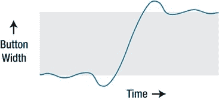
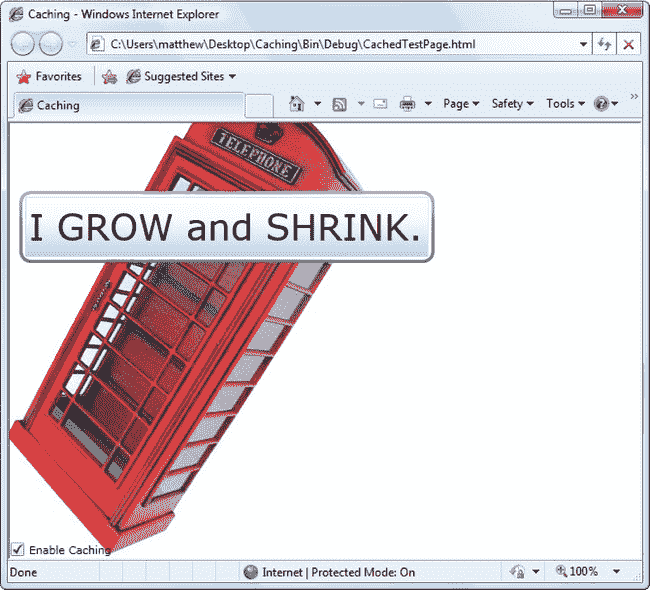

# 十、动画基础

动画允许你创建真正的动态用户界面。它通常用于应用效果，例如，当您在图标上移动时，图标会增长，旋转的徽标，滚动到视图中的文本，等等。有时，这些效果看起来像是过度的浮华。但是如果使用得当，动画可以在许多方面增强应用。它们可以使应用看起来更加灵敏、自然和直观。(例如，当你点击一个按钮时，它会滑入，感觉就像一个真实的物理按钮，而不仅仅是另一个灰色的矩形。)动画还可以将注意力吸引到重要的元素上，并引导用户过渡到新的内容。(例如，应用可以用闪烁的图标来宣传新内容。)

动画是 Silverlight 模型的核心部分。这意味着您不需要使用计时器和事件处理代码来将它们付诸行动。相反，您可以使用 XAML 标记以声明方式创建和配置它们。动画也可以无缝集成到普通的 Silverlight 页面中。例如，如果您将一个按钮制作成动画，使其在页面上浮动，该按钮的行为仍然像一个按钮。它可以被样式化，可以接收焦点，并且可以被点击来启动典型的事件处理代码。

在这一章中，你将第一次看到 Silverlight 提供的动画类。您将看到如何用 XAML 构建它们，并用代码控制它们的回放。您还将了解让您创建更加自然、逼真的动画的动画缓解工具，以及可以提高动画性能的硬件加速功能。

 **新功能** Silverlight 5 对动画的渲染方式做了一个小而显著的改进。如果使用位图缓存，可以将动画工作卸载到单独的线程。这可以确保动画流畅运行，即使用户界面线程被其他工作占用。您将在“独立动画”一节中了解更多信息

### 了解 Silverlight 动画

通常，动画被认为是一系列的帧。为了执行动画，这些帧一个接一个地显示，就像定格视频一样。

Silverlight 动画使用完全不同的模型。本质上，Silverlight 动画是一种在一段时间间隔内修改依赖属性值的方式。例如，要制作可放大和缩小的按钮，可以在动画中修改其宽度属性。为了使它闪烁，你可以改变它用作背景的 LinearGradientBrush 的属性。创建正确动画的秘诀是确定需要修改哪些属性。

如果你想做其他的改变，而这些改变是通过修改一个属性无法实现的，那你就不走运了。例如，不能在动画中添加或移除元素。类似地，你不能要求 Silverlight 在开始场景和结束场景之间执行过渡(尽管一些巧妙的变通方法可以模拟这种效果)。最后，你只能使用依赖属性的动画，因为只有依赖属性使用动态值解析系统(在第 4 章中描述)来考虑动画。

 **注** Silverlight 动画是 WPF 动画系统的缩小版。它保持了相同的概念框架，使用动画类定义动画的相同模型，以及相同的故事板系统。然而，WPF 开发者会发现一些关键的不同，特别是在代码中创建和启动动画的方式。(例如，Silverlight 元素缺少 WPF 中内置的 BeginAnimation()方法。)

**超越 SILVERLIGHT 动画**

乍一看，Silverlight 动画以属性为中心的特性似乎有很大的局限性。但是当你使用 Silverlight 时，你会发现它惊人的强大。您可以使用每个元素都支持的公共属性来创建各种动画效果。在这一章中，你甚至会看到如何用它来构建一个简单的游戏。

也就是说，在某些情况下，基于属性的动画系统并不适合。根据经验，基于属性的动画是向普通应用添加动态效果的好方法(比如发光的按钮、移动到按钮上时展开的图片等等)。但是，如果您需要将动画作为应用核心目的的一部分，并且希望它们在应用的整个生命周期中持续运行，您可能需要更灵活、更强大的东西。例如，如果您正在创建一个复杂的街机游戏或使用物理计算来模拟碰撞，您将需要更好地控制动画。

在本章的后面，你将学习如何对基于帧的动画采取一种完全不同的方法。在基于帧的动画中，您的代码每秒运行几次，每次运行时，您都有机会修改窗口的内容。有关更多信息，请参见“基于帧的动画”一节

#### 动画的规则

要理解 Silverlight 动画，您需要了解以下关键规则:

*   Silverlight 动画是基于时间的:你可以设置动画的初始状态、最终状态和持续时间。Silverlight 计算帧速率。
*   *动画作用于属性*:Silverlight 动画只能做一件事:在一段时间间隔内修改属性值。这听起来是一个很大的限制(从很多方面来说，的确如此)，但是您可以通过修改属性来创建范围惊人的效果。
*   *每种数据类型都需要不同的动画类*:比如按钮。属性使用 double 数据类型。要制作动画，可以使用 DoubleAnimation 类。如果您想要修改用于绘制画布背景的颜色，您需要使用 ColorAnimation 类。

Silverlight 的动画类相对较少，所以可以使用的数据类型有限。目前，您可以使用动画来修改以下数据类型的特性:双精度、对象、颜色和点。然而，你也可以为不同的数据类型设计你自己的动画类——你所需要做的就是从系统中派生出来。并指示该值应如何更改久而久之。

许多数据类型没有相应的动画类，因为这样不实用。一个主要的例子是枚举。例如，您可以使用 HorizontalAlignment 属性控制元素在布局面板中的放置方式，该属性采用 HorizontalAlignment 枚举中的值。但是 HorizontalAlignment 枚举只允许您在四个值(左、右、中心和拉伸)中进行选择，这极大地限制了它在动画中的使用。虽然您可以在一个方向和另一个方向之间切换，但是您不能将一个元素从一个对齐方式平滑地过渡到另一个对齐方式。因此，HorizontalAlignment 数据类型没有动画类。您可以自己构建一个，但是仍然受到枚举的四个值的约束。

引用类型通常不是动态的。但是，它们的子属性是。例如，所有内容控件都有一个背景属性，允许您设置用于绘制背景的画笔对象。使用动画从一个笔刷切换到另一个笔刷效率很低，但是可以使用动画来改变笔刷的属性。例如，您可以更改 SolidColorBrush 的 Color 属性(使用 ColorAnimation 类)或 LinearGradientBrush 中 GradientStop 的 Offset 属性(使用 DoubleAnimation 类)。这样做扩展了 Silverlight 动画的范围，允许您对元素外观的特定方面进行动画处理。

如你所见，DoubleAnimation 是 Silverlight 的动画类中最有用的。您想要更改的大多数属性都是双精度的，包括元素在画布上的位置、大小、不透明度以及它所使用的变换的属性。

### 创建简单的动画

创建动画是一个多步骤的过程。您需要创建三个独立的组件:执行动画的动画对象、管理动画的故事板，以及启动故事板的事件处理程序(事件触发器)。在接下来的部分中，您将处理这些步骤。

#### 动画课

Silverlight 包括两种类型的动画类。每种类型的动画使用不同的策略来改变属性值:

*   *线性插值*:属性值在动画持续时间内平滑连续变化。(您可以使用动画缓动来创建包含加速和减速的更复杂的运动模式，如本章后面所述。)Silverlight 包括三个这样的类:DoubleAnimation、PointAnimation 和 ColorAnimation。
*   *关键帧动画*:值可以从一个值突然跳到另一个值，或者它们可以组合跳跃和线性插值周期(有或没有动画缓动)。Silverlight 包括四个这样的类:ColorAnimationUsingKeyFrames、DoubleAnimationUsingKeyFrames、PointAnimationUsingKeyFrames 和 ObjectAnimationUsingKeyFrames。

在这一章中，您将从关注不可或缺的 DoubleAnimation 类开始，它使用线性插值将 double 从起始值更改为结束值。

动画是使用 XAML 标记定义的。虽然动画类不是元素，但是它们可以用相同的 XAML 语法创建。例如，下面是创建 DoubleAnimation 所需的标记:

`<DoubleAnimation From="160" To="300" Duration="0:0:5"></DoubleAnimation>`

这个动画持续五秒钟(如 Duration 属性所示，该属性采用格式为*小时* : *分钟* : *秒*的时间值。*分数秒*。当动画运行时，它将目标值从 160 更改为 300。因为 DoubleAnimation 使用线性插值，所以这种变化会平滑而连续地发生。

这个标记遗漏了一个重要的细节。动画显示了属性将如何改变，但没有显示使用什么属性。这个细节由另一个组件提供，这个组件由 Storyboard 类表示。

#### 故事板类

故事板管理动画的时间线。您可以使用故事板对多个动画进行分组，并且它还能够控制动画的播放—暂停、停止和更改其位置。但是 Storyboard 类提供的最基本的特性是它能够使用 TargetProperty 和 TargetName 属性指向特定的属性和特定的元素。换句话说，故事板在动画和要制作动画的属性之间架起了一座桥梁。

下面是如何定义将 DoubleAnimation 应用于名为 cmdGrow 的按钮的 Width 属性的故事板:

`<Storyboard x:Name="storyboard"
  Storyboard.TargetName="cmdGrow" Storyboard.TargetProperty="Width">
  <DoubleAnimation From="160" To="300" Duration="0:0:5"></DoubleAnimation>
</Storyboard>`

故事板。TargetProperty 属性标识要更改的属性。(在这个例子中，它是宽度。)如果您不提供类名，故事板将使用父元素。如果要设置附加属性(例如，Canvas。左边还是画布。Top)，您需要将整个属性放在括号中，如下所示:

`<Storyboard x:Name="storyboard"
  Storyboard.TargetName="cmdGrow" Storyboard.TargetProperty="**(Canvas.Left)**">
  ...
</Storyboard>`

【TargetName 和 TargetProperty 都是附加属性。这意味着您可以将它们直接应用到动画中，如下所示:

`<Storyboard x:Name="storyboard">
  <DoubleAnimation
   **Storyboard.TargetName****="cmdGrow"** **Storyboard.TargetProperty=****"Width"**
   From="160" To="300" Duration="0:0:5"></DoubleAnimation>
</Storyboard>`

这种语法更常见，因为它允许您将几个动画放在同一个故事板中，但是将每个动画设置为作用于不同的元素和属性。虽然不能用多个动画同时制作同一个属性的动画，但是可以(通常会)一次制作同一个元素的不同属性的动画。

#### 用事件触发器启动动画

定义故事板和动画是创建动画的第一步。要将这个故事板付诸实施，您需要一个事件触发器。一个*事件触发器*通过执行故事板动作来响应一个事件。Silverlight 目前支持的惟一故事板动作是 BeginStoryboard，它启动故事板(以及它包含的所有动画)。

下面的示例使用页面的 Triggers 集合将动画附加到加载的事件。当 Silverlight 内容首次在浏览器中呈现并加载页面元素时，按钮开始变大。五秒钟后，它的宽度从 160 像素扩展到 300 像素。

`<UserControl ... >
  <UserControl.Triggers>
    <EventTrigger>
      <EventTrigger.Actions>
        <BeginStoryboard>
          <Storyboard>
            <DoubleAnimation Storyboard.TargetName="cmdGrow"
             Storyboard.TargetProperty="Width"
             From="160" To="300" Duration="0:0:5"></DoubleAnimation>
          </Storyboard>
        </BeginStoryboard>
      </EventTrigger.Actions>
    </EventTrigger>
  </UserControl.Triggers>

  <Grid x:Name="LayoutRoot" Background="White">
    <Button x:Name="cmdGrow" Width="160" Height="30"
     Content="This button grows"></Button>
  </Grid>
</UserControl>`

不幸的是，Silverlight 事件触发器非常有限——比 WPF 事件触发器要少得多。目前，Silverlight 只允许事件触发器在首次创建页面时响应加载的事件。他们不能对其他事件做出反应，如点击、按键和鼠标移动。为此，您需要下一节中描述的代码。

#### 用代码启动动画

您可以使用与故事板交互的代码启动 Silverlight 动画来响应任何事件。第一步是将故事板移出触发器集合，并将其放入同一元素的另一个集合中:Resources 集合。

正如您在第 1 章中了解到的，Silverlight 元素提供了一个 Resources 属性，它保存了一个集合，您可以在其中存储各种各样的对象。Resources 集合的主要目的是让您在 XAML 中定义不是元素的对象，因此不能放在内容区域的可视布局中。例如，您可能希望将一个 Brush 对象声明为资源，以便它可以被多个元素使用。您可以在代码中检索资源，或者在标记的其他地方使用它们。

下面是一个将按钮生长动画定义为资源的示例:

`<UserControl ... >
  <UserControl.Resources>
    <Storyboard x:Name="storyboard">
      <DoubleAnimation
       Storyboard.TargetName="cmdGrow" Storyboard.TargetProperty="Width"
       From="160" To="300" Duration="0:0:5"></DoubleAnimation>
    </Storyboard>
  </UserControl.Resources>

  <Grid x:Name="LayoutRoot" Background="White">
    <Button x:Name="cmdGrow" Width="160" Height="30" Click="cmdGrow_Click"
     Content="This button grows"></Button>
  </Grid>
</UserControl>`

请注意，故事板现在有了一个名称，因此您可以在代码中操作它。(如果您想在启动动画之前以编程方式调整 DoubleAnimation 的属性，也可以为其添加一个名称。)

现在，您需要在 Silverlight 代码隐藏文件的事件处理程序中调用 Storyboard 对象的方法。您可以使用的方法包括 Begin()、Stop()、Pause()、Resume()和 Seek()，所有这些方法都是不言自明的。

`private void cmdGrow_Click(object sender, RoutedEventArgs e)
{
    storyboard.Begin();
}`

点击按钮启动动画，按钮从 160 像素拉伸到 300 像素，如图[图 10-1](#fig_10_1) 所示。

***图 10-1。**制作按钮宽度的动画*

#### 配置动画属性

为了最大限度地利用动画，您需要仔细查看在前面的示例中设置的看似简单的动画类属性，包括 From、To 和 Duration。正如您将看到的，比您最初预期的要微妙得多，也有更多的可能性。

##### 从

“从”值是起始值。在前面的示例中，动画从 160 像素开始。因此，每次单击按钮并启动动画时，Width 属性都会重置为 160，动画会再次运行。即使您在动画播放过程中点击了按钮，也是如此。

注意这个例子展示了关于 Silverlight 动画的另一个细节:每个依赖属性一次只能被一个动画作用。如果开始第二个动画，第一个会被丢弃。

在许多情况下，您不希望动画从原始值开始。有两个常见的原因:

*   *你有一个可以连续触发多次的动画，以获得累积效果*:例如，你可能想要创建一个按钮，每次点击它时，它都会增长一点。
*   *您拥有可以重叠*的动画:例如，您可以使用 MouseEnter 事件触发一个展开按钮的动画，使用 MouseLeave 事件触发一个收缩按钮的补充动画。(这通常被称为*鱼眼*效应。)如果您在这种按钮上快速连续移动鼠标几次，每个新的动画都会打断前一个动画，导致按钮跳回到由 From 属性设置的大小。

如果您在按钮增长示例中省略了 From 值，您可以多次单击该按钮，而无需重置其进度。每次，一个新的动画开始，但它从当前宽度继续。当按钮达到其最大宽度时，进一步的单击没有效果，除非您添加另一个动画来收缩它。

`<DoubleAnimation Storyboard.TargetName="cmdGrow"
 Storyboard.TargetProperty="Width" To="300" Duration="0:0:5"></DoubleAnimation>`

有一个条件。为了使这种技术有效，您正在设置动画的属性必须有一个预先设置的值。在本例中，这意味着按钮必须具有硬编码的宽度(无论是直接在按钮标签中定义还是通过样式设置器应用)。问题是，在许多布局容器中，通常不指定宽度，而是允许容器根据元素的对齐属性来控制宽度。在这种情况下，将应用默认宽度，即特殊值 Double。NaN(其中 NaN 代表“不是一个数”)。不能使用线性插值来制作具有该值的属性的动画。

解决办法是什么？在许多情况下，答案是硬编码按钮的宽度。正如您将看到的，动画通常需要比其他方式更细粒度的元素大小和位置控制。可制作动画的内容最常见的布局容器是画布，因为它使移动内容(可能有重叠)和调整内容大小变得容易。画布也是最轻量级的布局容器，因为当您更改 Width 这样的属性时，不需要额外的布局工作。

在当前示例中，您有另一个选择。您可以使用按钮的 ActualWidth 属性检索按钮的当前值，该属性指示当前呈现的宽度。不能制作 ActualWidth 动画(它是只读的)，但可以在开始动画之前用它以编程方式设置动画的 From 属性。

当使用当前值作为动画的起点时，需要注意另一个问题:这样做可能会改变动画的速度。这是因为持续时间没有考虑初始值和最终值之间的较小差异而进行调整。例如，假设您创建了一个不使用 From 值的按钮，而是从其当前位置开始制作动画。如果您在按钮几乎达到其最大宽度时单击该按钮，将开始一个新的动画。该动画被配置为花费五秒钟(通过 Duration 属性)，即使只剩下几个像素。因此，按钮的增长速度似乎变慢了。

只有当您重新启动一个几乎完成的动画时，这个效果才会出现。虽然这有点奇怪，但大多数开发人员都懒得尝试围绕它进行编码。相反，这被认为是一种可以接受的怪癖。

##### 到

正如您可以省略 From 属性一样，您也可以省略 To 属性。您可以省略“从”和“到”属性来创建这样的动画:

`<DoubleAnimation Storyboard.TargetName="cmdGrow"
 Storyboard.TargetProperty="Width" Duration="0:0:5"></DoubleAnimation>`

乍一看，这个动画似乎是一个冗长的什么都不做的方法。合乎逻辑的假设是，因为 to 和 From 属性都被省略了，所以它们都使用相同的值。但是有一个微妙而重要的区别。

当您退出时，动画将使用当前值并考虑动画。例如，如果按钮处于增长操作的中途，From 值将使用扩展的宽度。然而，当忽略 To 时，动画使用当前值*，而不考虑动画*。本质上，这意味着 To 值变成了原来的*值——无论您最后在代码中、元素标签上或者通过样式设置了什么。(这要归功于 Silverlight 的属性解析系统，,它能够根据几个重叠的属性提供者计算属性的价值，而不会丢弃任何信息。第 4 章更详细地描述了这个系统。)*

在按钮示例中，如果您开始一个增长动画，然后用前面显示的动画中断它(可能通过单击另一个按钮)，按钮将从其部分扩展的大小收缩，直到达到 XAML 标记中设置的原始宽度。另一方面，如果在没有其他动画运行时运行这段代码，什么也不会发生。这是因为“从”值(动画宽度)和“到”值(原始宽度)是相同的。

##### 经过

您可以使用 By 属性，而不是使用 To。By 属性用于创建一个动画，它将值*改变*一个设定的量，而不是将*改变为*一个特定的目标。例如，您可以创建一个动画，将按钮放大到比其当前大小大 10 个像素，如下所示:

`<DoubleAnimation Storyboard.TargetName="cmdGrow" By**="10"**
 Storyboard.TargetProperty="Width" Duration="0:0:5"></DoubleAnimation>`

单击此按钮总是会放大按钮，无论您运行动画多少次，按钮已经变得多大。

并非所有动画类都提供 By 属性。例如，它对非数字数据类型没有意义，比如颜色结构(如 ColorAnimation 所使用的)。

##### 持续时间

Duration 属性很简单——它获取动画开始和结束之间的时间间隔(以毫秒、分钟、小时或您想使用的任何值为单位)。Duration 属性需要一个 Duration 对象，类似于 TimeSpan。事实上，持续时间结构定义了一个可以转换系统的隐式转换。对象到系统的时间跨度。所需的 Windows.Duration 对象。这就是为什么像这样的代码是合理的:

`widthAnimation.Duration = TimeSpan.FromSeconds(5);`

那么，为什么微软要费心引入一个全新的持续时间类型，而不是仅仅使用标准的时间跨度呢？Duration 类型可以设置为两个不能由 TimeSpan 对象表示的特殊值:Duration。Automatic 和 Duration.Forever。这两个值在当前示例中都没有用。“自动”将动画设置为 1 秒的持续时间，而“永远”使动画的长度无限长，这将阻止它产生任何效果。

但是持续时间。如果您正在创建一个可逆的动画,“永远”会变得很有用。为此，请将 AutoReverse 属性设置为 true。现在，动画将在完成后反向播放，恢复到原始值(动画花费的时间加倍)。因为可逆动画会返回到其初始状态，即持续时间。永远是有意义的——它迫使动画无休止地重复。

#### 动画寿命

从技术上讲，Silverlight 动画是临时的，这意味着它们不会改变底层属性的值。当动画处于活动状态时，它会覆盖属性值。这是因为依赖属性的工作方式(正如在[第 4 章](04.html#ch4)中所描述的)，这是一个经常被忽视的细节，可能会导致严重的混乱。

单向动画(如按钮增长动画)在完成运行后仍保持活动状态。这是因为动画需要将按钮的宽度保持在新的大小。这可能导致一个不寻常的问题:如果你试图在动画完成后使用代码修改属性值，你的代码将看起来没有效果。您的代码为属性分配一个新的本地值，但动画值仍然优先。

您可以通过几种方式来解决这个问题，这取决于您想要实现的目标:

*   *创建一个动画，将你的元素重置为它的原始状态*:你可以通过不设置 to 属性来实现。例如，按钮收缩动画将按钮的宽度缩小到其上次设置的大小，之后您可以在代码中更改它。
*   *创建可逆动画*:通过将 AutoReverse 属性设置为 true 来实现。例如，当按钮增长动画完成加宽按钮时，它将反向播放动画，将其恢复到原始宽度。你的动画的总时长翻倍。
*   *更改 FillBehavior 属性*:通常 FillBehavior 设置为 HoldEnd，这意味着当一个动画结束时，它会继续将其最终值应用到 target 属性。如果将 FillBehavior 更改为 Stop，则动画一结束，该属性就恢复为其原始值。
*   *动画结束时移除动画对象*:为此，处理动画对象或包含故事板的 Completed 事件。

前三个选项会改变动画的行为。无论如何，它们会将动画属性返回到其原始值。如果这不是你想要的，你需要使用最后一个选项。

首先，在启动动画之前，附加一个事件处理程序，在动画结束时做出反应。当页面首次加载时，您可以这样做:

`storyboard.Completed += storyboard_Completed;`

当 Completed 事件触发时，您可以检索控制动画的故事板并停止它:

`private void storyboard_Completed(object sender, EventArgs e)
{
    Storyboard storyboard = (Storyboard)sender;
    storyboard.Stop();
}`

当你调用故事板的时候。Stop()，属性返回到动画开始前的值。如果这不是您想要的，您可以记下动画应用的当前值，删除动画，然后手动设置新属性:

`double currentWidth = cmdGrow.Width;
storyboard.Stop();
cmdGrow.Width = currentWidth;`

请记住，这将更改属性的本地值。这可能会影响其他动画的工作方式。例如，如果您使用未指定 From 属性的动画来制作此按钮的动画，它会使用这个新应用的值作为起点。在大多数情况下，这是您想要的行为。

##### 重复行为

RepeatBehavior 属性允许您控制动画的重复方式。如果您想要重复固定的次数，请指出要重复的次数，后面加上一个 *x* 。例如，此动画重复两次:

`<DoubleAnimation Storyboard.TargetName="cmdGrow" RepeatBehavior`**="2x"** `Storyboard.TargetProperty="Width" To="300" Duration="0:0:5"></DoubleAnimation>`

或者在代码中，将次数传递给 RepeatBehavior 构造函数:

`widthAnimation.RepeatBehavior = new RepeatBehavior(2);`

当您运行此动画时，按钮的大小会增加(超过五秒)，跳回其原始值，然后再次增加大小(超过五秒)，在页面的全宽处结束。如果您已经将 AutoReverse 设置为 true，则行为略有不同:整个动画向前和向后完成(意味着按钮扩展然后收缩)，然后*然后*再次重复。

与其使用 RepeatBehavior 来设置重复计数，不如使用它来设置重复*间隔*。为此，请使用时间值而不是单个数字来设置 RepeatBehavior 属性。例如，以下动画重复播放 13 秒钟:

`<DoubleAnimation Storyboard.TargetName="cmdGrow" RepeatBehavior**="0:0:13"**
 Storyboard.TargetProperty="Width" To="300" Duration="0:0:5"></DoubleAnimation>`

这是在代码中做的同样的改变:

`widthAnimation.RepeatBehavior = new RepeatBehavior(TimeSpan.FromSeconds(13));`

在本例中，Duration 属性指定整个动画需要 5 秒钟。因此，13 秒的 RepeatBehavior 触发两次重复，然后在第三次重复的中途离开按钮(在 3 秒标记处)。

 **提示**你可以使用 RepeatBehavior 来执行动画的一部分。为此，请使用分数的重复次数，或者使用小于持续时间的时间跨度。

最后，您可以使用 RepeatBehavior 使动画无休止地重复自身。永久价值:

`<DoubleAnimation Storyboard.TargetName="cmdGrow" RepeatBehavior**="Forever"**
 Storyboard.TargetProperty="Width" To="300" Duration="0:0:5"></DoubleAnimation>`

#### 同步动画

Storyboard 类能够容纳多个动画。最棒的是，这些动画是作为一个组来管理的，这意味着它们是同时开始的。

要查看示例，请考虑下面的故事板。它包装了两个动画，一个作用于按钮的 Width 属性，另一个作用于 Height 属性。因为动画被分组到一个故事板中，所以它们一致地增加按钮的尺寸:

`<Storyboard x:Name="storyboard" Storyboard.TargetName="cmdGrow">` `  <DoubleAnimation Storyboard.TargetProperty="Width"
   To="300" Duration="0:0:5"></DoubleAnimation>
  <DoubleAnimation Storyboard.TargetProperty="Height"
   To="300" Duration="0:0:5"></DoubleAnimation>
</Storyboard>`

这个例子移动故事板。从 DoubleAnimation 到 Storyboard 的 TargetName 属性。这是一个可选的更改，但它使您不必设置属性两次，每个动画对象一次。(显然，如果你的动画对象需要作用于不同的元素，你不能使用这个快捷键。)

在这个例子中，两个动画有相同的持续时间，但这不是必需的。对于在不同时间结束的动画，唯一要考虑的是它们的 FillBehavior。如果动画的 FillBehavior 属性设置为 HoldEnd(默认值)，它将保持该值，直到故事板中的所有动画完成。此时，故事板的 FillBehavior 开始生效，或者继续保存两个动画的值(HoldEnd ),或者将它们恢复到初始值(Stop)。另一方面，如果您有多个动画，并且其中一个动画的 FillBehavior 为 Stop，则当动画完成时，即使故事板中的其他动画仍在运行，该动画属性也将恢复为其初始值。

当您处理多个同步动画时，另外两个动画类属性变得有用:BeginTime 和 SpeedRatio。BeginTime 设置动画开始前添加的延迟(作为时间跨度)。该延迟会添加到总时间中，因此一个五秒延迟的五秒动画需要十秒。当您同步同时开始的不同动画时，BeginTime 很有用，但应该按顺序应用它们的效果。SpeedRatio 增加或减少动画的速度。通常，速比为 1。如果增加该值，动画会更快地完成(例如，SpeedRatio 为 5 时，完成速度会快五倍)。如果减小，动画会变慢(例如，0.5 的 SpeedRatio 需要两倍的时间)。虽然整体效果与更改动画的持续时间属性相同，但设置 SpeedRatio 可以更容易地控制同步动画的重叠方式。

#### 控制播放

您已经看到了如何使用故事板开始动画。Begin()方法。Storyboard 类还提供了一些允许您停止或暂停动画的方法。你将在下面的例子中看到它们的作用，如图[图 10-2](#fig_10_2) 所示。该页面使用网格在完全相同的位置叠加两个图像元素。最初，只有最上面的图像——显示了多伦多市地标的白天场景——是可见的。但是随着动画的运行，它将不透明度从 1 降低到 0，最终允许夜景完全显示出来。这种效果使图像看起来从白天到夜晚都在变化，就像一系列延时摄影。

***图 10-2。**一部可控动画*

下面是用两个图像定义网格的标记:

`<Grid>
  <Image Source="night.jpg"></Image>
  <Image Source="day.jpg" x:Name="imgDay"></Image>
</Grid>`

这是从一个渐变到另一个的故事板，它位于页面的资源集合中:

`<Storyboard x:Name="fadeStoryboard">
  <DoubleAnimation x:Name="fadeAnimation"
    Storyboard.TargetName="imgDay" Storyboard.TargetProperty="Opacity"
    From="1" To="0" Duration="0:0:10">
  </DoubleAnimation>
</Storyboard>`

为了让这个例子更有趣，它在底部包括了几个按钮，让你控制这个动画的回放。使用这些按钮，您可以执行典型的媒体播放器操作，例如开始、暂停、继续、停止和搜索。事件处理代码使用 Storyboard 对象的适当方法，如下所示:

`private void cmdStart_Click(object sender, RoutedEventArgs e)
{
    fadeStoryboard.Begin();
}` `private void cmdPause_Click(object sender, RoutedEventArgs e)
{
    fadeStoryboard.Pause();
}

private void cmdResume_Click(object sender, RoutedEventArgs e)
{
    fadeStoryboard.Resume();
}

private void cmdStop_Click(object sender, RoutedEventArgs e)
{
    fadeStoryboard.Stop();
}

private void cmdMiddle_Click(object sender, RoutedEventArgs e)
{
    // Start the animation, in case it's not currently underway.
    fadeStoryboard.Begin();

    // Move to the time position that represents the middle of the animation.
    fadeStoryboard.Seek(
      TimeSpan.FromSeconds(fadeAnimation.Duration.TimeSpan.TotalSeconds/2));
}`

 **注意**记住，停止动画并不等同于完成动画(除非 FillBehavior 设置为 Stop)。这是因为即使当动画到达其时间轴的末尾时，它仍会继续应用其最终值。同样，当动画暂停时，它会继续应用最近的中间值。但是，当动画停止时，它不再应用任何值，并且该属性恢复为其动画前的值。

如果拖动滑块上的滑块，滑块。ValueChanged 事件激发并触发另一个事件处理程序。然后，此事件处理程序获取滑块的当前值(范围从 0 到 3 ),并使用它来应用新的速度比:

`private void sldSpeed_ValueChanged(object sender, RoutedEventArgs e)
{
    // To nothing if the page is still being initialized.
    if (sldSpeed == null) return;

    // This also restarts the animation if it's currently underway.
    fadeStoryboard.SpeedRatio = sldSpeed.Value;
    lblSpeed.Text = sldSpeed.Value.ToString("0.0");
}`

与 WPF 不同，Silverlight 中的 Storyboard 类不提供允许您监控事件进度的事件。例如，没有 CurrentTimeInvalidated 事件告诉您动画正在向前播放。

### 动画缓和

线性动画的一个缺点就是经常感觉机械不自然。相比之下，复杂的用户界面具有模拟真实世界系统的动画效果。例如，他们可能使用触觉按钮，当点击时会快速跳回，但当它们停止时会慢下来，从而产生真实运动的幻觉。或者，他们可以像 Windows Vista 一样使用最大化和最小化效果，当窗口接近其最终大小时，窗口增大或缩小的速度会加快。这些细节是微妙的，当它们被很好地实现时，你不太可能注意到它们。然而，你几乎肯定会注意到缺乏这些优点的不太精致的动画的笨拙感觉。

改进你的动画和创造更自然的动画的秘密是改变变化的速度。与其创建以固定不变的速率改变属性的动画，不如设计可以加速或减速的动画。Silverlight 为您提供了几个不错的选择。

对于大多数控制，您可以创建一个基于帧的动画(稍后在“基于帧的动画”一节中讨论)。如果您必须绝对控制每个细节，这种方法非常有用，如果您的动画需要以特定的方式运行(例如，动作游戏或遵循物理规则的模拟)，就是这种情况。缺点是基于帧的动画需要大量的工作，因为 Silverlight 动画模型对你没有什么帮助。

如果你的动画不太严肃，而你只是想让它们看起来更专业，你可以使用更简单的方法。一个选项是关键帧动画，它将动画分为多个片段，并(可选)使用关键样条线为不同的片段添加加速或减速。这种方法效果很好(您将在“关键帧动画”一节中了解到)。但是实现起来很繁琐，并且经常需要大量的 XAML 标记。当您使用某种设计工具来帮助您创建关键帧和关键样条线时，这是最有意义的，例如，通过在图形上绘制，就像在 Expression Blend 中一样。

如果您没有像 Expression Blend 这样的设计工具，或者您不想麻烦地点击复杂的关键帧动画，您还有一个选择:您可以使用预建的动画缓动功能。在这种情况下，您仍然可以通过指定 starting 和 ending 属性值来正常定义动画。但是除了这些细节之外，您可以添加一个现成的数学函数来改变动画的进度，使其在不同的点加速或减速。这是您将在接下来的部分中学习的技术。

#### 使用缓动功能

动画缓解最大的好处是，它比其他方法(如基于帧的动画和关键帧)需要更少的工作。若要使用动画缓动，请使用缓动函数类(从 EasingFunctionBase 派生的类)的实例设置动画对象的 EasingFunction 属性。您通常需要在缓动函数上设置一些属性，并且您可能被迫尝试不同的设置来获得您想要的效果，但是您不需要任何代码和很少的额外 XAML。

例如，考虑这里显示的两个动画，它们作用于一个按钮。当用户将鼠标移到按钮上时，一小段代码调用 growStoryboard 动画，将按钮拉伸到 400 像素。当用户将鼠标从按钮上移开时，按钮会收缩回正常大小。

`<Storyboard x:Name="growStoryboard">
  <DoubleAnimation
   Storyboard.TargetName="cmdGrow" Storyboard.TargetProperty="Width"
   To="400" Duration="0:0:1.5"></DoubleAnimation>
</Storyboard>` `<Storyboard x:Name="revertStoryboard">
  <DoubleAnimation
   Storyboard.TargetName="cmdGrow" Storyboard.TargetProperty="Width"
   Duration="0:0:3"></DoubleAnimation>
</Storyboard>`

现在，动画使用线性插值，这意味着增长和收缩以稳定、机械的方式发生。要获得更自然的效果，您可以添加缓动功能。以下示例添加了一个名为 ElasticEase 的缓动函数。最终结果是，按钮弹回超过其完整大小，弹回到稍小的值，再次摆动回到其完整大小(但比之前小一点)，弹回到稍小一点，以此类推，随着移动的减少重复其弹回模式。十次振荡后，它逐渐停止。振荡属性控制末端的反弹次数。ElasticEase 类提供了本例中没有用到的另一个属性:弹性。该值越高，每个后续振荡减弱得越厉害(默认值为 3)。

`<Storyboard x:Name="growStoryboard">
  <DoubleAnimation
   Storyboard.TargetName="cmdGrow" Storyboard.TargetProperty="Width"
   To="400" Duration="0:0:1.5">
    **<****DoubleAnimation.EasingFunction****>**
      **<****ElasticEase** **EasingMode****="EaseOut"** **Oscillations****="10"></****ElasticEase****>**
    **</****DoubleAnimation.EasingFunction****>**
  </DoubleAnimation>
</Storyboard>`

要真正体会这个标记和前面没有使用缓动功能的例子之间的区别，您需要尝试一下这个动画(或者运行本章的配套例子)。这是一个显著的变化。有了 XAML 的一句台词，一个简单的动画就从业余爱好者变成了专业应用中的流畅效果。

 **注意**因为 EasingFunction 属性接受单个缓动函数对象，所以不能为同一个动画组合不同的缓动函数。

#### 渐进渐出

在考虑不同的缓动函数之前，理解*何时应用*缓动函数是很重要的。每个缓动函数类都从 EasingFunctionBase 派生，并继承一个名为 EasingMode 的属性。该属性有三个可能的值:EaseIn(这意味着效果应用于动画的开头)、EaseOut(这意味着效果应用于结尾)和 EaseInOut(这意味着效果同时应用于开头和结尾，缓入发生在动画的前半部分，缓出发生在后半部分)。

在前面的示例中，growStoryboard 动画中的动画使用 EaseOut 模式。因此，反弹逐渐减少的序列发生在动画的结尾。如果你在动画进行过程中绘制按钮宽度的变化，你会看到类似于图 10-3 所示的图形。

***图 10-3。**使用 EaseOut with ElasticEase 停止振荡到停止*

 **注意**应用缓动功能时，动画的持续时间不会改变。对于 growStoryboard 动画，ElasticEase 函数不仅仅改变动画结束的方式，它还使动画的初始部分(当按钮正常扩展时)运行得更快，以便在结束时有更多的时间振荡。

如果将 ElasticEase 功能切换为使用 EaseIn 模式，反弹会在动画开始时发生。按钮收缩到起始值以下一点，扩张一点，再收缩一点，并继续这种逐渐增加振荡的模式，直到它最终挣脱并扩张剩余的部分。(你用橡皮筋。振荡属性来控制反弹的次数。)[图 10-4](#fig_10_4) 显示了这种非常不同的运动模式。

***图 10-4。**使用 EaseIn with ElasticEase 开始振荡*

最后，EaseInOut 创建了一个更奇怪的效果，在前半部分开始动画的振荡，在后半部分停止动画的振荡。[图 10-5](#fig_10_5) 说明了。

***图 10-5。**使用 EaseInOut 和 ElasticEase 摆动到起点和终点*

#### 缓动功能类

Silverlight 有 11 个缓动函数，这些函数都在我们熟悉的系统中。Windows.Media.Animation 命名空间。表 10-1 描述了它们，并列出了它们的重要特性。请记住，每个动画还提供 EasingMode 属性，该属性允许您控制它是否在动画开始(EaseIn)、结束(EaseOut)或两者(EaseInOut)时影响动画。

许多缓动功能提供相似但略有不同的结果。要成功使用动画缓动，您需要决定使用哪个缓动功能以及如何配置它。通常，这个过程需要一些反复试验。两个好的资源可以帮助你。

首先，Silverlight 文档绘制了每个缓动函数的示例行为，展示了动画值如何随着时间的推移而变化。查看这些图表是一个很好的方法，可以让你了解放松功能的作用。[图 10-6](#fig_10_6) 显示了最流行的缓动功能的图表。

***图 10-6。**不同缓解功能的效果*

其次，Microsoft 提供了几个示例应用，您可以使用它们来玩不同的缓动功能并尝试不同的属性值。其中最有用的是让你观察任何缓动函数在下落方块上的效果，以及复制该效果所需的自动生成的 XAML 标记。可以在`[http://tinyurl.com/animationeasing](http://tinyurl.com/animationeasing)`在线试用。

### 动画表演

通常，动画用户界面只需要创建和配置正确的动画和故事板对象。但是在其他情况下，尤其是多个动画同时发生的情况下，您可能需要更加关注性能。某些效果更有可能导致这些问题，例如，涉及视频、大位图和多级透明度的效果通常对计算机 CPU 的要求更高。如果不小心实现，它们可能会运行得很不平稳，或者从同时运行的其他应用那里窃取 CPU 时间。

幸运的是，Silverlight 有一些技巧可以帮助您。在下面几节中，您将学习降低最大帧速率和在计算机的视频卡上使用缓存位图，这两种技术可以减轻 CPU 的负载。您还将了解一些诊断技巧，这些技巧可以帮助您确定动画是以最佳状态运行还是面临潜在问题。

#### 期望的帧速率

正如您已经了解到的，Silverlight 动画的大部分都使用插值，这可以从属性的起点到终点平滑地修改属性。例如，如果将起始值设置为 1，结束值设置为 10，则属性可能会从 1 快速变为 1.1、1.2、1.3 等等，直到值达到 10。

您可能想知道 Silverlight 在执行插值时如何确定它使用的增量。令人高兴的是，这个细节是自动处理的。Silverlight 使用它需要的任何增量来确保在当前配置的帧速率下的平滑动画。Silverlight 使用的标准帧速率是每秒 60 帧。换句话说，每 1/60 秒，Silverlight 计算所有动画值并更新相应的属性。每秒 60 帧的速率可确保动画从头到尾流畅流畅。(当然，Silverlight 可能无法实现其意图，这取决于其性能和客户端的硬件。)

Silverlight 使您可以降低帧速率。如果你知道你的动画在较低的帧速率下看起来很好，你可以选择这样做，这样你就不会浪费额外的 CPU 周期。或者，您可能会发现，当动画以较低的帧速率运行时，它在性能较低的计算机上表现得更好。在网络上，许多动画以每秒 15 帧的速度运行。

要调整帧速率，您需要将 maxFramerate 参数添加到应用的入口页，如下所示:

`

  <object data="data:application/x-silverlight-2,"
   type="application/x-silverlight-2" width="100%" height="100%">
    **<****param** **name****="maxFramerate"** **value****="15" />**
    ...
  </object>
  <iframe style="visibility:hidden;height:0;width:0;border:0px"></iframe>

`

 **提示**为了获得最佳的动画效果，请谨慎使用透明度，避免动画显示文本大小(因为字体平滑和提示会降低性能)，并且不要使用[第 9 章](09.html#ch9)中讨论的无窗口设置(它让 HTML 元素通过 Silverlight 内容区域显示)。

#### 硬件加速

图形编程的圣杯是将大部分工作卸载到计算机显卡上的图形处理单元(GPU)。毕竟，显卡是特别设计的，能够快速有效地处理某些类型的图形任务(例如，位图缩放)。但是当运行一个典型的 web 应用时，你的显卡几乎不能工作。当然，争取他们的帮助并释放更有价值的 CPU 是有意义的。

 **注意**从技术上来说，将工作卸载到 GPU 上被称为*硬件加速*，因为这种技术可以加速复杂的视频任务，如尖端计算机游戏中的 3d 渲染。在 Silverlight 应用中，硬件加速可以减少 CPU 的负载，并且可以提高动画的帧速率(使它们运行得更流畅)。

不幸的是，实现硬件加速并不像看起来那么容易。第一个问题是硬件加速需要在运行应用的平台上有一层额外的显卡支持。对于在 Windows 计算机上运行的 Silverlight 应用，这意味着您需要 DirectX 9 兼容的显卡和驱动程序。在 Mac OS X 上，你需要一个带驱动程序的 OpenGL2 兼容显卡。此外，只有当你的应用以全屏模式运行时，硬件加速才能在 Mac 硬件上工作(如第 3 章中所述)。Silverlight 的 Windows 实现没有同样的限制。

第二个问题是显卡是为了加速某些特定的图形操作而设计的(例如，构成 3D 场景的小三角形中的阴影)。这些优化中有许多不适合 Silverlight 应用。事实上，Silverlight 应用只使用一种类型的优化:视频卡将一些视觉元素缓存为位图的能力。其他类型的硬件加速也是可能的，但是目前还没有在 Silverlight 中实现。

##### 启用硬件加速

`Before you can even consider using hardware acceleration in a portion of your application, you need to configure the test page to support it. You do this by adding the enableGPUAcceleration parameter and setting it true, as shown here:

  <object data="data:application/x-silverlight-2,"
   type="application/x-silverlight-2" width="100%" height="100%">
    **<****param** **name****="enableGPUAcceleration"** **value****="true" />**
    <param name="enableCacheVisualization" value="true" />
    <param name="enableFrameRateCounter" value="true" />
    ...` `  </object>
  <iframe style="visibility:hidden;height:0;width:0;border:0px"></iframe>

`

您会注意到这个示例还添加了两个与硬件加速协同工作的可选参数。enableCacheVisualization 参数使用着色来突出显示应用中没有利用视频卡上位图缓存的区域。enableFrameRateCounter 参数显示帧速率计数器，该计数器会随着动画的运行而不断更新。这两个参数为您提供了有用的诊断工具，允许您在测试期间评估性能。您将在应用的最终版本中移除它们。

设置 enableGPUAcceleration 属性不会立即生效。它使您能够为单个元素打开位图缓存。但是，在采取这一步骤之前，您不会注意到应用的性能有任何变化。

##### 位图缓存

位图缓存告诉 Silverlight 获取当前内容的位图图像，并将其复制到视频卡的内存中。从这一点开始，视频卡可以负责处理位图和刷新显示。这个过程比让 Silverlight 运行时完成所有工作并与视频卡持续通信要快得多。

然而，有一个问题。视频卡在处理位图时受到限制。它支持以下操作:

*   使用 RenderTransform 缩放、旋转、移动或倾斜位图
*   使用透视变换对位图应用三维效果(使用 Projection 属性)
*   更改位图的不透明度(使用不透明度属性)
*   用矩形剪辑区域剪辑位图(使用 Clip 属性)

因此，如果您有在元素上执行缩放、旋转或淡入淡出的动画，您将从硬件加速中受益。然而，如果你的动画做了其他事情来改变元素的外观——例如，改变它的颜色，应用像素着色器，等等，你肯定应该*而不是*使用位图缓存。在这种情况下，Silverlight 将被迫不断地将位图的更新副本传递回视频卡，每秒更新几次缓存。这个过程实际上会*降低*的性能。

若要打开位图缓存，请将相应元素的 CacheMode 属性设置为 BitmapCache。每个元素都提供这个属性，这意味着您可以精确地选择哪些元素使用这个特性。

 **注意**如果你缓存一个包含其他元素的元素，比如一个布局容器，所有的元素都会被缓存在一个位图中。因此，在将缓存添加到画布之类的东西时，您需要非常小心——只有在所有子元素都被限制为前面列表中允许的转换时才这样做。

为了更好地理解，举一个简单的例子会有所帮助。[图 10-7](#fig_10_7) 显示了一个包含在本章可下载样本中的项目。这里，有两个动画在起作用。第一个旋转包含电话亭图片的图像元素。第二个使用 ScaleTransform 改变按钮的大小，不断地扩大和缩小它。这两个动画都是位图缓存的明确候选对象。

***图 10-7。**带有两个动画元素的测试页面*

以下是为两者打开位图缓存的标记:

`<Canvas>
  <Image x:Name="img" Source="phone_booth.jpg" Stretch="None"
   **CacheMode****="BitmapCache"**>
    <Image.RenderTransform>
      <RotateTransform x:Name="rotateTransform"></RotateTransform>
    </Image.RenderTransform>
  </Image>

  <Button x:Name="cmd" Content="I GROW and SHRINK." Canvas.Top="70" Canvas.Left="10"
   **CacheMode****="BitmapCache"**>
    <Button.RenderTransform>
      <ScaleTransform x:Name="scaleTransform"></ScaleTransform>
    </Button.RenderTransform>` `  </Button>
</Canvas>`

下面是声明动画的标记:

`<Storyboard x:Name="storyboard">
  <DoubleAnimation Storyboard.TargetName="rotateTransform"
   Storyboard.TargetProperty="Angle" To="360" Duration="0:0:2"
   RepeatBehavior="Forever"></DoubleAnimation>
  <DoubleAnimation Storyboard.TargetName="scaleTransform"
   Storyboard.TargetProperty="ScaleX" AutoReverse="True"
   To="20" Duration="0:0:1.8" RepeatBehavior="Forever"></DoubleAnimation>
  <DoubleAnimation Storyboard.TargetName="scaleTransform"
   Storyboard.TargetProperty="ScaleY" AutoReverse="True"
   To="20" Duration="0:0:1.8" RepeatBehavior="Forever"></DoubleAnimation>
</Storyboard>`

位图缓存有一个潜在的问题。通常，当您启用位图缓存时，Silverlight 会以当前大小拍摄元素的快照，并将该位图复制到视频卡。如果您随后使用 ScaleTransform 来放大位图，您将放大缓存的位图，而不是实际的元素。在当前的例子中，这意味着按钮将随着它的增长而变得模糊和像素化。

要解决这个问题，您可以完全打开位图缓存(在这种情况下，效果会消失，因为 Silverlight 将按钮和其他元素视为完全可调整大小的矢量图像)。但是，另一个选项是使用 BitmapCache 显式指示 Silverlight 应该在视频卡上缓存的位图大小。RenderAtScale 属性。通常，此属性设置为 1，并且元素采用其当前大小。但是这里的标记以当前大小的五倍拍摄了按钮的快照:

`<Button x:Name="cmd" Content="I GROW and SHRINK." Canvas.Top="70" Canvas.Left="10">
  <Button.CacheMode>
    **<****BitmapCache****RenderAtScale****="5"></****BitmapCache****>**
  **</****Button.CacheMode****>**
  <Button.RenderTransform>
    <ScaleTransform x:Name="scaleTransform"></ScaleTransform>
  </Button.RenderTransform>
</Button>`

这解决了像素化问题。缓存的位图仍然小于按钮的最大动画大小(达到其原始大小的十倍)，但视频卡能够将位图的大小从五倍增加到十倍，而没有任何明显的缩放瑕疵。增加 RenderAtScale 属性只有两个潜在的缺点。首先，您强制 Silverlight 向视频卡传输更多的数据(这会减慢最初的渲染步骤)。第二，您要求显卡使用更多的板载显存。不同的视频卡有不同的内存量，当可用内存用完时，视频卡将无法缓存更多的位图，Silverlight 将依靠软件渲染。

##### 评估硬件加速

评估位图缓存成功与否的最简单方法是在有和没有硬件加速的情况下运行您的应用。在大多数情况下，直到您检查计算机的 CPU 使用率或动画的帧速率时，这种差异才会变得明显。要检查 CPU 使用情况，请加载任务管理器并观察性能选项卡。在前一个例子的非正式测试中，当打开缓存时，单处理器计算机上的 CPU 使用率从大约 50%下降到大约 20%。本章的可下载示例包括一个允许您使用复选框打开和关闭缓存的示例。使用如下代码以编程方式执行更改:

`img.CacheMode = new BitmapCache();`

另一个有用的工具是 Silverlight 的内置诊断支持。前面，您了解了 enableCacheVisualization 和 enableFrameRateCounter 参数，您可以将它们添加到您的测试页面中，以捕获一些额外的诊断信息。[图 10-8](#fig_10_8) 显示了两个参数都打开而缓存关闭的例子。

   

***图 10-8。**使用缓存可视化和帧速率计数器*

这里，图像和按钮元素被染成红色，表示它们没有被缓存(这要归功于 enableCacheVisualization)。左上角的一组数字提供了帧速率信息(多亏了 enableFrameRateCounter)，如下所示:

*   第一个数字显示动画帧速率。当不使用位图缓存时，该数值往往波动更大，并在动画的最复杂部分下降。
*   第二个数字显示使用了多少千字节的显卡内存。当缓存打开时，这种情况会增加。
*   第三个数字显示硬件加速表面的总数。请记住，为一个元素打开位图缓存通常会影响几个表面——即使在按钮的情况下，也有一个包含内容的 TextBlock。
*   第四个数字显示了隐式硬件加速表面的数量。在某些情况下，打开一个元素的缓存可能需要打开另一个元素的缓存(例如，如果第二个元素与第一个元素重叠)。在这种情况下，Silverlight 将自动为附加元素执行缓存，这就是所谓的隐式曲面。

底线是您可以快速评估这样的例子，并确定位图缓存是有意义的。在这种情况下，它既减少了 CPU 负载，又提高了帧速率。

#### 独立动画

当 Silverlight 的架构师构建 Silverlight 5 时，他们重新设计了底层图形系统的一部分。大多数情况下，他们的工作是引入 3D 渲染的努力的一部分，你会在第 13 章中了解到。然而，这一改变也带来了另一个好处，叫做*独立动画*。

通常，动画运行在 Silverlight 的用户界面线程上。独立动画是不同的——它们运行在一个单独的线程上，这个线程被称为*合成线程*。在许多情况下，这种区别并不重要。但是，如果您的应用在用户界面线程上执行 CPU 密集型工作，它会影响您的动画，导致它们变得不稳定或完全停止。

通常，这是设计糟糕的应用的标志。例如，它可能建议你将耗时的工作转移到后台线程(使用第 16 章中描述的 BackgroundWorker 类)，这样你的用户界面线程就可以完成它的工作。毕竟，锁住用户界面线程从来都不是好事，因为它也需要处理用户动作，比如鼠标点击或按键。然而，在某些情况下，瑕疵动画几乎是不可避免的。例如，假设您已经创建了一个在计算或下载数据时运行的“进行中”动画(可能使用 BackgroundWorker)。一旦有了数据，就可以将它添加到窗口的数据网格中。但是，您的数据太大了，以至于该操作会暂时锁定用户界面线程，导致动画暂停。使用独立动画解决了这个问题，消除了这种停顿。

在合成线程上运行动画理论上很简单，尽管有许多微妙的细节可能会阻碍它。最值得注意的是，您需要满足硬件加速的所有要求:

1.  使用 enableGpuAcceleration 参数启用硬件加速。
2.  设置动画元素的 BitmapCache 属性。
3.  确保您没有使用任何不支持的绘图功能(如像素着色器)。

如果满足这些要求，元素上的动画将自动提升为独立的动画。

要测试您的动画是否真正运行在合成线程上，请找到一种方法来绑定您的用户界面线程。在前面的示例中，按钮被赋予了一个事件处理程序，因此每次单击它时，用户界面线程都会休眠五秒钟:

`private void cmd_Click(object sender, RoutedEventArgs e)
{
    Thread.Sleep(TimeSpan.FromSeconds(5));
}`

如果您没有使用独立的动画，此操作将会冻结当前正在播放的动画五秒钟。如果使用独立的动画，动画将不受影响地继续运行。

### 最后一句话

在这一章中，你详细探索了 Silverlight 的动画支持。您学习了基本的动画类和线性插值的概念。您还了解了如何使用故事板控制一个或多个动画的回放，以及如何使用动画缓动来创建更自然的效果。

现在你已经掌握了基础知识，你可以花更多的时间在动画艺术上——决定制作什么属性的动画以及如何修改它们以获得你想要的效果。在下一章中，您将学习如何通过将动画应用到变换、笔刷和像素着色器来创建各种效果。您还将学习创建包含多个分段的关键帧动画和基于帧的动画，这些动画脱离了标准的基于属性的动画模型。最后，您将看到如何用代码而不是 XAML 来创建和管理故事板。