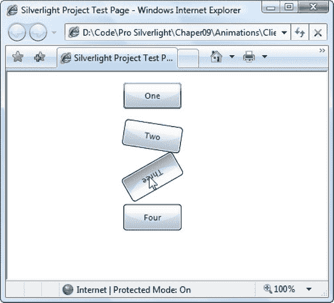
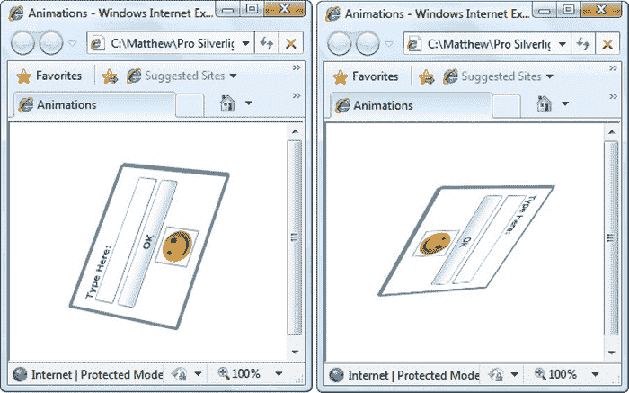
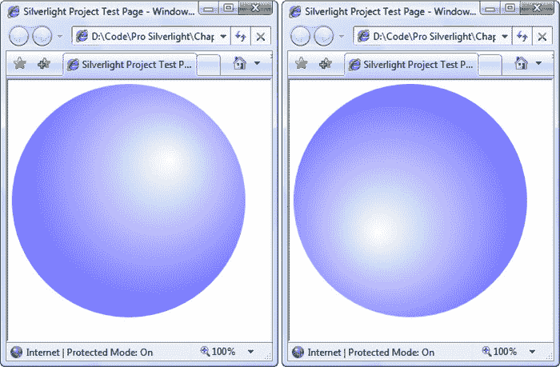
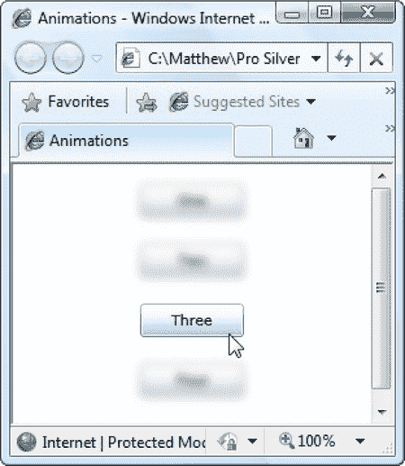
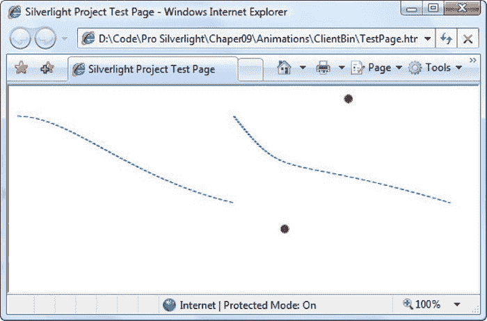
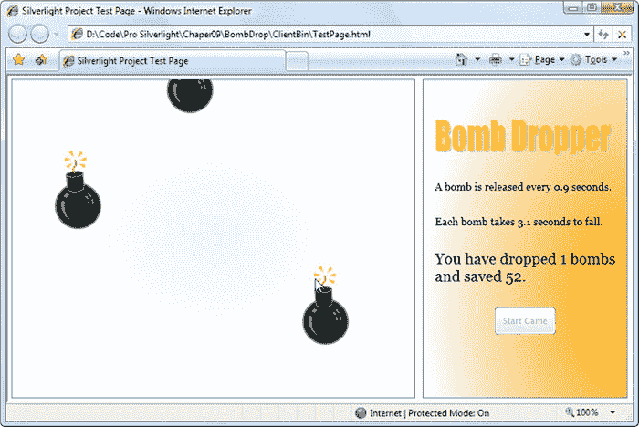
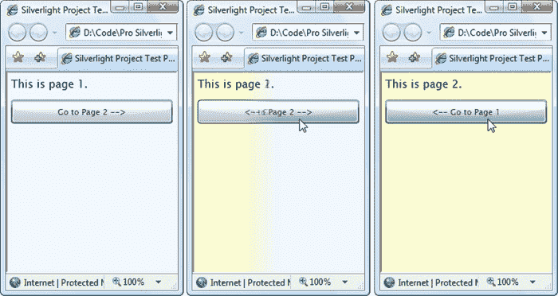
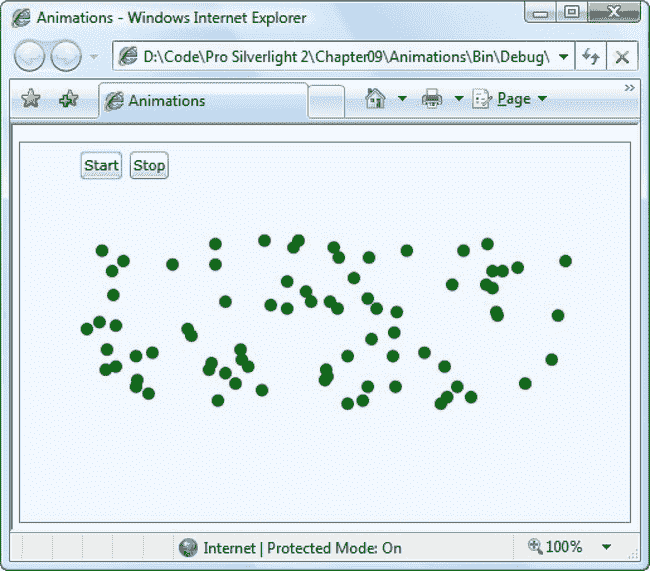

## 第 11 节

## 高级动画

现在，您已经了解了 Silverlight 的属性动画系统的基础——动画是如何定义的，它们是如何连接到元素的，您如何使用故事板控制回放，以及您如何结合动画缓动来创建更真实的效果。现在是一个很好的时机来仔细看看你可以在应用程序中使用的实用动画技术。

在这一章中，你将开始考虑你应该制作什么样的动画来获得你想要的结果。您将看到动画变换，画笔和像素着色器的例子。接下来，您将了解基于关键帧的动画如何允许您以一种类似于动画缓动但更灵活的方式来塑造动画的加速和减速。然后，您将研究两个代码驱动的动画示例——第一个是投弹游戏，第二个是动画页面转换。这两个例子都展示了如何通过用代码创建和管理动画来将它们集成到应用程序的整体流程中。最后，您将了解基于帧的动画如何让您完全摆脱动画模型，以创建复杂的效果，如逼真的碰撞。

### 动画类型再探

创建任何动画的第一个挑战是选择合适的动画属性。在您想要的结果(例如，跨页面移动的元素)和您需要使用的属性(在本例中是 Canvas)之间进行跳跃。向左拐。Top)并不总是直观的。以下是一些指导原则:

*   如果您希望使用动画来使元素出现或消失，请不要使用 Visibility 属性(该属性仅允许您在完全可见或完全不可见之间切换)。相反，使用不透明度属性来淡入或淡出。
*   如果您想要动画显示元素的位置，可以考虑使用画布。它提供了最直接的属性(Canvas。向左拐。Top)并且需要最少的开销。
*   制作动画最常见的属性是变换，这是你在第 8 章中第一次探索的。您可以使用它们来移动或翻转元素(TranslateTransform)、旋转元素(RotateTransform)、调整元素大小或拉伸元素(ScaleTransform)等等。如果小心使用，变换有时可以让您避免在动画中硬编码大小和位置。TranslateTransform 还允许您在布局容器(如网格)中移动元素，就像在画布中放置元素一样。
*   通过动画改变元素表面的一个好方法是修改笔刷的属性。您可以使用 ColorAnimation 来更改颜色，或使用另一个动画对象来转换更复杂的画笔的属性，如渐变中的偏移。

以下示例演示了如何制作变换和笔刷的动画，以及如何使用更多的动画类型。您还将学习如何创建带有关键帧的多分段动画。

#### 动画变换

转换提供了定制元素的最强大的方法之一。当你使用变换时，你不能简单地改变一个元素的边界。相反，元素的整个视觉外观被移动、翻转、倾斜、拉伸、放大、缩小或旋转。例如，如果使用 ScaleTransform 制作按钮大小的动画，则整个按钮的大小都会调整，包括其边框和内部内容。这种效果比动画显示其宽度和高度或影响其文本的 FontSize 属性更令人印象深刻。

要在动画中使用变换，第一步是定义变换。(动画可以更改现有的变换，但不能创建新的变换。)例如，假设您希望允许一个按钮旋转。这需要旋转变换:

`<Button Content="A Button">
  <Button.RenderTransform>
    **<****RotateTransform** **x****:****Name****="rotateTransform"></****RotateTransform****>**
  </Button.RenderTransform>
</Button>`

 **提示**你可以组合使用变换。这很简单—使用 TransformGroup 对象来设置 RenderTransform 属性。您可以在变换组中嵌套任意数量的变换。你会在本章后面的炸弹游戏中看到一个例子。

这里有一个动画，当鼠标移动到按钮上时，按钮会旋转。它作用于按钮。RotateTransform 对象并使用目标属性 Angle。RenderTransform 属性可以保存各种不同的转换对象，每个对象都有不同的属性，这一事实不会引起问题。只要使用具有角度属性的变换，这个动画就可以工作。

`<Storyboard x:Name="rotateStoryboard">
  <DoubleAnimation Storyboard.TargetName="rotateTransform"
   Storyboard.TargetProperty="Angle"
   To="360" Duration="0:0:0.8" RepeatBehavior="Forever"></DoubleAnimation>
</Storyboard>`

如果将此动画放在页面的资源集合中，则可以在用户将鼠标移到按钮上时触发它:

`private void cmd_MouseEnter(object sender, MouseEventArgs e)
{
    rotateStoryboard.Begin();
}`

按钮每 0.8 秒旋转一周，并持续旋转。当按钮旋转时，它是完全可用的—例如，您可以单击它并处理 click 事件。

要确保按钮围绕其中心点(而不是左上角)旋转，您需要设置 RenderTransformOrigin 属性，如下所示:

`<Button Content="One" Margin="5" RenderTransformOrigin**="0.5,0.5"**
 MouseEnter="cmd_MouseEnter">
  <Button.RenderTransform>
    <RotateTransform x:Name="rotateTransform"></RotateTransform>
  </Button.RenderTransform>
</Button>`

请记住，RenderTransformOrigin 属性使用从 0 到 1 的相对单位，因此 0.5 表示中点。

要停止旋转，您可以对 MouseLeave 事件做出反应。您可以停止执行旋转的故事板，但是这样做会导致按钮一步跳回其原始方向。更好的方法是启动第二个动画来替换第一个动画。该动画省略了 From 属性，这允许它在 0.2 秒内无缝地将按钮从其当前角度旋转到其原始方向:

`<Storyboard x:Name="unrotateStoryboard">
  <DoubleAnimation Storyboard.TargetName="rotateTransform"
   Storyboard.TargetProperty="Angle" To="0" Duration="0:0:0.2"></DoubleAnimation>
</Storyboard>`

下面是事件处理程序:

`private void cmd_MouseLeave(object sender, MouseEventArgs e)
{
    unrotateStoryboard.Begin();
}`

再做一点工作，你就可以让这两个动画和两个事件处理程序为一堆可旋转的按钮工作，如图 11-1 所示。诀窍是用相同的代码处理所有按钮的事件，并使用故事板动态地将故事板的目标分配给当前按钮。SetTarget()方法:

`private void cmd_MouseEnter(object sender, MouseEventArgs e)
{
    rotateStoryboard.Stop();
    Storyboard.SetTarget(rotateStoryboard, ((Button)sender).RenderTransform);
    rotateStoryboard.Begin();
}

private void cmd_MouseLeave(object sender, MouseEventArgs e)
{
    unrotateStoryboard.Stop();
    Storyboard.SetTarget(unrotateStoryboard, ((Button)sender).RenderTransform);
    unrotateStoryboard.Begin();
}` 

***图 11-1。**动画渲染转换*

这种方法有两个局限性。首先，因为代码对所有的按钮重复使用相同的故事板，所以没有办法让两个按钮同时旋转。例如，如果您在几个按钮上快速滑动鼠标，您首先离开的按钮可能不会一直旋转回到它们的初始位置，因为故事板被另一个按钮占用了。如果这种行为是一个问题，您可以通过在代码中动态创建您需要的故事板来解决它。在本章的后面，当你考虑炸弹游戏时，你会看到如何实现这种技术。

本例中的另一个缺点是，您需要相当多的标记来定义所有按钮的边距、事件处理程序和转换。你可以通过使用样式将相同的设置应用于不同的按钮(见[第 14 章](14.html#ch14))或者通过编程配置按钮来简化这种标记。

#### 动画透视投影

就像你可以制作变换动画一样，你也可以制作透视投影动画——也就是你在第 8 章中学习的 PlaneProjection 类，它允许你模拟一个平的、倾斜的三维表面。例如，假设您有一组包装在边框控件中的元素，并且该边框使用 PlaneProjection，如下所示:

`<Border CornerRadius="2" Padding="10" Height="140" Width="170"
 BorderBrush="SlateGray" BorderThickness="4">
  <Border.Projection>
    <PlaneProjection x:Name="projection"></PlaneProjection>` `  </Border.Projection>
  ...
</Border>`

目前，本例中的 PlaneProjection 不做任何事情。要更改元素的呈现方式，需要修改 PlaneProjection 对象的 RotateX、RotateY 和 RotateZ 属性，这将使边框的二维表面围绕适当的轴旋转。你在第 8 章中看到了如何实现这一点，但是现在你将使用动画来逐渐地、连续地改变这些属性。

下面是一个以不同速度修改所有三个旋转属性的动画，它给人一种令人眼花缭乱的感觉，好像边界正在三维空间中翻滚:

`<Storyboard x:Name="spinStoryboard">
  <DoubleAnimation Storyboard.TargetName="projection" RepeatBehavior="Forever"
   Storyboard.TargetProperty="RotationY" From="0" To="360" Duration="0:0:3">
  </DoubleAnimation>
  <DoubleAnimation Storyboard.TargetName="projection" RepeatBehavior="Forever"
   Storyboard.TargetProperty="RotationZ" From="0" To="360" Duration="0:0:30">
  </DoubleAnimation>
  <DoubleAnimation Storyboard.TargetName="projection" RepeatBehavior="Forever"
   Storyboard.TargetProperty="RotationX" From="0" To="360" Duration="0:0:40">
  </DoubleAnimation>
</Storyboard>`

[图 11-2](#fig_11_2) 显示了在动画中的两个不同点捕捉到的旋转边框。

***图 11-2。**旋转三维元素*

虽然这种技术看起来似乎是不必要的赏心悦目，但一点点三维旋转可以大有帮助。当您在不同内容之间实现过渡时，这尤其有用。例如，您可以创建一个面板，它可以翻转并在背面显示不同的内容。为此，你拿起一个面板，绕 x 轴或 y 轴从 0 度到 90 度旋转它(此时它看起来消失了，因为它是侧边的)。然后，继续播放第二个动画，将另一个面板从-90 度旋转到 0 度，显示新内容。

#### 动画笔刷

制作笔刷动画是 Silverlight 动画中的另一种常用技术，它和制作变换动画一样简单。同样，技巧是使用适当的动画类型深入到您想要更改的特定子属性。

图 11-3 显示了一个你在[第 9 章](09.html#ch9)中学习的调整径向梯度笔刷的例子。随着动画的运行，径向渐变的中心点会沿着椭圆漂移，从而产生三维效果。同时，渐变的外部颜色由蓝色变为黑色。

***图 11-3。**改变径向渐变*

要执行这个动画，您需要使用两种您还没有考虑过的动画类型。ColorAnimation 在两种颜色之间逐渐混合，产生微妙的颜色偏移效果。PointAnimation 允许您将一个点从一个位置移动到另一个位置。(这基本上与使用单独的 DoubleAnimation 和线性插值修改 x 坐标和 y 坐标是一样的。)您可以使用 PointAnimation 使由点构成的图形变形，或者更改径向渐变中心点的位置，如下例所示。

下面是定义椭圆及其画笔的标记:

`<Ellipse x:Name="ellipse" Margin="5" Grid.Row="1" Stretch="Uniform">
  <Ellipse.Fill>
    <RadialGradientBrush x:Name="ellipseBrush"
     RadiusX="1" RadiusY="1" GradientOrigin="0.7,0.3">
       <GradientStop x:Name="ellipseBrushStop" Color="White"
        Offset="0"></GradientStop>
       <GradientStop Color="Blue" Offset="1"></GradientStop>
    </RadialGradientBrush>
  </Ellipse.Fill>
</Ellipse>`

这是两个移动中心点并改变渐变中第二种颜色的动画:

`<Storyboard x:Name="ellipseStoryboard">
  <PointAnimation Storyboard.TargetName="ellipseBrush"
   Storyboard.TargetProperty="GradientOrigin"
   From="0.7,0.3" To="0.3,0.7" Duration="0:0:10" AutoReverse="True"
   RepeatBehavior="Forever">
  </PointAnimation>
  <ColorAnimation Storyboard.TargetName="ellipseBrushStop"
   Storyboard.TargetProperty="Color"
   To="Black" Duration="0:0:10" AutoReverse="True"
   RepeatBehavior="Forever">
  </ColorAnimation>
</Storyboard>`

您可以通过改变 LinearGradientBrush 和 RadialGradientBrush 中的颜色和偏移来创建大量的催眠效果。如果这还不够，渐变画笔还有自己的 RelativeTransform 属性，您可以使用它来旋转、缩放、拉伸和倾斜它们。(WPF 团队有一个有趣的工具，叫做 Gradient 执念，用于构建基于渐变的动画，其中大部分经过一些调整就可以与 Silverlight 一起工作。可以在`[http://tinyurl.com/yc5fjpm](http://tinyurl.com/yc5fjpm)`找到。)

#### 制作像素着色器动画

在第 9 章中，你学习了像素着色器——可以对任何元素应用位图风格效果的低级例程，例如模糊、发光和扭曲。就其本身而言，像素着色器是一个有趣但偶尔有用的工具。但是与动画结合，它们变得更加多才多艺。您可以使用它们来设计引人注目的过渡(例如，模糊一个控件，隐藏它，然后模糊另一个控件)。或者，您可以使用它们来创建令人印象深刻的用户交互效果(例如，当用户将鼠标移动到按钮上时，按钮会发光)。最重要的是，您可以像制作任何其他动画一样轻松地制作像素着色器的属性动画。

图 11-4 显示了一个基于前面显示的旋转按钮例子的页面。它包含一系列按钮，当用户将鼠标移动到其中一个按钮上时，就会附加并启动一个动画。不同之处在于，本例中的动画没有旋转按钮，而是将模糊半径减小到 0。结果是，当您移动鼠标时，最近的控件会迅速滑动到焦点上。

***图 11-4。**制作像素着色器动画*

代码与旋转按钮示例中的代码相同。你需要给每个按钮一个模糊效果，而不是旋转变形:

`<Button Content="One" Margin="10"
 MouseEnter="cmd_MouseEnter" MouseLeave="cmd_MouseLeave">
  <Button.Effect>
    <BlurEffect Radius="10"></BlurEffect>
  </Button.Effect>
</Button>`

您还需要相应地更改动画:

`<Storyboard x:Name="blurStoryboard">
  <DoubleAnimation Storyboard.TargetProperty="Radius"
   To="0" Duration="0:0:0.4"></DoubleAnimation>
</Storyboard>
<Storyboard x:Name="unblurStoryboard">
  <DoubleAnimation Storyboard.TargetProperty="Radius" To="10"
   Duration="0:0:0.2"></DoubleAnimation>
</Storyboard>`

在这个例子中，故事板。TargetElement 属性不是在 XAML 中设置的，因为它是在触发 MouseEnter 或 MouseLeave 事件时在代码中设置的。这与您在旋转按钮示例中看到的技术完全相同。

你可以用同样的方法反过来高亮显示一个按钮。例如，您可以使用像素着色器应用发光效果来突出显示鼠标悬停按钮。如果您对使用像素着色器来制作页面过渡动画感兴趣，请查看位于`[http://wpffx.codeplex.com](http://wpffx.codeplex.com)`的 WPF 着色器效果库(也适用于 Silverlight)。除了 Silverlight 的标准 plain BlurEffect 和 DropShadowEffect 之外，它还包括一系列令人瞠目的像素着色器，以及一组用于使用它们执行过渡的辅助类。

#### 关键帧动画

到目前为止，您看到的所有动画都使用插值从起点移动到终点。但是，如果您需要创建一个具有多个片段并且移动不太规律的动画，该怎么办呢？例如，您可能想要创建一个动画，它将元素的一部分快速滑动到视图中，然后以较慢的速度移动，然后再次加速以将剩余部分移动到位。动画放松不会有帮助，它旨在创建令人愉快的自然运动，而不是提供一个专门调整的动画，多次或在精确的点改变速度。通过创建两个动画的序列并使用 BeginTime 属性在第一个动画之后开始第二个动画，可以实现这种效果。然而，有一种更简单的方法:您可以使用关键帧动画。

*关键帧动画*是由许多小段组成的动画。每个片段代表动画中的初始值、最终值或中间值。运行动画时，它会平滑地从一个值移动到另一个值。

例如，考虑允许您将 RadialGradientBrush 的中心点从一个点移动到另一个点的点动画:

`<PointAnimation Storyboard.TargetName="ellipseBrush"
 Storyboard.TargetProperty="GradientOrigin"
 From="0.7,0.3" To="0.3,0.7" Duration="0:0:10" AutoReverse="True"
 RepeatBehavior="Forever">
</PointAnimation>`

您可以将此 PointAnimation 对象替换为等效的 PointAnimationUsingKeyFrames 对象，如下所示:

`<PointAnimationUsingKeyFrames Storyboard.TargetName="ellipseBrush"
 Storyboard.TargetProperty="GradientOrigin"
 AutoReverse="True" RepeatBehavior="Forever" >
  <LinearPointKeyFrame Value="0.7,0.3" KeyTime="0:0:0"></LinearPointKeyFrame>
  <LinearPointKeyFrame Value="0.3,0.7" KeyTime="0:0:10"></LinearPointKeyFrame>
</PointAnimationUsingKeyFrames>`

该动画包括两个关键帧。第一个设置动画开始时的点值。(如果你想使用在 RadialGradientBrush 中设置的当前值，你可以省去这个关键帧。)第二个关键帧定义了结束值，10 秒后到达。PointAnimationUsingKeyFrames 对象执行线性插值，以便从第一个关键帧值平滑地移动到第二个关键帧值，就像 PointAnimation 处理“从”和“到”值一样。

 **注意**每个关键帧动画都使用自己的关键帧动画对象(比如 LinearPointKeyFrame)。在很大程度上，这些类是相同的——它们包括一个存储目标值的 Value 属性和一个指示帧何时达到目标值的 KeyTime 属性。唯一的区别是 Value 属性的数据类型。在 LinearPointKeyFrame 中它是一个点，在 DoubleKeyFrame 中它是一个 double，依此类推。

您可以使用一系列关键帧创建一个更有趣的示例。以下动画展示了中心点在不同时间到达的一系列位置。中心点的移动速度根据关键帧之间的持续时间和需要经过的距离而变化:

`<PointAnimationUsingKeyFrames Storyboard.TargetName="ellipseBrush"
 Storyboard.TargetProperty="GradientOrigin"
 RepeatBehavior="Forever" >
  <LinearPointKeyFrame Value="0.7,0.3" KeyTime="0:0:0"></LinearPointKeyFrame>
  <LinearPointKeyFrame Value="0.3,0.7" KeyTime="0:0:5"></LinearPointKeyFrame>
  <LinearPointKeyFrame Value="0.5,0.9" KeyTime="0:0:8"></LinearPointKeyFrame>
  <LinearPointKeyFrame Value="0.9,0.6" KeyTime="0:0:10"></LinearPointKeyFrame>
  <LinearPointKeyFrame Value="0.8,0.2" KeyTime="0:0:12"></LinearPointKeyFrame>
  <LinearPointKeyFrame Value="0.7,0.3" KeyTime="0:0:14"></LinearPointKeyFrame>
</PointAnimationUsingKeyFrames>`

这个动画是不可逆的，但它会重复。为了确保一次迭代的最终值和下一次迭代的起始值之间没有跳跃，动画在开始的同一个中心点结束。

##### 离散关键帧

你在前面的例子中看到的关键帧动画使用了*线性*关键帧。因此，它在关键帧值之间平滑过渡。另一个选择是使用*离散的*关键帧。在这种情况下，不执行插值。当到达关键时间时，属性会突然更改为新值。

线性关键帧类以线性*数据类型*关键帧的形式命名。离散关键帧类以离散*数据类型*关键帧的形式命名。下面是使用离散关键帧的 RadialGradientBrush 示例的修订版:

`<PointAnimationUsingKeyFrames Storyboard.TargetName="ellipseBrush"
 Storyboard.TargetProperty="GradientOrigin"
 RepeatBehavior="Forever" >
  <DiscretePointKeyFrame Value="0.7,0.3" KeyTime="0:0:0"></DiscretePointKeyFrame>
  <DiscretePointKeyFrame Value="0.3,0.7" KeyTime="0:0:5"></DiscretePointKeyFrame>
  <DiscretePointKeyFrame Value="0.5,0.9" KeyTime="0:0:8"></DiscretePointKeyFrame>
  <DiscretePointKeyFrame Value="0.9,0.6" KeyTime="0:0:10"></DiscretePointKeyFrame>
  <DiscretePointKeyFrame Value="0.8,0.2" KeyTime="0:0:12"></DiscretePointKeyFrame>
  <DiscretePointKeyFrame Value="0.7,0.3" KeyTime="0:0:14"></DiscretePointKeyFrame>
</PointAnimationUsingKeyFrames>`

运行此动画时，中心点会在适当的时间从一个位置跳到下一个位置。这是一个戏剧性的(但不稳定的)效果。

所有关键帧动画类都支持离散关键帧，但只有一些支持线性关键帧。这完全取决于数据类型。支持线性关键帧的数据类型与支持线性插值并提供*数据类型*动画类的数据类型相同。这些是点，颜色和双。唯一的另一种动画数据类型是 object，它不支持线性插值。(本质上，“激活”一个对象意味着在离散关键帧动画中的特定时间用全新的值替换它。)

 **提示**您可以在同一个关键帧动画中组合两种类型的关键帧——线性的和离散的，只要它们都支持该数据类型。

##### 放松关键帧

在本章的前面，您看到了缓动功能如何改进普通动画。即使关键帧动画被分割成多个片段，这些片段中的每一个都使用普通、枯燥的线性插值。

如果这不是您想要的，您可以使用动画缓动来为单个关键帧添加加速或减速。然而，普通的线性关键帧和离散关键帧类不支持此功能。而是需要使用一个*缓动*关键帧，比如 EasingDoubleKeyFrame、EasingColorKeyFrame 或者 EasingPointKeyFrame。每一个都与它的线性对应物工作方式相同，但是公开了一个额外的 EasingFunction 属性。

下面是一个使用动画缓动对关键帧动画的前五秒应用加速效果的示例:

`<PointAnimationUsingKeyFrames Storyboard.TargetName="ellipseBrush"
 Storyboard.TargetProperty="GradientOrigin"
 RepeatBehavior="Forever" >
  <LinearPointKeyFrame Value="0.7,0.3" KeyTime="0:0:0"></LinearPointKeyFrame>
  **<****EasingPointKeyFrame** **Value****="0.3,0.7"** **KeyTime****="0:0:5">**
    **<****EasingPointKeyFrame.EasingFunction****>**
      **<****CircleEase****></****CircleEase****>**
    **</****EasingPointKeyFrame.EasingFunction****>**
  **</****EasingPointKeyFrame****>**
  <LinearPointKeyFrame Value="0.5,0.9" KeyTime="0:0:8"></LinearPointKeyFrame>
  <LinearPointKeyFrame Value="0.9,0.6" KeyTime="0:0:10"></LinearPointKeyFrame>
  <LinearPointKeyFrame Value="0.8,0.2" KeyTime="0:0:12"></LinearPointKeyFrame>
  <LinearPointKeyFrame Value="0.7,0.3" KeyTime="0:0:14"></LinearPointKeyFrame>
</PointAnimationUsingKeyFrames>`

关键帧和动画缓动的结合是对复杂动画建模的一种便捷方式，但它可能仍无法提供您所需的控制。您可以创建一个数学公式来指示动画的进度，而不是使用动画缓动。这是您将在下一节学习的技巧。

##### 样条关键帧

还有一种类型的关键帧:一个*样条*关键帧。每个支持线性关键帧的类也支持样条关键帧，它们以样条*数据类型*关键帧的形式命名。

与线性关键帧一样，样条线关键帧使用插值从一个关键值平滑移动到另一个关键值。不同之处在于，每个样条线关键帧都有一个 KeySpline 属性。使用 KeySpline 属性，可以定义一条影响插值执行方式的三次贝塞尔曲线。虽然很难得到你想要的效果(至少没有先进的设计工具来帮助你)，但这项技术让你能够创建更无缝的加速和减速以及更逼真的运动。

你可能还记得第 8 章的[，贝塞尔曲线由一个起点、一个终点和两个控制点定义。对于关键样条曲线，起点总是(0，0)，终点总是(1，1)。你提供两个控制点。您创建的曲线描述了时间(x 轴)和动画值(y 轴)之间的关系。](08.html#ch8)

这里有一个示例，通过比较画布上两个椭圆的运动来演示关键点样条动画。第一个椭圆使用 DoubleAnimation 在页面上缓慢均匀地移动。第二个椭圆使用带有两个 SplineDoubleKeyFrame 对象的 DoubleAnimationUsingKeyFrames。它在相同的时间(10 秒后)到达目的地，但在行进过程中会加速和减速，向前拉动并落在另一个椭圆后面:

`<DoubleAnimation Storyboard.TargetName="ellipse1"
 Storyboard.TargetProperty="(Canvas.Left)"
 To="500" Duration="0:0:10">
</DoubleAnimation>

<DoubleAnimationUsingKeyFrames Storyboard.TargetName="ellipse2"
 Storyboard.TargetProperty="(Canvas.Left)" >
  <SplineDoubleKeyFrame KeyTime="0:0:5" Value="250"
   KeySpline="0.25,0 0.5,0.7"></SplineDoubleKeyFrame>
  <SplineDoubleKeyFrame KeyTime="0:0:10" Value="500"
   KeySpline="0.25,0.8 0.2,0.4"></SplineDoubleKeyFrame>
</DoubleAnimationUsingKeyFrames>`

最快的加速发生在五秒标记后不久，此时第二个 SplineDoubleKeyFrame 开始。它的第一个控制点与相对较大的 y 轴值(表示动画进度(0.8))和相对较小的 x 轴值(表示时间)相匹配。因此，椭圆会在一小段距离内加速，然后再次减速。

[图 11-5](#fig_11_5) 显示了两条控制椭圆运动的曲线的图形描述。要解释这些曲线，请记住它们是从上到下绘制动画进度的图表。观察第一条曲线，你可以看到它沿着一条相当平稳的曲线下降，在开始时有一个短暂的停顿，在结束时逐渐变平。但是，第二条曲线迅速向下垂直，完成大部分进度，然后在动画的剩余部分保持水平。

***图 11-5。**绘制关键样条动画的进度图*

### 代码中的动画

有时，您需要用代码以编程方式创建动画的每个细节。事实上，这种情况相当普遍。任何时候你有多个动画要处理，并且你事先不知道会有多少个动画或者应该如何配置它们，这种情况都会发生。(这就是您将在本节中看到的简单投弹游戏的情况。)如果您希望在不同的页面中使用相同的动画，或者您只是希望能够灵活地将所有与动画相关的细节从标记中分离出来，以便于重用，也会出现这种情况。(本章后面用于页面过渡的动画就是这种情况。)

以编程方式创建、配置和启动动画并不困难。您只需要创建动画和故事板对象，将动画添加到故事板，并启动故事板。您可以在动画结束后通过对故事板做出反应来执行任何清理工作。已完成的事件。

在下面的例子中，你将看到如何创建如图 11-6 所示的游戏。在这里，一系列炸弹以越来越快的速度投下。玩家必须点击每个炸弹来拆除它。当达到设定的限制时——默认情况下，投下五枚炸弹——游戏结束。

***图 11-6。**抓炸弹*

在这个例子中，每个投下的炸弹都有自己的故事板和两个动画。第一个动画投下炸弹(通过动画画布。Top 属性)，第二个动画使炸弹稍微前后旋转，给它一个真实的摆动效果。如果用户点击了一个炸弹，这些动画就会暂停，然后又有两个动画会让炸弹从画布上无害地倾斜下来。最后，每次动画结束时，应用程序检查它是否代表一个落下的炸弹或一个被保存的炸弹，并相应地更新计数。

在接下来的小节中，您将看到如何创建这个例子的每个部分。

#### 主页面

BombDropper 示例中的主页非常简单。它包含两列网格。左侧是一个 Border 元素，它包含代表游戏界面的画布:

`<Border Grid.Column="0" BorderBrush="SteelBlue" BorderThickness="1" Margin="5">
  <Grid>
    <Canvas x:Name="canvasBackground" SizeChanged="canvasBackground_SizeChanged"
     MinWidth="50">` `      <Canvas.Background>
        <RadialGradientBrush>
          <GradientStop Color="AliceBlue" Offset="0"></GradientStop>
          <GradientStop Color="White" Offset="0.7"></GradientStop>
        </RadialGradientBrush>
      </Canvas.Background>
    </Canvas>
  </Grid>
</Border>`

当画布第一次调整大小时或调整大小时(当用户更改浏览器窗口大小时)，以下代码运行并设置剪辑区域:

`private void canvasBackground_SizeChanged(object sender, SizeChangedEventArgs e)
{
    // Set the clipping region to match the current display region of the Canvas.
    RectangleGeometry rect = new RectangleGeometry();
    rect.Rect = new Rect(0, 0,
      canvasBackground.ActualWidth, canvasBackground.ActualHeight);
    canvasBackground.Clip = rect;
}`

这是必需的，因为否则画布会绘制其子元素，即使它们位于显示区域之外。在投弹游戏中，这将导致炸弹飞出描绘画布的盒子。

 **注意**因为用户控件是在没有明确大小的情况下定义的，所以它可以自由调整自身大小以匹配浏览器窗口。游戏逻辑使用当前的窗口尺寸，而不试图以任何方式补偿它们。因此，如果你有一个非常宽的窗口，炸弹会散布在一个很宽的区域，使得游戏更加困难。同样，如果你有一个非常高的窗户，炸弹会下落得更快，这样它们就可以在相同的时间间隔内完成它们的轨迹。您可以通过使用固定大小的区域来解决这个问题，然后您可以将该区域置于用户控件的中间。然而，一个可调整大小的窗口使这个例子更具适应性，也更有趣。

主窗口的右侧是一个面板，显示游戏统计数据、当前投下的炸弹数和保存的炸弹数，以及一个开始游戏的按钮:

`<Border Grid.Column="1" BorderBrush="SteelBlue" BorderThickness="1" Margin="5">
  <Border.Background>
    <RadialGradientBrush GradientOrigin="1,0.7" Center="1,0.7"
     RadiusX="1" RadiusY="1">
      <GradientStop Color="Orange"  Offset="0"></GradientStop>
      <GradientStop Color="White" Offset="1"></GradientStop>
    </RadialGradientBrush>
  </Border.Background>

  <StackPanel Margin="15" VerticalAlignment="Center" HorizontalAlignment="Center">
    <bomb:Title></bomb:Title>
    <TextBlock x:Name="lblRate" Margin="0,30,0,0" TextWrapping="Wrap"
     FontFamily="Georgia" FontSize="14"></TextBlock>
    <TextBlock x:Name="lblSpeed" Margin="0,30" TextWrapping="Wrap"
     FontFamily="Georgia" FontSize="14"></TextBlock>
    <TextBlock x:Name="lblStatus" TextWrapping="Wrap"` `     FontFamily="Georgia" FontSize="20">No bombs have dropped.</TextBlock>
    <Button x:Name="cmdStart" Padding="5" Margin="0,30" Width="80"
     Content="Start Game" Click="cmdStart_Click"></Button>
  </StackPanel>
</Border>`

您会注意到右边的列包含一个不寻常的成分:一个名为 Title 的元素。这是一个自定义的用户控件，以火红的橙色字母显示投弹者标题。从技术上讲，这是一幅矢量艺术作品。它是在 Microsoft Word 中使用艺术字功能创建的，保存为 XPS 文件，然后使用第 8 章中描述的技术导出到 XAML。虽然您可以将 BombDropper 标题的标记直接插入到主页中，但是将它定义为一个单独的用户控件允许您将标题标记与用户界面的其余部分分开。

要使用 Title 用户控件，您需要将您的项目名称空间映射到一个 XML 名称空间，从而使它在您的页面中可用(如[第 2 章](02.html#ch2)中所述)。假设这个项目被命名为 BombDropper，下面是您需要添加的内容:

`<UserControl x:Class="BombDropper.Page"

    xmlns:x="http://schemas.microsoft.com/winfx/2006/xaml"
    **xmlns****:****bomb****="clr-namespace:BombDropper;assembly=BombDropper">**` 

现在，您可以使用 XML 前缀“bomb”从项目中插入任何自定义控件，包括用户控件:

`<bomb:Title></bomb:Title>`

#### 炸弹用户控制

下一步是创建炸弹的图形图像。尽管可以使用静态图像(只要它有透明背景)，但处理更灵活的 Silverlight 形状总是更好。通过使用形状，您可以在不引入失真的情况下调整炸弹的大小，并且可以制作动画或改变绘图的各个部分。本示例中显示的炸弹直接取自 Microsoft Word 的在线剪贴画集合。炸弹被转换成 XAML，方法是将其插入一个 Word 文档，然后将该文档保存为 XPS 文件，这个过程在第 8 章中描述。这里没有显示使用路径元素组合的完整 XAML。但是你可以通过下载 BombDropper 游戏和本章的示例来了解它。

Bomb 类的 XAML 被稍微简化了(通过移除它周围不必要的额外画布元素和缩放它的变换)。然后，XAML 被插入到一个名为 Bomb 的新用户控件中。这样，主页可以通过创建炸弹用户控件并将其添加到布局容器(如画布)来显示炸弹。

将图形放在单独的用户控件中，可以很容易地在用户界面中实例化该图形的多个副本。它还允许您通过添加到用户控件的代码中来封装相关功能。在投弹的例子中，代码中只添加了一个细节——一个跟踪炸弹当前是否落下的布尔属性:

`public partial class Bomb: UserControl
{
    public Bomb()
    {
        InitializeComponent();
    }` `    public bool IsFalling
    {
        get;
        set;
    }
}`

炸弹的标记包括一个 RotateTransform，动画代码可以使用它来给炸弹一个摇摆的效果。虽然您可以通过编程方式创建和添加这个 RotateTransform，但是在炸弹的 XAML 文件中定义它更有意义:

`<UserControl x:Class="BombDrop.Bomb"

    xmlns:x="http://schemas.microsoft.com/winfx/2006/xaml"
    >
  <UserControl.RenderTransform>
    <TransformGroup>
      **<****RotateTransform** **Angle****="20"** **CenterX**="**50**" **CenterY****="50"></****RotateTransform****>**
      <ScaleTransform ScaleX="0.5" ScaleY="0.5"></ScaleTransform>
    </TransformGroup>
  </UserControl.RenderTransform>

  <Canvas>
    <!-- The Path elements that draw the bomb graphic are defined here. -->
  </Canvas>
</UserControl>`

有了这些代码，您可以使用一个<bomb>元素将一个炸弹插入到您的窗口中，就像主窗口插入标题用户控件一样(如前一节所述)。然而，在这种情况下，以编程方式创建炸弹更有意义。</bomb>

#### 投掷炸弹

为了投掷炸弹，应用程序使用 DispatcherTimer，这是一个与 Silverlight 用户界面配合得很好的计时器，因为它在用户界面线程上触发事件(为您节省了*编组*或*锁定*的努力，这两种多线程编程技术在[第 16 章](16.html#ch16)中有描述)。您选择一个时间间隔，然后 DispatcherTimer 在该时间间隔触发一个周期性滴答事件。

`private DispatcherTimer bombTimer = new DispatcherTimer();

public Page()
{
    InitializeComponent();
    bombTimer.Tick += bombTimer_Tick;
}`

在投弹游戏中，计时器最初每 1.3 秒触发一次。当用户点击按钮开始游戏时，计时器开始计时:

`// Keep track of how many bombs are dropped and stopped.
private int droppedCount = 0;
private int savedCount = 0;` `// Initially, bombs fall every 1.3 seconds, and hit the ground after 3.5 seconds.
private double initialSecondsBetweenBombs = 1.3;
private double initialSecondsToFall = 3.5;
private double secondsBetweenBombs;
private double secondsToFall;

private void cmdStart_Click(object sender, RoutedEventArgs e)
{
    cmdStart.IsEnabled = false;

    // Reset the game.
    droppedCount = 0;
    savedCount = 0;
    secondsBetweenBombs = initialSecondsBetweenBombs;
    secondsToFall = initialSecondsToFall;

    // Start the bomb-dropping timer.
    bombTimer.Interval = TimeSpan.FromSeconds(secondsBetweenBombs);
    bombTimer.Start();
}`

每次计时器触发时，代码都会创建一个新的炸弹对象，并设置它在画布上的位置。炸弹被放置在画布上边缘的正上方，因此它可以无缝地落入视野。它被赋予一个随机的水平位置，位于左右两边之间:

`private void bombTimer_Tick(object sender, EventArgs e)
{
    // Create the bomb.
    Bomb bomb = new Bomb();
    bomb.IsFalling = true;

    // Position the bomb.
    Random random = new Random();
    bomb.SetValue(Canvas.LeftProperty,
      (double)(random.Next(0, (int)(canvasBackground.ActualWidth - 50))));
    bomb.SetValue(Canvas.TopProperty, -100.0);

    // Add the bomb to the Canvas.
    canvasBackground.Children.Add(bomb);
    ...`

然后，代码动态地创建一个故事板来制作炸弹的动画。使用了两个动画:一个通过改变附加的画布来投放炸弹。Top 属性和一个通过改变旋转变换的角度来摆动炸弹的属性。因为故事板。TargetElement 和故事板。TargetProperty 是附加属性，您必须使用 Storyboard 设置它们。SetTargetElement()和故事板。SetTargetProperty()方法:

`...

    // Attach mouse click event (for defusing the bomb).
    bomb.MouseLeftButtonDown += bomb_MouseLeftButtonDown;

    // Create the animation for the falling bomb.` `    Storyboard storyboard = new Storyboard();
    DoubleAnimation fallAnimation = new DoubleAnimation();
    fallAnimation.To = canvasBackground.ActualHeight;
    fallAnimation.Duration = TimeSpan.FromSeconds(secondsToFall);

    Storyboard.SetTarget(fallAnimation, bomb);
    Storyboard.SetTargetProperty(fallAnimation, new PropertyPath("(Canvas.Top)"));
    storyboard.Children.Add(fallAnimation);

    // Create the animation for the bomb "wiggle."
    DoubleAnimation wiggleAnimation = new DoubleAnimation();
    wiggleAnimation.To = 30;
    wiggleAnimation.Duration = TimeSpan.FromSeconds(0.2);
    wiggleAnimation.RepeatBehavior = RepeatBehavior.Forever;
    wiggleAnimation.AutoReverse = true;

    Storyboard.SetTarget(wiggleAnimation,
      ((TransformGroup)bomb.RenderTransform).Children[0]);
    Storyboard.SetTargetProperty(wiggleAnimation, new PropertyPath("Angle"));
    storyboard.Children.Add(wiggleAnimation);
    ...`

这两个动画都可以使用动画缓动来获得更真实的行为，但是这个示例通过使用基本的线性动画来保持代码简单。

新创建的 bomb 和 storyboard 存储在两个字典集合中，因此可以在其他事件处理程序中轻松检索它们。集合存储为主页类中的字段，定义如下:

`// Make it possible to look up a bomb based on a storyboard, and vice versa.
private Dictionary<Bomb, Storyboard> storyboards =
  new Dictionary<Bomb, Storyboard>();
private Dictionary<Storyboard, Bomb> bombs = new Dictionary<Storyboard, Bomb>();`

下面是将炸弹和故事板添加到这两个集合的代码:

`    ...
    bombs.Add(storyboard, bomb);
    storyboards.Add(bomb, storyboard);
    ...`

接下来，您将附加一个事件处理程序，当故事板完成 fallAnimation(炸弹落地时发生)时，该事件处理程序将做出反应。最后，故事板启动，动画开始运行:

`    ...
    storyboard.Duration = fallAnimation.Duration;
    storyboard.Completed += storyboard_Completed;
    storyboard.Begin();
    ...`

投弹代码还需要最后一个细节。随着游戏的进行，难度越来越大。计时器开始更频繁地发射，炸弹开始更紧密地出现在一起，降落时间减少。为了实现这些改变，每当经过设定的时间间隔时，定时器代码进行调整。默认情况下，BombDropper 每 15 秒进行一次调整。以下是控制调整的字段:

`// Perform an adjustment every 15 seconds.
private double secondsBetweenAdjustments = 15;
private DateTime lastAdjustmentTime = DateTime.MinValue;

// After every adjustment, shave 0.1 seconds off both.
private double secondsBetweenBombsReduction = 0.1;
private double secondsToFallReduction = 0.1;`

这是 DispatcherTimer 末尾的代码。Tick 事件处理程序，它检查是否需要调整并进行适当的更改:

`    ...
    // Perform an "adjustment" when needed.
    if ((DateTime.Now.Subtract(lastAdjustmentTime).TotalSeconds >
      secondsBetweenAdjustments))
    {
        lastAdjustmentTime = DateTime.Now;

        secondsBetweenBombs -= secondsBetweenBombsReduction;
        secondsToFall -= secondsToFallReduction;

        // (Technically, you should check for 0 or negative values.
        // However, in practice these won't occur because the game will
        // always end first.)

        // Set the timer to drop the next bomb at the appropriate time.
        bombTimer.Interval = TimeSpan.FromSeconds(secondsBetweenBombs);

        // Update the status message.
        lblRate.Text = String.Format("A bomb is released every {0} seconds.",
          secondsBetweenBombs);
        lblSpeed.Text = String.Format("Each bomb takes {0} seconds to fall.",
          secondsToFall);
    }
}`

有了这些代码，就有足够的功能以不断增加的速度投掷炸弹。然而，该游戏仍然缺乏对掉落和保存的炸弹做出响应的代码。

#### 拦截炸弹

在炸弹到达画布底部并爆炸之前，用户通过点击它来保存炸弹。因为每个炸弹都是炸弹用户控件的一个单独实例，所以拦截鼠标单击是很容易的—您所需要做的就是处理 MouseLeftButtonDown 事件，该事件在炸弹的任何部分被单击时触发(但是如果您单击背景中的某个位置，例如炸弹圆圈的边缘周围，则不会触发)。

当一个炸弹被点击时，第一步是获取适当的炸弹对象，并设置它的 IsFalling 属性以指示它不再下落。(IsFalling 属性由处理已完成动画的事件处理程序使用。)

`private void bomb_MouseLeftButtonDown(object sender, MouseButtonEventArgs e)` `{
    // Get the bomb.
    Bomb bomb = (Bomb)sender;
    bomb.IsFalling = false;

    // Record the bomb's current (animated) position.
    double currentTop = Canvas.GetTop(bomb);
    ...`

下一步是找到控制这个炸弹动画的故事板，这样就可以阻止它。要找到故事板，你需要在这个游戏用来追踪的集合中查找。目前，Silverlight 不包含任何标准化的方法来查找作用于给定元素的动画。

`    ...
    // Stop the bomb from falling.
    Storyboard storyboard = storyboards[bomb];
    storyboard.Stop();
    ...`

点击一个按钮后，另一组动画将炸弹从屏幕上移开，向左或向右投掷(取决于哪一侧最近)。虽然您可以创建一个全新的故事板来实现这种效果，但 BombDropper 游戏会清除当前用于炸弹的故事板，并向其中添加新的动画。当这个过程完成时，新的故事板开始:

`...
    // Reuse the existing storyboard, but with new animations.
    // Send the bomb on a new trajectory by animating Canvas.Top
    // and Canvas.Left.
    storyboard.Children.Clear();

    DoubleAnimation riseAnimation = new DoubleAnimation();
    riseAnimation.From = currentTop;
    riseAnimation.To = 0;
    riseAnimation.Duration = TimeSpan.FromSeconds(2);

    Storyboard.SetTarget(riseAnimation, bomb);
    Storyboard.SetTargetProperty(riseAnimation, new PropertyPath("(Canvas.Top)"));
    storyboard.Children.Add(riseAnimation);

    DoubleAnimation slideAnimation = new DoubleAnimation();
    double currentLeft = Canvas.GetLeft(bomb);

    // Throw the bomb off the closest side.
    if (currentLeft < canvasBackground.ActualWidth / 2)
    {
        slideAnimation.To = -100;
    }
    else
    {
        slideAnimation.To = canvasBackground.ActualWidth + 100;
    }` `    slideAnimation.Duration = TimeSpan.FromSeconds(1);
    Storyboard.SetTarget(slideAnimation, bomb);
    Storyboard.SetTargetProperty(slideAnimation, new PropertyPath("(Canvas.Left)"));
    storyboard.Children.Add(slideAnimation);

    // Start the new animation.
    storyboard.Duration = slideAnimation.Duration;
    storyboard.Begin();
}`

现在游戏有足够的代码来投掷炸弹，并在用户保存它们时将它们弹离屏幕。然而，为了跟踪哪些炸弹被保存，哪些被丢弃，您需要对故事板做出反应。动画结束时触发的 Completed 事件。

#### 清点炸弹和清理现场

正如你所看到的，投弹者以两种方式使用故事板:动画一个落下的炸弹和动画一个拆除的炸弹。你可以用不同的事件处理器来完成这些故事板，但是为了简单起见，BombDropper 只使用一个事件处理器。它通过检查炸弹来区分爆炸的炸弹和获救的炸弹。IsFalling 属性。

`// End the game when 5 bombs have fallen.
private int maxDropped = 5;

private void storyboard_Completed(object sender, EventArgs e)
{
    Storyboard completedStoryboard = (Storyboard)sender;
    Bomb completedBomb = bombs[completedStoryboard];

    // Determine if a bomb fell or flew off the Canvas after being clicked.
    if (completedBomb.IsFalling)
    {
        droppedCount++;
    }
    else
    {
        savedCount++;
    }
    ...`

无论哪种方式，代码都会更新显示测试，以指示投下和保存了多少炸弹。然后，它执行一些清理，从画布中移除炸弹，并从用于跟踪的集合中移除炸弹和故事板。

`...
    // Update the display.
    lblStatus.Text = String.Format("You have dropped {0} bombs and saved {1}.",
      droppedCount, savedCount);

    // Clean up.
    completedStoryboard.Stop();
    canvasBackground.Children.Remove(completedBomb);` `    // Update the tracking collections.
    storyboards.Remove(completedBomb);
    bombs.Remove(completedStoryboard);
    ...`

此时，代码检查是否达到了投放炸弹的最大数量。如果有，游戏结束，计时器停止，所有的炸弹和故事板都被移除:

`    ...
    // Check if it's game over.
    if (droppedCount >= maxDropped)
    {
        bombTimer.Stop();
        lblStatus.Text += "\r\n\r\nGame over.";

        // Find all the storyboards that are underway.
        foreach (KeyValuePair<Bomb, Storyboard> item in storyboards)
        {
            Storyboard storyboard = item.Value;
            Bomb bomb = item.Key;

            storyboard.Stop();
            canvasBackground.Children.Remove(bomb);
        }

        // Empty the tracking collections.
        storyboards.Clear();
        bombs.Clear();

        // Allow the user to start a new game.
        cmdStart.IsEnabled = true;
    }
}`

这就完成了投弹游戏的代码。然而，你可以做很多改进。一些例子包括如下:

*   *制作一个炸弹爆炸效果的动画*:这个效果可以让炸弹周围的火焰闪烁，或者让小块弹片飞过画布。
*   背景动画:这个变化很容易，而且增加了活力。例如，您可以创建一个向上移动的线性渐变，产生一种运动的感觉，或者在两种颜色之间过渡。
*   *加深度*:比你想象的容易。基本的技术是给炸弹不同的尺寸。较大的炸弹应该有较高的 ZIndex，以确保它们与较小的炸弹重叠，并且应该给它们较短的动画时间，以确保它们下落得更快。你也可以让炸弹部分透明，这样当一个炸弹落下时，它后面的其他炸弹就可见了。
*   *添加音效*:在[第 12 章](12.html#ch12)中，你将学习在 Silverlight 中使用声音和其他媒体。您可以使用适时的声音效果来打断炸弹爆炸或获救的炸弹。
*   *使用动画缓动*:如果你想让炸弹在落下时加速，从屏幕上弹开，或者更自然地摆动，你可以给这里使用的动画添加缓动功能。而且，正如您所期望的，在代码中构造放松函数就像在 XAML 中一样容易。
*   *微调参数*:你可以提供更多的转盘来调整行为(例如，设置炸弹时间、轨迹和频率如何随着游戏进程而改变的变量)。还可以注入更多的随机性(例如，允许保存的炸弹以稍微不同的方式从画布上弹开)。

你可以在网上找到无数 Silverlight 游戏编程的例子。微软的 Silverlight 社区网站在`[www.silverlight.net/showcase](http://www.silverlight.net/showcase)`提供了游戏示例和完整的源代码。你也可以在`[www.andybeaulieu.com](http://www.andybeaulieu.com)`查看安迪·比留的网站，该网站提供 Silverlight 游戏和令人印象深刻的物理模拟器。

### 封装动画

当您在代码中动态创建动画时，需要相当多的样板代码来创建动画、设置故事板属性以及处理要清理的已完成事件。出于这个原因，Silverlight 开发人员通常将动画包装在较高级别的类中，这些类负责处理低级别的细节。

例如，您可以创建一个名为 FadeElementEffect 的动画类，并使用如下代码将元素淡出视图:

`FadeElementEffect fade = new FadeElementEffect();
fade.Animate(canvas);`

创建这样的类相当简单，尽管具体的设计取决于应用程序的需求。在本节的其余部分，您将考虑一种创建动画辅助类的可能方法，当用户在页面之间导航时，这些动画辅助类提供过渡动画。

#### 页面过渡

在第 7 章中，您看到了在 Silverlight 应用程序中支持页面导航的不同方式。一种技术是使用某种布局容器作为应用程序的根元素。然后，您可以将用户控件添加到该容器中，并在需要时移除它们。从一页导航到另一页包括移除当前页的用户控件和添加下一页的用户控件。

这种技术的一个优点是，它允许您使用动画效果在两个页面之间切换。例如，您可以创建在新页面中淡入或滑动的动画。要做到这一点，您需要一次将两个页面添加到根视图中，一个在另一个之上。(最简单的方法是将两个用户控件放在一个网格的同一个单元格中，但是画布也同样适用。)然后，动画显示最顶层页面的属性。例如，您可以更改不透明度属性以淡入页面，更改 TranslateTransform 的属性以移动它，等等。您甚至可以一次应用多种效果，例如，创建一种“放大”效果，将页面从角落扩展到整个显示区域。

在本章的其余部分，你将学习如何使用一个简单的擦除效果，在当前页面上显示新页面。[图 11-7](#fig_11_7) 显示了擦拭过程。

***图 11-7。**用划像在页面间转换*

这个例子假设应用程序中的根元素是一个网格。换句话说，您的应用程序类需要这样的代码:

`// This Grid will host your pages.
private Grid rootVisual = new Grid();

private void Application_Startup(object sender, StartupEventArgs e)
{
    // Load the first page.
    this.RootVisual = rootVisual;
    rootVisual.Children.Add(new Page());
}`

这项技术将在第 7 章中讨论。

#### 基础类

制作页面间过渡动画的最直接方式是使用自定义的 Navigate()方法直接在 App 类中编码。然而，将动画代码放在一个单独的类中要灵活得多(只需要多花一点力气)。如果你用一个抽象类或接口来标准化你的动画，你将获得更多的灵活性来交换新的效果。

在此示例中，所有转换都继承自名为 PageTransitionBase 的抽象类。该类将故事板、上一页和新页存储为字段:

`public abstract class PageTransitionBase
{
    protected Storyboard storyboard = new Storyboard();
    protected UserControl oldPage;` `    protected UserControl newPage;

    public PageTransitionBase()
    {
        storyboard.Completed += TransitionCompleted;
    }
    ...`

应用程序调用 PageTransitionBase。Navigate()方法从一页移动到另一页。Navigate()方法将两个页面都添加到网格中，调用 PrepareStoryboard()方法来设置动画，然后启动故事板:

`    ...
    public void Navigate(UserControl newPage)
    {
        // Set the pages.
        this.newPage = newPage;
        Grid grid = (Grid)Application.Current.RootVisual;
        oldPage = (UserControl)grid.Children[0];

        // Insert the new page first (so it lies "behind" the old page).
        grid.Children.Insert(0, newPage);

        // Prepared the animation.
        PrepareStoryboard();

        // Perform the animation.
        storyboard.Begin();
    }
    ...`

PrepareStoryboard()方法是抽象的。它必须在派生类中被重写，这将创建它们需要的特定动画对象。

`    ...
    protected abstract void PrepareStoryboard();
    ...`

动画完成时，TransitionCompleted()事件处理程序会做出响应。它删除旧页面:

`    ...
    private void TransitionCompleted(object sender, EventArgs e)
    {
        // Remove the old page, which is not needed any longer.
        Grid grid = (Grid)Application.Current.RootVisual;
        grid.Children.Remove(oldPage);
    }
}`

您也可以使用此方法来执行清理。然而，在这个例子中，动画作用于旧页面，该页面在导航之后被丢弃。不需要额外的清理。

#### 擦拭过渡

若要使用页面过渡，您至少需要一个创建动画的派生类。在这一节中，您将考虑一个例子:一个清除旧页面，显示新页面的 WipeTransition 类。

创建擦除效果的技巧是使用不透明蒙版制作笔刷动画。(正如你在第 8 章中了解到的，不透明蒙版决定了图像或元素的哪些部分应该可见，哪些部分应该透明。)要使用动画作为页面过渡，您需要为不透明度遮罩使用 LinearGradientBrush。随着动画的进行，您可以移动不透明蒙版中的偏移，逐渐使最上面的元素变得透明，并显示下面的更多内容。在页面转换中，最上面的元素是旧页面，下面是新页面。擦除通常从左到右或从上到下进行，但如果使用不同的不透明蒙版，可能会产生更有创意的效果。

为了执行其工作，WipeTransition 类覆盖 PrepareStoryboard()方法。它的第一个任务是创建不透明蒙版，并将其添加到旧页面(位于网格的顶部)。此不透明蒙版使用定义两个渐变停止点的渐变:黑色(图像完全可见)和透明(图像完全透明)。最初，两个光圈都位于图像的左边缘。因为可见的停止是最后声明的，所以它优先，图像是完全不透明的。

`public class WipeTransition : PageTransitionBase
{
    protected override void PrepareStoryboard()
    {
        // Create the opacity mask.
        LinearGradientBrush mask = new LinearGradientBrush();
        mask.StartPoint = new Point(0,0);
        mask.EndPoint = new Point(1,0);

        GradientStop transparentStop = new GradientStop();
        transparentStop.Color = Colors.Transparent;
        transparentStop.Offset = 0;
        mask.GradientStops.Add(transparentStop);
        GradientStop visibleStop = new GradientStop();
        visibleStop.Color = Colors.Black;
        visibleStop.Offset = 0;
        mask.GradientStops.Add(visibleStop);

        oldPage.OpacityMask = mask;
        ...`

接下来，您需要在 LinearGradientBrush 的偏移上执行动画。在本例中，两个偏移量都从左侧移动到右侧，使下面的图像显示出来。为了让这个例子更有趣一点，偏移在移动时并不占据相同的位置。相反，可见偏移领先，经过 0.2 秒的短暂延迟后，透明偏移紧随其后。这将在动画播放过程中在擦拭边缘创建一个混合边缘。

`...
        // Create the animations for the opacity mask.
        DoubleAnimation visibleStopAnimation = new DoubleAnimation();
        Storyboard.SetTarget(visibleStopAnimation, visibleStop);
        Storyboard.SetTargetProperty(visibleStopAnimation,` `          new PropertyPath("Offset"));
        visibleStopAnimation.Duration = TimeSpan.FromSeconds(1.2);
        visibleStopAnimation.From = 0;
        visibleStopAnimation.To = 1.2;

        DoubleAnimation transparentStopAnimation = new DoubleAnimation();
        Storyboard.SetTarget(transparentStopAnimation, transparentStop);
        Storyboard.SetTargetProperty(transparentStopAnimation,
          new PropertyPath("Offset"));
        transparentStopAnimation.BeginTime = TimeSpan.FromSeconds(0.2);
        transparentStopAnimation.From = 0;
        transparentStopAnimation.To = 1;
        transparentStopAnimation.Duration = TimeSpan.FromSeconds(1);
        ...`

这里有一个奇怪的细节。可见光圈移动到 1.2 而不是 1，这表示图像的右边缘。这确保了两个偏移以相同的速度移动，因为每个偏移必须覆盖的总距离与其动画的持续时间成比例。

最后一步是将动画添加到故事板，故事板是在 PageTransitionBase 类中定义的。您不需要启动 storyboard，因为一旦 PrepareStoryboard()方法返回，PageTransitionBase 类就会执行此步骤。

`        ...
        // Add the animations to the storyboard.
        storyboard.Children.Add(transparentStopAnimation);
        storyboard.Children.Add(visibleStopAnimation);
    }
}`

现在，您可以使用这样的代码在页面之间导航:

`WipeTransition transition = new WipeTransition();
transition.Navigate(new Page2());`

和投弹者一样，有很多富有想象力的方法来扩展这个例子:

*   *添加转换属性*:您可以增强 WipeTransition 类的更多可能性，允许可配置的擦除方向、可配置的擦除时间等等。
*   *创建更多过渡*:创建一个新的动画页面过渡非常简单，只需从 PageTransitionBase 派生一个类并覆盖 PrepareStoryboard()。
*   *重构 PageTransitionBase 代码*:当前的例子被设计得尽可能简单。然而，更复杂的设计是将添加和删除页面的代码提取出来，并将其放在自定义应用程序类中。这开启了新的可能性。它允许你使用不同的布局。(例如，您可以在一个面板中使用过渡动画，而不是在整个窗口中使用。)它还允许应用程序类添加应用程序服务。(例如，你可以在离开页面后让它们在缓存中保持活动，如[第 7 章](07.html#ch7)所述。这使您可以保留所有元素的当前状态。)

对于更好的效果，请在`[http://codeplex.com/wpffx](http://codeplex.com/wpffx)`查看免费的 WPF 着色器效果库中的自定义像素着色器和过渡的集合。

### 基于帧的动画

除了基于属性的动画系统，Silverlight 还提供了一种只使用代码创建基于帧的动画的方法。您需要做的就是响应静态 CompositionTarget。渲染事件，触发该事件以获取每一帧的内容。这是一种非常低级的方法，除非您确定标准的基于属性的动画模型不适合您的场景(例如，如果您正在构建一个简单的侧滚游戏，创建基于物理的动画，或者对火、雪和气泡等粒子效果进行建模)，否则您不应该采用这种方法。

构建基于帧的动画的基本技术很简单。将事件处理程序附加到静态 CompositionTarget。渲染事件。之后，Silverlight 开始连续调用此事件处理程序。(只要你的渲染代码执行的足够快，Silverlight 每秒会调用 60 次。)在呈现事件处理程序中，您可以相应地创建或调整窗口中的元素。换句话说，你需要自己管理所有的工作。动画结束后，分离事件处理程序。

图 11-8 显示了一个简单的例子。在这里，随机数量的圆从画布的顶部落到底部。它们以不同的速度下落(基于随机的起始速度)，但它们以相同的速度向下加速。当所有的圆到达底部时，动画结束。

***图 11-8。**基于帧的圆圈下落动画*

在本例中，每个下落的圆由一个椭圆元素表示。一个名为 EllipseInfo 的自定义类保存了对椭圆的引用，并跟踪对物理模型很重要的细节。在这种情况下，只有一条信息:椭圆沿着 y 轴移动的速度。(您可以很容易地扩展这个类，以包含沿 x 轴的速度、附加的加速度信息等等。)

`public class EllipseInfo
{
    public Ellipse Ellipse
    {
        get; set;
    }

    public double VelocityY
    {
        get; set;
    }

    public EllipseInfo(Ellipse ellipse, double velocityY)
    {
        VelocityY = velocityY;
        Ellipse = ellipse;
    }
}`

应用程序使用集合跟踪每个椭圆的 EllipseInfo 对象。另外几个窗口级字段记录了计算椭圆落差时使用的各种细节。您可以轻松地配置这些细节。

`private List<EllipseInfo> ellipses = new List<EllipseInfo>();

private double accelerationY = 0.1;
private int minStartingSpeed = 1;
private int maxStartingSpeed = 50;
private double speedRatio = 0.1;
private int minEllipses = 20;
private int maxEllipses = 100;
private int ellipseRadius = 10;
private SolidColorBrush ellipseBrush = new SolidColorBrush(Colors.Green);`

单击按钮时，集合被清除，事件处理程序被附加到 CompositionTarget。渲染事件:

`private bool rendering = false;

private void cmdStart_Clicked(object sender, RoutedEventArgs e)
{
    if (!rendering)
    {
        ellipses.Clear();
        canvas.Children.Clear();

        CompositionTarget.Rendering += RenderFrame;
        rendering = true;
    }
}`

如果省略号不存在，渲染代码会自动创建它们。它创建一个随机数量的椭圆(目前，在 20 和 100 之间),并赋予每个椭圆相同的大小和颜色。椭圆位于画布的顶部，但它们沿 x 轴随机偏移，每个椭圆都有一个随机的开始速度:

`private void RenderFrame(object sender, EventArgs e)
{
    if (ellipses.Count == 0)
    {
        // Animation just started. Create the ellipses.
        int halfCanvasWidth = (int)canvas.ActualWidth / 2;

        Random rand = new Random();
        int ellipseCount = rand.Next(minEllipses, maxEllipses+1);
        for (int i = 0; i < ellipseCount; i++)
        {
            // Create the ellipse.
            Ellipse ellipse = new Ellipse();
            ellipse.Fill = ellipseBrush;
            ellipse.Width = ellipseRadius;
            ellipse.Height = ellipseRadius;

            // Place the ellipse.
            Canvas.SetLeft(ellipse, halfCanvasWidth +
              rand.Next(-halfCanvasWidth, halfCanvasWidth));
            Canvas.SetTop(ellipse, 0);
            canvas.Children.Add(ellipse);

            // Track the ellipse.
            EllipseInfo info = new EllipseInfo(ellipse,
              speedRatio * rand.Next(minStartingSpeed, maxStartingSpeed));
            ellipses.Add(info);
        }
    }
    ...`

如果椭圆已经存在，代码会处理更有趣的动画工作。使用画布稍微移动每个椭圆。SetTop()方法。运动量取决于指定的速度。

`    ...
    else
    {
        for (int i = ellipses.Count-1; i >= 0; i--)
        {
            EllipseInfo info = ellipses[i];
            double top = Canvas.GetTop(info.Ellipse);
            Canvas.SetTop(info.Ellipse, top + 1 * info.VelocityY);
            ...`

为了提高性能，椭圆一旦到达画布底部，就会从跟踪集合中移除。这样，您就不需要再次处理它们。为了让这种方法工作而不会导致您在遍历集合时丢失位置，您需要从集合的结尾到开头进行向后迭代。

如果椭圆还没有到达画布的底部，代码会增加速度。(或者，您可以根据椭圆与画布底部的接近程度来设置速度，以获得类似磁铁的效果。)

`            ...
            if (top >= (canvas.ActualHeight - ellipseRadius*2))
            {
                // This circle has reached the bottom.
                // Stop animating it.
                ellipses.Remove(info);
            }
            else
            {
                // Increase the velocity.
                info.VelocityY += accelerationY;
            }
            ...`

最后，如果所有省略号都已从集合中移除，则事件处理程序将被移除，从而允许动画结束:

`            ...
            if (ellipses.Count == 0)
            {
                // End the animation.
                // There's no reason to keep calling this method
                // if it has no work to do.
                CompositionTarget.Rendering -= RenderFrame;
                rendering = false;
            }
        }
    }
}`

显然，您可以扩展该动画，使圆圈反弹、散开等。技术是一样的——你需要使用更复杂的公式来得到速度。

在构建基于帧的动画时，有一点需要注意:它们不是时间相关的。换句话说，您的动画可能在高速计算机上运行得更快，因为帧速率会增加，并且您的合成会更快。渲染事件将被更频繁地调用。为了补偿这种影响，您需要编写考虑当前时间的代码。

### 最后一句话

在这一章中，你学习了制作实用动画并将其集成到应用程序中所需的技术。唯一缺少的是视觉效果——换句话说，确保动画效果和你的代码一样完美。

正如您在过去两章中所看到的，Silverlight 中的动画模型功能惊人地全面。然而，得到你想要的结果并不总是容易的。如果您想将界面的独立部分制作成单个动画场景的一部分，您必须处理一些繁琐的细节，例如跟踪动画对象和执行清理。此外，没有一个 stock 动画类在其参数中接受实参。因此，以编程方式构建新动画所需的代码通常简单而冗长。

Silverlight 动画的未来在于更高层次的特性，这些特性建立在本章所学的基础之上。在这一章中，你已经看到了这种技术的一个例子。在这里，其他人设计动画，您用几行代码将它插入到您的应用程序中。在第 15 章中，你将学习另一种使用 Silverlight 控件的方法:使用*过渡*。

 **注意**过渡是在标记中声明的动画，作为控件模板的一部分。它们会在适当的时候自动触发——例如，当用户悬停在按钮上时，或者当容器中添加了新项目时。过渡是建立在你在本章和上一章探索的动画模型上的，但是它们比你自己做的动画有更多的限制。然而，它们也有可能变得更加方便，特别是对于寻找快速插入一些基本效果的商业开发人员来说。