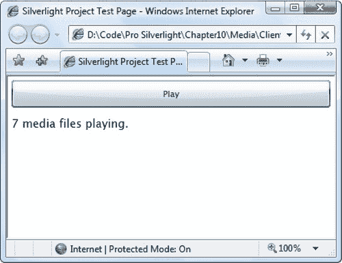
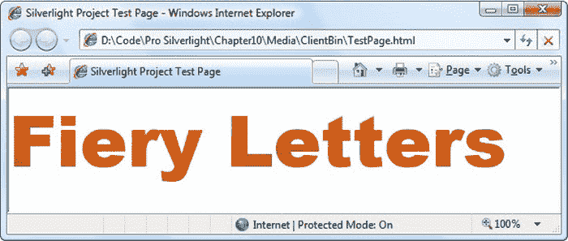

# 十二、声音、视频和深度变焦

在这一章中，你将处理 Silverlight 最成熟的特性之一:音频和视频支持。

从 1.0 版本开始，Silverlight 就成为了一项杰出的技术，为有限的浏览器世界带来了高端多媒体支持。尽管 Silverlight 不能支持所有的媒体编解码器(因为这将成倍增加 Silverlight 下载的大小并增加其许可成本)，但 Silverlight 仍然为您提供了在应用中集成高质量音频和视频所需的一切。更值得注意的是 Silverlight 允许你使用多媒体，尤其是视频。例如，您可以使用视频一次填充数千个元素，并将其与其他效果(如动画、变换和透明度)相结合。

在本章中，您将学习如何将普通的音频和视频合并到您的应用中，并且您将考虑为 Silverlight 编码和托管视频文件的最佳方式。接下来，您将看到 Silverlight 的 VideoBrush 类如何允许您创建令人印象深刻的效果，如视频填充文本和视频反射。然后，你会考虑 Silverlight 对网络摄像头、麦克风和输入的基本支持。最后，你会看到深度变焦——一种不同的交互式多媒体技术，让用户实时放大巨幅图像。

 **新功能** Silverlight 5 为其音频和视频支持增加了一些新功能。首先，Silverlight 可以防止屏幕保护程序在播放视频时打断你的应用。第二，Silverlight 增加了对远程控制的支持(就像有时高级笔记本电脑附带的那些)，这意味着您可以使用它们来开始、停止和暂停播放(有关更多信息，请参见“媒体命令”一节)。第三，Silverlight 包括一个特技播放功能，可以在不改变音频音高的情况下加速或减速视频(请参见“特技播放”部分)。第四，Silverlight 增加了对低延迟声音的支持，这允许您播放短音频剪辑而没有延迟(参见“低延迟音频”一节)。

### 支持的文件类型

因为 Silverlight 需要确保在许多不同的操作系统和浏览器上的兼容性，所以它不能支持在桌面应用(如 Windows Media Player)中找到的所有媒体文件。在开始使用 Silverlight 音频和视频之前，您需要确切了解它支持哪些媒体类型。

对于音频，Silverlight 支持以下功能:

*   Windows Media Audio (WMA)版本 7、8 和 9
*   8 至 320 Kbps 固定或可变比特率的 MP3

对于视频，Silverlight 支持以下标准:

*   Windows Media 视频 7 (WMV1)
*   Windows Media Video 8 (WMV2)
*   Windows Media Video 9 (WMV3)
*   Windows Media 视频高级配置文件，非 VC-1 (WMVA)
*   Windows Media 视频高级配置文件，VC-1 (WMVC1)
*   H.264 视频和 AAC 音频(也称为 MPEG-4 第 10 部分或 MPEG-4 AVC)

通常，您可以通过文件扩展名. wmv 来识别 Windows Media 视频，其他视频格式(例如 MPEG 和 QuickTime)无需适用。

列表中的最后两种格式——VC-1 和 h . 264——是广泛支持的行业标准。值得注意的地方包括蓝光，HD DVD 和 Xbox 360。它们也是 Silverlight 应用最常见的选择。(当然，这些标准支持不同的比特率和分辨率，因此您的 Silverlight 应用不会因为使用 VC-1 或 H.264 而被迫包含 DVD 质量的视频。)

Silverlight 不支持其他 Windows Media 格式(如 Windows Media Screen、Windows Media Audio Professional 和 Windows Media Voice)，也不支持 Windows Media 视频与 MP3 音频的组合。最后，它不支持使用奇数尺寸(不能被 2 整除的尺寸)的帧的视频文件，例如 127×135。

 **注意**向 Silverlight 应用添加音频相当容易，因为你可以放入任何 MP3 文件。使用视频文件需要更多的工作。你不仅要确保你使用的是一种受支持的 WMV 格式，还需要仔细考虑你需要的质量和你的访问者可以支持的带宽。在本章的后面，你将考虑如何为 Silverlight 应用编码视频。但首先，您将考虑如何添加基本音频。

### 媒体元素

在 Silverlight 中，所有的音频和视频功能都内置在一个类中:MediaElement。

像所有元素一样，媒体元素直接放在用户界面中。如果您使用 MediaElement 来播放音频，这个事实并不重要，因为 MediaElement 保持不可见。如果您使用 MediaElement 播放视频，请将其放在视频窗口应该出现的位置。

播放声音只需要一个简单的 MediaElement 标签。例如，将以下标记添加到用户界面中:

`<MediaElement Source="test.mp3"></MediaElement>`

现在，一旦页面被加载，它将下载 test.mp3 文件并开始自动播放。

当然，要做到这一点，您的 Silverlight 应用需要能够找到 test.mp3 文件。MediaElement 类使用与 Image 类相同的 URL 系统。这意味着你可以在你的 XAP 包中嵌入一个媒体文件，或者将它与 XAP 文件一起部署到同一个网站。一般来说，最好将媒体文件分开，除非它们非常小。否则，您将增大应用的大小，并延长初始下载时间。

 **注意**当您第一次将 test.mp3 这样的媒体文件添加到项目中时，Visual Studio 将其构建操作设置设为“无”，将其复制到输出目录设置设为“不复制”若要将媒体文件与 XAP 文件一起部署，您必须将“拷贝到输出目录”设置更改为“总是拷贝”要在 XAP 包中部署媒体文件，请将“构建操作”更改为“资源”。本章的可下载代码使用了这两种方法中的第一种。

#### 控制播放

前面的示例在加载带有 MediaElement 的页面时立即开始播放音频文件。回放会继续，直到音频文件完成。

虽然这个例子很简单，但也有一点局限性。通常，您会希望能够更精确地控制回放。例如，您可能希望它在特定的时间被触发，无限重复，等等。实现这一结果的一种方法是在适当的时候使用 MediaElement 类的方法。

MediaElement 的启动行为由其 AutoPlay 属性决定。如果此属性设置为 false，则加载音频文件，但您的代码负责在正确的时间开始播放:

`<MediaElement x:Name="media" Source="test.mp3" AutoPlay="False"></MediaElement>`

当使用这种方法时，您必须确保给 MediaElement 一个名称，以便可以在代码中与之交互。通常，交互由调用 Play()、Pause()和 Stop()方法组成。您还可以使用 SetSource()方法从流中加载新的媒体内容(如果您正在使用 WebClient 类异步下载媒体文件，这很有用，如第 6 章中的[所述)，并且您可以更改 Position 属性以在音频中移动。](06.html#ch6)

下面是一个简单的事件处理程序，它查找到当前音频文件的开头，然后开始回放:

`private void cmdPlay_Click(object sender, RoutedEventArgs e)
{
    media.Position = TimeSpan.Zero;
    media.Play();
}`

如果这段代码在回放过程中运行，第一行会将位置重置到开始处，并从该点继续回放。在这种情况下，第二行没有影响，因为媒体文件已经在播放。

 **注意**根据您支持的媒体文件类型，在尝试暂停播放或跳到新位置之前，您可能需要检查 CanPause 和 CanSeek 属性。某些类型的流媒体文件不支持暂停和查找。

#### 处理错误

如果找不到或加载文件，MediaElement 不会抛出异常。相反，由您来处理 MediaFailed 事件。幸运的是，这个任务很容易。首先，调整 MediaElement 标记，如下所示:

`<MediaElement ... MediaFailed="media_MediaFailed"></MediaElement>`

然后，在事件处理程序中，您可以使用 ExceptionRoutedEventArgs。ErrorException 属性获取描述问题的异常对象。下面是一个显示相应错误消息的示例:

`private void media_MediaFailed(object sender, ExceptionRoutedEventArgs e)
{
    lblErrorText.Text = e.ErrorException.Message;
}`

#### 播放多种声音

MediaElement 仅限于播放单个媒体文件。如果更改 Source 属性(或调用 SetSource()方法)，当前正在进行的任何回放都会立即停止。然而，这个限制并不适用于 Silverlight 整体。Silverlight 可以很容易地同时播放多个媒体文件，只要每个文件都有自己的 MediaElement。

您可以使用两种方法来创建具有多种声音的应用。您的第一个选择是在设计时创建所有需要的 MediaElement 对象。如果您计划重用相同的两个或三个 MediaElement 对象，这种方法很有用。例如，您可以定义两个 MediaElement 对象，并在每次播放新声音时在它们之间切换。(您可以在 page 类中使用一个布尔变量来跟踪您最后使用的对象。)要使这项技术变得真正容易，您可以将音频文件名存储在适当元素的 Tag 属性中，因此您的事件处理代码需要做的就是从 Tag 属性中读取文件名，找到要使用的正确 MediaElement，设置它的 Source 属性，然后调用它的 Play()方法。因为这个例子使用了两个 MediaElement 对象，所以您只能同时听到两种声音，如果您认为用户无论如何都无法从嘈杂的声音中挑出第三种声音，这是一个合理的折衷。

您的另一个选择是动态创建您需要的每个 MediaElement 对象。这种方法需要更多的开销，但是差别很小(除非你同时播放几十个媒体文件)。当您在代码中创建 MediaElement 时，您需要记住将它添加到应用的容器中。假设您没有更改 AutoPlay 属性，MediaElement 将在您添加后立即开始播放。如果将 AutoPlay 设置为 false，则需要使用 Play()方法。最后，处理 MediaEnded 事件以在回放结束后删除 MediaElement 也是一个好主意。

下面是一个按钮的一些代码，每次单击该按钮时，都会开始同一声音文件的新回放:

`private void cmdPlay_Click(object sender, RoutedEventArgs e)
{
    MediaElement media = new MediaElement();
    media.Source = new Uri("test.mp3", UriKind.Relative);
    media.MediaEnded += new RoutedEventHandler(media_MediaEnded);
    LayoutRoot.Children.Add(media);
}

private void media_MediaEnded(object sender, RoutedEventArgs e)
{
    LayoutRoot.Children.Remove((MediaElement)sender);
}`

为了便于跟踪一批动态生成的 MediaElement 对象，您可以将它们全部添加到一个指定的容器中(例如，一个不可见的堆栈面板)。这允许您快速检查所有当前正在播放的媒体文件，并停止它们。图 12-1 显示了一个使用这种方法的例子，并在每次插入或删除 MediaElement 时显示不可见 StackPanel 的元素计数。

***图 12-1。**同时播放媒体文件*

#### 改变音量、平衡和位置

MediaElement 公开了许多允许您控制回放的属性。最基本的如下:

*   *音量:*将音量设置为从 0(完全静音)到 1(最大音量)的数字。默认值为 0.5。要暂时静音播放而不暂停播放或更改音量设置，请将 IsMuted 设置为 true。
*   *平衡:*将左右扬声器之间的平衡设置为从-1(仅左扬声器)到 1(仅右扬声器)的数字。默认值为 0，平均分割声音。
*   *CurrentState:* 表示播放器当前是否正在播放、暂停、停止、下载媒体文件(打开)、缓冲(缓冲)或获取 DRM 内容的许可证(AcquiringLicense)。如果没有提供媒体文件，则 CurrentState 关闭。
*   *位置:*提供一个 TimeSpan 对象，指示媒体文件中的当前位置。您可以设置该属性跳到特定的时间位置。

图 12-2 显示了一个允许用户控制回放的简单页面。

***图 12-2。**控制更多播放细节*

窗口顶部有三个按钮用于控制回放。它们使用相当普通的代码——单击时调用 MediaElement 的 Start()、Stop()和 Play()方法。

下面是两个调节音量和平衡的滑块。这些滑块被设置为适当的范围(0 到 1 和-1 到 1):

`<Slider Grid.Column="1" x:Name="sliderVolume" Minimum="0" Maximum="1" Value="0.5"
  ValueChanged="sliderVolume_ValueChanged" ></Slider>

<Slider Grid.Row="1" Grid.Column="1" x:Name="sliderBalance" Minimum="-1" Maximum="1"
  ValueChanged="sliderBalance_ValueChanged"></Slider>`

当用户拖动滑块中的拇指时，更改会应用到 MediaElement:

`private void sliderVolume_ValueChanged(object sender,
  RoutedPropertyChangedEventArgs<
double> e)
{
    media.Volume = sliderVolume.Value;
}

private void sliderBalance_ValueChanged(object sender,
  RoutedPropertyChangedEventArgs<
double> e)
{
    media.Balance = sliderBalance.Value;
}`

第三个滑块让用户跳到新的位置。它实际上由两个上下叠加的滑块组成。背景中的滑块(首先定义的那个)是位置滑块，用户拖移它以跳到音频文件的新部分:

`<Slider Minimum="0" Grid.Column="1" Grid.Row="2" x:Name="sliderPosition"
 ValueChanged="sliderPosition_ValueChanged"></Slider>`

前面是一个忽略鼠标活动的滑块(因为它的 IsHitTestVisible 属性设置为 false)，并且是部分透明的(因为它的 Opacity 属性设置为 0.5)。因此，滑块在位置滑块后面看起来是一个模糊的图像:

`<Slider Minimum="0" Grid.Column="1" Grid.Row="2" x:Name="sliderPositionBackground"
 IsHitTestVisible="False" Opacity="0.5"></Slider>`

此滑块(sliderPositionBackground)表示音频文件的当前位置。随着音频的前进，代码沿着轨道移动 sliderPositionBackground 中的滑块，以向用户提供回放进度的可视指示。您可以通过移动 sliderPosition 滑块来完成相同的操作，但这可能会有问题，因为您的代码需要区分用户发起的更改(当用户拖动滑块时，此时您的代码应该更改 MediaElement 的当前位置)和回放同步(此时您的代码应该不做任何事情)。

该代码通过在媒体文件打开后从 NaturalDuration 属性读取完整的运行时间来设置位置滑块:

`private void media_MediaOpened(object sender, RoutedEventArgs e)
{
    sliderPosition.Maximum = media.NaturalDuration.TimeSpan.TotalSeconds;
    sliderPositionBackground.Maximum = media.NaturalDuration.TimeSpan.TotalSeconds;
}`

然后，当最上面的滑块标签移动时，您可以跳到特定位置:

`private void sliderPosition_ValueChanged(object sender, RoutedEventArgs e)
{
    // Pausing the player before moving it reduces audio "glitches"
    // when the value changes several times in quick succession.
    media.Pause();
    media.Position = TimeSpan.FromSeconds(sliderPosition.Value);
    media.Play();
}`

顺便提一下，MediaElement 不会触发任何类型的事件来通知您回放正在进行。因此，如果您想要沿着轨道移动 sliderPositionBackground 的滑块，或者想要使用页面底部的当前时间偏移来更新 TextBlock，则需要使用计时器。

DispatcherTimer 是一个完美的解决方案。您可以在页面加载时创建一个，使用 0.1 秒的短暂间隔，并随着回放开始和停止:

`private DispatcherTimer timer = new DispatcherTimer();

public MediaPlayer()
{
    InitializeComponent();
    timer.Interval = TimeSpan.FromSeconds(0.1);
    timer.Tick += timer_Tick;
}

private void cmdPlay_Click(object sender, RoutedEventArgs e)
{
    media.Play();
    timer.Start();
}`

当调度员。Tick 事件触发时，可以通过在 TextBlock 中显示当前时间位置并移动位置指示器(背景滑块的半透明非交互式滑块)来更新用户界面:

`private void timer_Tick(object sender, EventArgs e)
{
    lblStatus.Text = media.Position.ToString().TrimEnd(new char[]{'0'});
    sliderPositionBackground.Value = media.Position.TotalSeconds;
}`

页面上的两个复选框是这个媒体播放器的最后一个组成部分，也是最简单的细节之一。“静音”复选框设置 MediaElement 的相应 IsMuted 属性:

`private void chkMute_Click(object sender, RoutedEventArgs e)
{
    media.IsMuted = (bool)chkMute.IsChecked;
}`

MediaElement 没有内置的循环播放支持。如果设置了“循环”复选框，当 MediaEnded 事件触发时，页面中的代码将重新开始播放:

`private void media_MediaEnded(object sender, RoutedEventArgs e)
{
    if ((bool)chkLoop.IsChecked)
    {
        media.Position = TimeSpan.Zero;
        media.Play();
    }
    else
    {
        timer.Stop();
    }`
`}`

虽然相对简单，但这个例子可能是更高级玩家的跳板——你所需要的只是大量的动画、透明度和视觉效果。当你在本章后面考虑 Expression Encoder 时，你会看到一些更样式化的媒体播放器的例子，它们的功能基本相同。

#### 播放视频

当您使用视频文件而不是音频文件时，您所学到的关于使用 MediaElement 类的一切同样适用。

与视频文件的关键区别在于，MediaElement 的视觉和布局相关属性突然变得重要起来。视频的原始大小通过 MediaElement 的 NaturalVideoHeight 和 NaturalVideoWidth 属性提供。您还可以使用 stretch 属性缩放或拉伸视频以适应不同的页面大小。使用“无”保持原始大小(建议使用此选项以获得最佳性能)，使用“均匀”拉伸视频以适合其容器而不更改其纵横比(默认设置)，使用“填充”拉伸视频以适合其容器的两个维度(即使这意味着拉伸图片)，使用“均匀填充”调整图片大小以适合其容器的最大维度，同时保留其纵横比(这样可以保证如果容器与视频的纵横比不同，视频页面的一部分将被裁剪掉)。

 **提示**media element 的首选大小基于原生视频尺寸。例如，如果创建一个拉伸值为 Uniform(默认值)的 MediaElement，并将其放在高度值为 Auto 的网格行中，该行的大小将刚好足以保持视频的标准大小，因此不需要缩放。

#### 恶作剧游戏

特技播放是一种功能，可以让您加快或减慢视频播放的速度，而不改变音频的音高。(通常情况下，加速视频中的音频不仅速度更快，而且音调也更高。类似地，速度变慢的视频会得到音调较低的音频。最坏的情况是，说出的单词和音频的其他部分变得失真或难以理解。)

 **提示**特技播放在某些特定的场景中很有用。例如，它允许高级用户更快地查看培训视频。特技播放适用于视频或音频，尽管它最常用于视频回放。

要使用特技播放，只需设置 MediaElement。PlaybackRate 属性。值 1(默认值)表示正常速度回放。值 1.5 比正常速度快 50%，而值 2 是正常速度的两倍。同样，您可以使用小于 1 的值来减慢播放速度。例如，将 PlaybackRate 设定为 0.5，以获得正常播放速度的一半。

这里有一个滑块，可以很容易地测试不同播放速率设置的效果。拖动滑块时，滑块值通过一个简单的数据绑定表达式传递给 MediaElement，视频速度会立即调整。

`<MediaElement x:Name="media" Source="OldSpice.mp4" Stretch="Uniform"></MediaElement>
<Slider Grid.Row="1" Margin="5" Minimum="0.5" Maximum="2"
 Value="{Binding ElementName=media,Path=PlaybackRate,Mode=TwoWay}"></Slider>`

请注意，极快或极慢的速度不会支持这种效果。例如，尝试以正常速度的四倍播放视频，你可能听不到任何声音。

#### 媒体命令

Silverlight 具有内置的智能来接收硬件启动的播放命令，如播放、暂停、倒带、提高音量等。这些被称为*媒体命令*。

要发送媒体命令，用户可能需要无线家庭影院式遥控器(像通常出售的用于 Windows Media Center 的那种)或具有专用媒体按钮的媒体增强键盘(像微软的大多数键盘)的帮助。当按下按钮并且 Silverlight 收到消息时，它会在任何具有焦点的元素上触发 MediaCommand 事件。然后，该事件在元素层次结构中冒泡，直到到达包含它的页面。

从技术上讲，MediaCommand 特性并没有链接到 MediaElement 类。相反，所有 Silverlight 元素都可以接收 MediaCommand 事件。此外，当您收到媒体命令时，您可以决定要执行什么操作。执行媒体动作最有意义(例如，当用户按下播放按钮时开始播放视频)，但是您也可以轻松地开始播放动画或执行完全不同的任务。

在使用媒体命令之前，您需要了解一个重要的注意事项。除非你的应用在全屏模式下运行，否则它们不太可能工作。这是因为操作系统会拦截你的媒体命令，并将它们导向适当的程序(比如 Windows 上的媒体播放器或 Mac 上的 iTunes)。与你预期的相反，当这些程序不运行时，操作系统将继续拦截(并抑制)媒体命令。

[图 12-3](#fig_12_3) 显示了一个使用媒体命令的程序。它包括一个在正常和全屏模式之间切换应用的按钮:

`private void cmdToggleFullScreen_Click(object sender, RoutedEventArgs e)
{
    Application.Current.Host.Content.IsFullScreen =
     !Application.Current.Host.Content.IsFullScreen;
}` 

***图 12-3。**接收媒体命令的视频页面*

尽管可以创建一个包含多个可播放内容部分的页面，但大多数应用只有一个部分，如本例所示。在这种情况下，最简单的方法是将 MediaCommand 事件处理程序附加到根元素，以确保无论哪个元素具有焦点，都可以捕获媒体命令:

`<UserControl x:Class="Media.MediaCommands"
  MediaCommand="media_MediaCommand" ... >   `

现在你需要做的就是对实际事件做出反应。下面是处理三种可能的媒体命令的代码:播放、暂停和许多键盘上都有的播放/暂停切换按钮:

`private void media_MediaCommand(object sender, MediaCommandEventArgs e)
{
    if (e.MediaCommand == System.Windows.Media.MediaCommand.Play)
    {
        media.Play();
    }       
    else if (e.MediaCommand == System.Windows.Media.MediaCommand.Pause)
    {`
`        media.Pause();
    }
    else if (e.MediaCommand == System.Windows.Media.MediaCommand.TogglePlayPause)
    {
        if (media.CurrentState == MediaElementState.Paused ||
            media.CurrentState == MediaElementState.Stopped)
        {
            media.Play();
        }
        else if (media.CurrentState == MediaElementState.Playing)
        {
            media.Pause();
        }
    }
}`

 **注意**这段代码有点冗长，因为需要编写完全限定的命名系统。当引用 MediaCommand 枚举时。如果您只编写 MediaCommand，编译器会认为您引用的是当前用户控件中的 MediaCommand 事件。

这些不是您可以拦截的所有媒体命令。表 12-1 显示了媒体命令值的完整列表。例如，如果您想要处理卷更改，可以将此代码附加到上例中条件逻辑的末尾:

`...
else if (e.MediaCommand == System.Windows.Media.MediaCommand.IncreaseVolume)
{
    media.Volume += .1;
}
else if (e.MediaCommand == System.Windows.Media.MediaCommand.DecreaseVolume)
{
    media.Volume -= .1;
}`

Xbox 上还有一些特定于 Silverlight 的媒体命令。它们包括菜单、标题、信息、显示、指南和电视。

#### 客户端播放列表

Silverlight 还支持 Windows Media *元文件*，本质上是指向一个或多个其他媒体文件的播放列表。Windows Media 图元文件通常具有文件扩展名。蜡，。wvx，。wmx，。wpl 或. asx。这些文件的某些功能(如脚本命令)不受支持，如果使用会导致错误。有关不支持的功能的完整列表，请参考 Silverlight 文档。

这是一个基本的播放列表，涉及两个视频文件:

`<asx version="3.0">
  <title>Two Video Playlist</title>
    <entry>
    <title>Video 1</title>
      <ref href="Video1.wmv" />
  </entry>
  <entry>
    <title>Video 2</title>
    <ref href="Video2.wmv" />
  </entry>
</asx>`

如果你将 MediaElement 的 Source 属性指向这个文件，它将开始播放 Video1.wmv(假设它存在)，然后立即播放 Video2.wmv。在这种情况下，这两个文件位于服务器上的同一位置(与播放列表位于同一文件夹中)，但是您可以调整 href 属性以指向其他文件夹或服务器中的文件。

通常情况下，。asx 文件与。asf 流文件。在这种情况下。asx 文件包含一个到。asf 流文件。

#### 服务器端播放列表

如果您正在使用 Windows Media Services 流化视频，您还可以创建服务器端播放列表。服务器端播放列表在服务器上处理。它们允许您将多个视频组合成一个单独的流，而无需向用户透露每个视频的来源。服务器端播放列表提供了一种将广告集成到视频流中的技术:创建一个服务器端播放列表，将广告放在请求的视频之前。

服务器端播放列表通常具有文件扩展名. wsx。与客户端播放列表一样，它们包含 XML 标记:

`<?wsx version="1.0"?>
<smil>
  <seq id="sq1">
    <media id="video2" src="Video1.wmv" />
    <media id="video1" src="Advertisement.wmv" />
    <media id="video2" src="Video2.wmv" />
  <seq>
</smil>`

根元素是<smil>。这里，<smil>元素包含一个有序的视频文件序列，由<seq>元素表示，每个视频由<media>元素表示。更复杂的服务器端播放列表可以重复播放视频，播放较长视频的剪辑，并指定在出现错误时播放的视频。有关标准的更多信息。wsx 文件(以及 Silverlight 中支持和不支持的元素)，参见`[http://msdn.microsoft.com/library/cc645037.aspx](http://msdn.microsoft.com/library/cc645037.aspx)`。</media></seq></smil></smil>

#### 渐进式下载和流式传输

通常，如果你没有采取特殊的步骤，Silverlight 会使用*渐进式下载*来播放媒体文件。这意味着客户端使用标准 HTTP 协议一次下载一个块的媒体文件。当客户端积累了足够的缓冲区来提供几秒钟的回放时，它开始播放媒体文件，并继续在后台下载文件的其余部分。

由于渐进式下载，客户端几乎可以立即开始播放媒体文件。事实上，文件的总长度对初始播放延迟没有影响。唯一的因素是*比特率*——播放五秒钟的媒体需要多少字节的数据。渐进式下载还有第二个重要的优势:它不需要任何特殊的服务器软件，因为客户端处理所有的缓冲。因此，您可以在任何 web 服务器上使用渐进式下载。

而*流*却不是这样，这是一种使用专门的有状态协议将数据从 web 服务器发送到客户端的技术。流媒体具有渐进式下载的即时播放能力，但效率更高。有许多因素在起作用，但是从渐进式下载转换到流媒体可以使你的Web 服务器在可扩展性上有两到三倍的提高——换句话说，它可以同时为三倍多的用户提供相同的视频内容。这就是通常采用流式传输的原因。

然而，流媒体也有一个明显的缺点:它需要专用的服务器端软件。(对于 Silverlight，该软件是 Windows Media Services，可免费下载用于 Windows Server 2008。)不幸的是，配置和维护媒体流服务器比托管使用渐进式下载的应用要复杂得多。

 **注意**如果使用 URL 以`http://`或`https://`开头的 MediaElement，Silverlight 会开始渐进式下载。如果您使用 URL 以`mms://`开头的 MediaElement，Silverlight 会尝试对其进行流式传输，如果流式传输失败，则会退回到渐进式下载。

值得注意的是，*流*这个词并不总是用在这里描述的技术意义上。例如，微软提供了一个奇妙的免费 Silverlight 托管服务，名为 Silverlight Streaming。它为 Silverlight 应用和媒体文件提供 10 GB 的托管空间。尽管名为 Silverlight Streaming，但它并不使用流媒体——相反，它只是提供视频文件，并允许客户端执行渐进式下载。

**改进渐进式下载**

如果您不想通过 Windows Media Services 来配置和维护服务器，或者您使用的 web 主机不提供此服务，您的应用将使用渐进式下载。如果您遵循以下最佳实践，您将从渐进式下载中获得最大收益:

*   *考虑提供同一个媒体文件的多个版本*:如果您有大量的媒体文件，并且您需要支持各种连接速度的用户，可以考虑在您的应用中包含一个选项，让用户指定他们的带宽。如果用户指定低速带宽，您可以无缝地将较小的媒体文件加载到 MediaElement 中。(唯一的问题是，普通用户并不总是知道他们的带宽，计算机可以处理的视频数据量可能会受到其他因素的影响，例如当前的 CPU 负载或无线连接的质量。)
*   *调整 MediaElement* 的 BufferingTime 属性:通过设置 MediaElement 的 BufferingTime 属性，可以控制 Silverlight 在渐进式下载中缓冲多少内容。默认播放时间为五秒钟，但是通过低带宽连接播放的高质量视频将需要不同的速率。较长的 BufferingTime 值不允许慢速连接播放高比特率视频文件(除非您实际上缓冲了整个文件)，但它会消除不可靠的连接，并提供更多的喘息空间。
*   *让用户了解下载情况*:向客户端显示特定媒体文件的下载量通常很有用。例如，YouTube 等网站和 Media Player 等播放器使用带有阴影背景的进度条，指示文件的可用部分。若要在 Silverlight 应用中创建类似的效果，可以使用 DownloadProgressChanged 事件。每当 Silverlight 超过 5%的下载阈值时(例如，当它下载前 5%时，当它达到 10%时，当它达到 15%时，以此类推)，它都会触发。当文件完全下载后，它会再次触发。当 DownloadProgressChanged 事件触发时，您可以读取 DownloadProgress 属性来确定文件的当前可用部分(作为 0 到 1 之间的值)。使用这些信息来设置矩形的宽度，这样就可以创建下载进度条了。
*   *考虑通知用户关于缓冲区的信息*:您可以使用 BufferingProgressChanged 事件在缓冲区被填满时做出反应，并读取 BufferingProgress 属性以找出缓冲区中有多少内容(作为从 0 到 1 的值)。例如，BufferingTime 值为 5 秒，BufferingProgress 值为 1 表示客户端有完整的 5 秒媒体，而 BufferingProgress 值为 0.5 表示缓冲区半满，只有 2.5 秒可用。这可能是太多的信息要显示，或者这可能是一种有用的方式，向用户显示为什么媒体文件不能在当前连接上成功缓冲。
*   *使用比特率限制和 IIS 平滑流式传输*:比特率限制可以提高您的 web 服务器的可伸缩性，平滑流式传输可以提高您的视频的性能，有时效果会非常显著。这两种特性都将在随后的“自适应流”一节中介绍。

#### 自适应流媒体

近年来，潮流已经从真正的流式传输转向了*自适应流式传输*，这确实是一种模仿流式传输好处的方式，同时仍然在幕后使用渐进式下载和普通 HTTP。目前，大约 65%的网络内容是通过渐进式下载提供的，YouTube 是最受欢迎的视频内容提供商。IIS 现在支持两个功能，这两个功能使自适应流式传输工作更有效，并有助于缩小与传统流式传输的性能差距:

*   *比特率限制*:比特率限制会阻止连接良好的人快速下载视频文件，如果大量的人同时请求该文件，就会使服务器不堪重负。通常，在使用比特率限制时，您将 IIS 配置为在请求视频文件时发送突发内容。这确保用户可以尽快开始回放。然而，在这种突发之后，例如，在用户已经下载了 10 秒钟的视频之后，剩余的视频数据被更慢地发送。限制传输速率对客户端播放媒体的能力没有实际影响，只要客户端下载内容的速度比应用播放内容的速度快。(换句话说，如果您有一个比特率大于 700 Kbps 的高质量视频，700 Kbps 的传输限制将是一场灾难。)

 **注意**比特率限制还可以节省整体带宽。这是因为大多数网络冲浪者不会从头到尾看一个视频表单。据估计，80%的用户在看完一个视频之前会导航到一个新的页面，有效地扔掉了他们事先下载的任何多余的未观看的视频数据。

*   *IIS 平滑流式传输*:通过平滑流式传输，web 服务器定制媒体文件的比特率以适合客户端。如果情况发生变化，例如，网络开始变慢，服务器会无缝地处理这个问题，自动调低比特率，并在连接改善时再次调高比特率。播放器不必停下来重新填充它的缓冲区。类似地，具有更多 CPU 资源的客户端被给予较高比特率的视频块，而更多受限的客户端被给予较低比特率的视频。

要使用这些功能，您需要下载 IIS 媒体服务，微软在`[www.iis.net/media](http://www.iis.net/media)`提供免费下载。要创建支持平滑流式传输的视频文件，您还需要 Expression Encoder Pro(而不是免费版本)。要了解更多关于比特率限制以及如何配置它的信息，请阅读`[http://tinyurl.com/r7h6hp](http://tinyurl.com/r7h6hp)`中的演练。要了解更多关于平滑流式传输及其架构的信息，请参见`[http://tinyurl.com/cszay7](http://tinyurl.com/cszay7)`。

### 高级视频播放

现在，您已经掌握了在 Silverlight 应用中播放音频和视频的足够知识。然而，在处理视频时，一些更好的细节可以帮助您获得想要的结果。首先，您需要从正确的视频类型开始，这意味着文件格式正确，尺寸和比特率(每秒所需的数据字节数)正确。您可能还想考虑流式视频文件，以获得最佳网络效率。接下来，您可能会对标记等附加功能感兴趣。最后，一些最耀眼的 Silverlight 效果取决于 VideoBrush 的巧妙使用，它允许您使用实时视频绘制普通的 Silverlight 元素。您将在接下来的小节中探索所有这些主题。

#### 视频编码

为了获得最佳结果，您应该在准备文件时考虑 Silverlight。例如，你应该使用不会淹没访问者带宽的视频文件。如果您计划使用大型媒体文件(例如，显示 30 分钟的讲座)，这一点尤其正确。

通常，您在 Silverlight 应用中使用的 WMV 文件将是基于更大、更高质量的原始视频文件的最终产品。通常，原始文件是非 WMV 格式的。然而，这个细节并不十分重要，因为无论如何您都需要重新编码它们，以将它们的大小和质量降低到 web 友好的程度。

为了在准备网络视频时获得正确的结果，您需要合适的工具。微软提供了两个选项:

*   Windows Movie Maker:Windows Movie Maker 包含在一些版本的 Windows(如 Windows Vista)中，直接面向家庭用户，对于专业用户来说，Windows Movie Maker 的局限性太大。虽然它可以在紧要关头工作，但其缺乏控制和基本功能使其更适合创作家庭电影，而不是准备网络视频内容。
*   *表情编码器:*作为微软表情套件的高级部分，表情编码器拥有一些重量级的功能。最重要的是，它是为 Silverlight 设计的，这意味着它提供了一些有价值的功能，如自动生成自定义的 Silverlight 视频页面。最棒的是，Expression Encoder 有免费版本，你可以在`[www.microsoft.com/expression/products/Encoder4_Overview.aspx](http://www.microsoft.com/expression/products/Encoder4_Overview.aspx)`下载。

 **注意**Expression Encoder 的高级版本(称为 Expression Encoder Pro)增加了对 H.264 编码、无限制屏幕捕捉记录(免费版本上限为 10 分钟)和 IIS 平滑流(该功能允许您的 web 服务器根据不断变化的网络条件和客户端的 CPU 资源来调整流视频的质量)的支持。如果你不需要这些功能，Expression Encoder 的免费版本是一个非常完美和强大的工具。

要了解有关视频编码的更多信息，您可以浏览产品文档、网站文章或专门的书籍。以下部分概述了 Expression Encoder 的基本入门知识。

#### 在表达式编码器中编码

Expression Encoder 为您提供了基本的编码能力，以及一些漂亮的额外功能:

*   *简单的视频编辑*:你可以剪切视频片段，插入片头，并进行其他小的编辑。
*   *叠加*:您可以给视频添加静止或动画标志，只要您愿意，这些标志可以叠加在视频上。
*   *A/B 比较*:为了测试更改或新编码的效果，您可以同时播放原始视频和预览转换后的视频。Expression Encoder 使两个视频保持同步，因此您可以快速感受到质量差异。
*   Silverlight-ready:Expression Encoder 附带了适用于 Silverlight 应用的配置文件。此外，Expression Encoder 允许您创建一个完全皮肤化的 Silverlight 视频播放器，并提供图像缩略图等漂亮的功能。

要在 Expression Encoder 中编码视频文件，请按照下列步骤操作:

1.  当程序启动时，选择 Silverlight 项目，然后单击确定。
2.  要指定源文件，请选择文件导入。浏览到适当的媒体文件，选择它，然后点按“打开”。在 Expression Encoder 分析文件时，会有短暂的延迟，然后文件才会出现在窗口底部“源”选项卡的列表中。此时，您可以执行您想要的任何其他编辑，如修剪掉不想要的视频、插入引入线或添加叠层。(其中许多更改是通过“增强”选项卡完成的，您可以通过选择窗口增强来显示该选项卡。)
3.  要指定目标文件，请在窗口右侧寻找输出选项卡。在“作业输出”部分，您可以指定放置新文件的目录及其名称。
4.  To choose the bit rate, look in the Presets tab (in the top-right corner of the window), and expand the Encoding for Silverlight section. Then, expand the VC-1 section inside. If you're using progressive downloads, you need to select a format from the Variable bit-rate group. If you're using streaming with Windows Media Services, choose a format from the Constant bit-rate group instead. Different formats result in different bitrates, video quality, and video size—to get more details, hover over a format in the list (as shown in [Figure 12-4](#fig_12_4). When you've picked the format you want (or if you just want to preview the effect it will have on your video), click the Apply button at the bottom of the Presets tab. 

    ***图 12-4。**选择编码类型*

    **SILVERLIGHT 压缩:CBR 和 VBR**

    根据您是打算使用流式下载还是简单渐进式下载，Silverlight 会在两种压缩模式之间进行选择:

    *   *恒定比特率编码(CBR)* :如果您计划允许视频流，这是最佳选择。使用 CBR 编码，平均比特率和峰值比特率是相同的，这意味着数据流始终保持相对恒定。从另一个角度来看，编码质量可能会有所不同，以保持恒定的比特率，确保用户获得流畅的回放。(如果您的应用使用渐进式下载，这是不必要的，因为这样它会尽可能多地缓存媒体文件。)
    *   *可变比特率编码(VBR)* :如果您计划使用渐进式下载，这是最佳选择。使用 VBR 编码，比特率在整个文件中会根据视频的复杂性而变化，这意味着更复杂的内容会以更高的比特率进行编码。换句话说，质量保持不变，但允许比特率改变。视频文件通常受到其最差部分的限制，因此 VBR 编码的文件通常需要较小的总文件大小来达到与 CBR 编码的文件相同的质量。在 Silverlight 中使用 VBR 编码时，最大比特率仍然受到限制。例如，如果您选择 VC-1 Web 服务器 512k DSL 配置文件，您创建的编码视频的平均比特率为 350 Kbps(正好在 512 Kbps 连接的范围内)，最大比特率为 750 Kbps。
5.  选取编码后，相关信息会出现在“编码”标签的“视频”部分。在执行编码之前，您可以调整这些细节。例如，您可以使用尺寸框调整视频输出的尺寸。您也可以通过在左侧的视频窗口中播放来预览文件的外观。
6.  要对视频进行编码，请在“媒体内容”面板中单击窗口底部的“编码”按钮。如果需要，您可以在编码完成后保存作业，以便以后可以重复使用其设置(可能是对同一文件的更新版本进行编码)。

#### 标记

*标记*是嵌入在媒体文件中并链接到特定时间的文本注释。从技术上来说，WMV 格式支持文本标记和脚本命令(用于在播放过程中启动网页之类的事情)，但 Silverlight 对这两者的处理是一样的:作为带有一点文本的定时书签。

标记为创建更智能的基于 Silverlight 的媒体播放器提供了一些有趣的可能性。例如，您可以将标题作为一组标记嵌入，并在适当的时间显示它们。(你甚至可以用这种技术来建立一个穷人的字幕系统。)或者，您可以嵌入其他类型的指令，这样您的应用就可以读取并执行这些指令。

虽然由您来编写对标记做出反应的代码，但是 Silverlight 为您提供了两个工具:MarkerReached 事件和 MediaElement 中的 markers 集合。但是在研究这些细节之前，首先需要考虑如何在媒体文件中添加标记。

##### 使用表达式编码器添加标记

Expression Encoder 具有用于添加标记的内置功能。下面是它的使用方法:

1.  导入媒体文件后，选取“元数据”窗口，以在窗口的右下角显示“元数据”标签。
2.  将视频文件下的回放条拖到您想要放置标记的位置。
3.  In the Metadata tab, find the Markers box. At the bottom of the Markers box, click the Add button to create a new marker, which is added to the list (see [Figure 12-5](#fig_12_5)). 

    ***图 12-5。**在表情编码器中添加新的标记*

4.  如有必要，调整时间，并在值栏中提供标记文本。
5.  如果要使用标记进行索引导航，可能需要选中新标记旁边的关键帧和缩略图复选框。如果您在此位置创建一个关键帧，回放可以在此位置以最小的延迟恢复。如果您创建了缩略图，您可以向用户显示该缩略图。用户可以单击该缩略图来告诉您的应用寻找相应的标记位置。尽管您可以自己构建类似的功能，但这两个功能仅在使用 Expression Encoder 生成 Silverlight 视频页面时适用(请参见步骤 7)。
6.  返回步骤 2，重复添加更多标记。您也可以编辑现有标记，然后单击“移除”删除当前选定的标记。
7.  Expression Encoder can build a complete Silverlight 4–based media player to go along with your encoded video. To use this feature, choose Window  Templates to show the Templates tab at the right. Then, choose an item from the Template list. The template determines the Silverlight version and the visual skin that the Silverlight player page uses—you see a thumbnail preview when you make your selection. If you choose (None), Expression Encoder doesn't create a Silverlight video player.

     **提示**当 Expression Encoder 创建一个基于模板的媒体播放器时，它会生成一个 HTML 入口页面和几个编译好的 XAP 文件。Expression Encoder 不生成任何源代码或项目文件，因此在创建媒体播放器后，您将无法对其进行微调。但是，您可以使用现有的模板，并将其作为您自己的自定义模板的基础，然后您可以将它与任何 Expression Encoder 项目结合使用。为此，首先在“模板”选项卡中选择要用作起点的模板。然后，单击选项卡右下角的小齿轮图标，并选择“在 Visual Studio 中编辑模板副本”。

8.  完成后，点按“编码”开始对视频进行编码。

##### 在 Silverlight 应用中使用标记

显示标记信息最简单的方法是处理 MediaElement 的 MarkerReached 事件。TimelineMarkerRoutedEventArgs。Marker 属性提供一个 TimelineMarker 对象。timelineMarker 对象包括标记的文本(通过 text 属性)和放置它的确切时间(通过 Time 属性)。

下面是一个简单的事件处理程序，它将文本从一个标记复制到 Silverlight 页面中的 TextBlock，如图 12-6 所示:

`private void media_MarkerReached(object sender, TimelineMarkerRoutedEventArgs e)
{
    lblMarker.Text = e.Marker.Text + " at " + e.Marker.Time.TotalSeconds +
      " seconds";
}` 

***图 12-6。**显示标记*

您可以检查文本，然后确定要执行的适当操作，而不是设置文本。

您可以检查 MediaElement 的 Markers 集合，而不是等待 MarkerReached 事件。如果您想使用标记进行导航，这种技术特别有用。例如，您可以对 MediaOpened 事件(此时 Markers 集合已被填充)做出反应，然后在列表中显示标记信息:

`private void media_MediaOpened(object sender, RoutedEventArgs e)
{
    foreach (TimelineMarker marker in media.Markers)
    {
        lstMarkers.Items.Add(marker.Text + " (" + marker.Time.Minutes + ":" +
          marker.Time.Seconds + ":" + marker.Time.Milliseconds + ")");
    }
}`

 **注意**如果您的媒体文件包含独立流脚本命令，它们不会出现在标记集合中。这是因为这种类型的标记信息可以存在于流中的任何位置，并且在 MediaOpened 事件触发时可能还没有下载。为了防止不一致的行为，这些类型的标记永远不会添加到 markers 集合中。但是，MediaElement 仍然会检测到它们，并在适当的时候触发 MarkerReached 事件。如果这不是您想要的行为，请使用更常见的嵌入头的脚本命令，将它们放在头中(在 MediaOpened 触发之前，*被读取)。*

您也可以使用 TimelineMarker。执行导航的时间属性:

`media.Position = selectedMarker.Time;
media.Play();`

图 12-7 显示了结果。

***图 12-7。**使用标记列表导航*

在这个例子中，代码从媒体文件中读取标记。还可以通过编程方式创建 TimelineMarker 对象，并在加载媒体文件并激发 MediaOpened 事件后将它们添加到 Markers 集合中。在这种情况下，标记在所有方面都充当普通标记，例如，MediaElement 在到达时触发 MarkerReached 事件。但是，当您关闭并重新加载视频文件时，标记不会保留在视频文件中。此行为使您能够从另一个来源(如文本文件)载入标记信息。

 **注意** Expression Encoder 包含一个功能，可让您为标记创建图像缩略图。这些图像嵌入在您的视频文件中或以任何方式链接到它。如果您使用这个特性，那么您可以决定在页面中显示图像，并使用代码导航到正确的位置。如果您查看 Expression Encoder 可以创建的视频播放器应用的代码，您会发现它对图像文件名和标记位置进行了硬编码，这是一种适合自动生成代码的方法，但在您需要维护的应用代码中并不是一个好主意。

#### 视频噪声

VideoBrush 是一个 Silverlight 画刷，它用指定的 MediaElement 中当前正在播放的视频内容绘制一个区域。像其他 Silverlight 笔刷一样，您可以使用 VideoBrush 填充从基本形状到复杂路径或元素的任何内容。

使用视频画笔的基本方法很简单。首先，为您想要播放的文件创建一个 MediaElement:

`<MediaElement x:Name="fireMovie" Source="fire.wmv"
 Height="0" Width="0"></MediaElement>`

请注意，此示例将 MediaElement 的高度和宽度设置为 0。这样，原来的视频窗口就不会出现，也不会占用你布局中的任何空间。唯一会出现的视频是 VideoBrush 正在绘制的视频。通过设置 Visibility 属性无法获得相同的结果—如果通过将 MediaElement 的 Visibility 设置为 Collapsed 来隐藏 media element，最终也会隐藏 VideoBrush 正在绘制的内容。

 **提示**在某些情况下，您可能希望显示原始视频窗口(显示在 MediaElement 中)*和*由 VideoBrush 绘制的视频内容。例如，如果您使用 VideoBrush 创建反射效果，您会希望原始视频窗口保持可见。

下一步是选择你想用 VideoBrush 绘制的元素。您可以在元素需要画笔的任何地方使用 VideoBrush。如果您正在处理形状元素，您将设置填充和描边等属性。如果你在处理其他元素，你会寻找像前景和背景这样的属性。以下示例使用 VideoBrush 填充大 TextBlock 中的文本:

`<TextBlock Text="Fiery Letters" FontFamily="Arial Black" FontSize="80">
  <TextBlock.Foreground>
    <VideoBrush SourceName="fireMovie"></VideoBrush>
  </TextBlock.Foreground>
</TextBlock>`

SourceName 属性将 VideoBrush 链接到相应的 MediaElement。图 12-8 显示了结果——文本充满了咆哮的火焰。

***图 12-8。**用视频填充文字*

使用 VideoBrush 时，回放仍通过 MediaElement 控制。在当前示例中，视频文件开始自动播放，因为默认情况下自动播放是真的。或者，可以将 AutoPlay 设置为 false，并使用大家熟悉的 MediaElement 的 Play()、Stop()和 Pause()方法来控制回放。

同样值得注意的是，你可以在 MediaElement 中设置某些细节，而不会影响 VideoBrush。影响 MediaElement 视觉外观的属性(如高度、宽度、不透明度、拉伸、RenderTransform 和剪辑)对 VideoBrush 没有影响。(明显的例外是可见性。)相反，如果您想要改变视频输出，您可以修改 VideoBrush 或使用 VideoBrush 绘制的元素的类似属性。

#### 视频效果

因为 MediaElement 像任何其他 Silverlight 元素一样工作，VideoBrush 像任何其他 Silverlight 画笔一样工作，所以您能够以一些令人惊讶的方式操作视频。以下是一些例子:

*   您可以使用 MediaElement 作为内容控件(如按钮)中的内容。
*   您可以使用多个 MediaElement 对象一次为数千个内容控件设置内容——尽管客户端的 CPU 可能承受不了太大的压力。
*   您可以通过 RenderTransform 属性将视频与转换结合起来。这允许您移动、拉伸、倾斜或旋转视频页面。
*   您可以设置 MediaElement 的 Clipping 属性，将视频页面剪切成特定的形状或路径，并且只显示整个帧的一部分。
*   您可以设置“不透明度”属性，以允许其他内容透过视频显示出来。您甚至可以将多个半透明的视频页面堆叠在一起。
*   您可以使用动画来动态更改 MediaElement 的属性(或其转换之一)。
*   您可以使用 VideoBrush 将视频页面的当前内容复制到用户界面的其他位置，这允许您创建特定的效果，如反射。
*   可以使用同一个 VideoBrush 绘制多个元素(或者创建使用同一个 MediaElement 的多个 VideoBrush 对象)。这两种技术都允许您用同一视频或同一视频的变换版本填充多个对象。

例如，[图 12-9](#fig_12_9) 展示了一个下面有倒影效果的视频。它通过创建两行网格来实现这一点。最上面一行包含播放视频文件的 MediaElement。最下面一行是用 VideoBrush 绘制的矩形。使用 RelativeTransform 属性翻转视频内容，然后使用 OpacityMask 渐变向底部逐渐淡出:

`<Grid Margin="15" HorizontalAlignment="Center">
  <Grid.RowDefinitions>
    <RowDefinition></RowDefinition>
    <RowDefinition></RowDefinition>
  </Grid.RowDefinitions>

  <MediaElement Grid.Row="0" x:Name="media" Source="test.wmv"
   Stretch="Uniform"></MediaElement>

  <Rectangle Grid.Row="1" Stretch="Uniform">
    <Rectangle.Fill>
      <VideoBrush SourceName="media">
        <VideoBrush.RelativeTransform>
          <ScaleTransform ScaleY="-1" CenterY="0.5"></ScaleTransform>
        </VideoBrush.RelativeTransform>
      </VideoBrush>
    </Rectangle.Fill>

    <Rectangle.OpacityMask>
      <LinearGradientBrush StartPoint="0,0" EndPoint="0,1">
        <GradientStop Color="Black" Offset="0"></GradientStop>
        <GradientStop Color="Transparent" Offset="0.6"></GradientStop>
      </LinearGradientBrush>
    </Rectangle.OpacityMask>
  </Rectangle>
</Grid>` 

***图 12-9。**反射视频*

这个例子表现得相当好。每一帧都必须复制到下面的矩形，每一帧都需要翻转和淡入淡出，以创建反射效果。(Silverlight 使用中间呈现图面来执行这些转换。)但下载和解码视频帧所需的工作只需执行一次，在现代计算机上，额外的开销几乎察觉不到。

Silverlight 开发早期最令人印象深刻的效果之一是视频拼图。它获取了一个高分辨率的视频文件，并将其分割成一个由连锁拼图块组成的网格，用户可以将这些拼图块拖开。这种效果——独立的拼图块，每个拼图块播放一个视频中完全同步的部分——令人震惊。

在 VideoBrush 的帮助下，创建这样的效果几乎是微不足道的。下面的例子展示了原始拼图演示的一个稍微简化的版本。它从一个由拼图块组成的窗口开始，这个窗口被分成可配置数量的方块。当用户点击视频窗口中的一个方块时，一个动画将它移动到一个随机位置(如图[图 12-10](#fig_12_10) )。几次点击后，视频图像完全被打乱，但所有的片段仍在播放同步的视频。

***图 12-10。**在视频播放时对其进行加扰*

要创建这个示例，首先需要播放视频的 MediaElement。因为所有拼图都显示同一视频的部分，并且您希望回放同步，所以您只需要一个 MediaElement。它的高度和宽度为 0，使其不可见，因此它只有在通过 VideoBrush 使用时才会出现:

`<MediaElement x:Name="videoClip" Source="Butterfly.wmv" Height="0" Width="0"
 MediaEnded="videoClip_MediaEnded"></MediaElement>`

当媒体结束时，它会再次开始，提供循环回放:

`private void videoClip_MediaEnded(object sender, RoutedEventArgs e)
{
    videoClip.Stop();
    videoClip.Play();
}`

接下来，您需要一个布局容器来保存拼图块。在这种情况下，画布最有意义，因为当它们被单击时，动画需要在页面上移动各个部分:

`<Canvas Margin="20" x:Name="puzzleSurface" Width="300" Height="300"
Background="White" HorizontalAlignment="Center" VerticalAlignment="Center">
</Canvas>`

最有趣的代码发生在用户点击生成谜题按钮的时候。这段代码计算制作拼图块所需的矩形大小，然后动态地将每块拼图块创建为一个简单的矩形元素。下面是启动它的代码:

`private void cmdGeneratePuzzle_Click(object sender, RoutedEventArgs e)
{
    // Get the requested dimensions.
    int rows; int cols;
    Int32.TryParse(txtRows.Text, out rows);
    Int32.TryParse(txtCols.Text, out cols);
    if ((rows < 1) || (cols <1))
      return;

    // Clear the surface.
    puzzleSurface.Children.Clear();

    // Determine the rectangle size.
    double squareWidth = puzzleSurface.ActualWidth / cols;
    double squareHeight = puzzleSurface.ActualHeight / rows;

    // Create the brush for the MediaElement named videoClip.
    VideoBrush brush = new VideoBrush();
    brush.SetSource(videoClip);

    // Create the rectangles.
    double top = 0; double left = 0;
    for (int row = 0; row < rows; row++)
    {
        for (int col = 0; col < cols; col++)
        {
            ...`

下一步是确保每个矩形元素只显示分配给它的区域。您可以通过对 VideoBrush 应用变换来实现这一点，但是您需要为每个正方形使用不同的 VideoBrush 对象。另一种方法是调整矩形的裁剪区域。在这种情况下，每个矩形获得整个视频窗口的大小，但它被剪切以仅显示适当的区域。下面是创建矩形并设置剪辑的代码:

`            ...

            // Create the rectangle. Every rectangle is sized to match the Canvas.
            Rectangle rect = new Rectangle();
            rect.Width = puzzleSurface.ActualWidth;
            rect.Height = puzzleSurface.ActualHeight;

            rect.Fill = brush;
            SolidColorBrush rectBrush = new SolidColorBrush(Colors.Blue);
            rect.StrokeThickness = 3;
            rect.Stroke = rectBrush;

            // Clip the rectangle to fit its portion of the puzzle.
            RectangleGeometry clip = new RectangleGeometry();
            // A 1-pixel correction factor ensures there are never lines in between.`
`            clip.Rect = new Rect(left, top, squareWidth+1, squareHeight+1);
            rect.Clip = clip;

            // Handle rectangle clicks.
            rect.MouseLeftButtonDown += rect_MouseLeftButtonDown;

            puzzleSurface.Children.Add(rect);

            // Go to the next column.
            left += squareWidth;
        }
        // Go to the next row.
        left = 0;
        top += squareHeight;
    }
    // (If the video is not already playing, you can start it now.)
}`

当单击一个矩形时，代码通过启动两个动画将它移动到一个新的随机位置来做出响应。虽然您可以手动创建这些动画，但是在资源集合中定义它们更容易。这是因为该应用只需要两个动画，并且可以在单击任何方块时重用它们。

这是两个动画。横向移动矩形的动画需要 0.25 秒，上下移动矩形的动画需要 0.15 秒:

`<UserControl.Resources>
  <Storyboard x:Name="squareMoveStoryboard">
    <DoubleAnimation x:Name="leftAnimation" Duration="0:0:0.25"
     Storyboard.TargetProperty="(Canvas.Left)"></DoubleAnimation>
    <DoubleAnimation x:Name="topAnimation" Duration="0:0:0.15"
     Storyboard.TargetProperty="(Canvas.Top)"></DoubleAnimation>
  </Storyboard>
</UserControl.Resources>`

您会注意到，这段代码对所有的动画都使用了一个故事板。重用这个故事板时，你必须格外小心。在开始新的动画之前，您必须手动将当前方块放置在新的位置，然后停止故事板。另一种方法是每次点击一个方块时动态创建一个新的故事板。(在第 11 章中，你看到了这种技术在投掷炸弹游戏中的应用。)

下面是管理故事板的代码，当它被点击时移动方块，将它发送到一个新的随机位置:

`private Rectangle previousRectangle;

private void rect_MouseLeftButtonDown(object sender, MouseButtonEventArgs e)
{
    // Get the square.
    Rectangle rectangle = (Rectangle)sender;

    // Stop the current animation.
    if (previousRectangle != null)
    {
        double left = Canvas.GetLeft(rectangle);`
`        double top = Canvas.GetTop(rectangle);
        squareMoveStoryboard.Stop();
        Canvas.SetLeft(rectangle, left);
        Canvas.SetTop(rectangle, top);
    }

    // Attach the animation.
    squareMoveStoryboard.Stop();
    Storyboard.SetTarget(squareMoveStoryboard, rectangle);

    // Choose a random direction and movement amount.
    Random rand = new Random();
    int sign = 1;
    if (rand.Next(0, 2) == 0) sign = -1;
    leftAnimation.To = Canvas.GetLeft(rectangle) + rand.Next(60,150) * sign;
    topAnimation.To = Canvas.GetTop(rectangle) + rand.Next(60, 150) * sign;

    // Store a reference to the square that's being animated.
    previousRectangle = rectangle;

    // Start the animation.
    squareMoveStoryboard.Begin();
}`

这是完成该示例所需的所有代码，结合了视频、交互性和一个相当引人注目的效果，远远超出了其他基于浏览器的应用平台。

### 低延迟声音

MediaElement 是用于音频或视频播放的高级包装器。它提供了大量有价值的特性，并且相当灵活。你可以用它来播放背景音乐或创建你自己定制的视频播放器。

然而，MediaElement 并不适合需要合并或处理实时音频的应用。例如，如果您想在街机游戏中使用声音或构建音乐合成器，MediaElement 充其量只是笨拙的。以下是您将面临的一些挑战:

*   为了避免延迟，您需要在实际播放之前创建 MediaElement 并加载它的音频。作为一种变通方法，开发人员经常通过一组 MediaElement 对象循环播放他们的声音效果(这可能会变得很混乱)。
*   即使已经加载了音频，它也可能会在您开始播放时开始播放。在最坏的情况下，事件和它触发的音频之间可能会有明显的延迟。
*   没有办法操纵您正在播放的音频(例如，改变它的音高)。

更好的解决方案是使用 Silverlight 的 SoundEffect 和 SoundEffectInstance 类。Xna.Framework.Audio 命名空间。要使用这些类，您需要添加对 Microsoft.Xna.Framework.dll 程序集的引用。

#### 播放带有音效的声音

SoundEffect 类提供了一种更简单、更低级的方法来播放声音效果剪辑。要使用它，您需要创建一个实例(在代码中，而不是 XAML 标记中)并传入一个带有音频数据的资源。然后，您可以随时播放您的音频剪辑，次数不限，延迟尽可能小。

与完全不支持 WAV 音频的 MediaElement 不同，SoundEffect 类专门使用 WAV 音频*。然而，不是任何旧的 WAV 文件都可以。SoundEffect 类仅接受 PCM 编码的单声道或立体声文件，样本大小为 8 位或 16 位，采样速率为 22.5、44.1 或 48 kHz。*

 *这是一个带有音效的简单回放示例:

`// Get the sound file data.
StreamResourceInfo sri = Application.GetResourceStream(
  new Uri("Media;component/explosion.wav", UriKind.RelativeOrAbsolute));

// Load the sound.
SoundEffect explosionSound = SoundEffect.FromStream(sri.Stream);

// Play the sound. This happens asynchronously, so the code carries on
// with no pause.
explosionSound.Play();`

 **注意**这个例子假设项目名为 Media，它包含一个名为 explosion.wav 的资源，与 MediaElement 类不同，SoundEffect 类不能播放内容文件。如果你仍然不清楚如何给项目添加汇编资源，请参考第 6 章[。](06.html#ch6)

当您调用 Play()时，响应几乎是即时的。您将无法检测到任何音频延迟。

如果您计划多次播放声音，可以将 SoundEffect 对象作为成员字段存储在当前页面中。然后在页面初始化时加载所有的流，并根据需要播放它们。

 **注意**内存中可以浮动的音效对象的数量没有限制，一次可以播放的音效对象的数量也没有限制(尽管严重重叠的音频最终会降低性能)。

#### 更改播放设置

音效。Play()方法让您的回放变得更加有趣。您可以使用接受三个值的重载版本，这三个值指定播放声音时使用的音量、音高和声相:

`// Use a volume of 0.8, a pitch of 1.0, and a panning of -0.3.
explosionSound.Play(0.8f, 1.0f, -0.3f);`

每个值后面的 *f* 表示编译器应该将每个数字视为浮点数而不是双精度数。如果没有这些细节，您将会遇到编译时错误。

这三个细节相当简单。音量范围从 0(静音)到 1(最大音量，根据当前电脑设置)。音高调整范围从-1(向下一个八度)到 1(向上一个八度)，0 为正常音高。最后，声相范围从-1(仅左通道)到 1(仅右通道)，0 居中，这是默认设置。

#### 用 SoundEffectInstance 重叠声音

奇怪的是，SoundEffect 还有一个稍有不同的兄弟类，叫做 SoundEffectInstance 类。将声音加载到 SoundEffect 后，可以通过调用 SoundEffect 再创建一个 SoundEffectInstance 对象。CreateInstance()，如下所示:

`SoundEffectInstance explosion1 = explosionSound.CreateInstance();
SoundEffectInstance explosion2 = explosionSound.CreateInstance();`

显而易见的问题是，何必呢？一个原因是你想操纵同一个声音的不同副本，并可能以有趣的方式重叠它们。在这种情况下，创建 SoundEffectInstance 对象比一直将 WAV 音频重新加载到新的 SoundEffect 对象中更有效。这里有一个结合了三种爆炸声音的例子:

`// explosion1 will be a lower, quieter sound.
explosion1.Pitch = -0.5f;
explosion1.Volume = 0.8f;

// explosion2 will be panned to one side, higher-pitched, and even quieter.
explosion1.Pitch = 1.5f;
explosion2.Pan = -0.9f;
explosion2.Volume = 0.7f;

// Play all three at once.
explosionSound.Play();
explosion1.Play();
explosion2.Play();`

 **注意**sound effect 类也提供了一个 MasterVolume 属性，从 1 开始。减小这个值，它会减小音效*和*的音量，以及你用它创建的任何音效实例对象的音量。MasterVolume 属性是 SoundEffectInstance 的补充。卷属性。

使用这种技术时，延迟一个声音的开始通常很有用。在不锁定应用的情况下，一种简单有效的方法是使用 dispatcher timer——一种特殊的。NET 计时器，它甚至在 Silverlight 的用户界面线程上触发其滴答。这里有一个例子:

`DispatcherTimer timer = new DispatcherTimer();
timer.Interval = TimeSpan.FromSeconds(0.5);` 
`// Play the first two sounds.
explosionSound.Play();
explosion1.Play();

// Play the third sound half a second later.
timer.Tick += delegate
    {
        timer.Stop();
        explosion2.Play();
    };
timer.Start();`

为了保持这段代码简洁明了。Tick 事件处理代码是使用匿名方法内联声明的。这段代码的简单任务是停止计时器并播放声音，因此似乎不值得创建一个全新的方法。

#### 循环播放音频

使用 SoundEffectInstance 类而不是 SoundEffect 的另一个原因是它提供了一些额外的功能。最有用的是 SoundEffectInstance。IsLooped 属性，该属性允许您播放循环的背景音轨:

`StreamResourceInfo sri explosionSoundStream = Application.GetResourceStream(
  new Uri("Media;component/backgroundLoop.wav", UriKind.RelativeOrAbsolute));

SoundEffect backgroundEffect = SoundEffect.FromStream(sri.Stream);
SoundEffectInstance backgroundInstance = backgroundEffect.CreateInstance();

backgroundInstance.IsLooped = true;
backgroundInstance.Play();`

若要控制循环音频的播放，可以使用 SoundEffectInstance 类的 Pause()、Resume()和 Stop()方法，这些方法都不包含在 SoundEffect 类中。

### 网络摄像头和麦克风输入

Silverlight 4 中被大肆宣传的新增功能之一是通过用户的网络摄像头和麦克风支持视频和音频输入。这打开了新型富互联网应用的大门，从视频会议到多人游戏中的实时聊天。然而，虽然这扇门是开着的，但开口却很窄。要创建一个包含用户录制的音频或视频的真实应用，您将被迫编写数页自定义代码，执行复杂的编码和解码，并依赖外部库来获得对所需格式的支持。

在接下来的部分，你将看到 Silverlight 的网络摄像头和麦克风支持的两个方面。您将了解如何使用内置支持来完成一些相对琐碎的任务(例如在页面的一部分显示实时视频)，并且您将考虑必须采取的后续步骤，以构建使用交互式视频和音频的更实用的应用。

#### 访问捕获设备

幸运的是，使用 Silverlight 对网络摄像头和麦克风的支持，您不需要担心硬件配置或设备细节。相反，Silverlight 会自动识别视频和音频捕获设备，并使它们可用于您的应用。若要查看 Silverlight 在您的计算机上发现了什么，请右键单击任何当前正在运行的 Silverlight 应用以显示 Silverlight 菜单，然后单击 Silverlight。然后，选择 Silverlight 配置窗口的网络摄像头/麦克风选项卡，如[图 12-11](#fig_12_11) 所示。

***图 12-11。**识别网络摄像头和麦克风设备*

如果您有多个合适的设备，您可以选择 Silverlight 在应用中指定的默认设备。(通常，Silverlight 只是跟随操作系统的领导，它有自己的方式来指定默认的视频和音频捕获设备。)

所有捕获操作都从系统中的 CaptureDeviceConfiguration 类开始。Windows.Media 命名空间。它提供了一些静态成员，您可以使用它们开始学习。首先是布尔属性 AllowedDeviceAccess，如果用户允许您的应用使用 Silverlight 的音频和视频捕获功能，它将返回 true。最初，这个属性为假，你的应用必须调用 RequestDeviceAccess()方法来提示用户许可(图 12-12)。但是，如果用户选中“记住我的答案”复选框并单击“是”，您的应用将在下次自动获得权限，而不需要调用 RequestDeviceAccess()。

***图 12-12。**请求访问网络摄像头和麦克风设备*

处理设备访问的通常方法是将两个步骤(检查应用是否有访问权限，如果没有，则请求访问权限)合并成一个 if 块，如下所示:

`if (CaptureDeviceConfiguration.AllowedDeviceAccess ||
    CaptureDeviceConfiguration.RequestDeviceAccess())
{
    // Permission has been granted.
}
else {
    // AllowedDeviceAccess was false (meaning no prior permission was granted) and
    // RequestDeviceAccess() returned false (meaning the user declined to give
    // permission.) No capture is possible.
}`

请注意，这段代码使用 orElse 运算符，而不仅仅是 Or。这将执行短路计算，确保如果 AllowedDeviceAccess 属性已经为 True，则不计算第二个条件，并且不调用 RequestDeviceAccess()方法。

拥有权限后，可以调用 GetDefaultVideoCaptureDevice()获取默认视频设备(作为 VideoCaptureDevice 对象)，调用 GetDefaultAudioCaptureDevice()获取默认音频设备(作为 AudioCaptureDevice 对象)。这两个对象只公开几个属性:FriendlyName、SupportedFormats、AudioFrameSize(用于音频)和 DesiredFormat。

您不限于使用默认的视频或音频源。相反，您可以使用 GetAvailableVideoCaptureDevices()和 GetAvailableAudioCaptureDevices()方法获取所有支持的捕获设备。这两种方法都返回集合。然而，由于关于单个视频和音频设备的可用信息非常少，并且因为您的代码不可能提前了解用户的硬件配置，所以应用很少使用任何类型的编程逻辑从这些集合中选择设备。相反，如果您想让用户选择，这些方法是有用的。例如，您可以将 GetAvailableVideoCaptureDevices()返回的结果绑定到某种列表控件(显示每个控件的友好名称)，然后使用用户选择的任何设备。

您现在已经看到了 CaptureDeviceConfiguration 类的所有方法。它为您提供了请求设备访问和检索每个可用视频和音频设备的有限信息所需的工具。然而，要实际使用这些设备，您需要下一节中描述的 CaptureSource 类的帮助。

#### 基本网络摄像头支持

Silverlight 内置了对网络摄像头两项任务的支持:

*   在您的应用中显示实时网络摄像头视频
*   从网络摄像头的视频流中拍摄快照(作为位图)

图 12-13 显示了一个使用这两个特性的示例应用。在左侧，它显示了网络摄像头正在捕捉的实时显示。当用户单击快照按钮时，它会将当前帧复制到右边的框中。

***图 12-13。**一个基本的网络摄像头应用*

使用这些特性的第一步是创建一个 CaptureSource 对象。CaptureSource 提供 Start()和 Stop()方法，允许您控制应用何时捕获音频和视频。它还包括一个 State 属性，该属性指示 CaptureSource 当前正在做什么，作为 CaptureStates 枚举的值(Started、Stopped 或 Failed)。

通常，您将 CaptureSource 对象定义为一个成员字段，因此它在您的所有事件处理程序中都可用:

`private CaptureSource capture = new CaptureSource();`

在使用 CaptureSource 开始捕获之前，必须分配 VideoCaptureDevice 属性(如果正在捕获视频)和/或 AudioCaptureDevice 属性(如果正在捕获音频)。下面是一个使用默认视频捕获设备开始捕获视频的示例:

`capture.VideoCaptureDevice =
  CaptureDeviceConfiguration.GetDefaultVideoCaptureDevice();
capture.Start();`

这将启动捕获过程，并确保 CaptureSource 对象获得视频或音频输入流。但是你实际上如何使用视频输入呢？如果您想在页面中显示它，您需要 VideoBrush 的帮助，它获取 CaptureSource 流并允许您使用它来绘制另一个元素。(在[图 12-13](#fig_12_13) 中，该元素是一个基本的矩形对象。)

现在你已经知道了足够的信息，可以在当前的例子中创建启动视频捕获的代码了([图 12-13](#fig_12_13) )。要启动它，用户单击开始按钮。此时，应用检查设备访问(并在必要时请求访问)，选择默认的视频捕获设备，开始捕获，并创建将视频输出复制到屏幕的 VideoBrush。下面是完整的代码:

`private void cmdStartCapture_Click(object sender, RoutedEventArgs e)
{
    if (CaptureDeviceConfiguration.AllowedDeviceAccess ||
        CaptureDeviceConfiguration.RequestDeviceAccess())
    {
        // It's always safe to call Stop(), even if no capture is running.
        // However, attempting to call Start() while a capture is already running,
        // without calling Stop() first, causes an exception.
        capture.Stop();

        // Get the default webcam.                
        capture.VideoCaptureDevice =
         CaptureDeviceConfiguration.GetDefaultVideoCaptureDevice();
        if (capture.VideoCaptureDevice == null)
        {
            MessageBox.Show("Your computer does not have a video capture device.");
        }
        else
        {
            // Start a new capture.
            capture.Start();

            // Map the live video to a VideoBrush.
            VideoBrush videoBrush = new VideoBrush();
            videoBrush.Stretch = Stretch.Uniform;
            videoBrush.SetSource(capture);

            // Use the VideoBrush to paint the fill of a Rectangle.
            rectWebcamDisplay.Fill = videoBrush;                    
        }
    }
}`

停止捕获很容易:

`private void cmdStopCapture_Click(object sender, RoutedEventArgs e)
{
    capture.Stop();
}`

当前示例还使用了 CaptureSource 类的另一个特性——获取当前帧的快照并将其作为 WriteableBitmap 对象提供的能力。要使用此功能，需要调用 CaptureImageAsync()方法，该方法启动帧抓取，并处理 CaptureImageCompleted 事件，该事件在位图准备就绪时触发。以下是您需要的代码:

`private void cmdSnapshot_Click(object sender, RoutedEventArgs e)
{
    if (capture.State == CaptureState.Started)
    {
        capture.CaptureImageCompleted += capture_CaptureImageCompleted;
        capture.CaptureImageAsync();
    }
}

private void capture_CaptureImageCompleted(object sender,
  CaptureImageCompletedEventArgs e)
{
    // Show the frame in an Image control.
    imgSnapshot.Source = e.Result;
}`

这暗示了额外的可能性。例如，一旦你有了一个单帧的位图，你就有能力存储它(也许使用在[第 22 章](22.html#ch22)中描述的隔离存储特性)，用像素着色器效果改变它([第 9 章](09.html#ch9)，或者将它上传到Web 服务([第 19 章](19.html#ch19))。然而，在开始存储或发送捕获的帧之前，您需要认真考虑大小，因为位图非常大，非常浪费。实际的应用在存储或发送 WriteableBitmap 内容之前，肯定会将其转换为另一种格式，如 PNG 或 JPEG。不幸的是，Silverlight 并没有内置这个功能，但是使用 fjcore ( `[http://code.google.com/p/fjcore](http://code.google.com/p/fjcore)`)或。NET 图像工具(`[http://imagetools.codeplex.com](http://imagetools.codeplex.com)`)。

#### 录制音频片段

CaptureSource 是一个简单的包装器，提供少量基本功能。要做更有雄心的事情，您需要更深入地挖掘处理管道，并编写一个自定义的视频接收器或音频接收器。

视频接收器和音频接收器是自定义类，当从视频或音频设备捕获原始数据时，它们有机会一次处理一个数据块。如果您计划创建自定义视频接收器，则必须创建一个从 video sink 派生的自定义类。若要创建音频接收器，请创建一个从 audio sink 派生的类。

例如，假设您想要创建一个应用，允许用户录制一小段音频或视频并将其存储在内存中。然后，您可以播放该音频包、保存它或将其传递给服务器。图 12-14 显示了这个应用，它存储了一个音频短片，点击一个按钮就可以播放。

***图 12-14。**录制和播放音频片段*

尽管您可能希望 CaptureSource 处理这项任务，但它仅限于播放实时视频或捕捉静态图像。虽然看起来很尴尬(事实也确实如此)，但是您需要自己处理原始数据来实现这种解决方案。

下面的代码清单展示了最简单的自定义音频接收器，它只是将每个数据样本复制到内存流中。下面是该类的定义:

`public class MemoryStreamAudioSink : AudioSink
{ ... }`

在 MemoryStreamAudioSink 中，所有音频数据都被写入 MemoryStream 对象。然后，通过 AudioData 属性，该流可供应用的其余部分使用:

`private MemoryStream stream;
public MemoryStream AudioData
{
    get
    {
        return stream;
    }
}`

所有音频接收器都必须提供 AudioData 属性的实现。它们还必须重写几个更抽象的成员。例如，AudioFormat 属性跟踪原始音频数据的格式，OnFormatChange()使音频接收器有机会在格式更改时做出反应:

`private AudioFormat audioFormat;
public AudioFormat AudioFormat
{
    get
    {
        return audioFormat;
    }
}

protected override void OnFormatChange(AudioFormat audioFormat)`
`{
    if (this.audioFormat == null)
    {
        this.audioFormat = audioFormat;
    }
    else
    {
        // Don't allow changes that could affect an existing capture.
        throw new InvalidOperationException();
    }
}`

接下来，您需要覆盖 OnCaptureStarted()方法，该方法在记录即将开始时触发。对于 MemoryStreamAudioSink，OnCaptureStarted()方法只是实例化一个新的 MemoryStream:

`protected override void OnCaptureStarted()
{
    // Prepare a new in-memory stream to store the captured audio.            
    stream = new MemoryStream();
}`

最重要的方法是 OnSamples()，在采集过程中，每次音频接收器收到完整的音频数据样本时，都会重复触发该方法。这些信息以字节数组的形式提供给代码，MemoryStreamAudioSink 只是将它写入内存数组:

`protected override void OnSamples(long sampleTime, long sampleDuration,
  byte[] sampleData)
{
    // Each time a sample is received, write it to the in-memory stream.
    // (A more complex implementation might stream it over the network.)
    stream.Write(sampleData, 0, sampleData.Length);
}        `

当捕获停止时，调用 OnCaptureStopped()方法。此时，MemoryStreamAudioSink 还有一些工作要做。目前，它的内存流有原始波形数据。但是要将它用作真正的 WAV 文件，使用其他理解 WAV 文件格式的应用(例如，Windows Media Player)，您需要在开头添加一个适当的头。理想情况下，MemoryStreamAudioSink 类会在录制开始之前添加这个头，但这是不可能的，因为这个头包含了在采集结束之前不知道的信息(比如音频的总长度)。为了解决这个问题，这里显示的 OnCaptureStopped()方法写入正确的头，然后将所有数据从记录的内存流复制到新的内存流。然后它替换旧的流(旧的流释放旧的流进行垃圾收集)。虽然这种技术可行，但它占用大量内存，因为您需要足够的内存来存储您录制的音频的两份副本。一种更好(但更复杂)的方法是为头部留出空间，稍后再尝试将其插入。

`protected override void OnCaptureStopped()
{
    // Genereate the header.
    byte[] wavFileHeader = WavFileHelper.GetWavFileHeader(AudioData.Length,
      AudioFormat);`

`    // Write the header to a new stream.
    MemoryStream wavStream = new MemoryStream();
    wavStream.Write(wavFileHeader, 0, wavFileHeader.Length);

    // Write the rest of the data, one chunk of 4096 bytes at a time.
    byte[] buffer = new byte[4096];
    int read = 0;
    stream.Seek(0, SeekOrigin.Begin);
    while ((read = stream.Read(buffer, 0, buffer.Length)) > 0)
    {
        wavStream.Write(buffer, 0, read);
    }

    // Replace the raw stream with the new stream.
    stream = wavStream;
    stream.Seek(0, SeekOrigin.Begin);
}`

 **注意** Silverlight 不支持编写 WAV 文件头。可以自己写头，但是代码有点繁琐。这个例子使用 Mike Taulty 编写的 WavFileHelper 来完成这项工作。他在`[http://tinyurl.com/yk7rw7e](http://tinyurl.com/yk7rw7e)`写了博客。

现在，你可以使用 MemoryStreamAudioSink 创建如图 12-14 所示的例子。首先，创建音频接收器的一个实例，并将源捕获为成员字段:

`private MemoryStreamAudioSink audioSink;
private CaptureSource capture;`

要将两者联系在一起，只需设置 AudioSink。CaptureSource 属性。下面是启动音频采集的代码:

`private void cmdStartRecord_Click(object sender, RoutedEventArgs e)
{
    if (CaptureDeviceConfiguration.AllowedDeviceAccess ||
        CaptureDeviceConfiguration.RequestDeviceAccess())
    {
        if (audioSink == null)
        {
            capture = new CaptureSource();
            capture.AudioCaptureDevice =
              CaptureDeviceConfiguration.GetDefaultAudioCaptureDevice();

            audioSink = new MemoryStreamAudioSink();
**            audioSink.CaptureSource = capture;**
        }
        else
        {
            audioSink.CaptureSource.Stop();`
`        }

        audioSink.CaptureSource.Start();
        cmdStartRecord.IsEnabled = false;

        // Add a delay to make sure the recording is initialized.
        // (Otherwise, an error may occur if the user stops it immediately.)
        System.Threading.Thread.Sleep(TimeSpan.FromSeconds(0.5));
        cmdStopRecord.IsEnabled = true;

        lblStatus.Text = "Now recording ...";                
    }
}`

 **注意**在这个例子中，用户被允许无限期地记录。为了避免过多的内存使用，您应该添加一个安全措施，比如一个计时器，它会在某个最大时间限制后关闭记录。

如您所见，您可以继续以正常方式使用 CaptureSource 对象，方法是调用 Start()来启动捕获，调用 Stop()来结束捕获:

`private void cmdStopRecord_Click(object sender, RoutedEventArgs args)
{
**    audioSink.CaptureSource.Stop();**

    cmdPlayClip.IsEnabled = true;
    cmdStopRecord.IsEnabled = false;
    cmdStartRecord.IsEnabled = true;
    lblStatus.Text = "Finished recording. A clip is available to play.";
}`

录音完成后，由您决定如何处理音频数据。您可以保存它或将其发送到 web 服务或Web 服务器。这个示例只是使用 MediaElement(名为 media)来回放它。然而，即使这一步也不简单，因为 Silverlight 不包含对 WAV 文件格式的 MediaElement 支持。相反，您需要使用 SoundEffect 类(前面讨论过)或可以转换音频的第三方库(如`[http://code.msdn.microsoft.com/wavmss](http://code.msdn.microsoft.com/wavmss)`中的 WaveMediaStreamSource)。这段代码使用了后一种方法:

`private void cmdPlayClip_Click(object sender, RoutedEventArgs args)
{
    WaveMSS.WaveMediaStreamSource wavMss = new WaveMSS.WaveMediaStreamSource(
      audioSink.AudioData);
    media.SetSource(wavMss);
}`

虽然这个例子给出了一些关于 Silverlight 原始视频和音频捕获的观点，但是一个真实的应用需要更多。关键问题是原始 WAV 数据非常大。如果你需要存储多个音频文件或通过网络发送频繁的剪辑，这是不切实际的。原始视频的问题甚至更糟——样本非常庞大，需要大量复杂的手写代码来转换，转换过程计算量很大，这使得实时转换非常困难。理想情况下，Silverlight 或第三方库的未来版本将包括基于 CaptureSource 的支持，并为开发人员提供实现更有用的视频和音频捕获场景所需的基础设施。

### 深度变焦

既然您已经探索了 Silverlight 的音频和视频支持的细节，现在是时候扩展到一种非常不同的多媒体类型:Silverlight 的新深度缩放功能。

深度变焦背后的想法是为巨幅图像提供一个“可缩放”的界面。典型的深变焦图像太大，不能以其原始分辨率立即显示在屏幕上。最初，深度变焦图像以大大缩小的尺寸显示，以便用户获得整个画面的鸟瞰图。然后，用户可以点击放大特定的点。随着用户点击，Silverlight 越来越放大，最终将图像的选定区域放大到其原始分辨率(甚至更高)，并暴露出最初看不到的细节。

[图 12-15](#fig_12_15) 显示了深度变焦过程。顶部是海滩场景的初始缩小视图。底部是废纸篓，放大图像右侧的一个小区域后你就可以看到。

***图 12-15。**使用深度变焦探索全景图像*

通常，深度变焦图像是由数十或数百张较小的图像拼接在一起，以创建一个无缝的全景图。然而，深度变焦也可以处理一组不同的图像。一个例子是硬石大事记网站(`[http://memorabilia.hardrock.com](http://memorabilia.hardrock.com)`)，它使用深度变焦让游客检查不同的遗物，这些遗物被拼接成一幅巨大的图片。

 **注**深度变焦并不是一个新概念。许多竞争对手已经实现了相同的功能。一个流行的例子是 Zoomify，它是使用 Adobe Flash 构建的。不过深变焦感觉出奇的成熟。它提供了非常平滑的缩放(而不是简单地在不同大小的图像之间跳跃)和快速的性能，超越了许多更成熟的竞争对手。

只要有合适的工具，创建使用深度缩放的 Silverlight 应用是很容易的。最重要的是免费的 Deep Zoom Composer 工具。(要下载，请浏览`[http://tinyurl.com/6xzp8v](http://tinyurl.com/6xzp8v)`。)Deep Zoom Composer 允许您将大图像转换为 Deep Zoom 缩放界面所需的平铺图像组。它还可以让你将较小的图像拼接在一起，以创建一个适合深度变焦的大图像，它甚至可以自动将重叠的图像拼接在一起，以创建一个全景。(但是，您可能更喜欢使用更专业的拼接软件，如 AutoPano Pro，它可以调整几何形状和照明，以获得真正无缝的复合图像。)

 **提示**如果你想尝试深度变焦功能，你有几个选择来获得你需要的大图像。一些专门的照片装配工会在 Flickr 这样的照片分享网站上发布非常大的照片。(显然，如果您想在本地计算机上将图片用于测试之外的任何用途，您需要获得许可。)也可以从 NASA 的 Visible Earth 网站(`[http://visibleearth.nasa.gov](http://visibleearth.nasa.gov)`)抓取巨幅卫星图片。

当您拥有 Deep Zoom Composer 软件和合适的图像时，您就可以开始工作了。

#### 创建深度变焦图像集

若要开始，请加载 Deep Zoom Composer，然后单击“新建项目”。您需要选择项目名称和项目位置。Deep Zoom Composer 会在您的初始项目位置创建两个文件夹。一个名为“源图像”的文件夹保存您导入的所有图片的原始版本。第二个文件夹名为“工作数据”,保存了许多图像文件，这些文件是在您将这些图片布局到深度变焦图像集中时生成的。

 **注意**不要把深度变焦项目和 Silverlight 项目搞混了。深度缩放项目只能在深度缩放编辑器中打开。您必须*导出*图像集以生成 Silverlight 项目。

使用 Deep Zoom Composer 构建深度变焦图像集有三个步骤。首先，导入您打算使用的图片。接下来，你安排图片。如果你有一个单一的图片，这不会花很长时间。如果你有多张图片，这是你用手把它们拼在一起的时候。最后，导出深度缩放图像集并创建 Silverlight 项目。

您可以使用 Deep Zoom Composer 窗口顶部的三个选项卡按钮从一个步骤切换到另一个步骤。最初，您从“导入”选项卡开始。以下是要做的事情:

1.  要获取您想要的图片，请单击右侧面板中的导入按钮，浏览到正确的文件，然后单击确定。导入大图片可能会很慢，所以请做好等待的准备。
2.  重复步骤 1，直到导入了所有需要的图片。
3.  Click the Compose button. Here, you start with a blank design surface where you can lay out your pictures (see [Figure 12-16](#fig_12_16)). 

    ***图 12-16。**在 Deep Zoom Composer 中布局您的图像*

4.  To add a picture to the design surface, drag it from the panel at the bottom. If you have several pictures, you must drag, position, and size each one. (Images can overlap.)

     **提示** Deep Zoom Composer 提供了许多快捷方式来帮助您进行编配。例如，您可以将图像放入规则的网格中。首先，选择您想要的图像(按住 Ctrl 并单击每个图像，或者按 Ctrl+A 全选)。然后，右键单击选择，选择“排列成网格”，填写适当的选项(行限制、列限制和填充量)，然后单击“确定”。如果您正在创建由明显独立的图像组成的深度缩放图像集，如硬石纪念品显示中的平铺项目，此技术非常有用。如果您想要创建一个单一的巨大图片的幻觉，您可以使用 Deep Zoom Composer 将重叠的图像拼接成一个全景。为此，请选择图像，右键单击所选内容，然后选择“创建全景照片”。该过程可能需要一些时间，因为 Deep Zoom Composer 会搜索匹配的图像数据段。

5.  Click the Export button. Deep Zoom Composer gives you several export options (see [Figure 12-17](#fig_12_17)). The two most useful are to export your image set to DeepZoomPix (a Microsoft service for hosting Deep Zoom image sets online, with no code required) or to create a Silverlight project that you can edit, customize, and deploy to your own web server (which is the approach you'll take in the following steps). 

    ***图 12-17。**从 Deep Zoom Composer 导出 Silverlight 项目*

6.  若要创建 Silverlight 项目，请单击右侧面板中的“自定义”选项卡。在“输出类型”框中，选择 Silverlight 深度缩放。
7.  在“名称”文本框中，输入项目的名称。如果要将项目导出到不同的文件夹，请在“位置”文本框中更改路径。
8.  选取“导出为精选”以创建深度缩放图像集。在下面，模板框允许您配置 Silverlight 项目将如何生成(以及它是否将包含源代码)。虽然您可以选择导出没有项目文件的深度缩放图像集，但导出的项目包含一些真正有用的代码，允许用户使用鼠标进行平移和缩放。(如果您从头开始创建项目，您需要编写自己的代码来使页面具有交互性。)两个最有用的模板是“Deep Zoom Classic + Source”(它创建了您将在接下来探索的标准平移和缩放界面)和“Blend 3 Behaviors + Source”(它创建了本质上相同的结果，但使用了在第 14 章中讨论的新行为功能来实现交互性)。
9.  在“图像设置”框中，选择 PNG 或 JPEG。PNG 通过无损压缩提供更好的质量。但是，JPEG 为您提供了降低图像质量的选项，这将减小图像文件的大小，从而提高性能。
10.  单击“导出”创建图像集和 Silverlight 项目。这个过程可能需要一些时间。完成后，会出现一个带有几个选项的窗口(参见[图 12-18](#fig_12_18) ，允许您在浏览器中预览 Silverlight 项目或浏览到图像文件夹或项目文件夹。

 **提示**Deep Zoom Composer 中的导出功能仅限于 C#代码。不幸的是，这意味着您在基于 VB 的 Silverlight 项目中集成深度变焦图像的选择有限。你将不得不忍受将 C#项目翻译成 VB 的尴尬工作。要抢先一步，请查看本章的可下载代码，其中包括深度变焦项目的 VB 版本。您可以从这个项目中复制大部分代码，以减少您的转换工作。

***图 12-18。**完成导出*

#### 使用 Silverlight 中设置的深度变焦图像

导出 Silverlight 项目时，Deep Zoom Composer 会创建一个名为 DeepZoomProject 的 Silverlight 应用和一个名为 DeepZoomProjectSite 的测试网站。DeepZoomProject 拥有平移、滚动和放大图像的所有 Silverlight 代码。DeepZoomProjectSite 包含已编译的 Silverlight 项目和实际的 Deep Zoom 图像集——一组 XML 文件图像块，以不同的分辨率表示图片的小块。

[图 12-19](#fig_12_19) 显示了解决方案的两部分。像往常一样，当您运行项目时，Visual Studio 将 Silverlight 应用编译成一个 XAP 文件，并将其复制到测试网站的 ClientBin 文件夹中。但是，您会注意到 ClientBin 文件夹有一个名为 GeneratedImages 的子文件夹。这保存了深度变焦图像集。

***图 12-19。**在深度变焦解决方案中设置的图像*

在 Silverlight 应用中显示深度缩放图像相当容易。事实上，您需要的只是 MultiScaleImage 元素，如下所示:

`<MultiScaleImage x:Name="msi" Height="600" Width="800"/>`

在自动生成的项目中，您会发现更多的标记。然而，几乎所有这些都是为了额外的视觉装饰，包括花哨的动画按钮，这些按钮可以放大、缩小、将图像恢复到初始大小，以及将应用切换到全屏模式(参见[图 12-20](#fig_12_20) )。如果你决定从头开始创建一个深度变焦项目，你只需要从多尺度图像开始。

***图 12-20。**深度变焦项目中的图像导航按钮*

MultiScaleImage 的源是一个定义深度变焦图像集的 XML 文件。尽管您可以在标记中设置多尺度图像的源，但自动生成的项目使用代码，如下所示:

`msi.Source = new DeepZoomImageTileSource(uri);`

URI 是作为测试的参数传入的。默认情况下，它是 GeneratedImages 文件夹中的 XML 文件 dzc_output.xml。

MultiScaleImage 元素有三个关键方法，详见[表 12-2](#tab_12_2) 。

T2】

自动生成的项目使用这些方法来控制缩放。lynchpin 是一个简单的 Zoom()方法，它将元素中的一个点转换为逻辑坐标，然后缩放到该点。

`private void Zoom(double newzoom, Point p)
{
    // Don't allow the user to zoom the image out to less than half size.
    if (newzoom < 0.5)
    {
        newzoom = 0.5;
    }
**    msi.ZoomAboutLogicalPoint(newzoom / zoom, p.X, p.Y);**
    zoom = newzoom;
}`

使用这种方法，您可以以编程方式放大中心点，如下所示:

`Zoom(1.2, new Point(this.ActualWidth / 2, this.ActualHeight / 2));`

或者你可以缩小，像这样:

`Zoom(0.8, new Point(this.ActualWidth / 2, this.ActualHeight / 2));`

自动生成的项目中的代码更进一步。它允许用户在查看区域拖动图像(使用类似于第 4 章中[拖动圆圈示例的代码)。它还允许用户通过点击或转动鼠标滚轮来放大。首先，每次鼠标移动时，它的位置都会被记录下来:](04.html#ch4)

`this.lastMousePos = e.GetPosition(this.msi);`

然后，当用户单击时，图像被放大(或者如果按住 Shift 键，图像被缩小):

`bool shiftDown = (Keyboard.Modifiers & ModifierKeys.Shift) == ModifierKeys.Shift;
double newzoom = zoom;

if (shiftDown)`
`    newzoom /= 2;
else
    newzoom *= 2;

Zoom(newzoom, msi.ElementToLogicalPoint(this.lastMousePos));`

滚轮具有大致相同的效果，但缩放量较少:

`double newzoom = zoom;
if (e.Delta > 0)
    newzoom /= 1.3;
else
    newzoom *= 1.3;

Zoom(newzoom, msi.ElementToLogicalPoint(this.lastMousePos));`

大多数使用深度缩放的 Silverlight 应用都包含此代码。但是，您可以根据自己的需要自由扩展它。例如，硬石大事记网站检查点击点，以确定该位置有什么项目。然后，它会缩放并在图像旁边显示一个面板，其中包含有关所选项目的信息。

### 最后一句话

在本章中，您探索了如何将声音和视频集成到 Silverlight 应用中。您还考虑了处理视频并确保客户端最佳播放性能和服务器可伸缩性的最佳实践。

微软非常重视 Silverlight 的多媒体功能。事实上，在多媒体领域，Silverlight 获得了 WPF 世界中没有的特性。例如，WPF 没有 VideoBrush(尽管它提供了另一种方法来用 VisualBrush 实现相同的效果)。此外，它的 MediaElement 版本缺少一些 Silverlight 应用用来控制缓冲和与标记交互的属性。最后，WPF 不支持网络摄像头和麦克风输入或深度变焦，所以如果你想在富客户端应用中获得类似的功能，你将被迫自己构建。*