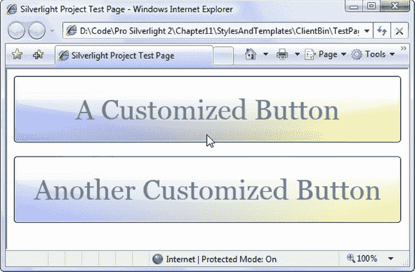
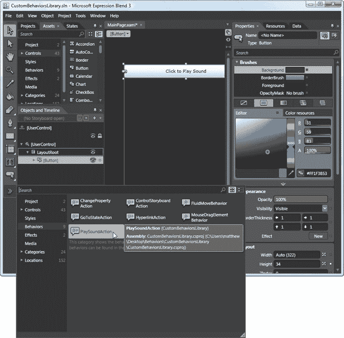
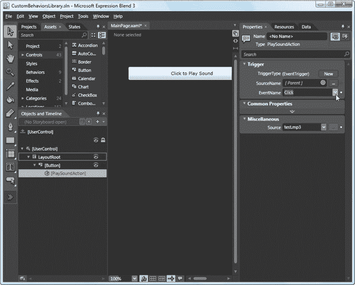
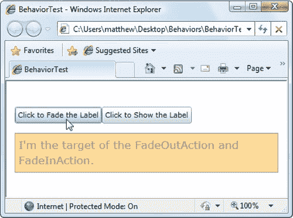
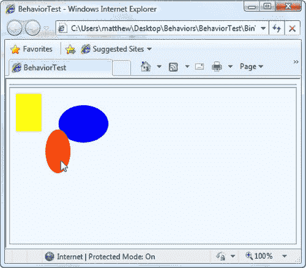
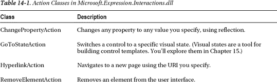
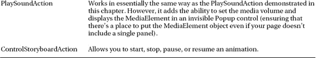
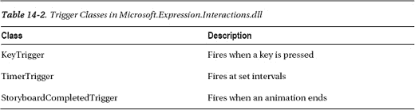
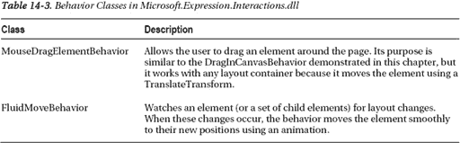
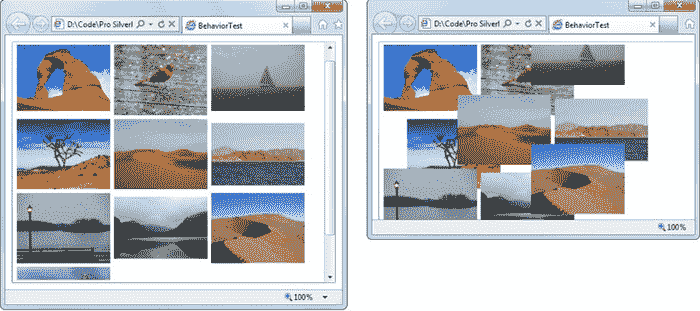

## 第十四章

## 风格和行为

如果你局限于普通按钮和其他常见控件的简单灰色外观，Silverlight 应用程序将会是单调乏味的一堆。幸运的是，Silverlight 有几个特性可以让您在基本元素中注入一些风格，并标准化应用程序的视觉外观。在这一章中，你将学习两个最重要的:风格和行为。

样式是组织和重用格式选择的重要工具。您可以创建一组包含所有这些细节的样式，而不是用重复的标记填充您的 XAML 来设置诸如边距、填充、颜色和字体等细节。然后，您可以通过设置单个属性(或根据元素类型自动设置)在需要的地方应用样式。

*行为*是重用用户界面代码的一个更有野心的工具。基本思想是，行为封装了一点常见的 UI 功能(例如，使元素可拖动的代码)。如果您有正确的行为，您可以用一两行 XAML 标记将它附加到任何元素，从而节省您自己编写和调试代码的精力。目前，行为仍然是一个新的和发展中的特性，许多有用的预建行为肯定会在未来几个月内发布。

 **新功能** Silverlight 5 增加了对支持数据绑定的样式设置器的支持。虽然您可能不会直接使用这个特性，但是它对于其他以数据为中心的框架非常重要，尤其是当您使用模型-视图-视图模型(MVVM)模式时。有关更多详细信息，请参见“样式绑定表达式”一节。

### 款式

一个*样式*是一个属性值的集合，您可以在一个步骤中将其应用于一个元素。在 Silverlight 中，样式通过从元素标记中提取重复的格式细节来简化 XAML 标记。

Silverlight 样式系统的作用类似于 HTML 标记中的级联样式表(CSS)标准。像 CSS 一样，Silverlight 样式允许您定义一组通用的格式特征，并在整个应用程序中应用它们以确保一致性。

#### 定义风格

当有经验的 Silverlight 开发人员希望不止一次使用一组格式特征时，他们会求助于样式。例如，假设您需要标准化页面上所有按钮使用的字体和前景色。第一步是定义一个样式对象，包装了您想要设置的所有属性。您将把这个样式对象存储为一个资源，通常存储在 UserControl 中。保存整个页面资源的资源集合:

`**<UserControl.Resources>**
**  **
**</UserControl.Resources>**`

像所有的资源一样，这个样式有一个键名，这样你就可以在需要的时候把它从集合中取出来。在这种情况下，键名是 BigButtonStyle。(按照惯例，样式的键名通常以 *Style* 结尾。)此外，每个 Silverlight 样式都需要一个 TargetType，它是应用样式的元素的类型。在这种情况下，TargetType 属性指示此样式用于设置按钮的格式。

每种样式都有一个 Setters 集合和几个 Setter 对象，每个对象对应一个要设置的属性。每个 Setter 对象在一个元素中设置一个属性。唯一的限制是 setter 只能更改依赖属性，其他属性不能修改。(实际上，这并不是很大的限制，因为 Silverlight 元素几乎完全由依赖属性组成。)还需要注意的是，属性设置器可以作用于任何依赖属性，甚至是控制行为而不是外观的属性。例如，如果要对文本框应用样式，可以选择设置 AcceptsReturn 和 IsReadOnly 属性。

下面是一个设置了五个属性组合的样式，为按钮提供大而轻的 Georgia 字体文本:

`**<UserControl.Resources>**
**  **
**</UserControl.Resources>**`

在某些情况下，不能使用简单的属性字符串设置属性值。例如，你不能用一个字符串创建一个复杂的笔刷，如 LinearGradientBrush 或 ImageBrush。在这种情况下，您可以使用熟悉的 XAML 技巧，用嵌套元素替换属性。下面是一个设置按钮背景的示例:

`****`

更强大的是，样式可以设置变换、呈现效果和控制模板，从而彻底改变元素的外观。

#### 应用样式

每个 Silverlight 元素可以使用一种样式(或者没有样式)。样式通过元素的 style 属性(在 FrameworkElement 基类中定义)插入到元素中。例如，要将按钮配置为使用您以前创建的样式，您可以将按钮指向样式资源，如下所示:

`**<Button Style ="{ StaticResource BigButtonStyle}"**
**  Content="A Customized Button"></Button>**`

图 14-1 显示了一个带有两个使用 BigButtonStyle 按钮的页面。

***图 14-1。**重用带有样式的按钮设置*

风格系统增加了许多好处。它不仅允许您创建明显相关的设置组，还通过使应用这些设置变得更容易来简化您的标记。最重要的是，您可以应用一个样式，而不用担心它设置了什么属性。在前面的示例中，字体设置被组织成一个名为 BigButtonStyle 的样式。如果您后来决定大字体按钮也需要更多的填充和边距空间，您也可以为填充和边距属性添加 setters。所有使用该样式的按钮都会自动获取新的样式设置。

样式设置元素的初始外观，但是您可以随意覆盖它们设置的特征。例如，如果应用 BigButtonStyle 样式并显式设置 FontSize 属性，button 标记中的 FontSize 设置将覆盖该样式。理想情况下，你不会依赖这种行为。相反，如果您需要改变样式，您应该创建一个设置适当属性的新样式。这给了你更多的灵活性来调整你的用户界面。

#### 动态样式

虽然您通常希望在标记中链接样式，但是您也可以通过编程方式设置它们。您需要做的就是从适当的资源集合中提取样式。

下面是用于从页面的资源集合中检索 BigButtonStyle 并将其应用于名为 cmd 的按钮对象的代码:

`cmd.Style = (Style)this.Resources["AlternateBigButtonStyle"];`

您甚至可以从项目中单独的资源字典文件(或引用的程序集)中检索样式。首先，您需要创建一个 ResourceDictionary 对象并提供正确的 URI:

`ResourceDictionary resourceDictionary = new ResourceDictionary();
resourceDictionary.Source = new Uri("/Styles/AlternateStyles.xaml",
  UriKind.Relative);`

此示例假定资源字典是一个名为 AlternateStyles.xaml 的文件，位于名为 Styles 的项目文件夹中。要使此示例正常工作，必须将资源字典编译为内容文件(在“属性”窗口中将“生成操作”设置为“内容”)。

用正确的 URI 配置 ResourceDictionary 后，可以从内部检索对象:

`Style newStyle = (Style)resourceDictionary["BigButtonStyle"];
cmd.Style = newStyle;`

最后，若要移除样式，请将 style 属性设置为 null。

动态改变样式的能力为创建能够根据用户偏好改变外观的*皮肤化*应用程序开辟了可能性。然而，实现这样一个系统将是乏味的，因为您需要以编程方式检索每个样式对象并设置每个样式控件。在 WPF，这项工作要容易得多——您只需换入一个新的合并词典，所有使用该合并词典中的样式的控件都会自动更新。

#### 风格传承

在某些情况下，您可能希望使用一种样式的属性作为另一种更专业的样式的基础。通过设置样式的 BasedOn 属性，可以使用这种样式继承。例如，考虑以下两种风格:

`**<UserControl.Resources>**
**  **

**  **
**</UserControl.Resources>**`

第一个样式(BigButtonStyle)定义了四个属性。第二种样式(EmphasizedBigFontButtonStyle)从 BigFontButtonStyle 获取这些方面，然后用另外两个属性对它们进行补充，这两个属性在按钮周围应用了黑色的粗轮廓。这种由两部分组成的设计使您能够只应用字体设置或字体和颜色组合。这种设计还允许您创建更多的样式，这些样式包含您定义的字体或颜色细节(但不一定两者都包含)。

可以使用 BasedOn 属性创建整个继承样式链。唯一的规则是，如果您设置同一个属性两次，最后一个属性设置器(继承链中最远的派生类中的一个)将重写任何早期的定义。

 **提示**令人惊讶的是，继承的样式不需要和它的父样式有相同的目标类型。这意味着您可以创建与父样式具有相同格式属性但作用于不同元素的派生样式。但是，如果您的样式为一个不存在于其目标元素类型中的属性继承了一个 setter，您将会得到一个错误。(例如，TextBlock 和 button 类都有一个 FontFamily 属性，因此可以在 Button 样式中设置 FontFamily，并创建一个从它派生的 TextBlock 样式。但是，只有按钮具有 IsEnabled 属性，因此如果在按钮样式中设置 IsEnabled，则不能从中派生 TextBlock 样式。)

**风格继承增加复杂性**

虽然样式继承初看起来很方便，但通常不值得这么麻烦。这是因为样式继承和代码继承面临着同样的问题:依赖性使得应用程序更加脆弱。例如，如果您使用前面显示的标记，您将被迫为两种样式保持相同的字体特征。如果您决定更改 BigButtonStyle，EmphasizedBigButtonStyle 也会更改—除非您显式地添加更多覆盖继承值的 setters。

在两种风格的例子中，这个问题已经够微不足道了，但是如果在更现实的应用程序中使用风格继承，这个问题就变得很重要了。通常，样式是基于不同类型的内容和内容所扮演的角色来分类的。例如，销售应用程序可能包含 ProductTitleStyle、ProductTextStyle、HighlightQuoteStyle、NavigationButtonStyle 等样式。如果您将 ProductTitleStyle 基于 ProductTextStyle(可能是因为它们共享相同的字体)，那么如果您稍后将不想应用到 ProductTitleStyle 的设置应用到 ProductTextStyle，就会遇到麻烦(例如不同的边距)。在这种情况下，您将被迫在 ProductTextStyle 中定义您的设置，并在 ProductTitleStyle 中显式覆盖它们。最后，留给您的将是一个更复杂的模型和非常少的实际重用的样式设置。

除非您有特定的理由使一种样式基于另一种样式(例如，第二种样式是第一种样式的特例，它只是改变了大量继承设置中的一些特征)，否则在使用样式继承之前要仔细考虑。

#### 组织风格

在前面的示例中，样式对象是在页面级别定义的，然后在该页面内的按钮中重用。虽然这是一种常见的设计，但它肯定不是您的唯一选择。

严格来说，不需要一起使用样式和资源。例如，您可以通过直接填充其样式集合来定义特定按钮的样式，如下所示:

`**<Button Content="A Customized Button">**
**  <Button.Style>**
**    **
**  </Button.Style>**
**</Button>**`

这是可行的，但显然没那么有用。现在没办法和其他元素分享这种风格了。

更有用的是，您可能希望在不同的资源集合中定义样式。如果您想要创建更精细的目标样式，您可以使用其容器的资源集合来定义它们，例如 StackPanel 或 Grid。甚至有可能在多个级别定义相同的样式(在包含一个按钮的 StackPanel 和保存 StackPanel 的页面中)。在这种情况下，Silverlight 遵循您在第 2 章中学到的标准资源解析过程——它首先在当前元素的资源集合中搜索，然后是包含元素，然后是它的容器，依此类推，直到找到具有匹配名称的样式。

如果您想要在应用程序中重用样式，您应该使用应用程序的资源集合(在 App.xaml 文件中)来定义它们，这是 Silverlight 检查的最后一个位置。或者更好的是，将它们放在一个单独的资源字典中，该字典合并到需要它的每个页面的资源集合中，如第二章第一节所述。

#### 按类型自动应用样式

到目前为止，您已经看到了如何创建命名样式并在标记中引用它们。然而，还有另一种方法。您可以将样式自动应用于某种类型的元素。

做到这一点相当容易。您只需设置 TargetType 属性来指示适当的类型(如前所述),并完全省去键名。这里有一个例子:

`****
**</UserControl.Resources>**

**<StackPanel x:Name="LayoutRoot" Background="White">**
**  <Button Content="A Customized Button"></Button>**
**  <Button Content="Another Customized Button"></Button>**
**</StackPanel>**`

如果您想防止样式自动应用于某个元素，只需将 style 属性设置为其他值。如果您根本不想使用任何样式，只需将其设置为空值，这实际上删除了样式:

`**<Button Content="A Non-Customized Button" Style="{x:Null}"></Button>**`

虽然自动样式很方便，但是它们会使你的设计变得复杂。以下是几个原因:

*   在具有许多样式和多层样式的复杂页面中，很难跟踪给定的属性是通过属性值继承设置的还是通过样式设置的(如果是样式，是哪一个)。因此，如果您想更改一个简单的细节，您可能需要仔细检查整个页面的标记。
*   页面中的格式通常从更一般的开始，然后变得越来越精细。如果您在早期将自动样式应用于页面，您可能需要用显式样式覆盖许多地方的样式。这使得整体设计变得复杂。为您想要的格式特征的每种组合创建命名样式并按名称应用它们要简单得多。
*   例如，如果您为 TextBlock 元素创建一个自动样式，您将最终修改使用 TextBlock 的其他控件(如模板驱动的 ListBox 控件)。

为了避免问题，最好明智地应用自动样式。如果你决定使用自动样式给你的整个用户界面一个单一的、一致的外观，试着把你的显式样式的使用限制在特殊情况下。

#### 样式绑定表达式

在第 2 章中，你学习了 XAML 在 XAML 定义资源和编写简单的绑定表达式。这两种技术都适用于样式。

首先，您可以在样式设置器中使用 StaticResource 标记扩展来引用资源对象。这里有一个例子:

`**<UserControl.Resources>**
**  <FontFamily x:Key="buttonFontFamily">Georgia</FontFamily>**
**  <sys:Double x:Key="buttonFontSize">18</sys:Double>**
**  <FontWeight x:Key="buttonFontWeight">Bold</FontWeight>        **

**  **
**</UserControl.Resources>**`

这段标记添加了三个资源:一个 FontFamily 对象，其中包含您要使用的字体的名称，一个存储数字 18 的 double 值，以及枚举值 FontWeight.Bold。它假定您已经将系统名称空间 System 映射到 XML 名称空间前缀 sys，如下所示:

`**<UserControl xmlns:sys="clr-namespace:System;assembly=mscorlib" ... >**`

 **注意**资源不需要和你的样式设置在同一个页面。Silverlight 将向上搜索资源树，以应用程序资源结束，如第 2 章中的[所述。](02.html#ch2)

当然，您可能更喜欢将这些字体设置打包到一个对象中。Silverlight 没有任何一体化的字体类，但您当然可以创建自己的字体类，如下面所示的 FontInfo 类:

`**public class FontInfo**
**{**
**    public FontFamily FontFamily { get; set; }        **
**    public double FontSize { get; set; }**
**    public FontWeight FontWeight { get; set; }**
**}**`

如果您使该名称空间对您的标记可用:

`**<UserControl xmlns:local="clr-namespace:Styles" ... >**`

您可以在资源集合中使用它，并在样式中绑定到它:

`**<UserControl.Resources>**
**  <local:FontInfo x:Key="buttonFont" FontFamily="Georgia" FontSize="18"**
**   FontWeight="Bold"></local:FontInfo>**

**  **
**</UserControl.Resources>**`

在这里，每个绑定表达式获取名为 buttonFont 的资源并提取单个属性，就像您在第 2 章中学习的那样。

这两种技术都会注入依赖性，这会使您的代码更脆弱，更难处理。例如，很容易在链接资源不可用的页面中意外应用这些样式。一般来说，这些特性意味着支持更高层次的框架，比如在第四章的[命令部分介绍的](04.html#ch4) MVVM 工具包。您可以自己使用它们，但是注意不要让您的标记变得过于复杂。

### 行为

样式为您提供了一种重用属性设置组的实用方法。它们是很好的第一步，可以帮助你构建一致的、组织良好的界面——但是它们也有很大的局限性。

问题在于，在典型的应用程序中，属性设置只是用户界面基础结构的一小部分。即使是最基本的程序通常也需要大量与应用程序功能无关的用户界面代码。在许多程序中，用于 UI 任务的代码(如驱动动画、支持流畅的效果、维护用户界面状态以及支持用户界面功能，如拖动、缩放和停靠)在大小和复杂性上都远远超过了业务代码。大部分代码都是通用的，这意味着您最终会在您创建的每个 Silverlight 项目中编写相同的内容。几乎所有的都是乏味的。

基于这一事实，很明显，重用用户界面代码的方法比通过样式重用属性值的系统更有用。到目前为止，Silverlight 还没有遇到挑战。但是一个新的行为系统开始填补这个空白。这个想法很简单:您(或另一个开发人员)创建一个封装了用户界面功能的行为。这个功能可以是基本的(比如开始一个故事板或者导航到一个超链接)。或者，它可能很复杂(例如处理深度缩放图像的滚动和鼠标滚轮，或者用实时物理引擎模拟碰撞)。构建完成后，可以通过挂钩正确的行为并设置其属性，将此功能添加到任何应用程序中的另一个控件中。在 Expression Blend 中，使用行为只需拖放操作。

 **注意**定制控件是在一个应用程序中(或在多个应用程序中)重用用户界面功能的另一种技术。但是，自定义控件必须开发为视觉效果和代码的紧密链接包。尽管自定义控件非常强大，但它们不能解决需要为许多不同的控件配备类似功能的情况(例如，为一组不同的元素添加鼠标悬停呈现效果)。因此，样式、行为和自定义控件都是互补的，一些最灵活的应用程序会结合使用它们。您将在本章的其余部分了解行为，并在下一章了解自定义控件。

#### 获得对行为的支持

有一个条件。Silverlight SDK 中不包含用于重用用户界面代码公共块的新基础设施。相反，它与 Expression Blend 捆绑在一起。这是因为行为最初是 Expression Blend 的设计时功能(Expression Blend 是当前唯一允许您通过将行为拖动到需要它们的控件上来添加行为的工具)。这并不意味着行为只在 Expression Blend 中有用。只需稍加努力，您就可以在 Visual Studio 应用程序中创建和使用它们。(您只需要手动编写标记，而不是使用工具箱。)

要获得支持行为的程序集，您有三种选择:

*   为 Silverlight 5 使用 Expression Blend 的测试版。(要获取，在`[www.microsoft.com/download](http://www.microsoft.com/download)`搜索“Silverlight 5”。)
*   为 Silverlight 4 安装 Expression Blend SDK(可在`[http://tinyurl.com/25sh2jt](http://tinyurl.com/25sh2jt)`获得)。即使版本号不匹配，这也同样适用于 Silverlight 5。微软也可能在未来的某个时候为 Silverlight 5 发布 Expression Blend SDK。
*   使用表达式混合 4。即使您不能在 Expression Blend 4 中创作 Silverlight 5 应用程序，您仍然可以从 Expression Blend 4 安装中获取所需的程序集。

无论您使用哪个选项，您都会得到两个重要的程序集:

*   System.Windows.Interactivity.dll:这个集合定义了支持行为的基类。这是行为特征的基础。
*   Microsoft.Expression.Interactions.dll:这个组件增加了一些有用的扩展，基于核心行为类的可选动作和触发类。

在类似 c:\ Program Files \ Microsoft SDKs \ Expression \ Blend \ Silverlight \ v 5.0 \ Libraries 的文件夹中查找这些程序集。如果您使用的是支持 Silverlight 4 而不是 Silverlight 5 的 Expression Blend 版本，请将路径的 *v5.0* 文件夹部分更改为 *v4.0* ，并在那里查找程序集。

在接下来的几节中，您将看到如何开发一个简单的动作，并将其连接到一个应用程序中，只需要使用 System.Windows.Interactivity.dll 程序集。一旦你完成了这个练习并理解了行为模型，你将检查 Microsoft.Expression.Interactions.dll 集合并考虑其他现成的行为。

#### 触发器和动作

行为特性由三个更小的成分组成——触发器、动作和行为类——它们都被称为行为，这有点令人困惑。

触发器和动作一起工作。当某事发生时，触发器触发并调用一个操作。触发器和动作一起构成了最简单的行为形式。

##### 创建操作

为了掌握触发器和动作，设计一个自己的简单动作会有所帮助。例如，假设您希望在用户执行操作(如单击按钮)时播放声音。不用行为就可以很容易地实现这一点——向页面添加一个 MediaElement，提供一个音频文件的 URI，然后调用 MediaElement。在适当的时候播放()方法。然而，这些细节增加了不必要的混乱。如果您想要播放一系列不同的声音来响应不同的事件，您需要管理数量惊人的代码。

您可以通过一个为您处理回放的操作来避免麻烦。假设没有人创造出你需要的动作，你可以自己创造。首先，创建一个 Silverlight 类库程序集。(在本例中，它被称为 CustomBehaviorsLibrary。)然后，添加对 System.Windows.Interactivity.dll 程序集的引用。最后，创建一个从 TriggerAction 派生的 action 类，如下所示:

`**Public Class PlaySoundAction**
**    Inherits TriggerAction(Of FrameworkElement)**
**{ ... }**`

所有的动作都来源于令人困惑的 TriggerAction 类。这是因为这些动作是由触发器激活的。(理论上，该模型可以支持以不同方式连接的动作，尽管它目前不支持，也没有理由支持。)

 **注意**理想情况下，你不需要自己创建一个动作——相反，你将使用别人已经创建的现成动作。虽然 System.Windows.Interactivity.dll 程序集没有包含任何动作类，但是在本章的后面你会找到一些。

正如您在前面的示例中看到的，TriggerAction 类使用了泛型。当您从 TriggerAction 派生时，您提供可以将您的操作用作类型参数的元素类型。除非您的操作需要触发元素中的特殊功能，否则通常使用 UIElement 或 FrameworkElement。在此示例中，PlaySoundAction 支持任何 FrameworkElement。(它使用 FrameworkElement，而不是更通用的 UIElement 类，因为它需要使用 VisualTreeHelper 来搜索可视化树，您很快就会看到这一点。但是因为所有元素都继承自 FrameworkElement，而 framework element 又继承自 UIElement，所以实际上没有区别。)

像任何其他类一样，您的操作需要属性。理想情况下，您将使用依赖属性为自己提供对其他 Silverlight 特性的最佳支持。在本例中，PlaySoundAction 只需要一个属性，即指向音频文件的 URI 源:

`**public static readonly DependencyProperty SourceProperty =**
**  DependencyProperty.Register("Source", typeof(Uri),**
**    typeof(PlaySoundAction), new PropertyMetadata(null));**

**public Uri Source**
**{**
**    get { return (Uri)GetValue(PlaySoundAction.SourceProperty); }**
**    set { SetValue(PlaySoundAction.SourceProperty, value); }**
**}**`

当触发器触发时，它通过调用 Invoke()方法来激活您的操作。您可以重写此方法来为您的操作提供所有代码。在本例中，这意味着您需要提供播放音频的代码。

正如你从第 12 章中所知道的，Silverlight 中的媒体支持有一个明确的限制。要通过 MediaElement 播放任何内容，您必须将它放在您的元素层次结构中。即使您的 MediaElement 旨在播放普通音频，并且没有视觉效果，它也需要位于页面的视觉树中。

在 PlaySoundAction 类中，可以用几种可能的方法来处理这种限制。例如，您可以在页面上包含一个采用 MediaElement 名称的属性。PlaySoundAction 然后可以查找 MediaElement 并使用它。另一种方法是创建您需要的 MediaElement，然后在回放完成后立即删除它。这种方法有几个优点:它使您不必自己定义 MediaElement，并且允许您同时播放无限数量的声音。下面是完成这项工作的代码，使用 FindContainer()方法获取一个可以插入 MediaElement 的容器:

`**protected override void Invoke(object args)**
**{**
**    // Find a place to insert the MediaElement.**`
`**    Panel container = FindContainer();**

**    if (container != null)**
**    {**
**        // Create and configure the MediaElement.**
**        MediaElement media = new MediaElement();**
**        media.Source = this.Source;**

**        // Hook up handlers that will clean up when playback finishes.**
**        media.MediaEnded += delegate**
**        {**
**            container.Children.Remove(media);**
**        };**

**        media.MediaFailed += delegate**
**        {**
**            container.Children.Remove(media);**
**        };**

**        // Add the MediaElement and begin playback.**
**        media.AutoPlay = true;**
**        container.Children.Add(media);**
**    }**
**}**`

FindContainer()方法使用 VisualTreeHelper 在元素的层次结构中向上移动，从当前元素开始。一旦找到任何可以注入新 MediaElement 的布局容器(换句话说，从 Panel 派生的类),它就会停止。如果找不到面板，则无法添加 MediaElement，也不会播放媒体。这在包含单个控件的窗口中是可能的，但在其他任何情况下都不可能。要获取当前元素(附加了操作的元素)，可以使用继承的 TriggerAction。AssociatedObject 属性:

`**private Panel FindContainer()**
**{**
**    FrameworkElement element = this.AssociatedObject;**

**    // Search for some sort of panel where the MediaElement can be inserted.            **
**    while (element != null)**
**    {**
**        if (element is Panel) return (Panel)element;**

**        element = VisualTreeHelper.GetParent(element) as FrameworkElement;**
**    }**
**    return null;**
**}**`

这就完成了动作的代码。如您所见，大多数 action 类只包含属性和执行某些操作的 Invoke()方法。在下一节中，您将学习如何将一个元素连接到您的操作。

##### 将动作连接到元素

要使用动作，您需要触发器的帮助。从技术上讲，触发器连接到您的元素，而操作连接到您的触发器。这意味着使用 PlaySoundAction 的第一步是选择一个合适的触发器。

所有触发器都源自 TriggerBase。System.Windows.Interactivity.dll 程序集包含一个名为 EventTrigger 的触发器，该触发器在特定事件发生时触发。虽然您可以创建自己的触发器，但 EventTrigger 足够灵活，可以处理各种场景。

 **注意**您可能创建自己的触发器的一个原因是为了响应某个事件和状态*组合*。例如，自定义触发器可以截取一个事件，检查一些其他细节，然后决定是否触发。构建这样的触发器很容易:从 TriggerBase 类派生，重写 OnAttached()以连接适当的事件，重写 OnDetaching()以断开事件处理程序。当你正在观察的事件发生时，你的触发器会处理它。如果您的触发器决定触发，它将调用继承的 InvokeActions()方法。

要测试 PlaySoundAction，首先创建一个新的 Silverlight 项目。然后，添加对定义 PlaySoundAction 类(您在上一节中创建的)和 System.Windows.Interactivity.dll 程序集的类库的引用。然后，映射两个名称空间。假设 PlaySoundAction 类存储在名为 CustomBehaviorsLibrary 的类库中，您将需要这样的标记:

`**<UserControl xmlns:i="clr-namespace:System.Windows.Interactivity;**
**assembly=System.Windows.Interactivity" xmlns:custom=**
**"clr-namespace:CustomBehaviorsLibrary;assembly=CustomBehaviorsLibrary" ... >**`

您可以使用附加的交互向任何元素添加触发器。触发在 System.Windows.Interactivity.dll 程序集中定义的集合。下面是一个向按钮添加事件触发器的示例:

`**<Button Content="Click to Play Sound">**
**  <i:Interaction.Triggers>**
**    <i:EventTrigger EventName="Click">**
**    </i:EventTrigger>**
**  </i:Interaction.Triggers>**
**</Button>**`

事件触发器。EventName 属性标识要响应的事件。在此示例中，当按钮。发生 Click 事件。

最后一步是将行为添加到 EventTrigger。动作集合。通过在事件触发器内声明行为，可以在标记中实现这一点:

`**<Button Content="Click to Play Sound">**
**  <i:Interaction.Triggers>**
**    <i:EventTrigger EventName="Click">**
**      <custom:PlaySoundAction Source="test.mp3" />**

**    </i:EventTrigger>**
**  </i:Interaction.Triggers>**`
`**</Button>**`

现在，您可以运行页面并测试按钮。单击该按钮时，将开始播放 test.mp3 文件。从应用程序开发人员的角度来看，所需要的只是正确的行为和几行简单的标记。您可以使用相同的操作将声音连接到同一页面中任意数量的不同元素和不同事件。你甚至可以添加一系列的动作到你的触发器中，在这种情况下，它们将被快速连续地启动。

但这还不是故事的全部。如果你在 Expression Blend 中开发，行为会给你一个更好的设计体验——可以让你不用写任何标记。

##### Blend 中的设计时行为支持

在 Expression Blend 中，处理行为是一种拖放和配置操作。首先，您需要确保您的应用程序引用了包含您想要使用的行为的程序集。(在本例中，这是定义 PlaySoundAction 的类库程序集。)接下来，您需要确保它还引用了 System.Windows.Interactivity.dll 程序集。

Expression Blend 会自动在所有引用的集合中搜索动作，并在资源库(设计 Silverlight 页面时用于选择元素的同一面板)中显示它们。它还会添加 Microsoft.Expression.Interactions.dll 程序集中的行为，即使您的项目尚未引用这些行为。

要查看您必须选择的行为，首先在页面的设计图面上绘制一个按钮，单击“资源库”按钮，然后单击“行为”选项卡([图 14-2](#fig_14_2) )。

***图 14-2。**资产库中的动作*

要将动作添加到控件，请将其从资源库中拖动并放到您的控件上(在本例中为按钮)。当您执行此步骤时，Expression Blend 会自动为您的元素创建一个触发器，并在其中创建操作。然后由您来配置这两个对象—通常是通过在“对象和时间线”窗格中选择动作，然后在“属性”窗口中调整选项([图 14-3](#fig_14_3) )。

***图 14-3。**配置操作(及其触发器)*

默认情况下，当您向按钮添加新操作时，Expression Blend 会为 Click 事件创建一个 EventTrigger。您可以在属性窗口中选择一个新事件(或不同的触发器)(如图[图 14-3](#fig_14_3) 所示)。其他元素使用不同的默认事件，例如，ListBox 使用 SelectionChanged 事件，而 Rectangle 使用 Loaded 事件。

顺便说一下，您可以通过将 DefaultTrigger 属性添加到您的 action 类来告诉 Expression Blend 默认使用什么触发器。下面的示例告诉 Expression Blend 使用非常流行的 EventTrigger，并将其设置为对 MouseLeftButtonDown 事件做出反应:

` **[DefaultTrigger(typeof(UIElement), typeof(EventTrigger),**
** new object[] {"MouseLeftButtonDown"})]**
**public class PlaySoundAction : TriggerAction<FrameworkElement>**
**{ ... }**`

正如您所看到的，DefaultTrigger 属性有几个参数，这些参数指定了正在连接的元素的类型、触发器的类型以及传递给触发器的构造函数的任何附加信息(比如事件触发器的事件名称)。您甚至可以更具体地根据应用动作的元素类型选择一个不同的触发器。为此，请添加多个 DefaultTrigger 属性，按从高到低的顺序排列。例如，下面的组合确保当您将 PlaySoundAction 连接到按钮时，Expression Blend 以 Click 事件的 EventTrigger 开始。对于矩形这样的形状派生元素，它使用设置为 MouseEnter 事件的 EventTrigger。对于所有其他元素，它使用设置为 MouseLeftButtonDown 事件的 EventTrigger:

`**[DefaultTrigger(typeof(ButtonBase), typeof(EventTrigger), new object[] {"Click"})]**
**[DefaultTrigger(typeof(Shape), typeof(EventTrigger), new object[] {"MouseEnter"})]**
**[DefaultTrigger(typeof(UIElement), typeof(EventTrigger),**
 **new object[] {"MouseLeftButtonDown"})]**
**public class PlaySoundAction : TriggerAction<FrameworkElement>**
**{ ... }**`

##### 创建目标触发器

如您所见，每个动作都可以使用 TriggerAction 访问它所附加的元素。AssociatedObject 属性。在 PlaySoundAction 中，这种能力允许代码在元素树中搜索合适的布局容器。其他操作可以从源元素中检索附加信息，或者以某种方式改变它。但是许多操作需要超越源元素，在另一个元素上执行工作。例如，单击一个按钮可能会导致放置在不同位置的另一个控件发生变化。尽管您可以尝试通过添加额外的属性来处理这种情况，但是 Silverlight 有一个更好的解决方案——您可以从更专门化的 TargetedTriggerAction 派生您的操作。TargetedTriggerAction 提供了一个目标属性，应用程序开发人员设置该属性，您的触发器代码检查该属性。然后，您可以对该元素执行必要的操作。除了 Target 属性之外，TargetedTriggerAction 的工作方式与标准 TriggerAction 完全相同。

下面的示例显示了一对从 TargetedTriggerAction 派生的操作。第一个是 FadeOutAction，它在目标上运行动画，将目标元素的不透明度逐渐淡化为 0。第二个是 FadeInAction，它使用另一个动画将它淡入。下面是 FadeOutAction 的完整代码:

`**public class FadeOutAction : TargetedTriggerAction<UIElement>**
**{**
**    // The default fade out time is 2 seconds.**
**    public static readonly DependencyProperty DurationProperty =**
**      DependencyProperty.Register("Duration", typeof(TimeSpan),**
**        typeof(FadeOutAction), new PropertyMetadata(TimeSpan.FromSeconds(2)));**

**    public TimeSpan Duration**
**    {**
**        get { return (TimeSpan)GetValue(FadeOutAction.DurationProperty); }**
**        set { SetValue(FadeOutAction.DurationProperty, value); }**
**    }**

**    private Storyboard fadeStoryboard = new Storyboard();**
**    private DoubleAnimation fadeAnimation = new DoubleAnimation();**

**    public FadeOutAction()**
**    {**
**        fadeStoryboard.Children.Add(fadeAnimation);**`
`**    }**

**    protected override void Invoke(object args)**
**    {**
**        // Make sure the storyboard isn't already running.**
**        fadeStoryboard.Stop();**
**        // Set up the storyboard.            **
**        Storyboard.SetTarget(fadeAnimation, this.Target);**
**        Storyboard.SetTargetProperty(fadeAnimation, new PropertyPath("Opacity"));           **

**        // Set up the animation.**
**        // It's important to do this at the last possible instant,**
**        // in case the value for the Duration property changes.**
**        fadeAnimation.To = 0;**
**        fadeAnimation.Duration = Duration;            **

**        fadeStoryboard.Begin();**
**    }**
**}**`

fade deactivation 几乎相同。它将不透明度设置为 1，默认时间仅为 0.5 秒:

`**public class FadeInAction : TargetedTriggerAction<UIElement>**
**{**
**    // The default fade in is 0.5 seconds.
    public static readonly DependencyProperty DurationProperty =**
**      DependencyProperty.Register("Duration", typeof(TimeSpan),**
**        typeof(FadeInAction), new PropertyMetadata(TimeSpan.FromSeconds(0.5)));**
 **public TimeSpan Duration**
**    {**
**        get { return (TimeSpan) etValue(FadeInAction.DurationProperty); }**
**        set { SetValue(FadeInAction.DurationProperty, value); }**
**    }**
 **private Storyboard fadeStoryboard = new Storyboard();**
**    private DoubleAnimation fadeAnimation = new DoubleAnimation();**
 **public FadeInAction()**
**    {**
**        fadeStoryboard.Children.Add(fadeAnimation);**
**    }**
 **protected override void Invoke(object args)**
**    {**
**        // Make sure the storyboard isn't already running.
        fadeStoryboard.Stop();**
 **// Set up the storyboard.            
        Storyboard.SetTarget(fadeAnimation, this.Target);**`
`**        Storyboard.SetTargetProperty(fadeAnimation, new PropertyPath("Opacity"));**
**        // Set up the animation.            
        fadeAnimation.To = 1;**
**        fadeAnimation.Duration = Duration;            **
 **fadeStoryboard.Begin();**
**    }**
**}**`

这是一个使用这两个动作的例子。通过点击两个按钮中的一个，用户可以淡出或淡入一个文本块。

`**<StackPanel Orientation="Horizontal" Margin="3,15">**
**  <Button Content="Click to Fade the TextBlock" Padding="5">**
**    <i:Interaction.Triggers>**
**      <i:EventTrigger EventName="Click">**
**        <custom:FadeOutAction TargetName="border" />**
**      </i:EventTrigger>**
**    </i:Interaction.Triggers>**
**  </Button>**

**  <Button Content="Click to Show the TextBlock" Padding="5">**
**    <i:Interaction.Triggers>**
**      <i:EventTrigger EventName="Click">**
**        <custom:FadeInAction TargetName="border" />**
**      </i:EventTrigger>**
**    </i:Interaction.Triggers>**
**  </Button>**
**</StackPanel>**

**<Border x:Name="border" Background="Orange" BorderBrush="Black" BorderThickness="1"**
**Margin="3,0" >**
**  <TextBlock Margin="5" FontSize="17" TextWrapping="Wrap"**
**   Text="I'm the target of the FadeOutAction and FadeInAction."></TextBlock>**
**</Border>**`

图 14-4 显示了结果。

***图 14-4。**使用目标触发器*

很明显，可以将 FadeOutAction 和 FadeInAction 组合成一个更通用的 FadeAction，它带有一个附加属性(比如 TargetOpacity)。然而，行为通常被设计得更加具体，因此它们可以被拖放到一个元素上，并通过最少的属性设置来使用。同样，您可以使用 ControlStoryboardAction(它是 Microsoft.Expression.Interactivity.dll 程序集的一部分)运行任何动画效果。然而，封装以编程方式创建的动画并将任何相关细节作为高级属性公开是一种常见的动作设计模式。这简化了您的应用程序，并显著减少了所需的标记数量。

顺便说一句，如果您想避免创建和删除 MediaElement 对象的开销(并且您可以忍受对所有声音使用单个 MediaElement 所带来的一次一个声音的限制)，有针对性的操作提供了一种方法，您可以重新制作前面显示的 PlaySoundAction。与其动态插入 MediaElement，不如让应用程序开发人员来做这项工作，然后从 TargetedTriggerAction 派生 PlaySoundAction。触发目标将是媒体元素。

**交换源和目标**

关于动作的来源和目标有一个鲜为人知的事实:它们是可以互换的。事实上，应用程序开发人员有能力设置目标和源元素。正如您已经看到的，您使用动作的 TargetName 属性来设置目标。此外，您可以使用包含触发器的 SourceName 属性来设置源。这意味着动作的来源不一定是它所在的元素。

这种设计允许两种不同的场景。最常见的场景是您已经看到的场景，其中触发器和操作嵌套在源元素中。这被称为*告诉*模型，因为你告诉行动要作用于特定的目标。但是为了更大的灵活性，动作还支持*监听*模型，其中动作被定义在目标中，并且您要求它监听不同的源元素。无论哪种方式，动作都以相同的方式工作，并且在 Expression Blend 中具有相同的方便的设计时支持。(同样可以在一个元素中创建一个动作，将它的源设置为第二个元素，将的目标指向第三个元素，但是很难想象这种方法会带来什么好处。)

#### 创造行为

虽然动作通常被描述为行为(它们出现在 Expression Blend 的“资源库”窗口的“行为”部分)，但还有第二种行为，由“行为”类表示。

行为和动作有着相同的目标:它们的目标是封装一些 UI 功能，这样您就可以将它们应用到元素中，而无需自己编写代码。不同之处在于，每个动作都是完成单一任务的一段独特的代码。虽然您可以创建一组相关的操作(如 FadeOutAction 和 FadeInAction)，但每个操作都是独立的，可以独立使用。类似地，动作和触发器是互补的，单个动作不与特定的触发器相关联。任何动作都可以与任何触发器一起使用。

另一方面，行为将相关操作组合在一起。它们包括触发器(监听某些事件或变化)和动作(执行适当的操作)的工作。他们通常做几件相关的事情，这些事情不能被分割成更小的构件，因为他们总是组合在一起使用。例如，深度缩放功能由几个事件处理程序组成，允许您使用鼠标按钮和鼠标滚轮平移和缩放深度缩放图像。总之，这段代码为导航深度缩放图像建立了一个基本的支持级别，它被包装在一个名为 DeepZoomBehavior 的行为中。

提示作为一个经验法则，如果你发现自己试图创建共享数据或交互的动作，或者如果你需要动作和特定行为之间的紧密耦合，你应该考虑将你的功能实现为一个行为。

为了更好地理解行为，创造你自己的行为是值得的。假设您想赋予任何元素用鼠标在画布上拖动的能力。在第 4 章中，你看到了如何用可拖动的圆的例子为椭圆实现这个特性。但是只要再努力一点，您就可以将这些代码转换成可重用的行为，为任何画布上的任何元素提供拖动支持。

第一步是创建一个从基本行为类派生的类。与 TriggerAction 和 TargetedTriggerAction 类一样，Behavior 是一个采用类型参数的泛型类。您可以使用此类型参数将您的行为限制到特定元素，也可以使用 UIElement 或 FrameworkElement 来包含所有元素:

`**public class DragInCanvasBehavior : Behavior<UIElement>**
**{ ... }**`

任何行为的第一步都是重写 OnAttached()和 OnDetaching()方法。当调用 OnAttached()时，可以访问放置行为的元素(通过 AssociatedObject 属性)并附加事件处理程序。当调用 OnDetaching()时，您将移除事件处理程序。

以下是 DragInCanvasBehavior 用来监视 MouseLeftButtonDown、MouseMove 和 MouseLeftButtonUp 事件的代码:

`**protected override void OnAttached()**
**{**
**    base.OnAttached();**
 **// Hook up event handlers.
    this.AssociatedObject.MouseLeftButtonDown +=**
**      AssociatedObject_MouseLeftButtonDown;**
**    this.AssociatedObject.MouseMove += AssociatedObject_MouseMove;**
**    this.AssociatedObject.MouseLeftButtonUp += AssociatedObject_MouseLeftButtonUp;**
**}**
 **protected override void OnDetaching()**
**{**
**    base.OnDetaching();**
 **// Detach event handlers.
    this.AssociatedObject.MouseLeftButtonDown -=**
**      AssociatedObject_MouseLeftButtonDown;**
**    this.AssociatedObject.MouseMove -= AssociatedObject_MouseMove;**
**    this.AssociatedObject.MouseLeftButtonUp -= AssociatedObject_MouseLeftButtonUp;**
**}**`

最后一步是在事件处理程序中运行适当的代码。例如，当用户单击鼠标左键时，DragInCanvasBehavior 开始拖动操作，记录元素左上角和鼠标指针之间的偏移量，并捕获鼠标:

`**// Keep track of the Canvas where this element is placed.**
**private Canvas canvas;** 
**// Keep track of when the element is being dragged.**
**private bool isDragging = false;**

**// When the element is clicked, record the exact position**
**// where the click is made.**
**private Point mouseOffset;** 
**private void AssociatedObject_MouseLeftButtonDown(object sender,
  MouseButtonEventArgs e)
{
    // Find the Canvas.**
**if (canvas == null)
      canvas = (Canvas)VisualTreeHelper.GetParent(this.AssociatedObject);** 
**    // Dragging mode begins.**
**    isDragging = true;**
**    // Get the position of the click relative to the element**
**    // (so the top-left corner of the element is (0,0).**
**    mouseOffset = e.GetPosition(AssociatedObject);**

**    // Capture the mouse. This way you'll keep receiving**
**    // the MouseMove event even if the user jerks the mouse**`
`**    // off the element.**
**    AssociatedObject.CaptureMouse();**
**}**`

当元素处于拖动模式且鼠标移动时，元素将被重新定位:

`**private void AssociatedObject_MouseMove(object sender, MouseEventArgs e)**
**{**
**    if (isDragging)**
**    {             **
**        // Get the position of the element relative to the Canvas.
        Point point = e.GetPosition(canvas);**
 **// Move the element.
        AssociatedObject.SetValue(Canvas.TopProperty, point.Y - mouseOffset.Y);**
**        AssociatedObject.SetValue(Canvas.LeftProperty, point.X - mouseOffset.X);**
**    }**
**}**`

当释放鼠标按钮时，拖动结束:

`**private void AssociatedObject_MouseLeftButtonUp(object sender,**
**  MouseButtonEventArgs e)**
**{**
**    if (isDragging)**
**    {**
**        AssociatedObject.ReleaseMouseCapture();**
**        isDragging = false;**
**    }**
**}**`

要使用这种行为，您只需向画布中的任何元素添加。以下标记创建了一个包含三个形状的画布。这两个椭圆元素使用 DragInCanvasBehavior，可以在画布上拖动。矩形元素没有，因此不能移动。

`**<Canvas>**
**  <Rectangle Canvas.Left="10" Canvas.Top="10" Fill="Yellow" Width="40" Height="60">**
**  </Rectangle>**

**  <Ellipse Canvas.Left="10" Canvas.Top="70" Fill="Blue" Width="80" Height="60">**
**    <i:Interaction.Behaviors>**
**      <custom:DragInCanvasBehavior></custom:DragInCanvasBehavior>**
**    </i:Interaction.Behaviors>**
**  </Ellipse>**

**  <Ellipse Canvas.Left="80" Canvas.Top="70" Fill="OrangeRed" Width="40" Height="70">**
**    <i:Interaction.Behaviors>**
**      <custom:DragInCanvasBehavior></custom:DragInCanvasBehavior>**
**    </i:Interaction.Behaviors>**
**  </Ellipse>**
**</Canvas>**`

图 14-5 显示了这个例子的作用。

***图 14-5。**用行为制作可拖动的元素*

#### 发现更多行为

尽管你现在已经知道了足够的知识来创建你自己的行动、触发器和行为，但大多数时候你并不想这样做。相反，您将把预制的行为类放到您的应用程序中。这允许您快速连接用户界面功能，而无需编写任何自己的代码。如果你使用的是 Expression Blend，你也不需要输入 XAML 标记。

正如您已经了解到的，核心 System.Windows.Interactivity.dll 程序集不提供任何动作或行为，它只包含一个触发器类(有用的 EventTrigger)。

Microsoft.Expression.Interactions.dll 议会更实际。它包括一小组基本动作(见[表 14-1](#tab_14_1) )、触发器([表 14-2](#tab_14_2) )和行为([表 14-3](#tab_14_3) )。

要获得更多的行为，您可以尝试位于`[http://expressionblend.codeplex.com](http://expressionblend.codeplex.com)`的 Expression Blend Samples 项目和位于`[http://gallery.expression.microsoft.com](http://gallery.expression.microsoft.com)`的社区行为库。

#### 流体运动行为

到目前为止，你看到的行为都很简单。它们当然不是你不能自己实现的，只需要多写一点代码。然而，Expression Blend 的创作者将行为视为其驱动力的一部分，以使动画效果更易于访问。在他们的理想世界中，使用 Expression Blend 的业务开发人员将能够获得基本的用户界面，重新为其换肤(使用第 15 章中描述的模板功能)，并加入流畅的动画效果(在行为的帮助下)。

这种驱动的一个例子是 FluidMoveBehavior，它以动画形式显示布局的变化。使用 FluidMoveBehavior，当窗口调整大小时或出现新元素时，元素不会跳到新位置。取而代之的是，它们以一种短暂、流畅、生动的效果在那里传播。

[图 14-6](#fig_14_6) 显示了一个例子。这里，一系列图片存储在一个 WrapPanel 中(如左图所示)。当 WrapPanel 改变大小时，图片漂移到它们的新位置(如右边所示)。

***图 14-6。**制作布局变化动画*

创造这种效果很容易。首先，您需要 System.Windows.Interactivity.dll 程序集和 Microsoft.Expression.Interactions.dll 程序集(包含最重要的 FluidMoveBehavior)的帮助。

`**<UserControl xmlns:i=**
** "clr-namespace:System.Windows.Interactivity;assembly=System.Windows.Interactivity"**
** xmlns:ei="clr-namespace:Microsoft.Expression.Interactivity.Layout;assembly=**
**Microsoft.Expression.Interactions" ... >**`

接下来，您需要在 WrapPanel 中添加 FluidMoveBehavior。您可以设置效果的长度(使用 Duration 属性)并指示它应用于容器内的子级(使用 applies to 属性):

`**<toolkit:WrapPanel x:Name="panel" ItemWidth="150">**
**  <i:Interaction.Behaviors>**
**    <ei:FluidMoveBehavior Duration="0:0:0.6" AppliesTo="Children">**
**      ...**
**    </ei:FluidMoveBehavior>
  </i:Interaction.Behaviors>**
**</toolkit:WrapPanel>**`

还可以设置 EaseY 和 EaseX 属性来指定应用于移动的动画缓动。当元素从一边漂移到另一边时，EaseX 起作用，当元素向上或向下移动时，EaseY 起作用。你可以使用在第 10 章中学到的标准缓动功能。下面是创建[图 14-6](#fig_14_6) 中的例子的标记:

`**<ScrollViewer Margin="10">**
**  <toolkit:WrapPanel x:Name="panel" ItemWidth="150">**
**    <i:Interaction.Behaviors>**`
`**      <ei:FluidMoveBehavior Duration="0:0:0.6" AppliesTo="Children">**
**        <ei:FluidMoveBehavior.EaseY>**
**          <BackEase Amplitude="1"></BackEase>**
**        </ei:FluidMoveBehavior.EaseY>**
**        <ei:FluidMoveBehavior.EaseX>**
**          <BounceEase Bounces="4" Bounciness="3"></BounceEase>**
**        </ei:FluidMoveBehavior.EaseX>**
**          </ei:FluidMoveBehavior>**
**        </i:Interaction.Behaviors>**
**  </toolkit:WrapPanel>**
**</ScrollViewer>**`

在这一点上，你可能会想到，有很多其他的效果，如果能以最小的代价加入到应用程序中就好了，比如 FluidMoveBehavior。Expression Blend 的创作者也想到了这一点，他们增加了动画过渡和其他布局变化的方式。然而，行为特性还不够强大，不足以解决所有这些问题。相反，你需要将行为与视觉状态(你将在第 15 章学到的一个特性)、更多的标记和来自 Expression Blend 的一些自定义位结合起来。如果您是 Visual Studio 开发人员，您可能会发现这些功能不值得麻烦，因为您需要手动编写大量标记，而 Visual Studio 不会帮助您解决不可避免的错误。然而，如果你从事的业务是在 Visual Studio 中编写应用程序代码，然后在 Expression Blend 中对其进行润色，那么这些新的略微实验性的功能可能是一个有趣的新方向的开始。

### 最后一句话

在本章中，您看到了如何使用样式来重用元素的格式设置。您还考虑了如何使用行为来开发整洁的用户界面功能包，然后可以连接到任何元素。这两个工具都为您提供了一种方法来创建更智能、更易维护的用户界面——将格式细节和复杂的逻辑集中起来，而不是强迫您将它们分布到整个应用程序中并重复多次。

在下一章，你将继续学习如何用两个更强大的特性来制作智能用户界面:控件模板和自定义控件。