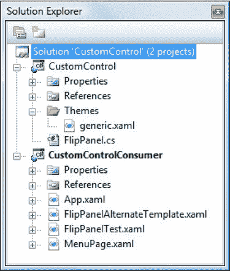
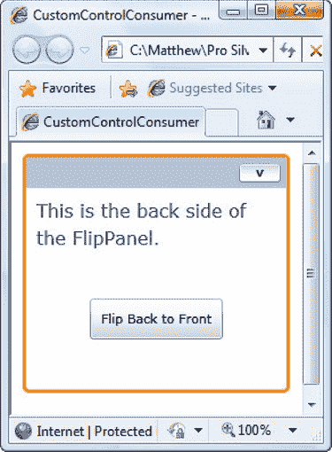

# 十五、控制模板

在前一章中，您学习了如何使用样式和行为来重用用户界面属性设置和代码。在本章中，你将探索两个更强大的工具:控件模板和自定义控件。

*模板*允许你改变任何普通控件的视觉“面貌”。换句话说，如果您不能通过单独调整属性来获得您想要的定制外观(通常您不能)，您几乎可以通过应用新模板来获得它。尽管创建自定义模板比仅仅设置控件属性更费工夫，但它仍然比开发一个全新的自定义控件要简单和灵活得多。此外，如果您正在自定义的控件支持部件和状态模型(大多数都支持),您可以在模板中放置自定义动画，例如，当鼠标悬停在按钮上时更改按钮发光的方式，或者设置当新项目添加到布局控件时滑动到位的动画。

尽管模板很强大，但您可能偶尔会选择创建自己的*自定义控件*。虽然模板允许您更改控件的外观和感觉，但只有自定义控件才允许您改变其内部工作方式并提供新功能。在这一章中，你将学习如何创建使用模板模型的设计良好的、可扩展的控件。这样，您(和其他开发人员)可以更改控件外观的每个方面，而不会丢失其行为的任何部分。

 **新功能** Silverlight 5 增加了布局过渡，这一功能可以帮助你将动画效果合并到列表框控件中。在理想世界中，这意味着图形设计师可以在 Expression Blend 中制作动画效果，程序员只需交换正确的模板即可使用。然而，这种模式仍在不断发展。有关基本示例，请参见“布局转换”一节。

### 模板基础知识

在前一章中，你学习了样式，它允许你改变一个元素的外观。但是，样式仅限于设置在 element 类中定义的属性。例如，按钮有各种各样的视觉细节，您不能更改，因为它们没有通过属性公开。例子包括按钮背景的阴影和点击时突出显示的方式。

但是 Silverlight 有另一个更加激进的定制工具，叫做*控件模板*。尽管可以对任何 Silverlight 元素使用样式，但是控件模板仅限于 Silverlight 控件——换句话说，就是从系统中的 control 类继承的元素。Windows.Controls 命名空间。这些元素获取一个名为 Template 的属性，您可以设置该属性以应用自定义模板，从而有效地覆盖控件的标准视觉效果。

例如，通过更改 Button 对象使用的模板，您可以创建许多奇特类型的按钮，这些按钮仅使用样式是不可想象的。您可以创建使用圆形或异形边框的按钮，以及使用引人注目的鼠标悬停效果(如发光、放大或闪烁)的按钮。你所需要做的就是利用你在第 8 章和第 9 章的[和](08.html#ch8)[中学到的绘画技巧，以及你在第 10 章](09.html#ch9)的[中学到的动画技术来构建你的定制模板。](10.html#ch10)

在下面几节中，您将深入了解常见控件使用的模板，并了解如何制作自定义模板。

#### 创建模板

每个控件都有一个内置的配方，决定了它应该如何呈现(作为一组更基本的元素)。该配方是控制模板。它是使用 XAML 标记块定义的，并通过 Template 属性应用于控件。

例如，考虑基本按钮。也许您想通过创建自定义模板来更好地控制按钮提供的阴影和动画效果。在这种情况下，第一步是尝试用您自己设计的模板替换按钮的默认模板。

要为一个基本按钮创建模板，您需要绘制自己的边框和背景，然后将内容放入按钮中。根据您选择的根元素，有几种可能的方法来绘制边框:

*   *Border* :这个元素有双重功能——它保存一个元素(比如一个带有按钮标题的 TextBlock)并在它周围绘制一个边框。
*   *Grid* :通过在同一个地方放置多个元素，可以创建一个带边框的按钮。使用 Silverlight shape 元素(如矩形或路径)，并将 TextBlock 放在同一个单元格中。确保 TextBlock 是在 XAML 中的形状之后定义的，这样它会叠加在形状背景上。网格的一个优点是它支持自动调整大小，因此您可以确保您的控件只根据其内容的需要而变大。
*   *Canvas*:Canvas 可以使用坐标更精确地放置元素。这通常是多余的，但如果您需要将一组形状放置在相对于彼此的特定位置，作为更复杂的按钮图形的一部分，这可能是一个不错的选择。

下面的示例使用 Border 类将圆形橙色轮廓与醒目的红色背景和白色文本相结合:

`<Button Content="A Custom Button Template">
  <Button.Template>
    <ControlTemplate TargetType="Button" >
      <Border BorderBrush="Orange" BorderThickness="3" CornerRadius="10"
       Background="Red">
        <TextBlock Foreground="White" Text="A Custom Template"></TextBlock>
      </Border>
    </ControlTemplate>
  </Button.Template>
</Button>`

图 15-1 显示了结果。

***图 15-1。**一个非常基本的按钮的新外观*

如果你尝试这个按钮，你会发现它是一个非常糟糕的模板。它失去了许多按钮功能(如单击按钮时改变外观)。它还忽略了您在按钮上设置的几乎所有属性，包括非常重要的内容属性。(相反，它显示一些硬编码的文本。)但是，这个模板正在成为一个更好的按钮模板，您将在下面几节中开始对它进行改进。

 **注意**此时，您可能想知道为什么在没有看到默认按钮模板的情况下就开始构建自定义按钮模板。这是因为默认模板非常详细。一个简单的按钮有一个四页长的控件模板。但是当你理解了一个模板是如何构建的，你就能够理解默认模板中的所有细节。

#### 重用控制模板

在前面的示例中，模板定义嵌套在元素中。但是更常见的是通过样式来设置控件的模板。这是因为您几乎总是希望重用您的模板来为同一控件的多个实例换肤。

为了适应这种设计，您需要将控件模板定义为一种资源:

`<UserControl.Resources>
  <ControlTemplate x:Key="ButtonTemplate" TargetType="Button" >
    <Border BorderBrush="Orange" BorderThickness="3" CornerRadius="10"
     Background="Red">
      <TextBlock Foreground="White" Text="A Custom Template"></TextBlock>
    </Border>
  </ControlTemplate>
</UserControl.Resources>`

然后，您可以使用 StaticResource 引用来引用它，如下所示:

`<Button Template="{StaticResource ButtonTemplate}" Content="A Templated Button"... >
</Button>`

这种方法不仅使创建一整套自定义按钮变得更容易，还使您可以灵活地在以后修改控件模板，而不会破坏应用用户界面的其余部分。

还有一个选择—您可以将模板定义为样式的一部分。这种方法的优点是您的样式可以组合调整其他属性的 setter，以及应用新控件模板的 setter。当您设置按钮的样式属性时，所有的设置器都开始工作，为您的按钮提供一个新的模板并调整任何其他相关的属性。

 **注意**如果你要创建一组相关的样式来替换标准的 Silverlight 控件，给你的应用一个自定义的皮肤外观，还有一些需要考虑的问题。在这种情况下，您应该在 App.xaml 文件中定义所有样式，并且应该将常用的详细信息放在单独的资源中。例如，如果所有控件在选中时都使用相同的突出显示效果(这对于视觉一致性来说是个好主意)，则创建一个名为 HighlightBrush 的资源，并在控件模板中使用该资源。

#### 内容展示者

前面的例子创建了一个显示硬编码文本的相当无用的按钮。你真正想做的是获取按钮的值。内容属性，并在您的自定义模板中显示它。要实现这一点，您需要一个名为 ContentPresenter 的专门设计的占位符。

所有内容控件都需要 ContentPresenter 它是“在此插入内容”标记，告诉 Silverlight 在哪里填充内容。下面是将它添加到当前示例中的方法:

`<ControlTemplate x:Key="ButtonTemplate" TargetType="Button">
  <Border BorderBrush="Orange" BorderThickness="3" CornerRadius="10"
   Background="Red">
**    <ContentPresenter></ContentPresenter>**
  </Border>
</ControlTemplate>`

 **注意**虽然 ContentPresenter 是最常用的占位符，但它并不是开发定制模板时唯一使用的占位符。表示列表并使用 ItemsControl 的控件将在其控件模板中使用 ItemsPresenter，它指示包含项目列表的面板将放置在何处。ScrollViewer 控件中的可滚动内容由 ScrollContentPresenter 表示。

#### 模板绑定

尽管修改后的按钮模板尊重按钮的内容，但它忽略了大多数其他属性。例如，考虑这个使用模板的实例:

`<Button Template="{StaticResource ButtonTemplate}" Content="A Templated Button"
 Margin="10" Padding="20"></Button>`

该标记赋予按钮的边距值为 10，填充值为 20。持有按钮的元素负责关注 Margin 属性。但是，Padding 属性被忽略，使按钮的内容紧贴着两边。这里的问题是 Padding 属性没有任何作用，除非你在你的模板中使用它。换句话说，由模板来检索填充值，并使用它在内容周围插入一些额外的空间。

幸运的是，Silverlight 有一个专门为此设计的特性:*模板绑定*。通过使用模板绑定，控件模板可以从应用模板的控件中提取一个值。在此示例中，您可以使用模板绑定来检索 Padding 属性的值，并使用它来创建 ContentPresenter 周围的边距:

`<ControlTemplate x:Key="ButtonTemplate" TargetType="Button">
  <Border BorderBrush="Orange" BorderThickness="3" CornerRadius="10"
   Background="Red">
    <ContentPresenter **Margin="{TemplateBinding Padding}"**>
    </ContentPresenter>
  </Border>
</ControlTemplate>`

这达到了在边框和内容之间增加一些空间的预期效果。图 15-2 显示了你的新按钮。

***图 15-2。**带有自定义控件模板的按钮*

 **注意**模板绑定类似于普通的数据绑定(你会在[第 20 章](20.html#ch20)中考虑到)，但是它们的重量更轻，因为它们是专门设计用于控制模板的。它们只支持单向数据绑定(它们可以将信息从控件传递到模板，但不能将信息从控件传递到模板)。

事实证明，如果希望完全尊重 Button 类的属性，需要在 ContentPresenter 中设置相当多的细节。例如，如果您想要获得诸如文本对齐、文本换行等细节，则需要额外的绑定。按钮使用一个默认的控件模板，该模板包括一个 ContentPresenter，如下所示:

`<ContentPresenter
 Content="{TemplateBinding Content}"
 ContentTemplate="{TemplateBinding ContentTemplate}"
 HorizontalContentAlignment="{TemplateBinding HorizontalContentAlignment}"
 Padding="{TemplateBinding Padding}"
 TextAlignment="{TemplateBinding TextAlignment}"
 TextDecorations="{TemplateBinding TextDecorations}"
 TextWrapping="{TemplateBinding TextWrapping}"
 VerticalContentAlignment="{TemplateBinding VerticalContentAlignment}"
 Margin="4,5,4,4">
</ContentPresenter>`

Content 属性的模板绑定起着关键作用:它从控件中提取内容，并在 ContentPresenter 中显示它。但是，这个模板绑定是隐式设置的。因此，您不需要在标记中包含它。

您可以预测需要什么样的模板绑定的唯一方法是检查默认的控件模板，您将在本章的稍后部分(在“部件和状态模型”一节)看到这一点。但是在许多情况下，省略模板绑定并不是问题。如果您不打算使用某个属性或者不希望它改变您的模板，那么您不需要绑定它。

 **注意**模板绑定支持内置于所有依赖属性中的 Silverlight 变更监控基础设施。这意味着，如果您修改控件中的属性，模板会自动将其考虑在内。当您使用在短时间内重复更改属性值的动画时，此细节特别有用。

#### 通过样式设置模板

模板绑定不限于 ContentPresenter。您可以在控件模板中的任何地方使用它们。考虑当前的按钮示例，它在 Border 元素中硬编码了红色背景。下面是如何使用模板绑定来设置这些细节:

`<Border BorderBrush="Orange" BorderThickness="3" CornerRadius="10"
 **Background="{TemplateBinding Background}">**` 

这提出了一个显而易见的设计问题:是硬编码颜色以保留定制按钮的默认外观，还是使用模板绑定使其更加灵活？

在这种情况下，有一个折中的办法，让您两者都做—您可以将模板与样式结合起来。基本思想是使用样式规则来设置你的模板*和*设置默认值。这里有一个例子:

``

由您决定是内联定义 ControlTemplate(如本例所示)还是将其定义为单独的资源，如下所示:

``

如果需要设置 ContentPresenter 或控件模板中的容器元素不公开的属性，将样式和模板结合起来也很有用。在当前示例中，您会注意到没有绑定传递按钮的前景色或字体细节。这是因为这些属性(Foreground、FontFamily、FontSize、FontWeight 等等)支持*属性继承*。当您在较高级别的元素(如 button 类)上设置这些值时，它们会向下级联到所包含的元素(如 Button 内的 TextBlock)。ContentPresenter 不提供任何这些属性，因为它不需要这样做。它们从控件流向内部内容，跳过 ContentPresenter。

在某些情况下，您可能希望更改继承的属性值，以更好地适应您的自定义控件模板。例如，在当前的例子中，将白色设置为前景色是很重要的，因为白色文本在按钮的彩色背景下更加突出。但是标准字体颜色是从包含 Silverlight 的页面继承的，是黑色的。此外，您不能通过 ContentPresenter 设置颜色，因为它不提供前景属性。解决方案是将控件模板与应用白色文本的样式设置器结合起来:

``

这种方法给你带来了方便和灵活性。如果您不采取额外的步骤，您会自动获得自定义的红色背景和白色文本。但是，您也可以灵活地创建一个新的样式来更改配色方案，但使用现有的控件模板，这可以节省大量的工作。

#### 重复使用颜色

正如您所看到的，灵活的控件模板会受到控件属性的影响，这些属性可以通过样式规则来设置。但是 Silverlight 应用很少一次只改变一个控件。大多数使用一整套自定义控件模板来更改所有 Silverlight 公共控件的外观。在这种情况下，您需要一种在控件之间共享某些细节(如颜色)的方法。

实现这种共享的最简单方法是从样式和控件模板中提取硬编码的值，并将其定义为单独的资源，如下所示:

`<SolidColorBrush x:Key="BackgroundBrush" Color="Red"></SolidColorBrush>`

然后，您可以在样式和控件模板中使用这些资源:

``

这允许您保持相同的模板，但只需添加一个名称正确的资源，就可以使用不同的边框颜色。缺点是这种方法会使你的设计变得复杂。

为了获得更大的灵活性，您可以将颜色定义为单独的资源，然后在画笔资源中使用它们，如下所示:

`<Color x:Key="BackgroundColor">#FF800000</Color>
<SolidColorBrush x:Key="ButtonBorderBrush"
 Color="{StaticResource BackgroundColor"></SolidColorBrush>`

这种两步方法使您能够以各种不同的方式(例如，在纯色填充和渐变画笔中)重用配色方案，而无需复制标记中的颜色信息。如果您小心地应用这种模式，您可以通过修改一组颜色资源来更改整个应用的配色方案。

 **注意**当你定义一个颜色为资源时，里面的内容必须是一个颜色名称或者一个十六进制的 HTML 颜色代码(如上例所示)。不幸的是，在 XAML 你不能用红色、绿色和蓝色来声明一种颜色。

### 零件和状态模型

如果您尝试使用您在上一节中创建的按钮，您会发现它非常令人失望。本质上，它只不过是一个圆形的红色矩形——当你将鼠标移到它上面或点击它时，没有视觉反馈。按钮躺在那里，不起作用。(当然，当您单击按钮时，Click 事件仍然会触发，但这只是小小的安慰。)要解决这个问题，需要在控件模板中包含专门命名的元素和动画。

要理解如何创建一个可以插入到控件使用的后端代码中的模板，您需要学习 Silverlight 文档。在线上，您可以查看`[http://tinyurl.com/352brmx](http://tinyurl.com/352brmx)`，它会将您带到控件样式和模板部分。在这个主题中，你会发现一个单独的章节详细描述了每个控件的默认模板。有一个问题:模板大得吓人。

要将模板分成可管理的部分，您需要理解部件和状态模型，这就是 Silverlight 模板的组织方式。*部件*是控件期望在模板中找到的命名元素。*状态*是在特定时间应用的命名动画。

如果您的控件模板缺少特定的部分或状态，通常不会导致错误。相反，设计最佳实践表明控件应该适度降级并忽略丢失的信息。但是，如果该部分或状态代表了控件核心功能的某个部分所需的关键成分，则控件可能无法按预期工作(或者根本无法工作)。例如，这就是为什么您在前面的示例中显示的超级简单的按钮模板中失去了鼠标悬停行为。

显而易见的问题是:您如何知道您的控件模板需要提供哪些部分和状态？有两条途径。首先，您可以查看上一节中描述的文档。每个特定于控件的页在两个单独的表中列出该模板所需的部件和状态。[图 15-3](#fig_15_3) 显示了一个按钮控制的例子。像许多控件一样，Button 需要特定的状态，但没有特定的命名部分，所以您只能看到一个表。

***图 15-3。**按钮类的命名状态*

你的另一个选择是在代码中使用反射来检查控件类。每个部分都用应用于类声明的单独的 TemplatePart 属性来表示。每个状态都用单独的 TemplateVisualState 属性表示。在接下来的几节中，您将进一步了解这些属性。

#### 了解按钮控制的状态

如果你查看 Button 类的声明(或者图 15-3 所示的文档)，你会发现你需要提供六种状态来创建一个完整的、全面的按钮:

`[TemplateVisualState(Name="Normal", GroupName="CommonStates")]
[TemplateVisualState(Name="MouseOver", GroupName="CommonStates")]
[TemplateVisualState(Name="Pressed", GroupName="CommonStates")]
[TemplateVisualState(Name="Disabled", GroupName="CommonStates")]
[TemplateVisualState(Name="Unfocused", GroupName="FocusStates")]
[TemplateVisualState(Name="Focused", GroupName="FocusStates")]
public class Button : ButtonBase
{ ... }`

状态一起放在*组*中。组是互斥的，这意味着控件在每个组中有一个状态。例如，按钮有两个状态组:普通状态和焦点状态。在任何给定的时间，按钮都有来自 CommonStates 组*的一个状态和来自 FocusStates 组*的一个状态。

例如，如果您切换到按钮，它的状态将是正常(从普通状态)和聚焦(从聚焦状态)。如果您将鼠标移动到按钮上，它的状态将是鼠标悬停(从普通状态)和聚焦(从聚焦状态)。如果没有国家组织，你将很难处理这种情况。您要么被迫让一些状态支配另一些状态(因此处于鼠标悬停状态的按钮将失去其焦点指示器)，要么需要创建更多的状态(如 FocusedNormal、UnfocusedNormal、FocusedMouseOver、UnfocusedMouseOver 等等)。

若要定义状态组，必须添加 VisualStateManager。控件模板的根元素中的 VisualStateGroups，如下所示:

`<ControlTemplate x:Key="ButtonTemplate" TargetType="Button">
  <Grid>
**    <VisualStateManager.VisualStateGroups>**
      ...
**    </VisualStateManager.VisualStateGroups>**

    <Border x:Name="ButtonBorder" BorderBrush="Orange" BorderThickness="3"
     CornerRadius="15">

      <Border.Background>
        <SolidColorBrush x:Name="ButtonBackgroundBrush" Color="Red" />
      </Border.Background>

      <ContentPresenter ... />
    </Border>
  </Grid>
</ControlTemplate>`

要将 VisualStateManager 元素添加到模板中，需要使用布局面板。此布局面板包含控件的视觉效果和 VisualStateManager，后者是不可见的。就像你在第二章中第一次了解到的资源一样，VisualStateManager 定义了对象——在本例中是带有动画的故事板——控件可以在适当的时候使用这些对象来改变它的外观。

通常，您会在模板的根级别添加一个网格。在按钮示例中，一个网格包含 VisualStateManager 元素和呈现实际按钮的 Border 元素。

在 VisualStateGroups 元素内部，可以使用适当命名的 VisualStateGroup 元素创建状态组。在按钮的情况下，有两个状态组:

`<VisualStateManager.VisualStateGroups>
  <**VisualStateGroup** **x****:****Name****="CommonStates">**
    ...
 **</****VisualStateGroup****>**

  **<****VisualStateGroup** **x****:****Name****="FocusStates">**
    ...
  **</****VisualStateGroup****>**
</VisualStateManager.VisualStateGroups>`

添加了 VisualStateManager 和 VisualStateGroup 元素后，就可以为每个状态添加一个 VisualState 元素了。您可以添加控件支持的所有状态(由文档和 TemplateVisualState 属性标识)，也可以只提供您选择使用的那些状态。例如，如果您想要创建一个提供鼠标悬停效果的按钮，您需要添加鼠标悬停状态(应用该效果)和正常状态(将按钮恢复到其正常外观)。这里有一个定义这两种状态的示例:

`<VisualStateManager.VisualStateGroups>
  <VisualStateGroup x:Name="CommonStates">
**    <VisualState x:Name="MouseOver">**
      ...
    **</VisualState>**

    **<VisualState x:Name="Normal">**
      ...
**    </VisualState>**
  </VisualStateGroup>

  <VisualStateGroup x:Name="FocusStates">
    ...
  </VisualStateGroup>
</VisualStateManager.VisualStateGroups>`

每个状态对应于一个包含一个或多个动画的故事板。如果这些故事板存在，它们会在适当的时候被触发。例如，当用户将鼠标移到按钮上时，您可能希望使用动画来执行下列任务之一:

*   *显示一个新的视觉效果*:为此，您需要更改控件模板中一个元素的不透明度属性，以便它能够进入视图。
*   *改变形状或位置*:您可以使用 TranslateTransform 来调整元素的位置(例如，稍微偏移它，给人一种按钮被按下的感觉)。当用户将鼠标移动到元素上时，可以使用 ScaleTransform 或 RotateTransform 稍微旋转元素的外观。
*   *改变灯光或色彩*:要做到这一点，你需要一个动画来作用于你用来绘制背景的笔刷。您可以使用 ColorAnimation 来更改 SolidBrush 中的颜色，但是可以通过设置更复杂的笔刷的动画来获得更高级的效果。例如，您可以更改 LinearGradientBrush 中的一种颜色(这是默认按钮控件模板的功能)，或者您可以移动 RadialGradientBrush 的中心点。

 **提示**一些高级的灯光效果使用多层透明元素。在这种情况下，动画会修改一个层的不透明度，以让其他层显示出来。

图 15-4 显示了一个按钮的例子，当用户移动鼠标时，它使用自定义的状态动画来改变它的背景颜色。

***图 15-4。**自定义按钮模板中的动画效果*

下面是实现这一功能的标记:

`<VisualStateManager.VisualStateGroups>
  <VisualStateGroup x:Name="CommonStates">
    <VisualState x:Name="MouseOver">
      **<Storyboard>**
**        <ColorAnimation Duration="0:0:0"**
**         Storyboard.TargetName="ButtonBackgroundBrush"**
**         Storyboard.TargetProperty="Color" To="Orange" />**
**      </Storyboard>**

    </VisualState>

    <VisualState x:Name="Normal">
**      <Storyboard>**
**        <ColorAnimation Duration="0:0:0"**
         **Storyboard.TargetName="ButtonBackgroundBrush"**
**         Storyboard.TargetProperty="Color" />**
      **</Storyboard>**
    </VisualState>
  </VisualStateGroup>
</VisualStateManager.VisualStateGroups>`

鼠标悬停状态使用 ColorAnimation 应用新的硬编码颜色。正常状态使用没有设置颜色的 ColorAnimation，这意味着动画恢复到最初设置的颜色。

您可以通过移除与模板的初始属性设置相匹配的状态设置来简化此示例。这意味着您可以将故事板从正常状态中移除，因为它会重新应用初始颜色。(但是，您需要保留定义状态的 VisualState 元素。)下面是结果:

`<VisualStateManager.VisualStateGroups>
  <VisualStateGroup x:Name="CommonStates">
    <VisualState x:Name="MouseOver">
      <Storyboard>
        <ColorAnimation Duration="0:0:0"
         Storyboard.TargetName="ButtonBackgroundBrush"
         Storyboard.TargetProperty="Color" To="Orange" />
      </Storyboard>
    </VisualState>

    <VisualState x:Name="Normal">
    </VisualState>
  </VisualStateGroup>
</VisualStateManager.VisualStateGroups>`

这是因为当您从鼠标悬停状态切换到正常状态时，Silverlight 会展开鼠标悬停状态，并将控件恢复到其初始属性设置。通过不明确指定这些细节，您创建了更清晰的标记。

**硬编码动画值**

您会注意到这个例子有一个硬编码的背景颜色(橙色)。还可以从其他属性中提取细节，并使用之前看到的 TemplateBinding 扩展将它们应用到动画中。然而，这种重构不是必需的。根据一般经验，自定义控件模板可以具有硬编码的细节，如颜色、字体和边距，因为每个模板都代表一种特定的自定义视觉外观。

当您为新的自定义控件创建默认控件模板时，更重要的是确保模板是灵活的。在这种情况下，控件使用者应该能够通过设置属性来自定义控件的外观，并且如果只需要很小的修改，就不应该强迫他们提供新的控件模板。在本章后面的“为自定义控件创建模板”一节中，您将了解到有关创建默认控件模板的更多信息

#### 显示焦点提示

在前面的示例中，您使用 CommonStates 组中的 Normal 和 MouseOver 状态来控制鼠标移动到顶部时按钮的外观。您还可以添加“按下”和“禁用”状态来自定义其他两个选项。这四种状态是互斥的——如果按钮被按下，鼠标悬停状态不再适用，如果按钮被禁用，无论用户用鼠标做什么，所有其他状态都将被忽略。(这里有个怪癖。如果不提供状态动画，前面的动画会继续工作。例如，如果您不提供按下状态动画，当单击按钮时，鼠标悬停状态动画将保持活动状态。)

正如您之前看到的，按钮有两组状态。除了四种常见状态之外，还有两种焦点状态，它允许按钮被聚焦或不被聚焦。公共状态和焦点状态是独立的，这意味着无论鼠标发生什么，按钮都可以是焦点或非焦点的。当然，根据控件中的内部逻辑，可能会有例外。例如，被禁用的按钮永远不会获得键盘焦点，因此当公共状态被禁用时，焦点状态将永远不会应用。

许多控件使用焦点提示来指示它们何时拥有焦点。在按钮的控件模板中，焦点提示是一个带有虚线边框的矩形元素。使用网格将焦点提示放置在按钮表面上，网格将焦点提示和按钮边框放在同一个单元格中。“聚焦状态”组中的动画通过调整聚焦框的不透明度属性来显示或隐藏聚焦框:

`<Grid>
  <VisualStateManager.VisualStateGroups>
**   <VisualStateGroup x:Name="FocusStates">**
**      <VisualState x:Name="Focused">**
**        <Storyboard>**
**         <DoubleAnimation Duration="0" Storyboard.TargetName="FocusVisualElement"**
**           Storyboard.TargetProperty="Opacity" To="1" />**
**        </Storyboard>**
**     </VisualState>**

**      <VisualState x:Name="Unfocused">**
**        <!-- No storyboard is needed, because this state simply
**             reverts to the initial Opacity for the rectangle (0). -->**
      </VisualState>**
**   </VisualStateGroup>**
    ...
  </VisualStateManager.VisualStateGroups>

  <Border x:Name="ButtonBorder" ... >
    <ContentPresenter ... />
  </Border>

**  <Rectangle x:Name="FocusVisualElement" Stroke="Black" Margin="8" Opacity="0"**
**   StrokeThickness="1" StrokeDashArray="1 2"></Rectangle>**
</Grid>`

现在，当按钮拥有键盘焦点时，它会显示焦点提示。[图 15-5](#fig_15_5) 显示了一个使用相同控件模板的两个按钮的例子。第一个按钮显示焦点提示。

***图 15-5。**自定义按钮模板中的焦点*

您应该注意避免在不同的状态组中设置相同属性的动画。例如，如果在“鼠标悬停”状态(在“普通状态”组中)动画显示背景色，则不应在“聚焦”状态(在“聚焦状态”组中)动画显示背景色。如果这样做，结果将取决于控件应用其状态的顺序。例如，如果按钮首先应用 FocusStates 组中的状态，然后应用 CommonStates 组中的状态，则在被竞争的 MouseOver 状态替换之前，焦点状态动画将仅活动一秒钟。

#### 过渡

上例中显示的按钮使用零长度状态动画。因此，当鼠标移动到按钮上时，颜色会立即改变。

您可以延长持续时间，以创建更加渐变的颜色混合效果。下面是一个在 0.2 秒内淡入新颜色的示例:

`<VisualStateManager.VisualStateGroups>
  <VisualStateGroup x:Name="CommonStates">
    <VisualState x:Name="MouseOver">
      <Storyboard>
        <ColorAnimation **Duration="0:0:0.2"** ... />
      </Storyboard>
    </VisualState>
    ...
  </VisualStateGroup>
</VisualStateManager.VisualStateGroups>`

虽然这种方法可行，但概念并不完全正确。从技术上讲，每个视觉状态都是为了表示控件在该状态下的外观(不包括用于将*转换到*该状态的转换)。理想情况下，视觉状态动画应该是像前面所示的零长度动画，或者是*稳态*动画——一种重复一次或多次的动画。例如，当您将鼠标移到某个按钮上时，该按钮会闪烁，它使用的是稳态动画。

如果你想要一个动画效果在控件从一种状态切换到另一种状态时发出信号，你应该使用一个*转换*来代替。过渡是从当前状态开始并在新状态结束的动画。过渡模型的一个优点是您不需要为这个动画创建故事板。相反，Silverlight 会自动创建您需要的动画。

 **注意**控件足够智能，当控件开始处于某个状态时，可以跳过过渡动画。例如，考虑 CheckBox 控件，它有未选中状态和选中状态。当复选框被选中时，您可以决定使用动画来优雅地淡入复选标记。如果您将淡入效果添加到选中状态动画，它将在您第一次显示选中的复选框时应用。(例如，如果您有一个带有三个选中复选框的页面，当该页面第一次出现时，这三个复选标记都将淡入。)但是，如果通过转场添加淡入效果，则只有当用户单击复选框来更改其状态时，才会使用该效果。第一次显示控件时不会应用，更有意义。

##### 默认过渡

转换适用于状态组。定义转换时，必须将其添加到 VisualStateGroup 中。过渡系列。最简单的转换类型是*默认转换*，它适用于该组的所有状态变化。若要创建默认过渡，需要添加 VisualTransition 元素并设置 GeneratedDuration 属性来设置过渡效果的长度。这里有一个例子:

`<VisualStateManager.VisualStateGroups>
  <VisualStateGroup x:Name="CommonStates">
**    <VisualStateGroup.Transitions>**
**      <VisualTransition GeneratedDuration="0:0:0.2" />**
**    </VisualStateGroup.Transitions>**

    <VisualState x:Name="MouseOver">
      <Storyboard>
        <ColorAnimation Duration="0:0:0"
         Storyboard.TargetName="ButtonBackgroundBrush"
         Storyboard.TargetProperty="Color" To="Orange" />
      </Storyboard>
    </VisualState>

    <VisualState x:Name="Normal">
    </VisualState>

  </VisualStateGroup>
</VisualStateManager.VisualStateGroups>`

现在，每当按钮从一种常见状态变为另一种状态时，默认的 0.2 秒转换就会开始。这意味着当用户将鼠标移动到按钮上并且按钮进入鼠标悬停状态时，新的颜色会在 0.2 秒内消失，即使鼠标悬停状态动画的长度为零。类似地，当用户将鼠标从按钮上移开时，按钮会在 0.2 秒内混合回其原始颜色。

从本质上讲，过渡是一个动画，它将您从一种状态带到另一种状态。只要您的状态动画使用以下类型之一，VisualStateManager 就可以创建转换动画:

*   ColorAnimation 或 coloranimationusingkeyframes
*   PointAnimation 或 pointanimationusingkeyframes
*   使用关键帧的 DoubleAnimation 或 double animation

按钮示例可以工作，因为正常和鼠标悬停状态使用 ColorAnimation，这是受支持的类型之一。如果您使用其他东西，例如使用关键帧的对象动画，过渡将不会有任何效果。相反，旧值将保持不变，过渡将结束其持续时间，然后新值将捕捉到。

 **注意**在某些情况下，一个状态使用几个动画。在这种情况下，所有使用受支持类型的动画都由过渡来制作。任何不支持的类型都会在过渡结束时咬合。

##### 从和到转换

默认过渡很方便，但这是一种通用的解决方案，并不总是合适的。例如，您可能希望一个按钮在 0.2 秒内转换到鼠标悬停状态，但在鼠标移开时立即返回到正常状态。为此，您需要定义多个转换，并且需要设置 From 和 To 属性来指定转换何时生效。

例如，如果你有这些转变

`<VisualStateGroup.Transitions>
  <VisualTransition To="MouseOver" GeneratedDuration="0:0:0.5" />
  <VisualTransition From="MouseOver" GeneratedDuration="0:0:0.1" />
</VisualStateGroup.Transitions>`

该按钮将在 0.5 秒内切换到鼠标悬停状态，并将在 0.1 秒内离开鼠标悬停状态。没有默认的转换，所以任何其他状态变化都会立即发生。

此示例显示了进入特定状态时应用的转换和离开特定状态时应用的转换。您还可以结合使用 To 和 From 属性来创建更具体的转换，这些转换仅在两个特定状态之间移动时应用。当应用过渡时，Silverlight 会在过渡集合中查找最适用的过渡，并且只使用该过渡。例如，当鼠标移动到按钮上时，VisualStateManager 按以下顺序搜索状态，找到匹配项时停止搜索:

1.  具有 From="Normal "和 To="MouseOver "的转换
2.  带有 To="MouseOver "的转换
3.  带有 From="Normal "的转换
4.  默认过渡

如果没有默认转换，它会立即在两种状态之间切换。

##### 过渡到稳定状态

到目前为止，您已经看到了过渡如何与零长度的状态动画一起工作。然而，同样可以创建一个控制模板，使用过渡在*稳态*动画之间移动。(请记住，稳态动画是一种循环动画，它会多次重复自身。)

为了理解在这种情况下会发生什么，您需要意识到向稳态动画的过渡是从稳态动画的当前属性值移动到开始的属性值。例如，假设您想要创建一个按钮，当鼠标经过它时，它会稳定地发出脉冲。与所有稳态动画一样，您需要将 RepeatBehavior 属性设置为所需的重复次数，或者使用 Forever 无限循环(如本例所示)。根据数据类型，您可能还需要将 AutoReverse 属性设置为 true。例如，对于 ColorAnimation，您需要在重复动画之前使用自动反转来返回到原始颜色。对于关键帧动画，这个额外的步骤是不必要的，因为您可以从动画结尾的最后一个关键帧到新迭代的第一个关键帧制作动画。

下面是脉冲按钮的稳态动画:

`<VisualState x:Name="MouseOver">
  <Storyboard>
    <ColorAnimation Duration="0:0:0.4" Storyboard.TargetName="ButtonBackgroundBrush"
     Storyboard.TargetProperty="Color" From="DarkOrange" To="Orange"
     RepeatBehavior="Forever" AutoReverse="True" />
  </Storyboard>
</VisualState>`

没有必要使用此按钮进行转场，毕竟，您可能想要脉冲效果立即生效。但是如果你想提供一个过渡，它会在脉冲开始之前发生。考虑这样一个标准转换:

`<VisualStateGroup.Transitions>
  <VisualTransition From="Normal" To="MouseOver" GeneratedDuration="0:0:1" />
</VisualStateGroup.Transitions>`

这将使用一秒钟的动画使按钮从其当前颜色(红色)变为稳态动画的开始颜色(暗橙色)。之后，脉冲开始。

##### 自定义过渡

前面所有的例子都使用了自动生成的过渡动画。它们将属性从其当前值平滑地更改为由新状态设置的值。但是，您可能希望定义工作方式不同的自定义过渡。您甚至可以选择将标准转换与仅适用于特定状态更改的自定义转换混合使用。

 **提示**您可以出于多种原因创建自定义过渡。下面是一些例子:用更复杂的动画来控制动画的速度，使用动画缓动，连续运行几个动画(如本章末尾的 FlipPanel 示例)，或者在播放动画的同时播放声音。

若要定义自定义过渡，请在 VisualTransition 元素中放置一个包含一个或多个动画的情节提要。下面是一个当用户将鼠标从按钮上移开时产生弹性压缩效果的例子:

`<VisualStateGroup.Transitions>
  <VisualTransition To="Normal" From="MouseOver" GeneratedDuration="0:0:0.7">
    <Storyboard>
      <DoubleAnimationUsingKeyFrames Storyboard.TargetName="ScaleTransform"
       Storyboard.TargetProperty="ScaleX">
        <LinearDoubleKeyFrame KeyTime="0:0:0.5" Value="0" />
        <LinearDoubleKeyFrame KeyTime="0:0:0.7" Value="1" />
      </DoubleAnimationUsingKeyFrames>
    </Storyboard>
  </VisualTransition>
</VisualStateGroup.Transitions>`

 **注意**当你使用自定义过渡时，你仍然必须设置 VisualTransition。GeneratedDuration 属性来匹配动画的持续时间。没有这个细节，VisualStateManager 就不能使用您的转换，它会立即应用新的状态。(您使用的实际时间值对自定义过渡仍然没有影响，因为它仅适用于自动生成的动画。请参阅本节末尾，了解如何将自定义过渡与自动生成的动画混合搭配。)

该过渡使用关键帧动画。第一个关键帧水平压缩按钮，直到它从视图中消失，第二个关键帧使它在较短的时间间隔内弹回视线。过渡动画通过调整 ScaleTransform 对象的比例来工作，该对象在控制模板中定义:

`<Grid RenderTransformOrigin="0.5,0.5">
  <Grid.RenderTransform>
**    <ScaleTransform x:Name="ScaleTransform" ScaleX="1" />**
  </Grid.RenderTransform>
  ...
</Grid>`

当过渡完成时，过渡动画停止，动画属性返回到其原始值(或由当前状态动画设置的值)。在此示例中，动画将 ScaleTransform 返回到其初始 ScaleX 值 1，因此当过渡动画结束时，您不会注意到任何变化。

假设像这样的自定义转换动画替换了 VisualStateManager 本来会使用的自动生成的转换是合乎逻辑的。然而，这不一定是事实。相反，这完全取决于您的自定义转换是否显示与 VisualStateManager 相同的属性。

如果您的过渡设置了与新状态动画相同的属性，则您的过渡将替换自动生成的过渡。在当前示例中，该转换桥接了鼠标悬停状态和正常状态之间的间隙。新状态 Normal 使用零长度动画来更改按钮的背景色。因此，如果没有为转换提供自定义动画，VisualStateManager 会创建一个动画，将背景色从旧状态平滑地转换到新状态。

那么，如果您将一个自定义过渡加入其中，会发生什么呢？如果创建以背景色为目标的自定义过渡动画，VisualStateManager 将使用您的动画而不是其默认过渡动画。但是在这个例子中不会发生这种情况。在这里，自定义过渡不会修改颜色，相反，它会激活变换。因此，VisualStateManager 仍然会生成自动动画来更改背景色。除了您的自定义过渡动画之外，它还使用其自动生成的动画，并同时运行这两种动画，使生成的过渡具有由 VisualTransition 设置的持续时间。GeneratedDuration 属性。在本例中，这意味着新颜色会在 0.7 秒内褪色，同时自定义过渡动画会应用压缩效果。

#### 使用滑块控件了解零件

在部件和状态模型中，状态占主导地位。许多控件，如 Button，使用定义多个状态组的模板，但没有定义部件。但在其他控件中，如 Slider，部件允许您将控件模板中的元素连接到控件功能的关键部分。

为了理解部件如何工作，您需要考虑使用它们的控件。通常，部件出现在包含小工作部件的控件中。例如，DatePicker 控件使用部件来标识打开日历显示的下拉按钮和显示当前选定日期的文本框。ScrollBar 控件使用部件来描绘可拖动的滑块、轨道和滚动按钮。滑块控件使用几乎相同的一组部件，尽管它的滚动按钮放在轨道上，它们是不可见的。这允许用户通过单击轨道的任一侧来移动滑块。

控件指示它使用具有 TemplatePart 属性的特定部件。以下是修饰 Slider 控件的 TemplatePart 属性:

`**[TemplatePart(Name="HorizontalTemplate", Type=typeof(FrameworkElement))]**
**[TemplatePart(Name="HorizontalTrackLargeChangeIncreaseRepeatButton",**
** Type=typeof(RepeatButton))]**
**[TemplatePart(Name="HorizontalTrackLargeChangeDecreaseRepeatButton",**
** Type=typeof(RepeatButton))]**
**[TemplatePart(Name="HorizontalThumb", Type=typeof(Thumb))]**
**[TemplatePart(Name="VerticalTemplate", Type=typeof(FrameworkElement))]**
**[TemplatePart(Name="VerticalTrackLargeChangeIncreaseRepeatButton",**
** Type=typeof(RepeatButton))]**
**[TemplatePart(Name="VerticalTrackLargeChangeDecreaseRepeatButton",**
** Type=typeof(RepeatButton))]**
**[TemplatePart(Name="VerticalThumb", Type=typeof(Thumb))]**
[TemplateVisualState(Name="Disabled", GroupName="CommonStates")]
**[TemplateVisualState(Name="Unfocused", GroupName="FocusStates")]**
**[TemplateVisualState(Name="MouseOver", GroupName="CommonStates")]**
**[TemplateVisualState(Name="Focused", GroupName="FocusStates")]**
**[TemplateVisualState(Name="Normal", GroupName="CommonStates")]**
public class Slider: RangeBase
{ ... }`

滑块由于可以在两个不同的方向上使用而变得复杂，这需要并排编码的两个单独的模板。这是基本结构:

`<ControlTemplate TargetType="Slider">
   <!-- This Grid groups the two orientations together in the same template.-->
  <Grid>

    <!-- This Grid is used for the horizontal orientation. -->
    <Grid x:Name="HorizontalTemplate">
      ...
    </Grid>

    <!-- This Grid is used for the vertical orientation. -->
    <Grid x:Name="VerticalTemplate">
      ...
    </Grid>

  </Grid>
</ControlTemplate>`

中频滑块。方向为水平，滑块显示 HorizontalTemplate 元素并隐藏 VerticalTemplate 元素(如果存在)。通常，这两个元素都是布局容器。在本例中，每一个都是一个网格，包含该方向的其余标记。

当您理解两种不同的布局嵌入在一个控件模板中时，您会意识到有两组模板部件要匹配。在本例中，您将考虑一个总是在水平方向使用的滑块，因此只提供相应的水平部分:HorizontalTemplate、horizontaltrackgangeincreacerepeatbutton、horizontaltrackgangedecreasepeatbutton 和 HorizontalThumb。

[图 15-6](#fig_15_6) 显示了这些部件是如何协同工作的。本质上，拇指位于中间，在轨道上。左侧和右侧是两个不可见的按钮，通过单击轨道的一侧并按住鼠标按钮，您可以快速将滑块滚动到一个新值。

***图 15-6。**滑块的 HorizontalTemplate 部件中的命名部件*

TemplatePart 属性指示元素必须具有的名称，这一点很重要，因为控制代码按名称搜索该元素。它还指示元素类型，这可能是非常具体的东西(如 Thumb，在 HorizontalThumb 部件的情况下)或更一般的东西(例如，FrameworkElement，在 HorizontalTemplate 部件的情况下，它允许您使用任何元素)。

元素在控制模板中作为一部分使用的事实并没有告诉你*如何使用*该元素。但是，有一些常见的模式:

*   *控件处理来自部件*的事件:例如，滑块代码在初始化时搜索缩略图，并附加事件处理程序，当缩略图被单击和拖动时，这些事件处理程序做出反应。
*   *控件改变部件*的可见性:例如，根据方向，滑块显示或隐藏 HorizontalTemplate 和 VerticalTemplate 部件。
*   *如果某个部件不存在，控件不会引发异常*:根据部件的重要性，控件可能会继续工作(如果可能的话)，或者其功能的重要部分可能会丢失。例如，在处理滑块时，您可以安全地省略 horizontaltrackglargechangerepeatbutton 和 horizontaltrackglargechangederasepeatbutton。即使没有这些部分，您仍然可以通过拖动滑块来设置滑块值。但是如果你忽略了 HorizontalThumb 元素，你会得到一个没什么用的滑块。

[图 15-7](#fig_15_7) 显示了一个定制的滑块控件。这里，一个自定义控件模板改变了轨道(使用一个柔和的圆角矩形元素)和缩略图(使用一个半透明的圆形)的外观。

***图 15-7。**一个定制的滑块控件*

要创建这种效果，您的自定义模板必须提供一个 HorizontalTemplate 部件。在 HorizontalTemplate 部件中，还必须包括 HorizontalThumb 部件。TemplatePart 属性表明不能用另一个元素替换 Thumb 控件。但是，您可以自定义 Thumb 的控件模板以修改其视觉外观，如本示例所示。

以下是完整的自定义控件模板:

`<ControlTemplate TargetType="Slider">
  <Grid>
    <Grid x:Name="HorizontalTemplate">
      <Grid.ColumnDefinitions>
        <ColumnDefinition Width="Auto" />
        <ColumnDefinition Width="Auto" />
        <ColumnDefinition Width="*" />
      </Grid.ColumnDefinitions>

     <!-- The track -->
     <Rectangle Stroke="SteelBlue" StrokeThickness="1" Fill="AliceBlue"
      Grid.Column="0" Grid.ColumnSpan="3" Height="7" RadiusX="3" RadiusY="3" />

     <!-- The left RepeatButton -->
     <RepeatButton x:Name="HorizontalTrackLargeChangeDecreaseRepeatButton"
      Grid.Column="0" Background="Transparent" Opacity="0"  IsTabStop="False" />

     <!-- The Thumb -->
     <Thumb x:Name="HorizontalThumb" Height="28" Width="28" Grid.Column="1">
       <Thumb.Template>
         <ControlTemplate TargetType="Thumb">
           <Ellipse x:Name="Thumb" Opacity="0.3"  Fill="AliceBlue"
            Stroke="SteelBlue" StrokeThickness="3" Stretch="Fill"></Ellipse>
         </ControlTemplate>
       </Thumb.Template>
     </Thumb>

     <!-- The right RepeatButton -->
     <RepeatButton x:Name="HorizontalTrackLargeChangeIncreaseRepeatButton"
      Grid.Column="2" Background="Transparent" Opacity="0"  IsTabStop="False" />

    </Grid>
    <!-- Add VerticalTemplate here if desired. -->
  </Grid>
</ControlTemplate>`

**创建光滑的控件皮肤**

你在本章中看到的例子展示了你需要知道的关于部件和状态模型的一切。但是他们缺少一样东西:赏心悦目。例如，尽管你现在理解了创建定制按钮和滑块控件所需的概念，但你还没有看到如何*设计*出真正吸引人的控件的图形。尽管你在这里看到的简单动画效果——颜色变化、脉动和缩放——很不错，但它们肯定不引人注目。为了获得更具戏剧性的效果，你需要创造性地运用你在前面章节学到的图形和动画技巧。

要了解什么是可能的，您应该查看 Web 上可用的 Silverlight 控件示例，包括开发人员创建的许多不同的玻璃和发光按钮。您还可以使用 Silverlight 工具包(`[http://silverlight.codeplex.com](http://silverlight.codeplex.com)`)中包含的一组扩展的*主题*来应用新模板。如果你想重新设计你的控件，你会发现这些主题给了你一个灵活、专业的选择范围。最棒的是，由于一个叫做 ImplicitStyleManager 的巧妙工具，主题可以自动工作。您所需要做的就是在某种容器元素(比如面板)上设置主题。ImplicitStyleManager 将自动将正确的样式应用到所有内部元素，并使用匹配的控件模板完成。

#### 布局转换

Silverlight 的控件模型试图支持两种截然不同的人:一种人希望自己构建每一个小部件，并将其定制到最细微的细节，另一种人希望有一种简单的方法来定制和扩展平台提供给他们的控件。最初，Silverlight 更适合第一类开发人员。(事实上，Silverlight 的第一个版本有一个绘图模型，但没有预先编写的控件。)但是，Silverlight 已经开始努力满足第二类开发者的需求。

一个例子是部件和状态模型。最初，部件和状态模型是为了使更改控件外观变得更容易，现在，它逐渐转变为一种添加新动画效果的便捷方式。例如，一些控件现在包含通常根本不使用的状态。然而，这些状态提供了有用的扩展点，允许开发人员添加新的动画。这些功能可以使控件感觉像一个非常个性化的手工制作的用户界面，即使它仍然是隐藏在幕后的普通 Silverlight 控件。

到目前为止，这是一种许多控件都没有利用的新技术。其中一个是 ListBoxItem 控件，它表示 ListBox 中的每一项。它包括一个名为 LayoutStates 的状态组，定义了三种状态:BeforeLoaded(当一个项将要被添加时)、AfterLoaded(一旦一个项已经被添加)和 BeforeUnloaded(当一个项将要被删除时)。

例如，考虑下面的模板，它淡入添加的项目并淡出移除的项目:

`<ControlTemplate>
  <Grid x:Name="grid" Background="{TemplateBinding Background}">

    <VisualStateManager.VisualStateGroups>
      <VisualStateGroup x:Name="LayoutStates">
        <VisualStateGroup.Transitions>
          <VisualTransition GeneratedDuration="0:0:0.5" />
        </VisualStateGroup.Transitions>

        <VisualState x:Name="BeforeLoaded">
          <Storyboard>
            <DoubleAnimation Storyboard.TargetProperty="(UIElement.Opacity)"
             Storyboard.TargetName="grid" From="0">
            </DoubleAnimation>
          </Storyboard>
        </VisualState>

        <VisualState x:Name="AfterLoaded"></VisualState>

        <VisualState x:Name="BeforeUnloaded">
          <Storyboard>
            <DoubleAnimation Storyboard.TargetProperty="(UIElement.Opacity)"
             Storyboard.TargetName="grid" To="0">
            </DoubleAnimation>
          </Storyboard>
        </VisualState>
      </VisualStateGroup>
    </VisualStateManager.VisualStateGroups>

    <ContentPresenter x:Name="contentPresenter" Margin="{TemplateBinding Padding}"
     HorizontalAlignment="{TemplateBinding HorizontalContentAlignment}">
    </ContentPresenter>

  </Grid>
</ControlTemplate>`

要实际应用这种样式，您需要将其包装在特定于类型的样式中，该样式会影响页面中的所有 ListBoxItem 控件:

`<UserControl.Resources>
  
</UserControl.Resources>`

这种技术是必要的，因为 ListBox 不提供任何允许您设置其组成项的模板的属性。相反，您必须创建适用于所有 ListBoxItem 元素的特定于元素的样式。

图 15-8 显示了自动淡入一个新项目的过渡(用通常的代码添加到列表框控件中)。

***图 15-8。**淡入一个新项目*

在控件模板中添加动画效果有一个明显的缺点。也就是说，它强迫您定义整个模板以及转换，而不管您是否真的想要改变模板中的任何元素。对于使用 Expression Blend 的开发人员来说，这是一个小问题—事实上，Expression Blend 会自动为您插入标准模板。但是对于喜欢近距离接触 XAML 的程序员来说，这是另一个代码混乱的细节。

一个简单的淡入项目，如前面的例子所示，很有趣，但不惊人。为了获得真正冒险的效果，你需要结合布局转换和第 14 章中描述的 FluidMoveBehavior。这种方法允许您制作项目存在(或消失)的动画，同时也制作其他项目滑出的动画。

**流体布局和表情融合**

Expression Blend 的创造者将过渡功能发挥到了极致。他们开发了一个增强的 VisualStateManager(称为 ExtendedVisualStateManager)，提供了更强大的转换功能。例如，ExtendedVisualStateManager 可以使用像素着色器来执行动画。ExtendedVisualStateManager 还可以创建通常不支持的状态之间的转换，这是一个通常称为*流体布局*的功能。

正如您之前了解到的，普通过渡可以在不同的双精度值、点值或颜色值之间制作动画。但是 ExtendedVisualStateManager 包含一个“变形”引擎，可以模拟更广泛的属性转换。例如，如果您更改元素的 Visibility 属性，它可以创建渐变过渡；如果您更改元素在网格中的位置，它可以创建移动动画。这个特性的代价是最好的混乱标记，由 74Expression Blend(自动生成)管理，有时很难处理，

虽然这些部分仍在发展，但最终目标是明确的。Expression Blend 的创建者希望为业务开发人员提供一种强大的方式来定制他们的用户界面，而不需要他们创建所有的动画和编写所有的标记。要了解更多关于他们的工作并亲自尝试 ExtendedVisualStateManager，请参见 Expression Blend 团队博客上的帖子`[http://tinyurl.com/6jv6z73](http://tinyurl.com/6jv6z73)`。

### 为自定义控件创建模板

正如你所看到的，每个 Silverlight 控件都被设计成*无外观*，这意味着你可以完全重新定义它的视觉效果(T2 外观)。不变的是控件的行为，它是固定在控件类中的。当您选择使用类似按钮的控件时，您选择它是因为您想要类似按钮的行为—一种呈现内容并可以单击来触发操作的元素。

在某些情况下，您需要不同的行为，这意味着您需要创建自定义控件。与所有控件一样，您的自定义控件将没有外观。虽然它会提供一个默认的控件模板，但不会强迫您使用该模板。相反，它将允许控件使用者用微调过的自定义模板替换默认模板。

在本章的其余部分，你将学习如何创建一个模板驱动的自定义控件。这个自定义控件将让控件使用者提供不同的视觉效果，就像您目前使用的标准 Silverlight 控件一样。

**控件定制**

与许多其他富客户端平台相比，Silverlight 中的自定义控件开发不太常见。这是因为 Silverlight 提供了如此多的其他定制途径，例如:

*   *内容控件*:任何从 ContentControl 派生的控件都支持嵌套内容。使用内容控件，您可以快速创建聚合其他元素的复合控件。(例如，您可以将按钮转换为图像按钮，或将列表框转换为图像列表。)
*   *样式和控件模板* <ins>:</ins> 你可以使用一个样式来轻松地重用控件属性的组合。这意味着没有理由仅仅为了设置标准的内置外观而派生自定义控件。模板甚至更进一步，使您能够修改控件视觉外观的每个方面。
*   *控件模板*:所有 Silverlight 控件都是*无外观*，这意味着它们具有硬连线功能，但是它们的外观是通过控件模板单独定义的。用新的东西替换默认模板，你可以修改基本控件，比如按钮、复选框、单选按钮，甚至窗口。
*   *数据模板* : Silverlight 的列表控件支持数据模板，可以让你创建某种数据对象的丰富列表表示。使用正确的数据模板，您可以使用文本、图像和可编辑控件的组合来显示每个项目，所有这些都在您选择的布局容器中。你会在第 20 章中了解到。

如果可能，您应该在决定创建自定义控件或另一种类型的自定义元素之前寻求这些途径。这些解决方案更简单，更容易实现，并且通常更容易重用。

什么时候*应该*创建自定义元素？当您想要微调元素的外观时，自定义元素并不是最佳选择，但当您想要更改其基础功能或设计具有自己独特的属性、方法和事件集的控件时，它们很有意义。

#### 规划翻板控制

以下示例开发了一个简单但有用的控件，名为 FlipPanel。FlipPanel 背后的基本思想是，它提供了两个表面来承载内容，但一次只能看到一个。要查看其他内容，您可以在两侧之间“翻转”。您可以通过控制模板自定义翻转效果，但默认效果使用三维投影，看起来面板是一张翻转的纸，以显示其背面的不同内容(参见[图 15-9](#fig_15_9) )。根据您的应用，您可以使用 FlipPanel 将数据输入表单与一些有用的文档结合起来，以提供关于相同数据的简单或更复杂的视图，或者将问答游戏中的问题和答案融合在一起。

***图 15-9。**翻动翻板*

您可以通过编程方式执行翻转(通过设置名为 IsFlipped 的属性)，或者用户可以使用方便的按钮翻转面板(除非控件使用者将其从模板中移除)。

构建 FlipPanel 非常简单。您需要创建一个自定义面板，为隐藏表面添加额外的内容区域，以及在两侧之间切换的动画。理想情况下，您将创建一个精心构造的控件模板，允许其他人使用不同的视觉效果来重新设计自定义 FlipPanel。

#### 创建解决方案

尽管可以在保存应用的同一程序集中开发自定义 Silverlight 控件，但最好将其放在单独的程序集中。这种方法允许您在不影响应用的情况下改进、修改和调试控件。它还为您提供了在不同的 Silverlight 应用中使用相同控件的选项。

要将 Silverlight 类库项目添加到已经拥有 Silverlight 应用的现有解决方案中，请选择 File  Add  New Project。然后，选择 Silverlight 类库项目，选择名称和位置，并单击 OK。现在，您已经准备好开始设计自定义控件了。

#### 开始 FlipPanel 课程

剥去它的骨架，鳍板出奇的简单。它由两个内容区域组成，用户可以用单个元素填充这两个区域(很可能是一个包含各种元素的布局容器)。从技术上讲，这意味着 FlipPanel 不是真正的面板，因为它不使用布局逻辑来组织一组子元素。然而，这不太可能造成问题，因为 FlipPanel 的结构清晰直观。FlipPanel 还包括一个 flip 按钮，允许用户在两个不同的内容区域之间切换。

虽然可以通过从控件类(如 Contentcontrol 或 Panel)派生来创建自定义控件，但 FlipPanel 直接从 Control 基类派生。如果不需要专门的控件类的功能，这是最好的起点。除非您想创建一个没有标准控件和模板基础结构的元素，否则不应该从更简单的 FrameworkElement 类派生:

`public class FlipPanel : Control
{...}`

首要任务是为 FlipPanel 创建属性。与 Silverlight 元素中的几乎所有属性一样，您应该使用依赖项属性。正如您在第 4 章中了解到的，定义依赖属性是一个分为两部分的过程。首先，您需要一个静态定义来记录一些关于属性的元数据:它的名称、类型、包含类的类型，以及一个可选的回调，当属性改变时将触发这个回调。

下面是 FlipPanel 如何定义 FrontContent 属性来保存显示在正面的元素:

`public static readonly DependencyProperty FrontContentProperty =
  DependencyProperty.Register("FrontContent", typeof(object),
  typeof(FlipPanel), null);`

接下来，您需要添加一个传统的。NET 属性过程，该过程调用基 GetValue()和 SetValue()方法来更改依赖项属性。以下是 FrontContent 属性的属性过程实现:

`public object FrontContent
{
    get
    {
        return base.GetValue(FrontContentProperty);
    }
    set
    {
        base.SetValue(FrontContentProperty, value);
    }
}`

BackContent 属性实际上是相同的:

`public static readonly DependencyProperty BackContentProperty =
  DependencyProperty.Register("BackContent", typeof(object),
  typeof(FlipPanel), null);

public object BackContent
{
    get
    {
        return base.GetValue(BackContentProperty);
    }
    set
    {
        base.SetValue(BackContentProperty, value);
    }
}`

您只需要添加一个基本属性:IsFlipped。此布尔属性跟踪 FlipPanel 的当前状态(面向前或面向后),并让控件使用者以编程方式翻转它:

`public static readonly DependencyProperty IsFlippedProperty =
  DependencyProperty.Register("IsFlipped", typeof(bool), typeof(FlipPanel), null);

public bool IsFlipped
{
    get
    {
        return (bool)base.GetValue(IsFlippedProperty);
    }
    set
    {
        base.SetValue(IsFlippedProperty, value);
        ChangeVisualState(true);
    }
}`

敏锐的眼睛会注意到 IsFlipped 属性 setter 调用了一个名为 ChangeVisualState()的自定义方法。此方法确保显示更新以匹配当前翻转状态(面向前或面向后)。稍后您将考虑负责这项任务的代码。

FlipPanel 不需要更多的属性，因为它从 Control 类继承了几乎所有它需要的东西。一个例外是 CornerRadius 属性。虽然 Control 类包括 borderBrush 和 BorderThickness 属性，可以用来在 FlipPanel 周围绘制边框，但它缺少 CornerRadius 属性，无法像 Border 元素那样将方形边缘圆化为更柔和的曲线。在 FlipPanel 中实现相同的效果很容易，只要添加 CornerRadius 属性并使用它在 FlipPanel 的默认控件模板中配置一个 Border 元素:

`public static readonly DependencyProperty CornerRadiusProperty =
  DependencyProperty.Register("CornerRadius", typeof(CornerRadius),
  typeof(FlipPanel), null);

public CornerRadius CornerRadius
{
    get { return (CornerRadius)GetValue(CornerRadiusProperty); }
    set { SetValue(CornerRadiusProperty, value); }
}`

#### 用 Generic.xaml 添加默认样式

自定义控件面临着先有鸡还是先有蛋的困境。如果不考虑将要使用的控件模板的类型，就不能在控件类中编写代码。但是在知道控件如何工作之前，您不能创建控件模板。

解决方案是同时生成控件类和默认控件模板。您可以将控件类放在 Silverlight 类库中的任何代码文件模板中。控件模板必须放在名为 *generic.xaml* 的文件中。如果您的类库包含多个控件，则它们的所有默认模板都必须放在同一个 generic.xaml 文件中。要添加它，请按照下列步骤操作:

1.  在解决方案资源管理器中右击类库项目，并选择 Add  New Folder。
2.  将新文件夹命名为主题。
3.  右键单击主题文件夹，并选择添加新项目。
4.  在“添加新项”对话框中，选择 XML 文件模板，输入名称 generic.xaml，然后单击“添加”。

generic.xaml 文件包含一个资源字典，其中包含自定义控件的样式。您必须为每个自定义控件添加一种样式。您可能已经猜到，样式必须设置相应控件的 Template 属性，以应用默认的控件模板。

 **注意**为了与 WPF 保持一致，你将 generic.xaml 文件放在一个名为 Themes 的文件夹中，它考虑了 Windows 主题设置。Silverlight 保留了主题文件夹，尽管它没有类似的机制。

例如，考虑在[图 15-10](#fig_15_10) 中显示的 Silverlight 项目和类库组合。CustomControl 项目是包含自定义控件的类库，CustomControlConsumer 项目是使用它的 Silverlight 应用。

***图 15-10。**一个 Silverlight 应用和类库*

在 generic.xaml 文件中，您需要声明一个资源字典。然后您需要将项目名称空间映射到 XML 名称空间前缀，这样您就可以在您的标记中访问您的自定义控件(正如您在第 2 章中第一次看到的那样)。在此示例中，项目命名空间为 FlipPanelControl，程序集命名为 FlipPanelControl.dll(正如您根据项目名称所预料的那样):

`<ResourceDictionary

 xmlns:x="http://schemas.microsoft.com/winfx/2006/xaml"
 **xmlns:local="clr-namespace:FlipPanelControl;assembly=FlipPanelControl"**>
  ...
</ResourceDictionary>`

请注意，当您映射控件名称空间时，您需要同时包含项目名称空间*和项目程序集名称*,而在 Silverlight 应用中使用自定义类时，情况并非如此。这是因为自定义控件将在其他应用中使用，如果您不指定程序集，Silverlight 将假定应用程序集是您需要的程序集。

在资源字典中，您可以定义控件的样式。这里有一个例子:

``

还有最后一个细节。若要告诉控件从 generic.xaml 文件中选取默认样式，需要在构造函数中设置控件的 DefaultStyleKey 属性:

`public FlipPanel()
{
    DefaultStyleKey = typeof(FlipPanel);
}`

DefaultStyleKey 指示用于查找样式的类型。在这种情况下，样式是用 FlipPanel 的 TargetType 定义的，因此 DefaultStyleKey 也必须使用 FlipPanel 类型。在大多数情况下，这是您将遵循的模式。唯一的例外是当你从一个现有的控件类中派生一个更专门化的控件时。在这种情况下，您可以选择保留原始的构造函数逻辑，并从基类继承标准样式。例如，如果创建一个具有附加功能的自定义按钮派生类，可以使用标准按钮样式，省去了创建新样式的麻烦。另一方面，如果您确实需要不同的样式和不同的默认控件模板，则需要使用新类的 TargetType 添加样式，并编写一个新的构造函数来相应地设置 DefaultStyleKey 属性。

#### 选择零件和状态

现在您已经有了基本的结构，您已经准备好识别您将在控制模板中使用的部件和状态。

显然，FlipPanel 需要两种状态:

*   *正常*:这个故事板保证只有前面的内容可见。背面内容被翻转、褪色或以其他方式移出视野。
*   *翻转*:这个故事板保证只有后面的内容可见。前面的内容是动画的方式。

此外，您需要两个部分:

*   *FlipButton* :这是一个按钮，点击它可以将视图从前面切换到后面(反之亦然)。FlipPanel 通过处理此按钮的事件来提供此服务。
*   *FlipButtonAlternate* :这是一个可选元素，其工作方式与 FlipButton 相同。包含它允许控件使用者在自定义控件模板中使用两种不同的方法。一种选择是在可翻转的内容区域之外使用单个翻转按钮。另一种选择是在面板两侧的可翻转区域放置一个单独的翻转按钮。

您还可以为前端内容和后端内容区域添加部件。但是，FlipPanel 控件不需要直接操纵这些区域，只要模板包含在适当的时间隐藏或显示它们的动画。(另一种选择是定义这些部分，这样您就可以在代码中显式地更改它们的可见性。这样，即使没有定义动画，通过隐藏一个部分并显示另一个部分，面板仍然可以在前后内容区域之间变化。为了简单起见，FlipPanel 没有达到这些长度。)

要公布 FlipPanel 使用这些部件和状态的事实，您应该将 TemplatePart 属性应用于您的控件类，如下所示:

`[TemplateVisualState(Name = "Normal", GroupName="ViewStates")]
[TemplateVisualState(Name = "Flipped", GroupName = "ViewStates")]
[TemplatePart(Name = "FlipButton", Type = typeof(ToggleButton))]
[TemplatePart(Name = "FlipButtonAlternate", Type = typeof(ToggleButton))]
public class FlipPanel : Control
{ ... }`

FlipButton 和 FlipButtonAlternate 部分受到限制，每个部分只能是 ToggleButton 或 ToggleButton 派生类的实例。(你可能还记得第五章中的内容，ToggleButton 是一个可点击的按钮，有两种状态。在 FlipPanel 控件的情况下，ToggleButton 状态对应于正常的前向视图或翻转的后向视图。)

 **提示**为了确保最好的、最灵活的模板支持，尽可能使用最不专门化的元素类型。例如，使用 FrameworkElement 比使用 ContentControl 更好，除非您需要 ContentControl 提供的一些属性或行为。

**状态、零件和状态组的命名惯例**

部件和状态的命名约定相当简单。在命名部件或状态时，不要包含前缀或后缀，例如，使用翻转和动画按钮，而不要使用翻转状态和动画按钮部件。例外是状态组，它应该总是以单词 *States* 结尾，就像在视图状态中一样。

查看 Silverlight 框架中相似的控件并使用相同的名称也有所帮助。如果您需要使用 CommonStates 组(正常、鼠标悬停、按下和禁用)或 FocusStates 组(聚焦和非聚焦)中通常定义的状态，这一点尤其正确。请记住，控件使用者必须使用准确的名称。如果您创建一个类似按钮的控件，打破常规，使用单击状态而不是按下状态，并且控件使用者无意中定义了按下状态，它的动画将被悄悄忽略。

#### 启动默认控制模板

现在，您可以将这些片段放入默认的控件模板中。根元素是一个两行的网格，包含内容区域(在顶行)和翻转按钮(在底行)。内容区域由两个重叠的边界元素填充，分别代表前面和后面的内容，但是每次只显示其中一个。

为了填充前面和后面的内容区域，FlipPanel 使用 ContentPresenter。除了需要两个 ContentPresenter 元素(FlipPanel 的每一边一个)之外，这种技术实际上与自定义按钮示例中的技术相同。FlipPanel 还包括包装每个 ContentPresenter 的单独的边界元素。这允许控件使用者通过在 FlipPanel 上设置一些简单的属性(BorderBrush、BorderThickness、Background 和 CornerRadius)来勾勒出可翻转的内容区域，而不是被迫手动添加边框。

下面是默认控件模板的基本框架:

`<ControlTemplate TargetType="local:FlipPanel">
  <Grid>
    <VisualStateManager.VisualStateGroups>
      <!-- Place state animations here. -->
    </VisualStateManager.VisualStateGroups>

    <Grid.RowDefinitions>
      <RowDefinition Height="Auto"></RowDefinition>
      <RowDefinition Height="Auto"></RowDefinition>
    </Grid.RowDefinitions>

    <!-- This is the front content. -->
    <Border BorderBrush="{TemplateBinding BorderBrush}"
     BorderThickness="{TemplateBinding BorderThickness}"
     CornerRadius="{TemplateBinding CornerRadius}"
     Background="{TemplateBinding Background}">
      <ContentPresenter Content="{TemplateBinding FrontContent}">
      </ContentPresenter>
    </Border>

    <!-- This is the back content. -->
    <Border BorderBrush="{TemplateBinding BorderBrush}"
     BorderThickness="{TemplateBinding BorderThickness}"
     CornerRadius="{TemplateBinding CornerRadius}"
     Background="{TemplateBinding Background}">
      <ContentPresenter Content="{TemplateBinding BackContent}">
      </ContentPresenter>
    </Border>

    <!-- This the flip button. -->
    <ToggleButton Grid.Row="1" x:Name="FlipButton" Margin="0,10,0,0">
    </ToggleButton>

  </Grid>
</ControlTemplate>`

创建默认控件模板时，最好避免控件使用者可能希望自定义的硬编码细节。相反，您需要使用模板绑定表达式。在本例中，您使用模板绑定表达式设置了几个属性:BorderBrush、BorderThickness、CornerRadius、Background、FrontContent 和 BackContent。若要设置这些属性的默认值(从而确保即使控件使用者没有设置它们，也能获得正确的视觉效果)，必须向控件的默认样式添加额外的设置器。

#### 动画按钮控件

上一示例中显示的控件模板包括一个 ToggleButton。但是，它使用 ToggleButton 的默认外观，这使得 ToggleButton 看起来像一个普通的按钮，并带有传统的阴影背景。这不适合飞行板。

虽然您可以在 ToggleButton 中放置任何您想要的内容，但是 FlipPanel 需要更多的内容。它需要去除标准背景，并根据 ToggleButton 的状态改变内部元素的外观。正如你之前在[图 15-9](#fig_15_9) 中看到的，ToggleButton 指出了内容翻转的方向(当正面朝前时，最初是向右，当背面朝前时是向左)。这使得按钮的目的更加明确。

为了创建这种效果，你需要为 ToggleButton 设计一个自定义控件模板。该控件模板可以包含绘制所需箭头的形状元素。在此示例中，ToggleButton 是使用椭圆元素和路径元素绘制的，这两个元素都放置在单个单元格网格中:

`<ToggleButton Grid.Row="1" x:Name="FlipButton" RenderTransformOrigin="0.5,0.5"
 Margin="0,10,0,0">
  <ToggleButton.Template>
    <ControlTemplate>
      <Grid>
        <Ellipse Stroke="#FFA9A9A9" Fill="AliceBlue" Width="19"
         Height="19"></Ellipse>
        <Path RenderTransformOrigin="0.5,0.5" Data="M1,1.5L4.5,5 8,1.5"
         Stroke="#FF666666" StrokeThickness="2"
         HorizontalAlignment="Center" VerticalAlignment="Center"></Path>
      </Grid>
    </ControlTemplate>
  </ToggleButton.Template>
</ToggleButton>`

#### 定义状态动画

状态动画是控件模板中最有趣的部分。它们是提供翻转行为的成分。如果开发人员为 FlipPanel 创建一个自定义模板，它们也是最有可能被更改的细节。

在默认控件模板中，动画使用三维投影来旋转内容区域。要隐藏一个内容区域，它要旋转到 90 度角，边缘正好面对用户。为了显示内容区域，它从这个位置返回到一个平坦的 0 度角。为了创建翻转效果，一个动画会旋转并隐藏第一个区域(例如，前面)，第二个动画会在第一个动画结束时拾取以显示第二个区域(例如，后面)。

要实现这一点，首先需要向包含前面内容的 Border 元素添加一个投影:

`<Border.Projection>
  <PlaneProjection x:Name="FrontContentProjection"></PlaneProjection>
</Border.Projection>`

您需要向保存后面内容的 Border 元素添加一个类似的元素:

`<Border.Projection>
  <PlaneProjection x:Name="BackContentProjection"></PlaneProjection>
</Border.Projection>`

内容区域并不是 FlipPanel 中唯一需要制作动画的部分。还必须向 ToggleButton 添加 RotateTransform，以便在翻转内容时可以旋转箭头指向另一侧:

`<ToggleButton.RenderTransform>
  <RotateTransform x:Name="FlipButtonTransform" Angle="-90"></RotateTransform>
</ToggleButton.RenderTransform>`

下面是翻转前后内容区域和旋转 ToggleButton 箭头的动画:

`<VisualStateGroup x:Name="ViewStates">
  <VisualState x:Name="Normal">
    <Storyboard>
      <DoubleAnimation Storyboard.TargetName="BackContentProjection"
       Storyboard.TargetProperty="RotationY" To="-90"
       Duration="0:0:0"></DoubleAnimation>
    </Storyboard>
  </VisualState>

  <VisualState x:Name="Flipped">
    <Storyboard>
      <DoubleAnimation Storyboard.TargetName="FrontContentProjection"
       Storyboard.TargetProperty="RotationY" To="90"
       Duration="0:0:0"></DoubleAnimation>

      <DoubleAnimation Storyboard.TargetName="FlipButtonTransform"
       Storyboard.TargetProperty="Angle" Duration="0:0:0" To="90"></DoubleAnimation>
    </Storyboard>
  </VisualState>
</VisualStateGroup>`

记住，状态动画只需要为*改变*初始值提供一个故事板。这意味着正常状态需要指示如何处理后面的内容区域。前面的内容区域自动恢复到其初始状态，并旋转回到视图中。类似地，翻转状态需要指示如何处理前面的内容区域和箭头，同时允许后面的内容区域旋转回到视图中。

请注意，所有的动画都是通过过渡来执行的，这是正确的方法。例如，翻转状态使用零长度动画将 FrontContentProjection 的 RotationY 属性更改为 90 度，并将箭头旋转 90 度。然而，有一个问题。为了创建真实的翻转效果，你需要首先翻转可见的内容，然后*再*将新的内容翻转到视图中。默认的过渡不能处理这种情况，相反，它用三个同步的动画旋转内容区域和箭头。

要解决这个问题，您需要添加这里显示的有些乏味的自定义过渡。它们显式使用 Duration 和 BeginTime 属性来确保翻转动画按顺序发生:

`<VisualStateManager.VisualStateGroups>
  <VisualStateGroup x:Name="ViewStates">
    <VisualStateGroup.Transitions>
      <VisualTransition To="Normal" From="Flipped" GeneratedDuration="0:0:0.7">
        <Storyboard>
          <DoubleAnimation Storyboard.TargetName="BackContentProjection"
           Storyboard.TargetProperty="RotationY" To="-90"
          **Duration="0:0:0.5"**></DoubleAnimation>
          <DoubleAnimation Storyboard.TargetName="FrontContentProjection"
           **BeginTime="0:0:0.5"** Storyboard.TargetProperty="RotationY" To="0"
           **Duration="0:0:0.5"**></DoubleAnimation>
        </Storyboard>
      </VisualTransition>

      <VisualTransition To="Flipped" From="Normal" GeneratedDuration="0:0:0.7">
        <Storyboard>
          <DoubleAnimation Storyboard.TargetName="FrontContentProjection"
           Storyboard.TargetProperty="RotationY" To="90"
           **Duration="0:0:0.5"**></DoubleAnimation>
          <DoubleAnimation Storyboard.TargetName="BackContentProjection"
           **BeginTime="0:0:0.5"** Storyboard.TargetProperty="RotationY" To="0"
           **Duration****="0:0:0.5"**></DoubleAnimation>
        </Storyboard>
      </VisualTransition>
    </VisualStateGroup.Transitions>

    <VisualState x:Name="Normal">
      ...
    </VisualState>

    <VisualState x:Name="Flipped">
      ...
    </VisualState>
  </VisualStateGroup>
</VisualStateManager.VisualStateGroups>`

自定义过渡不会对 ToggleButton 箭头做任何事情，因为自动生成的过渡很好地完成了这项工作。

#### 连接模板中的元素

现在您已经完成了一个不错的控件模板，您需要在 FlipPanel 控件中填充管道以使其工作。

诀窍是一个名为 OnApplyTemplate()的受保护方法，它是在基本控件类中定义的。初始化控件时调用此方法。这是控件需要检查其模板并找出所需元素的地方。控件对元素执行的确切操作各不相同，它可能设置属性、附加事件处理程序或存储引用以备将来使用。

若要在自定义控件中使用模板，请重写 OnApplyTemplate()方法。要查找具有特定名称的元素，可以调用 GetTemplateChild()方法(该方法与 OnApplyTemplate()方法一起从 FrameworkElement 继承而来)。如果没有找到想要使用的元素，推荐的模式是什么都不做。或者，您可以添加代码来检查元素(如果存在)的类型是否正确，如果不正确，则引发异常。(这里的想法是，一个缺失的元素代表一种有意识的选择，而一个不正确的元素类型代表一个错误。)

FlipPanel 的 OnApplyTemplate()方法检索 FlipButton 和 FlipButtonAlternate 部分的 ToggleButton，并将事件处理程序附加到每个部分，以便它可以在用户单击以翻转控件时做出反应。最后，OnApplyTemplate()方法通过调用名为 ChangeVisualState()的自定义方法结束，该方法确保控件的视觉效果与其当前状态相匹配:

`public override void OnApplyTemplate()
{
    base.OnApplyTemplate();

    // Wire up the ToggleButton.Click event.
    ToggleButton flipButton = base.GetTemplateChild("FlipButton") as ToggleButton;
    if (flipButton != null) flipButton.Click += flipButton_Click;

    // Allow for two flip buttons if needed (one for each side of the panel).
    ToggleButtonflipButtonAlternate =
      base.GetTemplateChild("FlipButtonAlternate") as ToggleButton;
    if (flipButtonAlternate != null) flipButtonAlternate.Click += flipButton_Click;

    // Make sure the visuals match the current state.
    this.ChangeVisualState(false);
}`

 **提示**调用 GetTemplateChild()时，需要指明想要的元素的字符串名称。为了避免可能的错误，可以在控件中将此字符串声明为常数。然后，您可以在 TemplatePart 属性中以及在调用 GetTemplateChild()时使用该常量。

下面是一个非常简单的事件处理程序，允许用户单击 ToggleButton 并翻转面板:

`private void flipButton_Click(object sender, RoutedEventArgs e)
{
    this.IsFlipped = !this.IsFlipped;
    ChangeVisualState(true);
}`

幸运的是，您不需要手动触发状态动画。也不需要创建或触发过渡动画。相反，要从一种状态改变到另一种状态，需要调用静态的 VisualStateManager。GoToState()方法。当您这样做时，您会传入一个对正在改变状态的控件对象的引用、新状态的名称以及一个决定是否显示转换的布尔值。当它是用户发起的更改时(例如，当用户单击 ToggleButton 时)，该值应为 true 当它是属性设置时(例如，如果页面的标记设置了 IsExpanded 属性的初始值)，该值应为 false。

处理一个控件支持的所有不同状态可能会变得很麻烦。为了避免将 GoToState()调用分散到整个控件代码中，大多数控件都添加了一个自定义方法，如 FlipPanel 中的 ChangeVisualState()方法。这个方法负责在每个状态组中应用正确的状态。里面的代码使用一个 if 块(或 switch 语句)来应用每个状态组中的当前状态。这种方法是可行的，因为用当前状态的名称调用 GoToState()是完全可以接受的。在这种情况下，当当前状态和请求的状态相同时，什么都不会发生。

下面是 FlipPanel 版本的 ChangeVisualState()方法的代码:

`private void ChangeVisualState(bool useTransitions)
{
    if (!IsFlipped)
    {
        VisualStateManager.GoToState(this, "Normal", useTransitions);
    }
    else
    {
        VisualStateManager.GoToState(this, "Flipped", useTransitions);                
    }
}`

通常，在以下位置调用 ChangeVisualState()方法(或等效方法):

*   在 OnApplyTemplate()方法结束时初始化控件后。
*   当对表示状态变化的事件(如鼠标移动或单击 ToggleButton)作出反应时。
*   当对通过代码触发的属性更改或方法做出反应时。例如，IsFlipped 属性 setter 调用 ChangeVisualState()并始终提供 true，从而显示过渡动画。如果要让控件使用者选择不显示转换，可以添加一个 Flip()方法，该方法采用传递给 ChangeVisualState()的相同布尔参数。

如前所述，FlipPanel 控件非常灵活。例如，您可以在没有 ToggleButton 的情况下使用它，并以编程方式翻转它(可能在用户单击不同的控件时)。或者，您可以在控件模板中包含一个或两个翻转按钮，并允许用户进行控制。

#### 使用翻板

现在，您已经完成了 FlipPanel 的控件模板和代码，可以在应用中使用它了。假设您已经添加了必要的程序集引用，那么您可以将 XML 前缀映射到保存自定义控件的命名空间:

`<UserControl x:Class="FlipPanelTest.Page"
  xmlns:lib="clr-namespace:FlipPanelControl;assembly=FlipPanelControl" ... >`

接下来，您可以将 FlipPanel 的实例添加到页面中。这里有一个创建 FlipPanel 的例子，如前面的[图 15-9](#fig_15_9) 所示，使用一个充满元素的 StackPanel 用于前面的内容区域，一个网格用于后面:

`<lib:FlipPanel x:Name="panel" BorderBrush="DarkOrange"
 BorderThickness="3" CornerRadius="4" Margin="10">
  <lib:FlipPanel.FrontContent>
    <StackPanel Margin="6">
      <TextBlock TextWrapping="Wrap" Margin="3" FontSize="16"
       Foreground="DarkOrange">This is the front side of the FlipPanel.</TextBlock>
      <Button Margin="3" Padding="3" Content="Button One"></Button>
      <Button Margin="3" Padding="3" Content="Button Two"></Button>
      <Button Margin="3" Padding="3" Content="Button Three"></Button>
      <Button Margin="3" Padding="3" Content="Button Four"></Button>
    </StackPanel>
  </lib:FlipPanel.FrontContent>

  <lib:FlipPanel.BackContent>
    <Grid Margin="6">
      <Grid.RowDefinitions>
        <RowDefinition Height="Auto"></RowDefinition>
        <RowDefinition></RowDefinition>
      </Grid.RowDefinitions>
      <TextBlock TextWrapping="Wrap" Margin="3" FontSize="16"
       Foreground="DarkMagenta">This is the back side of the FlipPanel.</TextBlock>
      <Button Grid.Row="2" Margin="3" Padding="10" Content="Flip Back to Front"
       HorizontalAlignment="Center" VerticalAlignment="Center"
       Click="cmdFlip_Click"></Button>
    </Grid>                
  </lib:FlipPanel.BackContent>
</lib:FlipPanel>`

单击时，FlipPanel 背面的按钮以编程方式翻转面板:

`private void cmdFlip_Click(object sender, RoutedEventArgs e)
{
    panel.IsFlipped = !panel.IsFlipped;
}`

这与单击带箭头的 ToggleButton 具有相同的结果，该按钮被定义为默认控件模板的一部分。

#### 使用不同的控制模板

设计得当的自定义控件非常灵活。对于 FlipPanel，您可以提供一个新模板来更改 ToggleButton 的外观和位置，以及在前后内容区域之间翻转时使用的动画效果。

图 15-11 显示了一个这样的例子。在这里，翻转按钮被放置在一个特殊的酒吧，这是在底部的正面和顶部的背面。当面板翻转时，它不会像一张纸一样翻转其内容。相反，它在面板顶部将前面的内容变成空白，同时在下面扩展后面的内容。当面板向另一个方向翻转时，后面的内容向下挤压，前面的内容从顶部展开。为了获得更多的视觉效果，被挤压的内容也在 BlurEffect 类的帮助下进行了模糊处理。

***图 15-11。**具有不同控制模板的 FlipPanel】*

下面是模板中定义前端内容区域的部分:

`<Border BorderBrush="{TemplateBinding BorderBrush}"
 BorderThickness="{TemplateBinding BorderThickness}"
CornerRadius="{TemplateBinding CornerRadius}"
Background="{TemplateBinding Background}">

  <Border.RenderTransform>
    <ScaleTransform x:Name="FrontContentTransform"></ScaleTransform>
  </Border.RenderTransform>
  <Border.Effect>
    <BlurEffect x:Name="FrontContentEffect" Radius="0"></BlurEffect>
  </Border.Effect>

  <Grid>
    <Grid.RowDefinitions>
      <RowDefinition></RowDefinition>
      <RowDefinition Height="Auto"></RowDefinition>
    </Grid.RowDefinitions>

    <ContentPresenter Content="{TemplateBinding FrontContent}"></ContentPresenter>
    <Rectangle Grid.Row="1" Stretch="Fill" Fill="LightSteelBlue"></Rectangle>
    <ToggleButton Grid.Row="1" x:Name="FlipButton" Margin="5" Padding="15,0"
     Content="" FontWeight="Bold" FontSize="12" HorizontalAlignment="Right">
    </ToggleButton>
  </Grid>
</Border>`

后面的内容区域也差不多。它由一个包含 ContentPresenter 元素的边框组成，并且它包含自己的 ToggleButton，位于阴影矩形的右边缘。它还定义了边框上最重要的 ScaleTransform 和 BlurEffect，这是动画用来翻转面板的内容。

以下是执行翻转的动画:

`<VisualStateManager.VisualStateGroups>
  <VisualStateGroup x:Name="ViewStates">
    <VisualStateGroup.Transitions>
      <VisualTransition GeneratedDuration="0:0:0.7">
      </VisualTransition>
    </VisualStateGroup.Transitions>

    <VisualState x:Name="Normal">
      <Storyboard>
        <DoubleAnimation Storyboard.TargetName="BackContentTransform"
         Storyboard.TargetProperty="ScaleY" To="0"
         Duration="0:0:0"></DoubleAnimation>

        <DoubleAnimation Storyboard.TargetName="BackContentEffect"
         Storyboard.TargetProperty="Radius" To="40"
         Duration="0:0:0"></DoubleAnimation>
      </Storyboard>
    </VisualState>

    <VisualState x:Name="Flipped">
      <Storyboard>
        <DoubleAnimation Storyboard.TargetName="FrontContentTransform"
         Storyboard.TargetProperty="ScaleY" To="0"
         Duration="0:0:0"></DoubleAnimation>

        <DoubleAnimation Storyboard.TargetName="FrontContentEffect"
         Storyboard.TargetProperty="Radius" To="40"
         Duration="0:0:0"></DoubleAnimation>
      </Storyboard>
    </VisualState>
  </VisualStateGroup>
</VisualStateManager.VisualStateGroups>`

因为更改前面内容区域的动画与更改后面内容区域的动画同时运行，所以不需要自定义过渡来管理它们。

### 最后一句话

在上一章中，您看到了如何使用样式来重用格式。在本章中，您学习了如何使用控制模板进行更彻底的更改。您使用部件和状态模型自定义了一个 Silverlight 控件，并看到了如何创建一个值得尊敬的按钮，而不必重新实现任何核心按钮功能。这些自定义按钮支持所有正常的按钮行为—您可以从一个按钮切换到下一个按钮，您可以单击它们来触发事件，等等。最重要的是，您可以在整个应用中重用您的按钮模板，并且仍然可以立即用全新的设计替换它。

在对所有 Silverlight 控件进行皮肤处理之前，您还需要知道什么？为了得到你可能想要的时髦外观，你可能需要花更多的时间研究 Silverlight 绘图和动画的细节。使用您已经了解的形状、笔刷和变换，您可以构建具有玻璃样式模糊和柔和光晕效果的复杂控件。秘诀在于组合多层形状，每一层用不同的渐变笔刷。获得这种效果的最好方法是学习他人创建的控件模板示例。两个很好的起点是 Silverlight 工具包中的主题(`http://silverlight.codeplex.com`)和 Expression Blend 社区图库(`[http://gallery.expression.microsoft.com](http://gallery.expression.microsoft.com)`)。