## 17

## 浏览器集成

因为 Silverlight 应用运行在它们自己精心设计的环境中，所以您不会遇到开发人员在尝试构建基于浏览器的丰富应用时通常会遇到的奇怪问题和跨平台难题。这是一个巨大的优势。这意味着您可以有效地混合使用 C#代码和 XAML 标记，而不是纠结于 HTML、JavaScript 和浏览器兼容性问题。

然而，在某些情况下，您需要创建一个网页，而不仅仅是 Silverlight 应用周围的一层薄壳。相反，您可能希望向现有页面添加 Silverlight 内容，并允许页面的 HTML 和 Silverlight 部分进行交互。

有几个原因可以让您选择将经典浏览器世界与托管 Silverlight 环境融合在一起。以下是一些可能性:

*   兼容性:你不能确定你的访问者会安装 Silverlight 插件。如果你在构建网站的核心部分，你需要确保广泛的兼容性(与 HTML 兼容),这可能会压倒你使用最新最好的用户界面装饰(与 Silverlight 兼容)的愿望。在这种情况下，您可以决定在关键的 HTML 内容旁边包含一个 Silverlight 内容区域来显示不重要的内容。
*   传统网页:如果你已经有了一个你想要的网页，用一点 Silverlight 的活力来扩展它可能比直接替换它更有意义。同样，解决方案是创建一个包含 HTML 和 Silverlight 内容的页面。
*   *服务器端特性*:某些类型的任务需要服务器端代码。例如，Silverlight 不适合需要访问服务器资源或要求高安全性的任务，这就是为什么使用像 ASP.NET 这样的服务器端编程框架来构建安全的结账流程更有意义。但是您仍然可以使用 Silverlight 在相同的页面中显示广告、视频内容、产品可视化和其他增值功能。

在这一章中，你将考虑如何在 Silverlight 和普通的 HTML 世界之间架起一座桥梁。首先，您将看到 Silverlight 如何触及页面上的其他 HTML 元素并操纵它们。接下来，您将了解 Silverlight 如何触发 JavaScript 代码，以及 JavaScript 代码如何触发 Silverlight 应用中的方法。最后，您将看到更多用于重叠 Silverlight 内容和普通 HTML 元素的选项。

 **注**想构建一个浏览器外的应用(如[第十八章](18.html#ch18)所述)？如果是这样，您将无法使用本章描述的任何功能。但是，您可以使用新的 WebBrowser 控件与 HTML 内容进行交互(这也在第 18 章中有所描述)。

### 与 HTML 元素交互

Silverlight 包括一组在托管代码中复制 HTML 文档对象模型(DOM)的托管类。这些类允许 Silverlight 代码与同一页面上的 HTML 内容进行交互。根据不同的场景，这种交互可能涉及读取控件值、更新文本或向页面添加新的 HTML 元素。

你需要完成这些专长的职业可以在系统中找到。Windows.Browser 命名空间和在[表 17-1](#tab_17_1) 中列出。您将在接下来的章节中了解它们。

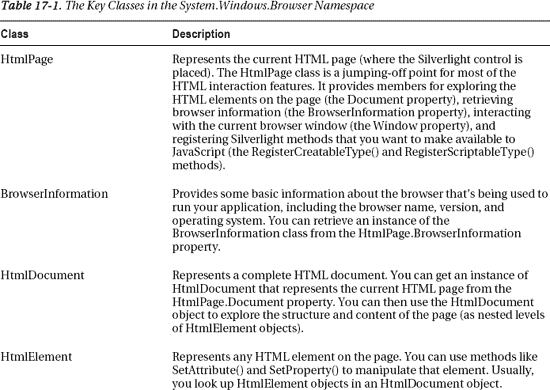

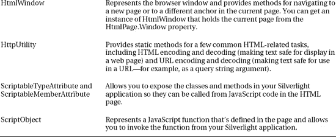

#### 获取浏览器信息

大多数时候，您不应该担心用来访问您的应用的特定浏览器。毕竟，Silverlight 的一个关键优势是，它将您从普通 web 编程的浏览器兼容性问题中解救出来，并允许您编写在每个支持的环境中以相同方式运行的代码。但是，在某些情况下，您可以选择更仔细地查看浏览器，例如，在诊断可能与浏览器相关的异常错误时。

browser information 类中可用的浏览器信息相当有限。您有四个字符串属性，分别表示浏览器名称、版本、操作系统和用户代理，这是一个包含浏览器技术细节的长字符串(例如，在 Internet Explorer 中，它列出了当前安装的所有版本。NET 框架)。还可以使用 Boolean CookiesEnabled 属性来确定当前浏览器是否支持 cookies 并启用了它们(在这种情况下为真)。然后，您可以通过 HtmlPage 类读取或更改 cookies。

 **注意**你从 BrowserInformation 类中获得的信息取决于浏览器如何向世界表示自己，但它可能并不能反映浏览器的真实身份。可以将浏览器配置为模拟其他浏览器，一些浏览器使用这种技术来确保更广泛的兼容性。如果您编写任何特定于浏览器的代码，请确保使用一系列浏览器进行测试，以验证您正在检测正确的条件。

下面是一些显示所有可用浏览器信息的简单代码:

`BrowserInformation b = HtmlPage.BrowserInformation;
lblInfo.Text = "Name: " + b.Name;
lblInfo.Text += "\nBrowser Version: " + b.BrowserVersion.ToString();
lblInfo.Text += "\nPlatform: " + b.Platform;
lblInfo.Text += "\nCookies Enabled: " + b.CookiesEnabled;
lblInfo.Text += "\nUser Agent: " + b.UserAgent;`

图 17-1 显示了结果。

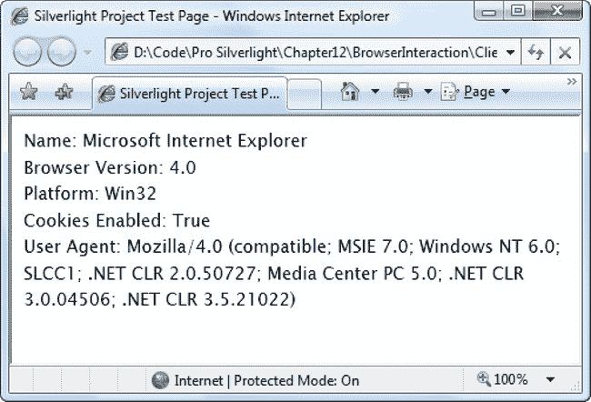

***图 17-1。**剖析浏览器*

#### HTML 窗口

Silverlight 还为您提供了通过 HtmlWindow 类控制浏览器的有限能力。它提供了两种允许您触发导航的方法:Navigate()和 NavigateToBookmark()。

Navigate()将浏览器转到另一个页面。您可以使用 Navigate()方法的重载版本来指定目标框架。当您使用 Navigate()时，您会放弃当前的 Silverlight 应用。这就好像用户在浏览器的地址栏中输入了一个新的 URL。

NavigateToBookmark()滚动到当前页面中的特定书签。书签是一个有 ID(或名称)但没有目标的

`<a id="myBookmark">...
</a>`

要导航到书签，请在 URL 的末尾添加数字符号(#)和书签名称:

`<a href="page.html**#myBookmark**">Jump to bookmark</a>`

您可以随时使用 HtmlWindow 从当前浏览器 URL 中检索书签。CurrentBookmark 属性，这是 HtmlWindow 类包含的唯一属性。

NavigateToBookmark()方法和 CurrentBookmark 属性提出了一种有趣的可能性。您可以使用书签来存储一些状态信息。因为此状态信息是 URL 的一部分，所以它会保留在浏览器历史记录和(如果您为包含 Silverlight 内容的页面添加了书签)浏览器的收藏夹列表中。这项技术是你在第 7 章中探索的高级导航框架的基础。

#### 弹出窗口

HtmlPage 类还提供了一个 PopupWindow()方法，允许您打开一个弹出窗口来显示一个新的网页。PopupWindow()方法用于显示来自其他网站的广告和内容。这并不是为了展示当前 Silverlight 应用的不同部分。(如果你想在 Silverlight 应用中显示弹出窗口，你需要第 7 章中描述的 ChildWindow 控件。)

PopupWindow()方法相当可靠，可以避开大多数弹出窗口拦截器(取决于用户的设置)。然而，它也有一些怪癖，不应该依赖它来创建应用的一个组成部分。相反，弹出窗口的内容应该是一个可选的额外内容。从技术上讲，PopupWindow()方法通过触发 JavaScript window.open()调用来工作。

下面是一个使用 PopupWindow()方法的例子。请注意，此代码测试 IsPopupWindowAllowed 属性以避免潜在的错误，因为并非所有情况下都支持弹出窗口:

`if (HtmlPage.IsPopupWindowAllowed)
{
    // Configure the popup window options.
    HtmlPopupWindowOptions options = new HtmlPopupWindowOptions();
    options.Resizeable = true;

    // Show the popup window.
    // You pass in an absolute URI, an optional target frame, and the
    // HtmlPopupWindowOptions.
    HtmlPage.PopupWindow(new Uri(uriForAdvertisement),
      null, options);
}`

以下是 Silverlight 弹出窗口的规则和限制:

*   如果 HTML 条目页面中的 allowHtmlPopupWindow 参数设置为 false，则它们不起作用。(请参阅本章末尾的“保护 HTML 互用性”一节。)
*   如果 HTML 入口页和 Silverlight 应用部署在不同的域上，则不允许弹出窗口，除非 HTML 入口页包含 allowHtmlPopupWindow 参数并将其显式设置为 true。
*   仅当用户在 Silverlight 应用的可见区域发起单击时，才能调用 PopupWindow()。
*   每个事件只能调用一次 PopupWindow()方法。这意味着您不能一次显示多个弹出窗口。
*   弹出窗口使用 Internet Explorer 和 Firefox 中的默认安全设置。但是，它们不会出现在 Safari 中。
*   您可以配置 HtmlPopupWindowOptions 对象来确定弹出窗口是否应该调整大小、应该有多大、应该放在哪里等等，就像在 JavaScript 中一样。然而，这些属性不会总是被尊重。例如，浏览器拒绝显示小于特定大小的弹出窗口，并且根据设置，可能会在当前窗口中将弹出窗口显示为单独的选项卡。
*   调用 PopupWindow()时，必须提供一个绝对 URI。

#### 检查 HTML 文档

检索浏览器信息和执行导航是两个相对简单的任务。当您开始仔细查看承载 Silverlight 内容的页面结构时，生活会变得有趣得多。

为了开始您的探索，您使用 HtmlPage 类的两个静态属性之一。Plugin 属性以 HtmlElement 对象的形式提供对代表 Silverlight 控件的<object>元素的引用。Document 属性提供了一些更有趣的东西:一个 HtmlDocument 对象，表示整个页面，其成员在[表 17-2](#tab_17_2) 中列出。</object>

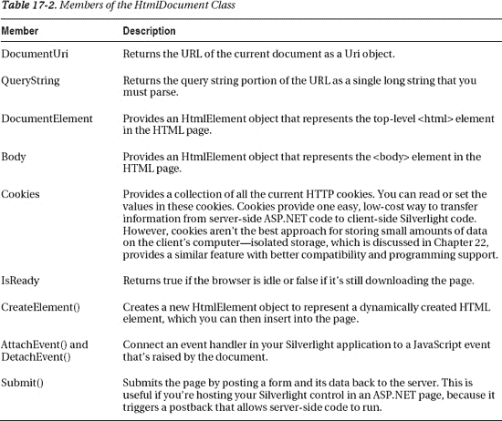

当您拥有表示页面的 HtmlDocument 对象时，您可以从 HtmlDocument 开始向下浏览元素树。要从一个元素跳到另一个元素，可以使用 Children 属性(查看嵌套在当前元素中的元素)和 Parent 属性(获取包含当前元素的元素)。

图 17-2 显示了一个例子——一个 Silverlight 应用，它从顶层的< html >元素开始，使用递归方法钻取整个页面。它显示每个元素的名称和 ID。

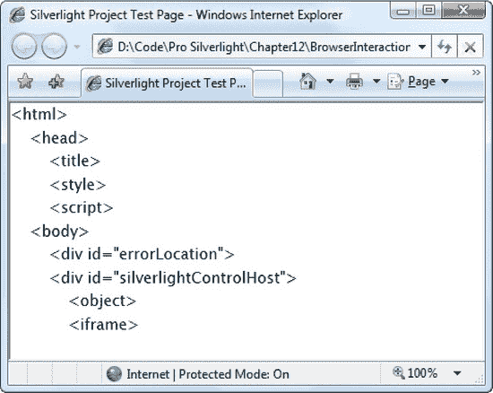

***图 17-2。**解剖当前页面*

以下是页面首次加载时创建此显示的代码:

`private void Page_Loaded(object sender, RoutedEventArgs e)
{
    // Start processing the top-level <html> element.
    HtmlElement element = HtmlPage.Document.DocumentElement;
    ProcessElement(element, 0);
}

private void ProcessElement(HtmlElement element, int indent)
{
    // Ignore comments.
    if (element.TagName == "!") return;

    // Indent the element to help show different levels of nesting.
    lblElementTree.Text += new String(' ', indent * 4);

    // Display the tag name.
    lblElementTree.Text += "<" + element.TagName;

    // Only show the id attribute if it's set.
    if (element.Id != "") lblElementTree.Text += " id=\"" + element.Id + "\"";
    lblElementTree.Text += ">\n";

    // Process all the elements nested inside the current element.
    foreach (HtmlElement childElement in element.Children)
    {
        ProcessElement(childElement, indent + 1);
    }
}`

HtmlElement 提供的属性相对较少。除了允许您在元素之间导航的子属性和父属性之外，它还包括这里演示的标记名和 Id，以及一个 CssClass 属性，该属性指示通过 Class 属性设置的级联样式表(CSS)样式的名称，并用于配置当前元素的外观。为了从元素中获取更多信息，您需要使用 HtmlElement 方法之一，您将在下一节中了解该方法。

#### 操纵一个 HTML 元素

Parent 和 Children 属性并不是遍历 HtmlDocument 对象的唯一方式。还可以使用 GetElementByID()或 GetElementsByTagName()方法搜索具有特定名称的元素。当你得到你想要的元素时，你可以使用[表 17-3](#tab_17_3) 中描述的方法之一来操作它。

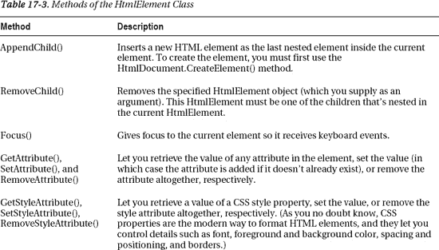

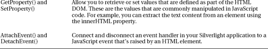

例如，假设您的 Silverlight 内容区域下面有一个

元素(并且您的 Silverlight 内容区域没有填满整个浏览器窗口)。您希望使用 Silverlight 应用来操作该段落，因此您为它分配了一个唯一的 ID，如下所示:

`
...
`

您可以在任何 Silverlight 事件处理程序中检索表示此段落的 HtmlElement 对象。以下代码检索段落并更改其中的文本:

`HtmlElement element = HtmlPage.Document.GetElementById("paragraph");
element.SetProperty("innerHTML",
  "This HTML paragraph has been updated by Silverlight.");`

这段代码通过调用 HtmlElement 来工作。SetProperty()方法并设置 innerHTML 属性。长期的 JavaScript 开发人员会认为 innerHTML 是 DOM 中的基本成分之一。

 **注意**当你使用 SetProperty()和 SetStyleAttribute()这样的方法时，你离开了可预测的 Silverlight 环境，进入了浏览器的古怪世界。因此，跨平台的考虑可能会发挥作用。例如，如果您使用 innerText 属性(类似于 innerHTML，但执行自动 HTML 转义以确保特殊字符不会被解释为标签)，您会发现您的代码在 Firefox 中不再工作，因为 Firefox 不支持 innerText。

图 17-3 显示了演示这段代码的测试页面。页面顶部是一个带有单个按钮的 Silverlight 内容区域。当单击按钮时，下面的 HTML 元素中的文本会发生变化(它被包裹在一个实心边框中，以便于识别)。

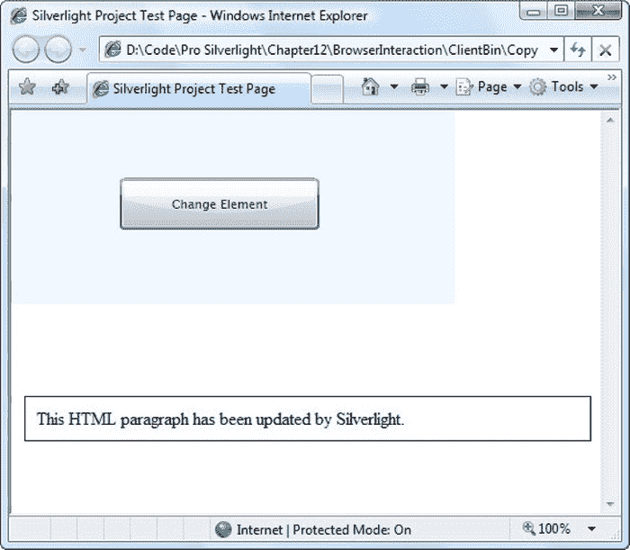

***图 17-3。**用 Silverlight 代码改变 HTML 元素*

您会注意到 Silverlight 和 HTML DOM 之间的转换并不完美。Silverlight 不包含完整的 HTML DOM，只是一个轻量级版本，标准化了一个基本的 HtmlElement 类。为了以有意义的方式操作这个元素，通常需要使用 SetProperty()方法设置一个 HTML DOM 属性(如前面示例中的 innerHTML ),并以字符串形式提供属性的名称。如果您计划对特定的 HTML 元素做大量的工作，您可能希望将它们包装在更高级别的自定义类中(例如，通过创建一个自定义段落类)，并用强类型属性替换它们的 DOM 属性或 CSS 样式属性。许多开发人员使用这种方法来防止在属性名中出现编译时无法发现的小的打字错误。

**转义特殊字符**

设置 innerHTML 属性时，文本被解释为原始 HTML。这意味着您可以自由使用嵌套元素，就像这样:

`element.SetProperty("innerHTML", "This <b>word</b> is bold.");`

如果你想使用尖括号，否则会被解释为特殊字符，你需要用&lt；还有&gt；字符实体，如下所示:

`element.SetProperty("innerHTML", "To get bold text use the &lt;b&gt; element.");`

如果您有一个包含许多需要转义的字符的字符串，或者您不想降低包含字符实体的代码的可读性，您可以使用静态属性。HtmlEncode()方法来完成这项工作:

`element.SetProperty("innerHTML",
  HttpUtility.HtmlEncode("My favorite elements are <b>, <i>, <u>, and 
."));`

如果您想要添加额外的空格(而不是允许它们折叠成一个空格字符)，您需要使用字符实体作为不间断空格。

##### 插入和移除元素

前面的例子修改了一个现有的 HTML 元素。在 HTML 页面中添加或删除元素同样简单，只需使用三种方法:HtmlDocument。CreateElement()，HtmlElement。AppendChild()和 HtmlElement。RemoveChild()。

例如，下面的代码假设文本页中不存在该段落，并创建它:

`HtmlElement element = HtmlPage.Document.CreateElement("p");
element.Id = "paragraph";
element.SetProperty("innerHTML",
  "This is a new element. Click to change its background color.");

HtmlPage.Document.Body.AppendChild(element);`

在这个例子中，元素被作为元素的最后一个子元素插入，这意味着它被放在文档的末尾。如果您想在某个地方插入动态 Silverlight 内容，最简单的方法是定义一个具有惟一 ID 的空

容器。然后可以检索那个的 HtmlElement，并使用 AppendChild()插入新内容。

 **注意**你可以多次执行这段代码，将多个段落添加到 HTML 文档的末尾。然而，就目前的情况来看，每个段落都将被赋予相同的 ID，这并不完全正确。如果像这样对文档使用 GetElementById()方法，则只能获得第一个匹配的元素。

通常，AppendChild()方法将新元素放在嵌套子元素集合的末尾。但是可以通过使用重载版本的 AppendChild()更精确地定位元素，该版本接受另一个 HtmlElement 对象作为引用。当您使用这种方法时，元素被插入到被引用元素的之前的*:*

`// Get a reference to the first element in the <body>.
HtmlElement referenceElement = HtmlPage.Document.Body.Children[0];

// Make the new element the very first child in the <body> element,
// before all other nested elements.
HtmlPage.Document.Body.AppendChild(element, referenceElement);`

顺便说一下，去掉一个元素甚至更容易。唯一的技巧是你需要使用*父*的 RemoveChild()方法，而不是你想要移除的元素。

下面是删除柠檬段落(如果存在)的代码:

`HtmlElement element = HtmlPage.Document.GetElementById("paragraph");
if (element != null)
  element.Parent.RemoveChild(element);`

##### 更改样式属性

设置样式属性就像设置 DOM 属性一样简单。你基本上有三个选择。

首先，您可以将元素设置为使用现有的样式类。为此，需要设置 HtmlElement。CssClass 属性:

`element.CssClass = "highlightedParagraph";`

为此，命名样式必须在当前 HTML 文档或链接的样式表中定义。下面是一个在 HTML 页面的中定义高亮段落样式的例子:

`<html >
  <head>
    
    ...
  </head>
  <body>...</body>
</html>`

这种方法需要最少的代码，并在 HTML 标记中保留格式细节。然而，这是一种要么全有要么全无的方法—如果您想要微调单个样式属性，您必须采用不同的方法。

另一种选择是一次性设置元素的样式。为此，可以使用 HtmlElement。SetAttribute()方法并设置 style 属性。这里有一个例子:

`element.SetAttribute("style",
  "color: White; border: solid 1px black; background-color: Lime;");`

但是更简洁的方法是多次使用 SetStyleAttribute()方法分别设置样式属性:

`element.SetStyleAttribute("color", "White");
element.SetStyleAttribute("border", "solid 1px black");
element.SetStyleAttribute("background", "Lime");`

你可以在任何时候使用 SetStyleAttribute()来改变一个单独的样式属性，不管你最初是如何设置样式的(或者即使你没有设置任何其他的样式属性)。

 **提示**查看可用于配置元素的 CSS 属性，请参考`[www.w3schools.com/css](http://www.w3schools.com/css)`。

#### 处理 JavaScript 事件

您不仅可以查找、检查和更改 HTML 元素，还可以处理它们的事件。同样，您需要知道 HTML DOM 事件的名称。换句话说，为了实现 Silverlight 和 HTML 之间的跨越，您需要随时掌握 JavaScript 技能。表 17-4 总结了最常用的事件。

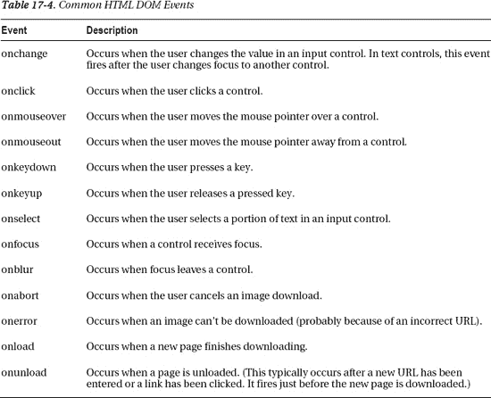

若要附加事件处理程序，可以使用 HtmlElement。AttachEvent()方法。您可以随时调用此方法，并将其用于现有的或新创建的元素。下面是一个在段落中监视 onclick 事件的示例:

`element.AttachEvent("onclick", paragraph_Click);`

 **提示**你可以使用 HtmlElement。AttachEvent()处理由任何 HTML 元素引发的事件。也可以使用 HtmlWindow。AttachEvent()处理浏览器窗口(DOM window 对象)和 HtmlDocument 引发的事件。AttachEvent()处理由顶级文档(DOM document 对象)引发的事件。

事件处理程序接收一个 HtmlEventArgs 对象，该对象提供了相当多的附加信息。对于鼠标事件，您可以检查鼠标的确切坐标(相对于引发事件的元素)以及不同鼠标按钮的状态。

在此示例中，事件处理程序更改段落的文本和背景颜色:

`private void paragraph_Click(object sender, HtmlEventArgs e)
{
    HtmlElement element = (HtmlElement)sender;
    element.SetProperty("innerHTML",
      "You clicked this HTML element, and Silverlight handled it.");
    element.SetStyleAttribute("background", "#00ff00");
}`

这项技术取得了令人印象深刻的成就。使用 Silverlight 作为中介，您可以使用客户端 C#代码编写 HTML 页面，而不是使用通常需要的 JavaScript。

图 17-4 显示了这个代码的运行。

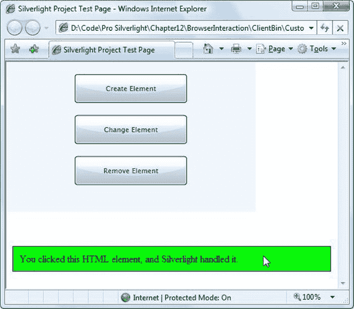

***图 17-4。** Silverlight 和 HTML 交互*

### 代码交互

到目前为止，您已经看到了 Silverlight 应用如何进入浏览器来执行导航和操作 HTML 元素。这种方法的一个缺点是它创建了紧密绑定的代码——换句话说，Silverlight 应用对当前页面上的 HTML 元素及其唯一 id 进行了硬编码假设。在 HTML 页面中更改这些细节，与它们交互的 Silverlight 代码将不再工作。

解决这个问题的一个替代方案是允许代码之间的交互，而不是元素之间的交互。例如，Silverlight 应用可以通过调用页面中的 JavaScript 方法来更新 HTML 页面的内容。本质上，JavaScript 代码在 Silverlight 代码和 HTML 内容之间创建了一个额外的灵活性层。这样，如果页面上的 HTML 元素发生了变化，JavaScript 方法可以同时更新以匹配，并且 Silverlight 应用不需要重新编译。同样的交互也可以反过来进行，例如，您可以创建 JavaScript 代码来调用用托管 C#代码编写的 Silverlight 方法。在接下来的小节中，您将看到这两种技术的例子。

#### 从 Silverlight 调用浏览器脚本

在系统中使用 Silverlight 类。Windows.Browser 命名空间中，您可以调用在脚本块中声明的 JavaScript 函数。这为 Silverlight 代码与页面交互提供了一种规范的、仔细控制的方式。如果您已经有了一个包含完整 JavaScript 函数的自给自足的页面，这将非常有用。您可以调用一个现有的方法，而不是复制操作该页面中的元素的代码。

例如，假设您在 HTML 页面的部分定义了这个函数:

``

要调用这个方法，需要使用 HtmlWindow。GetProperty()方法，并传入函数的名称。您收到一个 ScriptObject，您可以通过调用 InvokeSelf()随时执行它。

`ScriptObject script = (ScriptObject)HtmlPage.Window.GetProperty("changeParagraph");`

当您调用 InvokeSelf()时，您会传入所有参数。changeParagraph()函数需要一个字符串段落，所以可以这样调用它:

`script.InvokeSelf("Changed through JavaScript.");`

#### 从浏览器调用 Silverlight 方法

有趣的是，Silverlight 还有一个补充功能，让 JavaScript 代码调用用托管代码编写的方法。这个过程有点复杂。要使其工作，您需要采取以下步骤:

1.  在 Silverlight 代码中创建一个公开您希望网页使用的信息或功能的公共方法。您可以将该方法放在页面类或单独的类中。您需要坚持使用简单的数据类型，比如字符串、布尔值和数字，除非您想完成将对象序列化为更简单形式的额外工作。
2.  将 ScriptableMember 属性添加到要从 JavaScript 调用的方法的声明中。
3.  将 ScriptableType 属性添加到包含 scriptable 方法的类的声明中。
4.  要向 JavaScript 公开 Silverlight 方法，请调用 HtmlPage。RegisterScriptableObject()方法。

如果您采取了所有这些步骤，您的 JavaScript 代码将能够通过代表 Silverlight 内容区域的<object>元素调用您的 Silverlight 方法。然而，为了使这个任务更容易，给<object>元素一个惟一的 ID 是很重要的。默认情况下，Visual Studio 会创建一个测试页面，为包含<object>元素(silverlightControlHost)的元素指定一个名称，但是它不会为内部的<object>元素指定一个名称。在继续之前，您应该创建一个添加这个细节的测试页面，如下所示:</object></object></object></object>

`

  <object data="data:application/x-silverlight,"
   type="application/x-silverlight-2-b1" width="400" height="300"
   **id="silverlightControl">**
    ...
  </object>
  <iframe style="visibility:hidden;height:0;width:0;border:0px"></iframe>

`

 **注意**记住，你不能在独立的 Silverlight 应用中修改测试页面，因为当你重新构建你的项目时它会被替换。相反，您需要创建一个新的测试页面，如第 1 章中的[所述。如果您使用包含 ASP.NET 测试网站的解决方案，您可以直接更改 HTML 测试页面。如果你用的是服务器端。aspx 测试页中，您可以更改服务器端 Silverlight 控件的 ID，该 ID 将在创建客户端 Silverlight 控件时使用。](01.html#ch1)

命名 Silverlight 控件后，就可以创建可编写脚本的 Silverlight 方法了。考虑图 17-5 中所示的例子。这里，Silverlight 区域(具有渐变背景的区域)包括一个文本块(左)。下面是一段 HTML。当用户单击该段落时，JavaScript 事件处理程序开始动作，并调用 Silverlight 应用中的一个方法来更新文本块(右图)。

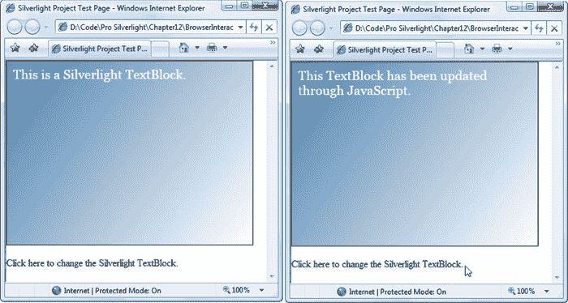

***图 17-5。**从 JavaScript 调用 Silverlight 代码*

为了创建这个例子，你需要如下所示的自定义页面类。它包含一个可编写脚本的方法，该方法在首次创建页面时注册:

`**[ScriptableType()]**
public partial class ScriptableSilverlight: UserControl
{
    public ScriptableSilverlight()
    {
        InitializeComponent();

**        HtmlPage.RegisterScriptableObject("Page", this);**
    }

**    [ScriptableMember()]**
    public void ChangeText(string newText)
    {
        lbl.Text = newText;
    }
}`

当注册一个可脚本化的类型时，您需要指定一个 JavaScript 对象名并传递一个对适当对象的引用。这里，ScriptableSilverlight 类的一个实例用 name Page 注册。这告诉 Silverlight 在 JavaScript 页面上的 Silverlight 控件中创建一个名为 Page 的属性。因此，要调用这个方法，JavaScript 代码需要使用 find Silverlight 控件，获取它的内容，然后调用它的页面。ChangeText()方法。

下面是一个函数的例子:

``

您可以随时触发这个 JavaScript 方法。下面是一个当一个段落被点击时触发它的例子:

`
Click here to change the Silverlight
 TextBlock.
`

现在，单击该段落会触发 updateSilverlight() JavaScript 函数，该函数又会调用属于 ScriptableSilverlight 类的 ChangeText()方法。

#### 在浏览器中实例化 Silverlight 对象

前面的例子演示了如何为 JavaScript 代码调用 Silverlight 方法。Silverlight 还有一个代码交互技巧:它允许 JavaScript 代码实例化一个 Silverlight 对象。

和以前一样，您从包含可脚本化方法的可脚本化类型开始。下面是一个返回随机数的非常基本的 Silverlight 类的示例:

`[ScriptableType()]
public class RandomNumbers
{
    private Random random = new Random();

    [ScriptableMember()]
    public int GetRandomNumberInRange(int from, int to)
    {
        return random.Next(from, to+1);
    }
}`

和前面的例子一样，您需要注册这个类，以便 JavaScript 代码可以使用它。但是，不使用 RegisterScriptableObject()方法，而是使用 RegisterCreateableType()方法，如下所示:

`HtmlPage.RegisterCreateableType("RandomNumbers", typeof(RandomNumbers));`

要创建注册类型的实例，需要找到 Silverlight 控件并调用其 content.services.createObject()方法。下面是一个 JavaScript 函数的示例，该函数使用 Silverlight RandomNumbers 类的实例显示一个从 1 到 6 的随机数:

``

最后一个细节是调用 getRandom1To6()的 HTML 元素:

`
Click here to get a random number from 1 to 6.
`

[图 17-6](#fig_17_6) 显示了这个代码的运行。

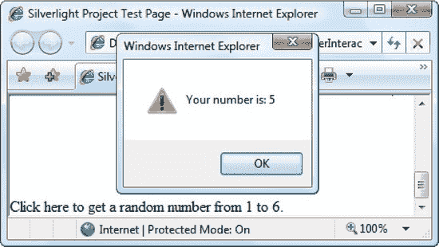

***图 17-6。**从 JavaScript 创建 Silverlight 对象*

### 结合 Silverlight 和 HTML 内容

在第 9 章中，你学习了如何创建一个无窗口的 Silverlight 内容区域。然后，您可以使用透明背景让 Silverlight 元素直接“位于”HTML 页面上。您甚至可以使用部分透明来让 HTML 内容从 Silverlight 内容下面显示出来。

当您使用 Silverlight 代码集成时，这种可视化集成非常方便。例如，许多开发人员已经使用 Silverlight 的标准视频窗口和 JavaScript 支持的 HTML 元素创建了自定义皮肤的媒体播放器。这些控件可以通过调用 Silverlight 应用中的可脚本化方法来控制回放。

当您在同一个视觉空间中组合 HTML 元素和 Silverlight 元素时，要获得正确的布局可能需要一些工作。通常，诀窍是摆弄 CSS 样式。例如，要将 Silverlight 内容限制在页面的特定区域，可以将它放在一个

容器中。那个甚至可以用绝对坐标放置。你可以使用其他的容器来排列 Silverlight 内容旁边的 HTML 内容块。(你在第 9 章的[中看到了这种技术的一个例子，一个无窗口的 Silverlight 控件被放置在多列布局中的一列中。)](09.html#ch9)

偶尔，你会想要更多的布局控制。例如，您可能需要根据浏览器窗口的当前尺寸或其他 HTML 元素的位置来放置 Silverlight 控件或调整其大小。在接下来的部分中，您将看到两个使用 Silverlight 的 HTML 互操作性来动态放置 Silverlight 控件的示例。

#### 调整 Silverlight 控件的大小以适合其内容

正如您在[第 1 章](01.html#ch1)中所了解到的，默认测试页面创建了一个 Silverlight 内容区域，它填充了整个浏览器窗口。您可以更改此大小，但仍必须为 Silverlight 控件指定一个显式大小。如果你不这样做，你的 Silverlight 内容会根据页面的大小进行排列，但是页面会被截断以适合一个标准的 200 乘 200 像素的区域，如图[图 17-7](#fig_17_7) 所示。

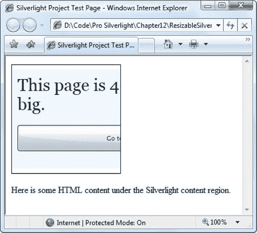

***图 17-7。**默认的 Silverlight 控件大小*

有时，如果有一种方法可以让 Silverlight 内容区域的大小自己匹配 Silverlight 页面的大小，那就太好了。通常情况下，这是不会发生的。但是，您可以通过一些简单的代码和 Silverlight 的 HTML 互操作性将其付诸实践。很简单。你需要做的就是等待你的页面加载，在页面上找到相应的<对象>元素，并调整它的大小以匹配页面的尺寸。

这里有一个事件处理程序来完成这个任务。它使用宽度和高度样式属性调整 Silverlight 控件的大小:

`private void Page_Loaded(object sender, RoutedEventArgs e)
{
    HtmlElement element = HtmlPage.Document.GetElementById("silverlightControl");
    element.SetStyleAttribute("width", this.Width + "px");
    element.SetStyleAttribute("height", this.Height + "px");
}`

您可以使用此代码一次，在首次加载应用并出现第一页时调整 Silverlight 内容区域的大小。或者，您可以通过在几个页面中使用相同的代码来调整内容区域的大小，以与当前显示的内容相对应。图 17-8 显示了当 Silverlight 应用中的内容发生变化时，这种方法的结果。

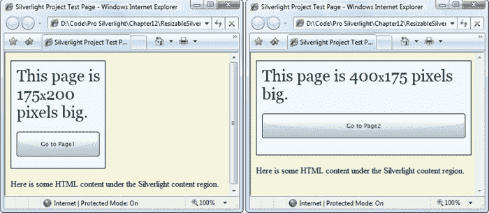

***图 17-8。**调整 Silverlight 控件的大小以适合页面*

#### 将 Silverlight 控件放置在 HTML 元素旁边

就像您可以使用样式属性调整 Silverlight 控件的大小一样，您也可以重新定位它。诀窍是使用 CSS 样式为 Silverlight 控件(或包装它的

元素)指定绝对定位。然后，通过设置 left 和 top 样式属性，可以将 Silverlight 控件放置在适当的坐标上。

例如，在[图 17-9](#fig_17_9) 中，目标是在页面上方的一个浮动窗口中弹出 Silverlight 应用，但是紧挨着一个特定的 HTML 元素(用黄色突出显示)。突出显示的 HTML 元素的具体位置根据浏览器窗口的大小而变化。因此，要将 Silverlight 内容放在正确的位置，您需要用代码动态地定位它。

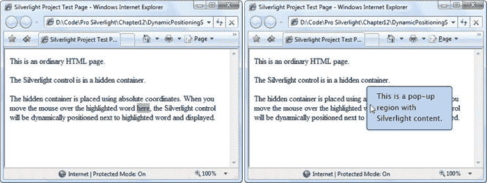

***图 17-9。**将 Silverlight 内容放置在元素旁边*

要做到这一点，您必须从指定 Silverlight 控件绝对定位的样式开始。该样式规则还将宽度和高度设置为 0，因此控件最初不会出现。(您可以使用 visibility style 属性来完成同样的事情；但是在这种情况下，宽度和高度是动态设置的，以匹配 Silverlight 页面大小，所以它也可以从 0 开始。)

`#silverlightControlHost
{
    position: absolute;
    width: 0px;
    height: 0px;
}`

Silverlight 内容区域不会出现，直到用户将鼠标移动到适当的 HTML 元素上。在这个例子中，元素是一个放置在文本块中的:

`

  
This is an ordinary HTML page.

  
The Silverlight control is in a hidden container.

  
The hidden container is placed using absolute coordinates.
   When you move the mouse over the highlighted word **here,**
   the Silverlight control will be dynamically positioned next to the highlighted
   word and displayed.

`

这一跨度通过另一种风格赋予黄色背景:

`#target
{
    background-color: Yellow;
}`

当 Silverlight 页面加载时，代码找到目标元素，并将事件处理程序附加到 JavaScript onmouseover 事件:

`private void Page_Loaded(object sender, RoutedEventArgs e)
{
    HtmlElement target = HtmlPage.Document.GetElementById("target");
    target.AttachEvent("onmouseover", element_MouseOver);
}`

当用户将鼠标移到元素上时，事件处理程序使用 HTML DOM 属性 offsetLeft 和 offsetTop 找到它的当前位置。然后，它使用 left 和 top 样式属性将 Silverlight 容器放置在附近的位置:

`private void element_MouseOver(object sender, HtmlEventArgs e)
{
    // Get the current position of the .
    HtmlElement target = HtmlPage.Document.GetElementById("target");
    double targetLeft = Convert.ToDouble(target.GetProperty("offsetLeft")) - 20;
    double targetTop = Convert.ToDouble(target.GetProperty("offsetTop")) - 20;

    // Get the Silverlight container, and position it.
    HtmlElement silverlightControl =
      HtmlPage.Document.GetElementById("silverlightControlHost");
    silverlightControl.SetStyleAttribute("left", targetLeft.ToString() + "px");
    silverlightControl.SetStyleAttribute("top", targetTop.ToString() + "px");

    // Resize the Silverlight container to match the actual page size.
    // This assumes the Silverlight user control has fixed values set for
    // Width and Height (in this case, they're set in the XAML markup).
    silverlightControl.SetStyleAttribute("width", this.Width + "px");
    silverlightControl.SetStyleAttribute("height", this.Height + "px");
}`

Silverlight 内容区域是使用普通的 Silverlight 事件处理程序隐藏的，该处理程序对顶级用户控件的 MouseLeave 事件作出反应:

`private void Page_MouseLeave(object sender, MouseEventArgs e)
{
    HtmlElement silverlightControl =
      HtmlPage.Document.GetElementById("silverlightControlHost");
    silverlightControl.SetStyleAttribute("width", "0px");
    silverlightControl.SetStyleAttribute("height", "0px");
}`

为了让这个例子更加生动，您可以使用动画将 Silverlight 内容区域淡入视图。下面是一个在半秒钟内将顶层容器的不透明度从 0 到 1 交替变化的示例:

`<UserControl.Resources>
  <Storyboard x:Name="fadeUp">
    <DoubleAnimation Storyboard.TargetName="LayoutRoot"
     Storyboard.TargetProperty="Opacity"
     From="0" To="1" Duration="0:0:0.5" />
  </Storyboard>
</UserControl.Resources>`

要使用这个动画，需要将这个语句添加到 element_MouseOver()事件处理程序的末尾:

`fadeUp.Begin();`

### 确保 HTML 的互操作性

Silverlight 的 HTML 互操作性特性引发了一些新的安全问题。如果 Silverlight 应用和宿主网页是由不同方开发的，这种情况尤其明显。在这种情况下，Silverlight 应用中的恶意代码可能会篡改页面上其他地方的 HTML。或者，HTML 页面中的 JavaScript 代码可以用恶意信息调用 Silverlight 应用，潜在地诱使它执行错误的操作。

如果担心这些问题，可以使用一些选项来限制 Silverlight 的 HTML 互操作性。为了防止 Silverlight 应用越界，可以在 HTML 条目页面中设置两个参数之一:

*   *enableHtmlAccess* :如果为 false，Silverlight 应用将无法使用大多数 HTML 互用性特性，包括 HtmlPage 类的文档、窗口、插件和 BrowserInformation 属性。(但是，仍然允许您调用 HtmlPage。PopupWindow()方法。)通常，enableHtmlAccess 设置为 true，您必须显式关闭它。但是，如果您的 Silverlight 应用与您的 HTML 条目页面托管在不同的域中，enableHtmlAccess 默认设置为 false，您可以选择显式打开它以允许 HTML 互操作性。
*   *allowHtmlPopupwindow* :为 false 时，Silverlight 应用无法使用 HtmlPage。PopupWindow()方法显示一个弹出窗口。默认情况下，当测试页和 Silverlight 应用一起部署时，此参数为 true 当 Silverlight 应用驻留在不同的域上时，此参数为 false。

下面是一个设置 enableHtmlAccess 和 allowHtmlPopupwindow 的示例:

`

  <object data="data:application/x-silverlight-2,"
   type="application/x-silverlight-2" width="100%" height="100%">
**    <param name="enableHtmlAccess" value="false" />**
**    <param name="allowHtmlPopupwindow" value="false" />**
    ...
  </object>
  <iframe style="visibility:hidden;height:0;width:0;border:0px"></iframe>

`

Silverlight 还让您能够保护您的 Silverlight 应用免受 JavaScript 代码的攻击。但是首先，重要的是要记住，JavaScript 代码不能与你的应用交互，除非你明确地将一些类和方法指定为*可脚本化的*(你在本章的“代码交互”一节中学到了这一点)。一旦您将一个方法指定为可脚本化的，假设 HTML 入口页和您的 Silverlight 应用一起部署，它将始终可用于 HTML 入口页。

然而，如果 HTML 入口页面和 Silverlight 应用托管在不同的域上，那么 Silverlight 要严格得多。在这种情况下，将不允许 HTML 页面访问您的可脚本化的类和方法。或者，您可以通过在应用清单文件 AppManifest.xml 中设置 ExternalCallersFromCrossDomain 属性来重写此行为，并确保可编写脚本的成员可用于任何 HTML 页面，如下所示:

`<Deployment
 xmlns:x="http://schemas.microsoft.com/winfx/2006/xaml"
** ExternalCallersFromsCrossDomain****="ScriptableOnly"** ...>
  <Deployment.Parts>
    ...
  </Deployment.Parts>
</Deployment>`

请谨慎使用此选项。一个不知名的人完全有可能在您不知情或未经您同意的情况下，在托管您的 Silverlight 应用的另一台服务器上创建一个 HTML 页面。如果您允许跨域访问您的可编写脚本的方法，任何人都将能够在任何时间调用这些方法，并获得任何信息。

### 最后一句话

在本章中，您看到了如何通过混合 Silverlight 和包含 HTML 页面的边界来构建更高级的网页。您了解了 Silverlight 如何直接查找和操作 HTML 元素，以及它如何调用 JavaScript 代码例程。您还了解了如何使用相反的技巧，让 JavaScript 在 Silverlight 应用中调用可编写脚本的方法。最后，您考虑了打破 Silverlight 代码和 HTML 世界之间壁垒的安全含义。