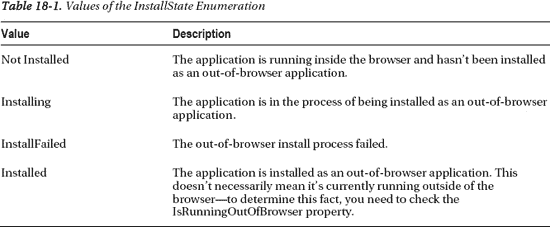
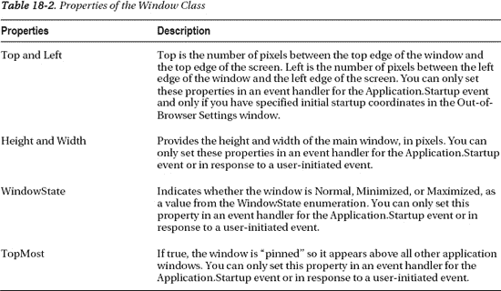

## 18

## 浏览器外的应用程序

如您所知，每个 Silverlight 应用程序的代码都包含在一个 XAP 文件中。Silverlight 浏览器插件从 web 服务器下载该文件，并在客户端执行它。从这一点来看，不需要 web 服务器再次参与——所有代码都在本地计算机上运行。

这个设计提出了一个有趣的可能性。尽管 Silverlight 应用程序依赖于 Silverlight 浏览器插件，但是从技术上讲，它们并不需要嵌入到动态网页中。事实上，只要有一种可靠的方法可以在浏览器之外运行 Silverlight 插件，就有可能独立运行 Silverlight 应用程序。

这是 Silverlight 浏览器外应用程序背后的基本思想。通过浏览器外的应用程序，用户可以访问您的网站来下载并安装您的 Silverlight 应用程序。安装过程结束后，应用程序可以在一个独立的窗口中启动，直接从开始菜单。除了在单独的窗口中，浏览器外应用程序的功能几乎与网页中托管的普通 Silverlight 应用程序完全相同。您甚至可以在客户端计算机上下载并自动应用新的更新。

尽管浏览器外的应用程序仍然是标准的 Silverlight 应用程序，但是它们提供了两种新的可能性。首先，因为它们被缓存在客户端的计算机上，所以它们可以在没有 web 连接的情况下运行。对于网络连接时断时续的用户来说，这是一个非常有用的工具，例如，带着笔记本电脑出差的员工。第二，浏览器外的应用程序可以以更高的信任度安装，这给了它们许多新的功能。这些包括自定义应用程序窗口、访问当前用户的文档以及运行已经安装的 COM 组件。

 **新功能** Silverlight 5 为高信任应用程序增加了几个新功能。它能够创建子窗口，使用 P/Invoke 调用本机代码，并以当前用户的所有权限访问硬盘。Silverlight 5 还允许您创建在浏览器中以提升的信任度*运行的应用程序，尽管这个特殊的特性需要在客户端进行特定的配置。有关所有这些功能的更多信息，请参见“提升信任”一节。*

### 了解浏览器外支持

关于 Silverlight 浏览器外应用程序，您应该了解的第一个细节是，尽管它们的名称如此，但没有浏览器它们就无法运行。相反，浏览器外的应用程序隐藏了浏览器的存在。当你运行一个程序时，一个名为 sllauncher.exe 的专门的 Silverlight 工具(在 Windows 电脑上，你可以在的 c:\ Program Files \ Microsoft Silverlight \这样的目录中找到)会创建一个独立的窗口，在其中托管一个浏览器控件。这个浏览器窗口被简化为一个空框架，不包含任何标准的浏览器用户界面(这意味着没有工具栏、收藏夹、导航按钮等等)。

 **注意**浏览器外应用可以在所有支持的 Silverlight 平台上运行，包括 Windows 和 Mac 电脑。

[图 18-1](#fig_18_1) 显示了来自[第二章](02.html#ch2)的八球应用程序，作为一个浏览器外应用程序运行。

***图 18-1。**浏览器外的八球应用*

鉴于浏览器外的应用程序实际上只是华而不实的幻想(鉴于你对独立窗口的控制有限，它们甚至没有那么华而不实)，你为什么要使用它们呢？有几个很好的理由:

*   *要获得桌面显示*:浏览器外的应用程序必须通过一个轻量级的进程“安装”，该进程下载 XAP 文件(照常)并添加桌面和开始菜单快捷方式。如果您想让您的用户能够以这种方式启动 Silverlight 应用程序，而不是强迫他们加载浏览器并导航到适当的 URL，那么浏览器外的应用程序是有意义的。
*   *允许应用程序在离线时运行*:通常，Silverlight 应用程序是通过一个网页来访问的，而这个网页是在一个公共或私有网络上。因此，客户端不能运行应用程序，除非他们有一个连接。但是在完成浏览器外应用程序的安装过程后，会在本地永久缓存一个副本(除非用户明确删除该应用程序)。
*   *支持间歇性连接*:这与上一点类似，但代表了一个更常见的场景。许多客户(尤其是那些使用笔记本电脑并通过无线连接访问互联网的客户)的连接会因周期性的断开而中断。使用一个浏览器外的应用程序(以及在[第 19 章](19.html#ch19)中描述的网络检测功能)，你可以创建一个处理这两种情况的应用程序。连接后，它可以调用 web 服务来检索更新的数据并执行服务器操作。当断开连接时，它保持自给自足，并允许用户继续工作。
*   *获得提升信任的特性*:虽然您可以在浏览器内应用程序中获得提升信任的能力，但是您将面临几个严重的缺点(参见“浏览器中提升信任的应用程序”一节以获得完整的独家新闻)。在大多数真实的场景中，您需要创建一个浏览器外的应用程序来利用本章稍后描述的提升信任特性。

 **注意**虽然浏览器外的应用程序与浏览器内的应用程序有相同的特性集，但有一点不同:它们的初始文件空间分配。正如第 22 章中的[所解释的，每个 Silverlight 应用程序都有自己精心隔离的磁盘空间，可以在那里创建和存储文件。普通的浏览器内应用程序只能获得 1MB 的磁盘空间(尽管它们可以通过提示用户来请求更多的空间)。但是浏览器外的应用程序从 25MB 的显著增加的配额开始，这意味着在许多情况下它们不需要向用户请求额外的空间。要了解更多关于隔离存储的信息，请参考第 22 章](22.html#ch22)。

### 创建浏览器外的应用程序

要在浏览器窗口之外运行 Silverlight 应用程序，用户必须首先在本地安装它。但是在这之前，您必须明确地允许这个特性。为此，请按照下列步骤操作:

1.  双击解决方案资源管理器中的属性项以显示应用程序配置选项。
2.  单击 Silverlight 选项卡。
3.  选择“允许在浏览器外运行应用程序”设置。
4.  或者，点击浏览器外设置按钮显示一个窗口，您可以在其中设置附加选项(见[图 18-2](#fig_18_2) )。

***图 18-2。**配置浏览器外设置*

您可以在浏览器外设置窗口中设置的其他选项包括:

*   *窗口标题*:当应用程序在浏览器之外运行时，在窗口标题栏中使用的名称。
*   *宽度和高度*:浏览器外应用程序窗口的初始大小。用户可以在应用程序启动后调整窗口大小。如果不提供宽度和高度值，Silverlight 会创建一个 800 像素宽、600 像素高的窗口。
*   *手动设置窗口位置*:如果选中，允许你填写窗口左上角的坐标(以像素为单位)。通常，你可以不设置它，让 Silverlight 将窗口放在屏幕中央。
*   *快捷方式名称*:在安装窗口和任何创建的快捷方式中使用的名称。
*   *应用描述*:描述应用的描述性文字。当您将光标悬停在应用程序快捷方式上时，它会显示在工具提示中。
*   *图标设置*:允许您定制用于安装窗口和快捷方式的图像，稍后将在“定制图标”一节中介绍。
*   *启用 GPU 加速*:决定浏览器外是否支持在某些场景下提升性能的显卡缓存。选中这个复选框只是给你一个使用硬件加速的选项——它仍然由你的元素在适当的时候选择加入，正如在[第 10 章](10.html#ch10)中所描述的。
*   *显示安装菜单*:如果选中，当用户右击 Silverlight 内容区域时，显示安装应用程序的选项。如果您不使用此选项，则由您以编程方式启动安装过程。下一节将描述这两种方法。
*   *在浏览器外运行时需要提升信任度*:这将您的应用程序配置为提升信任度的应用程序，这将授予它额外的权限(但要求用户在首次安装应用程序时接受安全警告)。有关详细信息，请参阅本章后面的“提升信任”一节。

输入的值放在名为 OutOfBrowserSettings.xml 的文件中，并与项目一起保存。

一旦执行了这些步骤，您的应用程序就能够在本地安装，然后在浏览器之外启动。然而，它不需要安装——用户可以继续在浏览器中将其作为标准 Silverlight 应用程序运行。

**测试浏览器外应用**

测试浏览器外应用程序有两种方法:

*   *跳过安装*:如果不想尝试安装过程，可以创建一个普通的独立 Silverlight 项目。只要你打开了“允许在浏览器外运行应用程序”设置，Visual Studio 就会*总是*在一个单独的窗口中运行你的应用程序。您将完全绕过测试页面。
*   *安装*:如果你想获得和你的用户完全一样的体验，创建一个包含 Silverlight 项目和托管它的 ASP.NET 网站的 Visual Studio 解决方案。然后，当您运行应用程序时，Visual Studio 将启动集成的 web 服务器，启动您的浏览器，并请求测试页。您将看到 Silverlight 应用程序像往常一样在浏览器中运行。要安装它，右键单击 Silverlight 内容区域的任意位置，然后选择 install。下一部分有完整的演练。

#### 安装浏览器外的应用程序

有两种方法可以安装具有浏览器外功能的应用程序。第一种选择是让用户显式执行这一步骤。为此，用户必须请求应用程序的网页，右键单击 Silverlight 内容区域，并选择“在这台计算机上安装[ *ApplicationShortName* ”，如图[图 18-3](#fig_18_3) 所示。

***图 18-3。**明确安装浏览器外应用*

另一种选择是通过调用应用程序以编程方式启动安装过程。Install()方法。您必须在响应用户启动的操作(如单击按钮)的事件处理程序中调用此方法。如果用户接受安装提示，Install()方法返回 true，如果用户拒绝安装应用程序，则返回 false。

Install()方法有一个潜在的问题:如果应用程序已经安装在本地计算机上，即使用户当前正在浏览器中运行该应用程序，它也会引发异常。为了避免这种错误，您应该检查应用程序。调用 Install()之前的 InstallState 值。下面是响应按钮点击而启动的完整过程:

`private void cmdInstall_Click(object sender, RoutedEventArgs e)
{
    // Make sure that the application is not already installed.
    if (Application.Current.InstallState != InstallState.Installed)
    {
        // Attempt to install it.
        bool installAccepted = Application.Current.Install();

        if (!installAccepted)
        {
            lblMessage.Text =
              "You declined the install. Click Install to try again.";
        }
        else
        {
            cmdInstall.IsEnabled = false;
            lblMessage.Text = "The application is installing... ";
        }
    }
}`

 **提示**你也可以从 Silverlight 菜单中删除安装选项，并强制用户通过你的代码安装应用程序。为此，只需清除浏览器外设置窗口中的“显示安装菜单”复选框。您采用这种方法的唯一原因是，如果您需要在安装之前执行一些其他任务，比如收集用户信息或调用 web 服务。

当应用程序被安装时，无论是通过用户的选择还是通过 Install()方法，都会发生一些事情。首先，出现一个安装窗口(见[图 18-4](#fig_18_4) ，要求用户确认。

***图 18-4。**安装八球应用*

安装窗口执行几项服务:

*   它提供了应用程序的名称，并指出它所在的域(或者显示 file://对于在本地执行的应用程序，没有 ASP.NET 测试网站)。
*   它提供了一个“更多信息”链接，单击该链接会打开另一个浏览器窗口，并导航到 Silverlight 网站上描述浏览器外功能的页面。
*   它允许用户选择安装是否应该创建开始菜单快捷方式(默认选中)和桌面快捷方式(不选中)。如果用户清除了这两个复选框,“确定”按钮将被禁用，安装将无法继续。还值得注意的是，开始菜单快捷方式出现在开始菜单的第一级(而不是在子组中)。

 **注意**在 Mac 电脑上，安装窗口看起来略有不同，以遵循该平台的惯例。例如，它不包括创建快捷方式的复选框。相反，Mac 用户应该在安装完成后将安装的应用程序包拖到他们选择的位置，就像他们在安装任何其他应用程序时所做的那样。

安装窗口最重要的特点是它用清晰、不具威胁性的术语解释了将要发生的事情。它不需要管理员帐户或权限提升，也没有任何额外的安全警告。将此与安装标准时得到的提示进行比较。NET 应用程序，您会发现使用 Silverlight 浏览器外应用程序的体验要友好得多。因此，用户更有可能完成操作并安装应用程序，而不是被晦涩难懂的警告吓跑。

安装过程会将应用程序放在当前用户配置文件中随机生成的文件夹中。安装过程完成后，它会在独立窗口中启动新安装的应用程序。但是现有的浏览器窗口保持打开，这意味着现在有两个应用程序实例在运行。您可以通过处理 InstallStateChanged 事件来处理这种情况，如“跟踪应用程序状态”一节中所述。

 **注意**浏览器外的应用程序只为当前账户安装。就像一个用户的 web 书签对其他用户不可用一样，一个用户本地安装的 Silverlight 应用程序(以及相关的桌面或开始菜单快捷方式)不会显示给同一台计算机的其他用户。

#### 定制图标

安装窗口中的默认图像比警告图标这样吓人的图片要好得多。但是如果用自定义图片来代替它，效果会更好。Silverlight 允许您提供小图像文件来定制一些细节:

*   标题栏和“开始”菜单中的应用程序图标使用 16x16 的图像。
*   对桌面上的应用程序图标(以及其他大图标视图)使用 32x32 的图像。
*   在平铺模式下，应用程序图标使用 48x48 的图像。
*   安装窗口使用 128x128 的图像。

要自定义这些细节，首先要将图像添加到项目中。每个图像文件必须是具有正确尺寸的 PNG 文件。为了更好地组织，将图像放在项目子文件夹中，如 AppIcons。然后，在解决方案资源管理器中选择每个图像，并将“构建操作”设置为“内容”(而不是“资源”),以便将图像作为单独的文件打包到 XAP 中。最后，返回到[图 18-2](#fig_18_2) 所示的浏览器外设置窗口，以确定您想要使用的图标。

[图 18-5](#fig_18_5) 显示了带有自定义图像的安装窗口。

***图 18-5。**定制八球装置*

 **注意**图像是安装窗口中唯一可以更改的细节。您不能更改它提供的选项或它使用的描述性文本。

#### 跟踪应用程序状态

如您所见，浏览器外应用程序是普通的 Silverlight 应用程序，在应用程序清单中有一些附加信息。这给了用户在本地安装它们的选项，但这并不妨碍它们在浏览器中运行。这种灵活性很有帮助，但是在很多情况下，你需要注意应用程序的执行状态——换句话说，它是在浏览器中运行还是在独立窗口中运行。您可能希望在浏览器中提供较少的功能，甚至阻止用户运行应用程序。

允许您实现这种设计的工具是应用程序。IsRunningOutOfBrowser 属性。如果应用程序是作为独立应用程序启动的，则返回 true 如果它是在浏览器中运行的，则返回 false。为了区分这两种状态下的应用程序，您需要检查该属性并相应地调整用户界面。

例如，如果要创建一个仅支持脱机使用的应用程序，可以在启动事件处理程序中使用如下代码:

`private void Application_Startup(object sender, StartupEventArgs e)
{
    if (Application.Current.IsRunningOutOfBrowser)
    {
        // Show the full user interface.
        this.RootVisual = new MainPage();
    }
    else
    {
        // Show a window with an installation message and an Install button.
        this.RootVisual = new InstallPage();
    }
}`

 **提示**在尝试使用浏览器外应用程序不支持的任何功能之前，检查 IsRunningOutOfBrowser 属性也很重要——即[第 17 章](17.html#ch17)中描述的浏览器交互功能。

这段代码可能有一个奇怪的地方。它测试 IsRunningOutOfBrowser 属性，并使用该属性来决定是否启动安装过程。这是有意义的，因为如果应用程序当前正在浏览器中运行(意味着 IsRunningOutOfBrowser 为 true)，则该应用程序显然已经安装。然而，反过来不一定是正确的。如果应用程序没有在浏览器中运行(意味着 IsRunningOutOfBrowser 为假)，它*可能*仍然被安装。确定的唯一方法是检查应用程序。InstallState 属性，它从 InstallState 枚举中获取一个值(如[表 18-1](#tab_18_1) 中所述)。

InstallPage 考虑到了这个细节。当它加载时，它在构造函数中使用下面的代码来确定应用程序是否已经安装。如果应用程序尚未安装，它会启用安装按钮。否则，它会禁用 Install 按钮，并显示一条消息，要求用户从以前安装的快捷方式运行应用程序。

`public InstallPage()
{
    InitializeComponent();

    if (Application.Current.InstallState == InstallState.Installed)
    {
        lblMessage.Text = "This application is already installed. " +
          "You cannot use the browser to run it. " +
          "Instead, use the shortcut on your computer.";
        cmdInstall.IsEnabled = false;
    }
    else
    {
        lblMessage.Text = "You need to install this application to run it.";
        cmdInstall.IsEnabled = true;
    }
}`

 **提示**这种行为并不是强制性的。拥有一个支持浏览器内和浏览器外使用的应用程序是完全可以接受的。在这种情况下，您可以选择检查 InstallState 并显示某种 install 按钮，让用户选择在本地安装应用程序。但是，如果应用程序没有安装，您不会将用户重定向到安装页面。

一旦应用程序成功安装，通知用户是有意义的。但是，不能因为 Install()方法返回 true 就认为应用程序已经成功安装。这只是表明用户已经单击了安装窗口中的 OK 按钮来开始安装。实际的安装过程是异步进行的。

随着安装的进行，Silverlight 会调整应用程序。属性并触发应用程序。InstallStateChanged 事件通知您。当 InstallStateChanged 触发且 InstallState 已安装时，您的应用程序刚刚完成作为浏览器外应用程序的安装。此时，您应该通知用户。下面的例子在 App 类中使用了一些额外的代码。它在安装应用程序时做出反应，并通知 InstallPage:

首先，您需要在 App 类构造函数中附加事件处理程序:

`this.InstallStateChanged += this.Application_InstallStateChanged;`

然后，您可以添加在安装应用程序时做出反应并通知 InstallPage 的代码:

`private void Application_InstallStateChanged(object sender, EventArgs e)
{
    InstallPage page = this.RootVisual as InstallPage;
    if (page != null)
    {
        // Tell the root visual to show a message by calling a method
        // in InstallPage that updates the display.
        switch (this.InstallState)
        {
            case InstallState.InstallFailed:
                page.DisplayFailed();
                break;
            case InstallState.Installed:
                page.DisplayInstalled();
                break;
        }
    }
}`

最后，您需要将以下方法添加到 InstallPage 类中，以显示更新后的状态文本:

`public void DisplayInstalled()
{
    lblMessage.Text =
      "The application installed and launched. You can close this page.";
}

public void DisplayFailed()
{
    lblMessage.Text = "The application failed to install.";
    cmdInstall.IsEnabled = true;
}`

在本例中，应用程序在第一个基于浏览器的应用程序实例中显示一些文本，通知用户他们现在可以关闭浏览器窗口(见[图 18-6](#fig_18_6) )。更有趣的是，你可以使用一点 JavaScript 和在[第 17 章](17.html#ch17)中描述的浏览器交互特性来强制关闭浏览器窗口。

***图 18-6。**使用基于浏览器的应用程序进行安装*

尽管 Silverlight 会在安装过程完成时通知您(成功或不成功)，但即使卸载了应用程序，它也不会触发 InstallStateChanged，如下一节所述。

#### 删除和更新应用程序

既然您已经详细研究了浏览器外应用程序的安装过程，那么是时候问一下已安装应用程序的另外两个常见任务了:更新和删除。

移除或卸载过程非常简单:用户右键单击正在运行的应用程序(在浏览器或独立窗口中)并选择“移除此应用程序”出现一个确认对话框；如果用户单击“确定”，应用程序会被快速卸载，其快捷方式也会被删除。所有的删除都必须由用户发起，因为没有相应的应用程序类方法。

应用更新更有趣。Silverlight 具有检查应用程序更新版本的内置功能。事实上，它只需要调用应用程序的一行代码。CheckAndDownloadUpdateAsync()方法。此方法启动一个异步进程，该进程检查 web 服务器以查看是否有更新的 XAP 文件可用。(这是一份 XAP 的文件，日期更近一些。编译应用程序时使用的实际版本号不起作用。)

下面是一个在应用程序启动时检查更新的示例:

`private void Application_Startup(object sender, StartupEventArgs e)
{
    if (Application.Current.IsRunningOutOfBrowser)
    {
**        // Check for updates.**
**        Application.Current.CheckAndDownloadUpdateCompleted +=**
**          Application_CheckAndDownloadUpdateCompleted;**
**        Application.Current.CheckAndDownloadUpdateAsync();**

        this.RootVisual = new MainPage();
    }
    else
    {
        this.RootVisual = new InstallPage();
    }
}`

 **注意**虽然微软建议你调用 CheckAndDownloadUpdateAsync()来响应用户发起的动作(比如点击一个更新按钮)，但它并不强制执行这一规则，你可以在应用程序启动时自由检查更新。

如果存在网络连接，则可以联系 web 服务器，并且更新的 XAP 文件可用，应用程序会自动下载该文件，然后启动应用程序。CheckAndDownloadUpdateCompleted 事件。

为了简单起见，一旦调用 CheckAndDownloadUpdateAsync()方法，应用程序更新就是强制性的。如果不下载并安装更新，用户无法拒绝更新，应用程序也无法检查更新是否存在。但是，直到应用程序重新启动，更新才会生效。

如果希望用户立即切换到新版本，可以处理 CheckAndDownloadUpdateCompleted 事件来显示一条信息性消息:

`private void Application_CheckAndDownloadUpdateCompleted(object sender,

  CheckAndDownloadUpdateCompletedEventArgs e)
{
    if (e.UpdateAvailable)
    {
        MessageBox.Show("A new version has been installed. " +
          "Please restart the application.");
        // (You could add code here to call a custom method in MainPage
        //  that disables the user interface.)
    }
    else if (e.Error != null)
    {
        if (e.Error is PlatformNotSupportedException)
        {
            MessageBox.Show("An application update is available, " +
              "but it requires a new version of Silverlight. " +
              "Visit http://silverlight.net to upgrade.");
        }
        else
        {
            MessageBox.Show("An application update is available, " +
              "but it cannot be installed. Please remove the current version " +
              "before installing the new version.");
        }
    }
}`

要尝试应用程序更新功能，您需要创建一个 ASP.NET 测试网站(如第 1 章中所述)。这是因为 Silverlight 只支持从 web 位置下载，而不支持从文件系统下载。然而，还是有一个问题。如您所知，Visual Studio 在启动测试 web 服务器时会选择一个随机端口号。如果关闭并重新启动 Visual Studio，它将为其测试 web 服务器选择一个新的端口号，但是任何以前安装的浏览器外应用程序都将继续使用旧的端口号来检查更新。他们的尝试会无声无息地失败，并且您的应用程序不会被更新，直到您手动移除并重新安装它。为了完全避免这个问题，您可以将 Silverlight 应用程序部署到计算机或本地网络上的 IIS 测试服务器。

#### 静默安装

安装浏览器外应用程序还有另外一条很少有人走的路。使用 sllauncher.exe 工具，您可以使用命令行在 Windows 计算机上自动静默安装应用程序。如果您想通过批处理文件、从安装 CD 或作为某种自动安装序列来安装 Silverlight 应用程序，此功能非常有用。(在所有这些情况下，如果一个成熟的 WPF 应用程序比 Silverlight 应用程序更适合这个问题，这也是值得考虑的。)

正如您之前了解到的，sllauncher.exe 是 Silverlight 运行时的一部分，是用于启动浏览器外应用程序的工具。若要使用它安装 Silverlight 应用程序，目标计算机必须已经安装了 Silverlight 4。假设这些细节都准备好了，您可以使用这样的命令来安装您的应用程序:

`"%ProgramFiles%\Microsoft Silverlight\sllauncher.exe" /install:"MyApplication.xap"`

您可以从放置 XAP 文件的文件夹(例如，安装光盘)中运行此命令。

这一行第一次安装应用程序，不支持更新。更常见的是添加/origin 参数(以指定当您调用应用程序时应用程序将用于更新的服务器。CheckAndDownloadUpdateAsync()方法)、/overwrite 参数(确保应用程序安装在同一应用程序的任何已安装的旧版本上)和/shortcut 参数(明确指定您是需要桌面快捷方式、开始菜单快捷方式还是两者都需要)。

`"%ProgramFiles%\Microsoft Silverlight\sllauncher.exe" /install:"MyApplication.xap"
 /origin:http://www.mysite.net/MyApplication/MyApplication.xap /overwrite
 /shortcut:desktop+startmenu`

 **提示**使用变量%ProgramFiles%而不是对程序文件目录进行硬编码是很重要的，因为这个目录是可变的(在 32 位操作系统上通常是 c:\Program Files\而在 64 位操作系统上是 c:\Program Files (x86)\)。

### 浏览器外应用功能

尽管浏览器外的应用程序表面上看起来与普通的 Silverlight 应用程序不同，但独立窗口内部发生的事情实际上是相同的。然而，也有例外，在这一节中，您将了解适用于所有浏览器外应用程序的三个原则，而不管它们的信任级别如何。首先，您将看到 WebBrowser 控件如何允许您在 Silverlight 应用程序中嵌入 HTML 内容。接下来，您将了解如何在单独的弹出窗口中显示通知。最后，您将考虑如何与主应用程序窗口交互来改变其大小、位置或状态。

#### WebBrowser 控件

普通的 Silverlight 应用程序可以使用 Silverlight 的浏览器集成特性与宿主页面的 HTML 和 JavaScript 进行交互。正如你在第 17 章中了解到的，这意味着他们可以改变 HTML 内容并触发 JavaScript 函数。对于浏览器外的应用程序来说，所有这些都是不可能的，因为它没有可以配置的宿主 web 页面。

为了弥补这个潜在的缺点，浏览器外的应用程序可以使用 WebBrowser 控件，它托管 HTML 内容(见[图 18-7](#fig_18_7) )。然而，正如浏览器交互功能仅限于浏览器内应用程序一样，WebBrowser 控件也仅限于浏览器外应用程序。如果您在普通的 Silverlight 应用程序中使用 WebBrowser，您将得到一个几乎是空白的矩形，并显示一条消息，说明 WebBrowser 未启用。(唯一的例外是非常罕见的叫做*浏览器内提升信任*应用程序的应用程序，这是 Silverlight 5 的新特性，将在本章后面描述。它们还允许 WebBrowser 控件。)

***图 18-7。**网络浏览器在行动*

图 18-7 在一个网格中结合了一个文本框、按钮和 WebBrowser 控件。下面是标记:

`<Grid x:Name="LayoutRoot" Background="White">

  <Grid.RowDefinitions>
    <RowDefinition Height="Auto"></RowDefinition>
    <RowDefinition></RowDefinition>
  </Grid.RowDefinitions>
  <Grid.ColumnDefinitions>
    <ColumnDefinition></ColumnDefinition>
    <ColumnDefinition Width="Auto"></ColumnDefinition>
  </Grid.ColumnDefinitions>

  <TextBox x:Name="txtUrl" Margin="5,5,1,5"
   Text="http://www.prosetech.com"></TextBox>
  <Button Grid.Column="1" Click="cmdGo_Click" Content="Go"
   Margin="1,5,5,5"></Button>
  <Border Grid.Row="1" Grid.ColumnSpan="2" Margin="5"
   BorderBrush="Black" BorderThickness="1">

    **<WebBrowser x:Name="browser"></WebBrowser>**

  </Border>

</Grid>`

WebBrowser 提供了一个极其简单的编程模型，只有少数几个成员。下面几节将向您展示它是如何工作的。

##### 显示 HTML 内容

使用 WebBrowser 时，您可以通过三种方式指定内容。

最直接的方法是调用 NavigateToString()方法，并传入一个包含要显示的 HTML 内容的字符串。这允许您使用 WebBrowser 来显示您手头的静态内容或从 web 服务获取的内容。通常，您会提供一个完整的 HTML 文档，但是像这样的 HTML 片段也可以:

`browser.NavigateToString("<h1>Welcome to the WebBrowser Test</h1>");`

第二种方法是调用 Navigate()方法，并传入指向要显示的内容的完全限定或相对 URI。例如，此代码对按钮单击做出反应，并将用户定向到文本框中键入的 URL:

`private void cmdGo_Click(object sender, RoutedEventArgs e)
{
    try
    {
        browser.Navigate(new Uri(txtUrl.Text));
    }
    catch
    {
        // Possible errors include a UriFormatException (if the text can't be
        // converted to a valid URI for the Uri class) and a SecurityException
        // (if the URL uses any scheme other than http://, including ftp://,
        // file://, and https://).
    }
}`

第三种可能的方法是将 WebBrowser 的 Source 属性设置为完全限定或相对 URI。这实际上与调用 Navigate()方法相同。

`browser.Source = new Uri(txtUrl.Text));`

不能对应用程序 URI 使用 Navigate()方法或 Source 属性。换句话说，WebBrowser 不可能加载嵌入在 XAP 文件中的 HTML 文件(除非您手动访问该资源，将其加载到字符串中，并调用 NavigateToString()方法)。

 **注意**要测试将网页加载到 WebBrowser 控件中的 Silverlight 应用程序，您必须在解决方案中包含一个 ASP.NET 网站。这并不奇怪，因为这是 Silverlight 许多基于 web 的特性的一个要求，包括 web 服务和网络。

网络浏览器有一些不可避免的局限性。与第 17 章中描述的 HTML 交互特性不同，WebBrowser 不将 HTML 文档公开为 HtmlElement 对象的集合，因此没有办法以编程方式探索其结构。但是，您可以通过调用 WebBrowser 随时获取完整的 HTML 文档作为字符串。SaveToString()方法。

##### 网络浏览器刷

WebBrowser 没有与 Silverlight 渲染系统集成。例如，您不能应用像素着色器效果和变换来更改网页的外观。然而，Silverlight 确实为真正需要这种能力的开发人员提供了一个巧妙的解决方法。通过使用 WebBrowserBrush 绘制，可以在另一个元素(例如矩形)上显示 WebBrowser 窗口中的可视内容。考虑这个示例，它将 WebBrowser 和 Rectangle 放在网格的同一个单元格中，矩形叠加在顶部，但显示 WebBrowser 下面的内容:

`<Grid>

  <WebBrowser x:Name="browser" Source="Hello.html" Height="150" Width="150" />
  <Rectangle>
    <Rectangle.Fill>
      <WebBrowserBrush SourceName="browser" />
    </Rectangle.Fill>
  </Rectangle>

</Grid>`

这与你在第 12 章中使用视频画笔绘制视频内容的技术基本相同。唯一的限制是你绘制的副本不能与用户交互。例如，如果用 WebBrowserBrush 绘制一个矩形，用户就不能滚动页面或单击链接。

出于这个原因，您可能会简单地使用 WebBrowserBrush 来应用特定的效果。例如，您可以创建一个动画来调整旋转变换和缩放变换，以在屏幕上制作一个用 WebBrowserBrush“pop”绘制的矩形。动画完成后，您可以隐藏矩形并显示带有源内容的真实 WebBrowser。

##### 与 JavaScript 代码交互

虽然这并不常见，但是您可以使用 WebBrowser 控件在 Silverlight 应用程序和 JavaScript 代码之间实现基本的交互。要在当前加载的 HTML 文档中调用 JavaScript 方法，可以使用 InvokeScript()方法，如下所示:

`browser.InvokeScript("MyJavaScriptFunction");`

InvokeScript()接受一个可选的字符串值数组作为第二个参数，它将把这个数组作为参数传递给函数。它还提供 JavaScript 函数的返回值作为自己的返回值:

`object result = browser.InvokeScript("AddTwoNumbers", new string[] { "1", "2" });`

为了对 JavaScript 方法做出反应，您可以处理 WebBrowser。ScriptNotify 事件。当 JavaScript 代码调用 window.external.notify 时，将触发此事件。例如，如果在 JavaScript 块中使用以下语句:

`window.external.notify("This is a notification from JavaScript")`

您可以在事件处理程序中检索字符串，如下所示:

`private void Browser_ScriptNotify(object sender, NotifyEventArgs e)
{
    MessageBox.Show("Received message: " + e.Value);
}`

然而，WebBrowser 控件不支持在[第 17 章](17.html#ch17)中描述的 JavaScript 到 Silverlight 交互的可脚本化类型系统。

#### 通知窗口

通知窗口是在屏幕右下角弹出的窗口，类似于 Outlook 用来通知用户收到电子邮件的窗口，或者 Messenger 用来提醒用户有新的即时消息的窗口。(在 Macintosh 上，通知窗口出现在屏幕的顶部，而不是底部。)

在 Silverlight 中，基本的通知窗口是一个完全不起眼的空白框，400 像素宽，100 像素高。您可以调整它的大小，使其尺寸变小，但不能变大。若要创建通知窗口，请创建 notification window 类的一个实例。要将通知放入通知窗口，只需设置它的 Content 属性。

如果希望通知窗口包含的内容不仅仅是纯文本块，应该为其内容创建一个自定义用户控件。然后，您可以创建该用户控件的实例，并使用它来设置 NotificationWindow。内容属性。以下示例对通知窗口内容使用两行网格。网格的顶部是一个标题栏。下面是一个 TextBlock(用于应用程序提供的消息),放置在多色渐变填充上:

`<UserControl x:Class="ElevatedTrust.CustomNotification" ...>

  <Grid>
    <Grid.RowDefinitions>
      <RowDefinition Height="Auto"></RowDefinition>
      <RowDefinition></RowDefinition>
    </Grid.RowDefinitions>

    <Border Background="LightGray" Height="20">
      <TextBlock Margin="3" FontSize="10"
       Text="MyApplication Notification"></TextBlock>
    </Border>

    <Border Grid.Row="1">
      <Border.Background>
        <LinearGradientBrush>
          ...
        </LinearGradientBrush>
      </Border.Background>
      <TextBlock x:Name="lblMessage" Margin="10" FontWeight="Bold" FontSize="16"
        Foreground="White" TextWrapping="Wrap" HorizontalAlignment="Center"
        VerticalAlignment="Center">Notification goes here.</TextBlock>
    </Border>
  </Grid>

</UserControl>`

CustomNotification 用户控件公开设置 TextBlock 的 Message 属性的代码:

`public string Message
{
    get
    {
        return lblMessage.Text;
    }
    set
    {
        lblMessage.Text = value;
    }
}`

要显示通知窗口，只需创建 CustomNotification 的一个实例，将其放在框架提供的 NotificationWindow 类的一个实例中，并调用 notification window。Show()显示您的通知:

`if (Application.Current.IsRunningOutOfBrowser)
{
    CustomNotification notification = new CustomNotification();
    notification.Message = "You have just been notified. The time is " +
      DateTime.Now.ToLongTimeString() + ".";

    NotificationWindow window = new NotificationWindow();
    window.Content = notification;

    // Specify the number of milliseconds before the window closes.
    // This example sets 5 seconds.
    window.Show(5000);
}
else
{
    // Notification windows are not available.
    // You can implement a different notification strategy here (for example,
    // change the main window, show a message box, or show a popup window).
}`

[图 18-8](#fig_18_8) 显示了通知消息。

***图 18-8。**一个自定义通知*

用户不能移动通知窗口。但是，您可以在通知窗口中添加一个调用 notification window 的按钮。Close()，这将允许用户在通知超时之前关闭通知。

 **提示**这个例子假设你想使用标准的通知窗口宽度(400×100 像素)。如果要将窗口调整得更小，应该在自定义用户控件中硬编码宽度和高度。然后，在创建 NotificationWindow 时，获取自定义用户控件的宽度和高度，并将其分配给 NotificationWindow。这样，当您编辑用户控件时，您可以真正感受到通知窗口的外观，并且您可以通过修改一个文件(用户控件 XAML)随时更改大小。

通知窗口没有设计任何排队机制。如果创建 NotifyWindow 的第二个实例并调用其 Show()方法，而第一个通知窗口仍然可见，则不会发生任何事情(新的通知消息将会丢失)。更好的方法是在代码中存储要用作类级字段的 NotifyWindow:

`private NotificationWindow window = new NotificationWindow();`

然后，在调用 Show()显示第二个通知之前，可以显式调用 Close()隐藏第一个通知。最棒的是，您甚至不需要检查通知窗口的当前状态，因为在已经关闭的窗口上调用 Close()没有任何效果。

`CustomNotification notification = new CustomNotification();

notification.Message = "You have just been notified. The time is " +
  DateTime.Now.ToLongTimeString() + ".";                                
window.Content = notification;

**window.Close();**
window.Show(5000);`

在某些应用程序中，您可能希望多个通知在很近的地方发生。在这种情况下，Close()和 Show()方法可能不合适，因为它可能会在用户有时间阅读通知之前隐藏通知。为了避免这个问题，您可以实现一个排队系统。基本思想是维护应用程序范围的通知消息队列<t>集合，并处理 NotificationWindow。关闭的事件。每当 Closed 事件发生时，您可以通过将下一条消息出队并调用 Show()再次显示通知窗口来进行响应。Tim Heuer 在`[http://tinyurl.com/yfefkud](http://tinyurl.com/yfefkud)`展示了一种可能的实现方式。</t>

#### 控制主窗口

一个普通的 Silverlight 应用程序运行在 web 浏览器窗口中，与该窗口交互的唯一方式是通过 JavaScript。但是在一个浏览器外的应用程序中，你得到一个独立的窗口，你可以通过静态应用程序作为一个窗口对象与之交互。主窗口属性。

窗口类提供了一小组属性和方法，如[表 18-2](#tab_18_2) 中所列。您可以随时读取这些属性，并且可以在应用程序的事件处理程序中更改它们中的大多数以响应用户启动的事件。启动事件(顶部和左侧属性除外，这些属性*必须*在应用程序中设置。启动事件处理程序)。

设置主窗口初始位置和大小的最好方法是使用浏览器外的设置窗口。但是，如果您需要在运行时动态更改大小，例如，如果您需要适应不断变化的内容量，那么窗口属性就很有用。

窗口属性也允许你创建一个记住窗口位置的应用程序。为此，您只需在应用程序关闭时保存相关细节，并在启动时恢复它们。下面是一个使用独立存储实现这一壮举的示例:

`private void Application_Startup(object sender, StartupEventArgs e)
{
    if (Application.Current.IsRunningOutOfBrowser)
    {
        // (You can check for updates here, if you want.)

        // Restore the window state.
        try
        {
            IsolatedStorageFile store =
              IsolatedStorageFile.GetUserStoreForApplication();

            if (store.FileExists("window.Settings"))
            {
                using (IsolatedStorageFileStream fs =
                  store.OpenFile("window.Settings", FileMode.Open))
                {
                    BinaryReader r = new BinaryReader(fs);
                    Application.Current.MainWindow.Top = r.ReadDouble();
                    Application.Current.MainWindow.Left = r.ReadDouble();
                    Application.Current.MainWindow.Width = r.ReadDouble();
                    Application.Current.MainWindow.Height = r.ReadDouble();
                    r.Close();
                }
            }
        }
        catch (Exception err)
        {
            // Can't restore the window details. No need to report the error.
        }
    }
    this.RootVisual = new MainPage();
}

private void Application_Exit(object sender, EventArgs e)
{
    if (Application.Current.IsRunningOutOfBrowser)
    {
        // Store window state.            
        try
        {
            IsolatedStorageFile store =
              IsolatedStorageFile.GetUserStoreForApplication();

            using (IsolatedStorageFileStream fs =
              store.CreateFile("window.Settings"))
            {
                BinaryWriter w = new BinaryWriter(fs);
                w.Write(Application.Current.MainWindow.Top);
                w.Write(Application.Current.MainWindow.Left);
                w.Write(Application.Current.MainWindow.Width);
                w.Write(Application.Current.MainWindow.Height);
                w.Close();
            }
        }
        catch (Exception err)
        {
            // Can't save the window details. No need to report the error.
        }
    }
}`

请记住，要设置主窗口的顶部和左侧属性，您必须在浏览器外设置窗口中选中“手动设置窗口位置”设置，并为顶部和左侧设置提供固定的默认值。不幸的是，这里使用的方法并不完美，因为在窗口被重新定位到之前的位置并恢复到之前的大小之前，您会看到窗口短暂地出现在默认位置。

Window 类还提供了一小组方法。其中最有用的是 Close()，它关闭主窗口(响应用户发起的操作)。还有一些方法是为高信任应用程序设计的，如 DragMove()、DragResize()和 Activate()。这些在创建定制的窗口框架时特别有用，它们将在后面的“窗口定制”一节中讨论。

### 信任度提高

提升信任的应用程序是一种特殊类型的浏览器外应用程序，它具有一组令人印象深刻的附加特权。这些权限与传统桌面应用程序的功能不匹配，但它们允许一系列潜在的危险操作，从激活第三方程序到直接访问文件系统。因此，高信任应用程序在受控环境中最有意义，例如用户已经知道应用程序并信任发行者的公司网络。在其他情况下，用户可能不愿意授予提升信任级别的应用程序所需的额外特权，他们可能选择根本不安装它。(系统管理员还可以配置计算机，以防止用户安装或运行需要提升信任级别的浏览器外应用程序。)

 **注意**在您开始开发需要提升信任的 Silverlight 应用程序之前，请考虑一个成熟的 Windows Presentation Foundation(WPF)应用程序是否更适合您的需求。WPF 应用程序是支持完整的桌面应用程序。NET 框架。像 Silverlight 一样，WPF 应用程序可以从 Web 上安装，但与 Silverlight 不同，WPF 应用程序是专门为 Windows 操作系统设计的。

#### 安装提升信任的应用程序

要指示应用程序需要提升的信任，您只需打开浏览器外设置窗口(如本章开头所述)并选中“需要提升的信任”设置。

现在，当安装过程开始时(通过右键单击 Silverlight 菜单或通过调用应用程序。Install()方法)，浏览器会显示一个更吓人的安全警告，就像图 18-9 中为名为 ElevatedTrust 的应用程序显示的那样。

***图 18-9。**安装提升信任的应用程序*

如果您已经使用来自证书颁发机构(CA)的 X.509 证书对应用程序进行了签名，情况会有所改善。在这种情况下，警告包括发布者姓名，感叹号图标被替换为威胁性较小的问号，如图[图 18-10](#fig_18_10) 所示。

***图 18-10。**安装签名的提升信任应用程序*

**使用测试证书**

您将使用来自已知证书颁发机构(如 VeriSign)的证书对专业 Silverlight 应用程序进行签名。如果你用你自己创建的测试证书来签署你的应用程序，用户不会得到如图[图 18-10](#fig_18_10) 所示的友好警告。这里的问题是，当您创建一个测试证书时，您实际上承担了证书颁发机构的角色。尽管其他人的电脑已经配置为信任知名的证书颁发机构，但它们并没有配置为信任您。这意味着，如果您使用测试证书，将不会有一个信任链来保证您作为应用程序发行者的身份。

然而，为了测试的目的，有时用测试证书签署应用程序是值得的。例如，如果要在公司网络中的测试 web 服务器上测试提升信任的应用程序，可以这样做。在这种情况下，除非您首先签名您的应用程序，否则您将无法执行自动更新。

要创建测试证书，请按照下列步骤操作:

1.  在解决方案资源管理器中双击“属性”节点，然后单击“签名”选项卡。
2.  选中名为“签署 XAP 文件”的选项。
3.  如果您已经创建了一个证书，您可以通过单击从存储中选择或从文件中选择按钮来选择它。否则，单击“创建测试证书”按钮创建新证书。Visual Studio 将要求您输入用于保护证书的密码，然后将证书作为. pfx 文件添加到您的项目中。从现在开始，当您编译应用程序时，Visual Studio 将自动对其进行签名。
4.  要建立信任链，您必须在计算机上的证书存储中安装测试证书。为此，请浏览到。pfx 证书文件并双击它。或者，您可以使用 Visual Studio。在项目属性的签名选项卡上，单击更多详细信息，然后单击安装证书。无论哪种方式，都会启动证书导入向导。
5.  当您完成证书导入向导时，您需要提供两个细节:证书密码和应该放置测试证书的证书存储。为了确保您的应用程序是可信的(以便您获得更好的安装消息和自动更新功能)，您必须将您的证书放在可信根证书颁发机构存储中。

当您完成对应用程序的测试后，最好将证书从计算机上的证书存储中删除，这样做只是为了降低利用此漏洞进行攻击的可能性。

在使用提升的信任时，更喜欢签名应用程序还有另一个原因。Silverlight 不允许对需要提升信任的未签名应用程序进行自动更新。换句话说，调用应用程序。CheckAndDownloadUpdateAsync()不起作用。这种限制旨在防止无辜的应用程序被更危险的后继程序所替换。

更新未签名的提升信任的应用程序的唯一方法是手动删除它，然后重新安装。但是如果你的申请被签署，申请。CheckAndDownloadUpdateAsync()方法继续以正常方式工作。这意味着 Silverlight 将检查您的应用程序的新版本并自动安装它——前提是这个新版本使用与原始应用程序相同的证书进行签名。

 **注意**Silverlight 的自动更新限制有一个例外。如果您的应用程序配置为从本地计算机(换句话说，从网络地址 127.0.0.1)下载其更新，Silverlight 允许自动更新，即使该应用程序未签名。这种行为旨在使测试更容易。这意味着您可以从 Visual Studio 内部运行一个高信任级别的应用程序，并像使用低信任级别的应用程序一样利用自动更新。

一旦用户选择安装应用程序，就会创建一个快捷方式，应用程序就会启动，就像任何其他 Silverlight 应用程序一样。从这一点开始，用户将不会收到任何进一步的安全提示。但是，当应用程序启动时，它将自动以提升的信任运行。

从威胁建模的角度来看，您应该假设一个提升信任的应用程序与运行它的用户具有相同的特权。然而，由于 Windows 操作系统中的权限提升功能，提升信任的应用程序在 Windows 中不会获得管理员权限，即使当前用户是管理员。

 **注意**需要提升信任的应用程序不能作为普通的低信任应用程序安装。如果用户因为安全警告而选择不继续安装，应用程序将不会被安装。但是，高信任级别的应用程序仍然可以在浏览器中运行，除非您采取措施阻止它(如检查安装状态和禁用应用程序用户界面，如本章前面所演示的)。当在浏览器中运行时，应用程序不接受提升的信任，并且不能使用本节中描述的任何特殊功能。

#### 高信任度应用程序的能力

那么，一个可信的应用能做哪些普通 Silverlight 应用做不到的事情呢？以下是本书其他地方涉及的调整和功能列表:

> *文件系统访问*:提升信任的应用程序可以访问当前用户可以访问的文件系统的任何部分。如果您需要在当前用户的文档文件夹中读写文件，这尤其有用，但您也可以使用它将文件添加到桌面或构建自己的文件夹结构。关于这个功能的例子，见[第 22 章](22.html#ch22)。
> 
> *不受限制的全屏支持*:提升信任的应用程序在切换到全屏模式时不会显示“按 ESC 退出全屏模式”的消息(Escape 键也不会将应用程序返回到正常模式，除非您明确添加了此功能)。更重要的是，具有提升的信任的全屏应用程序可以继续接收键盘输入。
> 
> *无跨域访问限制*:提升信任的应用被允许从任何网站下载内容，在任何网站调用 web 服务，打开到任何服务器的 socket 连接，就像普通的桌面应用一样。
> 
> *更少的用户同意限制*:在很多情况下，普通的 Silverlight 应用程序必须明确请求用户同意，比如访问剪贴板、在独立存储中存储文件、配置全屏应用程序在失去焦点时保持全屏模式等等。除了访问音频和视频捕获设备时，这些限制在高信任级别的应用程序中被删除。类似地，有许多操作只能在响应用户发起的操作时执行，例如切换到全屏模式、使用剪贴板、操作主窗口等等。在提升信任的应用程序中，这些任务可以随时执行。
> 
> 本章还探讨了其他一些功能:
> 
> *窗口定制*:如果你不喜欢操作系统提供的标准窗口边框和控件，你可以将它们从你的高信任应用中移除，然后借助 Silverlight 的标准元素绘制你自己的定制 chrome。
> 
> *子窗口*:提升信任的应用程序可以随意创建二级窗口。
> 
> COM interop :一个提升了信任的应用程序可以利用通过 COM 在 Windows 计算机上公开的大量功能库。例如，您可以与 Outlook、 Office 应用程序以及 Windows 操作系统的内置组件进行交互，如 Windows Script Host 和 Windows Management Instrumentation(WMI)。
> 
> *P/Invoke* :提升信任的应用程序可以使用 P/Invoke(平台调用)在 Windows 计算机上执行本机代码 dll 并访问 Windows API。

 **提示**在你尝试使用这些功能之前，记得检查应用程序。HasElevatedPermissions 属性。如果是真的，可以全速前进。如果不是，您需要禁用应用程序(如果您不想允许在部分信任下运行)或提供替代代码。

#### 窗口定制

一个普通的浏览器外应用程序运行在操作系统提供的标准窗口框架中。它有熟悉的按钮(可以用来最小化、最大化和关闭窗口)，它的颜色、阴影和透明度由操作系统控制。虽然这工作得很好，但它可能不适合您的设计。如果你正在创建一个光滑的，高度图形化的应用程序，你可能更喜欢用一个定制的窗口框架和手工制作的窗口按钮来搭配你的视觉效果。

自定义窗口框架有两个步骤。第一步是完全移除标准窗框。为此，请双击解决方案资源管理器中的“属性”节点。单击 Silverlight 选项卡，然后单击浏览器外设置按钮，并从窗口样式列表中选择一个选项。第一个选项 Default 提供了标准的窗口框架。第二个选项“无边框”移除标准窗口框架，并留下一个包含用户控件内容的浮动矩形。第三个选项，无边界圆角，删除标准的窗口框架，并轻轻地圆化应用程序窗口的角。这最后两个选项之间的区别纯粹是装饰性的——无论哪种方式，都取消了标准的窗口框架。[图 18-11](#fig_18_11) 显示了一个浅黄色背景的无边框窗口，叠加在记事本窗口上。

***图 18-11。**一扇没有框架的 Silverlight 窗户*

第二步是绘制所需的框架，并添加关闭窗口、拖动窗口和更改窗口状态的基本控件。出于跨平台的考虑，Silverlight 没有给你任何修改标准操作系统窗口框架的方法。相反，您必须使用适当的图像内容或 Silverlight 元素自己绘制窗口框架。例如，您可以将主要内容放在单个单元格网格中，叠加在另一个 Silverlight 元素上，如矩形或图像。或者，您可以将根用户控件包装在 Border 元素中，如下所示:

`<UserControl x:Class="ElevatedTrust.CustomWindow" ... >
**  <Border x:Name="windowFrame" BorderBrush="DarkSlateBlue" BorderThickness="5"**
**   CornerRadius="2" Margin="0,0,1,1">**

    <Grid x:Name="LayoutRoot" Background="LightSteelBlue" Margin="5">
      ...
    </Grid>
**  </Border>**
</UserControl>`

这里，应用程序使用了无边界圆角选项。右边缘和下边缘的 1 像素边距确保框架出现在正确的位置，并且 2 的角半径与窗口区域的圆角对齐。[图 18-12](#fig_18_12) 显示了结果。

***图 18-12。**使用边框元素的无框窗口*

 **注意** Silverlight 不支持异形或者不规则的窗口。因此，当您绘制窗口框架时，您必须将自己限制在定义主窗口的矩形(或圆角矩形)内。本质上，Silverlight 为您提供了一个矩形，您只需用适当的窗口框架和内容来绘制它。同样，您也不能创建允许其他应用程序窗口显示的透明或半透明区域。

虽然图 18-12 中添加的边框看起来好一点，但仍然有一个严重的问题。如果没有操作系统提供的框架，用户就无法调整窗口大小、移动窗口到不同的位置、最小化窗口、最大化窗口或关闭窗口。事实上，这取决于您是否将这一功能构建到您定制的主窗口中。幸运的是，Window 类的成员使得这项工作相当容易。

第一步是创建一个标题栏。标题栏有三个用途:它包含一个文本标题，它为用户提供一个可以单击和拖动来移动窗口的地方，它包含最小化、最大化和关闭按钮(通常在最右边)。下面是可以用来创建基本标题栏的标记。最小化、最大化和关闭按钮中的形状是使用路径和矩形元素绘制的。

`<Border x:Name="titleBar" Background="LightSteelBlue"

 MouseLeftButtonDown="titleBar_MouseLeftButtonDown">
  <Grid>
    <Grid.ColumnDefinitions>
      <ColumnDefinition></ColumnDefinition>
      <ColumnDefinition Width="Auto"></ColumnDefinition>
      <ColumnDefinition Width="Auto"></ColumnDefinition>
      <ColumnDefinition Width="Auto"></ColumnDefinition>
    </Grid.ColumnDefinitions>

    <TextBlock Margin="5">Title Bar</TextBlock>

    <Button Grid.Column="1" x:Name="cmdMinimize" Width="24"
     Click="cmdMinimize_Click">
       <Path Stroke="Black" StrokeThickness="4" Data="M 1,10 L 13,10" />
     </Button>

     <Button Grid.Column="2" x:Name="cmdMaximize" Width="24"
      Click="cmdMaximize_Click">
      <Rectangle Stroke="Black" StrokeThickness="3" Height="12" Width="12" />
    </Button>

    <Button Grid.Column="3" x:Name="cmdClose" Width="24" Click="cmdClose_Click">
      <Path Stroke="Black" StrokeThickness="3" Data="M 2,2 L 12,12 M 12,2 L 2,12" />
    </Button>
  </Grid>

</Border>`

然后，您可以将这个标题栏放置在一个包含两行的网格中。第一行包含标题栏，第二行包含窗口的其余内容。整个网格适合窗口的边框。图 18-13 显示了最终的结果。

***图 18-13。**带有自定义标题栏的窗口*

当然，要让这个窗口做它应该做的事情，你需要添加代码。由于 window state 属性和 Close()方法，更改窗口状态和关闭窗口很容易。令人惊讶的是，允许用户拖动窗口也一样容易。你需要做的就是在标题栏上按下鼠标左键时做出反应并调用窗口。DragMove()方法。从那时起，窗口将随着鼠标移动，直到用户释放鼠标按钮。

下面是完整的代码:

`private void titleBar_MouseLeftButtonDown(object sender,

  MouseButtonEventArgs e)
{
    Application.Current.MainWindow.DragMove();
}

private void cmdMinimize_Click(object sender, RoutedEventArgs e)
{
    Application.Current.MainWindow.WindowState = WindowState.Minimized;
}

private void cmdMaximize_Click(object sender, RoutedEventArgs e)
{
    if (Application.Current.MainWindow.WindowState == WindowState.Normal)
    {
        Application.Current.MainWindow.WindowState = WindowState.Maximized;
    }
    else
    {
        Application.Current.MainWindow.WindowState = WindowState.Normal;
    }
}

private void cmdClose_Click(object sender, RoutedEventArgs e)
{
    Application.Current.MainWindow.Close();
}`

 **提示**在提升信任的应用程序中，可以无限制地使用 Close()方法。这意味着您可以调用它，而无需等待用户发起的操作发生。这允许您在 CheckAndDownloadUpdateCompleted 事件的事件处理程序中检测到更新后强制关闭窗口。如果您选择使用这种方法，请确保显示一条消息，说明已经发生了更新，并且在调用 Close()之前必须重新启动应用程序。

还有一个缺失的特性:通过单击并拖动窗口边框的边缘来调整窗口大小的方法。实现该功能最简单的方法是将整个窗口包裹在一个使用不可见矩形元素的网格中。总共需要八个矩形元素——每个边一个，每个角一个。每一个都是 5 像素宽(或高)。[图 18-14](#fig_18_14) 显示了每个矩形在三行三列网格单元周围的位置。

***图 18-14。**使用不可见的矩形调整大小*

下面是定义此结构的网格，带有允许调整大小的不可见矩形:

`<Border x:Name="windowFrame" ...>

  <Grid x:Name="resizeContainer">
    <Grid.ColumnDefinitions>
      <ColumnDefinition Width="5"></ColumnDefinition>
      <ColumnDefinition Width="*"></ColumnDefinition>
      <ColumnDefinition Width="5"></ColumnDefinition>
    </Grid.ColumnDefinitions>

    <Grid.RowDefinitions>
      <RowDefinition Height="5"></RowDefinition>
      <RowDefinition Height="*"></RowDefinition>
      <RowDefinition Height="5"></RowDefinition>
    </Grid.RowDefinitions>

    <Rectangle x:Name="rect_TopLeftCorner" Grid.Row="0" Grid.Column="0"
     Cursor="SizeNWSE" Fill="Transparent" MouseLeftButtonDown="rect_Resize" />
    <Rectangle x:Name="rect_TopEdge" Grid.Row="0" Grid.Column="1"
     Cursor="SizeNS" Fill="Transparent" MouseLeftButtonDown="rect_Resize" />
    <Rectangle x:Name="rect_TopRightCorner" Grid.Row="0" Grid.Column="2"
     Cursor="SizeNESW" Fill="Transparent" MouseLeftButtonDown="rect_Resize" />
    <Rectangle x:Name="rect_LeftEdge" Grid.Row="1" Grid.Column="0"
     Cursor="SizeWE" Fill="Transparent" MouseLeftButtonDown="rect_Resize" />
    <Rectangle x:Name="rect_RightEdge" Grid.Row="1" Grid.Column="2"
     Cursor="SizeWE" Fill="Transparent" MouseLeftButtonDown="rect_Resize" />
    <Rectangle x:Name="rect_BottomLeftCorner" Grid.Row="2" Grid.Column="0"
     Cursor="SizeNESW" Fill="Transparent" MouseLeftButtonDown="rect_Resize" />
    <Rectangle x:Name="rect_BottomEdge" Grid.Row="2" Grid.Column="1"
     Cursor="SizeNS" Fill="Transparent" MouseLeftButtonDown="rect_Resize" />
    <Rectangle x:Name="rect_BottomRightCorner" Grid.Row="2" Grid.Column="2"
     Cursor="SizeNWSE" Fill="Transparent" MouseLeftButtonDown="rect_Resize" />

    <Grid Grid.Row="1" Grid.Column="1">
      <!-- The rest of the content goes here, including the title bar. -->
    </Grid>
  </Grid>

</Border>`

每个矩形都有显示适当的调整鼠标光标的任务。当用鼠标左键单击时，矩形调用窗口。用正确的参数拖动 Resize()以启动调整大小操作:

`private void rect_Resize(object sender, MouseButtonEventArgs e)
{
    if (sender == rect_TopLeftCorner)
    {
        Application.Current.MainWindow.DragResize(WindowResizeEdge.TopLeft);
    }
    else if (sender == rect_TopEdge)
    {
        Application.Current.MainWindow.DragResize(WindowResizeEdge.Top);
    }
    else if (sender == rect_TopRightCorner)
    {
        Application.Current.MainWindow.DragResize(WindowResizeEdge.TopRight);
    }
    else if (sender == rect_LeftEdge)
    {
        Application.Current.MainWindow.DragResize(WindowResizeEdge.Left);
    }
    else if (sender == rect_RightEdge)
    {
        Application.Current.MainWindow.DragResize(WindowResizeEdge.Right);
    }
    else if (sender == rect_BottomLeftCorner)
    {
        Application.Current.MainWindow.DragResize(WindowResizeEdge.BottomLeft);
    }
    else if (sender == rect_BottomEdge)
    {
        Application.Current.MainWindow.DragResize(WindowResizeEdge.Bottom);
    }
    else if (sender == rect_BottomRightCorner)
    {
        Application.Current.MainWindow.DragResize(WindowResizeEdge.BottomRight);
    }
}`

与 DragMove()方法非常相似，DragResize()方法负责剩下的工作，当用户移动鼠标指针直到鼠标按钮被释放时，自动调整窗口的大小(见[图 18-15](#fig_18_15) )。

***图 18-15。**调整自定义窗口的大小*

这就完成了创建一个体面的自定义窗口所需的基础结构。一旦有了这些细节(标题栏、窗口按钮、拖动和调整大小)，就可以用图像和元素定制视觉外观，以获得您想要的确切效果。

#### 子窗口

在第 7 章中，你学习了如何使用 ChildWindow 控件创建次级窗口的效果。然而，这只是在当前窗口内容上添加一个覆盖层来模拟一个新窗口。它没有创建一个由操作系统管理的真正独立的窗口。这限制了你所能做的。例如，不可能创建一个浮动在浏览器窗口之外的子窗口。

如果您正在开发一个浏览器外的提升信任应用程序，您可以通过创建 window 类的实例来创建一个真正的子窗口。您只需设置标题和内容(使用标题和内容属性)，然后设置 Visibility 属性来显示最终产品:

`// The content of a window is any element. This example uses a Grid

// that holds a TextBlock.
Grid grid = new Grid();

// The Grid must have a white background, or no content will appear in the window.
grid.Background = new SolidColorBrush(Colors.White);

TextBlock textContent = new TextBlock();
textContent.Text = "Here's some content!";
grid.Children.Add(textContent);

// Create the window.
Window winSimple = new Window();
winSimple.Content = grid;

// Set the window size.
winSimple.Width = 300;
winSimple.Height = 100;
winSimple.Title = "Simple Window";

// Oddly, the window has no Show() method. You must set the Visibility property.

winSimple.Visibility = Visibility.Visible;`

这就创建了一个有点不起眼的窗口，如图 18-16 所示。

***图 18-16。**一个自由浮动的二级窗口*

 **注意**用 child window 控件实现的子窗口效果和用 window 类创建的真实子窗口之间的一个关键区别是，ChildWindow 是模态的，而 Window 是无模态的。这意味着，当您用前面的代码弹出打开一个新窗口时，主窗口保持响应。

您可以使用 Window 类控制更多可选的细节。使用 Left 和 Top 将其定位在屏幕上，使用 WindowStyle 更改或移除其边框，使用 WindowState 设置它是最小化、最大化还是正常。

还有几个有用的事件。使用 Activate()将窗口置于最前面，使用 Close()将其完全移除，使用 DragMove()和 DragResize()来增强您在上一节中了解到的自定义 chrome 技巧。还有一个有用的事件 Closing，它在窗口被拆除时触发。在许多情况下，您需要处理这个事件，以便知道窗口对象何时不再处于有效状态。这是因为一个关闭的窗口对象没有被设置为空引用，但是试图使用一个关闭的窗口(例如，调用它的一个方法)会触发一个异常。

前面的示例使用代码用两个元素(TextBlock 和 Grid)构建了一个窗口。这是一个相当费力的方法。更常见的方法是为该任务创建一个专用的用户控件，然后将该用户控件加载到窗口的内容中。

`Window winStandard = new Window();

CustomChildWindow userControl = new CustomChildWindow()
winStandard.Width = userControl.Width;
winStandard.Height = userControl.Height;
winStandard.Content = userControl;
winStandard.Title = "Custom Window";

winStandard.Visibility = Visibility.Visible;`

您甚至可以通过将 WindowStyle 属性设置为 WindowStyle.None 来创建带有自定义镶边的漂亮窗口。若要调用 DragResize()和 DragMove()来操作窗口，用户控件需要一个对 window 对象的引用。不幸的是，它没有一个直接的方法来获得一个，和应用程序。您在上一节中使用的 Current.MainWindow 属性不起作用，因为它的目标是主窗口。

解决方案是在用户控件中添加一个自定义属性来封装这段信息:

`public partial class CustomChildWindow : UserControl
{
    public Window CurrentWindow {get; set;}
    ...
}`

然后，您可以在创建自定义窗口的实例时设置此属性:

`Window winFancy = new Window();

winFancy.WindowStyle = WindowStyle.None;
CustomChildWindow userControl = new CustomChildWindow()

**userControl.CurrentWindow = winFancy;**

winStandard.Content = userControl;

...`

您的用户控件代码可以使用这个适当的窗口对象来实现它的魔力:

`private void titleBar_MouseLeftButtonDown(object sender,

 System.Windows.Input.MouseButtonEventArgs e)
{
    CurrentWindow.DragMove();
}`

图 18-17 显示了这个更有趣的结果。

***图 18-17。**带有自定义窗口镶边的子窗口*

#### COM

授予高信任应用程序的最令人惊讶的特性之一是创建 COM 对象并使用它们做几乎任何事情的能力。

对于那些需要上一堂历史课的人来说，组件对象模型(COM)是组件重用和应用程序集成的原始标准。它是的前身。NET，它是 Windows 过去和现在版本的关键部分，并且仍然是某些任务的基础技术(例如，与 Word 和 Excel 等办公应用程序交互)。因为其他应用程序可以通过 COM 库提供对其功能的挂钩，并且因为这些库可以用来“驱动”(或*自动化*)应用程序，这个特性有时被称为 *COM 自动化*。

 **注** COM 是一项无耻的 Windows 专用技术。因此，这个特性不能在非 Windows 操作系统上工作，比如 Mac OS。

过去，在广泛采用。NET 中，开发人员通常创建他们自己的 COM 组件来共享和部署功能。但是，Silverlight 中的 COM 支持并不打算用于自定义 COM 组件。尽管这在技术上是可能的，但是部署 COM 组件会遇到各种各样的配置和版本控制问题，所以不建议这样做。相反，COM 支持旨在为您的应用程序提供一个进入预安装库的通道，例如由 Windows 操作系统和其他已安装的应用程序(如 Microsoft Office)提供的库，以及为访问其他组件(如扫描仪、照相机等)中的功能而提供的库。

AutomationFactory 类是 Silverlight 的 COM 支持的入口点。它存在于系统中。runtime . interop services . automation 命名空间。要使用 Silverlight 的 COM 支持，需要有几个细节。您的应用程序需要在 Windows 计算机上以提升的信任度在浏览器外运行。如果满足所有这些要求并且 COM 支持可用，则 AutomationFactory。IsAvailable 属性将返回 true。

下面是一个示例方法，它检查 COM 支持，如果不支持，则显示一条说明性消息:

`private bool TestForComSupport()
{
    if (!Application.Current.HasElevatedPermissions)
    {
        MessageBox.Show("This feature is not available because the application "          "does not have elevated trust.");
    }
    else if (!AutomationFactory.IsAvailable)
    {
        MessageBox.Show("This feature is not available because the operating " +
         "system does not appear to support COM.");
    }
    else
    {
        return true;
    }
    return false;
}`

若要创建 COM 对象，可以调用 AutomationFactory。CreateObject()方法，带有完整的 COM 类型名称。这里有一个例子:

`dynamic speech = AutomationFactory.CreateObject("Sapi.SpVoice");`

要使用 COM 对象，您需要 C# dynamic 关键字的帮助，该关键字使用后期绑定。当用 dynamic 关键字实例化一个类型时，该类型不需要在编译时可用(并且不被检查)。若要访问 dynamic 关键字，需要在所有使用 COM interop 的程序集中添加对 Microsoft.CSharp.dll 程序集的引用。

要使用 COM 对象，需要借助*后期绑定*。使用后期绑定时，使用基本对象类型定义一个指向 COM 对象的变量。但是这里有一个技巧—您可以调用 COM 对象支持的所有方法，就好像它们是对象类型的方法一样。下面是一个调用 Sapi 的 Speak()方法的示例。SpVoice COM 对象:

Silverlight 对 COM 使用后期绑定有一个缺点—这意味着 Visual Studio 不能为任何 COM 对象提供智能感知，并且 C#编译器不会在您构建应用程序时捕捉可能的错误。例如，如果您试图使用 COM 对象不提供的方法，它不会注意到。因此，将 COM 代码包装在异常处理块中总是一个好主意。这样，如果您试图实例化一个不存在的 COM 对象，或者如果您以运行时不支持的方式使用它，您就可以捕获发生的错误。

下面的代码将所有这些细节放在一起。它首先检查 COM 支持是否可用。然后，它创建文本到语音转换的 COM 组件，该组件包含在 Windows 操作系统中。结果是一个合成的声音说“这是一个测试。”

`if (TestForComSupport())
{
    try
    {
        using (dynamic speech = AutomationFactory.CreateObject("Sapi.SpVoice"))
        {
            speech.Volume = 100;
            speech.Speak("This is a test");
        }
     }
    catch (Exception err)
    {
        // An exception occurs if the COM library doesn't exist, or if the
        // properties and methods you attempted to use aren't part of it.
    }
}`

正如这说明的那样，使用 COM 不费吹灰之力。真正的工作是找到您想要使用的组件，学习它的对象模型(根据应用程序的不同，它可能是复杂的和高度特殊的)，并捕捉输入错误和其他潜在的使用错误。

下面是一个使用不同组件的示例 Windows 脚本宿主，它提供了检索系统信息和环境变量、使用注册表以及管理快捷方式的功能。下面是使用 Run()方法启动一个完全独立的应用程序(Windows 计算器)的代码:

`using (dynamic shell = AutomationFactory.CreateObject("WScript.Shell"))
{
    shell.Run("calc.exe");
}`

COM interop 不限于内置的 Windows 组件。它还可以与许多其他众所周知的应用程序协同工作，比如 Microsoft Office 应用程序(Word、Excel、PowerPoint、Outlook 等等)。所有这些应用程序都有复杂的对象模型，包含几十个不同的类。

例如，下面的代码片段启动 Word，插入两段简短的文本，然后使 Word 窗口可见，以便用户可以继续使用它:

`using (dynamic word = AutomationFactory.CreateObject("Word.Application"))
{
    dynamic document = word.Documents.Add();

    dynamic paragraph = document.Content.Paragraphs.Add;
    paragraph.Range.Text = "Heading 1";
    paragraph.Range.Font.Bold = true;
    paragraph.Format.SpaceAfter = 18;
    paragraph.Range.InsertParagraphAfter();

    paragraph = document.Content.Paragraphs.Add;
    paragraph.Range.Font.Bold = false;
    paragraph.Range.Text = "This is some more text";

    word.Visible = true;
}`

[图 18-18](#fig_18_18) 显示了这段代码的结果。

***图 18-18。**以编程方式与 Word 交互*

COM interop 的巧妙使用真的没有限制。更多令人难以置信的例子，请查看 Justin Angel 在`[http://justinangel.net/CuttingEdgeSilverlight4ComFeatures](http://justinangel.net/CuttingEdgeSilverlight4ComFeatures)`发表的博客文章，其中他使用各种 COM 库来模拟用户输入，将应用程序固定到 Windows 7 任务栏，配置应用程序在启动时自动运行，通过 USB 连接到摄像头，观察文件系统的变化，在本地数据库上执行 SQL，等等。与前面的例子一样，挑战在于找出您想要使用的 COM 库的细节，因为 Silverlight 的优点是纯粹的简单。

#### P/调用

如果 COM 支持不够令人印象深刻，您还可以使用平台调用来调用 Windows 计算机上的非托管代码库。假设客户端计算机上已经安装了某个遗留 DLL，您可以通过此步骤从 Windows API 调用某个函数或从该 DLL 调用一段代码。

在大多数方面，Silverlight 的 P/Invoke 特性与它在. NET 应用程序中的工作方式是一样的。首先，您需要知道您想要调用的函数的名称，以及它所在的 DLL 文件。例如，假设您决定从 Windows API 调用 ExitWindowsEx()。此功能允许您强制立即关闭、重新启动或注销 Windows。要使用该函数，必须首先在代码中用正确的方法签名定义它，如下所示:

`static extern bool ExitWindowsEx(long uFlags, long dwReason);`

注意，这个方法不包括方法体——换句话说，就是调用它时运行的实际代码。那是因为这个方法实际上会成为你应用程序之外的一个外部函数的链接。要设置此链接，您需要 DllImport 属性的帮助，该属性可在系统中找到。Runtime.InteropServices 命名空间。使用 DllImport 时，指定包含要调用的函数的 DLL 文件的名称:

`[DllImport("user32.dll")]
static extern bool ExitWindowsEx(long uFlags, long dwReason);`

当使用 DllImport 指定文件时，可以使用完全限定的路径名。如果没有，Windows 将搜索当前目录(安装 Silverlight 应用程序的位置)，然后是 Windows 系统目录，接着是 Windows 目录，最后是当前在 Windows PATH 环境变量中设置的任何目录。如果您从 Windows API 调用一个方法，就像在这个例子中一样，您永远不需要指定文件夹，因为 DLL 总是在 Windows 系统目录中。在这种情况下，ExitWindowsEx 函数位于 user32.dll。

 **注意**您可能会想到，您可以选择将带有非托管代码的 DLL 与调用它的 Silverlight 应用程序一起发布。然而，Silverlight 并没有内置的功能来实现这一点。您面临的关键问题是 Silverlight 安装程序无法在您的应用程序文件旁边安装 dll。相反，由您来确保 DLL 安装在一个可用的位置。

使用 long 数据类型可以将 Windows API 函数中的许多值简化为简单的数字，如下所示。然而，与其试图记住硬编码的数字并在代码中使用它们，不如用常量和枚举来定义它们。例如，ExitWindowsEx()函数支持 uFlags 参数的多个值，您可以将这些值包装在一个枚举中，如下所示:

`enum ExitWindowsFlags
{
    // Use this constant to log the user off without a reboot.
    Logoff = 0,

    // Use this constant to cause a system reboot.
    Restart = 2,

    // Use this constant to cause a system shutdown
    // (and turn off the computer, if the hardware supports it).
    Shutdown = 1,

    // Add this constant to any of the other three to force the
    // shutdown or reboot even if the user tries to cancel it.
    Force = 4
}`

现在，您只需相应地调整函数定义:

`[DllImport("user32.dll")]
static extern bool ExitWindowsEx(ExitWindowsFlags uFlags, long dwReason);`

最后一步是在需要使用 ExitWindowsEx()函数时调用它。这里有一个例子:

`ExitWindowsEx(ExitWindowsFlags.Logoff, 0);`

当您的应用程序执行此语句时，Windows 将立即开始关闭所有打开的程序。有些可能会要求用户确认，例如，是否打开了一个未保存的文档。此时单击 Cancel 将停止注销过程，因为 ExWindowsEx()调用不使用 Force 标志。

如果您确实想使用 ExitWindowsEx()函数，您仍然可以改进这个示例。您可以提供适当的值，而不是将关闭原因指定为 0。这类信息的最佳资源是`[http://pinvoke.net](http://pinvoke.net)`网站，它有一个可浏览的 Windows API 函数目录，以及。NET 代码，您可以使用它在您的应用程序中定义它们。虽然这段代码是为标准编写的。NET 应用程序，它的大部分也适用于 Silverlight 应用程序。例如，您可以在`[http://pinvoke.net/default.aspx/user32/ExitWindowsEx.html](http://pinvoke.net/default.aspx/user32/ExitWindowsEx.html)`阅读 ExitWindowsEx，以及可以用于 uFlags 和 dwReason 参数的枚举。

#### 浏览器中的高信任度应用程序

通常，在单独的窗口中运行高信任级别的应用程序是有意义的，这强调了它们具有本地应用程序的许多功能。这就是到目前为止您所看到的高信任度应用程序的风格。但是，对在浏览器中运行的应用程序给予提升的信任是可能的(但不太常见)。从技术上讲，这种应用程序被称为*浏览器内*提升信任应用程序。

您选择创建浏览器内提升信任应用程序的主要原因是为了避免安装过程。用户可以直接在他们的浏览器中运行你的应用程序。没有安装步骤，您的应用程序获得了额外的功能，这听起来很理想。然而，一个重要的警告适用。如果您希望其他人能够运行您的浏览器内提升信任应用程序，您需要在他们的计算机上执行一些特定的、重要的设置步骤(接下来将对此进行描述)。因此，浏览器内的高信任应用程序可能适用于受控内部网络上的某些内部应用程序，但不适用于放在 Internet 上的公共应用程序。

 **注意**无论应用程序的信任级别如何，都有两个提升信任的特性在浏览器中不起作用。这些是自定义窗口镶边和子窗口。

要创建一个浏览器内提升信任的应用程序，您需要执行一些额外的配置:

1.  First, select the “Require elevated trust when running in browser” setting in the project properties (see [Figure 18-19](#fig_18_19)). If you want to give users the option of installing the application, you can also switch on the “Enable running application out of the browser” and “Require elevated trust when running outside of the browser” settings described earlier. 

    ***图 18-19。**开启浏览器内提升信任*

     **注意**虽然设置名为“在浏览器中运行时要求提升信任”，但是*要求*这个词有点误导。如果应用程序未签名或证书在当前计算机上不受信任，该应用程序仍将在任何其他 Silverlight 应用程序的正常低信任模式下运行。

2.  现在，您需要用 X.509 证书对您的应用程序进行签名(如本章前面的“安装提升信任应用程序”一节所述)。如果您不采取这一步，Silverlight 的严格安全性将会以低信任度锁定您的应用程序。
3.  将证书放在客户端计算机上的可信发行商证书存储中。如果您使用的是测试证书，您还需要将它添加到受信任的根证书颁发机构存储中，以建立信任链。
4.  即使您的应用程序已经签名，您也需要通过配置 Windows 注册表来明确允许计算机以提升的信任运行浏览器内应用程序。所以点燃 regedit.exe 吧。
5.  现在转到 HKEY _ 本地 _ 机器\软件\ Wow6432Node \微软\Silverlight(在 64 位操作系统上)或者 HKEY _ 本地 _ 机器\软件\微软\Silverlight(在 32 位操作系统上)。
6.  Finally, add a new DWORD value to this key named AllowElevatedTrustAppsInBrowser, and set it to 1.

     **提示**您还可以添加更多注册表设置来配置提升信任应用程序的工作方式。将 AllowInstallOfElevatedTrustApps 设置为 0，以防止安装浏览器外的提升信任应用程序。将 AllowLaunchOfElevatedTrustApps 设置为 0，以防止启动提升信任的应用程序(无论它们是在浏览器内部还是外部运行)。

7.  在需要运行应用程序的每台客户端计算机上重复步骤 3 到 6。在大型企业环境中，您可以使用组策略自动执行这种操作。请咨询您当地的网络管理员，或者查看位于[http://tinyurl.com/3dhjyzk](http://tinyurl.com/3dhjyzk)的帖子中的示例。
8.  默认情况下，Internet Explorer 通过其保护模式功能添加了另一层安全保护。要允许您的应用程序执行受信任的操作(如写入文件)，您很可能需要关闭保护模式或为您的域添加一个例外。最简单的方法是将您的 Silverlight 站点指定为可信站点。为此，请在 IE 中打开“Internet 选项”对话框，然后单击“安全”选项卡。然后，选择“可信站点”图标，单击“站点”按钮，并为您的站点添加域。

如果您未能正确完成此过程，您的应用程序仍将运行，但它不会具有提升的信任。若要测试您的应用程序是否在提升的信任下运行，请检查该应用程序。HasElevatedPermissions 属性。

浏览器内提升信任的应用程序支持您在本章中了解到的所有提升信任的功能，除了子窗口。它们还支持通常在浏览器外应用程序中受到限制的两个功能:WebBrowser 控件和通知窗口。(换句话说，WebBrowser 控件和通知窗口功能可用于所有浏览器外应用程序*和*所有提升信任的应用程序。)

**测试浏览器内高信任应用**

几个怪癖会导致浏览器内高信任度应用程序的测试问题。

如果您创建一个没有 ASP.NET 网站的独立 Silverlight 项目，第一个潜在的绊脚石就会出现。在此配置中，无论您设置什么项目属性，您的应用程序都将在低信任模式下自动加载。这是像 Internet Explorer 这样的浏览器处理本地文件系统提供的内容的结果。

如果您创建一个包含 ASP.NET 测试网站的解决方案，这个问题就会消失。然而，这种配置引入了另一个潜在的误导。如果您选中“在浏览器中运行时需要提升信任”并启动您的项目，它将作为浏览器内提升信任的应用程序加载，*，即使您尚未*签署程序集或安装测试证书。在 Visual Studio 之外运行相同的页面，您将获得预期的行为—也就是说，只有当应用程序使用可信证书签名并且设置了注册表项时，它才会获得浏览器内提升的信任。在这种情况下，区别仅仅在于测试的便利性。

### 最后一句话

在本章中，您了解了 Silverlight 应用程序如何超越浏览器。最简单地说，Silverlight 的浏览器外功能只是一种让用户从开始菜单启动应用程序并在计算机离线时运行它们的方式。普通浏览器外应用程序的实际功能与普通 Silverlight 应用程序基本相同，除了更新过程、WebBrowser 控件和通知窗口的小附加功能。但是浏览器外的应用程序也为更有趣的东西——信任度更高的应用程序——开辟了道路。正如您在本章中看到的，提升信任的应用程序有一系列新功能，包括窗口自定义、文档文件访问和 COM 互操作。