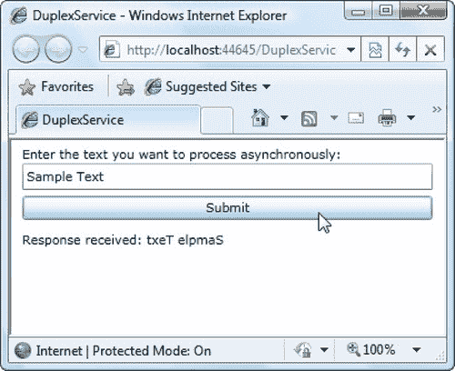

## 十九、ASP.NET Web 服务

许多最有趣的 Silverlight 应用都有一个隐藏的服务器端代码主干。他们可能会调用 web 服务器从数据库中检索数据、执行认证、将数据存储在中央存储库中、提交一项耗时的任务，或者执行任何数量的其他任务，而这些任务仅靠客户端代码是不可能完成的。所有这些例子的共同之处在于，它们都基于 *web 服务*——任何支持 web 的应用都可以访问的服务器端逻辑库。

在本章中，您将学习如何创建 ASP.NET web 服务，并从 Silverlight 应用中调用它们。您将学习如何处理不同类型的数据，利用 ASP.NET 服务，监视客户端的网络连接，甚至构建一个双向 web 服务，当您的应用需要报告时，它会调用您的应用。

### 为 Silverlight 构建 Web 服务

毫无疑问，Silverlight 应用利用服务器端代码的最有效方式是通过 web 服务。基本思想很简单:您在 ASP.NET 网站中包含一个 web 服务，您的 Silverlight 应用调用该 web 服务中的方法。您的 web 服务可以提供服务器生成的内容，而这些内容在客户端上是不可用的(或者计算量太大而无法计算)。或者，您的 web 服务可以运行查询并对服务器端数据库执行更新，正如您将在第 20 章中看到的。只需做一点额外的工作，它甚至可以使用 ASP.NET 服务，如认证、缓存和会话状态。

Silverlight 应用可以调用旧式的 ASP.NET web 服务(。asmx 服务)以及更现代的 WCF 服务。在接下来的部分中，您将学习如何构建、调用和优化 WCF 服务。在第 23 章中，您将考虑 Silverlight 应用如何调用非。NET web 服务，比如托管在其他平台上的更简单的 REST 服务。

#### 创建Web 服务

若要在 Visual Studio 中创建 WCF 服务，请在解决方案资源管理器中右键单击您的 ASP.NET 网站，然后选择“添加新项”。选择启用 Silverlight 的 WCF 服务模板，输入文件名，然后单击添加。

当您添加一个新的 WCF 服务时，Visual Studio 会创建两个文件(参见图 19-1 ):

*   *服务端点*:服务端点有分机。svc 并放在您的根网站文件夹中。例如，如果您创建一个名为 TestService 的 web 服务，您将获得一个名为 TestService.svc 的文件。svc 文件。但是。svc 文件不包含任何代码——它包含一行标记，告诉 ASP.NET 在哪里可以找到相应的 web 服务代码。
*   服务代码:服务代码放在网站的 App_Code 文件夹中(如果您创建的是无项目网站)或单独的代码隐藏文件中(如果您创建的是 web 项目)。例如，如果您创建一个名为 TestService 的 web 服务，您将在一个无项目的网站中获得一个名为 TestService.cs 的代码文件，或者在一个 web 项目中获得一个名为 TestService.svc.cs 的代码文件。无论哪种方式，内容都是一样的:一个代码文件，其中包含一个实现服务接口并为您的 web 服务提供实际代码的类。

***图 19-1。【ASP.NET T2】一个提供 WCF 服务的网站***

web 服务的代码文件以两个属性开始。ServiceContract 属性表示它定义了一个服务协定，换句话说，就是您计划作为服务的一部分向远程调用者公开的一组方法。AspNetCompatibilityRequirements 属性表示它可以访问 ASP.NET 平台功能，如会话状态:

`[ServiceContract]
[AspNetCompatibilityRequirements(RequirementsMode =
 AspNetCompatibilityRequirementsMode.Allowed)]
public class TestService
{ ... }`

要添加一个新的 web 服务方法，需要向代码文件中添加一个新方法，并确保用 OperationContract 属性来修饰它。例如，如果您想添加一个返回服务器上当前时间的方法，您可以像这样修改接口:

`[ServiceContract]
[AspNetCompatibilityRequirements(RequirementsMode =
 AspNetCompatibilityRequirementsMode.Allowed)]
public class TestService
{
    [OperationContract]
    public DateTime GetServerTime()
    {
        return DateTime.Now;
    }
}`

最初，一个新创建的服务包含一个 DoWork() web 服务方法，Visual Studio 作为示例添加了这个方法。您可以自由删除或自定义此方法。

 **注意**当您添加 WCF 服务时，Visual Studio 会向 web.config 文件中添加大量的配置信息。在很大程度上，你不需要太注意这些细节。然而，你偶尔需要修改它们以利用一个专门的特性(就像你将在本章后面考虑的双工服务一样)。还值得注意的是，默认情况下，web.config 文件将所有 WCF 服务设置为使用二进制编码，而不是 Silverlight 2 标准的普通文本编码。这使得邮件变得更小，因此可以更快地通过网络传输并在服务器上处理。

#### 添加服务参考

在 Silverlight 应用中使用 web 服务的方式与在 full-fledged.NET 应用中使用 web 服务的方式非常相似。第一步是通过添加 Visual Studio 服务引用来创建代理类。

要添加服务引用，请按照下列步骤操作:

1.  Right-click your Silverlight project in the Solution Explorer, and choose Add Service Reference. The Add Service Reference dialog box appears (see [Figure 19-2](#fig_19_2)). 

    ***图 19-2。**添加服务参考*

2.  在“地址”框中，输入指向 web 服务的 URL，然后单击“转到”。然而，您可能不知道 web 服务的确切 URL，因为它包含了 Visual Studio 的测试 web 服务器随机选择的端口(如在[http://localhost:4198/ASPWebSite/testservice . SVC](http://localhost:4198/ASPWebSite/TestService.svc))。您可以运行您的 web 应用来查找，但是更简单的方法是单击 Discover 按钮，它会自动查找您当前解决方案中的所有 web 服务。
3.  在“命名空间”框中，输入 Visual Studio 应该用于自动生成的类的 C#命名空间。该命名空间是在项目命名空间内创建的。因此，如果您的项目是 MyClient，并且您将 web 服务的名称空间命名为 WebServiceSite，那么完整的名称空间就是 MyClient.WebServiceSite。
4.  单击确定。Visual Studio 创建一个代理类，其中包含调用 web 服务的代码。若要查看包含此代码的文件，请在解决方案资源管理器中选择 Silverlight 项目，单击“显示所有文件”按钮，展开“命名空间”节点(使用您在步骤 3 中选择的名称)，然后展开其中的“服务引用”节点，再展开其中的 Reference.svcmap 节点，并打开 Reference.cs 文件。

当您添加服务引用时，Visual Studio 会创建一个*代理类*——一个您可以与之交互来调用您的 web 服务的类。代理类以原始的 web 服务类命名，并在末尾添加了单词 *Client* 。例如，当添加对前面显示的 TestService 的引用时，Visual Studio 会创建一个名为 TestServiceClient 的代理类。代理类包含允许您触发适当的 web 服务调用的方法，以及允许您接收结果的所有事件。它负责繁重的工作(创建请求消息，在 HTTP 请求中发送它，获得响应，然后通知您的代码)。

您可以随时更新您的服务引用，以考虑 web 服务的更改(例如新方法或方法参数类型数量的更改)。为此，请重新编译 web 应用，然后在解决方案资源管理器中右击服务引用，最后选择“更新服务引用”。

**在命令行生成代理代码**

Silverlight 包括一个命令行实用工具，它的工作与 Visual Studio 的服务引用功能相同。该实用程序被命名为 slsvcutil.exe(Silverlight 服务模型代理生成工具)，您可以从 Visual Studio 命令提示符处轻松运行它。例如，以下命令为前面显示的 TestService 示例创建代理代码(假设端口号与测试 web 服务器当前使用的端口相匹配):

`slsvcutil http://localhost:4198/ASPWebSite/TestService.svc?WSDL`

那个？附加到服务的 WSDL 是一个 web 服务约定。它告诉 ASP.NET 提供描述 web 服务的 Web 服务描述语言(WSDL)文档。这个文档详细描述了 web 服务的公共接口(它的方法和参数),但是没有公开任何关于它的代码或内部工作的私有细节。WSDL 文档包含了 Visual Studio 或 slsvcutil 生成代理代码所需的所有信息。

使用 slsvcutil 最常见的原因是因为您希望在自动化构建过程中生成代理类代码。要查看您可以使用的所有参数的列表和描述，请键入不带参数的 **slsvcutil** 。

#### 调用 Web 服务

要使用代理类，首先要导入您在步骤 3 中为服务引用指定的名称空间。假设您使用了名称空间 MyWebServer，并且您的项目被命名为 MySilverlightProject，您将需要以下语句:

`using MySilverlightProject.MyWebServer;`

在 Silverlight 中，所有的 web 服务调用必须是异步的。这意味着您调用一个方法来开始调用(并发送请求)。该方法立即返回。然后，您的代码可以继续执行其他任务，或者用户可以继续与应用交互。当接收到响应时，代理类触发相应的代理类事件，该事件以形式 *MethodName* Completed 命名。您必须处理这个事件来处理结果。

 **注意**这个由两部分组成的通信过程意味着处理一个 web 服务调用比与一个普通的本地对象进行交互需要更多的工作。但是，它也确保了开发人员创建响应迅速的 Silverlight 应用。毕竟，对 web 服务进行 HTTP 调用可能需要一分钟的时间(使用默认的超时设置)，所以让用户等待是不安全的。(是的，微软强加这个限制是为了确保*你的*代码不会给*的*平台带来坏名声。)

下面是调用测试服务的方法。前面显示的 GetServerTime()方法:

`// Create the proxy class.
TestServiceClient proxy = new TestServiceClient();

// Attach an event handler to the completed event.
proxy.GetServerTimeCompleted += new
  EventHandler<GetServerTimeCompletedEventArgs>(GetServerTimeCompleted);

// Start the web service call.
proxy.GetServerTimeAsync();`

要获得结果，您需要处理 completed 事件并检查相应的 EventArgs 对象。在生成代理类时，Visual Studio 还为每个方法创建不同的 EventArgs 类。唯一的区别是结果属性，它的类型与方法的返回值相匹配。例如，GetServerTime()方法与 GetServerTimeCompletedEventArgs 类结合使用，该类通过其 Result 属性提供 DateTime 对象。

首次访问 Result 属性时，需要使用异常处理代码。这是因为，如果 web 服务调用失败，就会在这里抛出异常，例如，找不到服务器，web 服务方法返回错误，或者连接超时。(或者，您可以检查自定义 EventArgs 对象的 Error 属性。例如，如果 GetServerTimeCompletedEventArgs。Error 为 null，处理请求时没有发生错误，从 Result 属性获取数据是安全的。)

下面是一个事件处理程序，它读取结果(服务器上的当前日期和时间)并将其显示在 TextBlock 中:

`private void GetServerTimeCompleted(object sender,
  GetServerTimeCompletedEventArgs e)
{
    try
    {
        lblTime.Text = e.Result.ToLongTimeString();
    }
    catch (Exception err)
    {
        lblTime.Text = "Error contacting web service";
    }
}`

 **提示**即使 web 服务调用是在后台线程上执行的，也不需要担心 completed 事件触发时的线程封送。代理类确保完成的事件在主用户界面线程上触发，从而允许您毫无问题地访问页面中的控件。

默认情况下，如果没有收到响应，代理类在放弃之前会等待一分钟。在进行 web 服务调用之前，可以使用如下代码配置超时长度:

`proxy.InnerChannel.OperationTimeout = TimeSpan.FromSeconds(30);`

**Web 服务异常**

您可能认为当 web 服务方法抛出异常时，您可以在 Silverlight 代码中捕捉到它。但是生活没那么简单。

虽然这一章关注的是使用 web 服务的唯一目的 Silverlight 和 ASP 之间的通信。支撑Web 服务的标准更加广泛和通用。它们被设计成允许在任何支持 web 的平台上运行的应用之间进行交互，因此它们不包含任何将它们绑定到单个特定技术的概念(如。NET 异常类)。

还有一个考虑:安全性。任何支持 Web 的应用都可以使用 web 服务，并且您的 web 服务代码没有办法验证是您的 Silverlight 应用进行了调用。如果 web 服务方法返回特定的、详细的异常，它们会向潜在的攻击者透露太多关于它们内部工作的信息。

那么，当调用出错的 web 服务方法时会发生什么呢？首先，web 服务器返回一个普通的*错误*消息返回给客户端应用。此消息使用 HTTP 状态代码 500，这表示存在内部错误。由于浏览器中的安全限制，即使错误消息中有更多信息，您的 Silverlight 应用也不会因为状态代码而被允许访问它。相反，Silverlight 检测到错误消息，并立即抛出一个没有任何有用信息的 CommunicationException。

有一种方法可以解决这个问题，并从服务器返回更详细的异常信息，但是由于已经提到的安全问题，这个特性最适合于调试。要获得这个错误信息，您需要执行两个有些繁琐的步骤。首先，您需要使用专门的 WCF 行为，在将服务器端错误消息发送到客户端之前，将它们的 HTTP 状态代码从 500 更改为 200。(当 HTTP 状态代码为 200 时，浏览器不限制从响应中读取信息。)其次，您需要一种机制来返回异常信息。Silverlight 包含一个 web 服务配置选项，如果启用该选项，会将异常插入到错误消息中。有了这两个细节，就可以接收错误信息了。

有关更多信息，请参考`[http://msdn.microsoft.com/magazine/ee294456.aspx](http://msdn.microsoft.com/magazine/ee294456.aspx)`，它显示了改变状态代码的 WCF 行为、将异常细节插入故障消息的配置设置，以及挖掘错误信息的客户端代码。

#### 配置 Web 服务 URL

当您添加服务引用时，自动生成的代码包括 web 服务 URL。因此，在创建代理类的实例时，不需要指定 URL。

但这引发了一个潜在的问题。所有 web 服务 URL 都是完全限定的，不允许相对路径。如果您在 Visual Studio 中使用测试 web 服务器，这意味着当测试 web 服务器选择了不同的端口号时，如果您稍后尝试运行您的应用，您将会遇到麻烦。类似地，当您将最终应用部署到生产 web 服务器时，您需要更新 URL。

您可以通过更新服务引用(从而重新生成所有代理代码)来解决这个问题，但是有两个更简单的选择。

第一种选择是将 Visual Studio 配置为在 web 应用中运行其测试 web 服务器时总是使用特定的端口。只有当您将 web 应用创建为 web 项目(而不是无项目的网站)时，这种方法才有效。在这种情况下，您可以通过双击解决方案资源管理器中的属性项来配置项目的测试 web 服务器。选择 Web 选项卡。然后，在“服务器”部分，选择“特定端口”并输入您想要使用的端口号。(您也可以选择测试服务器已经用于该会话的端口号。)在[图 19-3](#fig_19_3) 所示的设置中，该端口号为 54752。

***图 19-3。**设置测试Web 服务器的端口*

现在，您可以修改创建代理类的代码。而不是简单地使用这个，它假设服务在您添加引用时所占用的同一个端口上:

`TestServiceClient proxy = new TestServiceClient();`

您可以使用 EndpointAddress 类显式设置端口:

`// Create the proxy class.
TestServiceClient proxy = new TestServiceClient();

// Use the port that's hard-coded in the project properties.
EndpointAddress address = new EndpointAddress(
  "http://localhost:54752/ASPWebSite/TestService.svc");

// Apply the new URI.
proxy.Endpoint.Address = address;`

第二种选择是在代码中动态地更改地址，使其与测试 web 服务器当前使用的端口号同步。为此，您只需获取 Silverlight 页面的 URL 并找到它的端口号(因为 Silverlight 页面与 web 服务托管在同一个 web 服务器上)。下面是实现这一功能的代码:

`// Create a new URL for the TestService.svc service using the current port number.
EndpointAddress address = new EndpointAddress("http://localhost:" +
  HtmlPage.Document.DocumentUri.Port + "/ASPWebSite/TestService.svc");

// Use the new address with the proxy object.
TestServiceClient proxy = new TestServiceClient();
proxy.Endpoint.Address = address;`

您可以使用类似的代码创建一个基于当前 Silverlight 页面的 URL，这样，只要您将 web 服务和 Silverlight 应用放在同一个 web 文件夹中，无论您将 web 服务部署到哪里，它都会继续工作。

#### 使用繁忙指示器

根据您的 web 方法的具体用途，这可能需要相当长的时间。如果不小心处理这种延迟，会让用户感到沮丧或困惑。例如，用户可能认为应用有问题，试图重复相同的操作，甚至重启应用。

处理慢速服务的一种方法是添加某种指示器，通知用户 web 服务调用正在进行。尽管您可以使用任何 Silverlight 元素作为指示器(甚至使用您在[第 10 章](10.html#ch10)和[第 11 章](11.html#ch11)中学到的动画技术)，但最简单的解决方案是一个名为 BusyIndicator 的专用控件，它包含在 Silverlight 工具包(`[http://silverlight.codeplex.com](http://silverlight.codeplex.com)`)中。

BusyIndicator 有两种显示状态:普通状态和忙碌状态。在正常状态下，BusyIndicator 显示 content 属性中设置的内容(如果有的话)。在繁忙状态下，BusyIndicator 将一个无休止地跳动的进度条与您在 BusyContent 属性中提供的任何内容融合在一起。这里有一个例子:

`<toolkit:BusyIndicator x:Name="busy" BusyContent="Contacting Service..." />` 

要将 BusyIndicator 置于繁忙状态，只需设置 IsBusy 属性。下面是更新后的 web 服务代码:

`private void cmdCallSlowService_Click(object sender, RoutedEventArgs e)
{
    TestServiceClient proxy = new TestServiceClient();

**    cmdCallSlowService.IsEnabled = false;
    lblTime.Text = "";
    busy.IsBusy = true;**

    proxy.GetServerTimeCompleted += new
      EventHandler<GetServerTimeCompletedEventArgs>(GetServerTimeCompleted);
    proxy.GetServerTimeAsync();
}

private void GetServerTimeCompleted(object sender,
  GetServerTimeCompletedEventArgs e)
{
    try
    {` `        lblTime.Text = e.Result.ToLongTimeString();
    }
    catch (Exception err)
    {
        lblTime.Text = "Error contacting service.";
    }
    finally
    {
**        busy.IsBusy = false;
        cmdCallSlowService.IsEnabled = true;**
    }
}`

并且[图 19-4](#fig_19_4) 显示了 web 服务调用正在进行时的结果。

***图 19-4。**显示正在进行的通话状态*

### Web 服务数据类型

当您创建一个与 Silverlight 一起使用的 web 服务时，您只能使用。NET 数据类型。这包括字符串、布尔值、字节、数字数据类型、枚举值和日期时间对象。您还可以使用数组、任何受支持类型的集合，以及——更有趣的是——用这些相同的数据类型构建的自定义类。

#### 自定义数据类

要构建使用 web 服务的自定义类，您需要满足一些基本要求:

*   您的类声明必须用 DataContract 属性来修饰。
*   您的类必须由公共的、可写的属性组成。每个属性都必须使用前面讨论过的可序列化数据类型之一，或者另一个自定义类。
*   每个属性都必须用 DataMember 属性来修饰，以指示它应该被序列化。
*   您的类必须包含零参数默认构造函数。
*   您的类可以包含代码，但它在客户端是不可访问的。相反，客户端将得到一个没有代码的类的精简版本。

下面是一个满足所有这些条件的自定义类的示例:

`[DataContract]
public class Customer
{
    private string firstName;
    private string lastName;

**    [DataMember]**
    public string FirstName
    {
        get { return firstName; }
        set { firstName = value; }
    }

    **[DataMember]**
    public string LastName
    {
        get { return lastName; }
        set { lastName = value; }
    }
}`

现在您可以创建一个使用这个类的 web 服务方法。

`[AspNetCompatibilityRequirements(RequirementsMode =
 AspNetCompatibilityRequirementsMode.Allowed)]
public class TestService
{
    [OperationContract]
    public Customer GetCustomer(int customerID)
    {
        Customer newCustomer = new Customer();
        // (Look up and configure the Customer object here.)
        return newCustomer;
    }
}`

web 方法可以将这个类用于参数或返回值(如本例所示)。无论哪种方式，当您在 Silverlight 项目中添加服务引用时，Visual Studio 都会在您的 Silverlight 应用中生成一个类似的 Customer 类定义以及代理类。然后，您可以与服务器发回的客户对象进行交互，或者您可以在客户机中创建客户对象并将它们发送到服务器。

`private void GetCustomerCompleted(object sender,
  GetCustomerCompletedEventArgs e)
{
    try
    {
        Customer newCustomer = e.Result;
        // (You can now display the customer information in the user interface).
    }
    catch (Exception err)
    {
        lblTime.Text = "Error contacting web service";
    }
}`

在本书的后面，您将看到一个使用定制类的 web 服务的更深入的例子。在第 20 章中，你将构建一个使用自定义类和集合从数据库返回数据的 web 服务。

#### Web 服务类型共享

正如您到目前为止所看到的，一个跨平台标准层将您的 Silverlight 客户端与其使用的 ASP.NET web 服务分开。这种分离的一个后果是 web 服务和客户端不能共享代码。如果 web 服务返回一个数据对象，如上一节中显示的 Customer 类的实例，客户机将获得该类的精简版本，其中包含所有公共数据(作为属性)，没有任何代码。

通常，这种设计不是问题。只要 Visual Studio 遵循一些简单的规则，例如，使用属性过程而不是公共字段，并对任何类型的对象集合使用 ObservableCollection，它生成的无代码数据类就可以很好地与 Silverlight 数据绑定一起工作。但是，在某些情况下，您可能希望绕过这一限制，创建一个包含代码的数据类，并在解决方案的服务器端和客户端使用该代码。例如，您可以使用这种技术创建上一节中显示的 Customer 类的代码丰富版本，并使 web 服务和 Silverlight 客户端都可以访问该代码。

要共享数据类，您需要采取两个步骤:

> *共享代码*:你需要给 web 服务和 Silverlight 客户端一个数据类的副本。这很棘手，因为 web 服务的目标是完整的。NET 框架，而客户端的目标是缩小的 Silverlight 库。因此，即使它们都可以使用相同的数据类*代码*，它们也不能共享单一的数据类*程序集*，因为该程序集必须针对一个平台或另一个平台进行编译。最佳解决方案是创建两个类库程序集—一个用于 ASP.NET，一个用于 Silverlight—并使用 Visual Studio 链接来避免复制源文件。
> 
> *识别代码*:一旦两个项目都有了数据类，你仍然需要一种方法来告诉 Visual Studio 它们是同一个。否则，当您添加 web 引用时，Visual Studio 仍然会尝试创建一个精简的客户端副本。要识别数据类，只需给它一个惟一的 XML 名称空间。

在接下来的部分中，您将处理这两个步骤，但是顺序相反。

 **注意**在使用 web 服务类型共享之前要仔细考虑。在大多数情况下，最好避免类型共享，因为类型共享会在服务器端代码和 Silverlight 客户端之间创建紧密的依赖关系，这会使版本控制、更新和部署变得复杂。然而，当您构建嵌入了描述性文本和验证规则等细节的智能数据对象时，类型共享有时是有意义的。在许多情况下，您实际上并没有共享代码，而是共享了修饰它的属性。你会在第 21 章中看到一个使用类型共享的例子。

##### 识别您的数据类

正如您已经知道的，您在 WCF web 服务中使用的数据类需要具有 DataContract 属性。但是 DataContract 属性不仅仅使您的类在 web 服务中可用。它还使您能够通过将类映射到您选择的 XML 名称空间来惟一地标识您的类。到目前为止，您看到的例子还没有使用这种能力，因为它不是必需的。但是，如果您将数据类代码部署到客户端，这是必不可少的。这是因为您必须为每个数据类的 Silverlight 版本和 ASP.NET 版本提供相同的 XML 名称空间。只有这样，Visual Studio 才会明白它表示的是同一个实体。

下面是一个将 Customer 类映射到 XML 名称空间[http://www.prosetech.com/DataClasses/Customer](http://www.prosetech.com/DataClasses/Customer)的例子:

`[DataContract(Name = "Customer",
 **Namespace = "http://www.prosetech.com/DataClasses/Customer")]**
public class Customer
{
    private string firstName;
    private string lastName;

    [DataMember]
    public string FirstName
    {
        get { return firstName; }
        set { firstName = value; }
    }

    [DataMember]
    public string LastName
    {
        get { return lastName; }
        set { lastName = value; }
    }

    // Ordinarily, this method would not be available on the client.
    public string GetFullName()
    {
        return firstName + " " + lastName;
    }
}`

记住，XML 名称空间不需要指向 web 位置(即使它们通常使用 URIs)。相反，您可以在 XML 名称空间中使用您控制的域，以确保它不会被其他开发人员无意中复制。

##### 共享代码

您可以假设在设置了 DataContract 属性之后，可以将数据类代码复制到您的 web 服务和 Silverlight 项目中。不幸的是，生活没这么简单。即使 DataContract 属性唯一标识 Customer 类，当您创建对 web 服务的引用时，Visual Studio 仍会尝试创建新的数据类(并且它会在您每次刷新该引用时尝试重新生成它们)。就目前的情况而言，这意味着您的 web 服务客户端代码最终使用了 Customer 类的精简副本。

要解决这个问题并让 Visual Studio 在两个项目中使用相同的数据类，您需要创建正确的项目结构。至少，您必须将数据类的客户端版本放在一个单独的程序集中。

下面是要遵循的步骤顺序:

1.  Begin with a solution that includes your Silverlight project and the ASP.NET website with the data web service. (In the downloadable example for this chapter, that's a Silverlight application named TypeSharingClient and an ASP.NET website named TypeSharing.Web.)

     **注意**不管你是在 Visual Studio 中创建一个 web 项目还是一个无项目的网站，这种方法都同样有效。

2.  为数据类添加新的 Silverlight 类库应用。(在可下载的例子中，它被称为 DataClasses。)此项目需要具有对 System.Runtime.Serialization.dll 程序集的引用，以便使用 DataContract 属性。
3.  在 Silverlight 项目中添加指向数据类项目的引用，以便数据类在应用中可用。
4.  Add a new .NET class library for the server-side implementation of the data classes (for example, DataClasses.ServerSide). It will also need a reference to the System.Runtime.Serialization.dll assembly, only now you're using the full .NET version of that assembly. [Figure 19-5](#fig_19_5) shows all the projects in the solution. 

    ***图 19-5。**使用 web 服务类型共享的解决方案*

5.  在你的 ASP.NET 网站中添加一个引用(在这种情况下，类型共享。Web)，它指向服务器端类库(在本例中是 DataClasses。服务器端)。
6.  The server-side class library needs the same code as the client-side class library. To accomplish this without duplication, you can use the Visual Studio linking feature. In your server-side class library, choose to add an existing item (right-click the project in the Solution Explorer, and choose Add  Existing Item). Browse to the code file for the Silverlight class library (for example, Customer.cs) and select it, but don't click Add. Instead, click the drop-down button to the right of the Add button, which pops open a small menu of addition options (see [Figure 19-6](#fig_19_6)), and choose Add As Link. This way, you'll have just one copy of the source code, which is shared between files. No matter which project you're editing, you'll update the same file, and your changes will be incorporated into both class libraries. 

    ***图 19-6。**链接到源代码文件*

     **注意**当然，不用说，你在数据类中编写的代码必须完全兼容。NET *和* Silverlight 平台。否则，编译程序集时将会出错。如果您需要为您的数据类的 Silverlight 版本编写稍微不同的代码，您可能会被迫求助于明显笨拙的剪切和粘贴方法。

7.  如果有多个源代码文件，请重复步骤 6。
8.  您已经完成了类型共享设置。现在您可以完成通常的步骤了——编写您的 web 服务，编译您的网站，并在您的客户机中添加服务引用。

现在，当您添加对使用 Customer 类的 web 服务的引用时，Visual Studio 不会生成新的副本。相反，它将使用 Silverlight 类库程序集的代码增强副本。这意味着您可以使用添加到 Customer 类中的自定义方法，如下所示:

`private void GetCustomerCompleted(object sender, GetCustomerCompletedEventArgs e)
{
    try
    {
        Customer newCustomer = e.Result;
        lblResut.Text = **newCustomer.GetFullName();**
    }
    catch (Exception err)
    {
        lblResult.Text = "Error contacting web service";
    }
}`

如果这个过程看起来很复杂——是的。但是当你建立了一个这样的解决方案后，你就可以轻松地创建更多的解决方案了。如果您仍有疑问，请查看可下载的代码，其中包括一个已经设置好的数据类共享解决方案。

**便携式组件**

可移植程序集是一个 Silverlight 类库程序集，可以与两者共享。NET 应用和 Silverlight 应用，而不必被迫重新编译、剪切和粘贴、链接文件或采取任何其他笨拙的解决方法。乍一看，这似乎是 web 服务类型共享的完美解决方案。不幸的是，可移植程序集只允许引用以下程序集:

*   Mscorlib.dll 档案
*   System.dll
*   System.Core.dll
*   System.ComponentModel.Composition.dll
*   Microsoft.VisualBasic.dll
*   您创建的其他便携式程序集

这意味着您不能为 web 服务数据类创建可移植程序集，因为该数据类需要使用非可移植程序集，如 System.Runtime.Serialization.dll(它提供 DataContract 属性)。

如果您仍然想将可移植程序集用于一些不涉及 web 服务数据类的其他类型的代码共享，这是相当容易的。首先创建一个 Silverlight 类库，并确保它只使用前面显示的允许列表中的程序集。您的 Silverlight 应用可以正常使用这个类库。你的。NET 应用也可以使用它，但您必须添加对可移植程序集的已编译。dll 文件。(不能直接向 Silverlight 类项目添加引用。)只要你遵循这些规则，你就能毫无顾虑地共享定制代码例程。

### 更高级的Web 服务

您现在已经看到了如何构建和使用 web 服务。在本节中，您将在这些基本技能的基础上学习一些更专业的技术。首先，您将了解如何让其他网站访问您的服务。接下来，您将学习如何监视当前计算机的网络连接，以便知道何时启动 web 服务调用是安全的。最后，您将看到如何使用 web 服务作为通向 ASP 的桥梁。NET 的服务器端特性，比如缓存和认证。

#### 跨域 Web 服务调用

Silverlight 允许您无限制地对属于同一网站的 web 服务进行 web 服务调用。此外，Silverlight 允许你调用其他 web 服务上的 web 服务，如果它们通过策略文件明确允许的话。

在第 23 章中，当你使用第三方Web 服务并在网上下载内容时，你会考虑到这一点。但是现在，有必要了解如何配置 web 服务以允许跨域调用者。为此，必须创建一个名为 clientaccesspolicy.xml 的文件，并将其放在网站的根目录中(例如，在 IIS web 服务器的 c:\inetpub\wwwroot 目录中)。clientaccesspolicy.xml 文件指示允许哪些域访问您的 web 服务。下面是一个允许从任何 web 服务器下载的任何 Silverlight 应用访问您的网站的示例:

`<?xml version="1.0" encoding="utf-8"?>
<access-policy>
  <cross-domain-access>
    <policy>
      <allow-from>
        <domain uri="*"/>
      </allow-from>
      <grant-to>
        <resource path="/" include-subpaths="true"/>
      </grant-to>
    </policy>
  </cross-domain-access>
</access-policy>`

当您执行这一步时，第三方 Silverlight 应用可以调用您的 web 服务并发出任意 HTTP 请求(例如，下载网页)。通常，这两项任务在 Silverlight 应用中都是不允许的。

 **注意**桌面应用和服务器端应用没有这样的限制——无论你创建什么样的策略文件，它们都可以做普通用户能做的一切，这意味着它们可以下载任何公共内容。类似地，以提升的可信权限运行的 Silverlight 应用(你在[第 18 章](18.html#ch18)中考虑过的一种技术)也可以发出跨域的 web 服务请求，不管策略文件是否存在。

或者，您可以限制对特定域中网页上运行的 Silverlight 应用的访问。这里有一个例子，允许来自位于 www.somecompany.com[或 www.someothercompany.com](http://www.somecompany.com)[的 Silverlight 应用的请求:](http://www.someothercompany.com)

`<?xml version="1.0" encoding="utf-8"?>
<access-policy>
  <cross-domain-access>
    <policy>
      <allow-from http-request-headers="*">
        <domain uri="http://www.somecompany.com" />
        <domain uri="http://www.someothercompany.com" />
      </allow-from>
      <grant-to>
        <resource path="/" include-subpaths="true"/>
      </grant-to>
    </policy>
  </cross-domain-access>
</access-policy>`

您可以在域名中使用通配符来允许子域。例如，*.somecompany.com 允许来自 mail.somecompany.com、admin.somecompany.com 等地的请求。

此外，您可以选择性地允许访问您网站的一部分。下面是一个示例，它允许 Silverlight 应用访问根 web 域中的 services 文件夹，这可能是您放置所有跨域 web 服务的位置:

`<?xml version="1.0" encoding="utf-8"?>
<access-policy>
  <cross-domain-access>
    <policy>
      <allow-from>
        <domain uri="*"/>
      </allow-from>
      <grant-to>
        <resource path="**/services/**" include-subpaths="true"/>
      </grant-to>
    </policy>
  </cross-domain-access>
</access-policy>`

 **注意**不使用 clientaccesspolicy.xml，可以创建一个 crossdomain.xml 文件。这个文件本质上具有相同的目的，但是它使用了一个最初为 Flash 应用开发的标准。使用它的唯一好处是，如果你想一步到位地访问 Silverlight 和 Flash 应用。与 crossdomain.xml 相比，clientaccesspolicy.xml 稍微复杂一些，因为它允许您只访问网站的特定部分(这两个标准都允许您基于调用方的域来限制请求)。有关 crossdomain.xml 的更多信息，请参见[第 23 章](23.html#ch23)。

请记住，如果您使您的 web 服务可公开访问，您必须确保它们不会被轻易滥用。例如，您不应该允许您的 web 方法返回敏感数据或提交任意更改。即使您知道您的应用将正确使用您的 web 服务，恶意用户也很容易创建他们自己的不正确的应用。即使您的 web 服务不允许跨域访问，尽可能地限制您的 web 方法也是一个好主意。这样做可以防止在许多情况下出现问题，例如，如果网站配置更改无意中授予对 web 服务的跨域访问权限，如果攻击者获得对您网站的访问权限，或者如果攻击者欺骗您的应用执行破坏性操作。

如果您在跨域 web 服务中执行安全检查，请记住，您不能信任 cookies 或任何不是实际请求消息一部分的认证信息。这是因为受信任的用户可以访问恶意应用，当他们这样做时，恶意应用可以访问他们当前的 cookies。为了防止类似的问题，您可以在 web 服务中添加检查和平衡功能，以查找不适当的使用，例如，用户在短时间内访问了过多的数据，或者用户试图查看或编辑与他们没有直接关系的数据。

#### 监控网络连接

第 18 章描述了如何创建可以在浏览器窗口之外运行的浏览器外应用，即使没有网络连接。显然，这增加了用户在计算机不在线时运行应用的可能性。在这种情况下，调用 web 服务的尝试注定会失败。

处理这个问题很容易。正如您已经看到的，失败的 web 服务调用会引发 completed 事件。当您响应此事件并试图检索结果时，会引发一个异常，通知您该问题。(如果网络连接存在，但 Internet 有来有往，则在调用超时之前，completed 事件可能不会触发。另一方面，如果计算机与网络完全断开，completed 事件会立即触发。无论哪种方式，您都需要捕捉异常，要么忽略问题，要么通知用户。)

异常处理代码为您的应用提供了一道基本的防线。但是，如果您的客户端连接时断时续，您可能希望更优雅地处理这个问题。例如，您可能希望关注应用中的网络状态，并在某些功能不可用时有选择地禁用它们，以免用户感到困惑或沮丧。使用 Silverlight 新的网络监控支持，这种行为很容易实现。

网络监控特性由两个极其简单的类组成，这两个类都公开了一个公共成员，并且都可以在系统中找到。Net.NetworkInformation 命名空间。首先，可以使用 NetworkInterface 类的 GetIsNetworkAvailable()方法来确定用户是否在线。其次，您可以响应 NetworkChange 类的 NetworkAddressChanged 事件，以确定网络状态(或 IP 地址)何时发生变化。通常，您将按此顺序工作—首先使用 GetIsNetworkAvailable()来确定网络状态，然后处理 NetworkAddressChanged 来获取任何更改:

`public MainPage()
{
    InitializeComponent();` `    // Watch for network changes.
    NetworkChange.NetworkAddressChanged += NetworkChanged;

    // Set up the initial user interface
    CheckNetworkState();            
}

private void NetworkChanged(object sender, EventArgs e)
{
    // Adjust the user interface to match the network state.
    CheckNetworkState();
}

private void CheckNetworkState()
{
    if (NetworkInterface.GetIsNetworkAvailable())
    {
        // Currently online.
        cmdCallCachedService.IsEnabled = true;
        cmdCallService.IsEnabled = true;
    }
    else
    {
        // Currently offline.
        cmdCallCachedService.IsEnabled = false;
        cmdCallService.IsEnabled = false;
    }
}`

重要的是要记住，网络监控特性旨在帮助您构建一个更加完美、响应更快的应用。但是它不能代替捕捉网络异常的异常处理代码。即使存在网络连接，也不能保证它提供对互联网的访问、所请求的网站在线，以及所请求的 web 服务方法将无错误地运行。出于所有这些原因，您需要谨慎对待您的 web 服务调用。

#### 使用 ASP.NET 平台服务

通常，ASP.NET 平台的功能不会被 WCF 服务访问。因此，即使 ASP.NET 负责编译和托管您的服务，您的服务也不能使用以下任何内容:

*   会话状态
*   数据缓存
*   web.config 文件中的授权规则
*   基于提供者的功能，如认证、成员资格和配置文件

在许多情况下，这是有意义的，因为 WCF 服务应该独立于 ASP.NET 平台。用 ASP 很危险。NET 特性，因为它们限制了您将服务转移到其他主机、使用其他传输协议等的能力。尽管 Silverlight 应用可能不会考虑这些因素，但是让您的服务尽可能自包含仍然有很好的哲学基础。

此外，一些特性在 web 服务环境中没有意义。目前，有许多解决方法可以让会话状态与 WCF 服务一起工作。然而，会话状态特性不太适合 web 服务模型，因为会话的生命周期与 web 服务或代理类的生命周期没有联系。这意味着会话可能会在呼叫之间意外超时。与其引入这些麻烦，不如将状态信息存储在数据库中。

但是在某些情况下，ASP.NET 特性可以合理地为您节省大量工作。例如，如果内存缓存可用，您可能希望构建一个使用内存缓存的服务。如果不是，服务可以降级并从另一个来源(比如数据库)获取信息。但是，如果内存中的缓存正在工作并且有您需要的信息，它可以节省您重新查询或重新创建它的开销。类似地，有理由使用一些基于 ASP.NET 提供商的功能来为您提供简单的特定于用户的认证、基于角色的安全性和存储，而无需强迫您从头开始重新实现类似的功能。

若要访问 web 服务中的 ASP.NET 功能，请使用系统的静态 Current 属性。HttpContext 类。HttpContext 表示承载服务的 HTTP 环境。它通过其属性提供对关键 ASP.NET 对象的访问，如会话(每个用户的会话状态)、应用(全局应用状态)、缓存(数据缓存)、请求(HTTP 请求消息，包括 HTTP 头、客户端浏览器详细信息、cookies、请求的 URL 等)、用户(发出请求的用户，如果通过 ASP 进行了认证)。NET)，等等。ASP.NET 开发商将熟悉这些细节。

以下示例使用 HttpContext 来访问数据缓存。它缓存产品对象的集合，因此不必在每次调用 web 服务方法时都查询数据库:

`[OperationContract]
public Product[] GetAllProducts()
{
    // Check the cache.
    HttpContext context = HttpContext.Current;

    if (context.Cache["Products"] != null)
    {
        // Retrieve it from the cache
        return (Product[])context.Cache["Products"];
    }
    else
    {
        // Retrieve it from the database.
        Product[] products = QueryProducts();

        // Now store it in the cache for 10 minutes.
        context.Cache.Insert("Products", products, null,
         DateTime.Now.AddMinutes(10), TimeSpan.Zero);

        return products;
    }
}

// This private method contains the database code.
private Product[] QueryProducts()
{ ... }`

实际的缓存特性(以及其他 ASP.NET 特性)超出了本书的范围。然而，这个例子展示了有经验的 ASP.NET 开发者如何在构建 WCF 服务时继续使用ASP.NET 的一些特性。要尝试在 web 服务中使用 ASP.NET 缓存，请查看本章的可下载示例。

 **注**关于缓存、认证等 ASP.NET 平台服务的更多信息，请参考 C# 2010 中的*Pro ASP.NET 4(a press，2010)。*

#### WCF RIA 服务

到目前为止，您已经看到了如何创建一个由两部分组成的解决方案，其中包括一个具有 WCF 服务的 ASP.NET 网站和一个调用它们的 Silverlight 客户端。WCF RIA 服务是一个扩展这个模型的更高层次的框架。

冒着简化 WCF RIA 服务模型的风险，这里有一些描述使用它的典型解决方案的基本要点:

*   web 服务器托管一个数据库。
*   这个数据库由至少一个域服务包装，这是一种特殊的 web 服务。为了执行数据库操作，客户端调用域服务的方法。通常，这些方法使用 LINQ 来允许更自然和更灵活的查询。
*   域服务使用一个*实体*来表示每个数据对象。域服务主要涉及插入、更新和删除数据库中的数据实体。

这听起来像一个典型的数据驱动的业务应用(事实上，WCF RIA 服务就是关于业务应用的)。事实上，当您在第 20 章中开始使用数据绑定时，您将创建一个遵循该模式的解决方案，而不使用 WCF RIA 服务。因此，显而易见的问题是，WCF RIA 服务模型增加了什么优势？

*   *生成数据访问代码的简单方法*:大多数使用 WCF RIA 服务的开发者会将其与实体框架相结合，自动生成他们的数据类和域服务。这可能吸引你，也可能不吸引你，但是如果你更喜欢点击自定义数据代码，而不是从头开始编写一切，WCF RIA 服务可以提供很大的帮助。
*   共享业务逻辑的更简单的方法:你用 WCF RIA 服务生成的类给你一个自然的地方来写业务逻辑——例如，支持验证、对象创建、计算字段等等的代码。这段代码可以毫不费力地插入 Silverlight 的数据控件。根据您的需要，您可以在服务器和客户端之间共享代码，或者客户端可以在需要这些服务时自动调用服务器。(正如你将在[第 21 章](21.html#ch21)中看到的，你仍然可以在自己定制的数据类中使用诸如验证之类的特性，但是 WCF RIA 服务解决方案可以根据你正在使用的数据库生成你需要的规则，这有可能为你节省大量时间。)
*   *LINQ 支持*:虽然在查询普通 web 服务时可以使用 LINQ，但是 WCF RIA 允许你在客户端(你的 Silverlight 应用)编写 LINQ 表达式，但是在服务器端(你的域服务)执行。最终的结果是，您的域服务可以有一个更小的、更精简的方法集，它仍然给客户机提供了足够的查询灵活性。(当然也有弊端。您的 web 服务对查询过程的控制更少，并且您冒着将一堆查询逻辑分散到整个代码中的风险。)
*   ASP.NET 扩展:WCF RIA 服务包括内置的 web 服务，这些服务给 ASP。NET 的认证和授权系统。这使得使用 ASP.NET 安全模型来控制 Silverlight 应用变得更加容易。同样，这也是业务应用中最常见的功能(通常运行在公司的内部网络上)。但是对于特定的开发人员来说，WCF RIA 服务的便利是无价的。

WCF RIA 服务不在本书的讨论范围之内。然而，你可以从《使用 Silverlight 5 的专业商务应用》一书(T2 出版社)或在线网站`[www.silverlight.net/getstarted/riaservices](http://www.silverlight.net/getstarted/riaservices)`了解更多。

### 双工服务

通常情况下，web 服务使用一种相当简单且有点受限的交互形式。客户端(您的 Silverlight 应用)发送请求，等待响应，然后处理它。这是一种明显的单向交流——客户必须发起每一次对话。

这个模型并不奇怪，因为它基于底层的 HTTP 协议。浏览器请求网络资源，但是网站在没有首先被请求的情况下永远不能启动连接和传输信息给客户端。尽管这种模型很有意义，但是它会阻止您构建某些类型的应用(比如聊天服务器)和实现某些类型的功能(比如通知)。幸运的是，在 Silverlight 中有几种方法可以解决这些限制:

*   *轮询*:通过轮询，您可以创建一个定期连接到服务器并检查新数据的客户机。例如，如果您想创建一个聊天应用，您可以创建一个聊天客户端，它每秒检查 web 服务器上的新消息。轮询的明显问题是效率低下。在客户端，开销相当小，但是如果大量客户端不断向服务器发送大量请求，服务器很容易被工作淹没。
*   *套接字*:最强大的选项是使用*套接字*——低层网络连接。套接字完全避免 HTTP，支持更精简、更高效的 TCP。然而，使用套接字是复杂的，它要求您担心诸如网络超时、字节数组、用户并发性和防火墙等问题。如果你仍然感兴趣，[第 23 章](23.html#ch23)提供了一个使用套接字的消息应用的完整例子。
*   *双工服务* : Silverlight 包含一个创建双工服务的特性，它允许双向通信(意味着服务器可以在需要时联系您的客户端)。在幕后，双工服务基于轮询，但它们以更有效的方式实现轮询。客户端的网络请求保持开放，但处于不活跃状态，不会干扰服务器。它一直保持打开状态，直到超时，90 秒后，客户端再次连接。

双工服务最适合小规模使用。如果您的应用只有少量定义明确的受众，双工服务提供了一种有趣的技术来处理定期更新或耗时的操作。在下面几节中，您将看到如何构建一个简单的双工服务来处理批处理作业。客户端提交一个作业请求，服务器异步完成工作，然后将成品送回客户端。

#### 配置服务

要创建一个双工服务，您可以从与普通 web 服务相同的步骤开始:使用正确的名称向您的项目添加一个支持 Silverlight 的 WCF 服务。在本例中，服务名为 AsyncTask.svc。

当您添加新的 web 服务时，Visual Studio 会添加三种常见的成分:

*   *The。svc 文件*:这是您的服务的端点。客户端将其所有消息定向到此 URL。在此示例中。svc 文件命名为 AsyncTask.svc，不需要对其做任何修改。
*   web 服务代码:这个代码对双工服务没有太大帮助。在接下来的几节中，您将为这个服务代码添加一个更合适的版本。
*   web.config 设置:这些是部分正确的，但是它们需要一些调整来支持双工通信。这是你首先要承担的任务。

以下是您需要对 web.config 文件中自动生成的设置进行的更改，以便将普通 web 服务转换为双工服务。你可以看到完整的 web.config 文件以及本章的示例代码。

在进一步操作之前，您需要添加一个对 System.ServiceModel.PollingDuplex.dll 程序集的程序集引用，该程序集具有您需要的双工支持。您可以在类似 c:\ Program Files(x86)\ Microsoft SDKs \ Silverlight \ v 5.0 \ Libraries \ Server 的文件夹中找到它。

一旦完成了这些，就可以对 web.config 文件进行第一次修改了。找到<system.servicemodel>元素，并在其中添加以下内容:</system.servicemodel>

`<extensions>
  <bindingExtensions>
    <add name="pollingDuplexHttpBinding" type=
"System.ServiceModel.Configuration.PollingDuplexHttpBindingCollectionElement, System.ServiceModel.PollingDuplex, Version=5.0.0.0, Culture=neutral, PublicKeyToken=31bf3856ad364e35"/>
  </bindingExtensions>       
</extensions>`

这会将您需要的类从 System.ServiceModel.PollingDuplex.dll 程序集中提取出来，并使用它来设置绑定扩展。

下一步是找到<bindings>部分。移除已经存在的<custombinding>元素，添加这个元素，它使用您刚刚配置的绑定扩展:</custombinding></bindings>

`<pollingDuplexHttpBinding />`

最后，找到定义单个<service>的<services>部分。删除里面的第一个<endpoint>元素，改为添加这个:</endpoint></services></service>

`<endpoint address="" binding="pollingDuplexHttpBinding"
 contract="IAsyncTaskService"/>`

要做到这一点，您必须创建 IAsyncTaskService 接口，这是下一节概述的任务。如果您为您的服务接口取了一个不同的名称，您将需要修改这个配置信息来匹配。

这会将您的服务配置为使用双工绑定。现在您已经准备好继续添加 web 服务代码了。

#### 接口

对于要与 web 服务进行双向对话的客户端应用，客户端需要了解一些关于 web 服务的信息，web 服务也需要了解一些关于客户端的信息。在开始构建任何实际的代码之前，您需要通过创建允许这种交互发生的接口来正式化这种安排。调用服务时，客户端使用服务接口(在本例中，该接口名为 IAsyncTaskService)。调用客户端时，服务使用客户端接口(名为 IAsyncTaskClient)。

在这个例子中，服务器接口由一个名为 SubmitTask()的方法组成。客户端调用此方法将任务请求传递给服务器。

`[ServiceContract(CallbackContract = typeof(IAsyncTaskClient))]
public interface IAsyncTaskService
{
    [OperationContract(IsOneWay = true)]
    void SubmitTask(TaskDescription task);
}`

这里有两个重要的细节需要注意。首先，修饰 SubmitTask()方法的 OperationContract 将 IsOneWay 属性设置为 true。这使它成为一种单向方法。当调用单向方法时，客户端将在发送请求消息后断开连接，而不等待响应。这也使得服务器端编程模型更加容易。SubmitTask()可以从头到尾执行其耗时的工作，而不是启动一个新线程或运行一个计时器，因为客户端没有在等待。

第二个重要细节可以在修饰接口声明的 ServiceContract 属性中找到。它设置 CallbackContract 属性来指示客户端将使用的接口。客户端接口也由一个单向方法组成。这个方法被命名为 ReturnResult()，当操作完成时，服务器调用它将结果传回给客户机。

`[ServiceContract]
public interface IAsyncTaskClient
{
    [OperationContract(IsOneWay = true)]
    void ReturnResult(TaskResult result);
}`

这些接口需要两个数据类。TaskDescription 类封装了客户端发送给服务器的任务请求中的信息。TaskResult 类封装了服务器返回给客户端的经过处理的最终数据。

`[DataContract()]
public class TaskDescription
{
    [DataMember()]
    public string DataToProcess{ get; set; }
}` `[DataContract()]
public class TaskResult
{
    [DataMember()]
    public string ProcessedData { get; set; }
}`

在本例中，两个类都包装一个字符串，并且“处理”包括反转该字符串中的字符。一个更复杂的例子可能会生成一个定制的位图，查找一个存档的文档，或者对一组数字进行统计分析。

#### 服务

该服务实现 IAsyncTaskService，并为 SubmitTask()方法提供代码。它没有用 ServiceContract 属性来修饰(与前面的服务示例不同)，因为该属性已经存在于接口上。

SubmitTask()方法中的实际代码非常简单。与任何其他 web 服务方法一样，它执行操作并准备返回值。不同之处在于，返回值是通过显式调用 IAsyncTaskClient 来传递的。返回结果()方法。

`[AspNetCompatibilityRequirements(RequirementsMode = AspNetCompatibilityRequirementsMode.Allowed)]
public class AsyncTask : IAsyncTaskService
{
    public void SubmitTask(TaskDescription taskDescription)
    {
        // Simulate some work with a delay.
        Thread.Sleep(TimeSpan.FromSeconds(15));

        // Reverse the letters in string.
        char[] data = taskDescription.DataToProcess.ToCharArray();
        Array.Reverse(data);

        // Prepare the response.
        TaskResult result = new TaskResult();
        result.ProcessedData = new string(data);

        // Send the response to the client.
        try
        {
            IAsyncTaskClient client =
              OperationContext.Current.GetCallbackChannel<IAsyncTaskClient>();
            client.ReturnResult(result);
        }
        catch
        {
            // The client could not be contacted.
            // Clean up any resources here before the thread ends.
        }
    }
}`

顺便提一下，web 服务方法可以调用客户端。ReturnResult()方法多次，以便在不同的时间返回不同的数据。到客户端的连接保持可用，直到引用被释放(当方法结束并且变量超出范围时)。

#### 客户端

客户端代码是拼图中最简单的一块。首先，您需要一个对 System.ServiceModel.PollingDuplex.dll 议会的引用。但是，不能使用服务器端版本。相反，您可以在文件夹 c:\ Program Files(x86)\ Microsoft SDKs \ Silverlight \ v 5.0 \ Libraries \*Client*中找到 Silverlight 版本。

现在，在创建代理对象时，您需要显式创建双工绑定，如下面的代码所示:

`private AsyncTaskServiceClient client;

public MainPage()
{
    InitializeComponent();

    EndpointAddress address = new EndpointAddress("http://localhost:" +
      HtmlPage.Document.DocumentUri.Port + "/DuplexService.Web/AsyncTask.svc");
    **PollingDuplexHttpBinding** binding = new **PollingDuplexHttpBinding**();
    **client = new AsyncTaskServiceClient(binding, address);**
    ...`

当使用一个普通的 web 服务时，您将一个事件处理程序附加到完成的事件上。(每个 web 服务方法都有一个完成的事件。)使用双工服务是类似的，但是您为客户端接口中的每个方法获得一个事件，并且单词 *Received* 被添加到末尾，而不是 *Completed* 。在当前示例中，IAsyncTaskClient 接口定义了一个名为 ReturnResult()的方法，因此代理类包含一个名为 ReturnResultReceived()的事件。

`    ...
    client.ReturnResultReceived += client_ReturnResultReceived;
}`

图 19-7 显示了一个允许用户输入一串文本的简单客户端。当用户单击按钮时，该文本被发送到 web 服务，然后 web 服务异步处理它。当服务器回调客户端时，新的信息显示在下面的文本块中。

***图 19-7。**使用双工服务处理文本*

下面是实现这一切的代码:

`private void cmdSubmit_Click(object sender, RoutedEventArgs e)
{   
    TaskDescription taskDescription = new TaskDescription();
    taskDescription.DataToProcess = txtTextToProcess.Text;
    client.SubmitTaskAsync(taskDescription);
    lblStatus.Text = "Asynchronous request sent to server.";
}

private void client_ReturnResultReceived(object sender,
  ReturnResultReceivedEventArgs e)
{
    try
    {
        lblStatus.Text = "Response received: " + e.result.ProcessedData;
    }
    catch
    {
        lblStatus.Text = "Job processing failed.";
    }
}`

从客户端的角度来看，编程模型似乎非常相似。然而，有许多不同之处:

*   客户机不等待服务器的响应，而是定期轮询它。
*   服务器可以长时间保持客户端引用，并在方法结束前多次调用客户端。服务器甚至可以半永久地保持连接，或者设置一个计时器，向客户机发送间歇的数据刷新。
*   服务器可以从同一个 web 服务方法调用不同的客户端方法。事实上，该服务可以调用在客户端接口中定义的任何方法。

 **注意**双工服务不是为大量用户设计的。默认情况下，双工服务最多同时连接 10 个，但是您可以使用`[http://tinyurl.com/m9bdn4](http://tinyurl.com/m9bdn4)`中显示的代码来覆盖它。但是一般来说，双工服务在少量同时连接的客户端上表现最好——想想几十个，而不是几百个。

### 最后一句话

在本章中，您探索了 ASP.NET web 服务和 Silverlight 之间的交互。您看到了如何构建一个基本的和更高级的 web 服务，如何监控本地计算机的网络连接，以及如何支持双向 web 服务通信。您将在第 20 章和第 21 章中以这些基础知识为基础，探索如何使用 web 服务为 Silverlight 应用提供从服务器端数据库提取的信息。