# 二十、数据绑定

*数据绑定*是由来已久的传统，从对象中提取信息并显示在应用的用户界面中，而无需编写繁琐的代码来完成所有工作。富客户端通常使用*双向*数据绑定，这增加了将信息从用户界面推回到某个对象的能力——同样，只需很少或不需要代码。

在第 2 章中，您学习了如何使用 Silverlight 数据绑定将两个元素链接在一起，从而改变一个元素会影响另一个元素。在本章中，你将学习如何使用绑定从一个对象中提取数据值，显示它们，格式化它们，并让用户编辑它们。您将看到如何使用 web 服务从服务器端获取信息，如何使用值转换器格式化信息，以及如何使用数据模板塑造信息。您甚至会看到验证技术和 INotifyDataErrorInfo 接口。

 **新功能** Silverlight 5 对数据绑定系统进行了一些改进。首先，它将直接的 DataContextChanged 事件添加到所有元素中，这样您就可以知道何时设置了新的数据对象。其次，它添加了对相对源绑定的支持，这意味着您可以创建一个绑定到其父控件中的属性的数据模板。更迷人的是，Silverlight 5 赋予了 Visual Studio 调试数据绑定表达式的能力，这对于追踪绑定错误有很大的帮助(参见“调试数据绑定表达式”)；它还添加了隐式数据模板，这使您的数据控件可以根据您绑定的对象类型选择正确的数据模板(请参见“隐式数据模板”)。

### 绑定到数据对象

最简单地说，数据绑定是一个过程，它告诉 Silverlight 从一个*源*对象中提取一个属性值，并用它来设置一个*目标*对象中的一个属性。源对象可以是任何东西，从普通的 Silverlight 元素(正如你在《T4》第二章中看到的)到定制的数据对象(正如你将在本章的例子中看到的)。目标对象必须是从 DependencyObject 派生的类的实例，并且目标属性必须是依赖属性。

通常，数据绑定的目标是一个元素。这是有意义的——毕竟，大多数 Silverlight 数据绑定的最终目标是在用户界面中显示一些信息。但是，您也可以使用数据绑定从源对象中提取信息，并将其插入画笔、变换、位图效果、时间轴、动画关键帧、文本元素(在 RichTextBox 中)等。有关从 DependencyObject 派生的类的完整列表(因此是有效的数据绑定目标)，请参见位于`[http://tinyurl.com/35gu6ph](http://tinyurl.com/35gu6ph)`的文档。

#### 构建数据对象

尝试 Silverlight 数据绑定特性的最佳方式是创建一个简单的数据对象。然后，您可以使用数据绑定表达式显示数据对象中的数据，而无需编写冗长的数据显示代码。

一个*数据对象*是一个相关信息包。只要包含公共属性，任何类都可以作为数据对象工作。(数据对象也可以有字段和私有属性，但是不能通过数据绑定表达式提取这些成员包含的信息。)此外，如果您希望用户能够通过数据绑定修改数据对象，那么它的属性不能是只读的。

下面是一个简单的数据对象，它封装了产品目录中单个产品的信息:

`public class Product
{
    private string modelNumber;
    public string ModelNumber
    {
        get { return modelNumber; }
        set { modelNumber = value; }
    }

    private string modelName;
    public string ModelName
    {
        get { return modelName; }
        set { modelName = value; }
    }

    private double unitCost;
    public double UnitCost
    {
        get { return unitCost; }
        set { unitCost = value; }
    }

    private string description;
    public string Description
    {
        get { return description; }
        set { description = value; }
    }

    public Product(string modelNumber, string modelName,
      double unitCost, string description)
    {
        ModelNumber = modelNumber;
        ModelName = modelName;
        UnitCost = unitCost;
        Description = description;
    }
}`

这个类使用显式属性，而不是更短、更方便的自动属性。这种设计允许您以后编辑属性过程，以便您可以添加对更改通知和验证的支持。

#### 用 DataContext 显示数据对象

考虑图 20-1 中的简单页面。它使用网格中的几个文本框显示单个产品的信息。

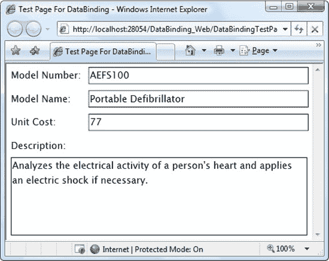

***图 20-1。**显示产品对象的数据*

为了构建这个示例，您需要一些代码来创建您想要显示的产品对象。在本例中，您将使用代码创建一个使用硬编码细节的产品对象。当然，在现实生活中，你更有可能从其他资源中提取数据，比如一个 web 服务、一个 XML 文档、一个从网上下载的文件(见[第 23 章](23.html#ch23))等等。随着对数据绑定的深入研究，您将在本章中探索一个更现实的例子，它使用一个成熟的 web 服务。

要显示来自产品对象的信息，您显然可以求助于乏味的数据复制代码，如下所示:

`txtModelNumber = product.ModelNumber;`

这段代码冗长、易错、脆弱(例如，如果您选择使用不同的显示控件，您可能需要重写它)。数据绑定允许您将数据传输的责任从 C# 代码转移到 XAML 标记中。

要使用数据绑定，必须使用*绑定表达式*设置目标属性。绑定表达式是一个标记扩展(有点像你在[第二章](02.html#ch2)中使用的 StaticResource 扩展)。它由花括号括起来，并且总是以单词*开始绑定*。您可以创建的最简单的绑定表达式还需要一个细节:包含您想要提取的数据的源对象中的属性的名称。

例如，访问产品。ModelNumber 属性，可以使用如下绑定表达式:

`{Binding ModelNumber}`

下面是如何使用它来设置文本框中的 Text 属性:

`<TextBox Text="{Binding ModelNumber}"></TextBox>`

使用这种简单的技术，很容易构建如图 20-1 所示的页面，它有四个绑定表达式:

`<Grid Name="gridProductDetails">
  <Grid.ColumnDefinitions>
    <ColumnDefinition Width="Auto"></ColumnDefinition>
    <ColumnDefinition></ColumnDefinition>
  </Grid.ColumnDefinitions>
  <Grid.RowDefinitions>
    <RowDefinition Height="Auto"></RowDefinition>
    <RowDefinition Height="Auto"></RowDefinition>
    <RowDefinition Height="Auto"></RowDefinition>
    <RowDefinition Height="Auto"></RowDefinition>
    <RowDefinition Height="*"></RowDefinition>
  </Grid.RowDefinitions>

  <TextBlock Margin="7">Model Number:</TextBlock>
  <TextBox Margin="5" Grid.Column="1"
   **Text="{Binding ModelNumber****}"**></TextBox>
  <TextBlock Margin="7" Grid.Row="1">Model Name:</TextBlock>
  <TextBox Margin="5" Grid.Row="1" Grid.Column="1"
   **Text="{Binding ModelName****}"**></TextBox>
  <TextBlock Margin="7" Grid.Row="2">Unit Cost:</TextBlock>
  <TextBox Margin="5" Grid.Row="2" Grid.Column="1"
   **Text="{Binding UnitCost****}"**></TextBox>
  <TextBlock Margin="7,7,7,0" Grid.Row="3">Description:</TextBlock>
  <TextBox Margin="7" Grid.Row="4" Grid.Column="0" Grid.ColumnSpan="2"
   TextWrapping="Wrap" **Text="{Binding Description****}"**></TextBox>
</Grid>`

绑定表达式指定了源属性的名称，但它们不指示源对象。可以通过以下两种方式之一设置源对象:设置元素的 DataContext 属性或设置绑定的 source 属性。

在大多数情况下，最实用的方法是设置每个元素都包含的 DataContext 属性。在前面的示例中，您可以设置所有四个文本框的 DataContext 属性。然而，有一种更简单的方法。如果一个元素使用一个绑定表达式，并且它的 DataContext 属性为 null(这是默认值)，那么这个元素将继续在元素树中向上搜索。这个搜索继续进行，直到元素找到一个数据对象或者到达顶层容器，这是表示页面的用户控件。在前面的例子中，这意味着通过设置网格可以节省大量的精力。DataContext 属性。所有文本框都使用相同的数据对象。

下面是创建产品对象和设置网格的代码。页面首次加载时的 DataContext 属性:

`private void Page_Loaded(object sender, RoutedEventArgs e)
{
    Product product = new Product("AEFS100", "Portable Defibrillator", 77,
      "Analyzes the electrical activity of a person's heart and applies " +
      "an electric shock if necessary.");
      gridProductDetails.DataContext = product;
}`

如果不运行这段代码，将不会出现任何信息。即使您已经定义了绑定，也没有源对象可用，因此页面中的元素将保持空白。

 **提示**通常，你将所有的绑定控件放在同一个容器中，你将能够在容器上设置一次 DataContext，而不是为每个绑定元素设置。

#### 将数据对象存储为资源

您还有另外一个指定数据对象的选项。您可以将其定义为 XAML 标记中的资源，然后通过添加 source 属性来更改每个绑定表达式。

例如，您可以使用如下标记将产品对象创建为资源:

`<UserControl.Resources>
  <local:Product x:Key="resourceProduct"
   ModelNumber="AEFS100"
   ModelName="Portable Defibrillator" UnitCost="77"
   Description="Analyzes the electrical activity of a person's heart and applies
an electric shock if necessary.">
  </local:Product>
</UserControl.Resources>`

该标记假设您已经将项目名称空间映射到 XML 名称空间前缀 local。例如，如果项目名为 DataBinding，则需要将此属性添加到 UserControl 开始标记中:

`xmlns:local="clr-namespace:DataBinding"`

若要在绑定表达式中使用此对象，需要指定 Source 属性。要设置 Source 属性，可以使用 StaticResource 表达式，该表达式使用资源的键名:

`<TextBox
 Text="{Binding ModelNumber, **Source****={****StaticResource** **resourceProduct****}** }">
</TextBox>`

不幸的是，您必须在每个数据绑定表达式中指定 Source 属性。如果需要将大量元素绑定到同一个数据对象，设置容器的 DataContext 属性会更容易。在这种情况下，您仍然可以使用 StaticResource 来设置 DataContext 属性，这允许您将一组嵌套元素绑定到定义为资源的单个数据对象:

`<Grid Name="gridProductDetails" **DataContext="{StaticResource resourceProduct}"**>`

无论哪种方式，当您将数据对象定义为资源时，您就放弃了相当多的自由。尽管您仍然可以改变该对象，但您不能替换它。如果您计划从另一个来源(比如 web 服务)检索数据对象的细节，用代码创建数据对象要自然得多。

顺便提一下，绑定标记扩展支持 Source 之外的其他几个属性，包括 Mode(允许您使用双向绑定来编辑数据对象)和 Converter(允许您在显示源值之前修改它们)。您将在下一节了解模式，在本章的后面了解转换器。

#### 空值和失败的绑定

绑定表达式还包括两种方法，当您的绑定没有完全按照您想要的方式工作时，可以使用这两种方法来填充值。首先，可以使用绑定的 TargetNullValue 属性来设置当绑定数据为空引用时应应用的默认值。这里有一个例子:

`<TextBox
 Text="{Binding ModelName, **TargetNullValue**='**[No Model Name Set]'** }">
</TextBox>`

如果这个产品。ModelName 属性为空引用，您将看到消息“[没有模型名称集]”出现在绑定文本框中。如果没有 TargetNullValue 设置，将不会显示任何文本。

处理绑定问题的第二个工具是 FallbackValue 属性。这将设置一个值，该值在绑定未能加载任何数据时出现。这里有一个例子:

`<TextBox
 Text="{Binding ModelName, **TargetNullValue****='[No Model Name Set]'**,
 **FallbackValue****='N/A'** }">
</TextBox>`

现在，如果整个绑定对象为空或者不包含 ModelName 属性，则文本框中会显示文本“N/A”。如果对象存在，但 Model Name 属性的值为空，则会出现“[无模型名称集]”文本。

#### 双向绑定编辑

此时，您可能想知道如果用户更改文本控件中显示的绑定值会发生什么。例如，如果用户键入一个新的描述，内存中的产品对象是否发生了变化？

要调查发生了什么，可以使用如下代码，从 DataContext 中获取当前产品对象，并在 TextBlock 中显示其属性:

`Product product = (Product)gridProductDetails.DataContext;

lblCheck.Text = "Model Name: " + product.ModelName + "\nModel Number: " +
  product.ModelNumber + "\nUnit Cost: " + product.UnitCost;`

如果您运行这段代码，您会发现更改显示的值没有任何效果。产品对象保持其原始形式。

这是因为绑定表达式默认使用单向绑定。然而，Silverlight 实际上允许您使用系统中三个值中的一个。设置绑定时的 Windows.Data.BindingMode 枚举。模式属性。表 20-1 有完整的列表。

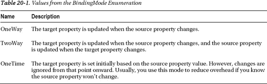

如果您将一个或多个绑定更改为使用双向绑定，则当焦点离开文本框时(例如，当您移动到另一个控件或单击按钮时)，您在文本框中所做的更改将被提交到内存中的对象。

`<TextBox Text="{Binding UnitCost, **Mode**=TwoWay}"></TextBox>`

 **注意**当你对文本框使用双向绑定时，在文本框失去焦点之前，内存中的数据对象不会被修改。但是，其他元素会立即执行更新。例如，当您在列表框中进行选择、移动滑块中的滑块或更改复选框的状态时，源对象会立即被修改。

在某些情况下，您需要精确控制更新的应用时间。例如，您可能需要让文本框在用户键入时应用其更改，而不是等待焦点更改。在这种情况下，您需要通过调用 BindingExpression 来手动完成这项工作。代码中的 UpdateSource()方法。下面是每次用户输入或编辑文本时强制文本框更新源数据对象的代码:

`private void txtUnitCost_TextChanged(object sender, TextChangedEventArgs e)
{
    BindingExpression expression =
      txtUnitCost.GetBindingExpression(TextBox.TextProperty);
    expression.UpdateSource();
}`

如果您的所有更新都是通过代码进行的，您可以使用 Binding 对象的 UpdateSourceTrigger 属性禁用 Silverlight 的自动更新系统，如下所示:

`<TextBox Text=
 "{Binding UnitCost, Mode=TwoWay, **UpdateSourceTrigger****=Explicit**}"></TextBox>`

Silverlight 仅支持 UpdateSourceTrigger 的两个值:Default 和 Explicit。不可能选择 PropertyChanged(就像在 WPF 一样)。但是只需一点代码和 UpdateSource()方法，就可以确保在需要的时候进行更新。

 **注意**一旦你允许某人编辑绑定数据，你需要考虑你要如何捕捉错误和处理无效数据。在本章后面的“验证”部分，您将了解 Silverlight 为防止数据输入问题而提供的许多选项。

#### 变更通知

在某些情况下，您可能希望在数据对象绑定到一个或多个元素后对其进行修改。例如，考虑以下代码，它将当前价格提高了 10%:

`Product product = (Product)gridProductDetails.DataContext;
product.UnitCost *= 1.1;`

 **注意**如果你打算经常修改一个绑定对象，你不需要每次都从 DataContext 属性中检索它。更好的方法是使用页面中的字段来存储它，这样可以简化代码，并且需要较少的类型转换。

这段代码不会有你想要的效果。尽管修改了内存中的产品对象，但这种更改不会出现在绑定的控件中。这是因为缺少了一个重要的基础设施——很简单，Product 对象没有办法通知绑定的元素。

要解决这个问题，您的数据类需要实现系统。component model . inotify property changed 接口。INotifyPropertyChanged 接口定义了一个名为 PropertyChanged 的事件。当数据对象中的属性发生更改时，必须引发 PropertyChanged 事件，并以字符串形式提供属性名称。

下面是使用 INotifyPropertyChanged 接口的改进产品类的定义，以及实现 PropertyChanged 事件的代码:

`public class Product : INotifyPropertyChanged
{
    public event PropertyChangedEventHandler PropertyChanged;
    public void OnPropertyChanged(PropertyChangedEventArgs e)
    {
        if (PropertyChanged != null)
          PropertyChanged(this, e);
    }

    ...
}`

现在，您需要在所有属性设置器中触发 PropertyChanged 事件:

`private double unitCost;
public double UnitCost
{
    get { return unitCost; }
    set {
        unitCost = value;
**        OnPropertyChanged(new PropertyChangedEventArgs("UnitCost"));**
    }
}`

如果您使用上一个示例中的 Product 类的这个版本，您将获得预期的行为。当您更改当前产品对象时，新信息会立即出现在绑定文本框中。

 **提示**如果几个值发生了变化，可以调用 OnPropertyChanged()并传入一个空字符串。这告诉 Silverlight 重新计算绑定到类中任何属性的绑定表达式。

#### 调试数据绑定表达式

数据绑定错误很容易犯，但是很难发现。例如，如果你绑定到一个不存在的属性，你不会得到一个有用的编译时错误来指出你的错误。相反，您将得到一个空白文本框，您希望在其中看到您的数据。如果属性是私有的或者属性 getter 引发异常，情况也是如此。同样，如果属性 setter 引发异常，或者 Silverlight 无法将编辑的值转换为适当的数据类型，编辑也会失败。

如果数据绑定错误是用户编辑的结果，您可能无法防止该问题。相反，您可以使用验证(将在本章后面讨论)来识别错误并通知用户。但是，如果问题是由于代码中的错误造成的，那么很明显，在应用进一步发展之前，您应该找出并修复它。

幸运的是，Silverlight 有一个方便的调试特性，可以让您剖析数据绑定问题。要使用它，首先要在一个有问题的绑定表达式上设置一个断点。为此，你在 Visual Studio 中打开你的 XAML 文件，点击你的绑定表达式旁边的空白处，如图 20-2 所示。

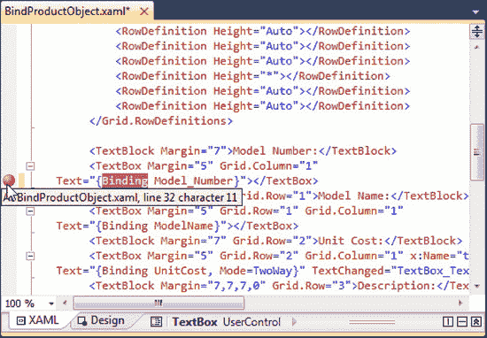

***图 20-2。**添加数据绑定断点*

现在，Visual Studio 将在执行绑定表达式之后，但在显示结果之前，立即进入中断模式*。此时，您可以调查绑定信息或按 F5 键继续运行您的应用。如果要检查几个绑定表达式，可以同时设置几个断点。*

研究绑定的最佳工具是“局部变量”窗口。当您遇到数据绑定断点时,“局部变量”窗口会显示 BindingState 对象。如果你展开这个对象，你会看到许多有用的属性([图 20-3](#fig_20_3) )。例如，Action 属性告诉您调用绑定表达式的确切原因。如果设置为 UpdatingTarget，绑定表达式将在绑定控件中放置一个值。如果设置为 UpdatingSource，绑定表达式将把用户编辑的值应用到数据源。同样，您可以检查 LastCompletedStage 属性来确定在断点被触发之前发生了什么。例如，如果 LastCompletedStage 设置为 TypeConversion，并且您的绑定表达式显示一个错误，那么可以合理地假设数据转换是问题所在。

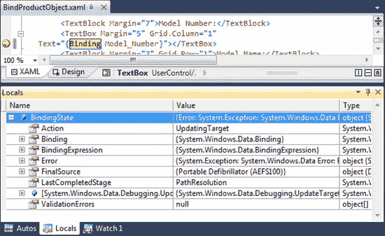

***图 20-3。**调查绑定状态*

迄今为止，最有用的 BindingState 属性是 Error 属性。它提供了一个异常对象，详细描述了当前的问题(如果有的话)。图 20-3 显示了如果你创建一个不存在的属性的绑定并在其上设置一个断点，你会看到什么。完整的错误文本如下:

`System.Windows.Data Error: BindingExpression path error:
 'Model_Number' property not found on 'Portable Defibrillator (AEFS100)'
 'DataBinding.Local.Product' (HashCode=49011679).
   BindingExpression: Path='Model_Number'
   DataItem='Portable Defibrillator (AEFS100)' (HashCode=49011679);
   target element is 'System.Windows.Controls.TextBox' (Name='');
   target property is 'Text' (type 'System.String').`

这里的问题是真正的 ModelNumber 字段没有下划线。显然，获得这些信息比盯着空白文本框要好。

 **注意**数据绑定表达式只有在有实际的绑定数据对象时才会被求值。如果您的数据对象为空值，Silverlight 不会采取任何操作，也不会触发您的断点。但是，您可以使用 FallbackValue 属性替换不同的值，如前所述。

#### 构建数据服务

尽管到目前为止您所看到的例子已经向您介绍了 Silverlight 数据绑定的基本细节，但是它们并不完全真实。更典型的设计是让 Silverlight 应用从外部源(如 web 服务)检索它需要的数据对象。在您到目前为止看到的例子中，差别是很小的。然而，在开始绑定到集合之前，有必要举一个更实际的例子。毕竟，从数据库中获取数据比用代码构建几十或几百个产品对象更有意义。

在本章的例子中，您将依赖一个返回产品对象的简单数据服务。在第 19 章中，你已经学会了创建一个 WCF 服务(并消费它)。构建数据服务本质上是一样的。

第一步是将数据对象的类定义移动到 ASP.NET 网站。(如果您创建的是无项目网站，您必须将代码文件放在 App_Code 文件夹中。如果您正在创建 web 项目，您可以将它放在任何地方。)数据对象需要一些修改:添加 DataContract 和 DataMember 属性以使其可序列化，以及添加一个允许其序列化的公共无参数构造函数。下面是部分代码清单，显示了您需要的大致轮廓:

`**[DataContract()]**
public class Product : INotifyPropertyChanged
{
    private string modelNumber;

    **[DataMember()]**
    public string ModelNumber
    {
        get { return modelNumber; }
        set
        {
            modelNumber = value;
            OnPropertyChanged(new PropertyChangedEventArgs("ModelNumber"));
        }
     }

     private string modelName;

**     [DataMember()]**
     public string ModelName
     {
         get { return modelName; }
         set
         {
             modelName = value;
             OnPropertyChanged(new PropertyChangedEventArgs("ModelName"));
         }
     }
     ...

     **public Product(){}**
}`

**WEB 服务和 INOTIFYPROPERTYCHANGED**

当您使用 web 服务定义数据类时，您可以免费获得 Silverlight 更改通知。这是因为当 Visual Studio 生成数据类的客户端副本时，它会自动实现 INotifyPropertyChanged 接口，即使服务器端的原始接口没有实现。

例如，如果您像这样定义一个超级简单的产品类:

`[DataContract()]
public class Product : INotifyPropertyChanged {

    [DataMember()]
    public string ModelNumber { get; set; }

    [DataMember()]
    public string ModelName { get; set; }

    [DataMember()]
    public decimal UnitCost { get; set; }

    [DataMember()]
    public string Description{ get; set; }
}`

客户端副本仍然实现 INotifyPropertyChanged，具有完整的属性过程，并在任何属性更改时调用 OnPropertyChanged()以引发通知事件。

通过打开 Silverlight 项目中的 Reference.cs 文件，可以检查数据类的客户端代码。(此文件是隐藏的，因此要查看它，您需要首先单击解决方案资源管理器中的“显示所有文件”按钮。如果深入研究，您会在解决方案资源管理器中找到它。例如，当前示例中的产品类位于解决方案资源管理器服务引用数据服务引用. svcmap 引用. cs。)

这种设计提出了一个很好的问题——也就是说，如果 INotifyPropertyChanged 是在客户端自动实现的，那么您是否应该在服务器上实现它呢？这个决定是个人喜好问题。一些开发人员认为在服务器端显式实现接口更清晰，而其他人则不以为然，因为更改通知是一种客户端特性，很少在服务器上使用。

最后，值得注意的是，您可以禁用此功能，并告诉 Visual Studio 在生成客户端数据类时不要使用 INotifyPropertyChanged。为此，必须在 Silverlight 属性中编辑 Reference.svcmap 文件。只需查找<enabledatabinding>元素，将其内容从“真”改为“假”。然而，真的没有采取这一步的好理由。</enabledatabinding>

有了数据对象，您需要一个使用它的 web 服务方法。web 服务类非常简单——它只提供了一个方法，允许调用者检索一个产品记录。这是基本轮廓:

`[ServiceContract(Namespace = "")]
[AspNetCompatibilityRequirements(RequirementsMode =
 AspNetCompatibilityRequirementsMode.Allowed)]
public class StoreDb
{
    private string connectionString =
      WebConfigurationManager.ConnectionStrings["StoreDb"].ConnectionString;

    [OperationContract()]
    public Product GetProduct(int ID)
    {
        ...
    }
}`

该查询是通过名为 GetProduct 的数据库中的存储过程执行的。连接字符串不是硬编码的，而是通过 web.config 文件中的设置检索的，这使得以后修改这些细节变得很容易。下面是 web.config 文件中定义连接字符串的部分:

`<configuration>
  ...
  <connectionStrings>
    <add name="StoreDb" connectionString=
     "Data Source=localhost;Initial Catalog=Store;Integrated Security=True" />
  </connectionStrings>
  ...
</configuration>`

以下示例中显示的数据库组件从 store 数据库中检索产品信息表，Store 数据库是一些 Microsoft 案例研究中包含的虚构 IBuySpy 商店的示例数据库。您可以通过本章的可下载示例获得安装该数据库的脚本(或者您可以使用从 XML 文件中获取相同信息的替代版本)。

在本书中，我们主要对如何将数据对象绑定到 Silverlight 元素感兴趣。处理创建和填充这些数据对象的实际过程(以及其他实现细节，比如 StoreDb 是否通过几次方法调用缓存数据，是否使用存储过程而不是内联查询，等等)不是我们关注的焦点。然而，为了理解发生了什么，下面是数据服务的完整代码:

`[ServiceContract(Namespace = "")]
[AspNetCompatibilityRequirements(RequirementsMode =
 AspNetCompatibilityRequirementsMode.Allowed)]
public class StoreDb
{
    private string connectionString =
      WebConfigurationManager.ConnectionStrings["StoreDb"].ConnectionString;

    [OperationContract()]
    public Product GetProduct(int ID)
    {
        SqlConnection con = new SqlConnection(connectionString);
        SqlCommand cmd = new SqlCommand(
"GetProductByID", con);
        cmd.CommandType = CommandType.StoredProcedure;
        cmd.Parameters.AddWithValue("@ProductID", ID);

        try
        {
            con.Open();
            SqlDataReader reader = cmd.ExecuteReader(CommandBehavior.SingleRow);
            if (reader.Read())
            {
                // Create a Product object that wraps the
                // current record.
                Product product = new Product((string)reader["ModelNumber"],
                    (string)reader["ModelName"],
                    Convert.ToDouble(reader["UnitCost"]),
                    (string)reader["Description"]);
                return product;
            }
            else
            {
                return null;
            }
        }
        finally
        {
            con.Close();
        }
    }
}`

 **注意**目前，GetProduct()方法不包含任何异常处理代码，所以异常会冒泡调用代码。这是一个合理的设计选择，但是您可能希望在 GetProduct()中捕获异常，根据需要执行清理或日志记录，然后重新抛出异常以通知调用代码问题。这种设计模式叫做*来电通知*。

直接使用 ADO.NET 对象(如本例所示)是为数据服务编写代码的一种简单、干净的方式。一般不会用 ADO。NET 的断开连接的数据对象，如数据集，因为 Silverlight 不包含这些类，所以不能操纵它们。

#### 调用数据服务

要使用数据服务，你需要从在你的 Silverlight 项目中添加一个 web 引用开始，这是在第 19 章中介绍的一个基本步骤。一旦解决了这个问题，就可以在应用中使用自动生成的 web 服务代码了。在本例中，它是一个名为 StoreDbClient 的类。

图 20-4 显示了一个 Silverlight 页面，允许用户检索任何产品的详细信息。

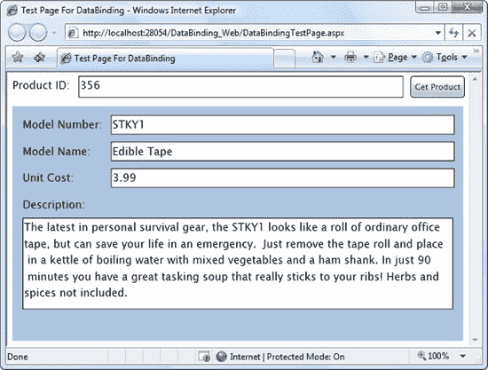

***图 20-4。**从 Web 服务中检索产品数据*

当用户单击“获取产品”时，此代码运行:

`private void cmdGetProduct_Click(object sender, RoutedEventArgs e)
{
    // Set the URL, taking the port of the test web server into account.
    StoreDbClient client = new StoreDbClient();

    // Call the service to get the Product object.
    client.GetProductCompleted += client_GetProductCompleted;
    client.GetProductAsync(356);
 }`

当 web 服务返回其数据时，您需要设置容器的 DataContext 属性，如前面的示例所示:

`private void client_GetProductCompleted(object sender,
  GetProductCompletedEventArgs e)
{
    try
    {
        gridProductDetails.DataContext = e.Result;
    }
    catch (Exception err)
    {
        lblError.Text = "Failed to contact service.";
    }
}`

如果希望允许用户对数据库进行更改，则需要使用双向绑定(以便可以修改产品对象)，并且需要添加一个 web 服务方法，该方法接受已更改的对象并使用它来提交数据库更改(例如，UpdateProduct()方法)。

### 绑定到一组对象上

绑定到单个对象很简单。但是当您需要绑定到一些对象集合时，生活会变得更加有趣——例如，一个表中的所有产品。

尽管每个依赖属性都支持您目前所见的单值绑定，但是集合绑定需要一个更智能的元素。在 Silverlight 中，显示项目列表的每个控件都是从 ItemsControl 派生的。为了支持集合绑定，ItemsControl 类定义了[表 20-2](#tab_20_2) 中列出的关键属性。

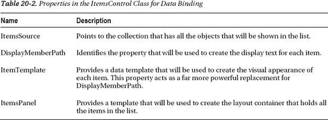

此时，您可能想知道可以在 ItemsSource 属性中填充什么类型的集合。幸运的是，你可以使用任何东西。您所需要的只是对 IEnumerable 接口的支持，该接口由数组、所有类型的集合和许多包装项目组的更专门化的对象提供。但是，从基本 IEnumerable 接口获得的支持仅限于只读绑定。如果您想要编辑集合(例如，您想要允许插入和删除)，您需要更多的基础设施，您很快就会看到。

#### 显示和编辑收藏项目

考虑图 20-5 中显示的页面，该页面显示了产品列表。当您选择一个产品时，该产品的信息会出现在页面的底部，您可以在这里对其进行编辑。(在本例中，GridSplitter 控件允许您调整页面顶部和底部的空间。)

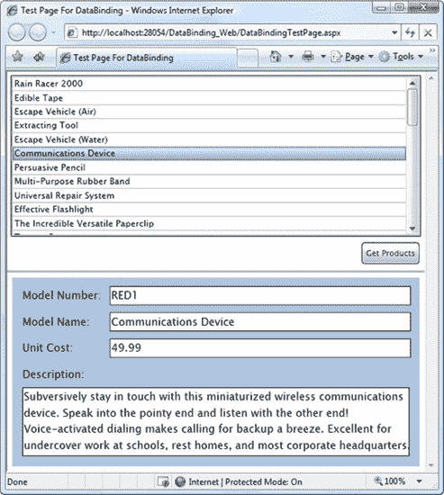

***图 20-5。**产品清单*

要创建这个示例，您需要从构建数据访问逻辑开始。在这种情况下，StoreDb。GetProducts()方法使用 GetProducts 存储过程检索数据库中所有产品的列表。为每条记录创建一个产品对象，并将其添加到通用列表集合中。(您可以在这里使用任何集合—例如，数组或弱类型数组列表可以等效地工作。)

下面是 GetProducts()代码:

`[OperationContract()]
public List<Product> GetProducts()
{
    SqlConnection con = new SqlConnection(connectionString);
    SqlCommand cmd = new SqlCommand("GetProducts", con);
    cmd.CommandType = CommandType.StoredProcedure;

    List<Product> products = new List<Product>();
    try
    {
        con.Open();
        SqlDataReader reader = cmd.ExecuteReader();
        while (reader.Read())
        {
            // Create a Product object that wraps the
            // current record.
            Product product = new Product((string)reader["ModelNumber"],
              (string)reader["ModelName"], Convert.ToDouble(reader["UnitCost"]),
              (string)reader["Description"], (string)reader["CategoryName"]);

            // Add to collection
            products.Add(product);
        }
    }
    finally
    {
        con.Close();
    }
    return products;
}`

当用户单击 GetProducts 按钮时，事件处理代码异步调用 Get Products()方法:

`private void cmdGetProducts_Click(object sender, RoutedEventArgs e)
{
    StoreDbClient client = new StoreDbClient();

    client.GetProductsCompleted += client_GetProductsCompleted;
    client.GetProductsAsync();
}`

当从 web 服务接收到产品列表时，代码将集合存储为 page 类中的成员变量，以便于在代码中的其他地方访问。然后，代码将该集合设置为列表的 ItemsSource:

`private ObservableCollection[] products;

private void client_GetProductsCompleted(object sender,
  GetProductsCompletedEventArgs e)
{
    try
    {
        products = e.Result;
        lstProducts.ItemsSource = products;
    }
    catch (Exception err)
    {
        lblError.Text = "Failed to contact service.";
    }
}`

 **注**敏锐的眼睛会注意到这个例子中一个不寻常的细节。尽管 web 服务返回了一个 Product 对象数组，但是客户端应用以不同的包形式接收它们:ObservableCollection。在下一节中，您将了解为什么 Silverlight 会执行这种技巧。

这段代码成功地用产品对象填充了列表。但是，列表不知道如何显示产品对象，所以它调用 ToString()方法。因为这个方法还没有在产品类中被覆盖，所以显示每个项目的完全限定类名的效果并不明显(见[图 20-6](#fig_20_6) )。

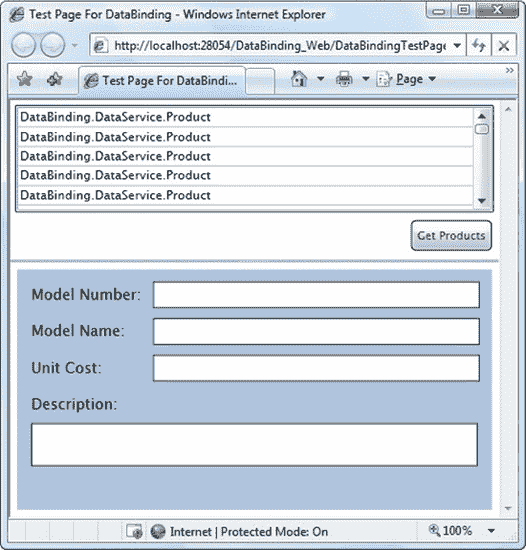

***图 20-6。**一个无益的绑定列表*

你有三个选择来解决这个问题:

*   *设置列表的 DisplayMemberPath 属性*:例如设置为 ModelName，得到如图[图 20-5](#fig_20_5) 所示的结果。
*   *覆盖产品。ToString()方法来返回更多有用的信息*:例如，您可以返回一个字符串，其中包含每个项目的型号和型号名称。这种方法为您提供了一种在列表中显示多个属性的方式(例如，它非常适合在 Customer 类中组合 FirstName 和 LastName 属性)。
*   *提供一个数据模板*:这样，你可以显示属性值的任何排列(以及固定的文本)。你将在本章的后面学习如何使用这个技巧。

当您决定如何在列表中显示信息时，您就准备好迎接第二个挑战了:在列表下方的网格中显示当前所选项的详细信息。为此，您需要响应 SelectionChanged 事件，并更改包含产品详细信息的网格的 DataContext。下面是实现这一点的代码:

`private void lstProducts_SelectionChanged(object sender,
  SelectionChangedEventArgs e)
{
    gridProductDetails.DataContext = lstProducts.SelectedItem;
}`

 **提示**为了防止一个字段被编辑，设置文本框。IsReadOnly 属性设置为 true，或者更好的方法是使用像 TextBlock 这样的只读控件。

如果你尝试这个例子，你会惊讶地发现它已经完全正常了。您可以编辑产品项目，导航离开(使用列表)，然后返回查看您的编辑是否已成功提交到内存中的数据对象。您甚至可以更改影响列表中显示文本的值。如果修改模型名称并切换到另一个控件，列表中相应的条目会自动刷新。

但是有一个怪癖。只有当控件失去焦点时，才会提交更改。如果您更改了文本框中的值，然后移动到另一个文本框，数据对象会如您所预期的那样更新。但是，如果您更改一个值，然后单击列表中的新项目，则编辑后的值将被丢弃，而来自选定数据对象的信息将被加载。如果这种行为不是您想要的，您可以添加代码来明确地强制提交更改。与 WPF 不同，Silverlight 没有直接的方法来实现这一点。您唯一的选择是通过调用另一个控件的 focus()方法，以编程方式将焦点发送到该控件(如有必要，可以是不可见的控件)。这将提交对数据对象的更改。然后，您可以通过调用它的 focus()方法将焦点带回原始文本框。您可以在对 TextChanged 作出反应时使用此代码，也可以添加一个保存或更新按钮。如果使用按钮方法，不需要任何代码，因为单击按钮会改变焦点并自动触发更新。

#### 插入和删除收藏项

正如您在上一节中看到的，Silverlight 在生成与 web 服务通信的客户端代码时会执行一个更改。您的 web 服务可能返回一个数组或列表集合，但是客户端代码将对象放入 ObservableCollection 中。如果返回带有集合属性的对象，也会发生相同的转换步骤。

这种转变的发生是因为客户端并不真正知道 web 服务器返回的集合类型。Silverlight 假设它应该使用 ObservableCollection 以确保安全，因为 ObservableCollection 比数组或普通的列表集合功能更全面。

那么，ObservableCollection 增加了数组和列表对象所缺少的什么呢？首先，与列表一样，ObservableCollection 支持添加和移除项目。例如，您尝试用执行以下代码的删除按钮删除一个项目:

`private void cmdDeleteProduct_Click(object sender, RoutedEventArgs e)
{
    products.Remove((Product)lstProducts.SelectedItem);
}`

这显然不适用于数组。它确实适用于列表集合，但是有一个问题:尽管被删除的项目从集合中移除，但是它仍然顽固地在绑定列表中可见。

若要启用集合更改跟踪，您需要使用实现 INotifyCollectionChanged 接口的集合。在 Silverlight 中，符合此栏的唯一集合是 ObservableCollection 类。当您使用 ObservableCollection(如从 web 服务返回的产品集合)执行前面的代码时，您会看到绑定列表立即被刷新。当然，仍然由您来创建可以永久提交此类更改的数据访问代码——例如，在后端数据库中插入和删除产品的 web 服务方法。

#### 绑定到 LINQ 表情

Silverlight 的众多惊喜之一是它对语言集成查询的支持，这是在。净 3.5。

LINQ 可以处理任何有 LINQ 提供者的数据源。使用 Silverlight 附带的支持，您可以使用类似结构的 LINQ 查询从内存集合或 XML 文件中检索数据。和其他查询语言一样，LINQ 允许您对检索到的数据进行过滤、排序、分组和转换。

虽然 LINQ 不在本章的讨论范围之内，但是您可以从一个简单的例子中学到很多东西。例如，假设您有一个名为 *products* 的产品对象集合，您想要创建第二个集合，其中只包含那些价格超过 100 美元的产品。使用过程代码，您可以编写如下内容:

`// Get the full list of products.
List<Product> products = App.StoreDb.GetProducts();

// Create a second collection with matching products.
List<Product> matches = new List<Product>();
foreach (Product product in products)
{
    if (product.UnitCost >= 100)
    {
        matches.Add(product);
    }
}`

使用 LINQ，您可以使用下面的*表达式*，这要简洁得多:

`// Get the full list of products.
List<Product> products = App.StoreDb.GetProducts();

// Create a second collection with matching products.
**IEnumerable<Product> matches = from product in products**
**          where product.UnitCost >= 100**
**          select product;**`

此示例使用 LINQ 对象，这意味着它使用 LINQ 表达式来查询内存集合中的数据。LINQ 表达式使用一组新的语言关键字，包括 from、in、where 和 select。这些 LINQ 关键字是 C# 语言的真正组成部分。

 **注**对 LINQ 的全面讨论超出了本书的范围。详细的处理，可以参考*Pro LINQ:c# 2010*中的语言集成查询这本书、`[http://msdn.microsoft.com/netframework/aa904594.aspx](http://msdn.microsoft.com/netframework/aa904594.aspx)`中的 LINQ 开发者中心，或者`[http://msdn.microsoft.com/vcsharp/aa336746.aspx](http://msdn.microsoft.com/vcsharp/aa336746.aspx)`中庞大的 LINQ 示例目录。

LINQ 围绕着 IEnumerable <t>接口。无论使用什么数据源，每个 LINQ 表达式都返回一些实现 IEnumerable <t>的对象。因为 IEnumerable <t>扩展了 IEnumerable，所以你可以像绑定一个普通集合一样在 Silverlight 页面中绑定它(参见[图 20-7](#fig_20_7) ):</t></t></t>

`lstProducts.ItemsSource = matches;` 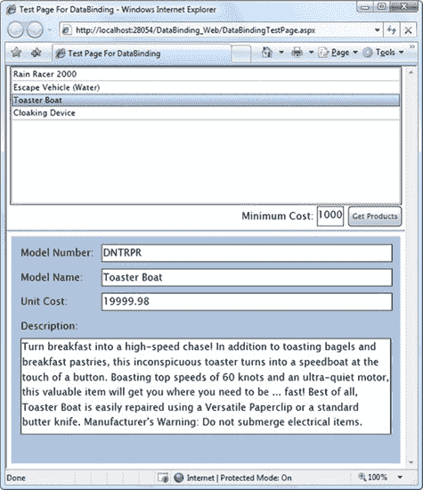

***图 20-7。**用 LINQ 过滤收藏*

与 List 和 ObservableCollection 类不同，IEnumerable <t>接口不提供添加或移除项目的方法。如果您需要这个功能，您必须首先使用 ToArray()或 ToList()方法将 IEnumerable <t>对象转换为数组或列表集合。</t></t>

下面是一个使用 ToList()将 LINQ 查询(如前所示)的结果转换为产品对象的强类型列表集合的示例:

`List<Product> productMatches = matches.ToList();`

 **注意** ToList()是一个扩展方法，这意味着它是在不同于使用它的类中定义的。从技术上讲，ToList()是在系统中定义的。可枚举助手类，它可用于所有 IEnumerable < T >对象。但是，如果 Enumerable 类不在作用域内，它就不可用，这意味着如果没有导入系统，这里显示的代码就不能工作。Linq 命名空间。

ToList()方法会立即计算 LINQ 表达式。最终结果是一个普通的列表集合，您可以用所有常用的方法来处理它。如果要使集合可编辑，以便在绑定控件中立即显示更改，则需要将列表的内容复制到新的 ObservableCollection 中。

#### 主-详细信息显示

如您所见，您可以将其他元素绑定到列表的 SelectedItem 属性，以显示有关当前所选项的更多详细信息。有趣的是，您可以使用类似的技术来构建数据的主从显示。例如，您可以创建一个显示类别列表和产品列表的页面。当用户在第一个列表中选择一个类别时，您可以在第二个列表中只显示属于该类别的产品。图 20-8 显示了这个例子。

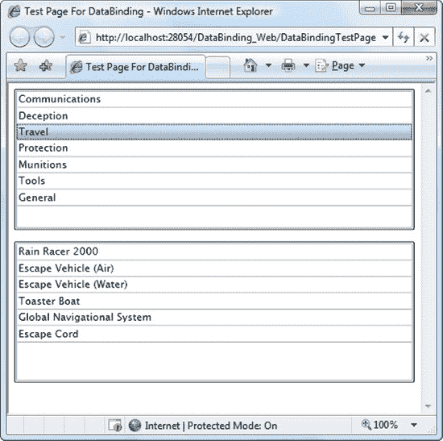

***图 20-8。**一份主-明细清单*

为了实现这一点，您需要一个通过属性提供相关的*子*数据对象集合的*父*数据对象。例如，您可以构建一个提供名为 Category 的属性的 Category 类。属于该类别的产品。像 Product 类一样，Category 类可以实现 INotifyPropertyChanged 来提供更改通知。下面是完整的代码:

`public class Category : INotifyPropertyChanged
{
    private string categoryName;
    public string CategoryName
    {
        get { return categoryName; }
        set { categoryName = value;
              OnPropertyChanged(new PropertyChangedEventArgs("CategoryName"));
            }
    }

**    private List<Product> products;**
**    public List<Product> Products**
**    {**
**        get { return products; }**
**        set { products = value;**
**              OnPropertyChanged(new PropertyChangedEventArgs("Products"));**
**        }**
     **}**

     public event PropertyChangedEventHandler PropertyChanged;
     public void OnPropertyChanged(PropertyChangedEventArgs e)
     {
         if (PropertyChanged != null)
             PropertyChanged(this, e);
     }

     public Category(string categoryName, List<Product> products)
     {
         CategoryName = categoryName;
         Products = products;
     }

     public Category(){}
}`

要使用 Category 类，您还需要修改前面看到的数据访问代码。现在，您从数据库中查询关于产品和类别的信息。图 20-8 中的例子使用了一个名为 GetCategoriesWithProducts()的 web 服务方法，它返回一个类别对象的集合，每个类别对象都有一个产品对象的嵌套集合:

`[OperationContract()]
public List<Category> GetCategoriesWithProducts()
{
    // Perform the query for products using the GetProducts stored procedure.
    SqlConnection con = new SqlConnection(connectionString);
    SqlCommand cmd = new SqlCommand("GetProducts", con);
    cmd.CommandType = CommandType.StoredProcedure;

    // Store the results (temporarily) in a DataSet.
    SqlDataAdapter adapter = new SqlDataAdapter(cmd);
    DataSet ds = new DataSet();
    adapter.Fill(ds, "Products");

    // Perform the query for categories using the GetCategories stored procedure.
    cmd.CommandText = "GetCategories";
    adapter.Fill(ds, "Categories");

    // Set up a relation between these tables.
    // This makes it easier to discover the products in each category.
    DataRelation relCategoryProduct = new DataRelation("CategoryProduct",
        ds.Tables["Categories"].Columns["CategoryID"],
        ds.Tables["Products"].Columns["CategoryID"]);
    ds.Relations.Add(relCategoryProduct);

    // Build the collection of Category objects.
    List<Category> categories = new List<Category>();
    foreach (DataRow categoryRow in ds.Tables["Categories"].Rows)
    {
        // Add the nested collection of Product objects for this category.
        List<Product> products = new List<Product>();
        foreach (DataRow productRow in categoryRow.GetChildRows(relCategoryProduct))
        {
            products.Add(new Product(productRow["ModelNumber"].ToString(),
                productRow["ModelName"].ToString(),
                Convert.ToDouble(productRow["UnitCost"]),
                productRow["Description"].ToString()));
        }
        categories.Add(new Category(categoryRow["CategoryName"].ToString(),
          products));
    }
    return categories;
}`

要显示这些数据，您需要如下所示的两个列表:

`<ListBox x:Name="lstCategories" DisplayMemberPath="CategoryName"
  SelectionChanged="lstCategories_SelectionChanged"></ListBox>
<ListBox x:Name="lstProducts" Grid.Row="1" DisplayMemberPath="ModelName">
</ListBox>`

从 GetCategoriesWithProducts()方法接收集合后，可以设置最顶层列表的 ItemsSource 以显示类别:

`lstCategories.ItemsSource = e.Result;`

若要显示相关产品，必须在第一个列表中的某个项目被单击时做出反应，然后将第二个列表的 ItemsSource 属性设置为类别。所选类别对象的产品属性:

`lstProducts.ItemsSource = ((Category)lstCategories.SelectedItem).Products;`

或者，您可以使用 XAML 中的另一个绑定表达式而不是代码来执行此步骤。诀窍是使用由 ListBox 和 ComboBox 提供的 SelectedValuePath 属性。

本质上，SelectedValuePath 告诉列表控件通过列表的 SelectedValue 属性公开绑定对象的特定属性。如果已经绑定了 Category 对象的集合，可以告诉 ListBox 提供类别。通过列表框收集产品。SelectedValue 属性如下:

`<ListBox x:Name="lstCategories" DisplayMemberPath="CategoryName"   **SelectedValuePath="Products"**></ListBox>`

然后，您可以使用 SelectedValuePath 为第二个列表框编写绑定表达式:

`<ListBox x:Name="lstProducts" Grid.Row="1" DisplayMemberPath="ModelName"
** ItemsSource="{Binding ElementName=lstCategories, Path=SelectedValue}">**
</ListBox>`

现在，在第一个列表框中选择一个类别会导致产品列表出现在第二个列表框中，不需要任何代码。

 **注意**在这个例子中，完整的类别和产品信息是一次从 web 服务下载的。但是如果您的应用使用一个大得多的产品目录，并且大多数用户只需要查看一两个类别，那么您最好只下载想要查看的产品子集。在这种情况下，您将对类别列表框的 SelectionChanged 事件做出反应，并检索当前选定类别的 CategoryID(使用 SelectedItem 或 SelectedValue 属性)。然后，您将执行一个新的 web 服务调用来获取该类别中的产品。但是要注意，这种情况会增加数据库服务器需要执行的工作，并降低应用的速度。您需要仔细权衡利弊，并且(至少)考虑在第一次下载后将产品信息缓存在客户机中。

### 验证

当 Silverlight 数据绑定系统遇到无效数据时，通常会忽略它。例如，考虑下面的列表，其中详细列出了在编辑双向字段时可能出现的三种错误:

*   *数据类型*不正确:例如，像 UnitCost 这样的数字属性不能容纳字母或特殊字符。同样，它也不能容纳极大的数(大于 1.79769313486231570E+308 的数)。
*   *属性设置异常*:例如，像 UnitCost 这样的属性可能会使用范围检查，如果您试图设置负数，就会抛出异常。
*   *只读属性*:根本无法设置。

如果你遇到这些错误，你很可能会错过它们，因为 Silverlight 数据绑定系统不会给你任何视觉反馈。不正确的值会保留在绑定控件中，但不会应用于绑定对象。

为了避免混淆，尽早提醒用户他们的错误是个好主意。在接下来的小节中，您将学习如何响应这些问题并设计具有内置验证的数据对象。

#### 错误通知

实现错误通知的第一步是将绑定的 ValidatesOnExceptions 属性设置为 true。这告诉数据绑定系统要注意所有错误，无论它们是发生在类型转换器还是属性设置器中。但是当 ValidatesOnException 设置为 false(默认值)时，数据绑定系统在遇到这些情况时会自动失败。数据对象不会更新，但违规值仍保留在绑定控件中。

下面是一个将该属性应用于 UnitCost 绑定的示例:

`<TextBox Margin="5" Grid.Row="2" Grid.Column="1" x:Name="txtUnitCost"
  Text="{Binding UnitCost, Mode=TwoWay, **ValidatesOnExceptions****=True**}"></TextBox>`

这个简单的更改使您的应用能够捕捉和显示错误，前提是您使用的是支持控件状态的 ValidationState 组的双向数据绑定。以下是支持此功能的一些控件(无需额外工作):

*   文本框
*   密码框
*   检验盒
*   单选按钮
*   列表框
*   组合框

在第 14 章中，你了解到*控件状态*是在特定时间改变控件外观的动画。在验证的情况下，控件必须支持三种状态:有效、无效非焦点和无效焦点。这些状态共同构成了 ValidationState 组，当控件包含无效数据时，它们允许控件改变其外观。

为了理解这是如何工作的，考虑一个包含无效数据的文本框的简单例子会有所帮助。首先，考虑使用此代码捕捉负价格并引发异常的 Product 类版本:

`private double unitCost;
public double UnitCost
{
    get { return unitCost; }
    set
    {
        if (value < 0) throw new ArgumentException("Can't be less than 0.");
            unitCost = value;
    }
}`

现在，考虑如果用户输入一个负数会发生什么。在这种情况下，属性 setter 将引发 ArgumentException。因为 ValidatesOnException 设置为 true，所以数据绑定系统会捕获此异常，然后将文本框的 ValidationState 从 Valid 切换到 InvalidFocused(如果文本框当前有焦点)或 InvalidUnfocused(如果文本框没有焦点)。

 **提示**如果您将 Visual Studio 设置为中断所有异常，Visual Studio 会在抛出 ArgumentException 时通知您，并切换到中断模式。要继续并查看当异常到达数据绑定系统时会发生什么，请选择 Debug  Continue 或直接按快捷键 F5。

在非焦点状态下，文本框会有一个深红色边框，右上角有一个错误通知图标(一个红色小三角形)。在其焦点状态下，或者当用户将鼠标移动到错误图标上时，异常消息文本会出现在弹出的红色警告气球中。[图 20-9](#fig_20_9) 显示了两种状态。

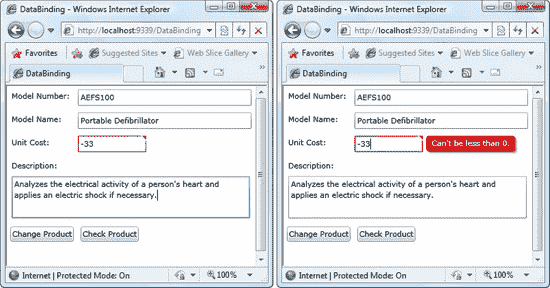

***图 20-9。**文本框的无效非聚焦状态(左)和无效聚焦状态(右)*

 **注意**要使红色弹出气球正常显示，文本框和浏览器窗口边缘之间必须有足够的空间。如果文本框右侧有空间，则气球会出现在那里。如果没有，它会出现在左侧。气球显示在同一位置的任何其他元素(如按钮或标签)的顶部。但是，它不能伸出浏览器窗口。在图 20-9 的[所示的例子中，单价文本框的](#fig_20_9)宽度受到限制，以确保右侧有空间。最后，如果消息太长，不适合可用空间，它的一部分会被砍掉。

乍一看，错误弹出窗口似乎很容易，而且非常有用。因为控件负责视觉细节，所以您只需要担心报告有用的错误消息。但是将验证显示连接到控件模板中有一个缺点:如果您想要更改控件显示错误信息的方式(或者完全禁用错误显示)，您需要替换整个控件模板，确保包含所有其他不相关的状态和标记详细信息。正如您已经知道的，一般的控制模板相当冗长，所以这个过程是冗长的，并且有潜在的局限性。(例如，如果您已经依赖自己的自定义模板来调整错误显示行为，它可能会阻止您使用其他人的自定义模板来获得更有吸引力的视觉效果。)

 **注意**在第 21 章的[中，你将了解到显示错误信息的另一种方式，用 ValidationSummary 控件。它从子元素集合中收集错误消息，并将其列在您选择的一个地方。](21.html#ch21)

#### BindingValidationFailed 事件

错误通知是通知用户潜在问题的好方法。但是在很多情况下，你会希望对接下来发生的事情有更多的控制。在这些情况下，您需要拦截 BindingValidationFailed 事件并使用自定义代码。

若要启用 BindingValidationFailed 事件，必须将 ValidatesOnExceptions 设置为 true(以检测错误)并将 NotifyOnValidationError 设置为 true(以激发验证事件)。这里有一个例子:

`<TextBox Margin="5" Grid.Row="2" Grid.Column="1" x:Name="txtUnitCost"
  Text="{Binding UnitCost, Mode=TwoWay, **ValidatesOnExceptions****=True,**
**NotifyOnValidationError****=True**}"></TextBox>`

BindingValidationError 是一个冒泡事件，这意味着您可以在它发生的位置(在文本框中)或更高级别(如包含它的网格)处理它。在错误发生的地方处理错误，让您有机会编写有针对性的错误处理逻辑，分别处理不同字段中的错误。在更高层次上处理它们(如此处所示)允许您对许多不同类型的错误重用相同的逻辑:

`<Grid Name="gridProductDetails"
**BindingValidationError****="Grid_BindingValidationError"**>`

最后一步是在问题出现时采取措施。您可以选择显示一条消息或更改应用某些部分的外观，但是 BindingValidationError 事件的真正威力在于它允许您执行其他操作，例如更改焦点、重置不正确的值、尝试更正它，或者根据所犯的特定错误提供更详细、更有针对性的帮助。

以下示例显示错误信息并指示当前值(参见[图 20-10](#fig_20_10) )。它还将焦点转移回违规的文本框，这是一种笨拙的(但偶尔有用的)技术。它的副作用是确保控件保持在 InvalidFocused 状态，而不是 InvalidUnfocused 状态，因此弹出的错误信息也保持可见:

`private void Grid_BindingValidationError(object sender, ValidationErrorEventArgs e)
{
    // Display the error.
    lblInfo.Text = e.Error.Exception.Message;
    lblInfo.Text += "\nThe stored value is still: " +
      ((Product)gridProductDetails.DataContext).UnitCost.ToString();

    // Suggest the user try again.
    txtUnitCost.Focus();
}` 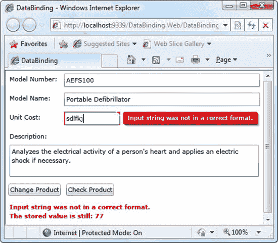

***图 20-10。**指出一个验证错误*

BindingValidationError 事件仅在值被更改并且编辑被提交时发生。在文本框的情况下，这种情况不会发生，直到文本框失去焦点。如果希望更快地捕获错误，可以使用 BindingExpression。UpdateSource()方法在用户键入时强制立即更新，如前一节所述。

 **提示**如果不重置文本框中的值，错误的值仍会显示，即使它没有存储在绑定的数据对象中。您可以选择允许这种行为，以便用户有机会编辑无效值。

无论您在此事件处理程序中采取什么步骤，除了控件状态更改之外，还会发生其他情况。不幸的是，您不能选择性地禁用控件错误报告*和*选择接收 BindingValidationError 事件。

#### 验证类

您不需要等待 BindingValidationError 事件来检测无效数据。您可以使用验证类的静态方法随时检查绑定控件。验证。如果控件验证失败，则 GetHasErrors()返回 true。GetErrors()返回一个或多个异常对象的适当集合。

这些方法给你增加了灵活性。例如，如果存在无效数据，您可以检查 HasErrors()并拒绝让用户继续新的步骤或执行特定的功能。类似地，您可以使用 GetErrors()在数据输入过程结束时汇总一系列错误，这样您就可以在一个地方提供一个问题的逐项列表。

#### 创建带有内置验证的数据对象

前面，您看到了将验证逻辑构建到数据对象中的最简单的方法——通过抛出错误数据的异常(例如 UnitCost 属性中的负数)。然而，引发异常是实现验证的一种有点危险且经常鲁莽的方式。一个问题是引发异常的代码可能会无意中排除对数据对象的完全合理的使用。例如，UnitsInStock 属性的值保持为–10 可能没有意义，但是如果基础数据库存储了该值，您可能仍然希望创建相应的 Product 对象，以便可以在应用中操作它。

大多数纯粹主义者不喜欢引发异常来指出用户输入错误。这种设计选择有几个原因——例如，用户输入错误不是异常情况，错误情况可能取决于多个属性值之间的交互，有时保留不正确的值进行进一步处理而不是直接拒绝它们是值得的。相反，谨慎的开发人员依靠其他技术来标记无效数据。

在 Silverlight 中，您的数据对象可以通过实现 IDataErrorInfo 或 INotifyDataErrorInfo 接口来提供内置验证。这两个接口有着相同的目标——它们用一个更礼貌的错误通知系统取代了激进的未处理异常。IDataErrorInfo 接口是最初的错误跟踪接口，可以追溯到. NET 的第一个版本。Silverlight 包含它是为了向后兼容。INotifyDataErrorInfo 接口是 Silverlight 4 中引入的一个类似但更丰富的接口。它支持额外的特性，比如每个属性多个错误和丰富的错误对象。

无论您使用哪种界面，都需要遵循三个基本步骤:

*   在数据对象中实现 IDataErrorInfo 或 INotifyDataErrorInfo 接口。
*   告诉数据绑定基础设施检查数据对象的错误并显示错误通知。如果使用 IDataErrorInfo 接口，则将 ValidatesOnDataErrors 设置为 true。如果使用 INotifyDataErrorInfo 接口，则将 ValidatesOnNotifyDataErrors 设置为 true。
*   如果希望接收 BindingValidationFailed 事件，也可以将 NotifyOnValidationError 设置为 true。
*   或者，如果您想要捕捉其他类型的错误(如数据转换问题)，请将 ValidatesOnExceptions 属性设置为 true。

 **注意**如果你使用的是 web 服务，记住 Visual Studio 不能将代码从服务器定义的数据对象传输到自动生成的客户端副本。这对于基本的数据对象来说不是问题，但是如果您想要创建一个实现验证等特性的富数据对象，这将是一个严重的障碍。在这种情况下，你需要使用在第 19 章中描述的类型共享特性，它允许你手动添加数据类的同步副本到两个项目中。

以下示例显示了如何使用 INotifyDataErrorInfo 接口检测产品对象的问题。第一步是实现接口:

`public class Product : INotifyPropertyChanged, **INotifyDataErrorInfo**
{ ... }`

INotifyDataErrorInfo 接口只需要三个成员。添加或删除错误时，将触发 ErrorsChanged 事件。HasErrors 属性返回 true 或 false 以指示数据对象是否有错误。最后，GetErrors()方法提供了完整的错误信息。

在实现这些方法之前，您需要一种方法来跟踪代码中的错误。最好的选择是私人收藏，就像这样:

`private Dictionary<string, List<string>> errors =
  new Dictionary<string, List<string>>();`

乍一看，这个系列有点奇怪。要了解原因，你需要了解事实。首先，INotifyPropertyChanged 接口希望您将错误链接到特定的属性。第二，每个属性可以有一个或多个错误。跟踪这个错误信息的最简单的方法是使用一个字典<t k="">集合，它通过属性名进行索引:</t>

`private Dictionary<string, List<string>> errors =
  new Dictionary<**string**, List<string>>();`

词典中的每一个词条本身都是错误的集合。这个例子使用了一个简单的 List <of t="">List <t>字符串:</t></of>

`private Dictionary<string, **List<string>**> errors =
  new Dictionary<string, **List<string>**>();`

但是，您可以使用一个完整的 error 对象将关于错误的多条信息捆绑在一起，包括文本消息、错误代码、严重性级别等详细信息。

一旦你有了这个集合，你只需要在错误发生时添加它(如果错误被纠正，删除错误信息)。为了简化这个过程，本例中的 Product 类添加了一对名为 SetErrors()和 ClearErrors()的私有方法:

`public event EventHandler<DataErrorsChangedEventArgs> ErrorsChanged;

private void SetErrors(string propertyName, List<string> propertyErrors)
{
    // Clear any errors that already exist for this property.
    errors.Remove(propertyName);

    // Add the list collection for the specified property.
    errors.Add(propertyName, propertyErrors);

    // Raise the error-notification event.
    if (ErrorsChanged != null)
        ErrorsChanged(this, new DataErrorsChangedEventArgs(propertyName));
}

private void ClearErrors(string propertyName)
{            
    // Remove the error list for this property.
    errors.Remove(propertyName);            

    // Raise the error-notification event.
    if (ErrorsChanged != null)
        ErrorsChanged(this, new DataErrorsChangedEventArgs(propertyName));
}`

这是错误处理逻辑，确保产品。ModelNumber 属性限于字母数字字符串。(不允许使用标点、空格和其他特殊字符。)

`private string modelNumber;
public string ModelNumber
{
    get { return modelNumber; }
    set
    {
        modelNumber = value;

**        bool valid = true;**
**        foreach (char c in modelNumber)**
**        {**
**            if (!Char.IsLetterOrDigit(c))**
            **{**
**                valid = false;**
**                break;**
            **}**
        **}**
**        if (!valid)**
        **{**
            **List****<**string**>** **errors** = new **List<string>();**
**            errors.Add("The ModelNumber can only contain letters and numbers.");**
**            SetErrors("ModelNumber", errors);**
**        }**
**        else**
        **{**
            **ClearErrors("ModelNumber");**
        **}**

        OnPropertyChanged(new PropertyChangedEventArgs("ModelNumber"));
    }
}`

最后一步是实现 GetErrors()和 HasErrors()方法。GetErrors()方法返回特定属性的错误列表(或所有属性的所有错误)。如果产品类有一个或多个错误，HasErrors()属性返回 true。

`public IEnumerable GetErrors(string propertyName)
{
    if (string.IsNullOrEmpty(propertyName))
    {
        // Provide all the error collections.
        return (errors.Values);
    }
    else
    {
        // Provice the error collection for the requested property
        // (if it has errors).
        if (errors.ContainsKey(propertyName))
        {
            return (errors[propertyName]);
        }
        else
        {
            return null;
        }
    }  
}

public bool HasErrors
{
    get
    {
        // Indicate whether the entire Product object is error-free.
        return (errors.Count > 0);
    }
}`

若要告知 Silverlight 使用 INotifyDataErrorInfo 接口并在修改属性时使用它来检查错误，绑定的 ValidatesOnNotifyDataErrors 属性必须为 true:

`<TextBox Margin="5" Grid.Row="2" Grid.Column="1" x:Name="txtModelNumber"
  Text="{Binding ModelNumber, Mode=TwoWay, **ValidatesOnNotifyDataErrors=True**, NotifyOnValidationError=True}"></TextBox>`

从技术上讲，您不需要显式设置 ValidatesOnNotifyDataErrors，因为它在默认情况下是真的(与 IDataErrorInfo 接口使用的类似的 ValidatesOnDataErrors 属性不同)。然而，显式地设置它以使您在标记中清楚地使用它仍然是一个好主意。

如果您还使用了 NotifyOnValidationError 事件(如此处所示)，则每当错误集合发生更改时，BindingValidationError 事件都会触发。但是，在 ValidationErrorEventArgs 中不会提供异常对象。属性，因为没有发生异常。相反，您可以通过 ValidationErrorEventArgs 获取从数据对象返回的错误信息。Error.ErrorContent 属性在当前示例中，这是错误列表中的简单字符串，但是您可以返回任何想要的对象。如果返回一个包含多个属性错误项的列表，BindingValidationError 事件将为每个错误项触发一次。

`private void Grid_BindingValidationError(object sender, ValidationErrorEventArgs e)
{
    if (e.Error.Exception != null)
    {
        // Validation failed due to an exception.
        ...
     }
     else
     {
         // Validation error reported through an interface.
         lblInfo.Text = e.Error.ErrorContent.ToString();
         txtModelNumber.Focus();
     }
}`

顺便提一下，您可以通过创建一个数据对象来结合这两种方法，该数据对象对某些类型的错误抛出异常，并使用 IDataErrorInfo 或 INotifyDataErrorInfo 来报告其他错误。但是，请记住，这两种方法有很大的不同。当触发异常时，数据对象中的属性不会更新。但是当您使用 IDataErrorInfo 或 INotifyDataErrorInfo 接口时，无效值是允许的，但会被标记。数据对象已更新，但您可以使用通知和 BindingValidationFailed 事件来通知用户。

 **注意**在第 21 章的[中，您将看到另一种在数据对象中构建验证的方法——使用声明性注释。这种方法功能不太强大，但是允许您将验证逻辑与代码的其余部分分离开来。它还与支持这些属性的数据控件很好地集成在一起。](21.html#ch21)

### 数据格式化和转换

在基本绑定中，信息从源传输到目标，没有任何改变。这似乎是合乎逻辑的，但并不总是你想要的行为。您的数据源可能使用了您不想直接在用户界面中显示的低级表示。例如，您可能想要用人类可读的字符串替换数字代码、需要缩减大小的数字、需要以长格式显示的日期等等。如果是这样，您需要一种方法将这些值转换成正确的显示形式。如果您使用的是双向绑定，还需要反过来做——获取用户提供的数据，并将其转换为适合存储在适当的数据对象中的表示形式。

幸运的是，Silverlight 有两个工具可以帮助您:

*   *字符串格式化*:这个特性允许您通过设置绑定来转换表示为文本的数据——例如，包含日期和数字的字符串。StringFormat 属性。这是一种方便的技术，至少适用于一半的格式化任务。
*   这是一个更强大(也更复杂)的特性，允许你将任何类型的源数据转换成任何类型的对象表示，然后你可以将它传递给链接的控件。

在下面几节中，您将考虑这两种方法。

#### 字符串格式

字符串格式是格式化需要显示为文本的数字的完美工具。例如，考虑本章中使用的产品类的 UnitCost 属性。单位成本以小数形式存储。因此，当它显示在文本框中时，您会看到类似于 3.9900 的值。这种显示格式不仅显示了比您可能希望的更多的小数位数，而且还省略了货币符号。更直观的表示是货币格式的值$49.99，如图[图 20-11](#fig_20_11) 所示。

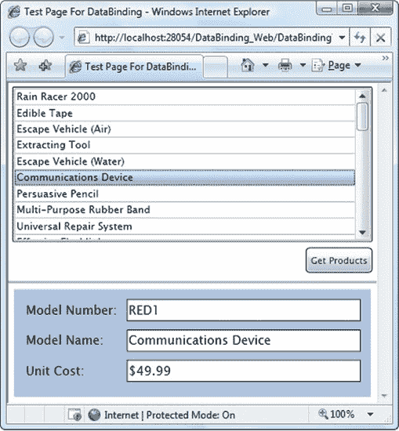

***图 20-11。**显示格式化的货币值*

解决这个问题最简单的方法是设置绑定。StringFormat 属性。Silverlight 将使用格式字符串将原始文本转换为其显示值，就在它出现在控件中之前。同样重要的是，Silverlight 将(在大多数情况下)使用这个字符串来执行反向转换，获取任何编辑过的数据并使用它来更新绑定属性。

设置绑定时。StringFormat 属性，则使用标准。NET 格式字符串。例如，您可以使用格式字符串 *C* 来应用特定于地区的货币格式，在美国计算机上，该格式将 3.99 转换为 3.99 美元。您可以用单引号将货币字符串括起来。下面是一个将货币格式字符串应用于单位成本字段的示例:

`<TextBox Margin="5" Grid.Row="2" Grid.Column="1"
 Text="{Binding UnitCost, StringFormat='C' }">
</TextBox>`

要使用 StringFormat 属性获得想要的结果，需要正确的格式字符串。您可以在 Visual Studio 帮助中了解所有可用的格式字符串。然而，[表 20-3](#tab_20_3) 和[表 20-4](#tab_20_4) 分别显示了一些最常用的数值和日期选项。下面是一个使用自定义日期格式字符串来格式化 OrderDate 属性的绑定表达式:

`<TextBlock Text="{Binding Date, StringFormat='0:MM/dd/yyyy' }"></TextBlock>`

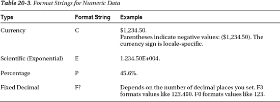

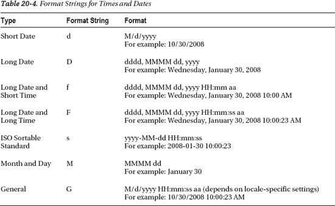

#### 价值转换器

装订。创建 StringFormat 属性是为了对数字和日期进行简单的标准格式化。但是许多数据绑定场景需要一个更强大的工具，称为*值转换器*类。

值转换器扮演着一个简单的角色。它负责在源数据显示在目标中之前对其进行转换，并且(在双向绑定的情况下)在新的目标值应用回源之前对其进行转换。

值转换器是 Silverlight 数据绑定难题中非常有用的一块。您可以通过多种方式使用它们:

*   *将数据格式化为字符串表示*:例如，您可以将数字转换为货币字符串。这是价值转换器最明显的用途，但肯定不是唯一的用途。
*   *创建特定类型的 Silverlight 对象*:例如，您可以读取一个二进制数据块，并创建一个可以绑定到图像元素的 BitmapImage 对象。
*   *根据绑定数据*有条件地改变元素的属性:例如，您可以创建一个值转换器，改变元素的背景颜色，以突出显示特定范围内的值。

在接下来的部分中，您将考虑每种方法的一个例子。

#### 用值转换器格式化字符串

为了对值转换器的工作原理有一个基本的了解，有必要回顾一下您在上一节中看到的货币格式示例。尽管这个例子使用了绑定。StringFormat 属性，您可以使用值转换器完成同样的事情，甚至更多。例如，您可以舍入或截断值(将 3.99 改为 4)，使用数字名称(将 1，000，000 改为 1，000，000)，甚至添加经销商加价(将 3.99 乘以 15%)。您还可以定制反向转换的工作方式，将用户提供的值更改为绑定对象中的正确数据值。

要创建值转换器，您需要采取三个步骤:

1.  从系统中创建一个实现 IValueConverter(的类。Windows.Data 命名空间)。您将该类放在 Silverlight 项目中，这是转换发生的地方，而不是 web 服务中。
2.  实现 Convert()方法，将数据从其原始格式更改为其显示格式。
3.  实现 ConvertBack()方法，该方法执行相反的操作，将值从显示格式更改为其本机格式。

图 20-12 显示了它是如何工作的。

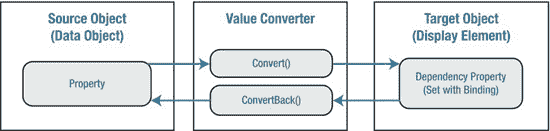

***图 20-12。**转换绑定数据*

在十进制到货币转换的情况下，可以使用十进制。ToString()方法来获取所需的格式化字符串表示形式。您需要指定货币格式字符串“C”，如下所示:

`string currencyText = decimalPrice.ToString("C");`

此代码使用应用于当前线程的区域性设置。为英语(美国)地区配置的计算机使用 en-US 语言环境运行，并显示带有美元符号($)的货币。针对其他区域设置配置的电脑可能会显示不同的货币符号。(这与 Binding，StringFormat 属性设置为 *C* 时的工作方式相同。)如果这不是您想要的结果(例如，您总是希望美元符号出现)，您可以使用 ToString()方法的重载来指定区域性，如下所示:

`CultureInfo culture = new CultureInfo("en-US");
string currencyText = decimalPrice.ToString("C", culture);`

从显示格式转换回您想要的数字有点棘手。double 类型的 Parse()和 TryParse()方法是完成这项工作的合理选择，但通常它们不能处理包含货币符号的字符串。解决方案是使用接受系统的 Parse()或 TryParse()方法的重载版本。全球化。数字样式值。如果您提供 NumberStyles。任何，您都可以成功地去除货币符号，如果它存在的话。

这是处理价格值(如产品)的值转换器的完整代码。单位成本属性:

`public class PriceConverter : IValueConverter
{
    public object Convert(object value, Type targetType, object parameter,
      CultureInfo culture)
    {
        double price = (double)value;
        return price.ToString("C", culture);
    }

    public object ConvertBack(object value, Type targetType, object parameter,
      CultureInfo culture)
    {
        string price = value.ToString();

        double result;
        if (Double.TryParse(price, NumberStyles.Any, culture, out result))
        {
            return result;
        }
        return value;
    }
}`

要使用这个转换器，首先需要将项目名称空间映射到可以在标记中使用的 XML 名称空间前缀。下面的示例使用了命名空间前缀 local，并假设您的值转换器位于命名空间数据绑定中:

`xmlns:local="clr-namespace:DataBinding"`

通常，您会将该属性添加到标记顶部的<usercontrol>开始标记中。</usercontrol>

现在，您需要在页面的资源集合中创建 PriceConverter 类的实例，如下所示:

`<UserControl.Resources>
  <local:PriceConverter x:Key="PriceConverter"></local:PriceConverter>
</UserControl.Resources>`

然后，您可以在绑定中使用 StaticResource 引用指向它:

`<TextBox Margin="5" Grid.Row="2" Grid.Column="1"
 Text="{Binding UnitCost, Mode=TwoWay, **Converter={StaticResource PriceConverter****}**}">
</TextBox>`

 **注意**与 WPF 不同，Silverlight 缺少 IMultiValueConverter 接口。因此，您只能转换单个值，而不能组合值(例如，将 FirstName 和 LastName 字段连接在一起)或执行计算(例如，将 UnitPrice 乘以 UnitsInStock)。

#### 用值转换器创建对象

当您需要弥合数据在类中的存储方式和在页面中的显示方式之间的差距时，值转换器是必不可少的。例如，假设您将图片数据作为字节数组存储在数据库的某个字段中。你可以把二进制数据转换成一个系统。并将它存储为数据对象的一部分。然而，这种设计可能并不合适。

例如，您可能需要灵活地创建图像的多个对象表示形式，这可能是因为您的数据库同时用于 Silverlight 应用和 Windows 窗体应用(它们使用系统。改为 Drawing.Bitmap 类)。在这种情况下，将原始二进制数据存储在数据对象中并使用值转换器将其转换为 BitmapImage 对象是有意义的。

 **提示**要将一块二进制数据转换成图像，必须先创建一个 BitmapImage 对象，并将图像数据读入内存流。然后，您可以调用位图图像。SetSource()方法将流中的图像数据传递给 BitmapImage。

商店数据库中的 Products 表不包含二进制图片数据，但它包含一个 ProductImage 字段，该字段存储相关产品图像的文件名。在这种情况下，您甚至有更多的理由推迟创建图像对象。首先，映像可能不可用，这取决于应用运行的位置。第二，除非要显示图像，否则存储图像不会产生额外的内存开销。

ProductImage 字段包括文件名，但不包括图像文件的完整 URI。这使您可以灵活地从任何位置提取图像文件。值转换器的任务是根据 ProductImage 字段和要使用的网站创建一个指向图像文件的 URI。根 URI 是使用名为 RootUri 的自定义属性存储的，默认为当前网页所在的同一个 URI。

以下是执行转换的 ImagePathConverter 的完整代码:

`public class ImagePathConverter : IValueConverter
{
    private string rootUri;
    public string RootUri
    {
        get { return rootUri; }
        set { rootUri = value; }
    }

    public ImagePathConverter()
    {
        string uri = HtmlPage.Document.DocumentUri.ToString();

        // Remove the web page from the current URI to get the root URI.
        rootUri = uri.Remove(uri.LastIndexOf('/'),
          uri.Length - uri.LastIndexOf('/'));
    }

    public object Convert(object value, Type targetType, object parameter,
      System.Globalization.CultureInfo culture)
    {
        string imagePath = RootUri + "/" + (string)value;
        return new BitmapImage(new Uri(imagePath));
    }

    public object ConvertBack(object value, Type targetType, object parameter,
      System.Globalization.CultureInfo culture)
    {
        // Images aren't editable, so there's no need to support ConvertBack.
        throw new NotSupportedException();
    }
}`

要使用这个转换器，首先要将其添加到资源中。虽然您可以在 ImagePathConverter 元素上设置 RootUri 属性，但是本示例没有这样做。因此，ImagePathConverter 使用指向当前应用网站的默认值。

`<UserControl.Resources>
  <local:ImagePathConverter x:Key="ImagePathConverter"></local:ImagePathConverter>
</UserControl.Resources>`

现在很容易创建一个使用这个值转换器的绑定表达式:

`<Image Margin="5" Grid.Row="2" Grid.Column="1" Stretch="None"
 HorizontalAlignment="Left" Source=
 "{Binding ProductImagePath, **Converter={StaticResource ImagePathConverter****}**}">
</Image>`

这是因为图像。Source 属性需要 ImageSource 对象，BitmapImage 类从 ImageSource 派生。

[图 20-13](#fig_20_13) 显示了结果。

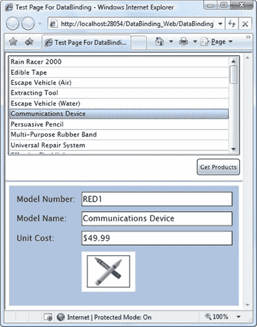

***图 20-13。**显示绑定图像*

您可以从几个方面改进这个示例。首先，试图创建指向不存在的文件的 BitmapImage 会导致一个异常，在设置 DataContext、ItemsSource 或 Source 属性时会收到该异常。或者，您可以向 ImagePathConverter 类添加允许您配置此行为的属性。例如，您可以引入布尔型 SuppressExceptions 属性。如果设置为 true，可以在 Convert()方法中捕捉异常并返回一个空字符串。或者，您可以添加采用占位符 BitmapImage 的 DefaultImage 属性。如果发生异常，ImagePathConverter 可以返回默认图像。

#### 应用条件格式

一些最有趣的值转换器并不是设计来格式化数据以供展示的。相反，它们旨在根据数据规则格式化元素的其他一些与外观相关的方面。

例如，假设您想通过给高价商品不同的背景色来标记它们。您可以用下面的值转换器轻松地封装这个逻辑:

`public class PriceToBackgroundConverter : IValueConverter
{
    public double MinimumPriceToHighlight
    {
        get; set;
    }

    public Brush HighlightBrush
    {
        get; set;
    }

    public Brush DefaultBrush
    {
        get; set;
    }

    public object Convert(object value, Type targetType, object parameter,
      System.Globalization.CultureInfo culture)
    {
        double price = (double)value;
        if (price >= MinimumPriceToHighlight)
            return HighlightBrush;
        else
            return DefaultBrush;
    }

    public object ConvertBack(object value, Type targetType, object parameter,
      System.Globalization.CultureInfo culture)
    {
        throw new NotSupportedException();
    }
}`

 **提示**如果你决定不能执行转换，你可以返回绑定值。取消设置值以告诉 Silverlight 忽略您的绑定。绑定属性(在本例中为 Background)将保持其默认值。

同样，值转换器是在考虑可重用性的情况下精心设计的。它们不是在转换器中硬编码颜色高亮，而是在 XAML 中由代码指定，*使用*转换器:

`<local:PriceToBackgroundConverter x:Key="PriceToBackgroundConverter"
  DefaultBrush="{x:Null}" HighlightBrush="Orange" MinimumPriceToHighlight="50">
</local:PriceToBackgroundConverter>`

使用画笔而不是颜色，以便您可以使用渐变和背景图像创建更高级的高光效果。如果希望保留标准的透明背景(以便使用父元素的背景)，请将 DefaultBrush 或 HighlightBrush 属性设置为 null，如下所示。

剩下的就是使用这个转换器来设置元素的背景，比如包含所有其他元素的边框:

`<Border Background=
 "{Binding UnitCost, Converter={StaticResource PriceToBackgroundConverter}}"
 ...>`

在许多情况下，除了要转换的数据之外，您还需要向转换器传递信息。在本例中，PriceToBackgroundConverter 需要知道高亮颜色和最低价格的详细信息，这些信息通过属性传递。然而，你还有另外一个选择。通过设置 ConverterParameter 属性，可以通过绑定表达式将单个对象(任何类型)传递给转换器。下面是一个使用这种方法提供最低价格的示例:

`<Border Background=
 "{Binding UnitCost, Converter={StaticResource PriceToBackgroundConverter},
**ConverterParameter=50}"**
 ... >`

该参数作为参数传递给 Convert()方法。下面是如何重写前面的例子来使用它:

`public object Convert(object value, Type targetType, object parameter,
  System.Globalization.CultureInfo culture)
{
    double price = (double)value;
    if (price >= **Double.Parse(parameter)**)
        return HighlightBrush;
    else
        return DefaultBrush;
}`

一般来说，基于属性的方法是首选。它更清晰、更灵活、类型更强。(在标记扩展中设置时，ConverterParameter 始终被视为字符串。)但是在某些情况下，您可能希望对多个元素重用一个值转换器，并且您可能需要为每个元素改变一个细节。在这种情况下，使用 ConverterParameter 比创建值转换器的多个副本更有效。

### 数据模板

*数据模板*是一大块 XAML 标记，它定义了绑定数据对象应该如何显示。两种类型的控件支持数据模板:

*   内容控件通过 ContentTemplate 属性支持数据模板。内容模板用于显示您在内容属性中放置的任何内容。
*   列表控件(从 ItemsControl 派生的控件)通过 ItemTemplate 属性支持数据模板。该模板用于显示您作为 ItemsSource 提供的集合中的每一项(或 DataTable 中的每一行)。

基于列表的模板功能基于内容控件模板:列表中的每一项都由内容控件包装，例如 ListBox 的 ListBoxItem、ComboBox 的 ComboBoxItem 等等。您为列表的 ItemTemplate 属性指定的任何模板都将用作列表中每个项目的 ContentTemplate。

你能在数据模板里放什么？很简单。数据模板是一个普通的 XAML 标记块。像任何其他 XAML 标记块一样，模板可以包含元素的任意组合。它还应该包括一个或多个数据绑定表达式，用于提取您想要显示的信息。(毕竟，如果不包含任何数据绑定表达式，列表中的每一项看起来都是一样的，这不是很有帮助。)

了解数据模板如何工作的最好方法是从一个不使用模板的基本列表开始。例如，考虑前面显示的列表框:

`<ListBox Name="lstProducts" DisplayMemberPath="ModelName"></ListBox>`

使用这个使用数据模板的列表框可以获得相同的效果:

`<ListBox Name="lstProducts">
  <ListBox.ItemTemplate>
    <DataTemplate>
      <TextBlock Text="{Binding ModelName}"></TextBlock>
    </DataTemplate>
  </ListBox.ItemTemplate>
</ListBox>`

将列表绑定到产品集合时(通过设置 ItemsSource 属性)，将为每个产品对象创建一个 ListBoxItem。ListBoxItem。属性设置为适当的产品对象，ListBoxItem。ContentTemplate 设置为前面显示的数据模板，它从产品中提取值。属性并将其显示在 TextBlock 中。

迄今为止，结果并不令人满意。但是现在您已经切换到了数据模板，您可以无限制地创造性地呈现您的数据。下面是一个示例，它用圆形边框将每一项包裹起来，显示两条信息，并使用粗体格式突出显示型号:

`<ListBox Name="lstProducts" HorizontalContentAlignment="Stretch"
 SelectionChanged="lstProducts_SelectionChanged">
  <ListBox.ItemTemplate>
    <DataTemplate>
      <Border Margin="5" BorderThickness="1" BorderBrush="SteelBlue"
       CornerRadius="4">
        <Grid Margin="3">
          <Grid.RowDefinitions>
            <RowDefinition></RowDefinition>
            <RowDefinition></RowDefinition>
          </Grid.RowDefinitions>
          <TextBlock FontWeight="Bold"
           Text="{Binding ModelNumber}"></TextBlock>
          <TextBlock Grid.Row="1"
           Text="{Binding ModelName}"></TextBlock>
        </Grid>
      </Border>
    </DataTemplate>
  </ListBox.ItemTemplate>
</ListBox>`

绑定此列表时，会为每个产品创建一个单独的边框对象。在边界元素内部是一个包含两条信息的网格，如图[图 20-14](#fig_20_14) 所示。

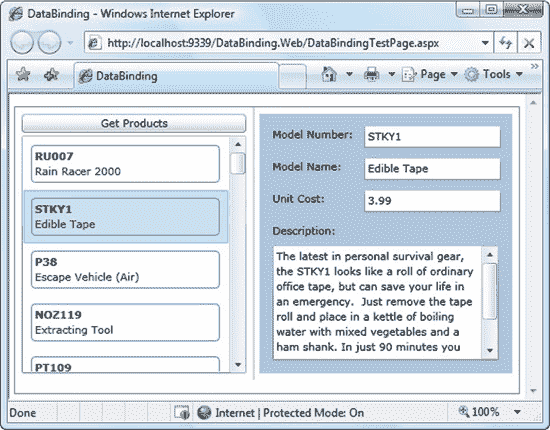

***图 20-14。**使用数据模板的列表*

#### 分离和重复使用模板

像样式一样，模板通常被声明为页面或应用资源，而不是在使用它们的列表中定义。这种分离通常更清晰，尤其是当您在同一个控件中使用长而复杂的模板或多个模板时(如下一节所述)。如果您希望在用户界面的不同位置以相同的方式显示数据，它还使您能够在多个列表或内容控件中重用模板。

要实现这一点，您需要做的就是在资源集合中定义您的数据模板，并给它一个键名。下面的示例提取了上一个示例中显示的模板:

`<UserControl.Resources>
  <DataTemplate x:Key="ProductDataTemplate">
    <Border Margin="5" BorderThickness="1" BorderBrush="SteelBlue"
     CornerRadius="4">
      <Grid Margin="3">
        <Grid.RowDefinitions>
          <RowDefinition></RowDefinition>
          <RowDefinition></RowDefinition>
        </Grid.RowDefinitions>
        <TextBlock FontWeight="Bold"
         Text="{Binding ModelNumber}"></TextBlock>
        <TextBlock Grid.Row="1"
         Text="{Binding ModelName}"></TextBlock>
      </Grid>
    </Border>
  </DataTemplate>
</UserControl.Resources>`

现在，您可以使用 StaticResource 引用来使用您的数据模板:

`<ListBox Name="lstProducts" HorizontalContentAlignment="Stretch"
 **ItemTemplate="{StaticResource ProductDataTemplate}"**
 SelectionChanged="lstProducts_SelectionChanged"></ListBox>`

 **注意**数据模板不需要数据绑定。换句话说，您不需要使用 ItemsSource 属性来填充模板列表。在前面的示例中，您可以自由地以声明方式(在您的 XAML 标记中)或以编程方式(通过调用 ListBox)添加产品对象。Items.Add()方法)。在这两种情况下，数据模板的工作方式是相同的。

#### 隐式数据模板

在前面的示例中，模板是使用列表控件的 ItemTemplate 属性显式设置的。但是，Silverlight 提供了另一个选项，叫做*隐式模板*。使用隐式模板，您可以为特定类型的数据定义一个数据模板，例如，您可以创建一个用于显示产品对象的数据模板。然后，列表控件会自动选择正确的数据模板。

通过对前面的例子进行简单的修改，您可以看到这种技术的实际应用。首先，从 ListBox 控件中移除 ItemTemplate 属性:

`<ListBox Name="lstProducts" HorizontalContentAlignment="Stretch" SelectionChanged="lstProducts_SelectionChanged"></ListBox>`

然后，您更改您的数据模板在资源集合中定义的方式。在这种情况下，您需要删除键名并添加 DataType 属性，如下所示:

`<UserControl.Resources>
  <DataTemplate **DataType****="local:Product"**>
    ...
  </DataTemplate>
</UserControl.Resources>`

当然，这里假设您已经定义了一个 XML 名称空间，将*本地*前缀映射到包含您的产品类的名称空间，如下所示:

`<UserControl xmlns:local="clr-namespace:DataBinding.DataService" ... >`

值得注意的是，这就是让隐式模板工作所需的全部内容。当您用产品对象填充列表时，ListBox 控件将意识到有合适的数据模板并自动使用它。

在这个例子中，隐式模板没有多少好处(或坏处)。但是这里有两种更特殊的方法可以使用它们:

*   *作为相同数据在不同地方的快捷方式*:如果您必须将相同的数据模板与不同的控件一起使用，那么将该模板作为应用资源定义一次可能会更容易。然后，所有绑定的控件将自动获取该模板。
*   *创建具有多个模板的列表*:如果您的数据源具有多种类型的对象，您可以为每种类型赋予不同的隐式模板。

第二个场景特别有趣。例如，假设您有一个 Product 对象列表，其中包含一些从 Product 派生的对象(比如 SalesProduct、ExportProduct 或 RestrictedProduct)。然后，您可以给每个类一个单独的隐式模板。您的绑定控件将为相应的类使用正确的模板，即使它们需要在同一列表中混合和匹配不同的模板。这省去了您编写一个试图处理所有事情的超级复杂的数据模板的麻烦。

#### 更高级的模板

数据模板可以非常自给自足。除了 TextBlock 和数据绑定表达式等基本元素，它们还可以使用更复杂的控件、附加事件处理程序、将数据转换为不同的表示形式、使用动画等等。

您可以在绑定表达式中使用值转换器将数据转换为更有用的表示形式。例如，考虑前面演示的 ImagePathConverter。它接受一个图片文件名，并用它来创建一个包含相应图像内容的 BitmapImage 对象。然后，这个 BitmapImage 对象可以直接绑定到图像元素。

您可以使用 ImagePathConverter 构建以下数据模板来显示每个产品的图像:

`<UserControl.Resources>
**  <local:ImagePathConverter x:Key="ImagePathConverter"></local:ImagePathConverter>**   <DataTemplate x:Key="ProductDataTemplate">
    <Border Margin="5" BorderThickness="1" BorderBrush="SteelBlue"
     CornerRadius="4">
      <Grid Margin="3">
        <Grid.RowDefinitions>
          <RowDefinition></RowDefinition>
          <RowDefinition></RowDefinition>
          <RowDefinition></RowDefinition>
        </Grid.RowDefinitions>
        <TextBlock FontWeight="Bold" Text="{Binding Path=ModelNumber}"></TextBlock>
        <TextBlock Grid.Row="1" Text="{Binding Path=ModelName}"></TextBlock>
**        <Image Grid.Row="2" Grid.RowSpan="2" Source=**
**"{Binding Path=ProductImagePath, Converter={StaticResource ImagePathConverter}}">**
        </Image>
      </Grid>
    </Border>
  </DataTemplate>
</UserControl.Resources>`

尽管这种标记不涉及任何新奇的东西，但结果是一个更有趣的列表(见[图 20-15](#fig_20_15) )。

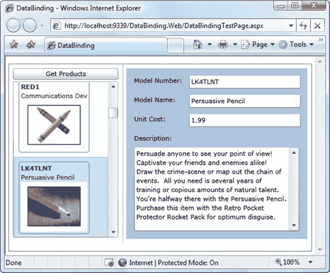

***图 20-15。**带有图像内容的列表*

 **注意**如果你的模板有错误，你不会收到异常。相反，控件无法显示您的数据并保持空白。要解决这个问题，您可以使用本章前面介绍的数据绑定调试功能。

#### 更改项目布局

数据模板让您能够出色地控制项目展示的各个方面。但是，它们不允许您更改项目相对于彼此的组织方式。无论你使用什么样的模板和样式，列表框都将每个项目放入一个单独的水平行，并堆叠每一行来创建列表。

您可以通过替换列表用来布局其子级的容器来更改这种布局。为此，可以用定义要使用的面板的 XAML 块来设置 ItemsPanel 属性。该面板可以是从 System 派生的任何类。Windows.Controls.Panel，包括一个自定义布局容器，用于实现您自己的专用布局逻辑。

下面使用 Silverlight 工具包(`[http://silverlight.codeplex.com](http://silverlight.codeplex.com)`)中的 WrapPanel，它在[第 3 章](03.html#ch3)中有描述。它在多行中从左到右排列项目:

`<ListBox Margin="7,3,7,10" Name="lstProducts"
 ItemTemplate="{StaticResource ProductDataTemplate}">
  <ListBox.ItemsPanel>
    <ItemsPanelTemplate>
      <controlsToolkit:WrapPanel></controlsToolkit:WrapPanel>
    </ItemsPanelTemplate>
  </ListBox.ItemsPanel>
</ListBox>`

[图 20-16](#fig_20_16) 显示了结果。

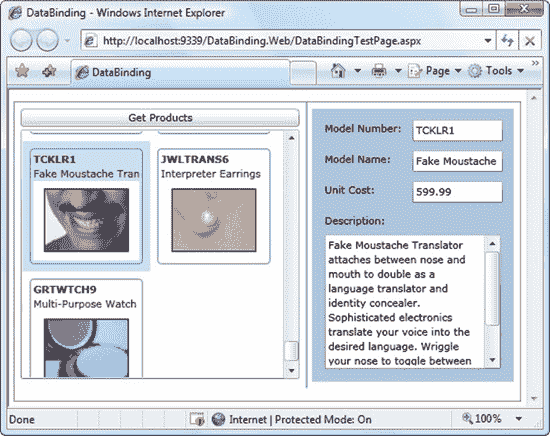

***图 20-16。**平铺列表*

### 最后一个字

本章对数据绑定进行了全面的分析。您了解了如何创建数据绑定表达式，从自定义对象中提取信息，使用更改通知和验证，绑定整个数据集合，以及从 web 服务中获取记录。您还探索了一系列可用于自定义数据显示的技术，从使用 IValueConverter 的数据转换和条件格式到数据模板和自定义布局。

在下一章中，您将在这些概念的基础上更深入地研究验证，并考虑丰富的数据控件，如 DataGrid、DataForm 和 TreeView。