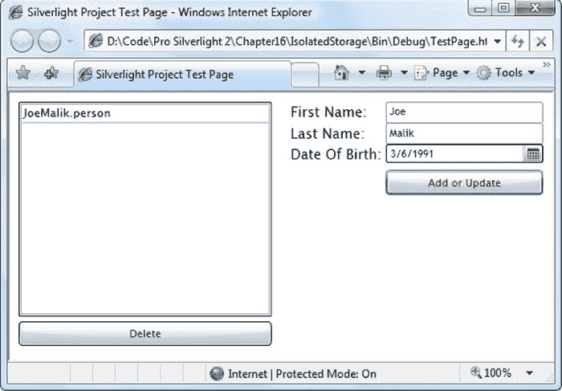
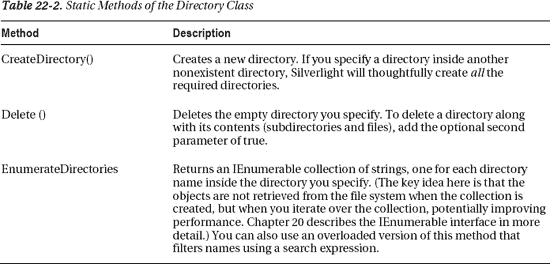

## 22

## 文件存取

Silverlight 包含了一组惊人的保存、读取和管理文件的功能。您需要理解的关键事实是，普通的 Silverlight 应用程序不允许写入(或读取)文件系统上的任意位置。相反，需要永久存储数据的 Silverlight 应用程序必须使用名为*隔离存储*的特性。

独立存储允许您访问一小部分硬盘空间，但有一定的限制。例如，您不知道文件的确切存储位置。您也不能读取其他 Silverlight 应用程序留下的文件或为其他用户录制的文件。从本质上说，独立存储为需要在本地计算机上存储永久信息的应用程序提供了严格限制的防篡改文件访问，这样用户下次运行应用程序时就可以检索到这些信息。

在最近的版本中，Silverlight 添加了三个后门，允许您在特定情况下绕过独立存储的规则:

> OpenFileDialog 和 SaveFileDialog :这些类允许你直接访问一个文件，只要用户在对话框中明确选择它。例如，如果用户在 OpenFileDialog 中选择了一个文件，那么您的应用程序就被授予了读取该文件内容的权限。如果用户在 SaveFileDialog 中选择了一个文件，你的应用程序将被允许写入该文件。但是，在这两种情况下，都不会向您提供该文件的具体信息(例如它在硬盘上的确切位置)，也不允许您访问同一位置的任何其他文件。
> 
> *拖放*:避开独立存储限制的第二种方法是使用 Silverlight 的拖放功能。同样，由用户来决定是否将文件显式地传递给代码——在本例中，是通过将文件拖到应用程序上并放到其中一个元素上。然后，您可以处理 Drop 事件并读取文件内容。
> 
> *提升信任度*:提升信任度应用程序是必须由用户明确安装的应用程序，并显示请求额外权限的安全提示。对于文件访问，高信任应用程序可以读写当前用户的文档集文件夹中的文件(有时称为“我的文档”)。

在本章中，您将学习如何在独立存储中创建文件以及读写数据。您将看到如何存储各种数据、应用程序设置和整个对象。您还将了解如何为您的应用程序请求更多的独立存储空间，以及如何在 web 服务的帮助下将文件上传到 web 服务器。最后，您将看到 Silverlight 的文件对话框类和拖放文件传输特性。

 **新功能** Silverlight 5 赋予高信任应用程序更多的文件访问能力。以前，它们仅限于当前用户的“文档”文件夹。但是现在，他们能够访问用户可以访问的任何文件，在硬盘上的任何地方。有关更多信息，请参见“以提升的信任级别访问文件”一节。此外，Silverlight 为 SaveFileDialog 添加了一个实用的改进——default filename 属性，您可以使用它为用户的保存操作提供建议的文件名。

### 隔离存储

独立存储提供了一个虚拟文件系统，使您可以将数据写入特定于用户和特定于应用程序的小空间。硬盘上的实际位置是模糊的(因此没有办法事先知道数据将被写入的确切位置)，默认的空间限制仅为 1 MB(尽管您可以请求用户授予您更多)。

本质上，独立存储相当于普通网页中的持久 cookies。它允许将少量信息存储在具有特定控制的专用位置，以防止恶意攻击(如试图填充硬盘或替换系统文件的代码)。

#### 隔离储存的范围

使用独立存储，可以为用户和应用程序的每个组合创建唯一的存储位置。换句话说，同一台计算机可以为同一个应用程序拥有多个独立的存储位置，假设每个位置都是为不同的用户使用的。同样，同一用户可以有多个独立的存储位置，每个 Silverlight 应用程序一个。独立存储不受浏览器的影响，因此 Windows 用户从 Internet Explorer 切换到 Firefox 时，将在两种浏览器中获得相同的独立存储位置。

 **注意**一个用户的独立存储中的数据对其他用户是受限的(除非他们是 Windows 管理员)。

赋予 Silverlight 应用程序身份的关键因素是 XAP 文件的 URL。这意味着:

*   同一 web 服务器上和同一文件夹中的不同 XAP 文件具有不同的独立存储。
*   如果您将网站托管在不同的域中，每个实例都有自己的独立存储。
*   如果您在相同的位置创建使用相同应用程序的不同测试页，它们将共享相同的独立存储。
*   如果您重命名 XAP 文件(或它所在的文件夹)，您将获得一个新的独立存储。
*   如果您更改 Silverlight 应用程序的 GUID、版本或其他程序集元数据，您会保留相同的独立存储。
*   如果用具有相同 XAP 文件名的另一个应用程序替换 Silverlight 应用程序，它将获取前一个应用程序的独立存储。

#### 隔离储存中放什么

独立存储是存储少量不重要信息的好方法。好的选择包括特定于用户的细节、用户偏好和关于最近用户动作的信息。独立存储也是很好的临时存储。例如，假设您创建了一个 Silverlight 应用程序，该应用程序允许用户填写一个多部分表单(超过几页),然后将其发送到一个 web 服务，并在那里永久存储。每当用户从表单的一部分移动到下一部分时，您可以将当前数据保存到独立存储中。然后，当用户完成操作并成功地将数据提交给 web 服务时，您可以删除它。这种常识性的方法可以防止用户在应用程序无法联系 web 服务(因为网络不工作)或用户意外重启应用程序(例如，通过单击浏览器的后退按钮)时丢失数据。您的应用程序可以在启动时检查临时数据，并为用户提供重新加载该数据的选项。

独立存储是持久的，与浏览器缓存不同，它永远不会过期，并且如果用户选择明确删除 Internet 临时文件，它也不会被删除。但是，独立存储对于重要文档来说并不是一个好的存储位置，因为它们从不备份，很容易被删除，甚至更容易丢失(例如，如果用户更改帐户或计算机)。此外，独立存储通常不是缓存资源(例如，外部位图和媒体文件)的好地方。这看起来很诱人，但是独立存储的目的是作为有限大小的数据存储位置，而不是手工制作的 HTTP 缓存的替代品。

### 使用隔离存储

独立存储易于使用，因为它公开了普通存储中使用的相同的基于流的模型。网络文件访问。您使用系统中的类型。IO.IsolatedStorage 命名空间，它是 Silverlight 运行时的核心部分。

#### 开一家独立商店

Silverlight 会自动创建独立存储。若要与独立存储区进行交互，可以使用 IsolatedStorageFile 类。通过调用静态 IsolatedStorageFile，可以获得当前用户和应用程序的 IsolatedStorageFile 对象。GetUserStoreForApplication()方法，如下所示:

`IsolatedStorageFile store =
  IsolatedStorageFile.GetUserStoreForApplication();`

通常，这正是您想要的:一个特定于应用程序、特定于用户的存储数据的位置。但是，IsolatedStorageFile 类还包含一个类似但略有不同的静态方法，名为 GetUserStoreForSite()。此方法提供了一个存储站点，同一网站域上的所有 Silverlight 应用程序都可以访问该站点。但是，这些设置仍然是特定于用户的。如果您正在一起开发一组 Silverlight 应用程序，并且希望所有应用程序共享一些个性化信息，您可以选择使用域范围的独立存储。

无论哪种方式，一旦打开了独立存储并拥有了一个活动的 IsolatedStorageFile 对象，就可以开始创建文件了。

#### 文件管理

IsolatedStorageFile 类名有些误导，因为它不代表单个文件。相反，它提供对独立存储区中文件集合的访问。IsolatedStorageFile 类提供的方法类似于文件管理方法，您可以在成熟的。NET 应用程序。表 22-1 列出了您可以使用的方法。

#### 写入和读取数据

使用[表 22-1](#tab_22_1) 中的方法，您可以创建文件并使用流来读写数据。当然，您不太可能直接处理 IsolatedStorageFileStream 类，除非您想一次一个字节地读写数据。相反，您将使用系统中功能更强的类之一。包装流的 IO 名称空间:

*   *StreamWriter 和 StreamReader* :如果你想以普通文本字符串的形式读写数据，可以使用这些类。您可以将数据分成几部分，并使用 StreamReader 逐行或在一个大块中检索它。ReadToEnd()。
*   *BinaryWriter 和 BinaryReader* :如果你想更严格地(更紧凑地)写数据，使用这些类。检索数据时，需要使用数据类型。(例如，您必须使用 BinaryReader。ReadInt32()方法从文件 BinaryReader 中检索 32 位整数。ReadString()来读取字符串，依此类推。)

下面的示例获取当前独立存储区，创建一个名为 date.txt 的新文件，并将当前日期作为一段文本写入该文件:

`// Write to isolated storage.
try
{
    using (IsolatedStorageFile store =
      IsolatedStorageFile.GetUserStoreForApplication())
    {
        using (IsolatedStorageFileStream stream = store.CreateFile("date.txt"))
        {
            StreamWriter writer = new StreamWriter(stream);
            writer.Write(DateTime.Now);
            writer.Close();
        }
        lblStatus.Text = "Data written to date.txt";
    }
}
catch (Exception err)
{
    lblStatus.Text = err.Message;
}`

检索信息也一样简单。您只需以读取模式打开 IsolatedStorageFileStream 对象:

`// Read from isolated storage.
try
{
    using (IsolatedStorageFile store =
      IsolatedStorageFile.GetUserStoreForApplication())
    {
        using (IsolatedStorageFileStream stream = store.OpenFile("date.txt",
          FileMode.Open))
        {
            StreamReader reader = new StreamReader(stream);
            lblData.Text = reader.ReadLine();
            reader.Close();
        }
    }
}
catch (Exception err)
{
    // An exception will occur if you attempt to open a file that doesn't exist.
    lblStatus.Text = err.Message;
}`

在此示例中，在 Windows Vista 或 Windows 7 计算机上，您将在以下形式的路径中找到 date.txt 文件:

`C:\Users\[*UserName*]\AppData\LocalLow\Microsoft\Silverlight\is\[*Unique_Identifier*]`

几个自动生成的文件夹名被附加在这个路径的末尾。以下是 Silverlight 可用于独立存储的动态创建路径的示例:

`C:\Users\matthew\AppData\LocalLow\Microsoft\Silverlight\is\sid3dsxe.u1y\lstesiyg.ezx
\s\atkj2fb5vjnabwjsx2nfj3htrsq1ku1h\f\date.txt`

如果您有兴趣，可以使用 Visual Studio 调试器获取当前独立存储区的路径。为此，在中断模式下将鼠标悬停在 IsolatedStorageFile 对象上，并查找非公共 RootDirectory 属性，如图 22-1 所示。

***图 22-1。*** *寻找隔离储存地点*

幸运的是，您不需要担心用于独立存储的目录结构。您可以使用 IsolatedStorageFile 的方法(如 GetFileNames()和 OpenFile())检查文件并从独立存储中进行检索。

 **注意**值得注意的是，Silverlight 不会混淆独立存储中的文件名。这意味着如果用户知道文件名，用户可以执行文件搜索来找到该文件。

#### 请求更多空间

最初，每个 Silverlight 应用程序在其独立存储中获得 1 MB 的空间。您可以检查 IsolatedStorageFile。AvailableFreeSpace 属性来确定剩余的可用空间。

 **注意**初始 1 MB 限额有一个例外。如果应用程序被安装为浏览器外应用程序(参见第 21 章中的[，其配额将自动增加至 25 MB。无论您是在独立窗口中启动应用程序还是通过浏览器运行应用程序，这一增加的配额都适用，无论哪种方式，应用程序都使用相同的独立存储。](21.html#ch21)

如果应用程序需要更多空间，可以使用一个选项:IsolatedStorageFile increase quotato()方法。当您调用这个方法时，您请求您想要的字节数。然后 Silverlight 显示一个消息框，显示应用程序在独立存储中使用的当前字节数(*不是*当前配额限制)和新请求的空间量。该对话框还显示 Silverlight 应用程序的 URL(或者 file://如果您在本地运行它)。

[图 22-2](#fig_22_2) 显示了一个例子，其中应用程序当前没有文件存储在独立存储中，并试图将限制增加到 1 MB。如果用户单击 Yes 接受请求，配额将增加，并且 IncreaseQuotaTo()方法返回 true。如果用户单击 No，请求将被拒绝，IncreaseQuotaTo()将返回 false。

***图 22-2。**要求增加孤立店额度*

有两个因素限制了如何使用 IncreaseQuotaTo():

*   您必须在对用户操作(例如，单击按钮)做出反应的事件处理程序中使用它。如果您试图在其他地方使用它——比如，当页面加载时——该调用将被忽略。这是一项安全措施，旨在防止用户在确认对话框突然抢走焦点的情况下无意中接受较大的配额。
*   您必须请求一个高于当前配额的值。否则，您会收到一个异常。这意味着您不能使用 IncreaseQuotaTo()方法来确保有一定水平的可用空间，而是需要明确地检查您是否有所需的空间量。

您可以通过检查 IsolatedStorageFile 来确定当前配额大小。配额属性。您可以使用 IsolatedStorageFile 找到独立存储区中剩余的空间量。AvailableFreeSpace 属性。(因此，您可以通过计算 IsolatedStorageFile 来计算您在独立存储中使用的空间量。配额–isolatedstoragefile . availablefreespace。)

下面是 IncreaseQuotaTo()方法的一个实例:

`using (IsolatedStorageFile store = IsolatedStorageFile.GetUserStoreForApplication())
{
    // In an application that writes 1000 KB files, you need to ask for an increase
    // if there is less than 1000 KB free.
    if (store.AvailableFreeSpace < 1000*1024)
    {
        if (store.IncreaseQuotaTo(
          store.Quota + 1000*1024 - store.AvailableFreeSpace))
        {
            // The request succeeded.
        }
        else
        {
            // The request failed.
            lblError.Text = "Not enough room to save temporary file.";
            return;
        }
    }

    // (Write the big file here.)
}`

前面的示例使用计算来请求精确的空间量。这种方法的潜在问题是，每当您需要更多的空间时，您都需要向用户提出新的请求。为了避免这些不断的要求，合理的做法是要求一个超出你直接需求的空间。

有一种简单的方法可以找出为您使用过的每个 Silverlight 应用程序分配了多少隔离空间存储。为此，您必须首先浏览到包含 Silverlight 内容的页面。右键单击 Silverlight 内容区域，然后选择 Silverlight。将出现一个选项卡式对话框，显示有关 Silverlight 当前版本的信息，允许您控制是否自动安装更新，并允许您启用或禁用使用数字版权管理(DRM)授权的媒体内容。

要查看各种应用程序的独立存储配额，请单击应用程序存储选项卡。在那里，你会看到当前用户运行过的所有使用独立存储的 Silverlight 应用程序的列表(见[图 22-3](#fig_22_3) )。每个应用程序旁边都有关于其最大空间配额和当前已用空间量的信息。

***图 22-3。*** *审核不同应用的孤立商店*

“应用程序存储”选项卡为您提供了移除独立存储的唯一方法。只需选择应用程序，然后单击删除。这样做时，会发生两件事:该应用程序的独立存储中的所有文件都被删除，配额被重置为标准的 1 MB。

 **注意**如果不删除应用程序独立存储的当前内容，就无法降低应用程序的独立存储配额。您也可以使用 IsolatedStorageFile 以编程方式完成此操作。移除()方法。

#### 用 XmlSerializer 存储对象

正如您已经看到的，您可以使用在. NET 应用程序中用于普通文件访问的相同类(如 StreamWriter 和 BinaryWriter)写入独立存储中的文件。要读取它们，可以使用相应的 StreamReader 和 BinaryReader 类。尽管这种方法可以让您最直接地控制文件，但它不是唯一的选择。

XmlSerializer 类提供了一种更高级的替代方法，允许您序列化和反序列化对象，而不是写入和读取单独的数据。XmlSerializer 的工作原理是将一个活动对象转换成一个字节流，您可以将它推送到任何流中。XmlSerializer 还可以执行相反的技巧，将字节流转换为对象实例。若要使用 XmlSerializer，需要添加对 System.Xml.Serialization.dll 程序集的引用，该程序集将包含在已编译应用程序的 XAP 文件中。

XmlSerializer 不能处理每个类。它有两个不可协商的要求:

*   要序列化的类必须有一个公共的无参数构造函数。这是 XmlSerializer 在反序列化新实例时使用的构造函数。
*   要序列化的类必须由公共可设置属性组成。XmlSerializer 在序列化对象时读取这些属性(使用反射)，并在还原对象时设置它们(再次使用反射)。私有数据被忽略，您在属性过程中放置的任何验证逻辑(例如，要求在设置一个属性之前设置另一个属性)都可能会导致问题。

如果您能忍受这些限制，那么 XmlSerializer 的优势在于它为您提供了一种干净、简洁的方式来存储整个对象的信息。

理想情况下，使用 XmlSerializer 存储信息的类将是简单的数据包，很少或没有内置功能。下面是一个简单的 Person 类，它将在下一个例子中被序列化:

`public class Person
{
    public string FirstName { get; set; }
    public string LastName { get; set; }
    public DateTime? DateOfBirth { get; set; }

    public Person(string firstName, string lastName, DateTime? dateOfBirth)
    {
        FirstName = firstName;
        LastName = lastName;
        DateOfBirth = dateOfBirth;
    }
    public Person() { }
}`

图 22-4 显示了一个使用 XmlSerializer 和 Person 类的测试页面。它让用户指定组成 Person 对象的三条信息，然后将这些数据存储在独立的存储中。个人档案使用名、姓和扩展名*命名。person* ，如 JoeMalik.person .页面左侧的列表显示了所有。person 文件存储在独立存储中，并允许用户选择一个来查看或更新其数据。

***图 22-4。*** *储存人物*

构建这个例子很容易。首先，您需要一个 XmlSerializer 实例，该实例被定制为使用 Person 类，并且可用于您的所有事件处理代码:

`private XmlSerializer serializer = new XmlSerializer(typeof(Person));`

当用户单击“添加”按钮时，两个文本框和 DatePicker 控件中的当前信息用于生成 Person 对象，并且该 Person 对象被序列化到独立存储中:

`private void cmdAdd_Click(object sender, RoutedEventArgs e)
{
    Person person = new Person(txtFirstName.Text, txtLastName.Text,
      dpDateOfBirth.SelectedDate);

    using (IsolatedStorageFile store =
      IsolatedStorageFile.GetUserStoreForApplication())
    {
        // The CreateFile() method creates a new file or overwrites an existing one.
        using (FileStream stream = store.CreateFile(
          person.FirstName + person.LastName + ".person"))
        {
            // Store the person details in the file.
            serializer.Serialize(stream, person);
        }

        // Update the list.
        lstPeople.ItemsSource = store.GetFileNames("*.person");
    }
}`

当用户单击列表中的一个个人文件时，将从独立存储中检索数据:

`private void lstPeople_SelectionChanged(object sender, SelectionChangedEventArgs e)
{
    if (lstPeople.SelectedItem == null) return;

    using (IsolatedStorageFile store =
      IsolatedStorageFile.GetUserStoreForApplication())
    {
        using (FileStream stream = store.OpenFile(
          lstPeople.SelectedItem.ToString(), FileMode.Open))
        {
            Person person = (Person)serializer.Deserialize(stream);
            txtFirstName.Text = person.FirstName;
            txtLastName.Text = person.LastName;
            dpDateOfBirth.SelectedDate = person.DateOfBirth;
        }
    }
}`

最后，如果用户单击删除按钮，所选的个人文件将从独立存储中删除:

`private void Delete_Click(object sender, RoutedEventArgs e)
{
    if (lstPeople.SelectedItem == null) return;

    using (IsolatedStorageFile store =
      IsolatedStorageFile.GetUserStoreForApplication())
    {
        store.DeleteFile(lstPeople.SelectedItem.ToString());
        lstPeople.ItemsSource = store.GetFileNames("*.person");
    }
}`

#### 存储应用程序设置

独立存储的一个常见模式是在应用程序启动时(或根据需要)加载它，然后在应用程序结束时自动保存它。退出事件触发。Silverlight 有一个更高级别的类，允许您实现该模式来存储各种信息(通常是应用程序设置)。此类是 IsolatedStorageSettings。

IsolatedStorageSettings 类提供了两个静态属性，这两个属性都包含要存储的信息集合。最常用的集合是 IsolatedStorageSettings。ApplicationSettings，这是一个名称-值集合，可以包含您喜欢的任何项。在后台，ApplicationSettings 类使用 XmlSerializer 来存储您添加的信息。

要添加一个项目，您需要为它分配一个新的字符串键名。下面是一个在关键字名称 LastRunDate 下存储日期的示例:

`IsolatedStorageSettings.ApplicationSettings["LastRunDate"] = DateTime.Now;`

下面是一个在关键字名称 CurrentUser 下存储 Person 对象的示例:

`IsolatedStorageSettings.ApplicationSettings["CurrentUser"] = new Person(...);`

虽然您需要将对象转换为正确的类型，但是检索它也同样容易:

`DateTime date = (DateTime)
  IsolatedStorageSettings.ApplicationSettings["LastRunDate"];
Person person = (Person)IsolatedStorageSettings.ApplicationSettings["CurrentUser"];`

还可以使用 Contains()方法检查 ApplicationSettings 集合中是否存在某个键，并可以使用 Remove()方法删除现有的信息。

当 Silverlight 应用程序关闭时(例如，当用户导航到新页面时)，ApplicationSettings 类会自动存储它包含的所有信息。因此，下次用户运行应用程序时，该信息将出现在 ApplicationSettings 集合中。IsolatedStorageSettings 类还提供了一个 SiteSettings 集合，其工作方式也大致相同，它是一个非类型化的集合，可以保存任何类型的可序列化数据，但其作用域是当前的网站域。这意味着在该域上运行的任何 Silverlight 应用程序都可以访问这些设置。

ApplicationSettings 集合和 SiteSettings 集合实际上只是简化您已经可以直接使用独立存储完成的工作的细微之处。然而，它们是存储少量配置信息的方便场所，无需为您的应用程序构建更复杂的数据模型。

### 访问独立存储之外的文件

如您所见，Silverlight 应用程序不允许浏览文件系统。但是您可以使用几个后门来读写单个文件——前提是用户先选择它们。这些后门是 OpenFileDialog 和 SaveFileDialog 类以及拖放功能。

OpenFileDialog 和 SaveFileDialog 类允许您显示标准的打开和保存对话框，以响应用户发起的操作(如单击按钮)。然后，用户在对话框中选择一个文件，该文件将作为流返回到您的代码中。如果你显示打开对话框，你会得到一个只读的流来访问文件。如果您显示“保存”对话框，您将获得一个可写流。无论哪种方式，OpenFileDialog 和 SaveFileDialog 类都可以让您访问单个特定文件，同时隔离其他所有文件。

 **注意**出于安全原因，Silverlight 不支持全屏模式下的 OpenFileDialog 和 SaveFileDialog 类。尽管 Silverlight 的标准行为是在显示任何一种模式时立即切换出全屏模式，但您的代码最好显式设置 Application。current . host . content . is full screen 设置为 false，以避免在不同的浏览器和操作系统上出现任何可能的问题。

Silverlight 的拖放功能类似于 OpenFileDialog。它允许您的应用程序以只读模式访问一个或多个文件，前提是用户显式地将这些文件拖到您的应用程序中的一个元素上。拖放功能的优点是文件选择需要较少的用户步骤。如果用户需要一次选择大量文件，这非常方便。

在接下来的几节中，你将学习如何使用所有这些方法。您还将考虑一个将用户选择的文件上传到 web 服务的实际应用程序。

#### 使用 OpenFileDialog 读取文件

OpenFileDialog 允许你显示普通的打开文件对话框。当用户选择一个文件后，你的应用程序只能读取它。OpenFileDialog 没有任何限制，所以用户可以选择任何文件。然而，如果用户不明确选择文件并点击打开，你就无法访问任何文件，这被认为是足够高的安全标准。

要使用 OpenFileDialog，首先创建一个新实例，然后设置 Filter 和 FilterIndex 属性来配置用户可以看到的文件类型。Filter 属性决定文件类型列表中显示的内容。

您需要指出应该出现在文件类型列表中的文本，以及 OpenFileDialog 将用来过滤文件的相应表达式。例如，如果要允许用户打开文本文件，可以显示文本" Text Files (*。txt)"并使用过滤器表达式*。txt 来查找所有带有。txt 扩展名。下面是设置过滤器属性的方法:

`OpenFileDialog dialog = new OpenFileDialog();
dialog.Filter = "Text Files (*.txt)|*.txt";`

使用竖线(|)字符将显示文本与筛选字符串中的筛选表达式分隔开。如果有多种文件类型，请将它们一个接一个地串起来，用附加的管道字符分隔。例如，如果您想让用户看到不同类型的图像，您可以编写如下过滤器字符串:

`dialog.Filter = "Bitmaps (*.bmp)|*.bmp|JPEGs (*.jpg)|*.jpg|All files (*.*)|*.*";`

您也可以创建匹配多种文件类型的筛选表达式，用分号分隔:

`dialog.Filter = "Image Files (*.bmp;*.jpg;*.gif)|*.bmp;*.jpg;*.gif";`

配置完 OpenFileDialog 后，您可以通过调用 ShowDialog()来显示对话框。ShowDialog()方法返回 DialogResult 值，该值指示用户选择的内容。如果结果为真，则用户选择了一个文件，您可以继续操作并打开它:

`if (dialog.ShowDialog() == true)
{ ... }`

该文件通过 OpenFileDialog 公开。File 属性，它是一个 FileInfo 对象。FileInfo 是一个相对简单的类，它公开了一小组有用的成员，包括返回文件名的 Name 属性、以只读模式返回 FileStream 对象的 OpenRead()方法以及创建 FileStream 并为其返回 StreamReader 的 OpenText()方法:

`if (dialog.ShowDialog() == true)
{
    using (StreamReader reader = dlg.File.OpenText())
    {
        string data = reader.ReadToEnd();
    }
}`

显然，如果您正在处理文本数据，OpenText()方法是一个很好的快捷方式，如果您需要创建一个二进制 Reader 或使用 FileStream，OpenRead()是一个更好的选择。Read()方法直接拉出一个字节块。

 **提示**openfile dialog 也支持多选。设置 OpenFileDialog。在调用 ShowDialog()之前，请选择 true。然后，通过 OpenFileDialog 检索所有选中的文件。文件属性。

使用 OpenFileDialog 的一个有趣的方法是将选定的文件从本地硬盘复制到独立存储，以便应用程序可以在以后操作它。下面是一个执行此技巧的示例:

`OpenFileDialog dialog = new OpenFileDialog();
dialog.Filter = "All files (*.*)|*.*";
dialog.Multiselect = true;

// Show the dialog box.
if (dialog.ShowDialog() == true)
{
    // Copy all the selected files to isolated storage.
    using (IsolatedStorageFile store =
      IsolatedStorageFile.GetUserStoreForApplication())
    {
        foreach (FileInfo file in dialog.Files)
        {
            using (Stream fileStream = file.OpenRead())
            {
                // Check for free space.
                if (fileStream.Length > store.AvailableFreeSpace)
                {
                    // (Cancel the operation or use IncreaseQuotaTo().)
                }
                using (IsolatedStorageFileStream storeStream =
                    store.CreateFile(file.Name))
                {
                    // Write 1 KB block at a time.
                    byte[] buffer = new byte[1024];
                    int count = 0;
                    do
                    {
                        count = fileStream.Read(buffer, 0, buffer.Length);
                        if (count > 0) storeStream.Write(buffer, 0, count);
                    } while (count > 0);
                }
             }
        }
    }
}`

#### 用 SaveFileDialog 写文件

当你掌握了 OpenFileDialog 之后，SaveFileDialog 类将变得简单明了。像 OpenFileDialog 一样，它允许用户搜索硬盘并选择一个暴露给你的应用程序的文件。您无法检索有关此文件所在位置或同一文件夹中存在哪些其他文件的任何详细信息。相反，SaveFileDialog 为您提供了一个可以写入数据的流。

要使用 SaveFileDialog 类，首先要创建一个实例并设置文件类型过滤器。然后，显示对话框(使用熟悉的 ShowDialog()方法)，并获取所选文件的流(使用 OpenFile()方法)。下面是一个简单的代码例程，它通过将文本框中的文本复制到用户指定的文件中来演示这些步骤:

`SaveFileDialog saveDialog = new SaveFileDialog();
saveDialog.Filter = "Text Files (*.txt)|*.txt";

if (saveDialog.ShowDialog() == true)
{
    using (Stream stream = saveDialog.OpenFile())
    {
        using (StreamWriter writer = new StreamWriter(stream))
        {
            writer.Write(txtData.Text);
        }
    }
}`

还可以使用 DefaultExt 属性设置默认文件扩展名，使用 DefaultFileName 属性设置推荐的文件名。当然，在实际保存文件之前，用户可以自由地更改名称。

`saveDialog.DefaultExt = "txt";
saveDialog.DefaultFileName = "NewDocument1.txt";`

SaveFileDialog 将默认扩展名添加到用户键入的文件名中，除非该文件名已经包含相同的扩展名。如果用户包含不同的扩展名(例如，DefaultExt 是 txt，用户输入 myfile.test)，默认扩展名仍会添加到末尾(例如，使文件成为 myfile.test.txt)。

如果用户选择了一个已经存在的文件，则会出现一条确认消息，询问用户是否要覆盖现有文件。当用户从显示的列表中选择一个现有文件时，或者如果用户键入的文件名加上默认扩展名与一个现有文件匹配时，就会发生这种情况。无论哪种方式，用户都必须确认操作以关闭对话框并继续。

最后，在 ShowDialog()返回后，您可以从 SafeFileName 属性中检索用户选择的文件名，而不需要任何文件夹或路径信息。

#### 通过网络服务传输文件

通过结合使用 OpenFileDialog 和 SaveFileDialog，可以构建一个将服务器内容复制到本地计算机或将本地文件上传到 web 服务器上的某个位置的应用程序。事实上，构建这样的应用程序很容易——您所需要的只是一个管理文件的后端 web 服务。

图 22-5 显示了一个简单的例子来说明这个概念。当这个应用程序第一次启动时，它向服务器请求可用文件的列表。然后，用户可以选择上传新文件或下载现有文件。在一个更复杂的例子中，web 服务器可能需要某种形式的身份验证，并允许每个用户访问不同的文件集合。

***图 22-5。*** *一个基于 Silverlight 的文件上传器*

您可以使用本章的可下载代码来尝试这个完整的示例。在接下来的部分中，您将浏览所有的基本代码。

##### 文件服务

这个示例的主干是一组服务器端方法，这些方法允许 Silverlight 应用程序做三件事:检索文件列表、下载现有文件和上传新文件。在本例中，一个名为 FileService 的服务负责所有三项任务。

FileService 提供对预定义位置的文件的访问。在这种情况下，文件存储在服务器上名为 files 的子文件夹中。下面是 web 服务代码的基本概要:

`[ServiceContract(Namespace = "")]
[AspNetCompatibilityRequirements(RequirementsMode = AspNetCompatibilityRequirementsMode.Allowed)]
public class FileService
{
    private string filePath;

    public FileService()
    {
        filePath = HttpContext.Current.Server.MapPath("Files");
    }
    [OperationContract]
    public string[] GetFileList()
    {
        ...
    }
    [OperationContract]
    public void UploadFile(string fileName, byte[] data)
    {
        ...
    }
    [OperationContract]
    public byte[] DownloadFile(string fileName)
    {
        ...
    }
}`

在处理文件名时，服务器代码会非常小心地删除路径信息，这样就不会将敏感的细节传递回客户端。您可以在 GetFileList()方法中看到这一点，该方法使用系统。IO.Path 类从每个文件名中提取路径信息:

`[OperationContract]
public string[] GetFileList()
{
    // Scan the folder for files.
    string[] files = Directory.GetFiles(filePath);

    // Trim out path information.
    for (int i = 0; i < files.Count(); i++)
    {
        files[i] = Path.GetFileName(files[i]);
    }

    // Return the file list.
    return files;
}`

DownloadFile()方法需要采取类似的措施，但原因不同。它确保从调用者提供的文件名中去掉任何路径信息。这可以防止恶意调用方传入相对路径，如../../../Windows/System/somefile.dll，否则可能会欺骗应用程序返回敏感文件。

一旦 DownloadFile()代码安全地过滤掉文件名，它就打开文件，将其内容复制到一个字节数组中，并返回数据:

`[OperationContract]
public byte[] DownloadFile(string fileName)
{
    // Make sure the filename has no path information.
    string file = Path.Combine(filePath, Path.GetFileName(fileName));

    // Open the file, copy its raw data into a byte array, and return that.
    using (FileStream fs = new FileStream(file, FileMode.Open))
    {
        byte[] data = new byte[fs.Length];
        fs.Read(data, 0, (int)fs.Length);
        return data;
    }
}`

 **注意**DownloadFile()中使用的文件传输技术需要将文件的内容加载到内存中。因此，这种方法不适合非常大的文件，在尝试创建字节数组之前添加检查文件长度的保护措施是一个好主意。当处理较大的文件时，您可能希望向客户端传递一个 URI，让客户端从该 URI 下载文件。为了保持文件的私密性，您可以使用系统随机生成的文件名，该文件名包含一个全局唯一标识符(GUID)。Guid 类。

最后，web 服务允许用户提交一个数据块，该数据块将被盲目地写入 Files 文件夹。用户可以选择文件名，同样，在创建文件之前，任何路径信息都会被删除。

`[OperationContract]
public void UploadFile(string fileName, byte[] data)
{
    // Make sure the filename has no path information.
    string file = Path.Combine(filePath, Path.GetFileName(fileName));

    using (FileStream fs = new FileStream(file, FileMode.Create))
    {
        fs.Write(data, 0, (int)data.Length);
    }
}`

您可能认为 UploadFile()方法是检查 byte[]数组大小的逻辑位置，这样恶意用户就不能传递会消耗硬盘的非常大的文件。然而，WCF 已经通过限制它接受的最大消息大小和该消息中传输数组的最大大小来限制这种能力。这些限制旨在阻止*拒绝服务攻击*,使攻击者无法用大量或复杂的耗时处理的消息来束缚服务器。

如果您确实想要构建一个接受大量数据的 web 服务，那么您需要对 web 服务器上的 web.config 文件和 ServiceReferences 进行一些调整。客户端中的 ClientConfig。虽然这些配置更改超出了本书的范围，但是您可以在`[http://tinyurl.com/nc8xkn](http://tinyurl.com/nc8xkn)`获得完整的细节。您还可以看到他们正在使用本章的可下载代码，该代码被配置为允许大文件上传和下载。

##### Silverlight 客户端

客户端的代码相当简单。所有 web 服务调用都通过一个 FileServiceClient 实例，该实例存储为 page 类中的一个字段。当页面第一次加载时，代码会附加它将用于各种已完成事件的所有事件处理程序，然后调用 GetFileListAsync()方法来获取列表框的文件列表。

`private FileServiceClient client = new FileServiceClient();

private void Page_Loaded(object sender, RoutedEventArgs e)
{
    // Attach these event handlers for uploads and downloads.
    client.DownloadFileCompleted += client_DownloadFileCompleted;
    client.UploadFileCompleted += client_UploadFileCompleted;

    // Get the initial file list.
    client.GetFileListCompleted += client_GetFileListCompleted;
    client.GetFileListAsync();
}
private void client_GetFileListCompleted(object sender,
  GetFileListCompletedEventArgs e)
{
    try
    {
        lstFiles.ItemsSource = e.Result;
    }
    catch
    {
        lblStatus.Text = "Error contacting web service.";
    }
}`

当用户选择一个文件并单击 Download 按钮时，应用程序显示 SaveFileDialog，以便用户可以选择下载位置。当 DownloadFileCompleted 事件发生后，不能显示 SaveFileDialog，因为该事件不是用户发起的。(如果尝试，您将会收到一个 SecurityException。)

然而，即使代码以显示 SaveFileDialog 开始，它也不会尝试立即打开 FileStream。这样做将在下载过程中保持文件打开。相反，代码将 SaveFileDialog 对象作为状态对象传递给 DownloadFileCompleted 事件，使用所有 web 服务方法都提供的可选的第二个参数。

`private void cmdDownload_Click(object sender, RoutedEventArgs e)
{
    if (lstFiles.SelectedIndex != -1)
    {
        SaveFileDialog saveDialog = new SaveFileDialog();
        if (saveDialog.ShowDialog() == true)
        {
            client.DownloadFileAsync(lstFiles.SelectedItem.ToString(),` saveDialog`);
            lblStatus.Text = "Download started.";
        }
    }
}`

DownloadFileCompleted 事件检索 SaveFileDialog 对象，并使用它来创建 FileStream。然后，它将字节数组中的数据复制到这个文件中。

`private void client_DownloadFileCompleted(object sender,
  DownloadFileCompletedEventArgs e)
{
    if (e.Error == null)
    {
        lblStatus.Text = "Download completed.";

        // Get the SaveFileDialog that was passed in with the call.
        SaveFileDialog saveDialog = (SaveFileDialog)e.UserState;

        using (Stream stream = saveDialog.OpenFile())
        {
            stream.Write(e.Result, 0, e.Result.Length);
        }
        lblStatus.Text = "File saved to " + saveDialog.SafeFileName;
    }
    else
    {
        lblStatus.Text = "Download failed.";
    }
}`

这种方法的一个好的副作用是，这段代码允许用户同时开始多个下载。每一个都有自己的 SaveFileDialog 对象，所以当下载完成时，每一个都可以保存到适当的文件中。

上传代码类似，但是它显示 OpenFileDialog 并在用户选择文件时从文件中检索数据。数据放在一个字节数组中，并传递给 UploadFileAsync()方法。Silverlight 客户端用来完成此任务的代码与 web 服务用来在 DownloadFile()方法中打开文件的代码几乎相同。

`private void cmdUpload_Click(object sender, RoutedEventArgs e)
{
    OpenFileDialog openDialog = new OpenFileDialog();

    if (openDialog.ShowDialog() == true)
    {
        try
        {
            using (Stream stream = openDialog.File.OpenRead())
            {
                // Don't allow really big files (more than 5 MB).
                if (stream.Length < 5120000)
                {
                    byte[] data = new byte[stream.Length];
                    stream.Read(data, 0, (int)stream.Length);

                    client.UploadFileAsync(openDialog.File.Name, data);
                    lblStatus.Text = "Upload started.";
                }
                else
                {
                    lblStatus.Text = "Files must be less than 5 MB.";
                }
            }
        }
        catch
        {
            lblStatus.Text = "Error reading file.";
        }
    }
}

private void client_UploadFileCompleted(object sender,
  System.ComponentModel.AsyncCompletedEventArgs e)
{
    if (e.Error == null)
    {
        lblStatus.Text = "Upload succeeded.";

        // Refresh the file list.
        client.GetFileListAsync();
    }
    else
    {
        lblStatus.Text = "Upload failed.";
    }
}`

这样就完成了这个示例，并为您提供了一个功能完整的客户端，它可以在 web 服务器之间传输内容。

#### 拖放文件

OpenFileDialog 类为 Silverlight 应用程序访问不在独立存储中的文件提供了最实用的方法。然而，Silverlight 提供了另一种方法。如果选择一个或多个文件(例如，在 Windows 资源管理器中或桌面上)，将这些文件拖到 Silverlight 应用程序上，然后将它们放到元素上，则应用程序可以读取这些文件。基于网络的上传工具(例如，SharePoint 和微软的 SkyDrive 服务)通常包含这种功能，使得一次性上传整批文件更加容易。

图 22-6 显示了一个使用这个特性的 Silverlight 应用程序。首先，用户拖动一个或多个图像文件，放在大的阴影矩形上。然后，应用程序从所有文件中读取图像数据，并在右侧列表中为每个文件添加一个缩略图。

***图 22-6。*** 拖拽图像文件

 **注**拖放的最实际应用通常涉及到将内容上传到网络服务器。例如，您可以使用 Silverlight 拖放功能和文件上传 web 服务的组合，轻松复制 SharePoint 或 SkyDrive 中的多文档上传功能(就像前面“使用 Web 服务传输文件”一节中描述的那样))

**苹果电脑上的拖放功能**

拖放功能可以在 Windows 电脑上无缝运行，但不能在 Mac 电脑上运行。问题是 Mac 网络浏览器，如 Safari，有一个稍微不同的插件模型。关键的区别在于，它们不为 web 页面中托管的插件提供 HTML DOM 事件。因此，当您将文件拖放到 Mac 上的 Silverlight 内容区域时，网页会收到事件，但 Silverlight 应用程序不会。

目前，有一种 Mac 变通方法可以解决 Safari web 浏览器上的这个问题，但不能解决 Firefox 上的问题。它包括向宿主网页添加一小部分 JavaScript，然后手动将拖放事件转发给 Silverlight 应用程序。有关全部细节，请参考`[http://msdn.microsoft.com/library/ee670998.aspx](http://msdn.microsoft.com/library/ee670998.aspx)`处的文档。不幸的是，在撰写本文时，运行 Firefox 的 Mac 用户将无法将文件拖到 Silverlight 应用程序上，即使使用了变通方法。

构建如图 22-6 所示的应用程序相当容易。第一步是添加将接收丢弃数据的元素。通常，这显示为一个大的矩形区域，因此使用边框或简单的矩形是有意义的(尽管任何元素都支持拖放功能)。然后，必须将 AllowDrop 属性设置为 true，如下所示:

`<Rectangle x:Name="rectDropSurface" Margin="5" Fill="LightSteelBlue"
 Stroke="SteelBlue" StrokeThickness="1" AllowDrop="True"
</Rectangle>`

现在你只需要处理正确的事件。或者，您可以响应 DragEnter、DragLeave 和 DragOver 事件，在拖动过程中提供某种状态信息。更重要的是，您必须处理 Drop 事件来接收丢弃的数据:

`<Rectangle x:Name="rectDropSurface" Margin="5" Fill="LightSteelBlue"
 Stroke="SteelBlue" StrokeThickness="1" AllowDrop="True"
 DragEnter="rectDropSurface_DragEnter" DragLeave="rectDropSurface_DragLeave"
 Drop="rectDropSurface_Drop">
</Rectangle>`

在[图 22-6](#fig_22_6) 所示的例子中，DragEnter 和 DragLeave 事件处理程序只是更新显示中的一个标签:

`private void rectDropSurface_DragEnter(object sender, DragEventArgs e)
{
    lblResults.Text = "You are dragging an object over the drop area.";
}

private void rectDropSurface_DragLeave(object sender, DragEventArgs e)
{
    lblResults.Text = "";
}`

掉落事件更有趣。它使用 DrageEventArgs 检查哪些数据被丢弃了。GetDataPresent()方法。调用此方法时，需要使用 DataFormats 枚举中的值指定要读取的数据类型。目前，Silverlight 只支持一个值:DataFormats.FileDrop。这意味着不能将 Microsoft Word 中的文本选择或 Microsoft Excel 中的图表对象拖放到 Silverlight 应用程序中。然而，显式测试数据类型仍然被认为是一种好的形式，因为 Silverlight 的未来版本可能会添加对其他数据类型的支持。

`private void rectDropSurface_Drop(object sender, DragEventArgs e)
{
    // Check if data is present and in the correct format.
    if ((e.Data != null) &&
        (e.Data.GetDataPresent(DataFormats.FileDrop)))
    {
        ...`

一旦执行了这个检查，就可以调用 DragEventArgs。GetData()方法来实际检索数据。Silverlight 将放入的文件作为 FileInfo 对象的数组提供:

`        ...
        FileInfo[] files = (FileInfo[])e.Data.GetData(DataFormats.FileDrop);
        ...`

需要注意的是，不能使用 FileInfo 属性(如 DirectoryName 和 FullPath)来获取已删除文件的完整路径信息。这样做会导致引发 SecurityException。(例外情况是，如果你正在运行一个提升信任的应用程序，如第 21 章中所述)。但是，您可以使用 Name 属性获取不带路径信息的文件名，并且可以使用 Length 属性获取以字节为单位的文件大小。

下面的代码使用 Name 属性提取文件扩展名。如果该文件是可识别的图像类型，它将继续打开 FileStream，读取数据，并将图像内容加载到 ImageSource 对象中。然后，将 ImageSource 添加到列表中。

`        ...
        foreach (FileInfo file in files)
        {
            string ext = System.IO.Path.GetExtension(file.Name);

            // Check if it's an image.
            switch (ext.ToLower())
            {
                case ".jpg":
                case ".gif":
                case ".png":
                case ".bmp":
                    try
                    {
                        // Read the image, wrap it in a BitmapImage, and
                        // add it to the list.
                        using (FileStream fs = file.OpenRead())
                        {
                            BitmapImage source = new BitmapImage();
                            source.SetSource(fs);
                            lstImages.Items.Add(source);
                        }
                    }
                    catch (Exception err)
                    {
                        lblResults.Text = "Error reading file: " + err.Message;
                    }
                    break;
                default:
                    lblResults.Text =
                  "The dropped file was not recognized as a supported image type.";
                    break;
            }

            lblResults.Text = files.Count().ToString() +
              " files successfully dropped.";
        }            
    }   
}`

最后，列表框使用这个简单的模板将 ImageSource 对象转换成图像列表:

`<ListBox Grid.Column="1" Margin="5" x:Name="lstImages">
  <ListBox.ItemTemplate>
    <DataTemplate>
      <Image Margin="1"
       Source="{Binding}" Width="95" />
    </DataTemplate>
  </ListBox.ItemTemplate>
</ListBox>`

### 高信任度应用程序中的文件访问

在[第 18 章](18.html#ch18)中，您学习了如何创建一个在提升信任下运行的浏览器外应用程序(假设用户安装了它或者客户端计算机被明确配置为信任它)。除了许多有用的功能之外，高信任应用程序自动获得当前用户的完全文件读取和文件写入权限。

事实上，高信任应用程序不仅可以读写用户硬盘上几乎任何位置的文件，还可以执行许多其他文件系统操作。这些任务包括创建新目录或通过目录树向下挖掘来执行文件搜索。在下面几节中，您将对所有这些功能进行概述。

**Silverlight 和 UAC**

现代版本的 Windows 操作系统有一个名为用户帐户控制(UAC)的功能，可以锁定管理员权限。这会影响文件系统访问的工作方式。

例如，假设有一个名为 c:\AdminLog.doc 的文件，它只对管理员开放。即使当前用户以管理员身份登录，也无法访问该文件，除非 Windows 执行权限提升。(这时屏幕变暗，Windows 出现一个确认对话框，要求用户确认操作。)Silverlight 应用程序不会自动执行权限提升，因此 Silverlight 应用程序永远不会获得管理员权限，也无法访问需要这些权限的文件或目录。

然而，也有例外。例如，用户可以更改当前电脑上的 UAC 设置，或者以管理员模式明确启动应用程序，例如，右键单击其快捷方式并选择“以管理员身份运行”在后一种情况下，将出现确认框，用户可以接受它，Silverlight 应用程序将获得访问文件系统中需要管理员权限的部分的能力。当然，这种技术是不被鼓励的。

#### 访问用户文件

Windows 操作系统上用户特定的文档文件夹是存储任何类型内容的最有用的地方之一。它们包括以下内容:

*   我的文档
*   我的音乐
*   我的照片
*   我的视频

您可以使用环境获得这些位置的物理路径。GetFolderPath()方法，并从环境中传入一个值。特殊文件夹枚举。这里有一个例子:

`string documentPath = Environment.GetFolderPath(
  Environment.SpecialFolder.MyDocuments);`

 **注**环境。除了前面列出的“我的”文件夹之外，SpecialFolder 枚举还为其他路径提供值。例如，它包括桌面、程序文件目录、Internet 缓存、开始菜单文件夹等的路径。使用这些路径，您可以执行其他实际任务，如创建桌面快捷方式。

一旦您获得了“我的”文件夹的路径，您就可以创建、修改和删除其中的文件和目录。执行文件和目录处理的最方便的方法是使用 file 和 directory 类的静态方法，它们是从。NET 框架。例如，可以使用 WriteAllText()、WriteAllBytes()或 WriteAllLines()等方法在一个步骤中写入整个文件，也可以使用 ReadAllText()、ReadText()或 ReadLines()在一个步骤中读取文件。

下面是一个在“我的文档”文件夹中写入文件的示例:

`string documentPath = Environment.GetFolderPath(
  Environment.SpecialFolder.MyDocuments);
string fileName = System.IO.Path.Combine(documentPath, "TestFile.txt");

File.WriteAllText(fileName, "This is a test.");`

下面是读取该文件的补充代码:

`string documentPath = Environment.GetFolderPath(
  Environment.SpecialFolder.MyDocuments);
string fileName = System.IO.Path.Combine(documentPath, "TestFile.txt");

if (File.Exists(fileName))
{
    string contents = File.ReadAllText(fileName);
    lblResults.Text = contents;
}`

如果不想一次写入或读取一个文件的内容，可以打开该文件的 FileStream，然后将其包装在 StreamReader 或 StreamWriter 中。这是一个通过 StreamWriter 写入文件的例子，就像调用 file 一样。WriteAllText():

 `string documentPath = Environment.GetFolderPath(
  Environment.SpecialFolder.MyDocuments);
string fileName = System.IO.Path.Combine(documentPath, "TestFile.txt");

using (FileStream fs = new FileStream(fileName, FileMode.Create))
{
    StreamWriter writer = new StreamWriter(fs);
    writer.Write("This is a test with FileStream.");
    writer.Close();
}`

无论您使用哪种方法，您都应该将文件访问代码包装在异常处理块中，以处理潜在的错误，就像您前面看到的那样。

#### 管理目录和文件

FileStream、StreamWriter 和 StreamReader 类允许您写入和读取任何文件。添加 File 类和 Directory 类，您可以执行大量的文件管理任务。

目录类是执行大多数文件管理任务的地方。它提供了一堆有用的方法，详见[表 22-2](#tab_22_2) 。其中大多数与中的相同。尽管。NET 备用的 GetDirectories()和 GetFiles()已经被 LINQ 提供的等效的 EnumerateDirectories()和 EnumerateFiles()所取代。

T3】

例如，下面是如何使用 Directory 类创建一个文件夹，将一个文件放入其中，然后删除该文件夹:

`// Use the @ sign so you don't need to escape the backslash character in file paths.
string newDir = @"c:\TestPath";

Directory.CreateDirectory(newDir);
string newFile = "testFile.txt";

// Use the System.IO.Path class to safely combine file paths, without worrying about
// extra backslashes. You must fully qualify the path name to avoid referring to
// System.Windows.Shapes.Path.
string filePath = System.IO.Path.Combine(newDir, newFile);
File.WriteAllText(filePath, "This is a test file in a new directory!");

MessageBox.Show("When you click OK, the new file and new directory will be deleted.");
Directory.Delete(newDir, true);`

Silverlight 还包括 DirectoryInfo 和 FileInfo 类。NET，它反映了目录和文件类的大部分功能，但是使用实例方法。如果您想在更长的时间内使用某个特定的目录，那么创建一个专用的 directoryInfo 对象并使用它来代替 Directory 类可能会更干净或更有效，如下所示:

`DirectoryInfo dir = new DirectoryInfo(@"c:\TestPath");
dir.Create();

string filePath = System.IO.Path.Combine(dir.FullName, "testFile.txt");
FileInfo file = new FileInfo(filePath);
StreamWriter writer = file.CreateText();
writer.Write("This is a test file in a new directory!");
writer.Close();
string newFile = "testFile.txt";

MessageBox.Show("When you click OK, the new file and new directory will be deleted.");
dir.Delete();`

DirectoryInfo 和 FileInfo 对象还允许您设置文件和目录属性，如果您想遍历目录树的一部分，它们特别方便，如下例所示。

#### 创建目录树

图 22-7 显示了一个运行在 Silverlight 应用程序中的简单文件浏览器。在传统的桌面应用程序中，这个例子充其量只是过眼云烟。但是在一个部分沙箱化的、web 部署的 Silverlight 应用程序中，它展示了浏览器的边界可以延伸到什么程度。

***图 22-7。*** *浏览本地硬盘*

如果您运行的是可以使用 FileInfo 和 DirectoryInfo 类的高信任度应用程序，那么创建这个示例会非常容易。第一步是定义标记，它是一个简单的树形视图(左边)和列表框(右边)的组合:

`<Grid x:Name="LayoutRoot" Background="White" Margin="3">  
  <Grid.ColumnDefinitions>
    <ColumnDefinition Width="2*"></ColumnDefinition>
    <ColumnDefinition></ColumnDefinition>
  </Grid.ColumnDefinitions>

  <controls:TreeView x:Name="treeFileSystem" Margin="5">
  </controls:TreeView>        
  <ListBox Margin="0,5,5,5" Grid.Column="1" x:Name="lstFiles"></ListBox>
</Grid>`

为了确保良好的性能，这个例子只构建了树的展开部分。最初，出现的只是根 c:\目录。展开它，应用程序将查询第一级子目录。展开其中一个以查看更多子目录，依此类推。

大部分工作是通过名为 AddItem()的自定义方法完成的。AddItem()方法需要两个细节:应该添加到树中的 DirectoryInfo 和应该放置目录的 TreeViewItem 对象集合。例如，下面的代码在窗口首次加载时添加了根目录:

`DirectoryInfo rootDir = new DirectoryInfo(@"c:\");

// Place the root folder in the first level of the TreeView.
AddItem(rootDir, treeFileSystem.Items);`

AddItem()方法为目录创建一个新的 TreeViewItem 对象，并将其添加到指定的位置。然而，它还做得更多。例如，它将 DirectoryInfo 对象存储在通用的 TreeViewItem 中。标记属性，以便以后可以检索和使用它。它还为 TreeViewItem 的展开和选定事件附加了事件处理程序，这是其余逻辑发生的地方。

`private void AddItem(DirectoryInfo dir, ItemCollection collection)
{

TreeViewItem item = new TreeViewItem();

    // Set the text that appears in the TreeViewItem.
    item.Header = dir.Name;

    // Store the DirectoryInfo object for future reference.
    item.Tag = dir;

    // Add a "dummy" placeholder node. It's never shown in the tree,
    // because every TreeViewItem begins in collapsed state.
    // When this item is expanded, the placeholder will be removed.
    item.Items.Add("*");

    // Handle the node's expansion and selection events.
    item.Expanded += item_Expanded;
    item.Selected += item_Selected;

    collection.Add(item);
}`

当 TreeViewItem 展开时，它的子级将被清除(包括占位符)，并检索相应的 DirectoryInfo 对象。目录信息。然后使用 EnumerateDirectories()方法获取所有子目录，并通过对 AddItem()的额外调用将它们添加到树中。

`private void item_Expanded(object sender, RoutedEventArgs e)
{
    TreeViewItem item = (TreeViewItem)sender;

    // Perform a refresh every time item is expanded.
    // Optionally, you could perform this only the first time, when the placeholder is
    // found (less refreshes), or every time an item is selected (more refreshes).
    item.Items.Clear();

    // Get the stored DirectoryInfo for this item.
    DirectoryInfo dir = (DirectoryInfo)item.Tag;

    try
    {
        foreach (DirectoryInfo subDir in dir.EnumerateDirectories())
        {
            AddItem(subDir, item.Items);
        }
    }
    catch
    {
        // An exception could be thrown in this code if you don't
        // have sufficient security permissions for a file or directory.
        // You can catch and then ignore this exception.
    }
}`

最后，当选择 TreeViewItem 时，使用类似的方法获取包含文件的列表，然后通过数据绑定显示在 ListBox 控件中:

`private void item_Selected(object sender, RoutedEventArgs e)
{
    TreeViewItem item = (TreeViewItem)sender;
    DirectoryInfo dir = (DirectoryInfo)item.Tag;
    try
    {
        // Convert this directly to an array to get an exception to be thrown immediately,
        // if there is an access problem.
        lstFiles.ItemsSource = dir.EnumerateFiles().ToArray();
    }
    catch
    {
        // An exception could be thrown in this code if you don't
        // have sufficient security permissions for a file or directory.
        // You can catch and then ignore this exception.
    }
}`

这里，列表只显示了文件名。然而，它实际上保存了 FileInfo 对象的集合。使用自定义数据模板或多列 DataGrid 控件，您会变得更加有趣。

### 最后一句话

在这一章中，您看到了 Silverlight 如何允许您访问本地硬盘驱动器，但是有严格的限制。首先，您全面了解了独立存储，这是一个模糊的、空间有限的存储位置，可用于存储各种数据、序列化对象和应用程序设置。然后，您看到了如何使用 OpenFileDialog 类从硬盘上任何地方的用户选择的文件中检索信息，以及如何使用 SaveFileDialog 执行反向操作并向用户选择的文件写入。您还学习了如何通过拖放操作来访问文件内容。这些特性使 Silverlight 应用程序在安全性和性能之间取得了令人印象深刻的平衡。它们确保恶意应用程序无法篡改本地文件或读取敏感数据，但合法软件可以存储从一个用户会话到下一个用户会话的详细信息。

最后，您考虑了可用于高信任度应用程序的额外功能。在这种模式下，您的代码的行为与桌面应用程序非常相似，能够自由地读写文件，不管它们存储在哪里。