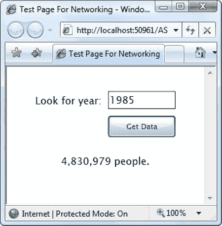

## 23

## 建立关系网

像大多数软件一样，Silverlight 应用程序需要与外界进行交互，以获得相关的最新信息。您已经看到了一种非常有用的将信息拉入 Silverlight 应用程序的方法:使用 WCF 服务，它允许 Silverlight 应用程序通过调用精心封装的。NET 代码。但是，WCF 服务不会提供您需要使用的所有数据。在许多情况下，您会希望从其他非。NET 存储库，例如表述性状态转移(REST) web 服务、RSS 提要和普通的 HTML 网页。

在本章中，您将了解 Silverlight 网络的另一面。您将学会从各种不同的非。NET 源代码并将其转换成您需要的形式。在路上，您还将学习如何使用出色的 XDocument 类和 LINQ 到 XML 来处理 XML 数据。但是在这一章中你要考虑的最大的任务是使用 Silverlight 的套接字支持来构建一个基本的消息应用程序。

### 与网络互动

在第 6 章中，你看到了如何使用 WebClient 类从网上下载文件。这种技术允许您在应用程序需要资源甚至 Silverlight 程序集的时候获取它。

WebClient 不仅仅用于下载二进制文件。它还为访问 HTML 页面和 web 服务提供了一些可能性。使用它的兄弟 WebRequest，您可以将值发布到网页上。在接下来的小节中，您将看到使用这些类从 Web 中获取信息的各种方法。但是在开始之前，您需要重新考虑 Silverlight 应用于任何使用 HTTP 的代码的安全性限制。

 **注意**本章中的联网示例假设您正在使用一个 ASP.NET 测试网站的解决方案，如[第 1 章](01.html#ch1)中所述。您需要使用一个测试网站来构建简单的 web 服务和使用 Silverlight 的下载功能，当您直接从硬盘启动 Silverlight 应用程序时，这些功能不可用。

#### 跨域访问

如果您曾经使用 Ajax 技术创建过 web 页面，那么您肯定使用过 XMLHttpRequest 对象，它允许您在后台执行 web 请求。但是，XMLHttpRequest 对象有一个很大的限制:网页只能访问同一台 web 服务器上的 web 资源(HTML 文档、web 服务、文件等等)。没有直接的方法来执行跨域调用以从另一个网站获取信息。

Silverlight 在其 WebClient 和 WebRequest 类中施加了几乎完全相同的限制。问题是安全。如果 Silverlight 应用程序可以在不通知用户的情况下调用其他网站，这将为网络钓鱼攻击打开方便之门。例如，如果用户登录到像 Hotmail 这样的服务，恶意的 Silverlight 应用程序可以悄悄地检索提供用户 Hotmail 数据的页面。有一些可能的改变可以避开这些攻击——例如，将用户凭证链接到他们的源 URL——但是这些需要对浏览器的工作方式进行相当大的改变。

然而，Silverlight 并不是完全受限的。它借用了 Flash 的一个技巧，让网站通过 XML 策略文件选择跨域访问。当你试图从一个网站下载数据时，Silverlight 会在那个网站上寻找一个名为 clientaccesspolicy.xml 的文件(你在第 19 章中学会了创建这个文件)。如果该文件不存在，Silverlight 将查找名为 crossdomain.xml 的文件，该文件扮演相同的角色，但最初是为 Flash 应用程序开发的。最终结果是，Flash 应用程序可以访问的网站，Silverlight 应用程序也可以访问。

clientaccesspolicy.xml 或 crossdomain.xml 文件必须存储在 web 根目录中。因此，如果你试图访问 URL 为[www.somesite.com/~luther/services/CalendarService.ashx](http://www.somesite.com/~luther/services/CalendarService.ashx)的网页内容，Silverlight 会检查[www.somesite.com/clientaccesspolicy.xml](http://www.somesite.com/clientaccesspolicy.xml)，然后(如果没有找到前者)[www.somesite.com/crossdomain.xml](http://www.somesite.com/crossdomain.xml)。如果这两个文件都不存在，或者存在的文件不授予对 Silverlight 应用程序的域的访问权限，则不允许你的应用程序访问该网站上的任何内容。通常，提供公共 web 服务的公司将它们放在一个单独的域中，以便更好地控制这种类型的访问。例如，照片分享网站 Flickr 不允许你访问域名[www.flickr.com](http://www.flickr.com)上的网址，但允许你访问 api.flickr.com 上的网址(多亏了`[http://api.flickr.com/crossdomain.xml](http://api.flickr.com/crossdomain.xml)`文件)。

 **提示**在您尝试将本章中的示例用于不同的网站之前，您应该验证它们是否支持跨域访问。为此，请尝试在根网站中请求 clientaccesspolicy.xml 和 crossdomain.xml 文件。

在第 19 章中，您了解了 clientaccesspolicy.xml 文件的样子。crossdomain.xml 文件类似。例如，这里有一个允许所有访问的 crossdomain.xml 文件。这类似于你在 Flickr 网站上找到的内容:

`**<?xml version="1.0"?>
<cross-domain-policy>
  <allow-access-from domain="*" />
</cross-domain-policy>**`

另一方面，Twitter 社交网站使用其 clientaccesspolicy.xml 文件来允许访问少数几个域，这意味着您的 Silverlight 代码无法检索其任何内容:

`**<?xml version="1.0"?>**` `**<cross-domain-policy>
  <allow-access-from domain="twitter.com" />
  <allow-access-from domain="api.twitter.com" />
  <allow-access-from domain="search.twitter.com" />
  <allow-access-from domain="static.twitter.com" />
  ...
</cross-domain-policy>**`

如果您需要从不允许跨域访问的网站访问 web 内容，您有两种选择。一种方法是创建一个在提升信任下运行的浏览器外应用程序，正如你在第 18 章中所学的那样。在这种情况下，用户必须明确安装您的应用程序并接受安全警告，但一旦他们这样做了，您的应用程序将能够从任何网站下载内容。

您的另一个选择是构建服务器端代理。要实现这个设计，你必须创建一个包含 web 服务的 ASP.NET 网站，就像你在第 19 章中学到的那样。您的 web 页面将被允许调用该服务，因为它在同一个网站上(即使不是，您也需要在 web 服务旁边添加自己的 clientaccesspolicy.xml 文件)。然后，您的 web 服务可以访问您想要的网站，并将数据返回到您的页面。这是因为不管跨域访问规则如何，web 服务都被允许调用任何网站。这是因为 web 服务运行在服务器上，而不是浏览器上，所以它们不会面临同样的安全问题。[图 23-1](#fig_23_1) 将这种安排与更直接的直接下载方法进行了比较。

***图 23-1。**在 Silverlight 中下载网页内容*

创建服务器端代理需要更多的工作，但是如果您不经常需要检索少量信息，这是一个可以接受的解决方案。但是，如果您需要频繁调用 web 服务(例如，您试图在不允许跨域访问的服务器上阅读 RSS 提要中的新闻条目)，开销会迅速增加。web 服务器最终做了大量的额外工作，Silverlight 应用程序需要等待更长时间才能获得信息，因为每个调用都要经历两个延迟:首先，web 页面对 web 服务的请求；第二，web 服务对第三方网站的请求。

现在你已经了解了管理你可以访问哪些网站的规则，你可以开始下载内容了。在这一章中，你将学习如何操作几种不同类型的内容，但是你将从最基本的——普通的 HTML 文件开始。

#### HTML 抓取

从 Web 上获取信息的最原始的方法之一是在 HTML 页面中挖掘原始标记。这种方法很脆弱，因为如果页面被修改，代码对页面结构的假设很容易被破坏。但是在某些情况下，HTML 抓取是唯一的选择。过去，在像亚马逊和易贝这样的网站提供网络服务之前，开发者经常使用屏幕抓取技术来获得价格细节、销售排名、产品图片等等。

在下面的例子中，你将看到 HTML 屏幕抓取是如何让你从图 23-2 中的表格中提取信息的。这张表列出了历史上不同时期的世界人口，它是基于从维基百科获得的信息。

***图 23-2。**一个普通的 HTML 页面*

表中的信息具有以下格式的结构:

`**<table>
  <tr>
    <th>Year</th>
    <th width="70">World</th>
  </tr>
  <tr>
    <th>70,000 BCE</th>
    <td>2</td>
  </tr>
  <tr>
    <th>10,000 BCE</th>
    <td>1,000</td>
  </tr>
  <tr>
    <th>9000 BCE</th>
   <td>3,000</td>
  </tr>
  ...
</table>**`

WebClient 类使您能够下载整个 HTML 文档。然后由您来解析数据。

在第 6 章中，你学会了使用网络客户端。OpenReadAsync()方法以字节流的形式从 Web 下载文件。然后，您可以灵活地使用 StreamReader(用于文本数据)或 BinaryReader(用于二进制信息)来读取该流。在本例中，您可以使用 OpenAsync()方法，然后使用 StreamReader 浏览页面。但是，WebClient 为相对少量的文本内容提供了一个快捷方式 DownloadStringAsync()方法，该方法以单个字符串的形式返回结果。在本例中，该字符串包括整个页面的 HTML。

图 23-3 显示了一个简单的 Silverlight 页面，可以让你从[图 23-2](#fig_23_2) 的表格中查询信息。用户输入年份。然后，代码在网页中搜索匹配的单元格，并从下一列返回人口数。不会尝试对值进行插值，如果指示的年份介于表中的值之间，则不会返回任何结果。

***图 23-3。**使用网络客户端查询 HTML 页面*

当用户单击“获取数据”按钮时，会创建一个新的 WebClient 对象。使用适当的网站地址调用 DownloadStringAsync()方法:

`**private void cmdGetData_Click(object sender, RoutedEventArgs e)
{
    WebClient client = new WebClient();
    Uri address = new Uri("http://localhost:" +
      HtmlPage.Document.DocumentUri.Port + "/ASPWebSite/PopulationTable.html");

    client.DownloadStringCompleted += client_DownloadStringCompleted;
    client.DownloadStringAsync(address);
}**`

 **提示**当您开始像这样的异步操作时，是用某种状态消息更新用户界面的好时机。例如，您可以在 TextBlock 中显示文本“联系 web 服务”。

下面是接收结果的代码:

`**private void client_DownloadStringCompleted(object sender,
  DownloadStringCompletedEventArgs e)
{
    string pageHtml = "";**` `**    try
    {
        pageHtml = e.Result;
    }
    catch
    {
        lblResult.Text = "Error contacting service.";
        return;
    }
    ...**`

当您读取 Result 属性时，如果 web 请求失败，则会引发异常，例如，如果找不到指定的网页，或者它不允许跨域访问。因此，异常处理代码是必需的。

从 HTML 字符串中获取您想要的信息需要做更多的工作。虽然您可以手动遍历字符串，检查每个字符，但是使用*正则表达式*要容易得多。正则表达式是一种模式匹配语言，通常用于搜索文本或验证输入。使用 String 类的普通方法，您可以在一个字符串中搜索一系列特定的字符(例如，单词 *hello* )。然而，使用正则表达式，您可以在五个字母长的字符串中找到以 *h* 开头的任何单词。你首先在第 21 章中学习了正则表达式，在那里你使用它们在数据对象中执行验证。

在本例中，您需要找到以下形式的 HTML 片段:

`**<th>500 BCE</th><td>100,000</td>**`

这里，The year in the element is a lookup value provided by the user. underThe number in the element is the result you want to retrieve.

有几种方法可以构造一个正则表达式，但是最干净的方法是使用一个名为 group 的*。命名组是一个占位符，表示您要检索的一些信息。您为组指定一个名称，然后在需要时检索它的值。命名组使用以下语法:*

`**(?<*NamedGroupName*>*MatchExpression*)**`

以下是本例中使用的命名组:

`**(?<population>.*)**`

这个命名的群体称为群体。它使用。*作为它的表达式，这是正则表达式所能得到的最简单的表达式。句号(。)匹配除换行符以外的任何字符。星号(*)表示该模式可以出现零次、一次或多次，换句话说，人口值可以包含任意数量的字符。

这个命名组的用处在于它在一个更大的正则表达式中的位置。下面是一个与本示例中使用的最终表达式非常相似的示例:

`**<th>1985</th>\s*<td>(?<population>.*)</td>**`

如果你把这个表达式一点一点分解，那就相对简单了。首先，此正则表达式查找年值为 1985 的列:

`**<th>1985</th>**`

后面可以跟零个或多个空白字符(空格、行、硬回车等等)，由元字符\s 表示:

`**<th>1985</th>\s***`

然后，下一列的< td >标记出现，后面是您要捕获的值(人口数)，在一个命名组中:

`**<th>1985</th>\s*<td>(?<population>.*)**`

最后，结束的标记表示列的结束和表达式的结束。

代码使用的这个表达式的最终版本中唯一的区别是年份不是硬编码的。相反，用户在文本框中输入该值，并将该值插入表达式字符串中:

`**string pattern = "<th>" + txtYear.Text + "</th>" + @ "\s*" + "<td>" +
  "(?<population>.*)" + "</td>";**`

有了正则表达式，剩下的代码就很容易了。您需要创建一个使用表达式的 Regex 对象，并将搜索字符串传递给 Regex。Match()方法。然后，您可以按名称查找您的组并提取值:

`**    ...
    Regex regex = new Regex (pattern);
    Match match = regex.Match(pageHtml);
    string people = match.Groups["population"].Value;
    if (people == "")
        lblResult.Text = "Year not found.";
    else
        lblResult.Text = match.Groups["population"].Value + " people.";
}**`

这不是从 Web 上获取信息的最优雅的方式，但是它演示了 WebClient 如何作为一个简单的工具来读取 Web 上的 HTML 和其他文本源。当您开始涉足使用表述性状态转移(REST)的 web 服务时，这种行为会变得更加有用，如以下部分所述。

#### REST 和其他简单的 Web 服务

最近，出现了简单 web 服务的复兴——web 服务避免了详细的 SOAP 协议和 WS-*标准的复杂性。简单的 web 服务永远不会取代基于 SOAP 的 web 服务，因为它们没有为分布式处理的真正挑战提供解决方案，例如路由、事务和安全性。然而，它们干净、精简的结构使它们成为构建公共 web 服务的理想选择，这些服务需要尽可能与最广泛的客户端兼容。许多顶级网站(如亚马逊、易贝和谷歌)为他们的 web 服务提供了基于 REST 和基于 SOAP 的接口。

**肥皂与休息**

此时，您可能想知道 SOAP、REST 和其他 web 服务标准之间有什么区别。所有 web 服务都通过 HTTP 传递消息。但是当信息传递到 web 服务和从 web 服务返回时，信息的呈现方式是不同的。

成熟的 SOAP web 服务将其数据放入特定的 XML 结构中:SOAP 文档。SOAP 可能很冗长，这意味着在没有内置 SOAP 支持的平台上构造 SOAP 消息需要更多的工作。(Silverlight 是一个具有内置 SOAP 支持的平台的例子，这就是为什么您需要添加一个对 SOAP 服务的 web 引用来使用它，而不是手工构造您需要的 XML 。)SOAP 还提供了一些显著的优势——它使用强类型数据，并且由于 SOAP *头*(可以与消息一起传递但不放在消息体中的独立信息片段)而具有高度可扩展性。SOAP 头是其他基于 SOAP 的标准使用的一个关键扩展点。

非 SOAP web 服务传递信息的方式更简单。输入值可以在 URL 中提供(在这种情况下，它们作为查询字符串参数附加在末尾),也可以在消息体中作为名称-值对的组合提供。无论哪种方式，开销都较少，但是没有真正的类型检查。web 服务响应可以使用普通字符串数据或 XML。

返回 HTML 文档的简单 web 服务通常被描述为在 HTTP 上使用 XML。简单的 web 服务通常也被描述为 REST 服务，但事实上 REST 是一个哲学概念，而不是一个具体的标准。REST 背后的基本思想是每个 URL 代表一个唯一的对象，而不仅仅是一个方法调用。不同的 HTTP 动词表示您想要对对象做什么(例如，您使用 HTTP GET 来检索对象，使用 HTTP POST 来更新它)。大多数将自己描述为基于 REST 的 web 服务并不完全遵循这一思想，实际上只是简单的非 SOAP web 服务。

在本节中，您将看到如何使用一个返回纯文本数据的简单 web 服务。在这一章的后面，你将进一步考虑一个返回 XML 的 web 服务。

之前，您查看了一个页面，其中包含一个历史上世界人口数量的表格。如果你想把它转换成一个 web 服务，你可以写一点 web 代码来接收一年的数据并写出相关的人口数字。请求的年份可以通过查询字符串参数(在 HTTP GET 请求中)提供，也可以发布到您的页面上(通过 HTTP POST 请求)。您选择的策略决定了客户端是必须使用 WebClient 还是更复杂的 WebRequest 类。WebClient 对于普通的 HTTP GET 请求已经足够了，但是只有 WebRequest 允许您的 Silverlight 代码发布一个值。

您可以使用 ASP.NET 构建您的 web 服务，但是您需要避免完整的 WebForm模型。毕竟，你不希望返回给用户一个完整的页面，包含不必要的元素，比如、和。相反，你需要创建 ASP.NET 所说的 *HTTP 处理程序*。

为此，请在解决方案资源管理器中右键单击您的 ASP.NET 网站，然后选择“添加新项”。然后，选择通用处理程序模板，提供一个名称，并单击 Add。默认情况下，HTTP 处理程序的扩展名为. ashx。

所有 HTTP 处理程序都编码为实现 IHttpHandler 的类，它们必须提供 ProcessRequest()方法和 IsReusable 属性 getter。IsReusable 属性指示 HTTP 处理程序在创建后是否可以被重用来处理多个请求，这比每次创建处理程序的效率要高一些。如果您没有在类的字段中存储任何状态信息，您可以安全地返回 true:

`**public bool IsReusable
{
    get { return true; }
}**`

ProcessRequest()方法执行实际的工作。它接收一个 HttpContext 对象，通过该对象可以访问当前请求的详细信息并写入响应。在本例中，ProcessRequest()检查名为 year 的已发布值。然后，它检查年份字符串是否包含字母，并使用名为 GetPopulation 的自定义方法(未显示)获取相应的人口统计数据。结果以纯文本形式写入页面:

`**public void **ProcessRequest (**HttpContext **context)**
**{**
    // Get the posted year.
    string year = context.Request.Form["year"];

    // Remove any commas in the number, and excess spaces at the ends.
    year = year.Replace(",", "");
    year = year.Trim();
    // Check if this year is BC.
    bool isBc = false;
    if (year.EndsWith("BC", StringComparison.OrdinalIgnoreCase))
    {
        isBc = true;
        year = year.Remove(year.IndexOf("BC", StringComparison.OrdinalIgnoreCase));
        year = year.Trim();
    }

    // Get the population.
    int yearNumber = Int32.Parse(year);
    int population = GetPopulation(yearNumber, isBc);

    // Write the response.
    context.Response.ContentType = "text/plain";
    context.Response.Write(population);
}**`

在客户端，您需要使用来自 System.Net 名称空间的 WebRequest 类。要使该类可用，必须添加对 System.Net.dll 程序集的引用，默认情况下不包括该程序集。

WebRequest 要求您异步完成所有工作。WebClient 有一个异步步骤(下载响应数据)，而 WebRequest 有两个异步步骤:创建请求流，然后下载响应。

要使用 WebRequest，首先需要创建一个 WebRequest 对象，用正确的 URI 配置它，然后调用 BeginGetRequestStream()。当您调用 BeginGetRequestStream()时，您提供了一个回调，它将在请求流准备就绪时将请求写入请求流。在本例中，该任务属于另一个名为 CreateRequest()的方法:

`**private string searchYear;

private void cmdGetData_Click(object sender, RoutedEventArgs e)
{
    Uri address = new Uri("http://localhost:" +
    HtmlPage.Document.DocumentUri.Port + "/ASPWebSite/PopulationService.ashx");

    // Create the request object.
    WebRequest request = WebRequest.Create(address);
    request.Method = "POST";
    request.ContentType = "application/x-www-form-urlencoded";

    // Store the year you want to use.
    searchYear = txtYear.Text;**` `**    // Prepare the request asynchronously.
    request.BeginGetRequestStream(CreateRequest, request);
}**`

这段代码包含另一个细节。在调用 BeginGetRequestStream()之前，代码将搜索年份从文本框复制到一个名为 search year 的私有字段中。这种技术有两个目的。首先，它确保 CreateRequest()回调可以访问原始搜索值，即使用户在 CreateRequest()代码运行之前能够编辑文本框。更重要的是，这种技术避免了线程问题。因为 CreateRequest()回调在后台线程(不是主应用程序线程)上运行，所以它不能直接访问页面中的元素。正如你在第 16 章中看到的，你可以使用 Dispatcher 来解决这个问题。BeginInvoke()。然而，复制搜索年份回避了这个问题。

通常，Silverlight 会在您调用 BeginGetRequestStream()后的几分之一秒内调用 CreateRequest()方法。此时，您需要将提交的值作为请求的一部分。通常，web 服务对提交的值使用与 HTML 表单相同的标准。这意味着每个值都作为名称-值对提供，用等号分隔；多个值用&符号连接在一起，例如 first name = Matthew & last name = MacDonald。要写入数据，您可以使用 StreamWriter:

`**private void CreateRequest(IAsyncResult asyncResult)
{
    WebRequest request = (WebRequest)asyncResult.AsyncState;

    // Write the year information in the name-value format "year=1985".
    Stream requestStream = request.EndGetRequestStream(asyncResult);
    StreamWriter writer = new StreamWriter(requestStream);
    writer.Write("year=" + searchYear);

    // Clean up (required).
    writer.Close();
    requestStream.Close();

    // Read the response asynchronously.
    request.BeginGetResponse(ReadResponse, request);
}**`

编写完请求后，您需要关闭 StreamWriter(以确保所有数据都被写入)，然后关闭请求流。接下来，您必须调用 BeginGetResponse()来提供回调，该回调将在响应流可用时处理响应流。在本例中，名为 ReadResponse()的方法完成了这项工作。

要读取响应，可以使用 StreamReader。此时，您还需要错误处理代码来处理找不到服务时抛出的异常。如果响应使用 XML，现在也由您来解析 XML:

`**private void ReadResponse(IAsyncResult asyncResult)
{
    string result;
    WebRequest request = (WebRequest)asyncResult.AsyncState;

    // Get the response stream.
    WebResponse response = request.EndGetResponse(asyncResult);
    Stream responseStream = response.GetResponseStream();**` `**    try
    {
        // Read the returned text.
        StreamReader reader = new StreamReader(responseStream);
        string population = reader.ReadToEnd();
        result = population + " people.";
    }
    catch
    {
        result = "Error contacting service.";
    }
    finally
    {
        response.Close();
    }
    ...**`

与 BeginGetRequestStream()的回调一样，BeginGetResponse()的回调在后台线程上运行。如果你想和一个元素交互，你需要使用 Dispatcher。BeginInvoke()将调用封送到前台线程。下面是实现这一功能的代码:

`**    ...
    // Update the display.
    Dispatcher.BeginInvoke(
      delegate()
      {
          lblResult.Text = result;
      });
}**`

具有讽刺意味的是，在 Silverlight 中调用简单的 web 服务比调用基于 SOAP 的 web 服务需要更多的工作，因为 Silverlight 不能为您生成任何代码。这是简单 web 服务的部分缺点——尽管它们更容易调用，但它们不是自描述的。这意味着它们缺乏底层文档细节，这些细节允许像 Visual Studio 这样的开发工具生成一些您需要的代码。

#### 使用网络凭证

WebClient 和 WebRequest 类都允许您在 web 请求中传递网络凭证，特别是用户名和密码。这允许您访问需要身份验证的安全 web 服务器。

要使用网络凭据，您必须首先调用静态 WebRequest。RegisterPrefix()方法来确保您使用的是客户端 HTTP 堆栈，如下所示:

`**WebRequest.RegisterPrefix("http://",
   System.Net.Browser.WebRequestCreator.ClientHttp);**`

然后，设置 WebClient 或 WebRequest 对象的 UseDefaultCredentials 属性和 Credentials 属性。以下是 WebRequest 类的一个示例:

`**WebRequest request = WebRequest.Create(address);
request.UseDefaultCredentials = false;**` `**request.Credentials = new NetworkCredential("username", "password");**`

一旦设置完这些属性，就可以用 WebRequest 或 WebClient 对象以正常方式联系 web 服务器。

### 处理不同类型的数据

到目前为止，您已经看到了如何从 web 上检索普通的文本数据，无论是来自静态文件还是由 Web 服务动态生成的。您还了解了如何搜索包含 HTML 标记的文本。但是从编程的角度来看，纯文本和 HTML 都有局限性，因为它们很难解析。更常见的是，您将处理更复杂的结构化数据。返回结构化数据的 Web 服务通常采用标准化的格式，比如普通的 XML、SOAP 消息或 JSON。Silverlight 支持所有三种格式，您将在接下来的章节中看到如何使用它们。

#### XML

许多简单的 web 服务以 XML 形式返回数据。当使用这种服务时，您需要决定如何处理 XML。

Silverlight 包括几个处理 XML 的选项:

*   XmlWriter 和 XmlReader: 这些类用最少的特性提供了一种处理 XML 的基本方法。使用它们，您可以一次一个元素地写入或读取 XML 内容。
*   XmlSerializer: 这个类允许你将一个活动对象转换成 XML 表示，反之亦然。唯一的限制是 XML 必须遵循类的结构。若要使用 XmlSerializer，您需要对 System.Xml.Serialization.dll 程序集的引用。
*   这个类是 LINQ 到 XML 的基础。它允许您转换 XML 对象(以及反向转换)，但是它比 XmlSerializer 提供了更多的灵活性。使用正确的 LINQ 表达式，你可以过滤出你想要的细节，并改变内容的结构。要使用 XDocument，您需要一个对 System.Xml.Linq.dll 程序集的引用。

那么，哪种方法是最好的呢？XmlReader 和 XmlWriter 提供了最底层的方法。例如，要用 XmlReader 读取 XML 文档，需要遍历所有节点，自己跟踪结构，忽略注释和空白。你只能朝一个方向(向前)行进。如果您只想要一个节点，您仍然必须通读文档中出现在它之前的每个节点。类似地，在编写文档时，您需要顺序编写所有的元素，依赖于语句的顺序来生成正确的结构。您还需要为包含嵌套元素的每个元素显式编写开始和结束标记。

通常，大多数 Silverlight 应用程序最好使用更高级别的 XmlSerializer 和 XDocument 类。唯一的例外是，如果您需要处理大量的 XML，并且希望避免一次性将它们全部加载到内存中的开销。在这种情况下，可能需要对 XmlWriter 和 XmlReader 进行逐位处理。

在 XmlSerializer 和 XDocument 之间，如果您完全控制数据格式，XmlSerializer 是一个合理的选择——换句话说，您已经创建了想要序列化的类，并且不需要符合特定的 XML 格式。然而，XDocument 提供了更大的灵活性，使您能够将 XML 视为元素的集合，或者将其转换为对象的集合。当你使用别人的 XML 时，这一点特别有用——例如，当你从一个 web 服务中检索数据时。

 **注意** Silverlight 不包含使用 XML DOM 模型的类(比如你可以在。网)。如果想执行内存中的 XML 处理，最好使用更简化、更高效的 XDocument。

在下一节中，您将看到如何使用 XDocument 解析从 web 服务返回的数据，并创建一个 XML 文档发送给 web 服务。如果您有一个需要 XmlWriter、XmlReader 或 XmlSerializer 的特定场景，您会发现它们的工作方式与完整的非常相似。NET 框架。

#### 返回 XML 数据的服务

Flickr 是一个图片分享网站，提供类似 REST 的服务。通过将查询字符串参数附加到 URL 的末尾来提供参数。Flickr web 服务返回 XML 格式的响应。

图 23-4 显示了一个例子，让用户提供一个搜索关键词，然后在 Flickr 上显示用该关键词描述的图片列表。

***图 23-4。**从 Flickr 检索图片*

在本例中，Flickr 请求包括以下查询字符串参数:method(表示正在执行的操作的类型)、tags(搜索关键字)、perpage(要检索的结果数)和 api_key(允许您访问 Flickr 服务的唯一 ID)。您可以使用更多的参数来获取多页结果、应用排序、按日期过滤等等。要了解更多信息并获得您自己的免费 API 密钥，请访问`[www.flickr.com/services/api](http://www.flickr.com/services/api)`。

 **提示** Flickr 提供了几种不同的方法来调用它的 web 服务。这里使用简单的 REST 方法来演示如何在 Silverlight 应用程序中处理 XML。但是如果您正在构建一个使用 Flickr 的实用 Silverlight 应用程序，您会发现使用 SOAP 接口并让 Visual Studio 为您生成一些代码会更容易。

下面是图 23-4 中使用的请求:

`**http://api.flickr.com/services/rest/?method=flickr.photos.search&tags=frog&
api_key=...&perpage=10**`

因为所有的输入参数都是通过 URL 传入的，所以不需要发布任何东西，并且可以使用更简单的 WebClient 来代替 WebRequest。下面是构建 Flickr 请求 URL，然后触发异步操作以获得结果的代码:

`**private void cmdGetData_Click(object sender, RoutedEventArgs e)
{
    WebClient client = new WebClient();
    Uri address = new Uri("http://api.flickr.com/services/rest/?" +
        "method=flickr.photos.search" + "&tags=" +
        HttpUtility.UrlEncode(txtSearchKeyword.Text) +
        "&api_key=..." + "&perpage=10");

    client.DownloadStringCompleted += client_DownloadStringCompleted;
    client.DownloadStringAsync(address);
}**`

静态属性。UrlEncode()方法确保如果搜索字符串中有任何非 URL 友好的字符，它们将被相应的字符实体替换。

结果以单个长字符串的形式检索，该字符串包含以下格式的 XML:

`**<?xml version="1.0" encoding="utf-8" ?>
<rsp stat="ok">
  <photos page="1" pages="1026" perpage="100" total="102577">
    <photo id="2519140273" owner="85463968@N00" secret="9d215a1b8b" server="2132"
     farm="3" title="He could hop in, but he couldn't hop out" ispublic="1"
     isfriend="0" isfamily="0" />
    <photo id="2519866774" owner="72063229@N00" secret="05bccd89cd" server="2353"
     farm="3" title="Small Frog on a Leaf" ispublic="1" isfriend="0" isfamily="0" />
    ...
  </photos>
</rsp>**`

要解析这些信息，第一步是将整个文档加载到一个新的 XDocument 对象中。XDocument 类提供了两个静态方法来帮助您:从 XmlReader 中提取内容的 Load()方法和从字符串中提取内容的 Parse()方法。当网络客户端。DownloadStringCompleted 事件时，使用 Parse()方法:

`**XDocument document = XDocument.Parse(e.Result);**`

拥有 XDocument 对象后，您可以使用两种策略之一来提取您需要的信息。您可以在 XDocument 中的元素和属性集合中移动，这些集合表示为 XElement 和 XAttribute 对象。或者，可以使用 LINQ 表达式检索所需的 XML 内容，并将其转换为最合适的对象表示。以下部分演示了这两种方法。

##### 在 XDocument 上导航

每个 XDocument 都包含一个 XNode 对象集合。XNode 是一个抽象基类。其他更具体的类，如 XElement、XComment 和 XText，都是从它派生出来的，用于表示元素、注释和文本内容。属性是一个例外——它们不被视为独立的节点，而是附加到元素上的简单的名称-值对。

一旦有了包含内容的 live XDocument，就可以使用 XElement 类的一些关键属性和方法深入到节点树中。表 23-1 列出了最有用的方法。

这里有一个非常重要的细节:XDocument 通过方法而不是属性公开嵌套元素。这为您提供了额外的灵活性，只过滤出您感兴趣的元素。例如，当使用 XDocument 时。方法，您有两种重载可供选择。您可以获取所有子元素(在这种情况下，您不需要提供任何参数)，或者只获取那些具有特定元素名称的子元素(在这种情况下，您将元素名称指定为字符串)。

在 Flickr 的例子中，顶级元素被命名为<rsp>。因此，您可以这样访问它:</rsp>

`**XElement element = document.Element("rsp");**`

当然，您真正感兴趣的是<rsp>元素中的<photos>元素。您可以分两步实现这一点:</photos></rsp>

`**XElement rspElement = document.Element("rsp");
XElement photosElement = rspElement.Element("photos");**`

或者更有效地用一个:

`**XElement photosElement = document.Element("rsp").Element("photos");**`

要获取<photos>元素中的<photo>元素，可以使用 elements()方法(因为有多个匹配的元素)。你不需要指定名字<photos>，因为里面没有任何其他类型的元素:</photos></photo></photos>

`**IEnumerable<XElement> elements =
  document.Element("rsp").Element("photos").Elements();**`

您需要的所有信息都在每个<photo>元素的属性中。要获得 Flickr 图像(然后可以使用 image 元素显示它)，您需要构造正确的 URL，这涉及到以正确的格式组合几条信息:</photo>

`**private void client_DownloadStringCompleted(object sender,
    DownloadStringCompletedEventArgs e)
{
      XDocument document = XDocument.Parse(e.Result);

      // Clear the list.
      images.Items.Clear();

      // Examine each <photo> element.
      foreach (XElement element in
        document.Element("rsp").Element("photos").Elements())
      {
          // Get the attribute values and combine them to build the image URL.
          string imageUrl = String.Format(
          "http://farm{0}.static.flickr.com/{1}/{2}_{3}_m.jpg",
          (string)element.Attribute("farm"),
          (string)element.Attribute("server"),
          (string)element.Attribute("id"),
          (string)element.Attribute("secret")
        );

        // Create an Image object that shows the image.
        Image img = new Image();
        img.Stretch = Stretch.Uniform;
        img.Width = 200; img.Height = 200;
        img.Margin = new Thickness(10);
        img.Source = new BitmapImage(new Uri(imageUrl));

        // Add the Image element to the list.
        images.Items.Add(img);
    }
}**`

 **提示**从 XAttribute 或 XElement 对象中获取实际值的最简单方法是将其转换为所需的类型。在前面的示例中，所有属性都被视为字符串值。

您已经看到了如何使用 Element()和 Elements()方法过滤出具有特定名称的元素。然而，这两种方法都只深入一个层次。XDocument 和 XElement 类还包括两个更深入搜索的方法:祖先()和后代()。Descendants()方法在任意深度查找当前元素包含的所有 XElement 对象。Ancestors()方法在任意级别查找包含当前元素的所有 XElement 对象。使用 Descendants()，您可以从前面的代码块重写该语句

`**foreach (XElement element in
  document.Element("rsp").Element("photos").Elements())**`

像这样:

`**foreach (XElement element in document.Descendants("photo"))**`

XDocument 和 XElement 类是效率的小奇迹。如果你仔细看看他们，你会发现更多的导航成员。例如，它们具有从一个节点快速跳到下一个节点的属性(FirstNode、LastNode、NextNode、PreviousNode 和 Parent)和检索与当前节点处于同一级别的同级节点的方法(ElementsAfterSelf()和 ElementsBeforeSelf())。你还会发现操纵文档结构的方法，这将在本章后面讨论。

##### 使用 LINQ 查询 XDocument

如您所见，很容易使用 Element()、Elements()和 Ancestors()等方法来访问 XDocument 并获得您想要的内容。但是，在某些情况下，您希望将内容转换为不同的结构。例如，您可能希望从各种元素中提取信息，并将其简化为一个简单的结构。如果将 XDocument 与 LINQ 表达式结合使用，这种技术就很简单。

正如你在第 20 章中看到的，LINQ 表达式处理实现 IEnumerable < T >的对象。XDocument 和 XElement 类包括几种获取 IEnumerable < T >元素集合的方法，包括您刚才考虑的 elements()和 Descendants()方法。

将元素集合放入 LINQ 表达式后，可以使用所有标准的 LINQ 运算符。这意味着您可以使用排序、过滤、分组和投影来获得您想要的数据。

下面是一个示例，它选择 XML 文档中的所有<photo>元素(使用 Descendants()方法)，提取最重要的属性值，并将它们设置为对象的属性:</photo>

`**var photos = from results in document.Descendants("photo")
             select new
             {
                Id = (string)results.Attribute("id"),
                Farm = (string)results.Attribute("farm"),
                Server = (string)results.Attribute("server"),
                Secret = (string)results.Attribute("secret")
             };**`

这种技术使用了匿名类型的标准 LINQ 特性。本质上，该表达式生成一个动态定义类型的集合，其中包含您指定的属性。

C#编译器创建您需要的类定义。因为在代码中没有对这个类定义的引用，所以在定义 photos 集合时需要使用 var 关键字。但是代码仍然是强类型的，因为类确实存在——它只是在编译时自动生成的。在代码的其他地方，您可以循环访问 photos 集合，并与动态生成的类型的属性进行交互，以构建图像元素，如前所述:

`**foreach (var photo in photos)
{
    imageUrl = string.Format("http://farm{0}.static.flickr.com/{1}/{2}_{3}_m.jpg",
      photo.Farm, photo.Server, photo.Id, photo.Secret);
    ...
}**`

这种将 XML 文档的一部分映射到新类的技术被称为*投影*。当您不需要在应用程序的其他地方使用相同的数据分组时，投影通常与一次性任务的匿名类型结合使用。然而，使用投影创建自定义类的实例也同样容易。如果您计划对新生成的对象执行数据绑定，您将需要使用这种方法。

为了了解这是如何工作的，考虑另一种方法来构建图 23-4 中所示的例子是有帮助的。您可以定义一个数据模板，它接受绑定对象，提取 URL 信息，并在图像元素中使用它，而不是手动构造每个图像元素:

`**<ListBox x:Name="images">
  <ListBox.ItemTemplate>
    <DataTemplate>
      <Image Stretch="Uniform" Width="200" Height="200"
       Margin="5" Source="{Binding ImageUrl}"></Image>
    </DataTemplate>
  </ListBox.ItemTemplate>
</ListBox>**`

要做到这一点，您需要一个提供 ImageUrl 属性(可能包括其他细节)的自定义类。这是最简单的可能性:

`**public class FlickrImage {
    public string ImageUrl { get; set; }
}**`

现在，您可以使用 LINQ 表达式创建 FlickrImage 对象的集合:

`**var photos = from results in document.Descendants("photo")
             select new FlickrImage
             {
                 ImageUrl =
                 String.Format(
                     "http://farm{0}.static.flickr.com/{1}/{2}_{3}_m.jpg",
                     (string)results.Attribute("farm"),
                     (string)results.Attribute("server"),
                     (string)results.Attribute("id"),
                     (string)results.Attribute("secret"))
             };
images.ItemsSource = photos;**`

这种方法需要最少的代码，并提供最简化的解决方案。

**XDocument 和名称空间**

XDocument 类处理名称空间的方式非常优雅。在元素名之前添加名称空间，用花括号括起来。例如，如果您想在名称空间 http://www.somecompany.com/PhotoMarkup,中找到<照片>元素，您可以修改它

`**XElement photosElement = element.Element("photos");**`

对此:

`**XElement photosElement = element.Element(
  "{http://www.somecompany.com/PhotoMarkup}photos");**`

要清理这些代码，您应该使用 XNamespace 类，如下所示:

`**XNamespace ns = "http://www.somecompany.com/DVDList";
XElement photosElement = element.Element(**ns** + "photos");**`

这样，您只需要定义一次名称空间，并且您可以在需要引用该名称空间中的元素时重用它。当创建想要放在特定名称空间中的元素时，可以使用相同的名称更改方法。请记住，大多数基于 XML 的语言将元素放在名称空间中，但不会将任何名称空间分配给属性。

#### 需要 XML 数据的服务

简单的 web 服务通常允许您通过查询字符串参数提供所有的输入参数。但是，查询字符串参数受到 web 浏览器 URIs 规则的限制。它们只能有这么长，而且很难表示结构化数据。

因此，需要更详细数据的 web 服务通常接受某种形式的 XML。SOAP(接下来描述)就是一个例子。非 SOAP web 服务通常使用一个叫做 XML-RPC 的基本标准。例如，Flickr 为其图像搜索提供了 XML-RPC 接口。要使用它，您可以按以下格式发布 XML 请求:

`**<methodCall>
  <methodName>flickr.photos.search</methodName>
  <params>
    <param>
      <value>
        <struct>
          <member>
            <name>tags</name>
            <value><string>value</string></value>
          </member>
          <member>
            <name>api_key</name>
            <value><string>...</string></value>
          </member>
        </struct>
      </value>
    </param>
  </params>**` `**</methodCall>**`

您可以通过添加更多的<member>元素来添加额外的参数。例如，您可以添加可选的 perpage 参数，如前面的示例所示。</member>

要使用 XML-RPC 服务(或任何需要 XML 请求消息的 web 服务)，您需要在 HTTP POST 的主体中发送 XML 文档。这意味着您需要功能更强的 WebRequest 类，而不是 WebClient。

要构造 XML 消息，可以使用简单的字符串连接。如果您只需要设置一个细节，这就很好了。(记得用 HttpUtility。HtmlEncode()来转义像尖括号这样的字符，否则这些字符会被解释为 XML。)然而，字符串连接也很脆弱，因为如果 XML 无效，您不会收到任何错误通知。(相反，您的 web 服务调用将会失败。)另一种选择是使用 XDocument 类(XDocument、XElement、XAttribute、XComment、XDeclaration 等)构造 XML 文档。您需要的代码干净简洁，令人耳目一新。

所有 XDocument 类都提供了有用的构造函数，您可以在一个步骤中创建和初始化这些构造函数。例如，您可以使用如下代码创建一个元素并提供应该放在其中的文本内容:

`**XElement element = new XElement("Price", "23.99");**`

当您考虑 XDocument 的另一个特性时，代码节省会更加显著:它能够在一条代码语句中创建一个嵌套的节点树。它是这样工作的。XDocument 和 XElement 类包含构造函数，这些构造函数将参数数组作为最后一个参数。该参数数组保存嵌套节点的列表。

 **注意**一个*参数数组*是一个前面带有 params 关键字的参数。这个参数总是最后一个参数，并且总是一个数组。这样做的好处是用户不需要声明数组，相反，他们可以添加任意多的参数，这些参数会自动组合成一个数组。字符串。Format()是使用参数数组的方法的一个例子。它允许您提供无限数量的插入到字符串占位符中的值。

下面的示例创建了一个包含一个属性和两个嵌套元素的元素:

`**XElement element = new XElement("photo",
  new XAttribute("src", "http://www.someplace.com/someimage.jpg") ,
  new XElement("tag", "horse"),
  new XElement("tag", "plow")
);**`

这段代码创建了如下 XML 标记:

`**<photo src="http://www.someplace.com/someimage.jpg">
  <tag>horse</tag>
  <tag>plow</tag>
</photo>**`

您可以扩展这种技术来创建整个 XML 文档。例如，下面是使用文本框中的搜索关键字为 Flickr 图片搜索创建 XML-RPC 请求的完整代码:

`**XDocument document = new XDocument(
    new XElement("methodCall",
        new XElement("methodName", "flickr.photos.search"),
        new XElement("params",
            new XElement("param",
                new XElement("value",
                    new XElement("struct",
                        new XElement("member",
                            new XElement("name", "tags"),
                            new XElement("value",
                                new XElement("string", searchKeyword)
                            )
                        ),
                        new XElement("member",
                            new XElement("name", "api_key"),
                            new XElement("value",
                                new XElement("string", "...")
                            )
                        )
                    )
                )
            )
        )
    )
);**`

使用 XDocument 创建 XML 内容的一个很好的细节是代码语句的缩进反映了 XML 文档中元素的嵌套，允许您快速了解 XML 内容的整体形状。

创建 XML 内容后，可以使用 XDocument 将其保存到 TextWriter 中。Save()方法或使用 ToString()将其转换为字符串。将 XDocument 与 WebRequest 类一起使用时，需要使用 StreamWriter 将其写入请求流，如下所示:

`**StreamWriter writer = new StreamWriter(requestStream);
writer.Write(document.ToString());**`

当您通过 XML-RPC 调用 Flickr 图像搜索时，您也会得到一个 XML-RPC 响应。要获取之前使用的照片信息，需要调用 HttpUtility。然后使用 LINQ 到 XML 过滤掉<photo>元素。有关完整的代码，请参见本章的可下载示例。</photo>

 **注意**你现在已经学会了如何用 XDocument 和 LINQ 到 XML 来读取和创建 XML。当您处理基于 XML 的 web 服务时，这些技术非常有用，但是如果您需要在其他场景中使用 XML(例如，如果您在独立存储中有一个包含 XML 内容的本地存储文件)，这些技术也会派上用场。如果深入研究 XDocument 和 XElement 类，您会发现它们有更多的元素，使得在创建 XML 文档后修改它们变得容易。不仅可以设置任何元素或属性的值，而且还可以使用插入、删除和其他操作 XML 树节点的方法，比如 Add()、AddAfterSelf()、AddBeforeSelf()、RemoveNodes()、Remove()、ReplaceWith()等等。

#### 返回 SOAP 数据的服务

正如您在第 19 章中了解到的，Silverlight 可以与。NET web 服务。这些 web 服务发送 SOAP 编码的数据。SOAP 是 XML 的一种形式，所以从技术上来说，使用 Silverlight 的 XML 处理(例如，XDocument 类)来创建请求消息和解析响应消息是可能的，如前几节所述。然而，在 Visual Studio 中添加服务引用要容易得多。

您可能不知道的是，同样的技术也适用于任何基于 SOAP 的 web 服务。换句话说，您可以添加对非. NET 内置的基于 SOAP 的服务的引用。Silverlight 无法区分这两者，也无法知道是什么代码支持它所调用的服务。

当您向任何基于 SOAP 的 web 服务添加 web 引用时，Visual Studio 会创建您需要的代理类，并为 web 服务中的每个 web 方法提供异步方法和事件。更多信息，参见第 19 章。

#### 返回 JSON 数据的服务

JavaScript 对象符号(JSON)是一种对象符号语法，有时用作 XML 的轻量级替代。当您使用返回 JSON 数据并且不提供 SOAP 替代的 web 服务时，您需要使用 JSON 序列化程序。(如果 web 服务返回 JSON 或简单的 XML，您可以选择 JSON 方法还是 XDocument。)更有趣的是，Silverlight 提供了两种不同的方法来解析 JSON 数据:可以用 JSON 反序列化器反序列化它，如下例所示；或者您可以使用 LINQ 到 JSON，这与 LINQ 到 XML 的工作方式非常相似。虽然本章没有讨论 LINQ 到 JSON，但是你可以在 Silverlight SDK 文档中获得更多信息(或者在`[http://blogs.msdn.com/mikeormond/archive/2008/08/21/linq-to-json.aspx](http://blogs.msdn.com/mikeormond/archive/2008/08/21/linq-to-json.aspx)`阅读快速回顾)。

在处理 JSON 数据之前，需要添加对另外三个程序集的引用:System.Runtime.Serialization.dll、System.ServiceModel.dll 和 System.ServiceModel.Web.dll。

反序列化 JSON 很像用 XmlSerializer 类反序列化 XML。第一个要求是要有一个合适的类来匹配 JSON 数据的结构。然后，您可以使用 DataContractJsonSerializer 类将该类的实例转换为 JSON 数据，反之亦然。

比如雅虎！为其图像搜索服务提供一个 JSON 接口(在`[http://developer.yahoo.com/search/image/V1/imageSearch.html](http://developer.yahoo.com/search/image/V1/imageSearch.html)`中描述)。它返回如下所示的数据:

`**{"ResultSet":{
  "totalResultsAvailable":"957841",
  "totalResultsReturned":10,
  "firstResultPosition":1,
  "Result":[
    {
      "Title":"tree_frog.jpg",
      "Summary":"Red-Eyed Tree Frog",
      "Url":"http:\/\/www.thekidscollege.com\/images\/animals\/redeyetree_frog.jpg",
      ...
    },
    {
      "Title":"tree_frog_large-thumb.jpg",**` `**      "Summary":"Before I came back in though I got another shot of the frog.",
      "Url":"http:\/\/www.silveriafamily.com\/blog\/john\/treefrog.jpg",
      ...
    }
  ]
}}**`

数据是名称-值对，用花括号{}分组到类中，用方括号[]分组到数组中。要用类对这里显示的数据建模，您需要为每个单独的搜索结果创建一个类(在 JSON 中命名为 result)，为整个结果集创建一个类(在 JSON 中命名为 result set)，以及一个保存搜索结果集的顶级类。您可以给这些类取任何想要的名字，但是属性名必须与 JSON 表示中的名称完全匹配，包括大小写。对于您不想检索的细节，您的类不需要包含属性—它们可以被安全地忽略。

这是你需要的课程。属性名(基于 JSON 表示)是粗体的:

`**public class SearchResults
{
    public SearchResultSet ResultSet;
}

public class SearchResultSet {
    public int totalResultsAvailable { get; set; }
    public int totalResultsReturned { get; set; }
    public SearchResult[] Result { get; set; }
}

public class SearchResult {
    public string Title {get; set;}
    public string Summary { get; set; }
    public string Url { get; set; }
}**`

现在，您可以使用这些类来反序列化搜索结果。这是一件分两步走的事情。首先，创建 DataContractJsonSerializer 的一个实例，指定要序列化或反序列化的类型作为构造函数参数:

`**DataContractJsonSerializer serializer =
  new DataContractJsonSerializer(typeof(SearchResults));**`

然后，您可以使用 ReadObject()来反序列化 JSON 数据，或者使用 WriteObject()来创建它:

`**SearchResults results = (SearchResults)serializer.ReadObject(jsonData);**`

图 23-5 显示了一个通过关键字搜索图片的 Silverlight 页面示例。

***图 23-5。**用雅虎搜索图片*

以下是支撑该页面的代码:

`**private void cmdGetData_Click(object sender, RoutedEventArgs e)
{
    WebClient client = new WebClient();
    Uri address = new Uri(
      "http://search.yahooapis.com/ImageSearchService/V1/imageSearch?" +
      "appid=YahooDemo&query=" + HttpUtility.UrlEncode(txtSearchKeyword.Text) +
      "&output=json");

    client.OpenReadCompleted += client_OpenReadCompleted;
    client.OpenReadAsync(address);
}

private void client_OpenReadCompleted(object sender, OpenReadCompletedEventArgs e)
{
    DataContractJsonSerializer serializer =
      new DataContractJsonSerializer(typeof(SearchResults));
    SearchResults results = (SearchResults)serializer.ReadObject(e.Result);

    lblResultsTotal.Text = results.ResultSet.totalResultsAvailable +
      " total results.";**` `**    lblResultsReturned.Text = results.ResultSet.totalResultsReturned +
      " results returned.";
    gridResults.ItemsSource = results.ResultSet.Result;
}**`

#### RSS

Really Simple Syndication (RSS)是一种基于 XML 的格式，用于发布频繁更新的内容摘要，如博客条目或新闻故事。这些文档被称为*提要*。名为 *RSS 阅读器*的客户端应用程序可以定期检查 RSS 提要，并通知您新添加的条目。

。NET 3.5 引入了支持 RSS 2.0 或 Atom 1.0 格式的类。Silverlight 借用了这些相同的类，允许您无需繁琐的 XML 解析代码就可以读取提要信息。这些类别在系统中定义。ServiceModel.Syndication 命名空间，要访问它们，您需要添加对 System.ServiceModel.Syndication.dll 程序集的引用。

当您使用 RSS 时，重要的是要记住您受到本章开始时解释的跨域规则的限制。显然，如果您试图访问不允许跨域访问的 web 服务器上的提要，您会得到一个错误。但是，提要也包含链接。例如，一个典型的提要条目包含一个摘要和一个链接，该链接指向相应博客条目或新闻条目的完整页面。如果您试图在此位置下载该网页，还必须确保它位于允许跨域访问的 web 服务器上。

你需要考虑另一个问题。RSS 提要中的条目通常指向成熟的 HTML 页面。但是，即使您下载了这个 HTML 内容，也没有办法在 Silverlight 内容区域中以正确的格式显示它。更好的方法是将它显示在当前 HTML 页面的另一部分——例如，就在 Silverlight 控件的下面。图 23-6 显示了一个将显示提要条目(在顶部)的 Silverlight 页面与一个普通的 HTML < iframe >元素相结合的例子，该元素显示了与当前选中的条目相对应的页面。

***图 23-6。**浏览带有新闻条目的 RSS 提要*

创建这个例子非常简单。首先，你需要一个饲料 URI。这个例子使用了 URI `[http://feeds.feedburner.com/ZDNetBlogs](http://feeds.feedburner.com/ZDNetBlogs)`，它指向高科技网站 ZDNet 上的博客新闻。提要是 XML 文档，您可以使用熟悉的 DownloadStringAsycn()和 OpenReadAsync()方法轻松下载它们。后者更有效，因为整个 XML 文档不需要一次作为一个字符串保存在内存中:

`**private void cmdGetData_Click(object sender, RoutedEventArgs e)
{
    WebClient client = new WebClient();
    Uri address = new Uri("http://feeds.feedburner.com/ZDNetBlogs");
    client.OpenReadCompleted += client_OpenReadCompleted;
    client.OpenReadAsync(address);
}**`

 **注意** Silverlight 的 feed-reading 能力有些脆弱，微小的格式化怪癖就能轻易摆脱它。因此，RSS 特性与您自己生成的 feed 文档配合使用时效果最好。

当您读取响应时，可以将 XML 内容加载到 SyndicationFeed 对象中。SyndicationFeed 类包括描述提要细节的各种属性，比如它的作者、它的最近更新、提要的概要等等。最重要的细节是 Items 属性，它保存了 SyndicationItem 对象的集合。图 23-6 中的网格显示了 SyndicationItem 对象:

`**private void client_OpenReadCompleted(object sender, OpenReadCompletedEventArgs e)
{
    try
      {
        XmlReader reader = XmlReader.Create(e.Result);
        SyndicationFeed feed = SyndicationFeed.Load(reader);
        gridFeed.ItemsSource = feed.Items;
        reader.Close();
    }
    catch
    {
        lblError.Text = "Error downloading feed.";
    }
}**`

为了显示来自每个 SyndicationItem 对象的信息，您需要使用自定义绑定表达式提取正确的信息。有用的属性包括 Authors、Title、Summary 和 PublishDate，每个属性返回不同类型的联合对象(所有这些都在系统中定义。ServiceModel.Syndication 命名空间)。图 23-6 中的例子使用了标题和摘要信息:

`**<data:DataGrid>
  <data:DataGrid.Columns>
    <data:DataGridTextColumn Binding="{Binding Title.Text}"
     ElementStyle="{StaticResource DataGridWrapStyle}" />
    <data:DataGridTextColumn Width="400"
     Binding="{Binding Summary.Text, Converter={StaticResource HtmlCleanUp}}"
     ElementStyle="{StaticResource DataGridWrapStyle}" />
  </data:DataGrid.Columns>
</data:DataGrid>**`

数据网格还使用自定义样式进行文本换行(如第 21 章中的[所述),并使用自定义值转换器从摘要中删除 HTML 标签，如果超过某个最大字符数，则将其缩短。(要查看自定义值转换器，请参考本章的可下载代码示例。)](21.html#ch21)

当在 DataGrid 中单击一个项目时，下面的事件处理程序获取相应的 SyndicationItem 对象，并检查 Links 属性以查找指向包含完整内容的网页的 URI。然后，它使用一点 HTML 互操作性(如第 17 章所述)将一个< iframe >指向该页面:

`**private void gridFeed_SelectionChanged(object sender, EventArgs e)**` `**{
    // Get the selected syndication item.
    SyndicationItem selectedItem = (SyndicationItem)gridFeed.SelectedItem;

    // Find the <iframe> element on the page.
    HtmlElement element = HtmlPage.Document.GetElementById("rssFrame");
    // Point the <iframe> to the full page for the selected feed item.
    element.SetAttribute("src", selectedItem.Links[0].Uri.ToString());
}**`

### 插座

到目前为止，您一直专注于通过 HTTP 检索信息。尽管 HTTP 是在互联网早期为下载简单的 HTML 文档而开发的，但它作为 XML 文档以及用于与 web 服务交互的请求和响应消息的传输机制，工作得非常好。

也就是说，HTTP 并不是没有一些明显的缺点。首先，HTTP 是建立在传输控制协议(TCP)基础上的高级标准。它永远不会像原始网络连接那样快。第二，HTTP 使用一个请求模型，强制客户端请求数据。如果有新的信息到达，服务器没有办法回叫客户机。这一限制意味着从实时网络游戏到股票监控，HTTP 都不是一个好的选择。如果你需要超越这些限制来构建某种类型的应用程序，你需要升级到富客户端平台(比如 WPF)或者使用 Silverlight 对*套接字*的支持。

#### 了解套接字和 TCP

严格地说，套接字只不过是网络上的端点。它们由两个数字组成:

*   *IP 地址:*IP 地址在网络或互联网上标识您的电脑。
*   *端口:*端口号对应于通过网络进行通信的特定应用程序或服务。

两个套接字的组合——一个在运行 Silverlight 应用程序的客户端上，一个在运行服务器应用程序的 web 服务器上——定义了一个连接，如图 23-7 所示。

***图 23-7。**基于套接字的连接*

 **注意**端口号并不对应任何物理上的东西——它们是一种在同一台计算机上分隔不同应用程序端点的方法。例如，如果您正在运行 web 服务器，您的计算机将在端口 80 上响应请求。另一个应用程序可能使用端口 8000。本质上，端口将单台计算机上的网络通信映射到适当的应用程序。Silverlight 允许您使用 4502–4534 范围内的任何端口打开连接。

Silverlight 支持*流套接字*，这是使用 TCP 通信的套接字。TCP 是一种面向连接的协议，具有内置的流量控制、纠错和排序功能。得益于这些功能，您无需担心解决众多可能的网络问题中的任何一个，这些问题可能会在信息被分割成数据包，然后在另一台计算机上以正确的顺序传输和重组时出现。相反，您可以在连接的一端将数据写入流，并在另一端从流中读取数据。

要创建 TCP 连接，您的应用程序必须执行三阶段握手过程:

1.  服务器通过执行被动打开进入监听模式。此时，服务器处于空闲状态，等待传入的请求。
2.  客户端使用 IP 地址和端口号执行主动打开。服务器以包含客户端序列号的预定格式的确认消息进行响应。
3.  客户端对确认做出响应。现在，连接可以双向传输数据了。

 **注意** Silverlight 除了你将在本章学习的 TCP 套接字连接之外，还包括对 UDP 套接字连接的低级支持。UDP 是一种轻量级协议，有时在速度比可靠性更重要的情况下使用，例如在流式视频传输时。尽管本书没有涉及 UDP，但是您可以从官方文档`[http://tinyurl.com/34tn68y](http://tinyurl.com/34tn68y)`中了解更多。

在接下来的小节中，您将使用 Silverlight 构建一个套接字客户端和。NET 来构建一个套接字服务器。结果是一个简单的聊天应用程序，允许多个用户同时登录并来回发送消息。图 23-8 显示了客户参与对话的两个例子。

***图 23-8。**基于套接字的聊天客户端*

实现这个解决方案需要相当多的网络代码。然而，结果是非常值得的，它将带您超越普通 HTML 页面的界限。

#### 了解政策文件

在您考虑设计套接字服务器之前，您需要开发其他东西:一个策略服务器，它告诉 Silverlight 允许哪些客户端连接到您的套接字服务器。

正如您在本章前面所看到的，如果域没有明确允许的 clientaccesspolicy.xml 或 crossdomain.xml 文件，Silverlight 不允许您下载内容或调用 web 服务。类似的限制也适用于您的套接字服务器。除非 Silverlight 为客户端提供了下载允许远程访问的 clientaccesspolicy.xml 文件的方法，否则它将拒绝建立连接。

下面是您将在本例中使用的策略文件:

`**<?xml version="1.0" encoding="utf-8" ?>
<access-policy>
  <cross-domain-access>
    <policy>
      <allow-from>
        <domain uri="*"/>
      </allow-from>
      <grant-to>
        <socket-resource port="4502-4534" protocol="tcp"/>
      </grant-to>
    </policy>
  </cross-domain-access>
</access-policy>**`

该策略文件建立了三条规则:

*   它允许访问从 4502 到 4534 的所有端口，这是 Silverlight 支持的全部范围。要更改这个细节，请修改<socket-resource>元素中的 port 属性。</socket-resource>
*   它通过<socket-resource>元素中的协议属性允许 TCP 访问。</socket-resource>
*   它允许来自任何域的呼叫者。换句话说，建立连接的 Silverlight 应用程序可以托管在任何网站上。要更改这个细节，请修改<domain>元素中的 uri 属性。</domain>

有两种方法可以提供您的策略文件:将其添加到您的 web 服务器或创建一个专用的策略服务器。在已部署的应用程序中，第一种方法通常是最简单的(只要您能够满足它的一小部分需求)。在下面的边栏中有描述。第二种方法在一些特定的场景中更好，并且更便于测试。您将使用它来构建本章中的示例。

**将策略文件放在您的 Web 服务器上**

分发策略文件最简单的方法是将它们复制到托管 Silverlight 应用程序的 web 服务器的*根目录*(这可能不是您的实际网页所在的文件夹)。如果设置正确，就不需要编写任何代码或执行任何额外的配置任务。

然而，有一个问题 web 服务器必须运行在托管您的 socket 服务器的同一台计算机上。例如，如果您连接到地址为 102.168.212.226 的服务器，Silverlight 将尝试从 http://102.168.212.226/clientaccesspolicy.xml.检索策略文件(Silverlight 总是使用端口 80 下载策略文件，因为这是 HTTP 流量的标准。)

HTTP 下载功能非常适合已部署的 Silverlight 应用程序，因为您通常会将 Silverlight 内容放在 IIS web 服务器上，通常是 ASP.NET 网站。但是，在测试应用程序时就不那么方便了，因为内置的 Visual Studio 测试 web 服务器不使用端口 80。因此，它不能为您的 Silverlight 客户端提供策略文件。相反，您需要在您的计算机上安装 IIS，配置它，并将您的策略文件复制到根站点(通常是 c:\inetpub\wwwroot)。这个设置任务超出了本书的范围，因此本章的示例代码使用策略服务器方法，这种方法在部署的应用程序中和在 Visual Studio 中测试时都有效。

最后，需要注意的是，如果您在 web 服务器上部署了带有策略文件的 Silverlight 应用程序，您仍然需要明确指出您想要使用 HTTP 下载特性。在本章后面的“连接到服务器”一节中，您将了解如何操作。不幸的是，您需要选择一种方法，如果您告诉 Silverlight 使用 HTTP 下载功能，它将不会在下载失败时尝试联系策略服务器。

#### 策略服务器

策略服务器是基于套接字的应用程序，客户端可以使用其策略请求来调用它。缺点是您需要编写策略服务器代码，换句话说，就是处理请求和提供策略文件的逻辑。

正如您将看到的，策略服务器的工作方式与消息服务器非常相似，只是交互范围更简单。虽然您可以分别创建策略服务器和消息服务器，但是您也可以将它们组合在一个应用程序中，只要它们侦听不同线程上的请求。在本例中，您将从一个简单的策略服务器开始，然后将其增强为一个消息服务器。

要创建策略服务器，首先要创建一个. NET 应用程序。尽管您可以使用任何类型的。NET 应用程序作为策略服务器，简单的命令行控制台应用程序是最常见的选择。(在您完善了您的服务器之后，您可以选择将代码移动到一个 Windows 服务中，这样它就可以一直在后台安静地运行。)

一旦创建了策略服务器项目，就可以添加策略文件(只需添加一个名为 clientaccesspolicy.xml 的文件，并添加前面显示的标记)。使用 Visual Studio，将文件的“复制到输出目录”设置设置为“总是复制”这样，当您构建策略服务器应用程序时，策略文件将被复制到与该应用程序相同的文件夹中。策略服务器只需找到文件，打开它，并将其内容返回给客户端。

##### 策略服务器类

策略服务器的功能存在于两个关键类别中。第一个类 PolicyServer 负责等待和侦听连接。当接收到一个连接时，它被传递给第二个类 PolicyConnection 的一个新实例，然后该实例发送策略文件。这种由两部分组成的设计在网络编程中很常见，您将在消息服务器中再次看到它。

创建 PolicyServer 类时，它从硬盘驱动器加载策略文件，并将其作为字节数组存储在一个字段中:

`**public class PolicyServer
{
    private byte[] policy;

    public PolicyServer(string policyFile)
    {
        // Load the policy file.
        FileStream policyStream = new FileStream(policyFile, FileMode.Open);
        policy = new byte[policyStream.Length];
        policyStream.Read(policy, 0, policy.Length);
        policyStream.Close();**` `**    }
    ...**`

要开始侦听，服务器应用程序必须调用 PolicyServer。开始()。这将创建一个等待请求的 TcpListener 对象。TcpListener 被配置为侦听端口 943，因为 Silverlight 为策略服务器保留了该端口。(正如您将看到的，当 Silverlight 应用程序发出策略文件请求时，它们会自动将它们发送到此端口。)

`**    ...
    private TcpListener listener;

    public void Start()
    {
        // Create the listener.
        listener = new TcpListener(IPAddress.Any, 943);

        // Begin listening. This method returns immediately.
        listener.Start();

        // Wait for a connection. This method returns immediately.
        // The waiting happens on a separate thread.
        listener.BeginAcceptTcpClient(OnAcceptTcpClient, null);
    }
    ...**`

为了接受任何挂起的连接，策略服务器调用 BeginAcceptTcpClient()。中的所有 Begin *Xxx* ()方法一样。NET 中，此方法立即返回并在一个单独的线程上开始真正的工作。对于网络应用程序来说，这是一个重要的细节，因为它允许您同时处理多个策略文件请求。

 **注意**网络编程的新手经常想知道他们如何处理多个同时的请求，他们有时假设需要多个服务器端口。事实并非如此，如果是这样，一小部分应用程序可能会很快耗尽可用端口。相反，服务器应用程序使用同一个端口处理多个请求。这个过程几乎是完全透明的，因为 Windows 中的底层 TCP 体系结构会自动识别消息，并将它们路由到代码中适当的对象。基于四条信息唯一地标识连接:IP 地址和服务器端口，以及 IP 地址和客户端端口。

每次发出请求时，都会触发 OnAcceptTcpClient()回调。然后，该回调再次调用 BeginAcceptTcpClient()，开始等待另一个线程*上的下一个请求，然后开始处理当前请求的实际工作:*

`**    ...
    public void OnAcceptTcpClient(IAsyncResult ar)
    {
        if (isStopped) return;**` `**        Console.WriteLine("Received policy request.");

        // Wait for the next connection.
        listener.BeginAcceptTcpClient(AddressOf OnAcceptTcpClient, null);

        // Handle this connection.
        try
        {
            TcpClient client = listener.EndAcceptTcpClient(ar);
            PolicyConnection policyConnection = new PolicyConnection(client,
              policy);
            policyConnection.HandleRequest();
        }
        catch (Exception err)
        {
            Console.WriteLine(err.Message);
        }
    }
    ...**`

每次收到新连接时，都会创建一个新的 PolicyConnection 对象来处理它。为策略文件提供服务的任务由 PolicyConnection 类处理，您将在下一节中考虑该类。

PolicyServer 类中的最后一个组件是 Stop()方法，它停止等待请求。如果应用程序正在关闭，它可以调用:

`**    ...
    private bool isStopped;
    public void Stop()
    {
        isStopped = true;
        try
        {
            listener.Stop();
        }
        catch (Exception err)
        {
        Console.WriteLine(err.Message);
        }
    }
}**`

要启动策略服务器，服务器应用程序的 Main()方法使用以下代码，这些代码位于名为 Program.cs 的文件中:

`**static void Main(string[] args)
{
    PolicyServer policyServer = new PolicyServer("clientaccesspolicy.xml");
    policyServer.Start();
    Console.WriteLine("Policy server started.");

    Console.WriteLine("Press Enter to exit.");
    // Wait for an Enter key. You could also wait for a specific input**` `**    // string (like "quit") or a single key using Console.ReadKey().
    Console.ReadLine();

    policyServer.Stop();
    Console.WriteLine("Policy server shut down.");
}**`

##### 策略连接类

PolicyConnection 类有一个简单的任务。创建时，它存储对策略文件数据的引用。然后，当调用 HandleRequest()方法时，代码访问新连接的网络流，并尝试从中读取。如果一切正常，客户机将发送一个包含文本“<policy-file-request>”的字符串。读取该字符串后，客户端将策略数据写入该流并关闭连接。</policy-file-request>

下面是完整的代码:

`**public class PolicyConnection
{
    private TcpClient client;
    private byte[] policy;

    public PolicyConnection(TcpClient client, byte[] policy)
    {
        this.client = client;
        this.policy = policy;
    }

    // The request that the client sends.
    private static string policyRequestString = "<policy-file-request/>";

    public void HandleRequest()
    {
        Stream s = client.GetStream();

        // Read the policy request string.
        // This code doesn't actually check the content of the request string.
        // Instead, it returns the policy for every request.
        byte[] buffer = new byte[policyRequestString.Length];

        // Only wait 5 seconds. That way, if you attempt to read the request string
        // and it isn't there or it's incomplete, the client only waits for 5
        // seconds before timing out.
        client.ReceiveTimeout = 5000;
        s.Read(buffer, 0, buffer.Length);

        // Send the policy.
        s.Write(policy, 0, policy.Length);

        // Close the connection.
        client.Close();**` `**        Console.WriteLine("Served policy file.");
    }
}**`

现在，您拥有了一个完整的、功能齐全的策略服务器。不幸的是，你还不能测试它。这是因为 Silverlight 不允许您显式请求策略文件。相反，当您尝试使用基于套接字的应用程序时，它会自动请求它们。在为基于套接字的应用程序构建客户机之前，您需要构建服务器。

#### 消息服务器

虽然您可以将消息服务器创建为一个单独的应用程序，但是将它与策略服务器放在同一个应用程序中会更方便。因为策略服务器在不同的线程上执行其监听和请求处理工作，所以消息服务器可以同时执行其工作。

与策略服务器一样，消息服务器也分为两类:MessengerServer，用于监听请求和跟踪客户端 MessengerConnection，用于处理单个客户端的交互。要查看完整代码，请参考本章的可下载示例。在本节中，您将探索策略服务器和邮件服务器之间的差异。

首先，消息服务器在不同的端口上执行监听。如前所述，Silverlight 允许基于套接字的应用程序使用从 4502 到 4534 的有限带宽内的任何端口。消息服务器使用端口 4530:

`**listener = new TcpListener(IPAddress.Any, 4530);**`

当消息服务器收到连接请求时，它会执行一个额外的步骤。与策略服务器一样，它创建一个新类的实例(在本例中为 MessengerConnection)来处理通信。此外，它将客户端添加到集合中，以便跟踪所有当前连接的用户。这是允许这些客户端之间交互的唯一方式，例如，允许消息从一个用户发送到另一个用户。下面是执行跟踪的集合，以及一个帮助服务器为每个新客户机提供不同标识号的字段:

`**private int clientNum;
private List<MessengerConnection> clients = new List<MessengerConnection>();**`

当客户端连接时，此代码创建 MessengerConnection 并将客户端添加到 clients 集合:

`**clientNum++;
Console.WriteLine("Messenger client #" + clientNum.ToString() + " connected.");

// Create a new object to handle this connection.
MessengerConnection clientHandler = new MessengerConnection(client,
  "Client " + clientNum.ToString(), this);
clientHandler.Start();

lock (clients)
{
    clients.Add(clientHandler);
}**`

因为存在几个客户端同时连接的可能性，所以这段代码在添加客户端之前锁定了 clients 集合。否则，当消息服务器中的两个线程试图同时访问 clients 集合时，可能会发生微妙的线程错误。

当消息服务器停止时，它会遍历整个集合，并确保每个客户端都已断开连接:

`**foreach (MessengerConnection client in clients)
{
    client.Close();
}**`

现在您已经看到了消息服务器的基本框架是如何设计的。然而，它仍然缺乏消息传递功能——一个客户端提交消息，然后传递给所有客户端的能力。

要实现这个特性，您需要两个要素。首先，必须在 MessengerConnection 类中处理消息提交。然后，您需要在 MessengerServer 类中处理消息传递。

当创建 MessengerConnection 对象并调用其 Start()方法时，它开始侦听任何数据:

`**public void Start()
{
    try
    {
        // Listen for messages.
        client.Client.BeginReceive(message, 0, message.Length,
          SocketFlags.None, new AsyncCallback(OnDataReceived), null);
    }
    catch (SocketException se)
    {
        Console.WriteLine(se.Message);
    }
}**`

当客户端发送一些数据时，会触发 OnDataReceived()回调。它一次读取一个字节，直到获得客户端发送的所有信息。然后，它将数据传递给 MessengerServer。Deliver()方法并开始监听下一条消息:

`**public void OnDataReceived(IAsyncResult asyn)
{
    try
    {
        int bytesRead = client.Client.EndReceive(asyn);

        if (bytesRead > 0)
        {
            // Ask the server to send the message to all the clients.
            server.DeliverMessage(message, bytesRead);

            // Listen for more messages.
            client.Client.BeginReceive(message, 0, message.Length,
              SocketFlags.None, new AsyncCallback(OnDataReceived), null);
        }
    }
    catch (Exception err)
    {**` `**        Console.WriteLine(err.Message);
    }
}**`

 **注意**当收到一条消息时，信使认为这条消息是由需要传递给其他接收者的文本组成的。更复杂的应用程序将允许更复杂的消息。例如，您可以序列化并发送一个指示消息文本、发件人和预期收件人的 Message 对象。或者，您可以使用标识不同命令的字符串常量库，例如，用于发送消息、发送文件、查询当前连接的用户列表、注销等。消息传递应用程序的设计是相同的，但是您需要更多的代码来分析消息并决定采取什么行动。

信使服务器。DeliverMessage()方法遍历客户端集合，并调用每个客户端的 ReceiveMessage()方法来传递通信。同样，线程问题也是一个问题，如果 messenger 正在向 clients 集合添加新的客户端，而另一个线程正在遍历 clients 集合以执行消息传递，则可能会发生错误。但是锁定整个集合并不理想，因为交付过程可能需要一些时间，尤其是在客户端没有响应的情况下。为了避免速度变慢，DeliverMessage()代码首先创建集合的快照副本。然后，它使用该副本来传递其信息:

`**public void DeliverMessage(byte[] message, int bytesRead)
{
    Console.WriteLine("Delivering message.");

    // Duplicate the collection to prevent threading issues.
    MessengerConnection[] connectedClients;
    lock (clients)
    {
        connectedClients = clients.ToArray();
    }

    foreach (MessengerConnection client in connectedClients)
    {
        try
        {
            client.ReceiveMessage(message, bytesRead);
        }
        catch
        {
            // Client is disconnected.
            // Remove the client to avoid future attempts.
            lock (clients)
            {
                clients.Remove(client);
            }**` `**            client.Close();
        }
    }
}**`

messenger 连接。ReceiveMessage()方法将消息数据写回到网络流中，以便客户端可以接收它:

`**public void ReceiveMessage(byte[] data, int bytesRead)
{
    client.GetStream().Write(data, 0, bytesRead);
}**`

您需要进行的最后一项更改是修改启动代码，以便应用程序创建并启动策略服务器和消息服务器。以下是代码，增加的内容以粗体显示:

`**static void Main(string[] args)
{
    PolicyServer policyServer = new PolicyServer("clientaccesspolicy.xml");
    policyServer.Start();
    Console.WriteLine("Policy server started.");

    MessengerServer messengerServer = new MessengerServer();
    messengerServer.Start();
    Console.WriteLine("Messenger server started.");
    Console.WriteLine("Press Enter to exit.");

    // Wait for an Enter key. You could also wait for a specific input
    // string (like "quit") or a single key using Console.ReadKey().
    Console.ReadLine();

    policyServer.Stop();
    Console.WriteLine("Policy server shut down.");

    messengerServer.Stop();
    Console.WriteLine("Messenger server shut down.");
}**`

图 23-8 显示了当两个客户端开始通过套接字服务器互相对话时会发生什么。[图 23-9](#fig_23_9) 显示了相同过程的后端——当客户端连接并交互时，消息出现在套接字服务器的控制台窗口中。

***图 23-9。**策略和消息服务器*

#### 信使客户端

到目前为止，您只关注了服务器端。为消息服务器提供动力的. NET 应用程序。尽管这是拼图中最复杂的一块，Silverlight 套接字客户端也需要它的代码份额。

消息客户端有三个基本任务:连接到服务器、发送消息、接收和显示消息。代码类似于套接字服务器，但是需要做的工作稍微多一点。这是因为 Silverlight 没有 TcpClient 类，而是强制您使用较低级别的 Socket 类。

要使用 Socket 类，需要使用三种异步方法:ConnectAsync()建立连接，SendAsync()发送传出消息，ReceiveAsync()侦听传入消息。这三种方法都需要 SocketAsyncEventArgs 对象。

SocketAsyncEventArgs 扮演两个重要角色:

*   它作为一个包来保存您想要传输的任何附加数据。
*   当异步操作完成时，它会用 Completed 事件通知您。

要在 Silverlight 中使用套接字执行任何任务，必须创建并配置 socketAsyncEventArgs 对象，然后将其传递给 Socket 类中的一个异步方法。

##### 连接到服务器

消息客户端的第一个任务是在用户单击 Connect 按钮时建立连接。为此，客户端需要创建一个新的 Socket 对象和一个新的 SocketAsyncEventArgs 对象。事情是这样的:

`**// The socket for the underlying connection.
private Socket socket;

private void cmdConnect_Click(object sender, RoutedEventArgs e)
{
    try
    {
        if ((socket != null) && (socket.Connected)) socket.Close();
    }
    catch (Exception err)
    {
        AddMessage("ERROR: " + err.Message);
    }

    DnsEndPoint endPoint =
      new DnsEndPoint(Application.Current.Host.Source.DnsSafeHost, 4530);
    socket = new Socket(AddressFamily.InterNetwork,
      SocketType.Stream, ProtocolType.Tcp);

     SocketAsyncEventArgs args = new SocketAsyncEventArgs();

     // To configure a SocketAsyncEventArgs object, you need to set
     // the corresponding Socket object (in the UserToken property)
     // and the location of the remote server (in the RemoteEndPoint property).
     args.UserToken = socket;
     args.RemoteEndPoint = endPoint;

     // You must also attach an event handler for the Completed event.
     args.Completed +=
        new EventHandler<SocketAsyncEventArgs>(OnSocketConnectCompleted);

     // Start the asynchronous connect process.
     socket.ConnectAsync(args);
}**`

这些细节大部分都很简单。如果套接字已经打开，则它是关闭的。然后，创建一个 DnsEndPoint 对象来标识远程主机的位置。在这种情况下，删除主机的位置是承载 Silverlight 页面的 web 服务器，端口号是 4530。最后，代码创建 SocketAsyncEventArgs 对象，并将 OnSocketConnectCompleted()事件附加到 Completed 事件。

 **注意**记住，除非您另外指定，否则在创建连接时，客户端的端口是从一组可用端口中动态选择的。这意味着您可以让多个客户端打开到同一服务器的连接。在服务器端，每个连接都被单独处理，因为每个连接都有不同的客户端端口号。

如果您想通过 HTTP 从 IIS web 服务器(而不是专用的策略服务器)下载策略文件，您需要对前面的代码做一个更改。在调用 ConnectAsync()之前，必须设置 SocketAsyncEventArgs。socket clientaccesspolicy protocol 属性，如下所示:

`**args.SocketClientAccessPolicyProtocol = SocketClientAccessPolicyProtocol.Http;**`

但是请注意，当您使用这种方法时，如果 Silverlight 无法下载策略文件(或者策略文件不正确)，它不会尝试联系策略服务器。相反，您的应用程序将无法连接到服务器。

cmdConnect_Click()事件处理程序中的代码使用名为 AddMessage()的自定义方法将信息添加到消息列表中。这个方法采取了额外的步骤，确保它运行在用户界面线程上。这很重要，因为 AddMessage()可能会在客户端的一个异步操作中被调用:

`**private void AddMessage(string message)
{
    Dispatcher.BeginInvoke(
      delegate()
      {
          lblMessages.Text += message + "\n";

          // Scroll down to the bottom of the list, so the new message is visible.
          scrollViewer.ScrollToVerticalOffset(scrollViewer.ScrollableHeight);
      });
}**`

当客户端的连接尝试完成时，OnSocketConnectCompleted()事件处理程序运行。它更新显示并重新配置 SocketAsyncEventArgs 对象，以便它可以用于接收消息，将完成的事件连接到新的事件处理程序。然后，客户端开始监听消息:

`**private void OnSocketConnectCompleted(object sender, SocketAsyncEventArgs e)
{
    if (!socket.Connected)
    {
        AddMessage("Connection failed.");
        return;
    }

    AddMessage("Connected to server.");

    // Messages can be a maximum of 1024 bytes.
    byte[] response = new byte[1024];
    e.SetBuffer(response, 0, response.Length);
    e.Completed -=
      new EventHandler<SocketAsyncEventArgs>(OnSocketConnectCompleted);
    e.Completed += new EventHandler<SocketAsyncEventArgs>(OnSocketReceive);

    // Listen for messages.
    socket.ReceiveAsync(e);
}**`

要侦听消息，必须创建一个缓冲区来保存接收到的数据(或者至少是该数据的一部分)。消息客户端创建一个 1024 字节的缓冲区，并且不会尝试读取多于一个块的。它假设消息不会超过 1024 字节。为了防止潜在的错误，消息传递应用程序也应该实施这种限制。一个好的安全措施是设置用户输入新消息的文本框的 MaxLength 属性。

##### 发送消息

聊天应用程序中的消息比简单的字符串稍微详细一些。每条消息包括三个细节:文本、发送者选择的姓名和发送者提交消息的时间。这三个细节封装在一个自定义消息类中:

`**public class Message {
    public string MessageText {get; set;}
    public string Sender {get; set;}
    public DateTime SendTime {get; set;}

    public Message(string messageText, string sender)
    {
        MessageText = messageText;
        Sender = sender;
        SendTime = DateTime.Now;
    }

    // A no-argument constructor allows instances of this class to be serialized.
    public Message(){}
}**`

要发送消息，用户输入一些文本并单击发送按钮。此时，您必须创建一个新的 SocketAsyncEventArgs 对象。(记住，第一个还在用，在一个后台线程上等待接收新消息。)新的 SocketAsyncEventArgs 对象需要存储消息数据的缓冲区。要创建它，首先要构造一个消息对象。然后，使用 XmlSerializer 将 message 对象序列化为流，将其转换为简单的字节数组，并使用 BufferList 属性将其添加到 SocketAsyncEventArgs 对象，如下所示:

`**private void cmdSend_Click(object sender, RoutedEventArgs e)
{
    if ((socket == null) || (!socket.Connected))
    {
        AddMessage("ERROR: Not connected.");
        return;
    }

    // Create the MemoryStream where the serialized data will be placed.
    MemoryStream ms = new MemoryStream();

    // Use the XmlSerializer to serialize the data.
    XmlSerializer serializer = new XmlSerializer(typeof(Message));
    serializer.Serialize(ms, new Message(txtMessage.Text, txtName.Text));

    // Convert the serialized data in the MemoryStream to a byte array.
    byte[] messageData = ms.ToArray();**` `**    // Place the byte array in the SocketAsyncEventArgs object,
    // so it can be sent to the server.
    SocketAsyncEventArgs args = new SocketAsyncEventArgs();
    List<ArraySegment<byte>> bufferList = new List<ArraySegment<byte>>();
    bufferList.Add(new ArraySegment<byte>(messageData));
    args.BufferList = bufferList;

    // Send the message.
    socket.SendAsync(args);
}**`

不幸的是，因为 Silverlight 中的 Socket 类比。NET 中，您不能像在服务器端那样直接基于流访问网络连接。

 **提示**你可以以任何形式向服务器写入任何类型的数据。你当然不需要使用 XmlSerializer。然而，序列化为您提供了一种简单的方法，将一束信息作为某个类的实例传递。

##### 接收消息

当消息发送到客户端时，另一个 SocketAsyncEventArgs 对象触发其 Completed 事件，这将触发 OnSocketReceive()事件处理程序。现在您需要反序列化消息，显示它，并等待下一条消息:

`**private void OnSocketReceive(object sender, SocketAsyncEventArgs e)
{
    if (e.BytesTransferred == 0)
    {
        AddMessage(
"Server disconnected.");

        try
        {
            socket.Close();
        }
        catch { }
        return;
    }

    try
    {
        // Retrieve and display the message.
        XmlSerializer serializer = new XmlSerializer(typeof(Message));
        MemoryStream ms = new MemoryStream();
        ms.Write(e.Buffer, 0, e.BytesTransferred);
        ms.Position = 0;
        Message message = (Message)serializer.Deserialize(ms);**` `**        AddMessage("[" + message.Sender + "] " + message.MessageText +
          " (at " + message.SendTime.ToLongTimeString() + ")");
    }

catch (Exception err)
    {
        AddMessage("ERROR: " + err.Message);
    }

    // Listen for more messages.
    socket.ReceiveAsync(e);
}**`

这就完成了消息客户端。要尝试完整的解决方案，请尝试本章的可下载代码。

 **注意**你可以做一些改进来完善这个消息应用程序。您已经考虑过如何用更复杂的逻辑来替换服务器端简单的消息传递机制，这种逻辑可以识别不同类型的消息并执行各种操作。您可能希望实现的其他更改包括:管理用户界面状态(例如，根据连接是否可用来禁用或启用控件)、拦截应用程序关闭事件并礼貌地断开与服务器的连接、允许用户向特定人员发送信息、添加身份验证，以及通知新连接的客户端当前有多少人在线。考虑到所有这些，消息传递应用程序仍然是一个令人印象深刻的开端，它展示了 Silverlight 应用程序通过直接网络通信可以走多远。

### 本地连接

如您所见，Silverlight 为您提供了与套接字通信的强大功能，但代价是复杂性。有趣的是，Silverlight 有另一种更简单的通信机制:本地连接模型。

尽管套接字支持允许 Silverlight 应用程序在任何计算机上与几乎任何联网的程序进行通信(假设没有防火墙阻挡)，但是本地连接功能要温和得多。它为在同一台计算机上运行的两个 Silverlight 应用程序提供了一种简单的交互方式。这个特性特别适合浏览器外的应用程序，因为用户更有可能组合运行它们，并让它们长时间处于加载状态。

在接下来的章节中，您将快速浏览一下本地连接模型，看看它如何允许您构建如图 23-10 所示的应用程序。

***图 23-10。**在本地应用程序之间发送消息*

本地连接模型通过系统中的两个类工作。消息传递命名空间:LocalMessageSender 和 LocalMessageReceiver。这两个类一起允许单向通信。*发送方*应用向*接收方*发送消息。如果希望两个应用程序都有机会发送和接收消息，只需结合使用 LocalMessageSender 和 LocalMessageReceiver。

同样值得注意的是，沟通不需要一对一。一个应用程序发送的消息可以被同时运行的任意数量的其他 Silverlight 应用程序接收。或者，它可以不被接收。与套接字不同，本地连接消息传递是一种单向的、一劳永逸的系统。消息发送者不知道其消息是否已被接收，除非响应者发回确认消息。

#### 发送信息

要发送消息，首先要创建 LocalMessageSender 类的一个实例。创建单个实例，并将其作为页面中的成员变量保存起来通常很方便:

`private LocalMessageSender messageSender =
  new LocalMessageSender("EavesdropperReceiver");`

创建 LocalMessageSender 对象时，需要提供一个接收者名称。这是接收方用来监听消息的名称。实际名称并不重要，但是发送方和接收方必须使用相同的名称进行通信。

通常，本地连接仅适用于从同一 web 域运行的应用程序。但是，您可以选择指定不同的域作为第二个构造函数参数:

`**private LocalMessageSender messageSender =
  new LocalMessageSender("EavesdropperReceiver", "anotherWebDomain.com");**`

或者，您可以使用这里显示的语法创建一个*全局*消息发送者:

`**private LocalMessageSender messageSender =
  new LocalMessageSender("EavesdropperReceiver", LocalMessageSender.Global);**`

现在，来自任何域的任何应用程序都可以接收您发送的消息。如果您使用这种方法，最好特别注意选择一个可能是唯一的接收方名称。不要使用“receiver”、“MessageReceiver”等常见的命名简写，因为其他 Silverlight 应用程序使用相同的名称。

一旦创建了 LocalMessageSender，发送消息就很容易了。您只需要调用 SendAsync()方法并以字符串形式传递消息。或者，您可以处理 LocalMessageSender。Completed 事件，该事件在消息发送后触发(但不会告诉您消息是否已被接收)。

下面是用于在用户输入时发送消息的代码，如[图 23-10](#fig_23_10) 中的应用所示:

`**private void txt_KeyUp(object sender, KeyEventArgs e)
{
    messageSender.SendAsync(txt.Text);
}**`

#### 接收信息

正如您可能期望的那样，您通过创建 LocalMessageReceiver 对象来接收消息。当您这样做时，必须指定创建 LocalMessageSender 时使用的相同接收者名称:

`private LocalMessageReceiver receiver =
  new LocalMessageReceiver("EavesdropperReceiver");`

此 LocalMessageReceiver 将从同一个域中运行的 Silveright 应用程序接收消息。或者，您可以传入一个数组，该数组指定您希望允许的一个或多个域。下面是一个监听由运行在 anotherWebDomain.com 上的应用程序发送给窃听者接收器的消息的示例:

`LocalMessageReceiver messageReceiver = new LocalMessageReceiver(
  "Eavesdropper", ReceiverNameScope.Domain, new string[]{"anotherWebDomain.com"});`

最后，您可以使用以下语法选择接受来自所有域的邮件:

`**LocalMessageReceiver messageReceiver = new LocalMessageReceiver(
  "Eavesdropper", ReceiverNameScope.Global, LocalMessageReceiver.AnyDomain);**`

一旦创建了 LocalMessageReceiver，就需要将一个事件处理程序附加到 MessageReceived 事件，并调用 Listen()方法开始侦听。

`**private void Page_Loaded(object sender, RoutedEventArgs e)
{
    receiver.MessageReceived += receiver_MessageReceived;
    receiver.Listen();
}**`

Listen()是一个异步方法，所以所有的消息监听都发生在一个单独的线程上，而您的应用程序继续正常运行。收到消息时，侦听线程在用户界面线程上触发 MessageReceived 事件，并继续侦听。下面是在图 23-10 的示例中使用的代码，用于在文本块中显示接收到的消息:

`**private void receiver_MessageReceived(object sender, MessageReceivedEventArgs e)
{
    lblDisplay.Text = "The user of Main Application typed: \"" +
      e.Message + "\"";
}**`

### 最后一句话

在本章中，您看到了 Silverlight 网络的广泛功能。您了解了如何使用它们做任何事情，从直接下载 HTML 文件到调用简单的基于 XML 的 web 服务，再到基于套接字通信构建整个消息传递系统。在这个过程中，您考虑了几种解析不同类型信息的技术，包括正则表达式(搜索 HTML)、LINQ 到 XML(处理 XML)和序列化(保存或恢复内存中对象的内容)。这些技术在各种情况下都会派上用场，例如，当您需要管理存储在客户端计算机的独立存储中的信息时，它们同样有用。